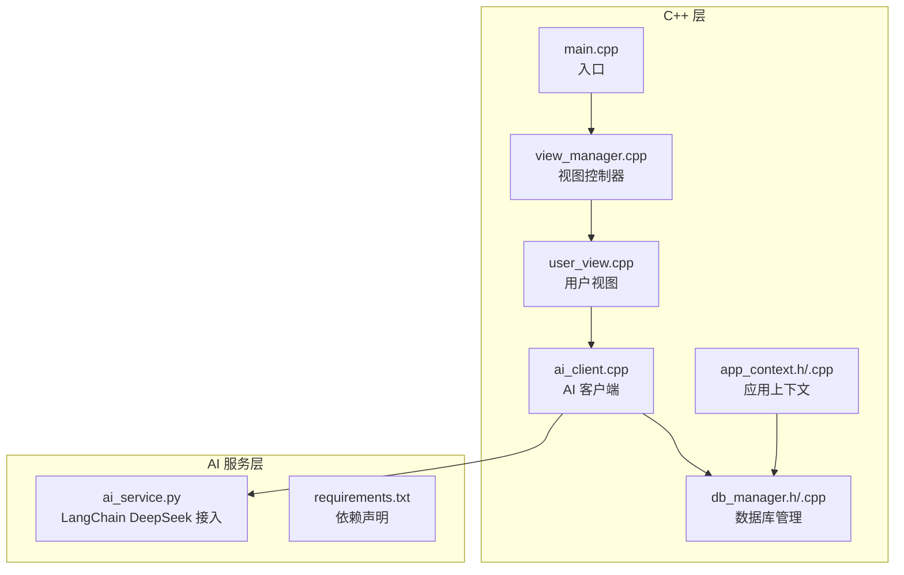
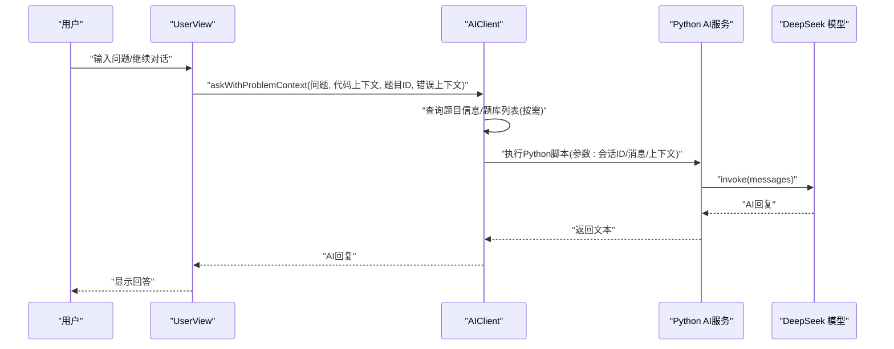
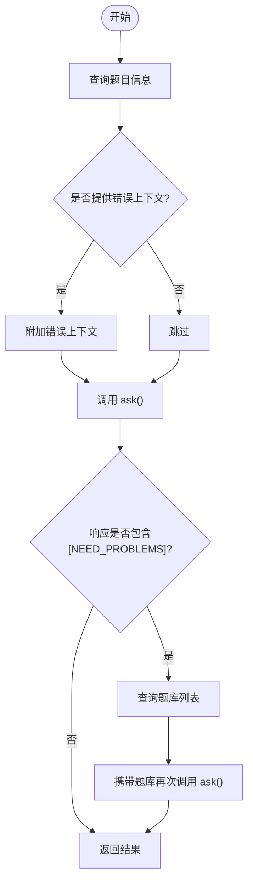
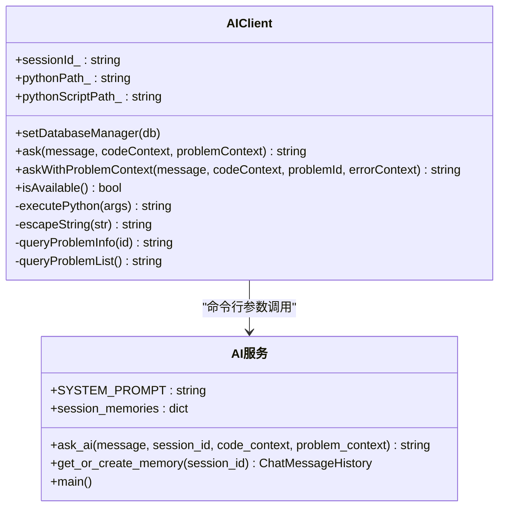
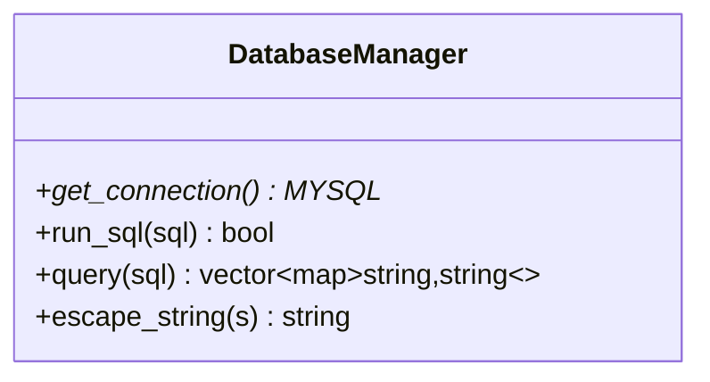
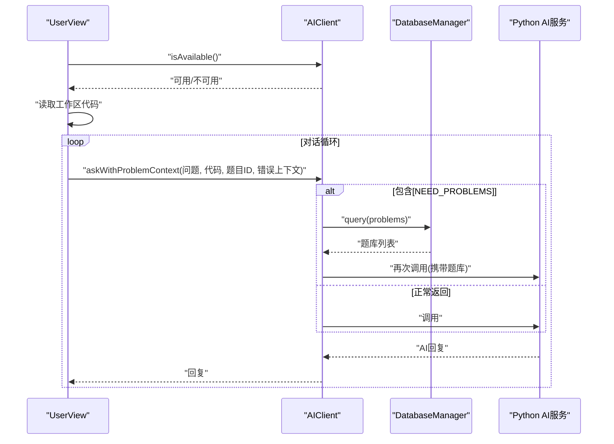
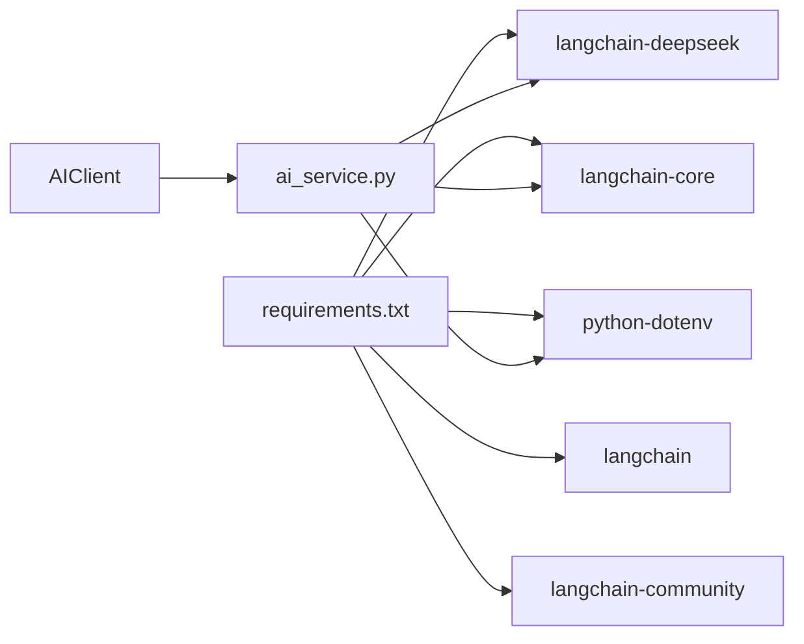

# AI智能辅助系统

<cite>
**本文引用的文件**
- [ai_service.py](file://ai/ai_service.py)
- [requirements.txt](file://ai/requirements.txt)
- [ai_client.h](file://include/ai_client.h)
- [ai_client.cpp](file://src/ai_client.cpp)
- [db_manager.h](file://include/db_manager.h)
- [db_manager.cpp](file://src/db_manager.cpp)
- [app_context.h](file://include/app_context.h)
- [app_context.cpp](file://src/app_context.cpp)
- [view_manager.h](file://include/view_manager.h)
- [view_manager.cpp](file://src/view_manager.cpp)
- [user_view.cpp](file://src/user_view.cpp)
- [main.cpp](file://src/main.cpp)
- [OJ_v1.0.md](file://History/OJ_v1.0.md)
</cite>

## 更新摘要
**变更内容**
- 更新Python依赖配置，移除langchain-azure依赖
- 更新AI服务集成说明，反映依赖简化后的架构
- 修正依赖分析章节，删除langchain-azure相关内容

## 目录
1. [简介](#简介)
2. [项目结构](#项目结构)
3. [核心组件](#核心组件)
4. [架构总览](#架构总览)
5. [详细组件分析](#详细组件分析)
6. [依赖分析](#依赖分析)
7. [性能考虑](#性能考虑)
8. [故障排查指南](#故障排查指南)
9. [结论](#结论)
10. [附录](#附录)

## 简介
本文件为"AI智能辅助系统"的综合技术文档，聚焦于AI集成架构设计、Python服务调用机制与DeepSeek API的集成方案，系统性阐述智能问答、代码分析、错误诊断等核心AI功能的实现原理，解释上下文管理机制、对话状态维护与用户交互优化，并提供AI客户端的API接口说明、参数配置与调用示例，以及性能优化、错误处理与降级策略、扩展性设计与新模型接入方法、使用示例与最佳实践。

## 项目结构
系统采用C++主程序+Python AI服务的双语言架构：C++负责业务流程控制、数据库访问与用户交互，Python负责AI推理与上下文记忆。AI服务通过命令行参数接收输入，调用DeepSeek模型完成推理，并将结果返回给C++客户端。

**图表来源**
- [main.cpp:1-14](file://src/main.cpp#L1-L14)
- [view_manager.cpp:1-78](file://src/view_manager.cpp#L1-L78)
- [user_view.cpp:293-344](file://src/user_view.cpp#L293-L344)
- [ai_client.cpp:1-196](file://src/ai_client.cpp#L1-L196)
- [db_manager.cpp:1-108](file://src/db_manager.cpp#L1-L108)
- [app_context.cpp:1-16](file://src/app_context.cpp#L1-L16)
- [ai_service.py:1-129](file://ai/ai_service.py#L1-L129)
- [requirements.txt:1-6](file://ai/requirements.txt#L1-L6)

**章节来源**
- [main.cpp:1-14](file://src/main.cpp#L1-L14)
- [view_manager.h:1-34](file://include/view_manager.h#L1-L34)
- [view_manager.cpp:1-78](file://src/view_manager.cpp#L1-L78)
- [user_view.cpp:293-344](file://src/user_view.cpp#L293-L344)
- [ai_client.h:1-49](file://include/ai_client.h#L1-L49)
- [ai_client.cpp:1-196](file://src/ai_client.cpp#L1-L196)
- [db_manager.h:1-51](file://include/db_manager.h#L1-L51)
- [db_manager.cpp:1-108](file://src/db_manager.cpp#L1-L108)
- [app_context.h:1-35](file://include/app_context.h#L1-L35)
- [app_context.cpp:1-16](file://src/app_context.cpp#L1-L16)
- [ai_service.py:1-129](file://ai/ai_service.py#L1-L129)
- [requirements.txt:1-6](file://ai/requirements.txt#L1-L6)

## 核心组件
- AI客户端（AIClient）
  - 负责构建调用参数、执行Python脚本、转义特殊字符、拼接题目与错误上下文、检测并按需补全题库列表、处理空响应与错误返回。
  - 关键接口：构造/析构、设置数据库管理器、ask、askWithProblemContext、isAvailable。
- 数据库管理（DatabaseManager）
  - 封装MySQL连接、SQL执行、查询结果解析、字符串转义，供AI客户端查询题目信息与题库列表。
- 应用上下文（AppContext）
  - 提供管理员与普通用户两种数据库连接工厂，统一管理数据库连接与全局配置。
- AI服务（ai_service.py）
  - 通过命令行参数接收消息、会话ID、代码上下文、题目上下文；加载环境变量DEEPSEEK_API_KEY；使用ChatDeepSeek模型；维护会话记忆；清洗输入；限制记忆长度；异常捕获与错误输出。
- 视图与交互（ViewManager/UserView）
  - 用户进入AI助手前进行可用性检查；支持循环对话、退出条件、读取工作区代码、展示AI回复；评测失败时自动附加错误上下文。

**章节来源**
- [ai_client.h:1-49](file://include/ai_client.h#L1-L49)
- [ai_client.cpp:1-196](file://src/ai_client.cpp#L1-L196)
- [db_manager.h:1-51](file://include/db_manager.h#L1-L51)
- [db_manager.cpp:1-108](file://src/db_manager.cpp#L1-L108)
- [app_context.h:1-35](file://include/app_context.h#L1-L35)
- [app_context.cpp:1-16](file://src/app_context.cpp#L1-L16)
- [ai_service.py:1-129](file://ai/ai_service.py#L1-L129)
- [user_view.cpp:293-344](file://src/user_view.cpp#L293-L344)

## 架构总览
系统采用"C++主控 + Python推理"的分层架构。C++侧负责用户交互、上下文拼接与错误联动，Python侧负责模型调用与会话记忆。二者通过命令行参数传递数据，实现解耦与可扩展。

**图表来源**
- [user_view.cpp:293-344](file://src/user_view.cpp#L293-L344)
- [ai_client.cpp:74-97](file://src/ai_client.cpp#L74-L97)
- [ai_service.py:109-124](file://ai/ai_service.py#L109-L124)

## 详细组件分析

### AI客户端（AIClient）
- 设计要点
  - 会话ID用于维持上下文连续性；默认会话名为"default"。
  - 支持三种上下文：用户消息、代码上下文、题目上下文；错误上下文在评测失败时由用户视图注入。
  - 自动检测[NEED_PROBLEMS]信号，按需查询题库列表并二次调用AI。
  - 命令行参数转义，防止注入与解析错误；使用popen读取Python输出。
- 关键流程
  - askWithProblemContext：查询题目信息 → 附加错误上下文 → 调用ask → 若含[NEED_PROBLEMS]则补题库后重试。
  - ask：拼接参数 → 执行Python脚本 → 处理空响应。
  - isAvailable：检查Python解释器与脚本文件是否存在。
- 错误处理
  - Python执行失败、空响应、异常均返回明确错误提示，便于前端展示与重试。

**图表来源**
- [ai_client.cpp:74-97](file://src/ai_client.cpp#L74-L97)
- [ai_client.cpp:35-72](file://src/ai_client.cpp#L35-L72)

**章节来源**
- [ai_client.h:1-49](file://include/ai_client.h#L1-L49)
- [ai_client.cpp:1-196](file://src/ai_client.cpp#L1-L196)

### AI服务（ai_service.py）
- 设计要点
  - 系统提示词采用"严师"模式，强调引导而非直接给答案；禁止提供完整可运行代码，仅允许伪代码或不超过3行的核心逻辑片段。
  - 会话记忆基于ChatMessageHistory，按会话ID隔离；限制记忆长度（最多20条消息，约10轮对话）。
  - 输入清洗：去除无效surrogate字符，避免编码问题导致的异常。
  - 参数：--message/--session/--code/--problem；返回纯文本。
- DeepSeek集成
  - 通过ChatDeepSeek模型调用deepseek-chat；从环境变量DEEPSEEK_API_KEY读取密钥；设置temperature与max_tokens。
- 错误处理
  - 未设置API Key时返回明确提示；异常捕获并输出到stderr，同时返回友好错误信息。

**图表来源**
- [ai_client.h:7-46](file://include/ai_client.h#L7-L46)
- [ai_client.cpp:128-184](file://src/ai_client.cpp#L128-L184)
- [ai_service.py:39-107](file://ai/ai_service.py#L39-L107)

**章节来源**
- [ai_service.py:1-129](file://ai/ai_service.py#L1-L129)
- [requirements.txt:1-6](file://ai/requirements.txt#L1-L6)

### 数据库管理（DatabaseManager）
- 设计要点
  - 封装MySQL连接生命周期；提供run_sql与query两类接口；escape_string用于防注入。
  - 查询结果以字段名映射的行集合返回，便于上下文拼接。
- 与AI客户端协作
  - 用于查询题目信息与题库列表，作为AI输入的一部分。

**图表来源**
- [db_manager.h:11-46](file://include/db_manager.h#L11-L46)
- [db_manager.cpp:54-85](file://src/db_manager.cpp#L54-L85)

**章节来源**
- [db_manager.h:1-51](file://include/db_manager.h#L1-L51)
- [db_manager.cpp:1-108](file://src/db_manager.cpp#L1-L108)

### 应用上下文（AppContext）
- 设计要点
  - 提供管理员与普通用户两种数据库连接工厂；统一管理数据库连接与全局配置。
- 与视图层协作
  - 视图层通过AppContext获取已配置好的DatabaseManager实例，避免重复创建与分散配置。

**章节来源**
- [app_context.h:1-35](file://include/app_context.h#L1-L35)
- [app_context.cpp:1-16](file://src/app_context.cpp#L1-L16)

### 用户交互与AI助手（UserView）
- 设计要点
  - AI助手入口：检查AI服务可用性；读取工作区代码；循环对话；支持退出指令；自动附加评测错误上下文。
  - 错误联动：评测失败时缓存错误上下文，进入AI助手后自动附加，提升针对性分析效果。
  - 题目推荐：若AI返回[NEED_PROBLEMS]，系统自动查询题库并重新调用AI，实现两阶段推荐。

**图表来源**
- [user_view.cpp:293-344](file://src/user_view.cpp#L293-L344)
- [ai_client.cpp:74-97](file://src/ai_client.cpp#L74-L97)
- [db_manager.cpp:54-85](file://src/db_manager.cpp#L54-L85)

**章节来源**
- [user_view.cpp:293-344](file://src/user_view.cpp#L293-L344)
- [OJ_v1.0.md:350-390](file://History/OJ_v1.0.md#L350-L390)

## 依赖分析
**更新** Python依赖经过清理，移除了langchain-azure，简化了AI服务的依赖结构。

- Python依赖
  - python-dotenv>=1.0.0：加载.env环境变量。
  - langchain>=0.1.0：LangChain核心能力。
  - langchain-core>=0.1.0：LangChain核心组件。
  - langchain-deepseek>=0.1.0：DeepSeek模型适配器。
  - langchain-community>=0.0.10：消息历史等社区组件。
  - **移除** langchain-azure：Azure相关组件（已移除）。
- C++与Python交互
  - 通过命令行参数传递：--session/--message/--code/--problem。
  - C++侧负责参数转义与执行，Python侧负责模型调用与会话记忆。

**图表来源**
- [requirements.txt:1-6](file://ai/requirements.txt#L1-L6)
- [ai_client.cpp:128-184](file://src/ai_client.cpp#L128-L184)
- [ai_service.py:9-16](file://ai/ai_service.py#L9-L16)

**章节来源**
- [requirements.txt:1-6](file://ai/requirements.txt#L1-L6)
- [ai_service.py:1-129](file://ai/ai_service.py#L1-L129)
- [ai_client.cpp:128-184](file://src/ai_client.cpp#L128-L184)

## 性能考虑
- 会话记忆限制
  - Python侧限制消息数量（最多20条），避免上下文过长导致延迟与成本上升。
- 上下文拼接优化
  - C++侧仅在必要时查询题库列表，减少不必要的数据库访问与网络往返。
- 命令行执行与缓冲
  - C++侧使用固定大小缓冲区读取Python输出，避免大文本阻塞；注意日志与错误输出分离。
- 环境变量与路径探测
  - C++侧优先尝试虚拟环境路径，失败时回退到上级目录，提高部署鲁棒性。
- 依赖简化带来的性能提升
  - 移除langchain-azure后，减少了不必要的依赖加载开销，提升了启动速度。
- 最佳实践
  - 控制单次消息长度与上下文总量，合理拆分复杂问题。
  - 在用户频繁切换题目时，及时清理或更换会话ID，避免上下文污染。
  - 对高频调用场景建议增加本地缓存策略（例如按问题ID+代码指纹缓存AI建议摘要）。

## 故障排查指南
- AI服务不可用
  - 现象：AI助手提示不可用。
  - 排查：确认Python解释器与脚本文件存在；检查工作目录与相对路径。
  - 参考
    - [ai_client.cpp:186-195](file://src/ai_client.cpp#L186-L195)
- API Key缺失
  - 现象：AI返回未设置DEEPSEEK_API_KEY。
  - 排查：确保环境变量DEEPSEEK_API_KEY已正确设置。
  - 参考
    - [ai_service.py:58-60](file://ai/ai_service.py#L58-L60)
- 空响应
  - 现象：AI返回空响应。
  - 排查：检查网络连通性、模型可用性；查看Python侧异常输出；确认参数转义正确。
  - 参考
    - [ai_client.cpp:177-181](file://src/ai_client.cpp#L177-L181)
    - [ai_service.py:87-90](file://ai/ai_service.py#L87-L90)
- 题目推荐未返回列表
  - 现象：AI返回[NEED_PROBLEMS]但未补全题库。
  - 排查：确认C++侧检测到信号并调用query；检查数据库连接与SQL执行。
  - 参考
    - [ai_client.cpp:90-94](file://src/ai_client.cpp#L90-L94)
    - [db_manager.cpp:54-85](file://src/db_manager.cpp#L54-L85)
- 编码与转义问题
  - 现象：中文乱码或命令行参数解析异常。
  - 排查：确认输入清洗与转义逻辑；检查终端编码与文件编码。
  - 参考
    - [ai_service.py:48-56](file://ai/ai_service.py#L48-L56)
    - [ai_client.cpp:99-126](file://src/ai_client.cpp#L99-L126)
- 依赖问题
  - 现象：Python环境报错或模块导入失败。
  - 排查：确认requirements.txt中的依赖版本兼容性；检查python-dotenv、langchain系列包的安装状态。
  - 参考
    - [requirements.txt:1-6](file://ai/requirements.txt#L1-L6)

**章节来源**
- [ai_client.cpp:177-195](file://src/ai_client.cpp#L177-L195)
- [ai_service.py:48-60](file://ai/ai_service.py#L48-L60)
- [db_manager.cpp:54-85](file://src/db_manager.cpp#L54-L85)
- [requirements.txt:1-6](file://ai/requirements.txt#L1-L6)

## 结论
本系统通过清晰的分层架构与严格的上下文管理，实现了稳定可靠的AI智能辅助能力。C++侧负责交互与上下文拼接，Python侧专注模型推理与记忆维护，二者通过命令行参数高效协同。系统具备完善的错误处理与降级策略，并支持按需扩展新模型与新功能。经过依赖清理后，系统更加轻量化，启动速度更快，维护成本更低。

## 附录

### AI客户端API接口说明
- 构造与析构
  - AIClient()
  - ~AIClient()
- 设置数据库管理器
  - setDatabaseManager(DatabaseManager *db)
- 发送消息
  - ask(const string &message, const string &codeContext = "", const string &problemContext = "") -> string
  - askWithProblemContext(const string &message, const string &codeContext, int problemId, const string &errorContext = "") -> string
- 可用性检查
  - isAvailable() -> bool

**章节来源**
- [ai_client.h:1-49](file://include/ai_client.h#L1-L49)
- [ai_client.cpp:1-196](file://src/ai_client.cpp#L1-L196)

### 参数配置与调用示例
- 环境变量
  - DEEPSEEK_API_KEY：DeepSeek API密钥
- 命令行参数（Python侧）
  - --message：用户问题
  - --session：会话ID
  - --code：代码上下文
  - --problem：题目上下文
- 示例流程
  - 用户输入问题 → C++侧拼接上下文 → 调用Python脚本 → 返回AI回复 → 展示给用户
- 参考
  - [ai_service.py:109-124](file://ai/ai_service.py#L109-L124)
  - [ai_client.cpp:157-184](file://src/ai_client.cpp#L157-L184)

**章节来源**
- [ai_service.py:109-124](file://ai/ai_service.py#L109-L124)
- [ai_client.cpp:157-184](file://src/ai_client.cpp#L157-L184)

### 扩展性设计与新模型接入
- 新模型接入步骤
  - 在Python侧新增模型适配器与调用逻辑；更新系统提示词与规则。
  - 在C++侧保持命令行参数不变，或通过环境变量切换模型。
- 上下文与规则扩展
  - 可在系统提示词中增加新规则；在C++侧扩展上下文拼接逻辑（如新增评测日志、语言特性等）。
- 依赖管理最佳实践
  - 保持依赖版本的向后兼容性；定期审查依赖安全性；移除不再使用的依赖。
- 参考
  - [ai_service.py:18-33](file://ai/ai_service.py#L18-L33)
  - [requirements.txt:1-6](file://ai/requirements.txt#L1-L6)

**章节来源**
- [ai_service.py:18-33](file://ai/ai_service.py#L18-L33)
- [requirements.txt:1-6](file://ai/requirements.txt#L1-L6)

### 使用示例与最佳实践
- 使用示例
  - 用户进入AI助手 → 输入问题 → 查看AI回复 → 继续对话直至满意 → 退出。
- 最佳实践
  - 控制上下文长度，避免超长输入影响性能与准确性。
  - 合理使用会话ID，避免跨用户上下文污染。
  - 在评测失败后自动附加错误上下文，提升诊断效率。
  - 定期检查并更新Python依赖，确保安全性和稳定性。
  - 参考
    - [user_view.cpp:293-344](file://src/user_view.cpp#L293-L344)
    - [OJ_v1.0.md:350-390](file://History/OJ_v1.0.md#L350-L390)

**章节来源**
- [user_view.cpp:293-344](file://src/user_view.cpp#L293-L344)
- [OJ_v1.0.md:350-390](file://History/OJ_v1.0.md#L350-L390)