# 异步并发评测架构

<cite>
**本文档引用的文件**
- [async_concurrent_judge_architecture.md](file://docs/async_concurrent_judge_architecture.md)
- [main.cpp](file://src/main.cpp)
- [judge_core.cpp](file://src/judge_core.cpp)
- [container_pool.cpp](file://src/container_pool.cpp)
- [sandbox_container.cpp](file://src/sandbox_container.cpp)
- [judge_core.h](file://include/judge_core.h)
- [container_pool.h](file://include/container_pool.h)
- [sandbox_container.h](file://include/sandbox_container.h)
- [db_manager.cpp](file://src/db_manager.cpp)
- [code_submission_design.md](file://docs/code_submission_design.md)
- [CMakeLists.txt](file://CMakeLists.txt)
- [docker-compose.yml](file://docker-compose.yml)
- [init.sql](file://init.sql)
</cite>

## 目录
1. [简介](#简介)
2. [项目结构](#项目结构)
3. [核心组件](#核心组件)
4. [架构概览](#架构概览)
5. [详细组件分析](#详细组件分析)
6. [依赖关系分析](#依赖关系分析)
7. [性能考量](#性能考量)
8. [故障排查指南](#故障排查指南)
9. [结论](#结论)
10. [附录](#附录)

## 简介

本项目是一个基于容器沙箱的在线评测系统，采用异步并发架构设计，支持多用户同时提交代码并进行评测。系统通过容器池管理、Redis队列调度和WebSocket实时推送，实现了高并发、可扩展的评测服务。

### 当前架构局限性

v1.0架构采用同步阻塞的评测模式，存在以下问题：
- 单线程阻塞：评测期间终端完全卡住，用户体验差
- 无并发支持：第二个用户提交时，第一个评测必须完成
- 无排队机制：容器池满载时直接失败，而非排队等待
- 无状态持久化：程序崩溃后，正在进行的评测结果丢失
- 单点终端：必须与服务器在同一终端交互，无法远程使用

### 升级目标

本次升级将v1.0从同步终端交互式演进为异步HTTP服务化架构，核心目标：
- 解耦交互与评测：终端只负责展示，评测引擎独立运行
- 支持高并发：多用户同时提交，评测任务异步排队执行
- 状态可恢复：评测中间状态持久化到Redis，崩溃后可恢复
- 远程可用：通过RESTful API + WebSocket支持任意客户端接入
- 资源可控：容器池满载时优雅排队，而非直接拒绝

## 项目结构

项目采用模块化设计，主要分为以下几个层次：

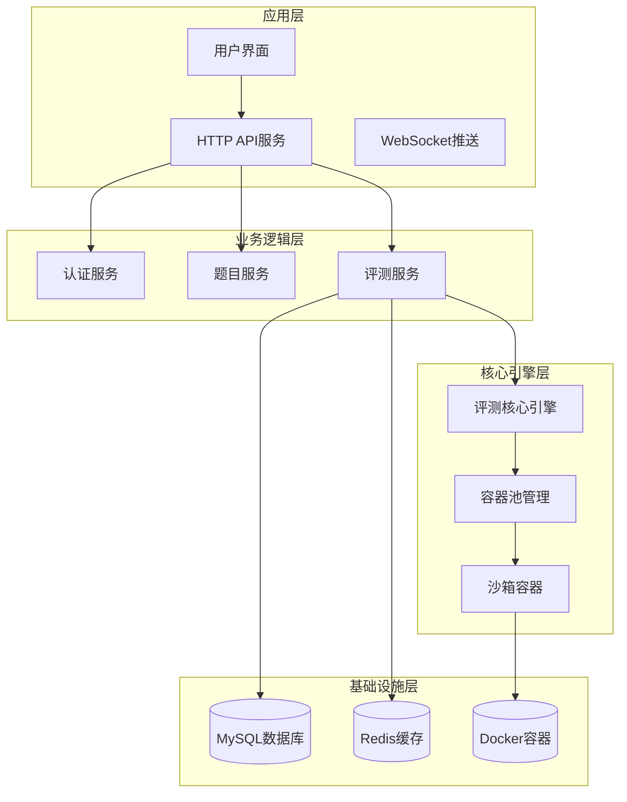

**图表来源**
- [async_concurrent_judge_architecture.md:64-117](file://docs/async_concurrent_judge_architecture.md#L64-L117)

### 文件组织结构

项目采用清晰的文件组织结构：

- **include/**: 头文件目录，包含所有公共接口定义
- **src/**: 源代码目录，包含具体的实现
- **docs/**: 文档目录，包含设计文档和技术规范
- **data/**: 测试数据目录，包含各题目的输入输出文件
- **workspace/**: 用户工作区目录，存储用户代码文件

**章节来源**
- [CMakeLists.txt:1-40](file://CMakeLists.txt#L1-L40)
- [docker-compose.yml:1-81](file://docker-compose.yml#L1-L81)

## 核心组件

### 评测核心引擎

评测核心引擎是系统的核心组件，负责代码编译、运行和结果判定。

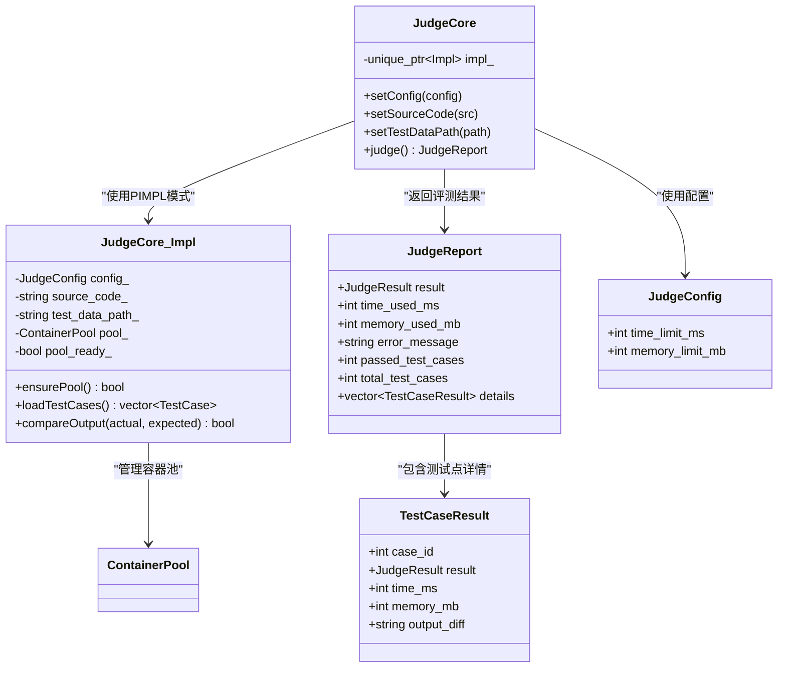

**图表来源**
- [judge_core.h:60-104](file://include/judge_core.h#L60-L104)
- [judge_core.cpp:12-74](file://src/judge_core.cpp#L12-L74)

### 容器池管理系统

容器池管理系统负责容器的创建、管理和调度，支持常驻容器和临时容器的混合管理模式。

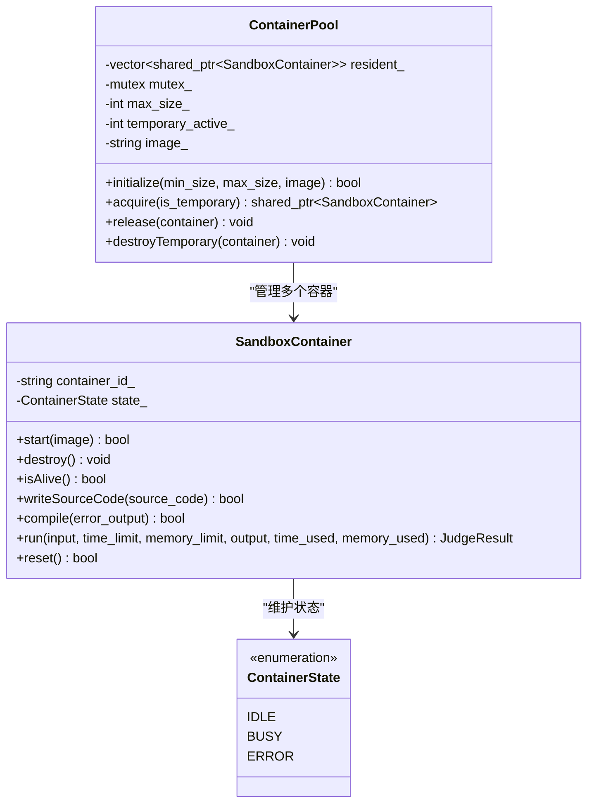

**图表来源**
- [container_pool.h:21-76](file://include/container_pool.h#L21-L76)
- [sandbox_container.h:26-111](file://include/sandbox_container.h#L26-L111)

### 数据库管理器

数据库管理器提供统一的数据库连接管理和SQL执行接口。

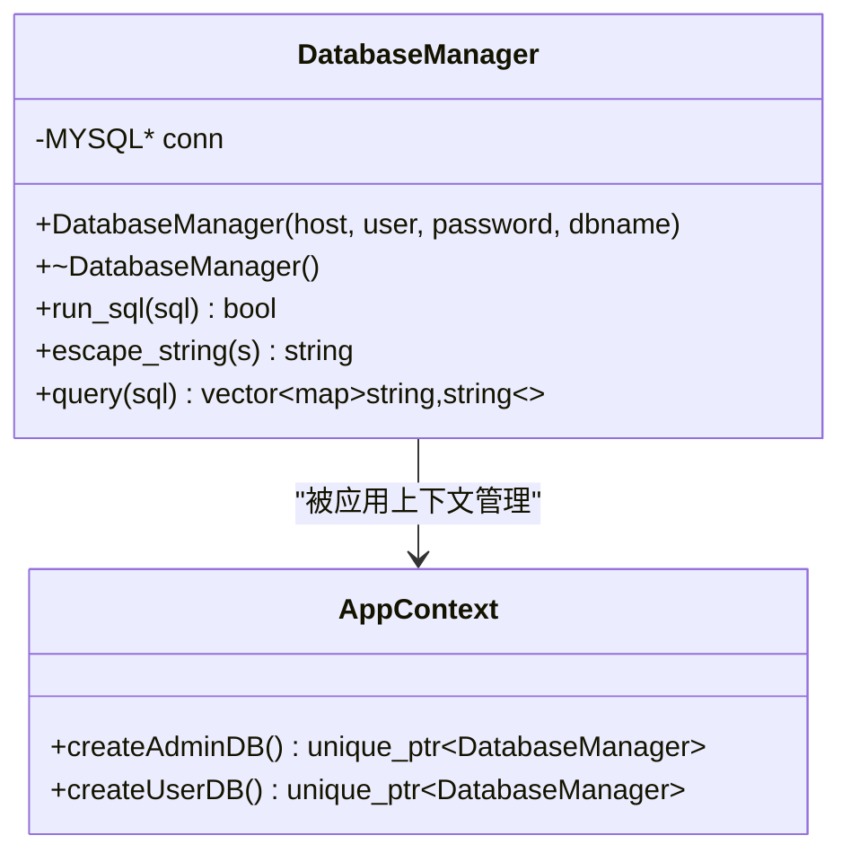

**图表来源**
- [db_manager.cpp:9-52](file://src/db_manager.cpp#L9-L52)
- [app_context.h:15-34](file://include/app_context.h#L15-L34)

**章节来源**
- [judge_core.cpp:78-202](file://src/judge_core.cpp#L78-L202)
- [container_pool.cpp:26-121](file://src/container_pool.cpp#L26-L121)
- [sandbox_container.cpp:62-187](file://src/sandbox_container.cpp#L62-L187)
- [db_manager.cpp:9-108](file://src/db_manager.cpp#L9-L108)

## 架构概览

系统采用分层架构设计，从上到下分为应用层、业务逻辑层、核心引擎层和基础设施层。

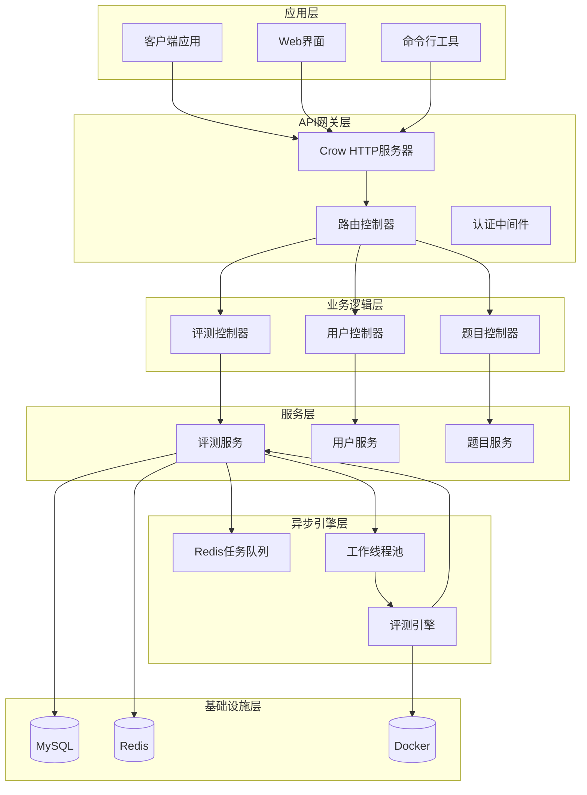

**图表来源**
- [async_concurrent_judge_architecture.md:64-117](file://docs/async_concurrent_judge_architecture.md#L64-L117)

### 异步评测处理流程

系统采用异步评测模式，用户提交代码后立即返回，评测在后台异步执行。

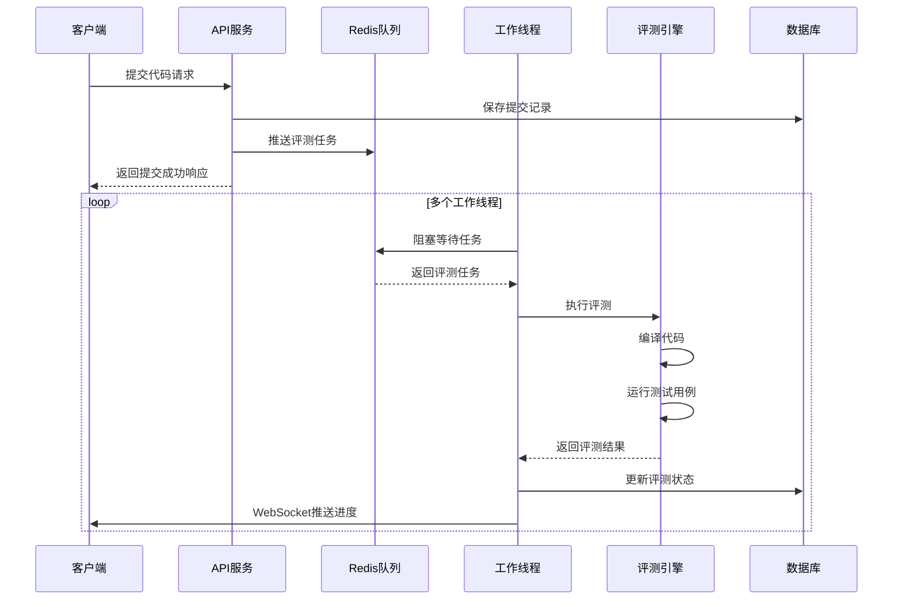

**图表来源**
- [async_concurrent_judge_architecture.md:119-157](file://docs/async_concurrent_judge_architecture.md#L119-L157)

**章节来源**
- [async_concurrent_judge_architecture.md:62-187](file://docs/async_concurrent_judge_architecture.md#L62-L187)

## 详细组件分析

### 评测状态管理

系统实现了完整的评测状态管理机制，支持多种评测状态的转换。

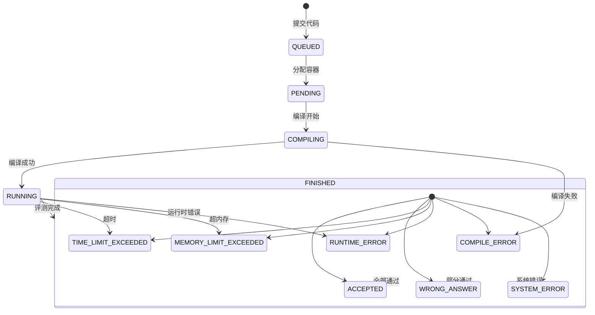

**图表来源**
- [async_concurrent_judge_architecture.md:159-172](file://docs/async_concurrent_judge_architecture.md#L159-L172)

### Redis数据结构设计

系统使用Redis作为消息队列、状态缓存和会话存储，采用多种数据结构满足不同需求。

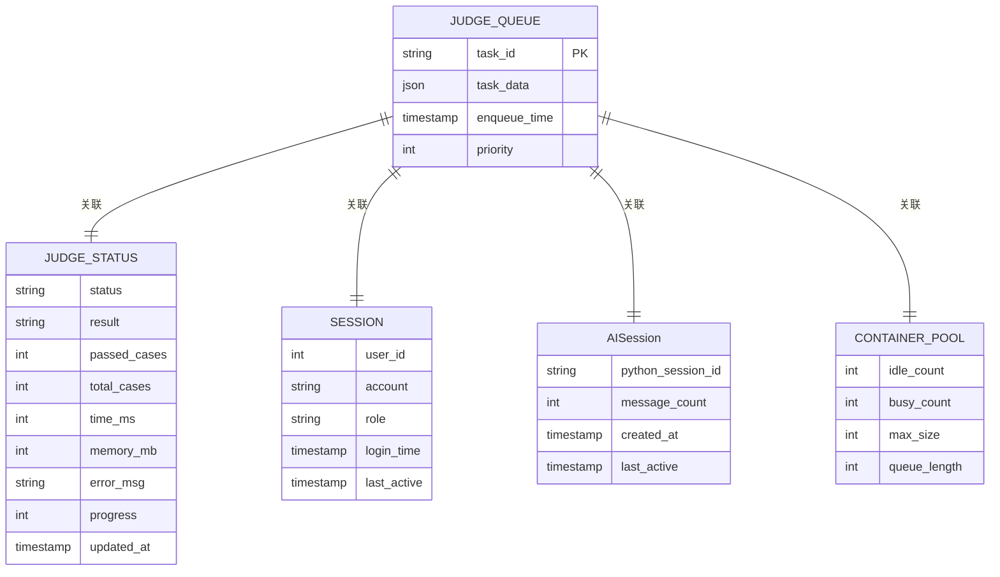

**图表来源**
- [async_concurrent_judge_architecture.md:189-300](file://docs/async_concurrent_judge_architecture.md#L189-L300)

### 容器池调度策略

容器池采用混合调度策略，结合常驻容器和临时容器的优势。

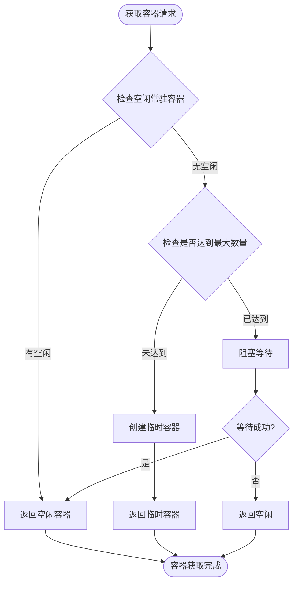

**图表来源**
- [container_pool.cpp:52-89](file://src/container_pool.cpp#L52-L89)

**章节来源**
- [async_concurrent_judge_architecture.md:189-300](file://docs/async_concurrent_judge_architecture.md#L189-L300)
- [container_pool.cpp:26-121](file://src/container_pool.cpp#L26-L121)

### WebSocket实时推送

系统通过WebSocket实现实时进度推送，提升用户体验。

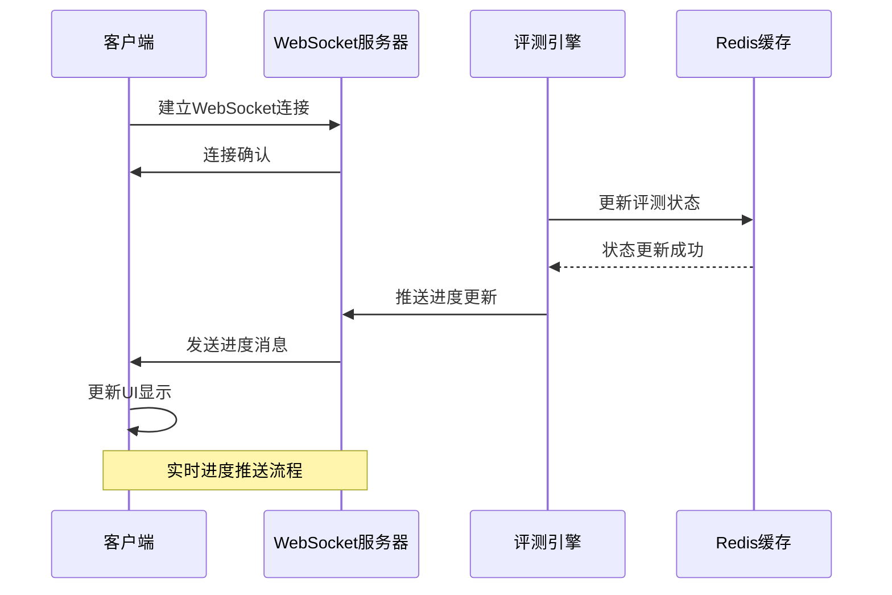

**图表来源**
- [async_concurrent_judge_architecture.md:521-560](file://docs/async_concurrent_judge_architecture.md#L521-L560)

## 依赖关系分析

系统采用模块化设计，各组件之间通过清晰的接口进行交互。

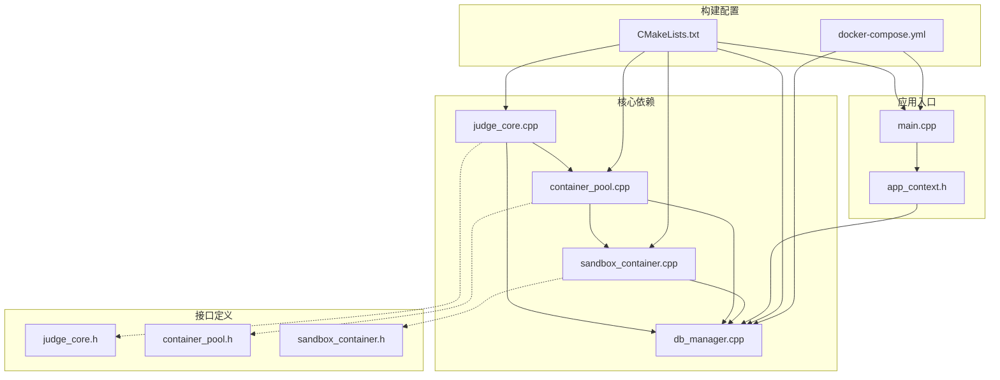

**图表来源**
- [CMakeLists.txt:24-34](file://CMakeLists.txt#L24-L34)
- [docker-compose.yml:42-71](file://docker-compose.yml#L42-L71)

### 外部依赖

系统依赖的主要外部组件：

- **Crow**: 轻量级C++ Web框架，提供HTTP服务和WebSocket支持
- **MySQL**: 关系型数据库，存储用户信息和提交记录
- **Redis**: 内存数据库，作为消息队列和缓存
- **Docker**: 容器技术，提供代码执行沙箱环境
- **OpenSSL**: 加密库，用于密码哈希和安全通信

**章节来源**
- [CMakeLists.txt:11-34](file://CMakeLists.txt#L11-L34)
- [docker-compose.yml:13-81](file://docker-compose.yml#L13-L81)

## 性能考量

### 并发控制策略

系统采用多种并发控制策略确保高并发场景下的稳定性：

1. **容器池并发控制**: 使用互斥锁和条件变量保护容器池状态
2. **数据库连接池**: 限制最大连接数，避免数据库过载
3. **Redis连接池**: 提供高性能的缓存访问
4. **工作线程池**: 控制同时执行的评测任务数量

### 资源管理优化

- **容器复用**: 常驻容器在评测完成后重置状态，避免重复创建
- **内存管理**: 使用智能指针管理容器生命周期
- **文件系统隔离**: 用户代码存储在独立目录，避免相互影响

### 缓存策略

系统采用多层次缓存策略：
- Redis缓存：存储评测状态和会话信息，提供纳秒级访问速度
- 数据库缓存：存储持久化数据，确保数据一致性
- 文件系统缓存：存储用户工作区代码

## 故障排查指南

### 常见问题诊断

1. **容器启动失败**
   - 检查Docker守护进程状态
   - 验证Docker socket权限
   - 确认容器镜像可用性

2. **评测任务积压**
   - 检查Redis队列状态
   - 监控工作线程池负载
   - 验证容器池配置

3. **数据库连接异常**
   - 检查MySQL服务状态
   - 验证连接池配置
   - 监控连接数使用情况

### 日志分析

系统提供详细的日志记录：
- 容器生命周期日志
- 评测过程日志
- 错误处理日志
- 性能监控日志

**章节来源**
- [sandbox_container.cpp:62-100](file://src/sandbox_container.cpp#L62-L100)
- [container_pool.cpp:26-48](file://src/container_pool.cpp#L26-L48)

## 结论

本异步并发评测架构通过容器沙箱技术和Redis队列调度，实现了高并发、可扩展的在线评测服务。系统具有以下优势：

1. **高并发支持**: 通过异步处理和容器池管理，支持多用户同时评测
2. **资源隔离**: Docker容器提供强隔离的代码执行环境
3. **状态持久化**: Redis缓存确保评测状态的可靠存储
4. **实时反馈**: WebSocket推送提供即时的评测进度反馈
5. **可扩展性**: 模块化设计便于功能扩展和性能优化

该架构为在线评测系统提供了坚实的技术基础，能够满足大规模用户并发评测的需求。

## 附录

### API接口规范

系统提供完整的RESTful API接口，支持用户认证、题目查询、代码评测等功能。

### 部署配置

系统支持Docker容器化部署，提供一键部署能力，包含数据库、应用服务和评测沙箱的完整编排。

### 数据库设计

系统采用关系型数据库存储用户信息和评测记录，提供完整的数据模型和索引优化。