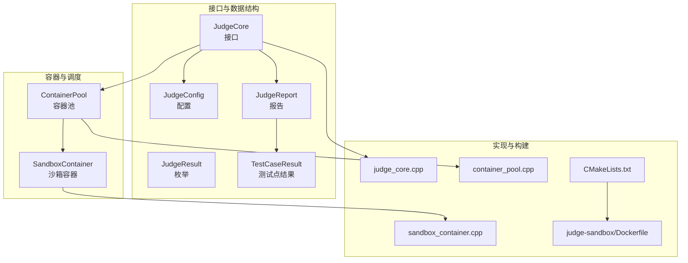
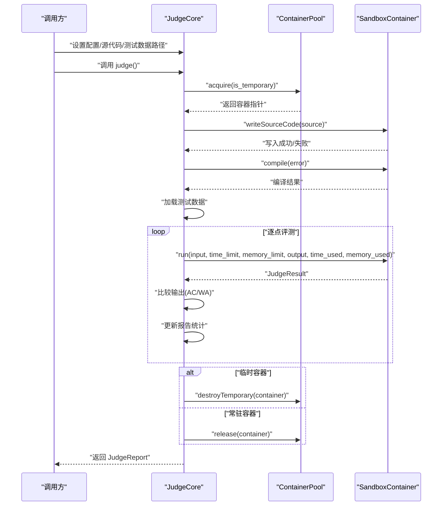
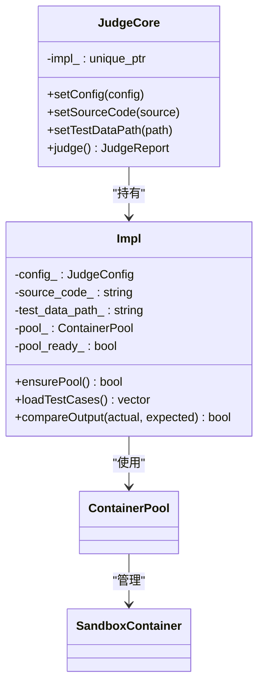
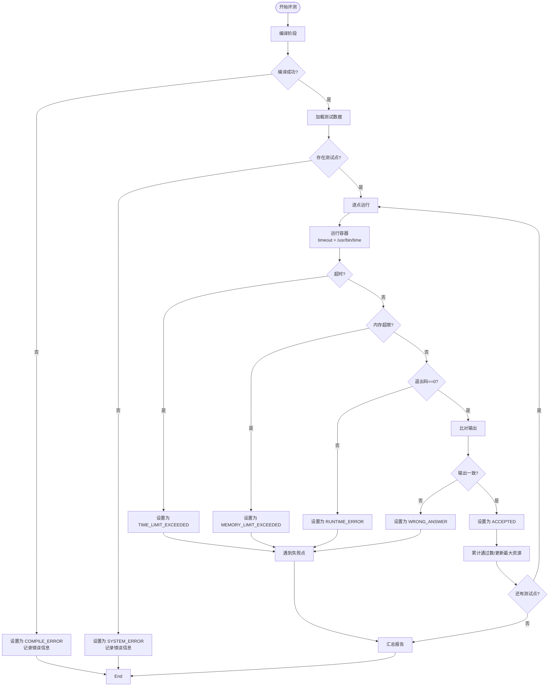
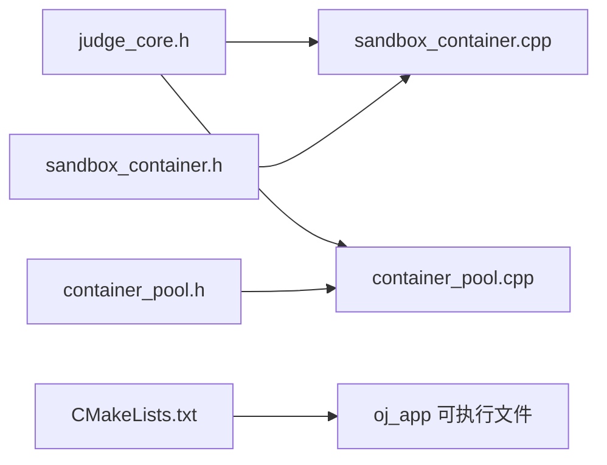
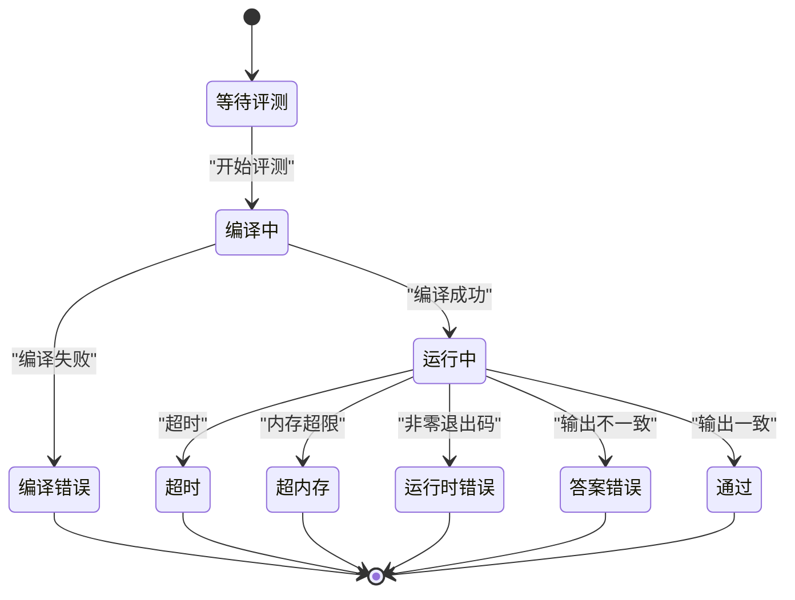

# 评测引擎设计

<cite>
**本文引用的文件**
- [judge_core.h](file://include/judge_core.h)
- [judge_core.cpp](file://src/judge_core.cpp)
- [sandbox_container.h](file://include/sandbox_container.h)
- [sandbox_container.cpp](file://src/sandbox_container.cpp)
- [container_pool.h](file://include/container_pool.h)
- [container_pool.cpp](file://src/container_pool.cpp)
- [judge_implementation_plan.md](file://docs/judge_implementation_plan.md)
- [CMakeLists.txt](file://CMakeLists.txt)
- [Dockerfile](file://judge-sandbox/Dockerfile)
</cite>

## 目录
1. [引言](#引言)
2. [项目结构](#项目结构)
3. [核心组件](#核心组件)
4. [架构总览](#架构总览)
5. [详细组件分析](#详细组件分析)
6. [依赖关系分析](#依赖关系分析)
7. [性能考量](#性能考量)
8. [故障排查指南](#故障排查指南)
9. [结论](#结论)
10. [附录](#附录)

## 引言
本文件面向评测引擎的设计与实现，围绕 JudgeCore 类的架构设计展开，重点阐释以下方面：
- PIMPL 模式的应用与私有实现类的设计原则
- 评测结果枚举类型 JudgeResult 的设计思路与状态转换逻辑
- 评测配置结构体 JudgeConfig 的作用与资源限制设置机制
- 评测报告结构体 JudgeReport 的组织方式与统计字段
- 评测引擎的配置接口与使用示例
- 评测流程的状态机设计与错误处理机制

## 项目结构
该项目采用模块化与分层设计，核心评测逻辑集中在 JudgeCore 及其私有实现类中，容器生命周期与资源限制由 SandboxContainer 与 ContainerPool 提供，接口与数据结构定义位于头文件中，构建系统通过 CMake 管理。

图表来源
- [judge_core.h:1-104](file://include/judge_core.h#L1-L104)
- [judge_core.cpp:1-202](file://src/judge_core.cpp#L1-L202)
- [sandbox_container.h:1-111](file://include/sandbox_container.h#L1-L111)
- [sandbox_container.cpp:1-187](file://src/sandbox_container.cpp#L1-L187)
- [container_pool.h:1-76](file://include/container_pool.h#L1-L76)
- [container_pool.cpp:1-121](file://src/container_pool.cpp#L1-L121)
- [CMakeLists.txt:1-40](file://CMakeLists.txt#L1-L40)
- [Dockerfile:1-29](file://judge-sandbox/Dockerfile#L1-L29)

章节来源
- [CMakeLists.txt:1-40](file://CMakeLists.txt#L1-L40)

## 核心组件
- JudgeCore：对外评测接口，采用 PIMPL 模式隐藏实现细节，提供配置与评测入口。
- SandboxContainer：封装单个 Docker 容器的生命周期与文件交互，负责编译与运行。
- ContainerPool：容器池管理器，负责常驻容器预热、临时容器按需创建与回收。
- JudgeResult/JudgeConfig/JudgeReport/TestCaseResult：评测状态、配置、报告与测试点结果的数据模型。

章节来源
- [judge_core.h:1-104](file://include/judge_core.h#L1-L104)
- [sandbox_container.h:1-111](file://include/sandbox_container.h#L1-L111)
- [container_pool.h:1-76](file://include/container_pool.h#L1-L76)

## 架构总览
评测引擎以 JudgeCore 为核心，通过 ContainerPool 获取可用的 SandboxContainer，完成源代码写入、编译、逐点运行与结果汇总，最终产出 JudgeReport。容器池采用“常驻 + 临时”混合策略，结合线程安全与资源限制，保证评测的稳定性与性能。

图表来源
- [judge_core.cpp:85-201](file://src/judge_core.cpp#L85-L201)
- [container_pool.cpp:52-89](file://src/container_pool.cpp#L52-L89)
- [sandbox_container.cpp:127-178](file://src/sandbox_container.cpp#L127-L178)

## 详细组件分析

### JudgeCore 与 PIMPL 设计
- PIMPL 模式：JudgeCore 仅暴露公共接口，内部通过 unique_ptr<Impl> 持有实现细节，提升封装性与可维护性。
- 私有实现类 Impl：持有配置、源代码、测试数据路径、容器池实例与惰性初始化标志；提供测试数据加载与输出对比等辅助逻辑。
- 惰性初始化：ensurePool 在首次评测时初始化容器池，避免无评测场景下的资源浪费。
- 禁止拷贝：通过删除拷贝构造与赋值操作，确保资源安全与语义清晰。

图表来源
- [judge_core.h:60-101](file://include/judge_core.h#L60-L101)
- [judge_core.cpp:12-74](file://src/judge_core.cpp#L12-L74)
- [container_pool.h:21-73](file://include/container_pool.h#L21-L73)

章节来源
- [judge_core.h:60-101](file://include/judge_core.h#L60-L101)
- [judge_core.cpp:12-28](file://src/judge_core.cpp#L12-L28)

### 评测结果枚举 JudgeResult 的设计与状态转换
- 设计目标：覆盖评测全流程的关键状态，便于统一处理与展示。
- 状态定义与含义：
  - PENDING：等待评测
  - COMPILING：编译中
  - RUNNING：运行中
  - ACCEPTED：通过（AC）
  - WRONG_ANSWER：答案错误（WA）
  - TIME_LIMIT_EXCEEDED：超时（TLE）
  - MEMORY_LIMIT_EXCEEDED：超内存（MLE）
  - RUNTIME_ERROR：运行时错误（RE）
  - COMPILE_ERROR：编译错误（CE）
  - SYSTEM_ERROR：系统错误（SE）

- 状态转换逻辑（基于实现）：
  - 编译阶段：先置为 COMPILING，编译失败则转为 COMPILE_ERROR 并携带错误信息。
  - 运行阶段：根据容器运行结果与资源使用判断：
    - 超时：TIME_LIMIT_EXCEEDED
    - 内存超限：MEMORY_LIMIT_EXCEEDED
    - 非零退出码：RUNTIME_ERROR
    - 成功：进一步比对输出，相等为 ACCEPTED，否则为 WRONG_ANSWER
  - 测试点失败时，整体结果采用首个失败点的结果；通过时累计通过数并更新最大时间/内存。

图表来源
- [judge_core.cpp:114-193](file://src/judge_core.cpp#L114-L193)
- [sandbox_container.cpp:127-178](file://src/sandbox_container.cpp#L127-L178)

章节来源
- [judge_core.h:9-22](file://include/judge_core.h#L9-L22)
- [judge_core.cpp:114-193](file://src/judge_core.cpp#L114-L193)
- [sandbox_container.cpp:127-178](file://src/sandbox_container.cpp#L127-L178)

### 评测配置结构体 JudgeConfig
- 字段与含义：
  - time_limit_ms：时间限制（毫秒）
  - memory_limit_mb：内存限制（MB）
- 设置机制：
  - 通过 JudgeCore::setConfig 注入，随后在 SandboxContainer::run 中作为运行时限制传入。
  - 容器内使用 timeout 与 /usr/bin/time 实现时间与内存的双重限制与统计。

章节来源
- [judge_core.h:24-29](file://include/judge_core.h#L24-L29)
- [judge_core.cpp:154-160](file://src/judge_core.cpp#L154-L160)
- [sandbox_container.cpp:127-178](file://src/sandbox_container.cpp#L127-L178)

### 评测报告结构体 JudgeReport 与测试点结果 TestCaseResult
- JudgeReport 字段与含义：
  - result：总体评测结果
  - time_used_ms：最大时间使用（毫秒）
  - memory_used_mb：最大内存使用（MB）
  - error_message：错误信息（如 CE/RE 等）
  - passed_test_cases：通过的测试点数量
  - total_test_cases：总测试点数量
  - details：每个测试点的详细结果
- TestCaseResult 字段与含义：
  - case_id：测试点编号
  - result：该点结果
  - time_ms：时间使用（ms）
  - memory_mb：内存使用（MB）
  - output_diff：差异信息（WA 时，用于帮助定位错误）

章节来源
- [judge_core.h:41-51](file://include/judge_core.h#L41-L51)
- [judge_core.cpp:148-193](file://src/judge_core.cpp#L148-L193)

### SandboxContainer：容器封装与运行
- 生命周期与安全：
  - 常驻模式：容器以 “sleep infinity” 保持存活，评测通过 docker exec 在容器内执行编译/运行。
  - 安全选项：禁网、只读根文件系统、丢弃所有 capabilities、tmpfs 沙箱目录、非特权用户等。
- 接口职责：
  - start(image)：启动常驻容器
  - writeSourceCode(source)：写入源代码至 /sandbox/main.cpp
  - compile(error_output)：编译并返回错误信息
  - run(input, time_limit_ms, memory_limit_mb, output, time_used_ms, memory_used_mb)：运行并返回 JudgeResult
  - reset()：清理 /sandbox/ 并置空闲
  - destroy()/isAlive()：销毁与健康检查
- 资源限制与统计：
  - 使用 timeout 控制时间，/usr/bin/time 输出 elapsed_sec 与 peak_kb，转换为毫秒与 MB。

章节来源
- [sandbox_container.h:16-83](file://include/sandbox_container.h#L16-L83)
- [sandbox_container.cpp:62-178](file://src/sandbox_container.cpp#L62-L178)
- [Dockerfile:1-29](file://judge-sandbox/Dockerfile#L1-L29)

### ContainerPool：容器池管理与调度
- 调度策略：
  - 预创建 min_size 个常驻容器，优先分配空闲且存活的常驻容器
  - 常驻全忙时，若未达 max_size，则创建临时容器（评测结束后销毁）
  - 同时存在的容器总数不超过 max_size
- 线程安全：
  - 使用互斥锁保护容器列表与计数，acquire/release/destroyTemporary 均在临界区内更新共享状态
- 常驻容器复用：
  - 归还时 reset() 清理 /sandbox/ 并置空闲，避免销毁与重建

章节来源
- [container_pool.h:11-73](file://include/container_pool.h#L11-L73)
- [container_pool.cpp:26-121](file://src/container_pool.cpp#L26-L121)

### 评测流程状态机与错误处理
- 状态机：
  - 编译阶段：COMPILING -> COMPILE_ERROR 或 ACCEPTED
  - 运行阶段：逐点运行 -> TLE/MLE/RE/AC，首个失败即停止
  - 汇总阶段：更新最大资源与通过数，归还或销毁容器
- 错误处理：
  - 容器池初始化失败：返回 SYSTEM_ERROR 并记录错误
  - 无可用容器：返回 SYSTEM_ERROR 并记录错误
  - 写入源代码失败：返回 SYSTEM_ERROR 并释放容器
  - 测试数据缺失：返回 SYSTEM_ERROR 并记录路径
  - 临时容器用后销毁，常驻容器 reset 后归还

章节来源
- [judge_core.cpp:90-139](file://src/judge_core.cpp#L90-L139)
- [container_pool.cpp:52-89](file://src/container_pool.cpp#L52-L89)

## 依赖关系分析
- 头文件依赖：
  - judge_core.h 依赖 sandbox_container.h（用于 JudgeResult/JudgeConfig/JudgeReport 的使用）
  - container_pool.h 依赖 sandbox_container.h（返回 shared_ptr<SandboxContainer>）
- 实现文件依赖：
  - judge_core.cpp 依赖 container_pool.h（容器池）
  - sandbox_container.cpp 依赖 judge_core.h（返回 JudgeResult）
  - container_pool.cpp 依赖 sandbox_container.h（创建与管理）
- 构建依赖：
  - CMakeLists.txt 指定 C++17 标准、包含目录与链接库，生成可执行文件

图表来源
- [judge_core.h:1-10](file://include/judge_core.h#L1-L10)
- [sandbox_container.h:1-10](file://include/sandbox_container.h#L1-L10)
- [container_pool.h:1-10](file://include/container_pool.h#L1-L10)
- [CMakeLists.txt:17-34](file://CMakeLists.txt#L17-L34)

章节来源
- [CMakeLists.txt:1-40](file://CMakeLists.txt#L1-L40)

## 性能考量
- 容器预热：启动时预创建常驻容器，降低首次评测延迟
- 常驻容器复用：评测完成后 reset() 清理而非销毁，减少容器创建开销
- 临时容器按需创建：在并发压力下动态扩容，上限受 max_size 限制
- 精确计时与内存统计：使用 timeout 与 /usr/bin/time，避免外部监控带来的额外开销
- 线程安全：容器池使用互斥锁保护共享状态，避免竞态条件

章节来源
- [container_pool.cpp:26-48](file://src/container_pool.cpp#L26-L48)
- [container_pool.cpp:93-99](file://src/container_pool.cpp#L93-L99)
- [sandbox_container.cpp:137-178](file://src/sandbox_container.cpp#L137-L178)

## 故障排查指南
- 容器池初始化失败
  - 现象：评测返回 SYSTEM_ERROR，错误信息提示 Docker 不可用
  - 排查：确认 Docker 服务运行、权限正确、镜像 judge-sandbox:latest 可用
- 无可用容器
  - 现象：评测返回 SYSTEM_ERROR，提示系统繁忙
  - 排查：检查 max_size 与当前活跃容器数，确认常驻容器是否存活
- 写入源代码失败
  - 现象：评测返回 SYSTEM_ERROR
  - 排查：检查源代码长度、容器磁盘空间、容器状态
- 测试数据缺失
  - 现象：评测返回 SYSTEM_ERROR，提示未找到测试数据
  - 排查：确认测试数据路径存在且包含连续编号的 .in/.out 文件
- 超时/超内存/运行时错误
  - 现象：逐点运行返回 TLE/MLE/RE
  - 排查：调整 time_limit_ms 与 memory_limit_mb；检查程序逻辑与输入输出格式

章节来源
- [judge_core.cpp:90-139](file://src/judge_core.cpp#L90-L139)
- [sandbox_container.cpp:127-178](file://src/sandbox_container.cpp#L127-L178)

## 结论
本评测引擎通过 JudgeCore 的 PIMPL 设计实现了良好的接口稳定性与实现隔离，结合 ContainerPool 的“常驻 + 临时”容器调度策略与 SandboxContainer 的安全隔离与资源限制，形成了高效、稳定、可扩展的评测体系。JudgeResult 的状态设计与 JudgeReport 的统计结构为结果呈现与后续处理提供了清晰的数据基础。

## 附录

### 配置接口与使用示例
- 配置接口
  - setConfig(JudgeConfig)：设置时间/内存限制等配置
  - setSourceCode(string)：设置待评测源代码
  - setTestDataPath(string)：设置测试数据目录（包含 .in/.out 文件）
  - judge()：执行评测并返回 JudgeReport
- 使用步骤
  - 创建 JudgeCore 实例
  - 设置 JudgeConfig（time_limit_ms、memory_limit_mb）
  - 设置源代码与测试数据路径
  - 调用 judge() 获取报告
  - 根据 JudgeReport.result 与 details 处理结果

章节来源
- [judge_core.h:66-92](file://include/judge_core.h#L66-L92)
- [judge_core.cpp:81-84](file://src/judge_core.cpp#L81-L84)
- [judge_core.cpp:85-201](file://src/judge_core.cpp#L85-L201)

### 评测流程状态机图（概念示意）

[此图为概念示意，不直接映射具体源文件，故不附图表来源]