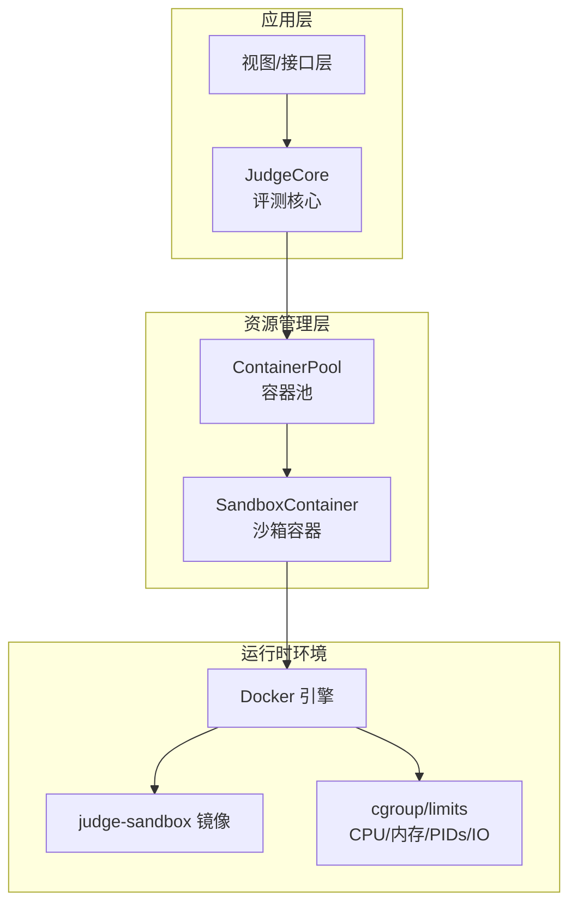
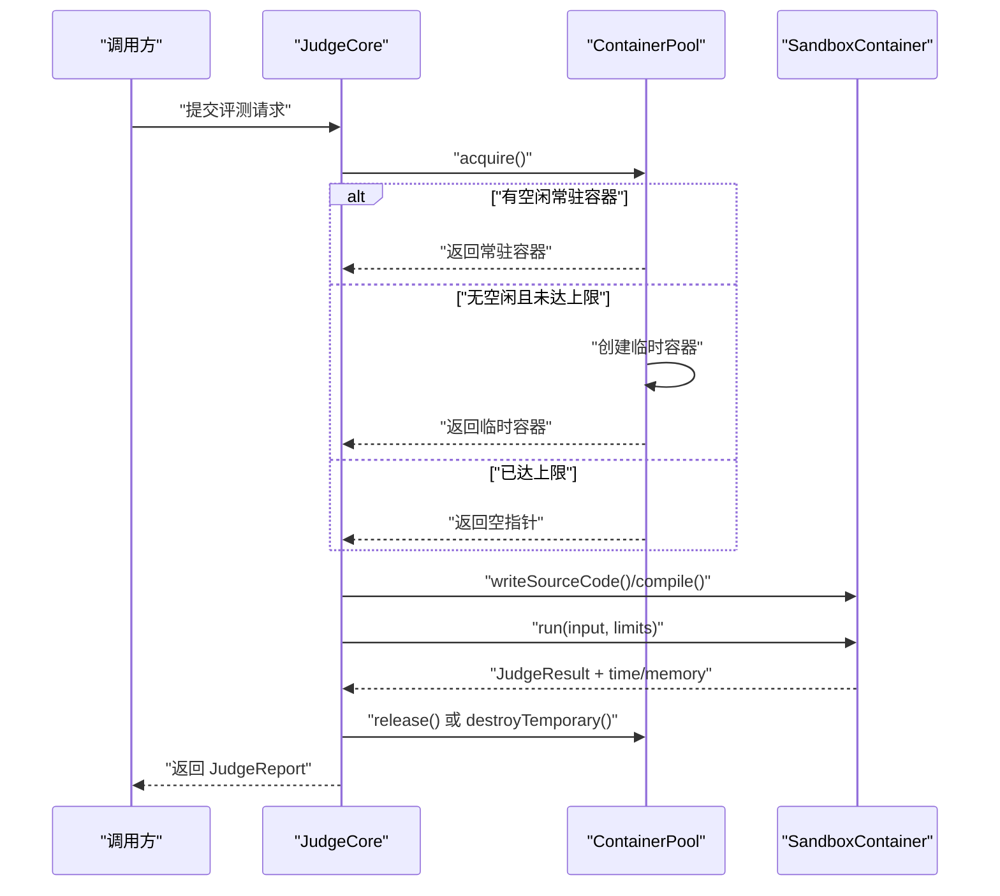
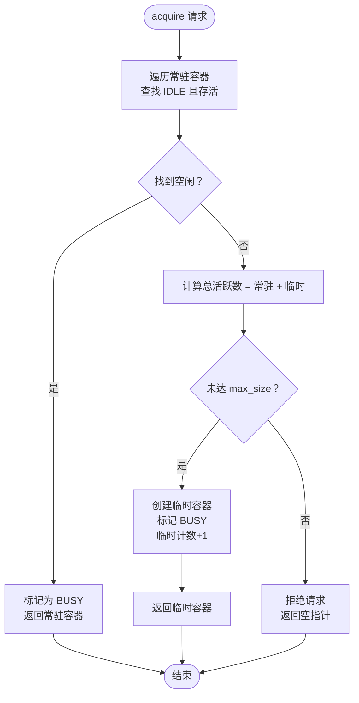
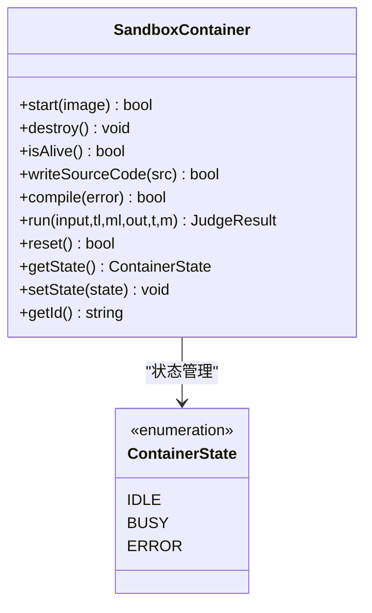
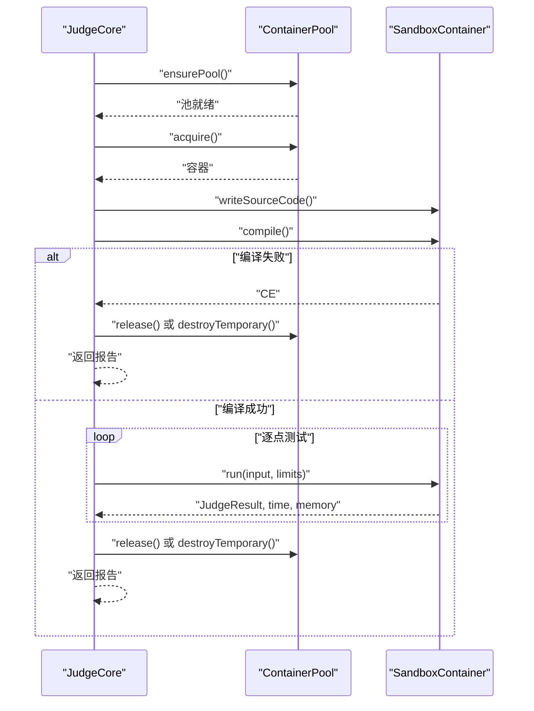
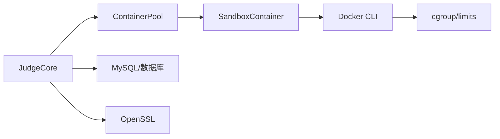

# 资源管理与监控

<cite>
**本文引用的文件**
- [container_pool.h](file://include/container_pool.h)
- [container_pool.cpp](file://src/container_pool.cpp)
- [sandbox_container.h](file://include/sandbox_container.h)
- [sandbox_container.cpp](file://src/sandbox_container.cpp)
- [judge_core.h](file://include/judge_core.h)
- [judge_core.cpp](file://src/judge_core.cpp)
- [Dockerfile（评测沙箱）](file://judge-sandbox/Dockerfile)
- [docker-compose.yml](file://docker-compose.yml)
- [CMakeLists.txt](file://CMakeLists.txt)
- [judge_implementation_plan.md](file://docs/judge_implementation_plan.md)
- [code_submission_design.md](file://docs/code_submission_design.md)
</cite>

## 目录
1. [简介](#简介)
2. [项目结构](#项目结构)
3. [核心组件](#核心组件)
4. [架构总览](#架构总览)
5. [详细组件分析](#详细组件分析)
6. [依赖分析](#依赖分析)
7. [性能考量](#性能考量)
8. [故障排查指南](#故障排查指南)
9. [结论](#结论)
10. [附录](#附录)

## 简介
本文件面向资源管理与监控主题，围绕容器池调度策略、资源限制实现、实时监控机制、并发控制与负载均衡、资源使用报告生成与分析、最佳实践与性能调优展开。重点基于仓库中的容器池与沙箱容器实现，结合评测核心流程，形成从代码到运维的全景文档。

## 项目结构
- 资源管理核心位于 include 与 src 目录，包含容器池、沙箱容器、评测核心等模块。
- 评测沙箱镜像与编排文件定义了隔离与资源限制的基础环境。
- 文档文件提供了实现方案与设计思路，便于理解整体架构与扩展方向。

图表来源
- [container_pool.h:21-76](file://include/container_pool.h#L21-L76)
- [container_pool.cpp:16-121](file://src/container_pool.cpp#L16-L121)
- [sandbox_container.h:26-111](file://include/sandbox_container.h#L26-L111)
- [sandbox_container.cpp:62-109](file://src/sandbox_container.cpp#L62-L109)
- [Dockerfile（评测沙箱）:4-28](file://judge-sandbox/Dockerfile#L4-L28)

章节来源
- [CMakeLists.txt:1-40](file://CMakeLists.txt#L1-L40)
- [docker-compose.yml:13-81](file://docker-compose.yml#L13-L81)

## 核心组件
- 容器池 ContainerPool：负责常驻容器预热、临时容器按需创建与销毁、并发总量控制、线程安全。
- 沙箱容器 SandboxContainer：封装容器生命周期、文件交互、编译与运行、资源统计与结果判定。
- 评测核心 JudgeCore：协调配置、源码、测试数据与容器池，产出评测报告。

章节来源
- [container_pool.h:21-76](file://include/container_pool.h#L21-L76)
- [container_pool.cpp:26-121](file://src/container_pool.cpp#L26-L121)
- [sandbox_container.h:26-111](file://include/sandbox_container.h#L26-L111)
- [sandbox_container.cpp:62-187](file://src/sandbox_container.cpp#L62-L187)
- [judge_core.h:60-104](file://include/judge_core.h#L60-L104)
- [judge_core.cpp:12-202](file://src/judge_core.cpp#L12-L202)

## 架构总览
容器池与沙箱容器共同构成“隔离+复用”的评测基础设施。JudgeCore 作为门面，按需从容器池获取容器，驱动沙箱容器完成编译与运行，并在结束后归还或销毁。

图表来源
- [judge_core.cpp:85-202](file://src/judge_core.cpp#L85-L202)
- [container_pool.cpp:52-121](file://src/container_pool.cpp#L52-L121)
- [sandbox_container.cpp:127-187](file://src/sandbox_container.cpp#L127-L187)

## 详细组件分析

### 容器池调度策略
- 预热与复用：启动时创建 min_size 个常驻容器，状态为空闲，优先分配给评测任务，提升响应速度。
- 临时容器：当常驻容器全部繁忙且当前存活总数未达 max_size 时，按需创建临时容器参与评测，评测完成后立即销毁，降低资源占用。
- 并发上限：总活跃容器数 = 常驻容器数 + 临时容器数，受 max_size 限制，避免资源枯竭。
- 线程安全：使用互斥锁保护容器池内部状态与计数，确保多线程环境下的一致性。

图表来源
- [container_pool.cpp:52-89](file://src/container_pool.cpp#L52-L89)

章节来源
- [container_pool.h:14-76](file://include/container_pool.h#L14-L76)
- [container_pool.cpp:26-121](file://src/container_pool.cpp#L26-L121)

### 沙箱容器生命周期与资源限制
- 启动参数：禁网、只读根文件系统、capabilities 下调、内存限制、进程数限制、tmpfs 沙箱目录等，确保最小权限与资源约束。
- 编译与运行：通过 docker exec 在容器内执行编译与运行，使用 timeout 与 /usr/bin/time 精确统计时间与峰值内存。
- 结果判定：依据退出码与阈值判断 AC/TLE/MLE/RE，输出与统计文件由容器内生成，宿主机读取解析。
- 复用与清理：评测完成后清理 /sandbox/*，状态回到 IDLE，供后续复用。

图表来源
- [sandbox_container.h:26-111](file://include/sandbox_container.h#L26-L111)
- [sandbox_container.cpp:62-187](file://src/sandbox_container.cpp#L62-L187)

章节来源
- [sandbox_container.h:16-111](file://include/sandbox_container.h#L16-L111)
- [sandbox_container.cpp:62-187](file://src/sandbox_container.cpp#L62-L187)
- [Dockerfile（评测沙箱）:10-27](file://judge-sandbox/Dockerfile#L10-L27)

### 评测核心流程与资源使用统计
- 配置与数据：JudgeConfig 持有时限与内存限制；测试数据按 1.in/1.out 等规则加载。
- 评测执行：获取容器、写入源码、编译、加载测试点、逐点运行、汇总结果与最大资源使用。
- 报告结构：包含总体结果、最大时间/内存、通过数/总数、每个测试点详情与差异信息。

图表来源
- [judge_core.cpp:85-202](file://src/judge_core.cpp#L85-L202)
- [sandbox_container.cpp:127-187](file://src/sandbox_container.cpp#L127-L187)

章节来源
- [judge_core.h:24-104](file://include/judge_core.h#L24-L104)
- [judge_core.cpp:12-202](file://src/judge_core.cpp#L12-L202)

### 实时监控机制与异常检测
- 运行时统计：容器内使用 /usr/bin/time 输出“实际耗时 秒”和“峰值内存 KB”，评测端解析为毫秒与 MB。
- 超时与内存：通过 timeout 与容器级内存限制共同保障 TLE/MLE 判定准确性。
- 异常处理：容器异常或不可用时，销毁并重建；编译失败、运行失败、无可用容器等场景均有明确分支处理与错误信息返回。

章节来源
- [sandbox_container.cpp:127-187](file://src/sandbox_container.cpp#L127-L187)
- [judge_core.cpp:85-202](file://src/judge_core.cpp#L85-L202)

### 并发控制与负载均衡
- 容器池大小：min_size 控制预热与基线并发，max_size 控制峰值并发，避免资源争抢。
- 任务分配：优先分配常驻空闲容器，充分利用预热收益；临时容器按需补充，避免排队过长。
- 负载均衡：当前实现为简单轮询式空闲查找；可扩展为基于队列的任务调度与更精细的权重策略。

章节来源
- [container_pool.h:14-76](file://include/container_pool.h#L14-L76)
- [container_pool.cpp:52-89](file://src/container_pool.cpp#L52-L89)

### 资源使用报告生成与分析
- 报告字段：总体结果、最大时间/内存、通过数/总数、各测试点详情与差异信息。
- 指标解读：最大时间/内存可用于评估算法复杂度与资源瓶颈；通过率反映正确性与稳定性。
- 建议分析：按题目维度聚合平均耗时、内存、通过率；识别慢用例与高内存用例，指导优化。

章节来源
- [judge_core.h:42-104](file://include/judge_core.h#L42-L104)
- [judge_core.cpp:141-193](file://src/judge_core.cpp#L141-L193)

## 依赖分析
- JudgeCore 依赖 ContainerPool 与 JudgeCore 内部的 Impl 实现，解耦对外接口与内部细节。
- ContainerPool 依赖 SandboxContainer 生命周期与状态管理。
- SandboxContainer 依赖 Docker CLI 与宿主机 shell 能力，受 Docker 运行时与 cgroup 限制影响。
- 编译与链接依赖 MySQL 与 OpenSSL，构建脚本中显式声明。

图表来源
- [judge_core.cpp:12-202](file://src/judge_core.cpp#L12-L202)
- [container_pool.cpp:16-121](file://src/container_pool.cpp#L16-L121)
- [sandbox_container.cpp:11-31](file://src/sandbox_container.cpp#L11-L31)
- [CMakeLists.txt:11-34](file://CMakeLists.txt#L11-L34)

章节来源
- [CMakeLists.txt:11-34](file://CMakeLists.txt#L11-L34)

## 性能考量
- 容器预热：min_size=1 可显著降低首次评测延迟；根据并发峰值调整 max_size。
- 临时容器策略：在高峰期按需创建，结束后销毁，避免长期持有资源。
- 编译与运行：容器内使用 g++ 与 /usr/bin/time，注意编译缓存与 I/O 开销。
- 监控精度：容器级 cgroup 限制与 timeout 双重保障，减少误判与资源泄漏风险。
- 镜像与运行时：沙箱镜像精简、只读文件系统与 capabilities 下调，降低运行时开销。

章节来源
- [container_pool.cpp:26-48](file://src/container_pool.cpp#L26-L48)
- [sandbox_container.cpp:62-91](file://src/sandbox_container.cpp#L62-L91)
- [judge_implementation_plan.md:641-686](file://docs/judge_implementation_plan.md#L641-L686)

## 故障排查指南
- 容器池初始化失败：检查 Docker 可用性与权限，确认镜像名称与构建结果。
- 无可用容器：确认 min/max_size 配置与当前活跃数；观察是否存在异常容器未及时回收。
- 编译失败：查看编译错误输出；确认源码写入与容器内路径正确。
- 运行时错误：检查 timeout 与内存限制是否过严；查看退出码与时间/内存统计。
- 资源超限：适当提高时间/内存限制或优化算法；关注峰值内存与 I/O 行为。

章节来源
- [judge_core.cpp:90-139](file://src/judge_core.cpp#L90-L139)
- [sandbox_container.cpp:127-187](file://src/sandbox_container.cpp#L127-L187)
- [container_pool.cpp:70-88](file://src/container_pool.cpp#L70-L88)

## 结论
本系统通过容器池与沙箱容器实现了安全、可控、可扩展的评测基础设施。容器池采用“常驻+临时”的混合策略，在保证低延迟的同时兼顾弹性与资源安全。评测核心以清晰的数据结构与流程控制，输出可分析的资源使用报告。结合合理的容器池配置与资源限制策略，可在高并发场景下稳定运行并持续优化性能。

## 附录
- 部署与编排：通过 docker-compose 启动数据库与应用容器，应用容器以 privileged 模式运行以支持 DinD。
- 文档参考：实现方案文档提供了更全面的设计与扩展思路，便于进一步演进监控与调度能力。

章节来源
- [docker-compose.yml:13-81](file://docker-compose.yml#L13-L81)
- [judge_implementation_plan.md:1-748](file://docs/judge_implementation_plan.md#L1-L748)
- [code_submission_design.md:1-629](file://docs/code_submission_design.md#L1-L629)