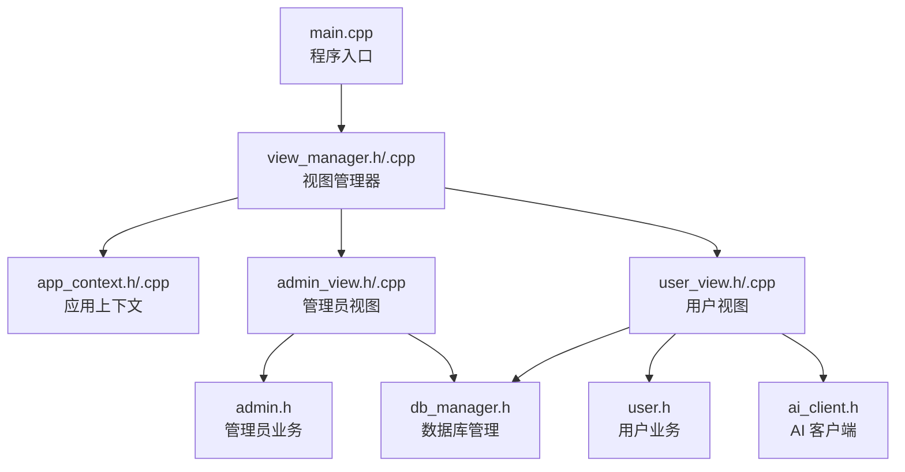
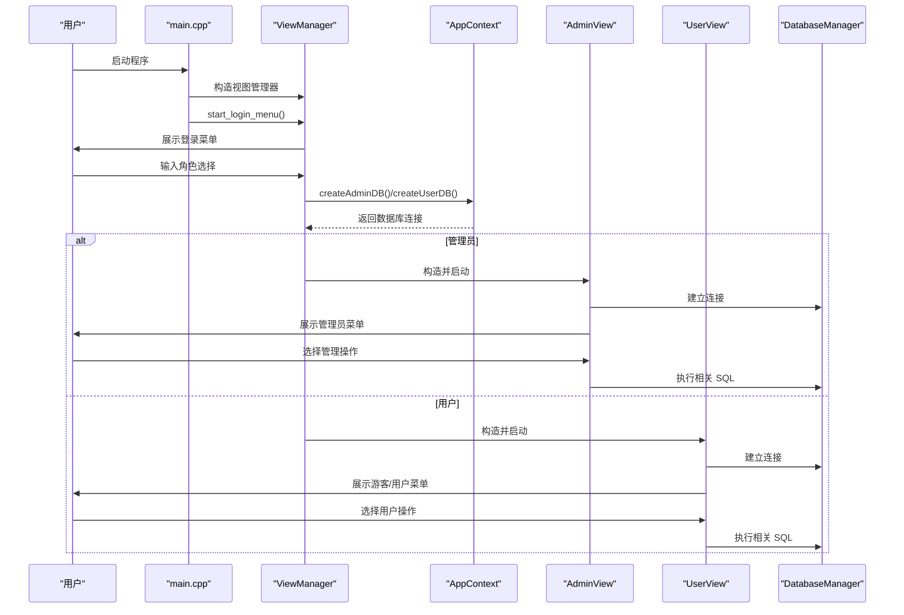
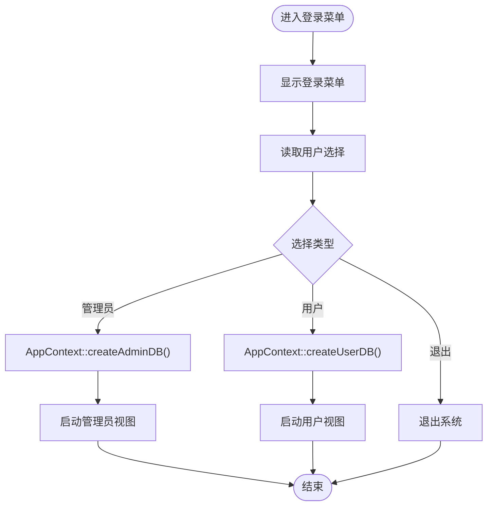
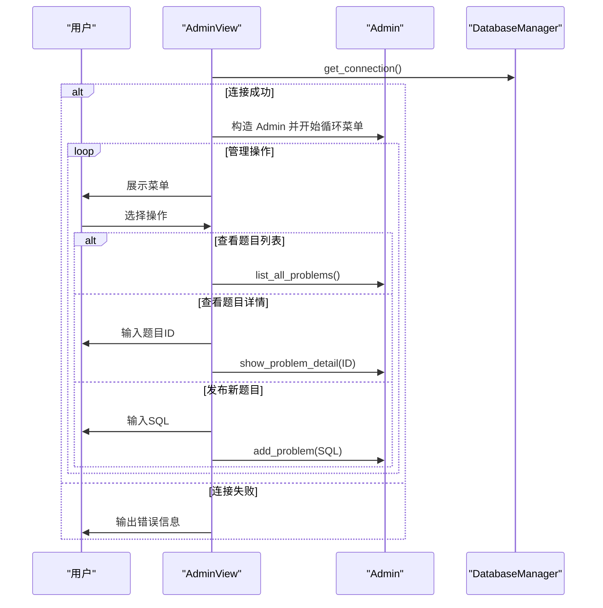
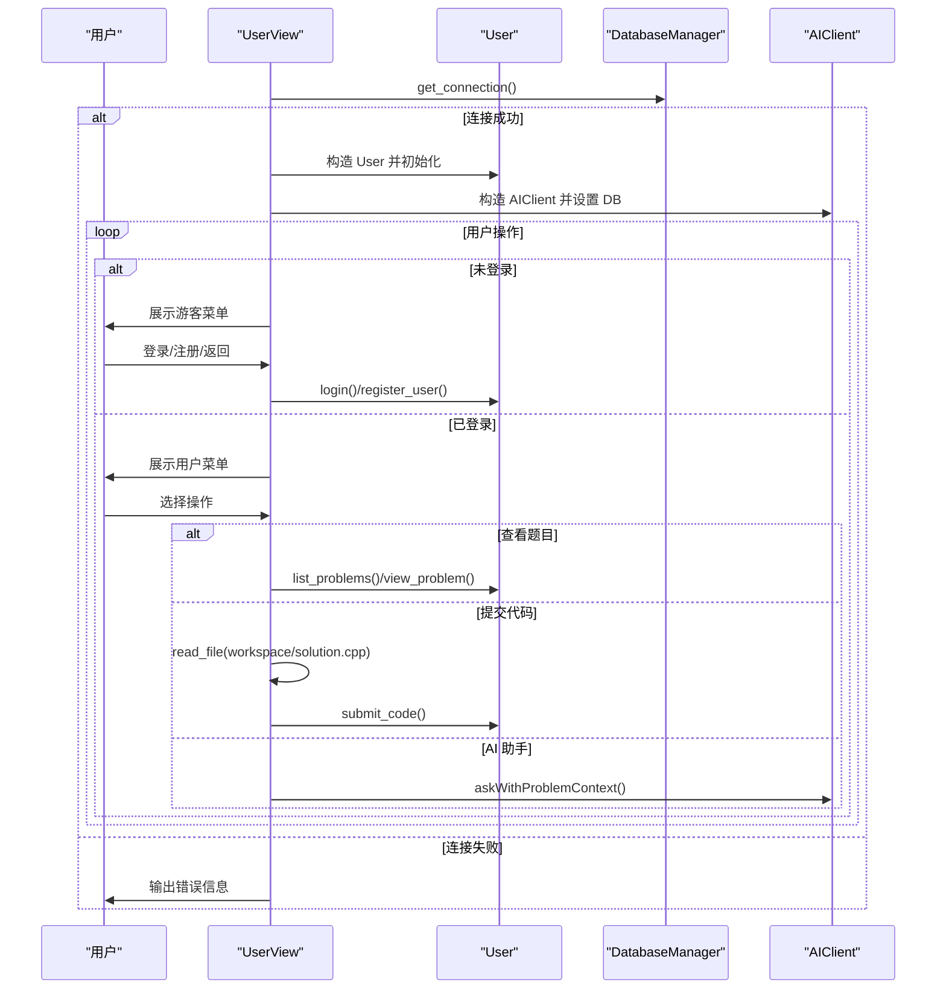
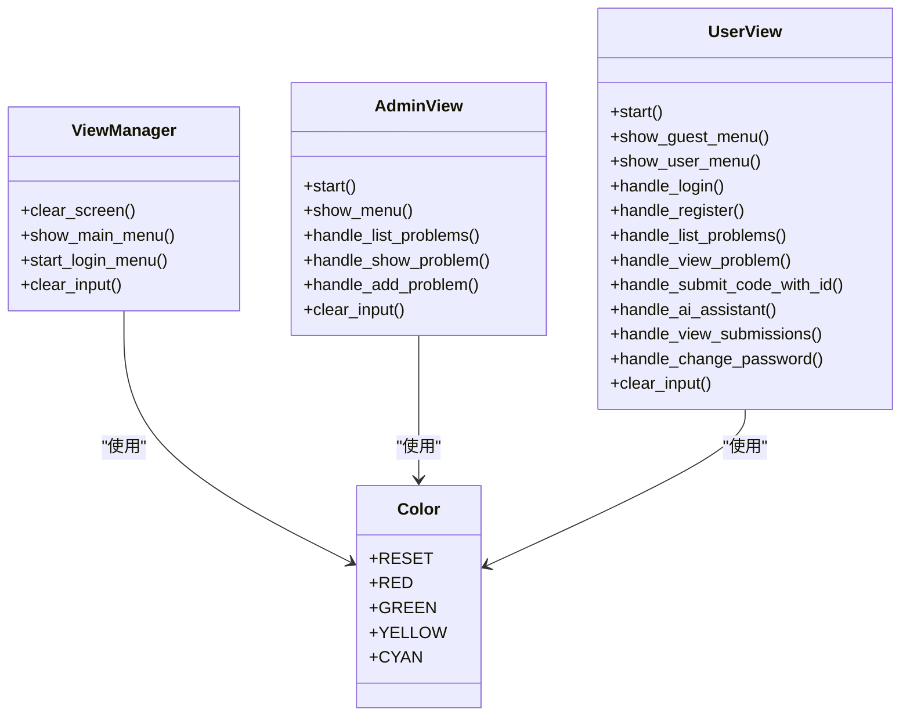
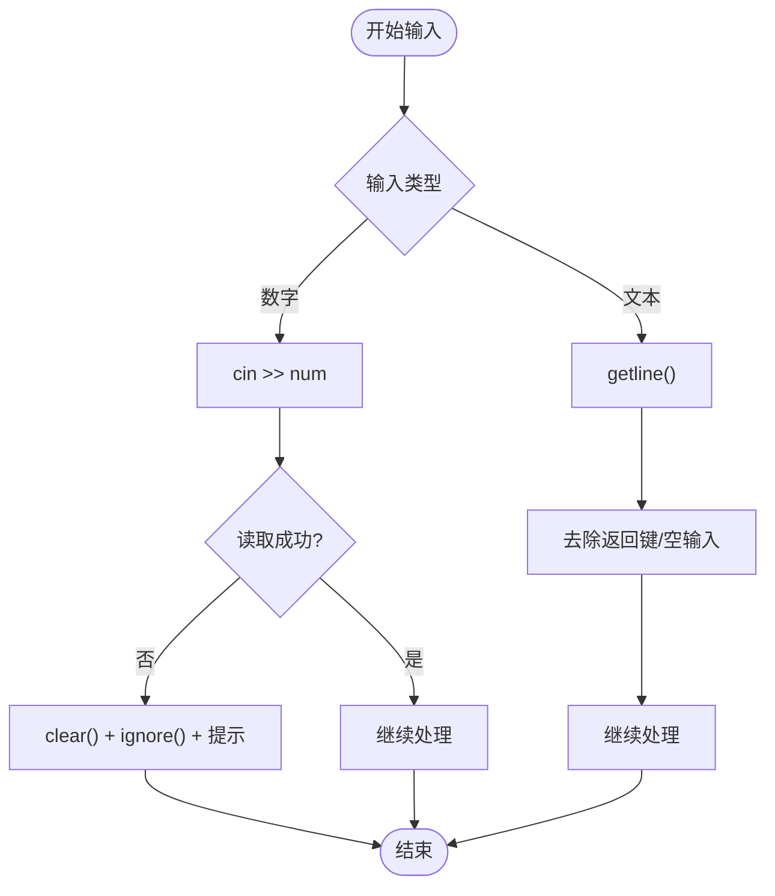
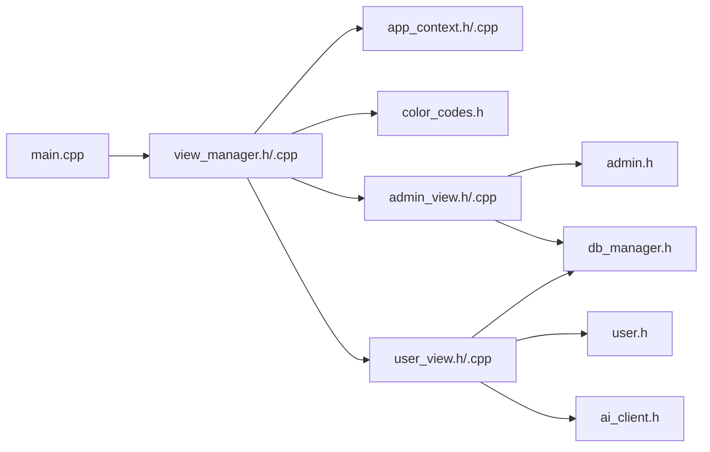

# 命令行界面设计

<cite>
**本文引用的文件**
- [src/main.cpp](file://src/main.cpp)
- [include/view_manager.h](file://include/view_manager.h)
- [src/view_manager.cpp](file://src/view_manager.cpp)
- [include/color_codes.h](file://include/color_codes.h)
- [include/app_context.h](file://include/app_context.h)
- [src/app_context.cpp](file://src/app_context.cpp)
- [include/admin_view.h](file://include/admin_view.h)
- [src/admin_view.cpp](file://src/admin_view.cpp)
- [include/user_view.h](file://include/user_view.h)
- [src/user_view.cpp](file://src/user_view.cpp)
- [include/db_manager.h](file://include/db_manager.h)
- [include/admin.h](file://include/admin.h)
- [include/user.h](file://include/user.h)
- [include/ai_client.h](file://include/ai_client.h)
- [CMakeLists.txt](file://CMakeLists.txt)
</cite>

## 目录
1. [引言](#引言)
2. [项目结构](#项目结构)
3. [核心组件](#核心组件)
4. [架构总览](#架构总览)
5. [详细组件分析](#详细组件分析)
6. [依赖关系分析](#依赖关系分析)
7. [性能考量](#性能考量)
8. [故障排查指南](#故障排查指南)
9. [结论](#结论)
10. [附录](#附录)

## 引言
本文件面向命令行界面设计，围绕登录菜单、角色切换、权限控制、输入输出与验证、颜色编码、布局与体验、AI 助手集成、以及可扩展性与可维护性展开。文档基于仓库中的视图层、应用上下文与数据库管理等模块，系统化梳理从入口到各角色界面的交互流程与实现要点，并提供可操作的扩展建议。

## 项目结构
- 入口程序负责启动登录菜单，随后根据用户选择进入管理员或用户模式。
- 视图管理层负责清屏、菜单展示与输入校验，统一协调角色视图。
- 应用上下文负责以不同权限创建数据库连接，避免视图层直接管理连接细节。
- 角色视图（管理员/用户）各自维护菜单与业务处理，共享颜色编码与输入清理机制。
- 数据库管理器封装 MySQL 连接、查询与转义，保障安全与一致性。
- AI 客户端提供问题上下文增强的问答能力，支持用户模式下的辅助功能。

**图表来源**
- [src/main.cpp:1-14](file://src/main.cpp#L1-L14)
- [src/view_manager.cpp:1-78](file://src/view_manager.cpp#L1-L78)
- [src/app_context.cpp:1-16](file://src/app_context.cpp#L1-L16)
- [src/admin_view.cpp:1-138](file://src/admin_view.cpp#L1-L138)
- [src/user_view.cpp:1-385](file://src/user_view.cpp#L1-L385)
- [include/db_manager.h:1-51](file://include/db_manager.h#L1-L51)
- [include/ai_client.h:1-49](file://include/ai_client.h#L1-L49)

**章节来源**
- [src/main.cpp:1-14](file://src/main.cpp#L1-L14)
- [CMakeLists.txt:1-40](file://CMakeLists.txt#L1-L40)

## 核心组件
- 视图管理器：负责登录菜单、清屏、主菜单展示与输入验证；根据角色注入数据库连接并启动对应视图。
- 应用上下文：集中创建管理员/用户数据库连接，隔离权限差异。
- 管理员视图：提供题目列表、详情查看与新增题目的管理能力。
- 用户视图：提供游客态与登录态菜单、登录/注册、题目浏览、提交评测、查看提交记录、修改密码、AI 助手等功能。
- 颜色编码：ANSI 颜色常量封装，统一界面色彩风格。
- 数据库管理器：封装连接、查询、转义，提供安全的 SQL 执行接口。
- AI 客户端：封装 Python 调用与上下文查询，向用户模式提供智能问答。

**章节来源**
- [include/view_manager.h:1-34](file://include/view_manager.h#L1-L34)
- [src/view_manager.cpp:1-78](file://src/view_manager.cpp#L1-L78)
- [include/app_context.h:1-35](file://include/app_context.h#L1-L35)
- [src/app_context.cpp:1-16](file://src/app_context.cpp#L1-L16)
- [include/admin_view.h:1-43](file://include/admin_view.h#L1-L43)
- [src/admin_view.cpp:1-138](file://src/admin_view.cpp#L1-L138)
- [include/user_view.h:1-68](file://include/user_view.h#L1-L68)
- [src/user_view.cpp:1-385](file://src/user_view.cpp#L1-L385)
- [include/color_codes.h:1-15](file://include/color_codes.h#L1-L15)
- [include/db_manager.h:1-51](file://include/db_manager.h#L1-L51)
- [include/ai_client.h:1-49](file://include/ai_client.h#L1-L49)

## 架构总览
下图展示了从程序入口到角色视图与数据库交互的整体流程，包括颜色编码与输入清理的通用机制。

**图表来源**
- [src/main.cpp:1-14](file://src/main.cpp#L1-L14)
- [src/view_manager.cpp:33-71](file://src/view_manager.cpp#L33-L71)
- [src/app_context.cpp:5-15](file://src/app_context.cpp#L5-L15)
- [src/admin_view.cpp:22-76](file://src/admin_view.cpp#L22-L76)
- [src/user_view.cpp:39-134](file://src/user_view.cpp#L39-L134)
- [include/db_manager.h:10-46](file://include/db_manager.h#L10-L46)

## 详细组件分析

### 登录菜单与角色切换
- 登录菜单循环展示“管理员进入”“用户进入”“退出系统”，使用清屏与颜色编码提升可读性。
- 输入验证采用流状态检测与缓冲区清理，确保非数字输入不阻塞后续流程。
- 角色切换通过应用上下文创建不同权限的数据库连接，避免视图层感知权限差异。

**图表来源**
- [src/view_manager.cpp:33-71](file://src/view_manager.cpp#L33-L71)
- [src/app_context.cpp:5-15](file://src/app_context.cpp#L5-L15)

**章节来源**
- [src/view_manager.cpp:15-31](file://src/view_manager.cpp#L15-L31)
- [src/view_manager.cpp:33-71](file://src/view_manager.cpp#L33-L71)
- [include/app_context.h:15-32](file://include/app_context.h#L15-L32)
- [src/app_context.cpp:5-15](file://src/app_context.cpp#L5-L15)

### 管理员界面
- 管理员视图在连接成功后展示管理菜单，支持题目列表、详情查看与新增题目。
- 输入验证覆盖整数 ID 与 SQL 语句非空判断，配合颜色提示与清屏优化体验。
- 通过管理员对象调用数据库管理器执行业务操作。

**图表来源**
- [src/admin_view.cpp:22-76](file://src/admin_view.cpp#L22-L76)
- [src/admin_view.cpp:91-131](file://src/admin_view.cpp#L91-L131)
- [include/admin.h:9-29](file://include/admin.h#L9-L29)

**章节来源**
- [include/admin_view.h:10-40](file://include/admin_view.h#L10-L40)
- [src/admin_view.cpp:78-89](file://src/admin_view.cpp#L78-L89)
- [src/admin_view.cpp:91-131](file://src/admin_view.cpp#L91-L131)

### 用户界面
- 用户视图区分“游客态”与“登录态”，动态展示菜单项与功能。
- 支持登录、注册、查看题目、提交代码、查看提交记录、修改密码、AI 助手等。
- 提交代码时从工作区读取文件内容，若为空则提示并阻止提交。
- AI 助手支持问题上下文增强与错误上下文联动，提供连续对话与退出条件。

**图表来源**
- [src/user_view.cpp:39-134](file://src/user_view.cpp#L39-L134)
- [src/user_view.cpp:162-214](file://src/user_view.cpp#L162-L214)
- [src/user_view.cpp:216-277](file://src/user_view.cpp#L216-L277)
- [src/user_view.cpp:279-291](file://src/user_view.cpp#L279-L291)
- [src/user_view.cpp:293-344](file://src/user_view.cpp#L293-L344)
- [include/user.h:9-77](file://include/user.h#L9-L77)
- [include/ai_client.h:7-46](file://include/ai_client.h#L7-L46)

**章节来源**
- [include/user_view.h:10-65](file://include/user_view.h#L10-L65)
- [src/user_view.cpp:136-160](file://src/user_view.cpp#L136-L160)
- [src/user_view.cpp:162-214](file://src/user_view.cpp#L162-L214)
- [src/user_view.cpp:279-291](file://src/user_view.cpp#L279-L291)
- [src/user_view.cpp:293-344](file://src/user_view.cpp#L293-L344)

### 颜色编码系统与界面布局
- 颜色编码通过命名空间封装 ANSI 转义序列，统一用于标题分隔线与提示文本，提升视觉层次。
- 清屏采用 ANSI 转义序列，确保每次菜单切换时界面整洁。
- 菜单采用固定宽度分隔线与清晰的选项编号，便于快速定位。

**图表来源**
- [include/color_codes.h:5-12](file://include/color_codes.h#L5-L12)
- [src/view_manager.cpp:15-31](file://src/view_manager.cpp#L15-L31)
- [src/admin_view.cpp:15-20](file://src/admin_view.cpp#L15-L20)
- [src/user_view.cpp:32-37](file://src/user_view.cpp#L32-L37)

**章节来源**
- [include/color_codes.h:1-15](file://include/color_codes.h#L1-L15)
- [src/view_manager.cpp:15-31](file://src/view_manager.cpp#L15-L31)
- [src/admin_view.cpp:15-20](file://src/admin_view.cpp#L15-L20)
- [src/user_view.cpp:32-37](file://src/user_view.cpp#L32-L37)

### 输入输出处理与验证机制
- 数字输入：使用流状态检测与缓冲区清理，防止非数字字符导致的解析异常。
- 文本输入：使用行读取以支持含空格的输入；提供“0 返回”的通用返回约定。
- 文件读取：从工作区路径读取代码文件，空文件或读取失败时给出明确提示。
- 错误提示：统一使用颜色编码输出错误信息，保证可读性与一致性。

**图表来源**
- [src/view_manager.cpp:42-48](file://src/view_manager.cpp#L42-L48)
- [src/admin_view.cpp:100-107](file://src/admin_view.cpp#L100-L107)
- [src/user_view.cpp:224-231](file://src/user_view.cpp#L224-L231)
- [src/user_view.cpp:166-186](file://src/user_view.cpp#L166-L186)
- [src/user_view.cpp:193-213](file://src/user_view.cpp#L193-L213)
- [src/user_view.cpp:279-291](file://src/user_view.cpp#L279-L291)

**章节来源**
- [src/view_manager.cpp:42-48](file://src/view_manager.cpp#L42-L48)
- [src/admin_view.cpp:100-107](file://src/admin_view.cpp#L100-L107)
- [src/user_view.cpp:224-231](file://src/user_view.cpp#L224-L231)
- [src/user_view.cpp:166-186](file://src/user_view.cpp#L166-L186)
- [src/user_view.cpp:193-213](file://src/user_view.cpp#L193-L213)
- [src/user_view.cpp:279-291](file://src/user_view.cpp#L279-L291)

### 权限控制与界面适配
- 应用上下文分别创建管理员与用户数据库连接，体现权限分离。
- 角色视图根据登录状态动态调整菜单项，实现界面适配。
- 管理员视图仅暴露管理操作，用户视图暴露学习与评测相关功能。

**章节来源**
- [include/app_context.h:15-32](file://include/app_context.h#L15-L32)
- [src/app_context.cpp:5-15](file://src/app_context.cpp#L5-L15)
- [include/user_view.h:27-31](file://include/user_view.h#L27-L31)
- [src/user_view.cpp:56-63](file://src/user_view.cpp#L56-L63)

### 主题与定制化
- 颜色编码集中管理，便于统一主题风格与后续扩展。
- 菜单分隔线与提示文本格式一致，建议在新增界面时复用相同风格。
- 可通过扩展颜色命名空间与布局宏，实现更丰富的主题切换。

**章节来源**
- [include/color_codes.h:5-12](file://include/color_codes.h#L5-L12)
- [src/view_manager.cpp:22-31](file://src/view_manager.cpp#L22-L31)
- [src/admin_view.cpp:78-89](file://src/admin_view.cpp#L78-L89)
- [src/user_view.cpp:138-160](file://src/user_view.cpp#L138-L160)

### 响应性优化、键盘快捷键与无障碍
- 响应性：清屏与菜单刷新减少屏幕碎片，输入验证及时反馈，降低用户困惑。
- 键盘快捷键：当前版本未实现全局快捷键，可在现有菜单框架下增加快捷键映射（如数字键直达）。
- 无障碍：当前未实现读屏支持，建议引入可选的文本朗读与高对比度主题。

[本节为通用指导，无需具体文件引用]

## 依赖关系分析
- 程序入口依赖视图管理器；视图管理器依赖应用上下文与颜色编码；角色视图依赖数据库管理器与业务类；用户视图还依赖 AI 客户端。
- 数据库管理器封装底层 MySQL 接口，提供查询与转义能力，被管理员与用户业务共同使用。

**图表来源**
- [src/main.cpp:1-14](file://src/main.cpp#L1-L14)
- [src/view_manager.cpp:1-78](file://src/view_manager.cpp#L1-L78)
- [src/app_context.cpp:1-16](file://src/app_context.cpp#L1-L16)
- [src/admin_view.cpp:1-138](file://src/admin_view.cpp#L1-L138)
- [src/user_view.cpp:1-385](file://src/user_view.cpp#L1-L385)
- [include/db_manager.h:1-51](file://include/db_manager.h#L1-L51)
- [include/ai_client.h:1-49](file://include/ai_client.h#L1-L49)

**章节来源**
- [CMakeLists.txt:11-34](file://CMakeLists.txt#L11-L34)

## 性能考量
- I/O 模型：命令行界面以同步 I/O 为主，适合中小规模数据与交互场景。
- 数据库访问：通过统一的数据库管理器封装，避免重复连接与 SQL 注入风险。
- 文件读取：工作区文件读取在用户提交阶段触发，建议在提交前进行大小与格式预检，减少无效请求。
- 颜色输出：ANSI 转义序列开销极低，不影响交互延迟。

[本节为通用指导，无需具体文件引用]

## 故障排查指南
- 登录/注册失败：检查应用上下文中的数据库凭据与网络连通性；确认数据库管理器连接状态。
- 提交代码为空：确认工作区文件存在且非空；检查读取路径与权限。
- AI 助手不可用：检查 AI 客户端可用性与外部服务配置；确认问题上下文查询与错误上下文传递。
- 输入异常：遇到非数字输入时，系统会清理缓冲区并提示；请确保输入符合预期格式。

**章节来源**
- [src/app_context.cpp:5-15](file://src/app_context.cpp#L5-L15)
- [src/user_view.cpp:279-291](file://src/user_view.cpp#L279-L291)
- [src/user_view.cpp:293-344](file://src/user_view.cpp#L293-L344)
- [src/view_manager.cpp:42-48](file://src/view_manager.cpp#L42-L48)

## 结论
该命令行界面以“视图管理器 + 角色视图 + 应用上下文 + 数据库管理器”的分层架构实现，具备清晰的角色切换、严格的输入验证与一致的颜色编码风格。通过集中式的数据库连接与权限分离，系统在安全性与可维护性方面表现良好。建议后续在快捷键、无障碍与主题切换方面进一步增强用户体验，并在提交流程中加入更完善的文件与格式校验。

## 附录
- 扩展开发建议
  - 菜单与提示：统一使用颜色编码与分隔线，新增界面遵循现有布局规范。
  - 输入验证：在关键输入点增加范围检查与格式校验，结合错误上下文提示。
  - 主题与国际化：抽象出布局与文案常量，支持多主题与多语言配置。
  - 键盘快捷键：在菜单循环中增加快捷键映射，减少鼠标依赖。
  - 无障碍：提供高对比度主题与可选的文本朗读支持。
  - 日志与诊断：在关键路径增加日志输出，便于问题定位与性能分析。

[本节为通用指导，无需具体文件引用]