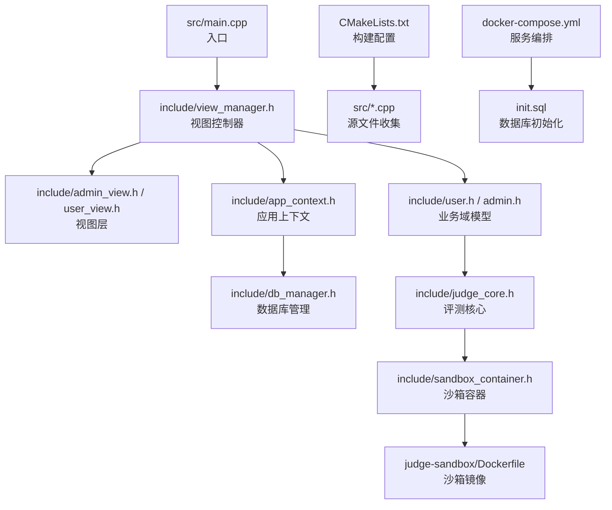
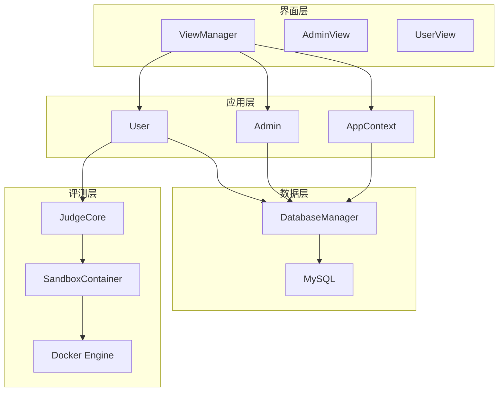
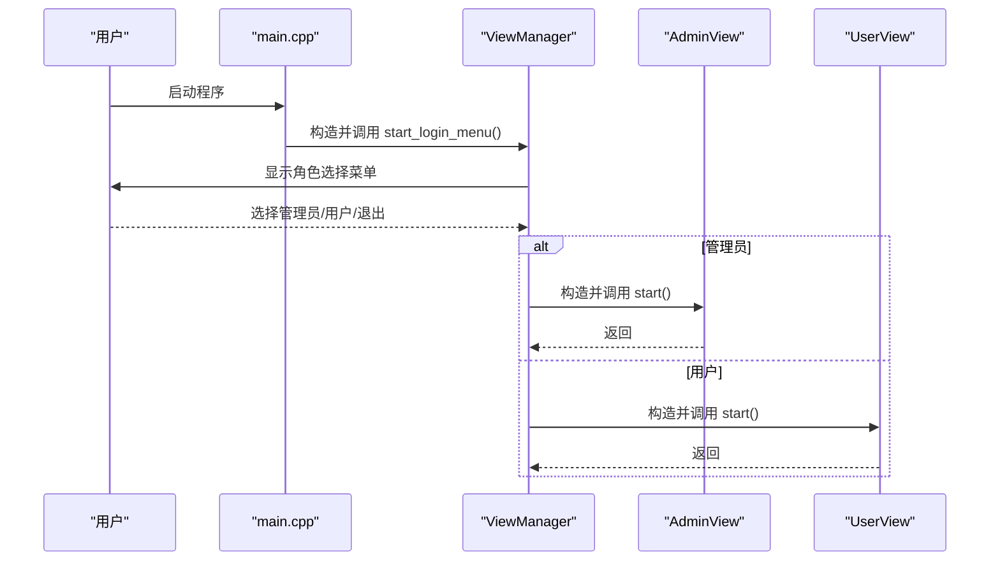
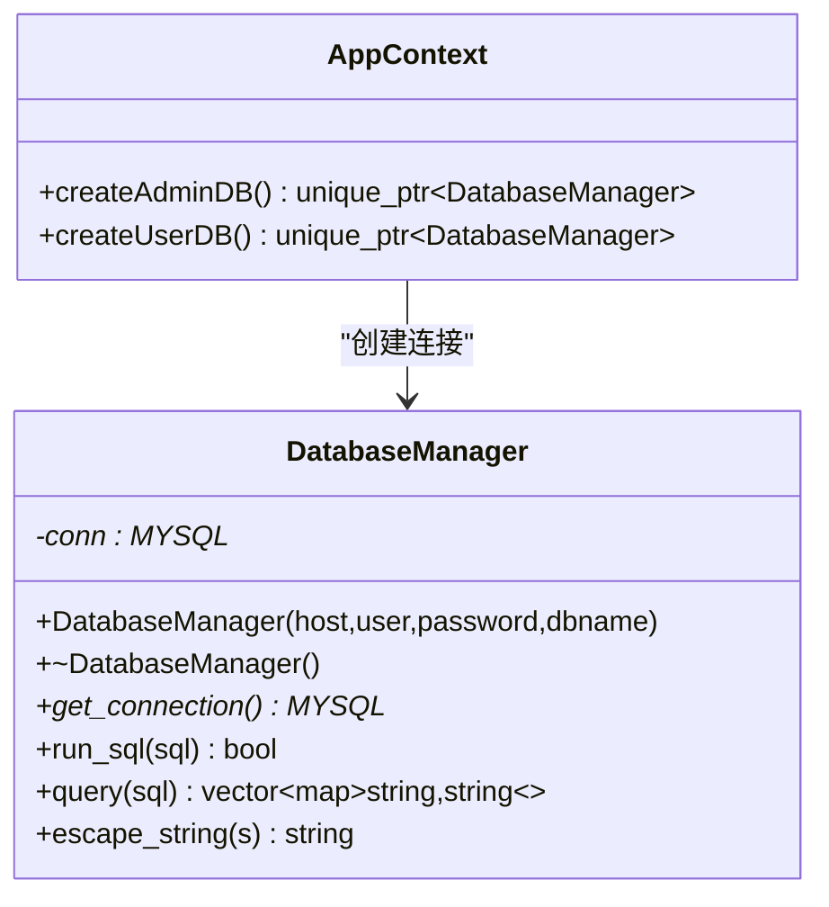
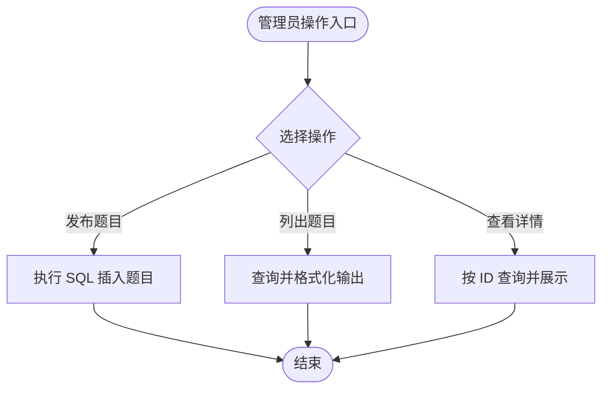
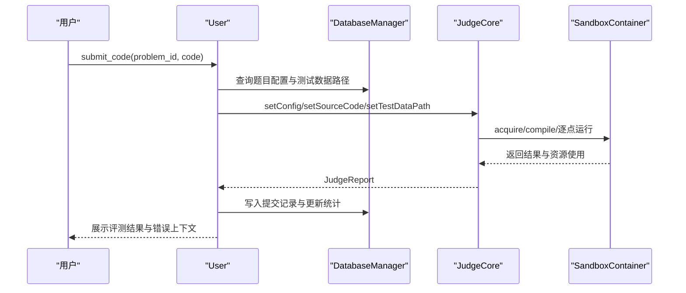
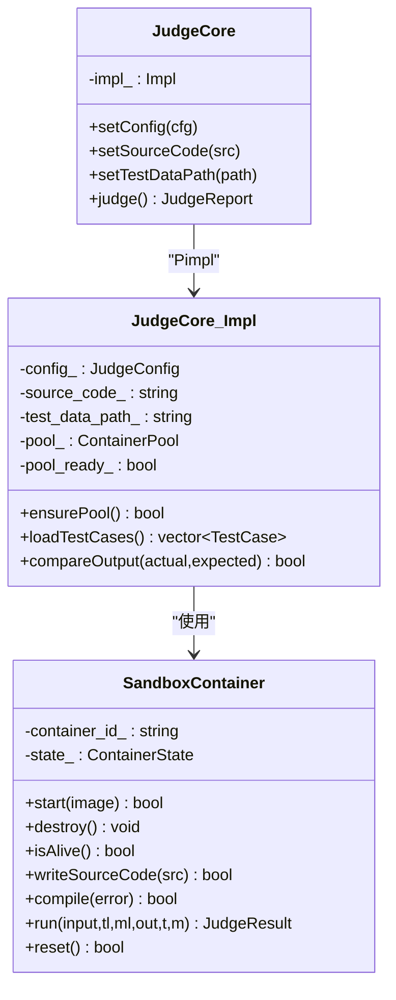
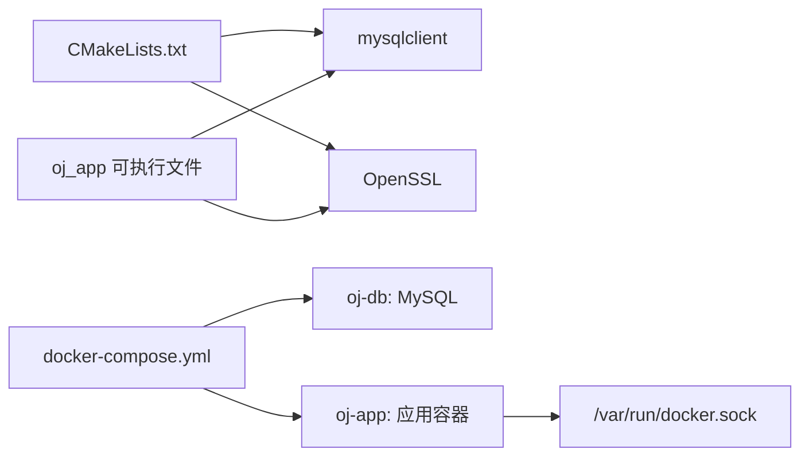

# 开发者指南

<cite>
**本文档引用的文件**
- [CMakeLists.txt](file://CMakeLists.txt)
- [main.cpp](file://src/main.cpp)
- [app_context.h](file://include/app_context.h)
- [app_context.cpp](file://src/app_context.cpp)
- [db_manager.h](file://include/db_manager.h)
- [db_manager.cpp](file://src/db_manager.cpp)
- [view_manager.h](file://include/view_manager.h)
- [view_manager.cpp](file://src/view_manager.cpp)
- [admin.h](file://include/admin.h)
- [admin.cpp](file://src/admin.cpp)
- [user.h](file://include/user.h)
- [user.cpp](file://src/user.cpp)
- [judge_core.h](file://include/judge_core.h)
- [judge_core.cpp](file://src/judge_core.cpp)
- [sandbox_container.h](file://include/sandbox_container.h)
- [sandbox_container.cpp](file://src/sandbox_container.cpp)
- [init.sql](file://init.sql)
- [docker-compose.yml](file://docker-compose.yml)
</cite>

## 目录
1. [简介](#简介)
2. [项目结构](#项目结构)
3. [核心组件](#核心组件)
4. [架构总览](#架构总览)
5. [详细组件分析](#详细组件分析)
6. [依赖分析](#依赖分析)
7. [性能考虑](#性能考虑)
8. [故障排查指南](#故障排查指南)
9. [结论](#结论)
10. [附录](#附录)

## 简介
本指南面向开发者，提供 OJ 在线判题系统的开发规范、构建与调试、模块划分、依赖关系、测试策略、扩展与插件机制、API 设计原则、IDE 配置与性能分析方法，以及贡献流程与版本发布管理建议。项目采用 C++17，基于 CMake 构建，使用 MySQL 存储，Docker 编排数据库与应用服务，评测核心通过 Docker 容器沙箱实现安全隔离。

## 项目结构
项目采用按职责分层的组织方式：
- include：公共头文件，定义接口与数据结构
- src：实现文件，包含业务逻辑与系统集成
- data：测试数据目录，按题目编号组织 .in/.out
- docs：文档与设计说明
- judge-sandbox：评测沙箱镜像构建上下文
- 根目录：构建配置、编排与初始化脚本

图表来源
- [main.cpp:1-14](file://src/main.cpp#L1-L14)
- [view_manager.h:1-34](file://include/view_manager.h#L1-L34)
- [app_context.h:1-35](file://include/app_context.h#L1-L35)
- [db_manager.h:1-51](file://include/db_manager.h#L1-L51)
- [user.h:1-80](file://include/user.h#L1-L80)
- [admin.h:1-32](file://include/admin.h#L1-L32)
- [judge_core.h:1-104](file://include/judge_core.h#L1-L104)
- [sandbox_container.h:1-111](file://include/sandbox_container.h#L1-L111)
- [CMakeLists.txt:1-40](file://CMakeLists.txt#L1-L40)
- [docker-compose.yml:1-81](file://docker-compose.yml#L1-L81)
- [init.sql:1-278](file://init.sql#L1-L278)

章节来源
- [CMakeLists.txt:1-40](file://CMakeLists.txt#L1-L40)
- [docker-compose.yml:1-81](file://docker-compose.yml#L1-L81)

## 核心组件
- 应用入口与视图控制
  - 入口函数负责初始化视图管理器并启动登录菜单
  - 视图管理器负责角色选择、清屏与主菜单展示，并根据选择创建对应视图实例
- 应用上下文
  - 提供管理员与普通用户两种数据库连接工厂方法，统一管理连接参数与权限
- 数据库管理
  - 封装 MySQL 连接、SQL 执行、查询结果解析与字符串转义，提供基础 CRUD 能力
- 业务域模型
  - 管理员：发布题目、列出题目、查看题目详情
  - 用户：登录/注册/改密、查看题目、提交代码评测、查看提交记录
- 评测核心
  - 评测配置（时间/内存限制）、源代码注入、测试数据加载、逐点评测与结果汇总
- 沙箱容器
  - 基于 Docker 的容器生命周期管理、文件写入、编译与运行、资源监控与状态判定

章节来源
- [main.cpp:1-14](file://src/main.cpp#L1-L14)
- [view_manager.cpp:1-78](file://src/view_manager.cpp#L1-L78)
- [app_context.cpp:1-16](file://src/app_context.cpp#L1-L16)
- [db_manager.cpp:1-108](file://src/db_manager.cpp#L1-L108)
- [admin.cpp:1-133](file://src/admin.cpp#L1-L133)
- [user.cpp:1-514](file://src/user.cpp#L1-L514)
- [judge_core.cpp:1-202](file://src/judge_core.cpp#L1-L202)
- [sandbox_container.cpp:1-187](file://src/sandbox_container.cpp#L1-L187)

## 架构总览
系统采用“命令行界面 + 应用上下文 + 数据库 + 评测沙箱”的分层架构。UI 层通过视图管理器调度业务层，业务层通过数据库管理器访问数据，评测流程通过评测核心协调沙箱容器完成编译与运行。

图表来源
- [view_manager.h:1-34](file://include/view_manager.h#L1-L34)
- [app_context.h:1-35](file://include/app_context.h#L1-L35)
- [user.h:1-80](file://include/user.h#L1-L80)
- [admin.h:1-32](file://include/admin.h#L1-L32)
- [db_manager.h:1-51](file://include/db_manager.h#L1-L51)
- [judge_core.h:1-104](file://include/judge_core.h#L1-L104)
- [sandbox_container.h:1-111](file://include/sandbox_container.h#L1-L111)

## 详细组件分析

### 应用入口与视图管理
- 入口函数初始化视图管理器并启动登录菜单
- 视图管理器根据用户选择创建管理员或用户视图实例，调用其 start 方法，结束后释放资源
- 输入校验与清屏逻辑确保良好的用户体验

图表来源
- [main.cpp:1-14](file://src/main.cpp#L1-L14)
- [view_manager.cpp:33-71](file://src/view_manager.cpp#L33-L71)

章节来源
- [main.cpp:1-14](file://src/main.cpp#L1-L14)
- [view_manager.cpp:1-78](file://src/view_manager.cpp#L1-L78)

### 应用上下文与数据库管理
- AppContext 提供管理员与普通用户两类数据库连接工厂，集中管理主机、用户名、密码与数据库名
- DatabaseManager 封装连接初始化、SQL 执行、查询结果解析与字符串转义，提供 run_sql 与 query 接口

图表来源
- [app_context.h:1-35](file://include/app_context.h#L1-L35)
- [app_context.cpp:1-16](file://src/app_context.cpp#L1-L16)
- [db_manager.h:1-51](file://include/db_manager.h#L1-L51)
- [db_manager.cpp:1-108](file://src/db_manager.cpp#L1-L108)

章节来源
- [app_context.h:1-35](file://include/app_context.h#L1-L35)
- [app_context.cpp:1-16](file://src/app_context.cpp#L1-L16)
- [db_manager.h:1-51](file://include/db_manager.h#L1-L51)
- [db_manager.cpp:1-108](file://src/db_manager.cpp#L1-L108)

### 管理员功能
- 发布题目：直接执行 SQL
- 列出题目：查询题目列表并格式化输出
- 查看题目详情：按 ID 查询并格式化展示

图表来源
- [admin.cpp:10-133](file://src/admin.cpp#L10-L133)

章节来源
- [admin.h:1-32](file://include/admin.h#L1-L32)
- [admin.cpp:1-133](file://src/admin.cpp#L1-L133)

### 用户功能与评测流程
- 登录/注册/改密：使用 SHA256 哈希与数据库转义，更新登录时间与统计
- 查看题目与提交代码：加载题目配置、设置评测参数、执行评测并写入提交记录与统计
- 评测错误上下文：根据评测结果生成供 AI 分析的错误上下文

图表来源
- [user.cpp:269-452](file://src/user.cpp#L269-L452)
- [judge_core.cpp:85-201](file://src/judge_core.cpp#L85-L201)
- [sandbox_container.cpp:127-178](file://src/sandbox_container.cpp#L127-L178)

章节来源
- [user.h:1-80](file://include/user.h#L1-L80)
- [user.cpp:1-514](file://src/user.cpp#L1-L514)
- [judge_core.h:1-104](file://include/judge_core.h#L1-L104)
- [judge_core.cpp:1-202](file://src/judge_core.cpp#L1-L202)
- [sandbox_container.h:1-111](file://include/sandbox_container.h#L1-L111)
- [sandbox_container.cpp:1-187](file://src/sandbox_container.cpp#L1-L187)

### 评测核心与沙箱容器
- 评测核心：惰性初始化容器池、加载测试数据、逐点评测、汇总结果与资源使用
- 沙箱容器：启动常驻容器、写入源代码、编译与运行、资源监控、清理与回收

图表来源
- [judge_core.h:1-104](file://include/judge_core.h#L1-L104)
- [judge_core.cpp:12-74](file://src/judge_core.cpp#L12-L74)
- [sandbox_container.h:1-111](file://include/sandbox_container.h#L1-L111)
- [sandbox_container.cpp:62-91](file://src/sandbox_container.cpp#L62-L91)

章节来源
- [judge_core.h:1-104](file://include/judge_core.h#L1-L104)
- [judge_core.cpp:1-202](file://src/judge_core.cpp#L1-L202)
- [sandbox_container.h:1-111](file://include/sandbox_container.h#L1-L111)
- [sandbox_container.cpp:1-187](file://src/sandbox_container.cpp#L1-L187)

## 依赖分析
- 构建系统
  - CMake 3.10+，C++17 标准，导出 compile_commands.json 便于语言服务器与静态分析
  - 依赖 pkg-config 检测 mysqlclient，链接 OpenSSL::Crypto
- 运行时依赖
  - MySQL 客户端库与 OpenSSL
  - Docker 引擎（宿主机或共享 socket）
- 服务编排
  - docker-compose 启动 MySQL 与应用容器，挂载数据与工作区，暴露数据库端口，健康检查

图表来源
- [CMakeLists.txt:11-34](file://CMakeLists.txt#L11-L34)
- [docker-compose.yml:13-71](file://docker-compose.yml#L13-L71)

章节来源
- [CMakeLists.txt:1-40](file://CMakeLists.txt#L1-L40)
- [docker-compose.yml:1-81](file://docker-compose.yml#L1-L81)

## 性能考虑
- 评测性能
  - 使用容器常驻模式减少启动开销，必要时启用惰性初始化容器池
  - 通过 /usr/bin/time 与 timeout 精确测量时间与内存，避免超限
  - 逐点评测遇到首个失败点即停止，缩短平均等待时间
- 数据库性能
  - 使用 escape_string 防注入，合理索引（account、created_at、user_id、problem_id）
  - 读写分离与最小权限：管理员全权限，用户受限权限
- I/O 与内存
  - 沙箱目录使用 tmpfs，提升文件读写性能
  - 评测时严格限制内存与进程数，避免资源滥用

## 故障排查指南
- 构建与依赖
  - 确认 pkg-config 能找到 mysqlclient，OpenSSL 头文件与库可用
  - 若编译命令缺失，检查 CMAKE_EXPORT_COMPILE_COMMANDS 是否开启
- 运行时
  - 数据库连接失败：核对 AppContext 中的主机、端口、用户名与密码
  - Docker 权限不足：确认 oj-app 容器具有 --privileged 权限并挂载 /var/run/docker.sock
  - 评测沙箱失败：检查 judge-sandbox 镜像是否存在，容器是否存活
- 日志与诊断
  - 数据库错误通过 mysql_error 输出，结合 escape_string 与 SQL 日志定位问题
  - 评测错误上下文包含 CE/RE/TLE/MLE/WA 等详细信息，便于定位

章节来源
- [CMakeLists.txt:36-40](file://CMakeLists.txt#L36-L40)
- [db_manager.cpp:22-43](file://src/db_manager.cpp#L22-L43)
- [sandbox_container.cpp:62-91](file://src/sandbox_container.cpp#L62-L91)
- [user.cpp:318-360](file://src/user.cpp#L318-L360)

## 结论
本指南提供了从构建、运行到扩展与测试的完整开发路径。通过清晰的模块划分、严格的依赖管理与容器化评测，系统具备良好的可维护性与可扩展性。建议在开发过程中遵循本文的规范与最佳实践，持续完善测试与文档。

## 附录

### 代码规范与编程约定
- 命名规范
  - 类型与接口：大驼峰（如 DatabaseManager、JudgeCore）
  - 变量与函数：小驼峰（如 run_sql、setConfig）
  - 常量与枚举：全大写加下划线（如 ACCEPTED、IDLE）
- 文件组织
  - 头文件仅声明接口与数据结构，实现放在同名 .cpp
  - 每个模块独立目录（include/ 与 src/），避免交叉耦合
- 错误处理
  - 统一使用布尔返回值与错误信息字段，避免异常传播
  - 对外部系统（Docker、MySQL）调用均需检查返回码与输出
- 安全
  - 所有用户输入与 SQL 字符串必须经 escape_string 转义
  - 使用 SHA256 哈希存储密码，禁止明文存储

### 构建系统配置与编译选项
- CMake
  - C++17 标准、导出 compile_commands.json
  - 依赖检测：pkg_check_modules(mysql)、find_package(OpenSSL)
  - 链接：${MYSQL_LIBRARIES} 与 OpenSSL::Crypto
- 编译器优化
  - g++ 编译选项：-O2 -std=c++17
- 生成工具链
  - 使用 Ninja 或 Unix Make 生成器，配合 clang-tidy 与 clang-format

章节来源
- [CMakeLists.txt:1-40](file://CMakeLists.txt#L1-L40)
- [sandbox_container.cpp:118-125](file://src/sandbox_container.cpp#L118-L125)

### 调试技巧
- 语言服务器与补全
  - 使用 compile_commands.json 配置 clangd/VS Code/IDEA
- 运行时调试
  - gdb/LLDB 附加 oj_app，设置断点于关键函数（run_sql、judge、run）
- 容器调试
  - docker exec 进入沙箱容器查看 /sandbox 目录与日志
- 数据库调试
  - 使用 mysql 命令行连接，执行相同 SQL 验证逻辑

### 单元测试与集成测试
- 单元测试
  - DatabaseManager：构造/析构、run_sql/query、escape_string
  - JudgeCore：loadTestCases、compareOutput、judge（mock 容器）
  - SandboxContainer：start/destroy/isAlive/reset，compile/run（隔离测试）
- 集成测试
  - docker-compose 启动完整栈，执行端到端提交流程
  - 覆盖多题目类型与边界条件（TLE/MLE/RE/CE/WA）

### 代码质量保证
- 静态分析
  - clang-tidy 检查 C++17 合规与潜在问题
  - clang-format 统一代码风格
- 覆盖率
  - gcov/lcov 生成覆盖率报告，重点保障评测与数据库模块
- 文档
  - 为新增接口补充 doxygen 注释与使用示例

### 扩展开发与插件机制
- 新增评测语言
  - 在 SandboxContainer 中添加编译命令与运行参数映射
  - 在 JudgeCore 中扩展语言到编译器映射与默认配置
- 新增视图功能
  - 在 ViewManager 中增加菜单项与路由
  - 在对应 View 中实现业务逻辑并与 User/Admin 解耦
- API 设计原则
  - 接口最小化、职责单一、禁止隐式依赖
  - 使用 Pimpl 隐藏实现细节，保持 ABI 稳定

### IDE 配置与开发工具推荐
- VS Code
  - 插件：C/C++、clangd、clang-format、Docker、EditorConfig
  - 配置：includePath、browse.database、clang_format_style
- CLion
  - CMake 集成、编译数据库、静态分析工具链
- 其他
  - Docker Desktop、MySQL Workbench、Postman（若扩展 API）

### 性能分析方法
- CPU/内存
  - perf/valgrind/heaptrack 分析热点与泄漏
- 评测性能
  - 对比不同时间/内存限制下的通过率与资源使用
- I/O
  - strace/ftrace 观察文件与网络 I/O

### 贡献流程与版本发布管理
- 贡献流程
  - Fork → 分支（feature/fix/docs）→ 提交（带测试）→ Pull Request（含变更说明）
- 代码审查
  - 关注安全性（SQL 注入、权限）、健壮性（边界条件、错误处理）、可维护性（接口设计、注释）
- 版本发布
  - 语义化版本：修复 bug → 小版本，新增功能 → 大版本，破坏性变更 → 大版本
  - 发布前：构建验证、集成测试、文档更新、CHANGELOG