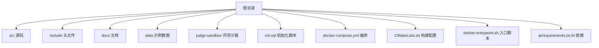
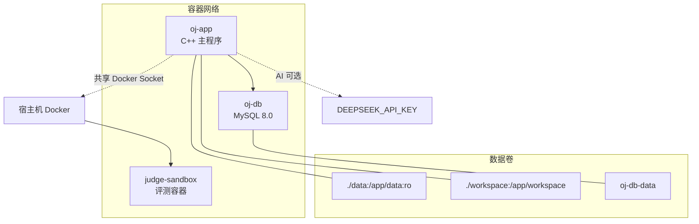
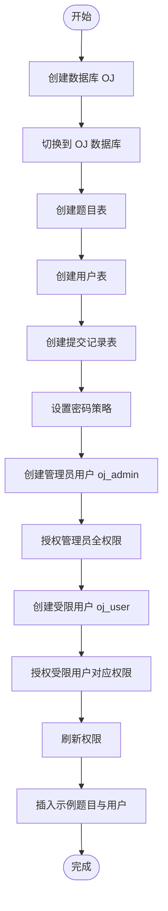
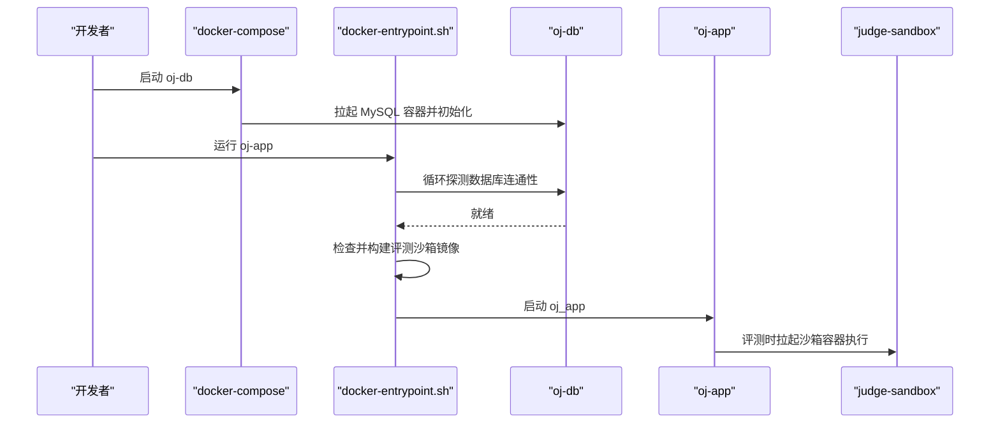
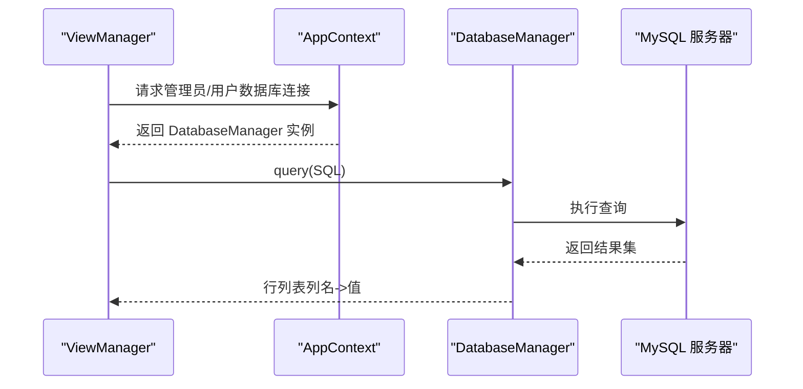
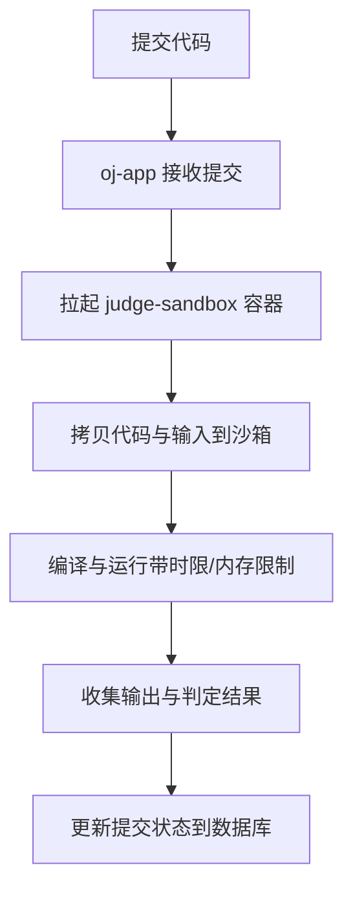
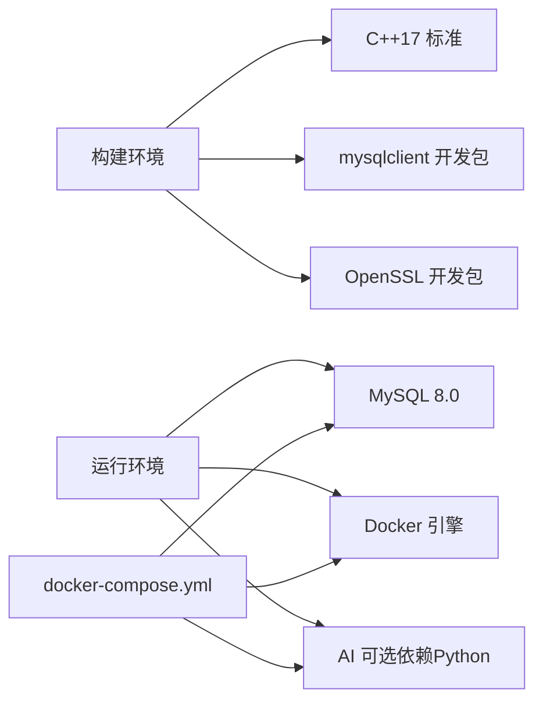

# 快速开始

<cite>
**本文引用的文件**
- [init.sql](file://init.sql)
- [docker-compose.yml](file://docker-compose.yml)
- [CMakeLists.txt](file://CMakeLists.txt)
- [src/main.cpp](file://src/main.cpp)
- [src/db_manager.cpp](file://src/db_manager.cpp)
- [src/app_context.cpp](file://src/app_context.cpp)
- [src/view_manager.cpp](file://src/view_manager.cpp)
- [include/db_manager.h](file://include/db_manager.h)
- [include/app_context.h](file://include/app_context.h)
- [docker-entrypoint.sh](file://docker-entrypoint.sh)
- [judge-sandbox/Dockerfile](file://judge-sandbox/Dockerfile)
- [ai/requirements.txt](file://ai/requirements.txt)
- [data/1/1.in](file://data/1/1.in)
- [data/1/1.out](file://data/1/1.out)
</cite>

## 目录
1. [简介](#简介)
2. [项目结构](#项目结构)
3. [核心组件](#核心组件)
4. [架构总览](#架构总览)
5. [详细组件分析](#详细组件分析)
6. [依赖关系分析](#依赖关系分析)
7. [性能注意事项](#性能注意事项)
8. [故障排除指南](#故障排除指南)
9. [结论](#结论)
10. [附录](#附录)

## 简介
本指南面向首次部署 OJ 在线评测系统的新用户，帮助你在约 30 分钟内完成环境准备、数据库初始化、Docker 服务启动与系统首次运行，并体验核心功能（用户注册/登录、题目浏览、代码提交）。系统采用 C++17 开发，使用 MySQL 作为数据存储，Docker Compose 编排数据库与主应用，评测沙箱通过 Docker 实现隔离执行。

## 项目结构
- 根目录包含编排文件、构建与入口脚本、数据库初始化脚本、评测沙箱定义以及示例测试数据。
- 源码位于 src/，头文件位于 include/，核心入口为 main.cpp。
- 数据目录 data/ 下包含多道题目的输入输出样例，供评测使用。

图表来源
- [docker-compose.yml:1-81](file://docker-compose.yml#L1-L81)
- [CMakeLists.txt:1-40](file://CMakeLists.txt#L1-L40)
- [docker-entrypoint.sh:1-92](file://docker-entrypoint.sh#L1-L92)
- [judge-sandbox/Dockerfile:1-29](file://judge-sandbox/Dockerfile#L1-L29)

章节来源
- [docker-compose.yml:1-81](file://docker-compose.yml#L1-L81)
- [CMakeLists.txt:1-40](file://CMakeLists.txt#L1-L40)
- [docker-entrypoint.sh:1-92](file://docker-entrypoint.sh#L1-L92)
- [judge-sandbox/Dockerfile:1-29](file://judge-sandbox/Dockerfile#L1-L29)

## 核心组件
- 数据库管理器：封装 MySQL 连接、查询与转义，负责与数据库交互。
- 应用上下文：集中提供管理员与普通用户的数据库连接工厂。
- 视图管理器：负责登录菜单与角色切换，驱动后续功能视图。
- 主程序入口：启动视图管理器，引导用户进入系统。
- 评测沙箱：基于 Ubuntu 22.04 的轻量镜像，提供编译与运行环境。
- 初始化脚本：创建数据库、表、示例数据与数据库用户。

章节来源
- [include/db_manager.h:1-51](file://include/db_manager.h#L1-L51)
- [src/db_manager.cpp:1-108](file://src/db_manager.cpp#L1-L108)
- [include/app_context.h:1-35](file://include/app_context.h#L1-L35)
- [src/app_context.cpp:1-16](file://src/app_context.cpp#L1-L16)
- [src/view_manager.cpp:1-78](file://src/view_manager.cpp#L1-L78)
- [src/main.cpp:1-14](file://src/main.cpp#L1-L14)
- [init.sql:1-278](file://init.sql#L1-L278)

## 架构总览
系统采用“容器化 + 命令行交互”的架构：
- 数据库服务（oj-db）：MySQL 8.0，自动初始化表结构与示例数据。
- 主应用服务（oj-app）：C++ 可执行程序，交互式 CLI，依赖数据库与 Docker Socket。
- 评测沙箱：在 oj-app 内部通过 Docker 运行，隔离编译与执行。
- AI 功能：可选，通过环境变量注入 API Key，依赖 Python 语言链生态。

图表来源
- [docker-compose.yml:13-81](file://docker-compose.yml#L13-L81)
- [docker-entrypoint.sh:26-92](file://docker-entrypoint.sh#L26-L92)
- [judge-sandbox/Dockerfile:1-29](file://judge-sandbox/Dockerfile#L1-L29)

## 详细组件分析

### 数据库初始化与用户权限
- 初始化脚本负责创建数据库、表、索引与示例数据，并创建管理员与受限用户，分别授予不同权限。
- 管理员用户具备全权限，受限用户仅对三张表具备只读或有限写入权限，配合应用层行级隔离保障安全。

图表来源
- [init.sql:8-95](file://init.sql#L8-L95)
- [init.sql:97-278](file://init.sql#L97-L278)

章节来源
- [init.sql:1-278](file://init.sql#L1-L278)

### Docker 编排与启动流程
- 编排文件定义两个服务：oj-db 与 oj-app，oj-app 依赖 oj-db 健康检查通过后启动。
- 入口脚本负责等待数据库就绪、构建评测沙箱镜像、检查 AI 配置并启动主程序。

图表来源
- [docker-compose.yml:13-81](file://docker-compose.yml#L13-L81)
- [docker-entrypoint.sh:26-92](file://docker-entrypoint.sh#L26-L92)

章节来源
- [docker-compose.yml:1-81](file://docker-compose.yml#L1-L81)
- [docker-entrypoint.sh:1-92](file://docker-entrypoint.sh#L1-L92)

### 数据库连接与查询流程
- 应用通过 AppContext 提供的工厂创建数据库连接，DatabaseManager 封装连接、查询与转义。
- 查询返回键值映射的行集合，便于视图层渲染。

图表来源
- [src/view_manager.cpp:33-71](file://src/view_manager.cpp#L33-L71)
- [src/app_context.cpp:5-15](file://src/app_context.cpp#L5-L15)
- [src/db_manager.cpp:54-85](file://src/db_manager.cpp#L54-L85)
- [include/db_manager.h:23-42](file://include/db_manager.h#L23-L42)

章节来源
- [src/view_manager.cpp:1-78](file://src/view_manager.cpp#L1-L78)
- [src/app_context.cpp:1-16](file://src/app_context.cpp#L1-L16)
- [src/db_manager.cpp:1-108](file://src/db_manager.cpp#L1-L108)
- [include/db_manager.h:1-51](file://include/db_manager.h#L1-L51)

### 评测沙箱与执行模型
- 评测沙箱基于 Ubuntu 22.04，预装 g++/gcc/make/time，以非特权用户运行，避免高权限风险。
- oj-app 通过共享 Docker Socket 在运行时拉起沙箱容器，执行编译与运行，实现资源与权限隔离。

图表来源
- [docker-compose.yml:42-71](file://docker-compose.yml#L42-L71)
- [docker-entrypoint.sh:46-67](file://docker-entrypoint.sh#L46-L67)
- [judge-sandbox/Dockerfile:1-29](file://judge-sandbox/Dockerfile#L1-L29)

章节来源
- [docker-compose.yml:1-81](file://docker-compose.yml#L1-L81)
- [docker-entrypoint.sh:1-92](file://docker-entrypoint.sh#L1-L92)
- [judge-sandbox/Dockerfile:1-29](file://judge-sandbox/Dockerfile#L1-L29)

## 依赖关系分析
- 构建依赖：C++17、MySQL 客户端库、OpenSSL。
- 运行依赖：MySQL 8.0、Docker（用于沙箱）、可选 AI 依赖（Python 生态）。
- 网络与卷：oj-app 与 oj-db 通过自定义桥接网络通信；数据卷挂载测试数据与工作区。

图表来源
- [CMakeLists.txt:4-14](file://CMakeLists.txt#L4-L14)
- [docker-compose.yml:13-81](file://docker-compose.yml#L13-L81)
- [ai/requirements.txt:1-7](file://ai/requirements.txt#L1-L7)

章节来源
- [CMakeLists.txt:1-40](file://CMakeLists.txt#L1-L40)
- [docker-compose.yml:1-81](file://docker-compose.yml#L1-L81)
- [ai/requirements.txt:1-7](file://ai/requirements.txt#L1-L7)

## 性能注意事项
- 数据库连接池：当前实现按需创建连接，建议在高频操作场景引入连接池以减少握手开销。
- 查询优化：对高频查询添加合适索引（如用户表的账号索引、提交表的用户/题目索引）。
- 评测隔离：沙箱容器启动有延迟，建议在提交页面异步轮询状态，提升交互体验。
- IO 与缓存：测试数据与工作区挂载为只读/可写卷，注意磁盘 IO 与空间占用。

## 故障排除指南
- 数据库连接超时
  - 现象：入口脚本反复尝试连接数据库失败。
  - 排查：确认 oj-db 容器健康、端口映射、凭据正确。
  - 参考
    - [docker-entrypoint.sh:26-44](file://docker-entrypoint.sh#L26-L44)
    - [docker-compose.yml:20-37](file://docker-compose.yml#L20-L37)
- 评测功能不可用
  - 现象：无法拉起沙箱或编译失败。
  - 排查：确认 oj-app 挂载了 Docker Socket，且宿主机 Docker 可用；若首次运行，等待沙箱镜像构建完成。
  - 参考
    - [docker-compose.yml:64-67](file://docker-compose.yml#L64-L67)
    - [docker-entrypoint.sh:46-67](file://docker-entrypoint.sh#L46-L67)
- AI 功能不可用
  - 现象：提示未检测到有效 API Key。
  - 排查：复制示例环境文件并填写 DEEPSEEK_API_KEY，重启容器。
  - 参考
    - [docker-compose.yml:59-63](file://docker-compose.yml#L59-L63)
    - [docker-entrypoint.sh:69-78](file://docker-entrypoint.sh#L69-L78)
- 权限不足或连接被拒绝
  - 现象：应用侧提示连接失败或权限错误。
  - 排查：核对 AppContext 中的数据库主机、用户名、密码与数据库名；确认 init.sql 已执行。
  - 参考
    - [src/app_context.cpp:5-15](file://src/app_context.cpp#L5-L15)
    - [init.sql:68-95](file://init.sql#L68-L95)

章节来源
- [docker-entrypoint.sh:26-92](file://docker-entrypoint.sh#L26-L92)
- [docker-compose.yml:20-67](file://docker-compose.yml#L20-L67)
- [src/app_context.cpp:1-16](file://src/app_context.cpp#L1-L16)
- [init.sql:68-95](file://init.sql#L68-L95)

## 结论
通过本指南，你可以在本地快速完成 OJ 系统的部署与验证。系统以容器化方式简化环境复杂度，结合数据库初始化脚本与编排文件，可在较短时间内完成从零到一的上线。建议在生产环境中进一步完善监控、日志与备份策略，并根据业务增长扩展数据库与评测能力。

## 附录

### 环境要求
- 操作系统：Linux（推荐）或支持 Docker 的其他平台
- 软件依赖：Docker Engine、Docker Compose、CMake、MySQL 客户端开发包、OpenSSL 开发包
- C++ 标准：C++17
- 数据库：MySQL 8.0
- AI 可选：Python 语言链生态（见 ai/requirements.txt）

章节来源
- [CMakeLists.txt:4-14](file://CMakeLists.txt#L4-L14)
- [ai/requirements.txt:1-7](file://ai/requirements.txt#L1-L7)

### 安装与配置步骤
- 步骤 1：准备 Docker 与 Compose
  - 安装 Docker 与 Docker Compose，确保当前用户可执行 docker 命令。
- 步骤 2：克隆仓库并进入根目录
  - 进入项目根目录，确认 docker-compose.yml、CMakeLists.txt、init.sql、docker-entrypoint.sh、judge-sandbox/Dockerfile 存在。
- 步骤 3：配置 AI（可选）
  - 复制示例环境文件并填写 DEEPSEEK_API_KEY，再启动服务。
  - 参考
    - [docker-compose.yml:8-9](file://docker-compose.yml#L8-L9)
    - [docker-entrypoint.sh:69-78](file://docker-entrypoint.sh#L69-L78)
- 步骤 4：启动数据库服务
  - 启动 oj-db，等待其健康检查通过。
  - 参考
    - [docker-compose.yml:13-40](file://docker-compose.yml#L13-L40)
- 步骤 5：启动主应用并初始化
  - 运行 oj-app，入口脚本会等待数据库就绪、构建评测沙箱镜像并启动主程序。
  - 参考
    - [docker-compose.yml:41-71](file://docker-compose.yml#L41-L71)
    - [docker-entrypoint.sh:26-92](file://docker-entrypoint.sh#L26-L92)
- 步骤 6：数据库初始化
  - 若未使用 Compose 自动初始化，可手动执行 init.sql。
  - 参考
    - [init.sql:1-278](file://init.sql#L1-L278)

章节来源
- [docker-compose.yml:8-9](file://docker-compose.yml#L8-L9)
- [docker-compose.yml:13-71](file://docker-compose.yml#L13-L71)
- [docker-entrypoint.sh:26-92](file://docker-entrypoint.sh#L26-L92)
- [init.sql:1-278](file://init.sql#L1-L278)

### 首次运行与基本使用
- 登录入口
  - 启动后进入登录菜单，选择管理员或用户角色。
  - 参考
    - [src/main.cpp:5-10](file://src/main.cpp#L5-L10)
    - [src/view_manager.cpp:33-71](file://src/view_manager.cpp#L33-L71)
- 用户登录
  - 使用示例账号 test_user / 123456 登录（密码为 SHA256 哈希对应的明文）。
  - 参考
    - [init.sql:251-267](file://init.sql#L251-L267)
- 题目浏览
  - 登录后可查看题目列表与详情，示例题目包含多种类型。
  - 参考
    - [init.sql:99-249](file://init.sql#L99-L249)
    - [data/1/1.in:1-2](file://data/1/1.in#L1-L2)
    - [data/1/1.out:1-2](file://data/1/1.out#L1-L2)
- 代码提交
  - 在工作区编写代码（默认路径 workspace/solution.cpp），提交后系统将调用评测沙箱进行判题。
  - 参考
    - [docker-entrypoint.sh:80-89](file://docker-entrypoint.sh#L80-L89)
    - [docker-compose.yml:64-67](file://docker-compose.yml#L64-L67)

章节来源
- [src/main.cpp:1-14](file://src/main.cpp#L1-L14)
- [src/view_manager.cpp:1-78](file://src/view_manager.cpp#L1-L78)
- [init.sql:99-267](file://init.sql#L99-L267)
- [docker-entrypoint.sh:80-89](file://docker-entrypoint.sh#L80-L89)
- [docker-compose.yml:64-67](file://docker-compose.yml#L64-L67)