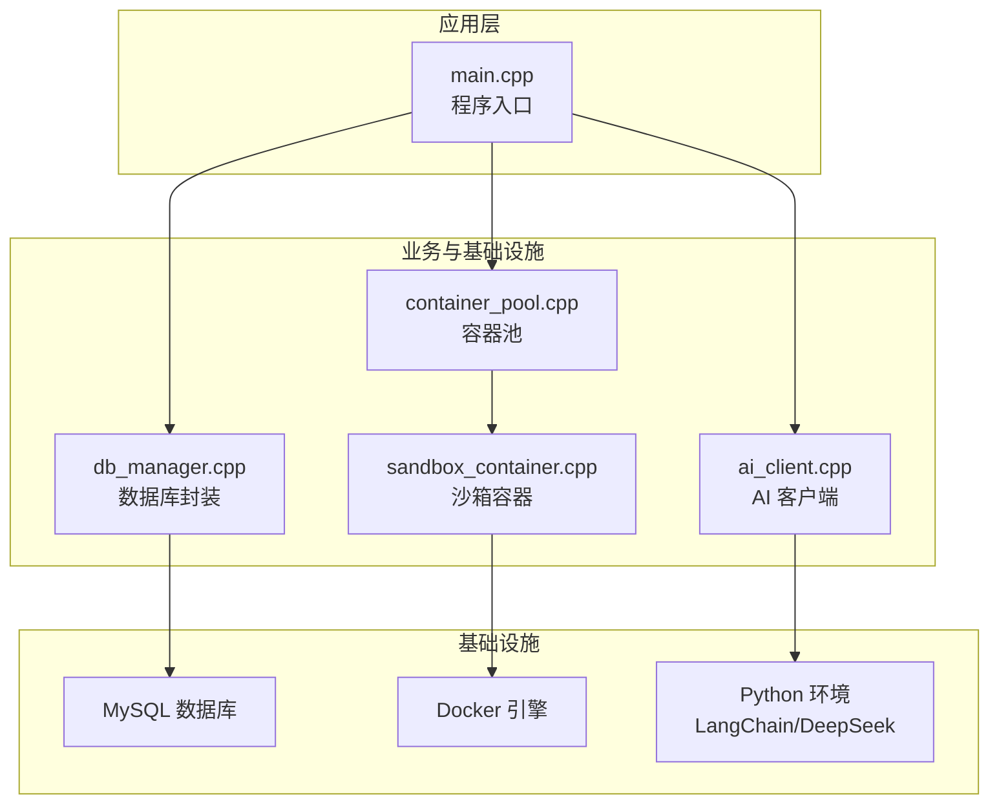
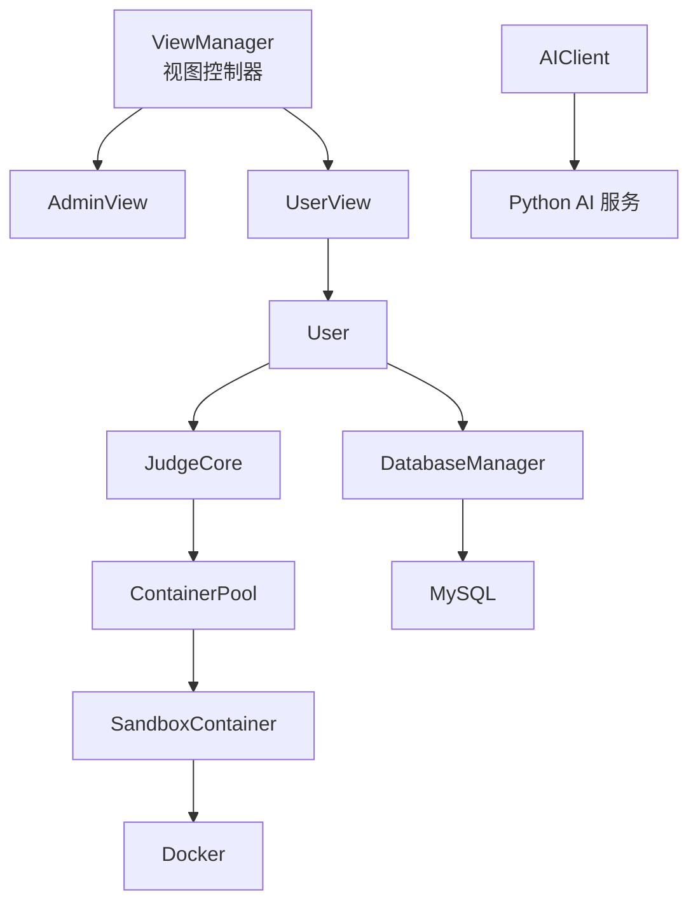
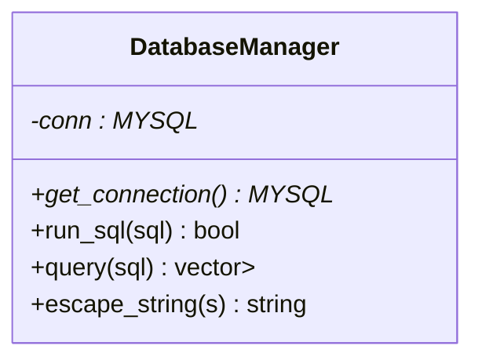
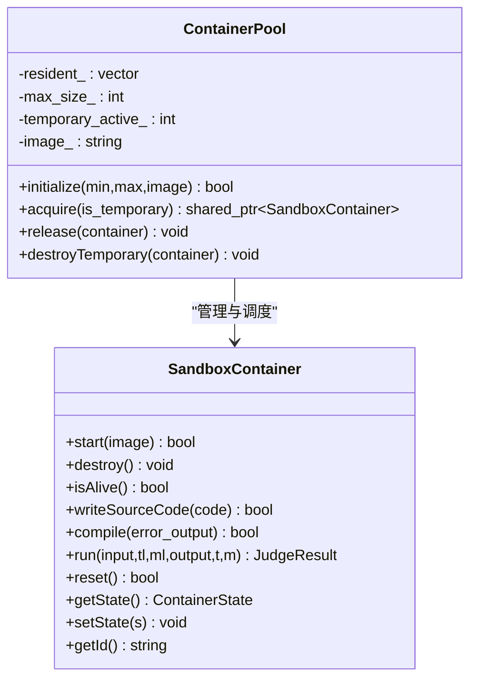
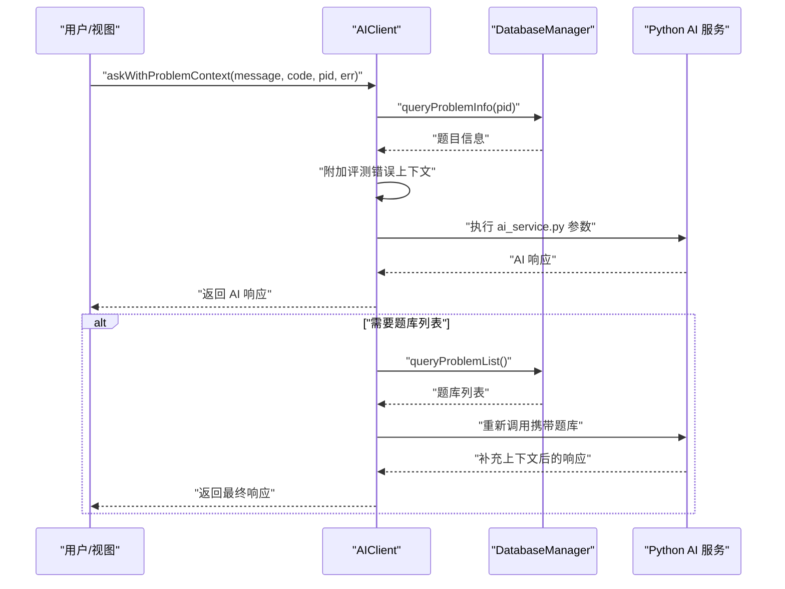
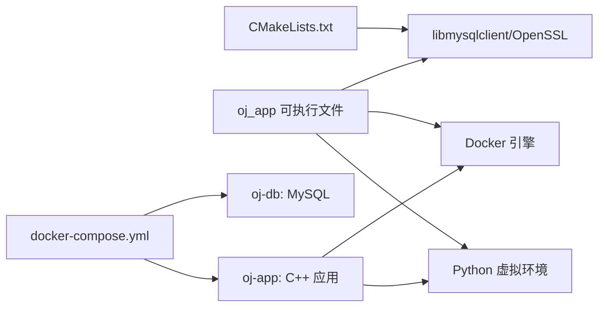
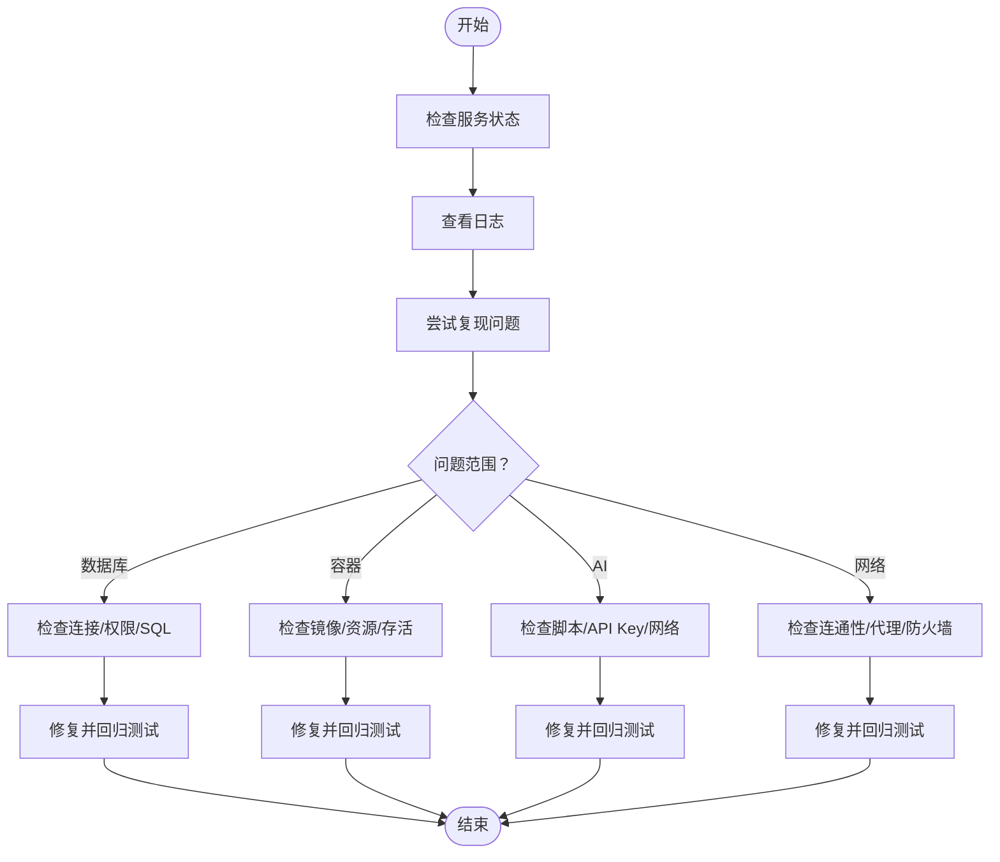

# 故障排除与维护

<cite>
**本文引用的文件**
- [README.md](file://README.md)
- [docker-compose.yml](file://docker-compose.yml)
- [docker-entrypoint.sh](file://docker-entrypoint.sh)
- [CMakeLists.txt](file://CMakeLists.txt)
- [init.sql](file://init.sql)
- [src/main.cpp](file://src/main.cpp)
- [src/db_manager.cpp](file://src/db_manager.cpp)
- [include/db_manager.h](file://include/db_manager.h)
- [src/container_pool.cpp](file://src/container_pool.cpp)
- [include/container_pool.h](file://include/container_pool.h)
- [src/sandbox_container.cpp](file://src/sandbox_container.cpp)
- [include/sandbox_container.h](file://include/sandbox_container.h)
- [src/ai_client.cpp](file://src/ai_client.cpp)
- [include/ai_client.h](file://include/ai_client.h)
- [docs/code_submission_design.md](file://docs/code_submission_design.md)
- [docs/judge_implementation_plan.md](file://docs/judge_implementation_plan.md)
</cite>

## 目录
1. [简介](#简介)
2. [项目结构](#项目结构)
3. [核心组件](#核心组件)
4. [架构总览](#架构总览)
5. [详细组件分析](#详细组件分析)
6. [依赖分析](#依赖分析)
7. [性能考量](#性能考量)
8. [故障排除指南](#故障排除指南)
9. [结论](#结论)
10. [附录](#附录)

## 简介
本指南面向系统运维与开发人员，围绕 OJ 在线评测系统的故障排除与长期维护提供实操方法。内容覆盖数据库、容器沙箱、AI 助手、日志与监控、性能瓶颈定位、升级与应急响应、技术演进与债务管理等主题。读者可据此快速定位问题、制定维护计划并提升系统稳定性与可维护性。

## 项目结构
系统采用 C++17 实现，结合 Docker 容器沙箱、MySQL 数据库存储、Python AI 服务与 CMake 构建体系。核心模块包括数据库管理、容器池与沙箱、AI 客户端以及主程序入口与视图层。

**图表来源**
- [src/main.cpp:1-14](file://src/main.cpp#L1-L14)
- [src/db_manager.cpp:1-108](file://src/db_manager.cpp#L1-L108)
- [src/container_pool.cpp:1-121](file://src/container_pool.cpp#L1-L121)
- [src/sandbox_container.cpp:1-187](file://src/sandbox_container.cpp#L1-L187)
- [src/ai_client.cpp:1-196](file://src/ai_client.cpp#L1-L196)

**章节来源**
- [README.md:233-266](file://README.md#L233-L266)
- [CMakeLists.txt:1-40](file://CMakeLists.txt#L1-L40)

## 核心组件
- 数据库管理器：封装 MySQL 连接、SQL 执行与查询结果解析，提供转义与错误处理。
- 容器池与沙箱：通过 Docker 命令行管理容器生命周期，实现隔离评测与资源限制。
- AI 客户端：以子进程方式调用 Python 脚本，传递会话、消息、代码与题目上下文。
- 主程序入口：创建视图管理器并启动登录菜单，后续流程由视图层驱动。

**章节来源**
- [include/db_manager.h:10-51](file://include/db_manager.h#L10-L51)
- [include/container_pool.h:11-76](file://include/container_pool.h#L11-L76)
- [include/sandbox_container.h:8-111](file://include/sandbox_container.h#L8-L111)
- [include/ai_client.h:7-49](file://include/ai_client.h#L7-L49)
- [src/main.cpp:5-13](file://src/main.cpp#L5-L13)

## 架构总览
系统采用“视图层-业务层-基础设施层”的分层架构，通过依赖注入将数据库连接参数集中管理，降低耦合。评测流程通过容器池与沙箱实现安全隔离与资源限制；AI 助手通过 C++ 子进程与 Python 服务交互。

**图表来源**
- [README.md:233-266](file://README.md#L233-L266)
- [src/db_manager.cpp:22-85](file://src/db_manager.cpp#L22-L85)
- [src/container_pool.cpp:26-89](file://src/container_pool.cpp#L26-L89)
- [src/sandbox_container.cpp:62-91](file://src/sandbox_container.cpp#L62-L91)
- [src/ai_client.cpp:128-184](file://src/ai_client.cpp#L128-L184)

## 详细组件分析

### 数据库管理器（DatabaseManager）
- 职责：建立连接、执行 SQL、查询结果集、字符串转义。
- 关键点：错误输出到标准错误；查询结果以列名到字符串映射形式返回；提供转义函数防注入。
- 常见问题：连接失败、SQL 执行失败、查询结果为空、转义不当导致注入风险。

**图表来源**
- [include/db_manager.h:11-46](file://include/db_manager.h#L11-L46)

**章节来源**
- [src/db_manager.cpp:9-108](file://src/db_manager.cpp#L9-L108)
- [include/db_manager.h:10-51](file://include/db_manager.h#L10-L51)

### 容器池与沙箱（ContainerPool/SandboxContainer）
- 调度策略：预热常驻容器，优先分配；达到上限则创建临时容器；评测完成后清理并归还或销毁临时容器。
- 沙箱特性：禁网、只读根文件系统、内存与进程数限制、非特权用户、内存 tmpfs。
- 常见问题：容器启动失败、容器存活检查失败、资源超限、临时容器计数不一致。

**图表来源**
- [include/container_pool.h:21-73](file://include/container_pool.h#L21-L73)
- [include/sandbox_container.h:26-108](file://include/sandbox_container.h#L26-L108)

**章节来源**
- [src/container_pool.cpp:26-121](file://src/container_pool.cpp#L26-L121)
- [src/sandbox_container.cpp:62-187](file://src/sandbox_container.cpp#L62-L187)
- [include/container_pool.h:11-76](file://include/container_pool.h#L11-L76)
- [include/sandbox_container.h:8-111](file://include/sandbox_container.h#L8-L111)

### AI 客户端（AIClient）
- 职责：读取工作区代码、查询题目信息、按需拉取题库列表、调用 Python 服务、处理空响应。
- 常见问题：Python 脚本路径不存在、AI 服务不可用、网络或 API Key 配置错误、返回空响应。

**图表来源**
- [src/ai_client.cpp:35-97](file://src/ai_client.cpp#L35-L97)
- [src/ai_client.cpp:128-184](file://src/ai_client.cpp#L128-L184)
- [include/ai_client.h:16-31](file://include/ai_client.h#L16-L31)

**章节来源**
- [src/ai_client.cpp:1-196](file://src/ai_client.cpp#L1-L196)
- [include/ai_client.h:7-49](file://include/ai_client.h#L7-L49)

### 主程序入口与视图层
- 入口：创建视图管理器并启动登录菜单，随后根据角色进入相应视图。
- 常见问题：入口未启动、菜单卡死、角色切换异常。

**章节来源**
- [src/main.cpp:5-13](file://src/main.cpp#L5-L13)

## 依赖分析
- 构建与运行依赖：CMake、libmysqlclient、OpenSSL、Docker、Python 虚拟环境。
- 运行时依赖：oj-db 健康检查、容器池与沙箱镜像、AI 环境与 API Key。

**图表来源**
- [CMakeLists.txt:11-34](file://CMakeLists.txt#L11-L34)
- [docker-compose.yml:13-81](file://docker-compose.yml#L13-L81)

**章节来源**
- [CMakeLists.txt:1-40](file://CMakeLists.txt#L1-L40)
- [docker-compose.yml:1-81](file://docker-compose.yml#L1-L81)

## 性能考量
- 容器池：预热常驻容器、按需创建临时容器、归还后清理复用，降低冷启动延迟。
- 资源限制：容器内设置内存上限、进程数限制、禁网与只读文件系统，结合时间与内存监控。
- 数据库：使用转义与索引，避免全表扫描；合理拆分查询与写入。
- AI：按需拉取题库列表，减少 Token 消耗；子进程调用避免阻塞主线程。

**章节来源**
- [src/container_pool.cpp:26-89](file://src/container_pool.cpp#L26-L89)
- [src/sandbox_container.cpp:62-91](file://src/sandbox_container.cpp#L62-L91)
- [src/sandbox_container.cpp:127-178](file://src/sandbox_container.cpp#L127-L178)
- [src/db_manager.cpp:45-85](file://src/db_manager.cpp#L45-L85)
- [src/ai_client.cpp:90-97](file://src/ai_client.cpp#L90-L97)

## 故障排除指南

### 通用诊断流程
- 确认服务状态：数据库、应用容器、Docker 引擎。
- 检查日志：容器日志、应用日志、AI 服务日志。
- 复现问题：最小化输入与步骤，确认是否可稳定复现。
- 逐步缩小范围：数据库、容器、AI、网络、权限。

### 数据库问题
- 症状：连接失败、查询无结果、写入失败。
- 诊断要点：
  - 确认 oj-db 健康状态与端口映射。
  - 检查凭据与权限（oj_admin/oj_user）。
  - 使用 init.sql 初始化表结构与示例数据。
  - 查看错误输出与 SQL 日志。
- 解决方案：
  - 重启 oj-db 容器并等待健康检查通过。
  - 校验连接参数与环境变量。
  - 使用数据库客户端验证 SQL 与权限。
  - 如需重置，停止并删除卷后重新初始化。

**章节来源**
- [docker-compose.yml:15-40](file://docker-compose.yml#L15-L40)
- [init.sql:8-95](file://init.sql#L8-L95)
- [src/db_manager.cpp:89-107](file://src/db_manager.cpp#L89-L107)

### 容器与沙箱问题
- 症状：容器启动失败、存活检查失败、资源超限、临时容器计数异常。
- 诊断要点：
  - 检查 Docker socket 挂载与权限（privileged）。
  - 确认 judge-sandbox 镜像存在或可构建。
  - 查看容器日志与资源使用。
- 解决方案：
  - 确保宿主机 Docker 可用且具备权限。
  - 重新构建沙箱镜像或使用已有镜像。
  - 调整容器池规模与资源限制。
  - 销毁异常容器并重建。

**章节来源**
- [docker-compose.yml:42-71](file://docker-compose.yml#L42-L71)
- [docker-entrypoint.sh:46-67](file://docker-entrypoint.sh#L46-L67)
- [src/sandbox_container.cpp:62-109](file://src/sandbox_container.cpp#L62-L109)
- [src/container_pool.cpp:26-121](file://src/container_pool.cpp#L26-L121)

### AI 助手问题
- 症状：AI 返回空响应、API Key 无效、题库列表缺失。
- 诊断要点：
  - 检查 DEEPSEEK_API_KEY 环境变量与 .env 文件。
  - 确认 Python 虚拟环境与脚本路径。
  - 观察两阶段上下文拼接是否触发。
- 解决方案：
  - 填写有效 API Key 并重启容器。
  - 校验 Python 路径与脚本可执行性。
  - 确保数据库可查询题目信息与列表。

**章节来源**
- [docker-compose.yml:55-63](file://docker-compose.yml#L55-L63)
- [docker-entrypoint.sh:69-78](file://docker-entrypoint.sh#L69-L78)
- [src/ai_client.cpp:186-196](file://src/ai_client.cpp#L186-L196)
- [src/ai_client.cpp:35-97](file://src/ai_client.cpp#L35-L97)

### 网络与权限问题
- 症状：应用无法连接数据库、Docker 命令失败、AI 请求超时。
- 诊断要点：
  - 检查端口映射与防火墙。
  - 确认 privileged 权限与 Docker socket 挂载。
  - 校验 API Key 与网络代理。
- 解决方案：
  - 修正 compose 配置与网络策略。
  - 重新挂载 Docker socket 并赋予权限。
  - 配置代理或直连网络。

**章节来源**
- [docker-compose.yml:13-81](file://docker-compose.yml#L13-L81)
- [docker-entrypoint.sh:26-44](file://docker-entrypoint.sh#L26-L44)

### 日志与监控
- 应用日志：查看 oj-app 容器标准输出与错误输出。
- 数据库日志：使用 compose logs oj-db 查看 MySQL 日志。
- 健康检查：oj-db 的 healthcheck 与容器存活检查。
- 建议：在生产环境增加结构化日志与告警。

**章节来源**
- [docker-compose.yml:32-37](file://docker-compose.yml#L32-L37)
- [docker-entrypoint.sh:26-44](file://docker-entrypoint.sh#L26-L44)

### 性能瓶颈识别
- 容器启动延迟：检查镜像大小与预热策略。
- 评测吞吐：观察容器池利用率与临时容器创建频率。
- 资源使用：监控内存、CPU、磁盘与 I/O。
- 数据库压力：检查慢查询与锁等待。

**章节来源**
- [src/container_pool.cpp:26-89](file://src/container_pool.cpp#L26-L89)
- [src/sandbox_container.cpp:127-178](file://src/sandbox_container.cpp#L127-L178)

### 维护计划与升级策略
- 计划性维护：定期备份数据库、轮换 API Key、更新沙箱镜像。
- 升级策略：灰度发布、回滚预案、兼容性测试。
- 应急响应：快速定位、隔离问题、恢复服务、事后复盘。

**章节来源**
- [README.md:73-61](file://README.md#L73-L61)

### 技术演进与债务管理
- 代码提交与历史管理：统一工作区文件、AI 上下文增强、历史记录下载与加载。
- 评测机实现：容器池、资源监控、安全隔离与并行评测。
- 债务管理：逐步替换子进程调用为 HTTP 接口、引入日志与监控框架、完善单元测试。

**章节来源**
- [docs/code_submission_design.md:1-629](file://docs/code_submission_design.md#L1-L629)
- [docs/judge_implementation_plan.md:1-748](file://docs/judge_implementation_plan.md#L1-L748)

## 结论
通过明确的组件职责、完善的健康检查与日志机制、合理的容器与资源管理策略，以及针对数据库、容器、AI 的专项故障排查流程，可显著提升 OJ 系统的稳定性与可维护性。建议持续完善监控与自动化运维能力，推进技术债务偿还与架构演进。

## 附录

### 常用命令速查
- 启动数据库：docker compose up -d oj-db
- 启动应用：docker compose run --rm oj-app
- 查看日志：docker compose logs oj-db
- 停止并删除数据：docker compose down -v
- 重新构建应用：docker compose build oj-app

**章节来源**
- [README.md:28-61](file://README.md#L28-L61)