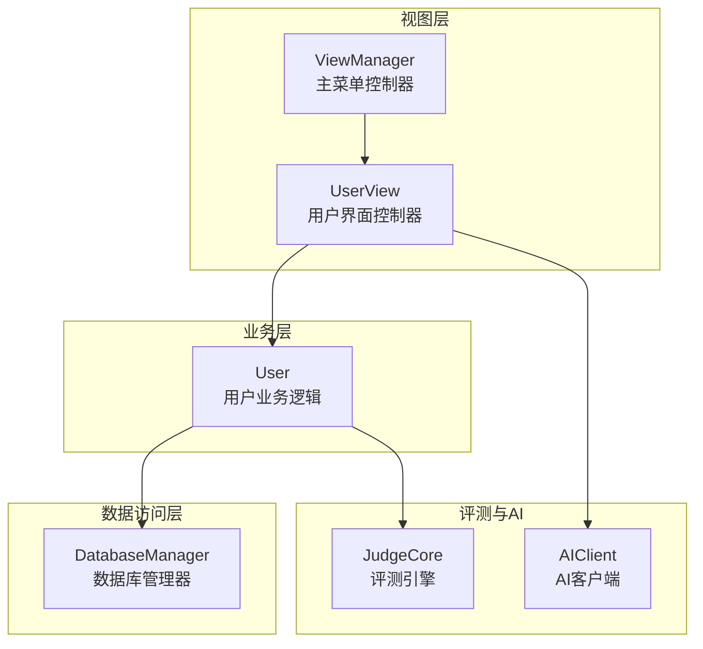
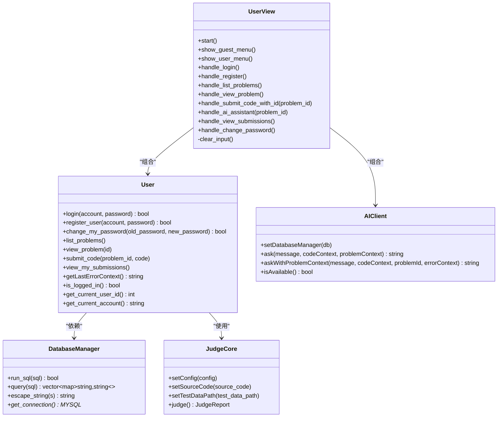
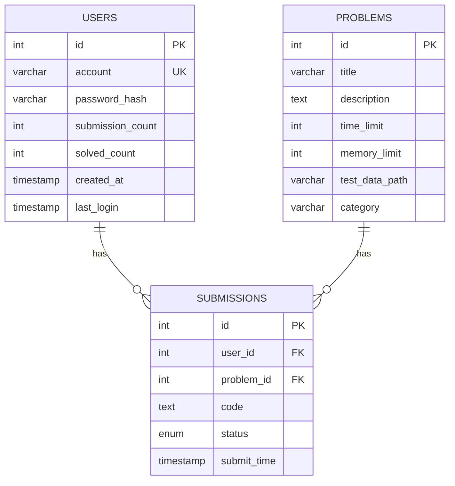
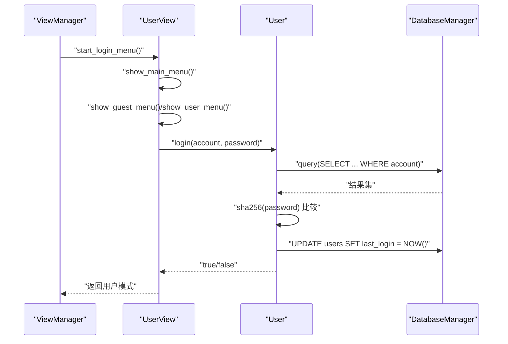
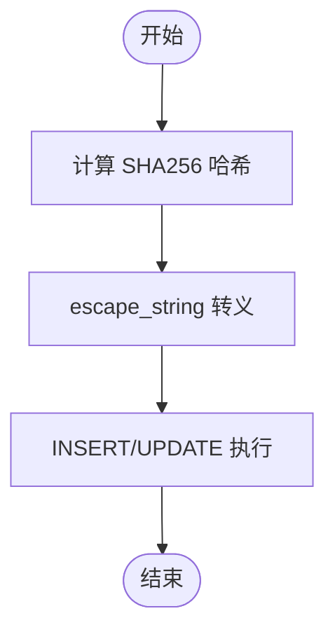
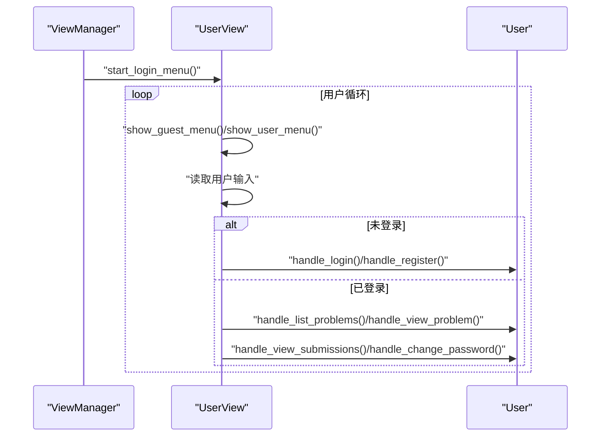
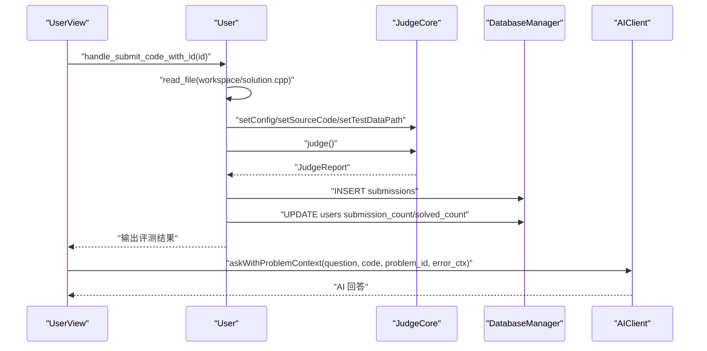
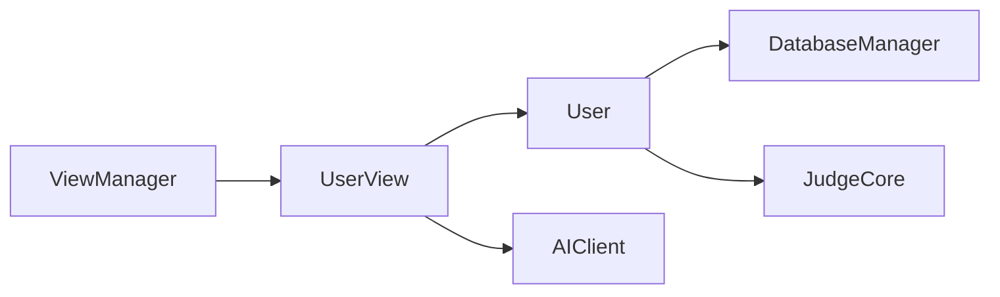

# 用户功能模块

<cite>
**本文档引用的文件**
- [src/user.cpp](file://src/user.cpp)
- [include/user.h](file://include/user.h)
- [src/user_view.cpp](file://src/user_view.cpp)
- [include/user_view.h](file://include/user_view.h)
- [src/db_manager.cpp](file://src/db_manager.cpp)
- [include/db_manager.h](file://include/db_manager.h)
- [init.sql](file://init.sql)
- [src/main.cpp](file://src/main.cpp)
- [include/view_manager.h](file://include/view_manager.h)
- [src/view_manager.cpp](file://src/view_manager.cpp)
- [include/judge_core.h](file://include/judge_core.h)
- [include/ai_client.h](file://include/ai_client.h)
</cite>

## 目录
1. [简介](#简介)
2. [项目结构](#项目结构)
3. [核心组件](#核心组件)
4. [架构总览](#架构总览)
5. [详细组件分析](#详细组件分析)
6. [依赖关系分析](#依赖关系分析)
7. [性能考虑](#性能考虑)
8. [故障排除指南](#故障排除指南)
9. [结论](#结论)
10. [附录](#附录)

## 简介
本文件全面解析 OJ 系统中的用户功能模块，涵盖用户注册、登录、密码修改、题目浏览、代码提交、评测反馈以及与 AI 助手的交互流程。文档从数据模型设计、会话管理机制、密码加密存储、UI 交互流程到关键 API 的使用方法进行深入说明，并提供最佳实践与常见问题解决方案，帮助开发者与使用者高效理解与使用用户功能。

## 项目结构
用户功能模块主要由以下层次构成：
- 视图层：用户界面控制器，负责菜单展示与用户输入处理
- 业务层：用户业务逻辑，负责认证、题目浏览、代码提交与统计更新
- 数据访问层：数据库管理器，负责 SQL 执行与结果解析
- 评测与 AI 层：评测引擎与 AI 客户端，提供代码评测与智能辅助

图表来源
- [src/view_manager.cpp:33-71](file://src/view_manager.cpp#L33-L71)
- [src/user_view.cpp:39-134](file://src/user_view.cpp#L39-L134)
- [src/user.cpp:12-142](file://src/user.cpp#L12-L142)
- [src/db_manager.cpp:22-85](file://src/db_manager.cpp#L22-L85)
- [include/judge_core.h:60-92](file://include/judge_core.h#L60-L92)
- [include/ai_client.h:7-34](file://include/ai_client.h#L7-L34)

章节来源
- [src/main.cpp:5-13](file://src/main.cpp#L5-L13)
- [include/view_manager.h:10-31](file://include/view_manager.h#L10-L31)
- [src/view_manager.cpp:33-71](file://src/view_manager.cpp#L33-L71)

## 核心组件
- 用户类（User）：封装登录、注册、密码修改、题目浏览、代码提交、提交记录查看等核心业务逻辑
- 用户视图类（UserView）：负责命令行菜单展示、用户输入处理、与 User 的交互协调
- 数据库管理器（DatabaseManager）：封装 MySQL 连接、SQL 执行、查询结果解析与转义
- 评测核心（JudgeCore）：封装评测配置、源码设置、测试数据路径设置与评测主流程
- AI 客户端（AIClient）：封装与 Python 脚本的交互，提供带题目上下文的问答能力

章节来源
- [include/user.h:10-77](file://include/user.h#L10-L77)
- [src/user.cpp:40-452](file://src/user.cpp#L40-L452)
- [include/user_view.h:10-65](file://include/user_view.h#L10-L65)
- [src/user_view.cpp:25-384](file://src/user_view.cpp#L25-L384)
- [include/db_manager.h:11-46](file://include/db_manager.h#L11-L46)
- [src/db_manager.cpp:9-107](file://src/db_manager.cpp#L9-L107)
- [include/judge_core.h:60-101](file://include/judge_core.h#L60-L101)
- [include/ai_client.h:7-46](file://include/ai_client.h#L7-L46)

## 架构总览
用户功能模块采用分层架构，职责清晰：
- 视图层负责用户交互与流程控制
- 业务层负责领域逻辑与数据一致性
- 数据访问层负责与数据库的交互与安全
- 评测与 AI 层提供扩展能力

图表来源
- [include/user_view.h:10-65](file://include/user_view.h#L10-L65)
- [include/user.h:10-77](file://include/user.h#L10-L77)
- [include/db_manager.h:11-46](file://include/db_manager.h#L11-L46)
- [include/judge_core.h:60-101](file://include/judge_core.h#L60-L101)
- [include/ai_client.h:7-46](file://include/ai_client.h#L7-L46)

## 详细组件分析

### 用户数据模型设计
用户数据模型由初始化脚本定义，包含以下关键字段：
- id：自增主键，内部使用
- account：唯一登录账号
- password_hash：密码哈希（SHA256）
- submission_count：提交题目数量
- solved_count：解决题目数量
- created_at：注册时间
- last_login：最后登录时间

图表来源
- [init.sql:26-39](file://init.sql#L26-L39)
- [init.sql:41-61](file://init.sql#L41-L61)

章节来源
- [init.sql:26-39](file://init.sql#L26-L39)
- [init.sql:41-61](file://init.sql#L41-L61)

### 会话管理机制
- 登录状态：User 维护 logged_in、current_user_id、current_account 三个状态字段
- 会话生命周期：从 ViewManager 启动登录菜单，进入 UserView 后根据登录状态切换菜单
- 会话持久化：登录成功后更新 last_login 字段，便于审计与统计

图表来源
- [src/view_manager.cpp:33-71](file://src/view_manager.cpp#L33-L71)
- [src/user_view.cpp:39-134](file://src/user_view.cpp#L39-L134)
- [src/user.cpp:40-73](file://src/user.cpp#L40-L73)
- [src/db_manager.cpp:54-85](file://src/db_manager.cpp#L54-L85)

章节来源
- [src/user.cpp:12-12](file://src/user.cpp#L12-L12)
- [src/user.cpp:64-69](file://src/user.cpp#L64-L69)
- [src/user_view.cpp:56-63](file://src/user_view.cpp#L56-L63)

### 密码加密存储与安全措施
- 哈希算法：使用 OpenSSL EVP 接口生成 SHA256 哈希
- 防注入：DatabaseManager.escape_string 对 SQL 字符串进行转义
- 数据库权限：应用使用受限数据库用户，通过 WHERE id = current_user_id 实现行级隔离

图表来源
- [src/user.cpp:15-38](file://src/user.cpp#L15-L38)
- [src/db_manager.cpp:45-52](file://src/db_manager.cpp#L45-L52)
- [init.sql:28-39](file://init.sql#L28-L39)

章节来源
- [src/user.cpp:15-38](file://src/user.cpp#L15-L38)
- [src/db_manager.cpp:45-52](file://src/db_manager.cpp#L45-L52)
- [init.sql:28-39](file://init.sql#L28-L39)

### 用户界面交互流程
- 主菜单：管理员进入、用户进入、退出系统
- 用户模式菜单：题目列表、题目详情、我的提交、修改密码、退出登录
- 题目详情子菜单：提交代码、AI 助手、返回用户模式

图表来源
- [src/view_manager.cpp:33-71](file://src/view_manager.cpp#L33-L71)
- [src/user_view.cpp:39-134](file://src/user_view.cpp#L39-L134)

章节来源
- [src/view_manager.cpp:22-71](file://src/view_manager.cpp#L22-L71)
- [src/user_view.cpp:136-160](file://src/user_view.cpp#L136-L160)
- [src/user_view.cpp:216-277](file://src/user_view.cpp#L216-L277)

### 关键 API 使用说明

#### login(account, password)
- 参数
  - account：登录账号
  - password：密码明文
- 返回值
  - 成功返回 true，失败返回 false
- 处理流程
  - 查询用户记录并比较哈希
  - 登录成功后更新 last_login
  - 设置当前用户状态

章节来源
- [include/user.h:16-22](file://include/user.h#L16-L22)
- [src/user.cpp:40-73](file://src/user.cpp#L40-L73)

#### register_user(account, password)
- 参数
  - account：新账号
  - password：新密码
- 返回值
  - 成功返回 true，失败返回 false
- 处理流程
  - 检查账号是否存在
  - 计算 SHA256 哈希并插入用户表

章节来源
- [include/user.h:24-30](file://include/user.h#L24-L30)
- [src/user.cpp:75-102](file://src/user.cpp#L75-L102)

#### change_my_password(old_password, new_password)
- 参数
  - old_password：旧密码
  - new_password：新密码
- 返回值
  - 成功返回 true，失败返回 false
- 处理流程
  - 校验登录状态
  - 验证旧密码哈希
  - 计算新哈希并更新

章节来源
- [include/user.h:32-38](file://include/user.h#L32-L38)
- [src/user.cpp:104-142](file://src/user.cpp#L104-L142)

#### list_problems()
- 功能
  - 列出所有题目，支持中文标题宽度计算与截断
- 返回值
  - 无返回值，直接输出到控制台

章节来源
- [include/user.h:40-41](file://include/user.h#L40-L41)
- [src/user.cpp:144-238](file://src/user.cpp#L144-L238)

#### view_problem(id)
- 参数
  - id：题目 ID
- 功能
  - 输出题目详情（标题、知识点、限制、描述）

章节来源
- [include/user.h:43-47](file://include/user.h#L43-L47)
- [src/user.cpp:240-267](file://src/user.cpp#L240-L267)

#### submit_code(problem_id, code)
- 参数
  - problem_id：题目 ID
  - code：源代码字符串
- 返回值
  - 无返回值，直接输出评测结果
- 处理流程
  - 获取题目配置与测试数据路径
  - 初始化评测引擎并执行评测
  - 构建错误上下文（供 AI 使用）
  - 插入提交记录并更新用户统计
  - 输出评测结果

章节来源
- [include/user.h:49-54](file://include/user.h#L49-L54)
- [src/user.cpp:269-452](file://src/user.cpp#L269-L452)
- [include/judge_core.h:60-92](file://include/judge_core.h#L60-L92)

#### view_my_submissions()
- 功能
  - 查看当前用户最近 20 条提交记录
- 返回值
  - 无返回值，直接输出到控制台

章节来源
- [include/user.h:56-57](file://include/user.h#L56-L57)
- [src/user.cpp:454-513](file://src/user.cpp#L454-L513)

### 评测与 AI 集成
- 评测引擎：JudgeCore 负责配置、源码与测试数据设置，并返回评测报告
- AI 助手：AIClient 支持带题目上下文的问答，自动查询最近评测错误上下文

图表来源
- [src/user_view.cpp:279-291](file://src/user_view.cpp#L279-L291)
- [src/user.cpp:269-452](file://src/user.cpp#L269-L452)
- [include/judge_core.h:60-92](file://include/judge_core.h#L60-L92)
- [include/ai_client.h:28-31](file://include/ai_client.h#L28-L31)

章节来源
- [src/user_view.cpp:279-344](file://src/user_view.cpp#L279-L344)
- [src/user.cpp:317-411](file://src/user.cpp#L317-L411)

## 依赖关系分析
- User 依赖 DatabaseManager 进行数据访问
- User 依赖 JudgeCore 进行代码评测
- UserView 依赖 User 与 AIClient 进行交互与 AI 辅助
- ViewManager 负责角色选择与视图启动

图表来源
- [include/user_view.h:20-22](file://include/user_view.h#L20-L22)
- [include/user.h:72-76](file://include/user.h#L72-L76)
- [include/view_manager.h:20-21](file://include/view_manager.h#L20-L21)

章节来源
- [include/user_view.h:20-22](file://include/user_view.h#L20-L22)
- [include/user.h:72-76](file://include/user.h#L72-L76)
- [include/view_manager.h:20-21](file://include/view_manager.h#L20-L21)

## 性能考虑
- 中文标题宽度计算：在输出前进行 UTF-8 字符宽度计算与截断，避免控制台显示错位
- 评测并发：评测引擎基于容器化隔离，建议合理配置时间与内存限制，避免超时与超内存
- 数据库连接：使用统一的 DatabaseManager 管理连接与转义，减少重复连接开销
- 日志与输出：控制台输出采用 ANSI 转义序列，注意在不同终端下的兼容性

## 故障排除指南
- 登录失败
  - 检查账号是否存在与密码哈希是否匹配
  - 确认数据库连接正常
- 注册失败
  - 检查账号是否已存在
  - 确认密码哈希计算与转义正确
- 提交失败
  - 检查题目是否存在与测试数据路径是否有效
  - 确认评测引擎配置（时间/内存限制）
- AI 助手不可用
  - 检查 AIClient 可用性与 Python 脚本路径
  - 确认数据库连接已注入到 AI 客户端

章节来源
- [src/user.cpp:49-53](file://src/user.cpp#L49-L53)
- [src/user.cpp:84-88](file://src/user.cpp#L84-L88)
- [src/user.cpp:283-304](file://src/user.cpp#L283-L304)
- [src/user_view.cpp:297-304](file://src/user_view.cpp#L297-L304)

## 结论
用户功能模块通过清晰的分层设计实现了完整的用户生命周期管理：从登录认证、题目浏览、代码提交到评测反馈与 AI 辅助。模块采用 SHA256 哈希与 SQL 转义保障安全性，结合容器化评测引擎提供可靠的判题能力。建议在生产环境中进一步引入更安全的密码哈希方案（如 bcrypt/scrypt）与会话令牌机制，以提升整体安全性与可维护性。

## 附录
- 数据库初始化脚本提供了完整的表结构与示例数据，便于快速部署与测试
- 用户模式菜单支持多级导航，操作直观，适合初学者使用

章节来源
- [init.sql:9-278](file://init.sql#L9-L278)