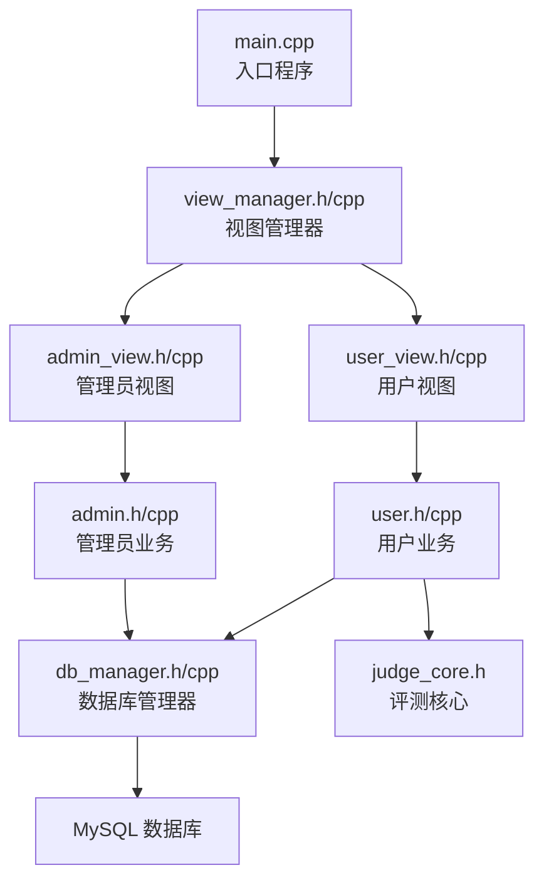
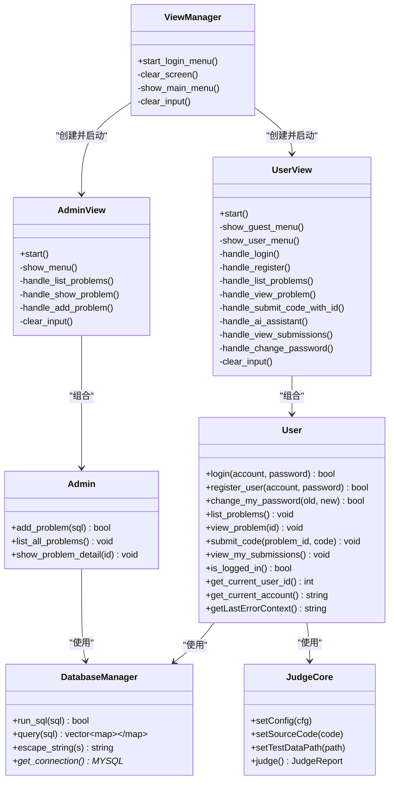
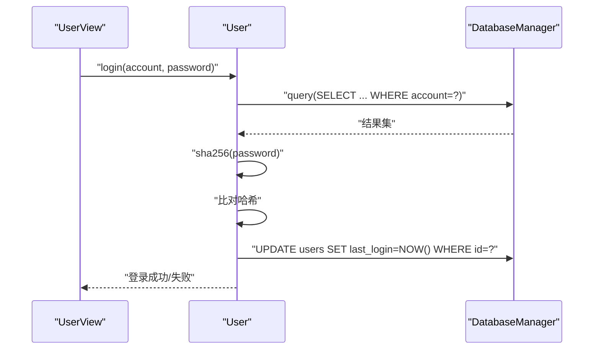
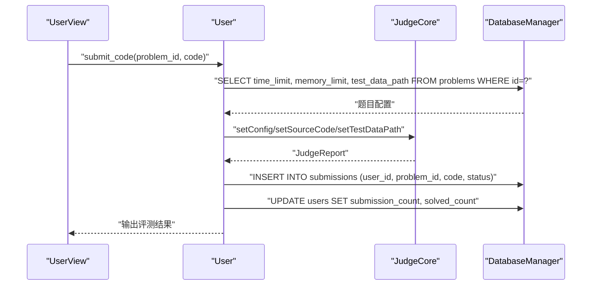
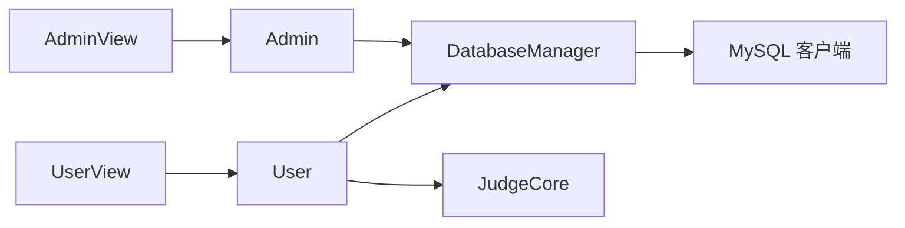

# 用户管理系统

<cite>
**本文引用的文件**
- [src/main.cpp](file://src/main.cpp)
- [include/view_manager.h](file://include/view_manager.h)
- [src/view_manager.cpp](file://src/view_manager.cpp)
- [include/user_view.h](file://include/user_view.h)
- [src/user_view.cpp](file://src/user_view.cpp)
- [include/admin_view.h](file://include/admin_view.h)
- [src/admin_view.cpp](file://src/admin_view.cpp)
- [include/user.h](file://include/user.h)
- [src/user.cpp](file://src/user.cpp)
- [include/admin.h](file://include/admin.h)
- [src/admin.cpp](file://src/admin.cpp)
- [include/db_manager.h](file://include/db_manager.h)
- [src/db_manager.cpp](file://src/db_manager.cpp)
- [include/judge_core.h](file://include/judge_core.h)
- [init.sql](file://init.sql)
</cite>

## 目录
1. [简介](#简介)
2. [项目结构](#项目结构)
3. [核心组件](#核心组件)
4. [架构总览](#架构总览)
5. [详细组件分析](#详细组件分析)
6. [依赖关系分析](#依赖关系分析)
7. [性能考量](#性能考量)
8. [故障排查指南](#故障排查指南)
9. [结论](#结论)
10. [附录](#附录)

## 简介
本系统是一个基于命令行的在线判题平台（OJ），围绕“用户管理”与“题目评测”两大核心展开。系统提供用户注册、登录、密码修改、题目浏览与提交评测等功能；同时为管理员提供题目发布与管理能力。系统采用命令行界面，通过视图层分发到用户/管理员业务逻辑，业务逻辑通过数据库管理层访问MySQL数据库，评测流程由独立的评测核心模块完成。

## 项目结构
系统采用“视图层-业务层-数据访问层”的分层组织方式，配合少量工具与配置文件，形成清晰的职责划分：

- 入口程序：启动视图管理器，引导用户选择角色（管理员/普通用户）
- 视图层：负责用户交互与菜单展示，根据登录状态切换不同菜单
- 业务层：用户类与管理员类封装各自业务逻辑（登录、注册、密码修改、题目列表、提交评测、题目发布等）
- 数据访问层：统一的数据库管理器封装MySQL连接、查询与转义
- 评测核心：封装评测配置、执行与报告生成
- 数据库初始化：提供完整的DDL与示例数据初始化脚本

图表来源
- [src/main.cpp:1-14](file://src/main.cpp#L1-L14)
- [src/view_manager.cpp:33-71](file://src/view_manager.cpp#L33-L71)
- [src/user_view.cpp:39-134](file://src/user_view.cpp#L39-L134)
- [src/admin_view.cpp:22-76](file://src/admin_view.cpp#L22-L76)
- [src/user.cpp:12-142](file://src/user.cpp#L12-L142)
- [src/admin.cpp:8-15](file://src/admin.cpp#L8-L15)
- [src/db_manager.cpp:9-107](file://src/db_manager.cpp#L9-L107)
- [include/judge_core.h:60-101](file://include/judge_core.h#L60-L101)

章节来源
- [src/main.cpp:1-14](file://src/main.cpp#L1-L14)
- [include/view_manager.h:10-31](file://include/view_manager.h#L10-L31)
- [src/view_manager.cpp:33-71](file://src/view_manager.cpp#L33-L71)

## 核心组件
- 视图管理器：负责登录菜单、清屏、主菜单展示与输入处理
- 用户视图：封装用户模式下的菜单与交互，包括登录/注册/查看题目/提交评测/查看提交记录/修改密码
- 管理员视图：封装管理员模式下的菜单与交互，包括查看题目列表、查看题目详情、发布题目
- 用户业务：封装用户侧业务逻辑，包括登录、注册、密码修改、题目列表、题目详情、提交评测、查看提交记录
- 管理员业务：封装管理员侧业务逻辑，包括发布题目、查看题目列表、查看题目详情
- 数据库管理器：封装MySQL连接、查询、写入与字符串转义
- 评测核心：封装评测配置、源代码设置、测试数据路径设置与评测执行

章节来源
- [include/view_manager.h:10-31](file://include/view_manager.h#L10-L31)
- [include/user_view.h:10-65](file://include/user_view.h#L10-L65)
- [include/admin_view.h:10-40](file://include/admin_view.h#L10-L40)
- [include/user.h:10-77](file://include/user.h#L10-L77)
- [include/admin.h:9-29](file://include/admin.h#L9-L29)
- [include/db_manager.h:11-46](file://include/db_manager.h#L11-L46)
- [include/judge_core.h:60-101](file://include/judge_core.h#L60-L101)

## 架构总览
系统采用分层架构，职责清晰：
- 视图层：负责UI与交互，按登录状态切换菜单
- 业务层：面向角色的业务逻辑，调用数据库管理器与评测核心
- 数据访问层：统一的数据库抽象，屏蔽底层MySQL细节
- 评测层：独立的评测引擎，支持容器化隔离与资源限制

图表来源
- [include/view_manager.h:10-31](file://include/view_manager.h#L10-L31)
- [include/user_view.h:10-65](file://include/user_view.h#L10-L65)
- [include/admin_view.h:10-40](file://include/admin_view.h#L10-L40)
- [include/user.h:10-77](file://include/user.h#L10-L77)
- [include/admin.h:9-29](file://include/admin.h#L9-L29)
- [include/db_manager.h:11-46](file://include/db_manager.h#L11-L46)
- [include/judge_core.h:60-101](file://include/judge_core.h#L60-L101)

## 详细组件分析

### 用户注册与登录流程
用户在未登录状态下可通过用户视图进行注册与登录。登录时，系统查询用户表并比对SHA256哈希；注册时，系统检查账号唯一性并写入哈希后的密码。

图表来源
- [src/user_view.cpp:162-187](file://src/user_view.cpp#L162-L187)
- [src/user.cpp:40-73](file://src/user.cpp#L40-L73)
- [src/db_manager.cpp:54-85](file://src/db_manager.cpp#L54-L85)

章节来源
- [src/user_view.cpp:162-214](file://src/user_view.cpp#L162-L214)
- [src/user.cpp:40-102](file://src/user.cpp#L40-L102)

### 密码加密存储机制
- 登录/注册/修改密码均使用SHA256对明文密码进行哈希
- 数据库存储的是密码哈希值，不保存明文
- 输入参数通过数据库管理器进行转义，降低SQL注入风险

章节来源
- [src/user.cpp:14-38](file://src/user.cpp#L14-L38)
- [src/user.cpp:40-142](file://src/user.cpp#L40-L142)
- [src/db_manager.cpp:45-52](file://src/db_manager.cpp#L45-L52)

### 题目列表与详情展示
- 用户可查看题目列表，系统对标题进行UTF-8宽度计算与截断，避免终端乱码
- 查看题目详情时，系统输出题目描述与限制信息

章节来源
- [src/user.cpp:144-267](file://src/user.cpp#L144-L267)

### 提交评测与结果记录
- 用户提交代码后，系统读取工作区文件，构建评测配置并执行评测
- 评测完成后，根据结果写入提交记录表，并更新用户统计字段
- 若评测失败，系统生成错误上下文供AI辅助分析

图表来源
- [src/user_view.cpp:279-291](file://src/user_view.cpp#L279-L291)
- [src/user.cpp:269-452](file://src/user.cpp#L269-L452)
- [include/judge_core.h:60-101](file://include/judge_core.h#L60-L101)

章节来源
- [src/user_view.cpp:279-384](file://src/user_view.cpp#L279-L384)
- [src/user.cpp:269-452](file://src/user.cpp#L269-L452)

### 查看我的提交记录
- 展示最近20条提交记录，包含题目标题、状态与提交时间
- 对状态进行颜色区分，便于快速识别

章节来源
- [src/user.cpp:454-513](file://src/user.cpp#L454-L513)

### 管理员功能模块
- 查看题目列表与详情：与用户一致的展示逻辑
- 发布新题目：直接执行管理员提供的SQL语句，适合快速发布题目

章节来源
- [src/admin_view.cpp:91-131](file://src/admin_view.cpp#L91-L131)
- [src/admin.cpp:17-132](file://src/admin.cpp#L17-L132)

### 数据模型设计
- 用户表：包含账号、密码哈希、提交计数、解题计数、注册时间、最后登录时间等
- 题目表：包含题目标题、描述、时间/内存限制、测试数据路径、分类等
- 提交记录表：包含用户ID、题目ID、代码、状态、提交时间，并建立外键约束

章节来源
- [init.sql:14-61](file://init.sql#L14-L61)

## 依赖关系分析
- 视图层依赖业务层：用户视图与管理员视图分别组合用户与管理员对象
- 业务层依赖数据访问层：用户与管理员均通过数据库管理器访问MySQL
- 业务层依赖评测核心：用户提交评测时调用评测核心
- 数据库管理器依赖MySQL客户端库：封装连接、查询与转义

图表来源
- [src/user_view.cpp:48-50](file://src/user_view.cpp#L48-L50)
- [src/admin_view.cpp:31](file://src/admin_view.cpp#L31)
- [src/user.cpp:12](file://src/user.cpp#L12)
- [src/admin.cpp:8](file://src/admin.cpp#L8)
- [src/db_manager.cpp:9-107](file://src/db_manager.cpp#L9-L107)

章节来源
- [src/user_view.cpp:25-134](file://src/user_view.cpp#L25-L134)
- [src/admin_view.cpp:10-76](file://src/admin_view.cpp#L10-L76)
- [src/user.cpp:12-142](file://src/user.cpp#L12-L142)
- [src/admin.cpp:8-15](file://src/admin.cpp#L8-L15)
- [src/db_manager.cpp:9-107](file://src/db_manager.cpp#L9-L107)

## 性能考量
- 终端渲染优化：题目列表对UTF-8字符按显示宽度计算与截断，避免乱码与布局错位
- 数据库索引：用户表对账号建立索引，提升登录与注册查询效率
- 评测资源限制：评测核心支持时间/内存限制，保障系统稳定性
- I/O与缓存：提交记录展示限制最近20条，减少一次性输出与网络传输压力

章节来源
- [src/user.cpp:172-238](file://src/user.cpp#L172-L238)
- [init.sql:36-38](file://init.sql#L36-L38)
- [include/judge_core.h:24-29](file://include/judge_core.h#L24-L29)

## 故障排查指南
- 登录失败
  - 检查账号是否存在与密码是否正确
  - 确认数据库连接正常
- 注册失败
  - 检查账号是否已存在
  - 确认数据库写入权限
- 提交评测失败
  - 检查工作区文件是否存在且非空
  - 检查题目测试数据路径是否存在
  - 查看评测报告中的错误信息
- 数据库连接失败
  - 检查数据库用户名、密码与主机配置
  - 确认MySQL服务运行与网络连通

章节来源
- [src/user_view.cpp:162-214](file://src/user_view.cpp#L162-L214)
- [src/user.cpp:269-452](file://src/user.cpp#L269-L452)
- [src/db_manager.cpp:22-43](file://src/db_manager.cpp#L22-L43)

## 结论
本系统围绕用户与管理员两类角色，提供了完整的用户管理与题目评测能力。通过分层架构与明确的职责划分，系统具备良好的可维护性与扩展性。在安全性方面，采用SHA256哈希与字符串转义降低常见风险；在用户体验方面，通过终端友好展示与简洁交互流程提升易用性。后续可在会话管理、权限细化、日志审计等方面进一步增强。

## 附录
- 关键API与参数
  - 用户登录：接收账号与密码，返回布尔值
  - 用户注册：接收账号与密码，返回布尔值
  - 修改密码：接收旧密码与新密码，返回布尔值
  - 查看题目列表：无参数，输出格式化表格
  - 查看题目详情：接收题目ID，输出题目信息
  - 提交评测：接收题目ID与代码，返回评测报告
  - 查看我的提交：无参数，输出最近20条记录
  - 管理员发布题目：接收SQL语句，返回执行结果

章节来源
- [include/user.h:16-69](file://include/user.h#L16-L69)
- [include/admin.h:15-25](file://include/admin.h#L15-L25)
- [include/judge_core.h:60-101](file://include/judge_core.h#L60-L101)