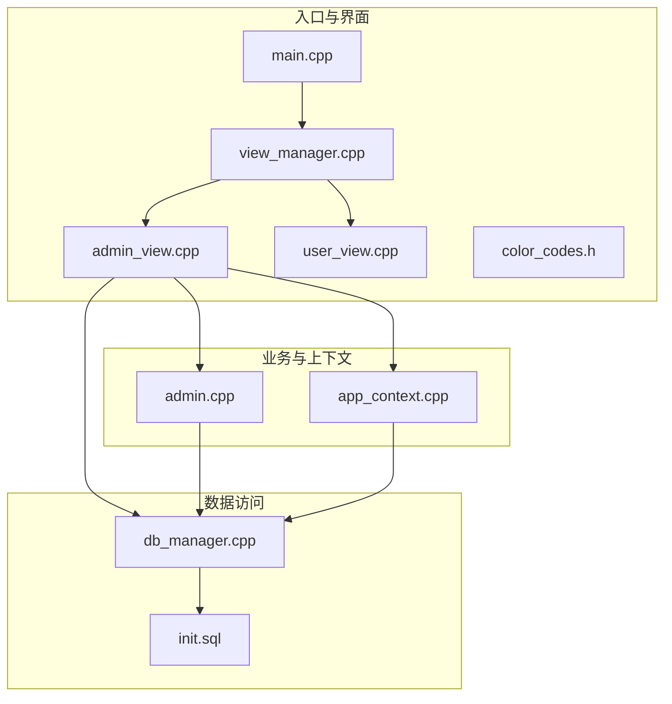
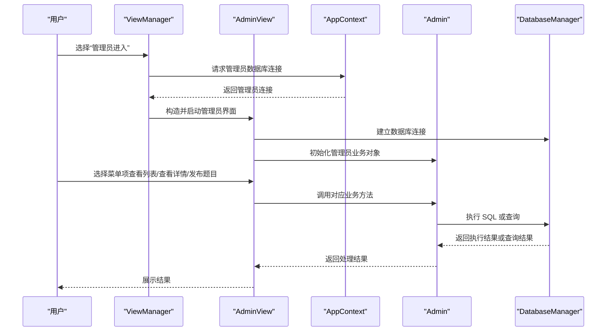
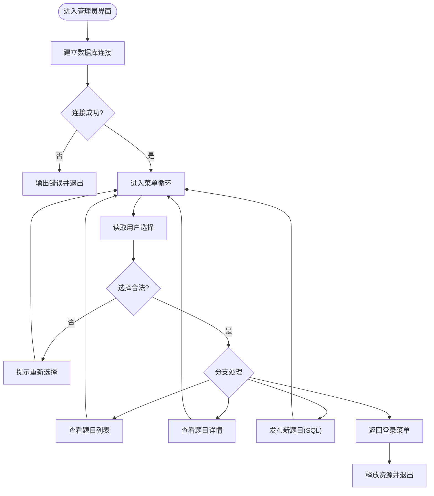
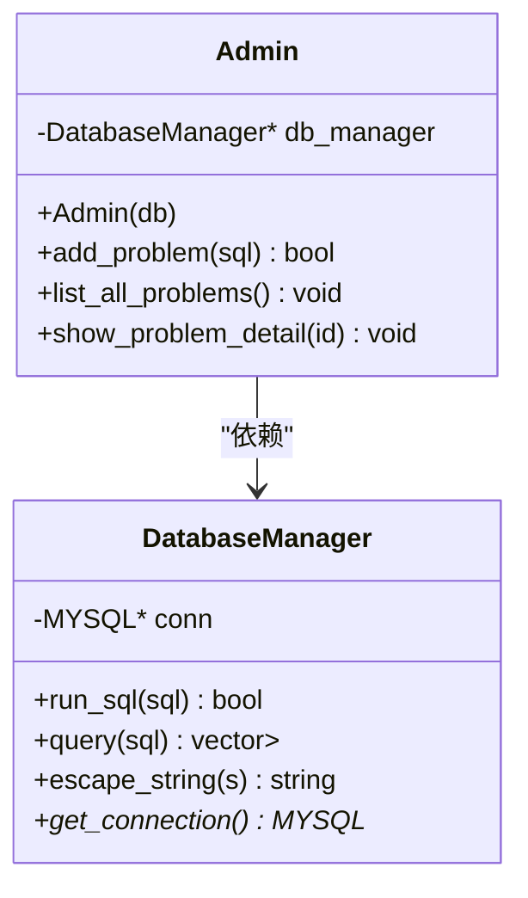
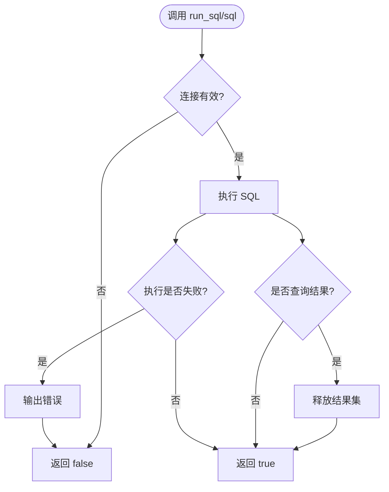
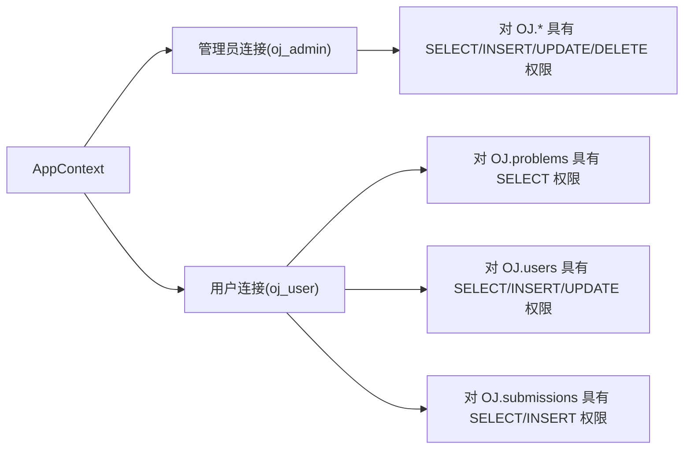
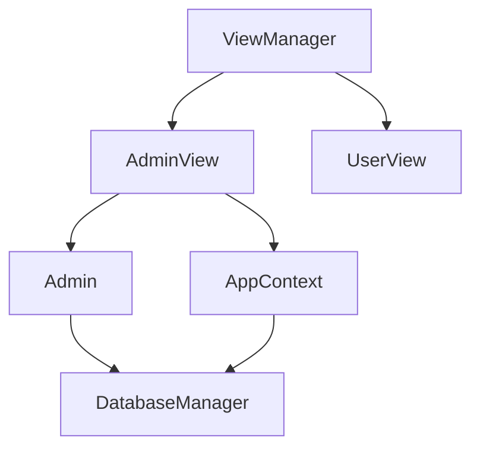

# 管理员功能模块

<cite>
**本文引用的文件**
- [src/admin.cpp](file://src/admin.cpp)
- [include/admin.h](file://include/admin.h)
- [src/admin_view.cpp](file://src/admin_view.cpp)
- [include/admin_view.h](file://include/admin_view.h)
- [src/db_manager.cpp](file://src/db_manager.cpp)
- [include/db_manager.h](file://include/db_manager.h)
- [src/view_manager.cpp](file://src/view_manager.cpp)
- [include/view_manager.h](file://include/view_manager.h)
- [src/app_context.cpp](file://src/app_context.cpp)
- [include/app_context.h](file://include/app_context.h)
- [init.sql](file://init.sql)
- [src/main.cpp](file://src/main.cpp)
- [include/color_codes.h](file://include/color_codes.h)
</cite>

## 目录
1. [简介](#简介)
2. [项目结构](#项目结构)
3. [核心组件](#核心组件)
4. [架构总览](#架构总览)
5. [详细组件分析](#详细组件分析)
6. [依赖关系分析](#依赖关系分析)
7. [性能考虑](#性能考虑)
8. [故障排除指南](#故障排除指南)
9. [结论](#结论)
10. [附录](#附录)

## 简介
本文件系统性梳理并说明管理员功能模块的设计与实现，覆盖管理员权限管理、题目管理、界面交互流程、数据模型与权限控制机制、日志与安全边界等内容。管理员模块采用命令行交互方式，提供“查看题目列表”“查看题目详情”“发布新题目（手动输入 SQL）”三大核心能力，并通过独立的数据库用户与权限策略实现与普通用户的权限隔离。

## 项目结构
管理员功能模块位于命令行应用的顶层，围绕视图层、业务层与数据访问层分层组织，职责清晰、耦合度低，便于扩展与维护。

**图表来源**
- [src/main.cpp:1-14](file://src/main.cpp#L1-L14)
- [src/view_manager.cpp:1-78](file://src/view_manager.cpp#L1-L78)
- [src/admin_view.cpp:1-138](file://src/admin_view.cpp#L1-L138)
- [src/admin.cpp:1-133](file://src/admin.cpp#L1-L133)
- [src/app_context.cpp:1-16](file://src/app_context.cpp#L1-L16)
- [src/db_manager.cpp:1-108](file://src/db_manager.cpp#L1-L108)
- [init.sql:1-278](file://init.sql#L1-L278)

**章节来源**
- [src/main.cpp:1-14](file://src/main.cpp#L1-L14)
- [src/view_manager.cpp:1-78](file://src/view_manager.cpp#L1-L78)
- [src/admin_view.cpp:1-138](file://src/admin_view.cpp#L1-L138)
- [src/admin.cpp:1-133](file://src/admin.cpp#L1-L133)
- [src/app_context.cpp:1-16](file://src/app_context.cpp#L1-L16)
- [src/db_manager.cpp:1-108](file://src/db_manager.cpp#L1-L108)
- [init.sql:1-278](file://init.sql#L1-L278)

## 核心组件
- 管理员界面 AdminView：负责管理员登录后的菜单展示与交互，调用业务层完成具体操作。
- 管理员业务 Admin：封装管理员特有业务逻辑，如题目发布、列表查询、详情查看。
- 数据库管理 DatabaseManager：封装 MySQL 连接、SQL 执行、查询与转义，屏蔽底层细节。
- 应用上下文 AppContext：集中创建管理员/用户数据库连接，确保权限分离。
- 视图管理层 ViewManager：统一调度管理员与用户视图，提供登录菜单。
- 颜色常量 Color：提供 ANSI 彩色输出支持，改善终端显示体验。

**章节来源**
- [include/admin_view.h:1-43](file://include/admin_view.h#L1-L43)
- [include/admin.h:1-32](file://include/admin.h#L1-L32)
- [include/db_manager.h:1-51](file://include/db_manager.h#L1-L51)
- [include/app_context.h:1-35](file://include/app_context.h#L1-L35)
- [include/view_manager.h:1-34](file://include/view_manager.h#L1-L34)
- [include/color_codes.h:1-15](file://include/color_codes.h#L1-L15)

## 架构总览
管理员功能遵循“视图层-业务层-数据访问层”的分层架构，管理员与普通用户通过 AppContext 分别获取具有不同权限的数据库连接，实现最小权限原则与行级隔离。

**图表来源**
- [src/view_manager.cpp:33-71](file://src/view_manager.cpp#L33-L71)
- [src/admin_view.cpp:22-76](file://src/admin_view.cpp#L22-L76)
- [src/app_context.cpp:5-15](file://src/app_context.cpp#L5-L15)
- [src/admin.cpp:10-15](file://src/admin.cpp#L10-L15)
- [src/db_manager.cpp:22-43](file://src/db_manager.cpp#L22-L43)

## 详细组件分析

### 管理员界面 AdminView
- 职责
  - 清屏与菜单展示
  - 接收用户输入并路由到相应处理函数
  - 管理生命周期：连接建立、运行循环、资源释放
- 关键流程
  - 启动时通过 AppContext 获取管理员数据库连接
  - 循环显示菜单并处理 0~3 的选项
  - 调用 Admin 对象执行业务逻辑
- 输入校验
  - 数字输入异常时清空缓冲区并提示
  - SQL 输入为空时拒绝执行
- 输出美化
  - 使用颜色常量与 ANSI 清屏序列提升交互体验

**图表来源**
- [src/admin_view.cpp:22-76](file://src/admin_view.cpp#L22-L76)
- [src/admin_view.cpp:91-131](file://src/admin_view.cpp#L91-L131)

**章节来源**
- [src/admin_view.cpp:1-138](file://src/admin_view.cpp#L1-L138)
- [include/admin_view.h:1-43](file://include/admin_view.h#L1-L43)

### 管理员业务 Admin
- 职责
  - 发布新题目：接收完整 SQL 并执行
  - 列出题目：查询并格式化输出题目列表
  - 查看题目详情：按 ID 查询并输出详细信息
- 数据访问
  - 通过 DatabaseManager 的 run_sql/query 完成执行与查询
- 列表展示细节
  - 中文字符宽度自适应处理，标题截断与对齐
  - 编码兼容处理（UTF-8 多字节字符）

**图表来源**
- [include/admin.h:9-29](file://include/admin.h#L9-L29)
- [include/db_manager.h:11-46](file://include/db_manager.h#L11-L46)

**章节来源**
- [src/admin.cpp:1-133](file://src/admin.cpp#L1-L133)
- [include/admin.h:1-32](file://include/admin.h#L1-L32)

### 数据库管理 DatabaseManager
- 职责
  - 管理 MySQL 连接生命周期
  - 执行任意 SQL（含 DDL/DML），并处理错误
  - 执行查询并将结果映射为结构化数据
  - 提供字符串转义，降低 SQL 注入风险
- 错误处理
  - 执行失败时输出错误信息并返回失败
  - 查询失败时返回空结果集
- 资源管理
  - 构造时连接，析构时关闭

**图表来源**
- [src/db_manager.cpp:22-43](file://src/db_manager.cpp#L22-L43)
- [src/db_manager.cpp:54-85](file://src/db_manager.cpp#L54-L85)

**章节来源**
- [src/db_manager.cpp:1-108](file://src/db_manager.cpp#L1-L108)
- [include/db_manager.h:1-51](file://include/db_manager.h#L1-L51)

### 应用上下文 AppContext 与权限控制
- 职责
  - 为管理员与普通用户分别创建数据库连接
  - 管理员连接具备对 OJ.* 的完全权限
  - 普通用户连接按表粒度授予最小权限（问题表只读、用户与提交表有限读写）
- 安全边界
  - 管理员拥有发布题目的能力（通过手动输入 SQL）
  - 普通用户仅能查询题目、提交代码、更新自身账户信息
  - 行级隔离由应用层通过条件过滤实现（例如仅允许查询/更新当前用户）

**图表来源**
- [src/app_context.cpp:5-15](file://src/app_context.cpp#L5-L15)
- [init.sql:70-95](file://init.sql#L70-L95)

**章节来源**
- [src/app_context.cpp:1-16](file://src/app_context.cpp#L1-L16)
- [include/app_context.h:1-35](file://include/app_context.h#L1-L35)
- [init.sql:63-95](file://init.sql#L63-L95)

### 视图管理层 ViewManager
- 职责
  - 提供登录主菜单（管理员/用户/退出）
  - 根据用户选择创建对应视图并启动
- 与管理员模块协作
  - 通过 AppContext.createAdminDB() 获取管理员连接
  - 通过 AppContext.createUserDB() 获取用户连接

**章节来源**
- [src/view_manager.cpp:1-78](file://src/view_manager.cpp#L1-L78)
- [include/view_manager.h:1-34](file://include/view_manager.h#L1-L34)

### 颜色与终端显示
- Color 命名空间提供 ANSI 颜色常量，用于美化输出
- AdminView 使用颜色与清屏序列提升交互体验

**章节来源**
- [include/color_codes.h:1-15](file://include/color_codes.h#L1-L15)
- [src/admin_view.cpp:15-20](file://src/admin_view.cpp#L15-L20)

## 依赖关系分析
- AdminView 依赖 Admin 与 DatabaseManager
- Admin 依赖 DatabaseManager
- ViewManager 依赖 AdminView 与 UserView，并通过 AppContext 获取连接
- AppContext 依赖 DatabaseManager
- DatabaseManager 依赖 MySQL C API

**图表来源**
- [src/admin_view.cpp:10-11](file://src/admin_view.cpp#L10-L11)
- [src/admin.cpp:8](file://src/admin.cpp#L8)
- [src/view_manager.cpp:54-59](file://src/view_manager.cpp#L54-L59)
- [src/app_context.cpp:5-15](file://src/app_context.cpp#L5-L15)

**章节来源**
- [src/admin_view.cpp:1-138](file://src/admin_view.cpp#L1-L138)
- [src/admin.cpp:1-133](file://src/admin.cpp#L1-L133)
- [src/view_manager.cpp:1-78](file://src/view_manager.cpp#L1-L78)
- [src/app_context.cpp:1-16](file://src/app_context.cpp#L1-L16)
- [src/db_manager.cpp:1-108](file://src/db_manager.cpp#L1-L108)

## 性能考虑
- 查询与展示
  - 题目列表查询一次性返回，建议在数据量较大时增加分页或索引优化
  - 列表展示涉及字符串宽度计算，建议在超大数据量场景下减少格式化开销
- 数据库层
  - 使用连接池可进一步降低连接建立成本（当前实现为按需连接）
- I/O
  - 终端输出频繁，建议批量输出或缓冲优化

[本节为通用建议，无需特定文件来源]

## 故障排除指南
- 数据库连接失败
  - 现象：管理员进入时报错“数据库连接失败”
  - 排查：确认 AppContext 中管理员用户名、密码、主机与数据库名正确；检查 MySQL 服务状态与网络连通性
  - 参考
    - [src/admin_view.cpp:71-75](file://src/admin_view.cpp#L71-L75)
    - [src/app_context.cpp:5-9](file://src/app_context.cpp#L5-L9)
- SQL 执行失败
  - 现象：发布题目提示“输入错误”
  - 排查：确认 SQL 语法正确、目标表存在、字段类型匹配；查看数据库错误信息
  - 参考
    - [src/admin.cpp:10-15](file://src/admin.cpp#L10-L15)
    - [src/db_manager.cpp:29-33](file://src/db_manager.cpp#L29-L33)
- 查询无结果
  - 现象：查看题目详情提示“未找到 ID 为 X 的题目”
  - 排查：确认题目 ID 是否正确；检查数据库中是否存在该记录
  - 参考
    - [src/admin.cpp:105-117](file://src/admin.cpp#L105-L117)
- 输入异常
  - 现象：输入非数字导致后续输入流异常
  - 排查：使用清空输入缓冲区函数恢复输入流
  - 参考
    - [src/admin_view.cpp:133-137](file://src/admin_view.cpp#L133-L137)
    - [src/admin_view.cpp:40-46](file://src/admin_view.cpp#L40-L46)

**章节来源**
- [src/admin_view.cpp:71-75](file://src/admin_view.cpp#L71-L75)
- [src/admin.cpp:10-15](file://src/admin.cpp#L10-L15)
- [src/db_manager.cpp:29-33](file://src/db_manager.cpp#L29-L33)
- [src/admin.cpp:105-117](file://src/admin.cpp#L105-L117)
- [src/admin_view.cpp:133-137](file://src/admin_view.cpp#L133-L137)
- [src/admin_view.cpp:40-46](file://src/admin_view.cpp#L40-L46)

## 结论
管理员功能模块通过清晰的分层设计与严格的权限分离，实现了面向管理员的题目管理能力。其交互简洁、扩展性强，适合在现有基础上继续增强审计与日志能力，以及引入更完善的输入校验与连接池机制。

[本节为总结，无需特定文件来源]

## 附录

### 管理员专用操作与参数说明
- 查看所有题目列表
  - 触发路径：管理员菜单选择“查看所有题目列表”
  - 行为：查询题目表并格式化输出
  - 参考
    - [src/admin_view.cpp:91-95](file://src/admin_view.cpp#L91-L95)
    - [src/admin.cpp:17-103](file://src/admin.cpp#L17-L103)
- 查看题目详细信息
  - 触发路径：管理员菜单选择“查看题目详细信息”，输入题目 ID
  - 行为：按 ID 查询并输出详情
  - 参考
    - [src/admin_view.cpp:97-110](file://src/admin_view.cpp#L97-L110)
    - [src/admin.cpp:105-132](file://src/admin.cpp#L105-L132)
- 发布新题目（手动 SQL）
  - 触发路径：管理员菜单选择“发布新题目（手动 SQL）”，输入完整 SQL
  - 行为：执行 SQL；若为空则拒绝
  - 参考
    - [src/admin_view.cpp:112-131](file://src/admin_view.cpp#L112-L131)
    - [src/admin.cpp:10-15](file://src/admin.cpp#L10-L15)
    - [src/db_manager.cpp:22-43](file://src/db_manager.cpp#L22-L43)

### 数据模型与权限对照
- 数据模型（关键表）
  - 题目表：包含题目基本信息与限制
  - 用户表：平台用户信息（非数据库用户）
  - 提交记录表：记录用户提交与评测状态
- 权限对照
  - 管理员用户：对 OJ.* 具有完全权限
  - 普通用户：仅对指定表具备最小权限
- 参考
  - [init.sql:14-39](file://init.sql#L14-L39)
  - [init.sql:70-95](file://init.sql#L70-L95)

**章节来源**
- [init.sql:14-39](file://init.sql#L14-L39)
- [init.sql:70-95](file://init.sql#L70-L95)