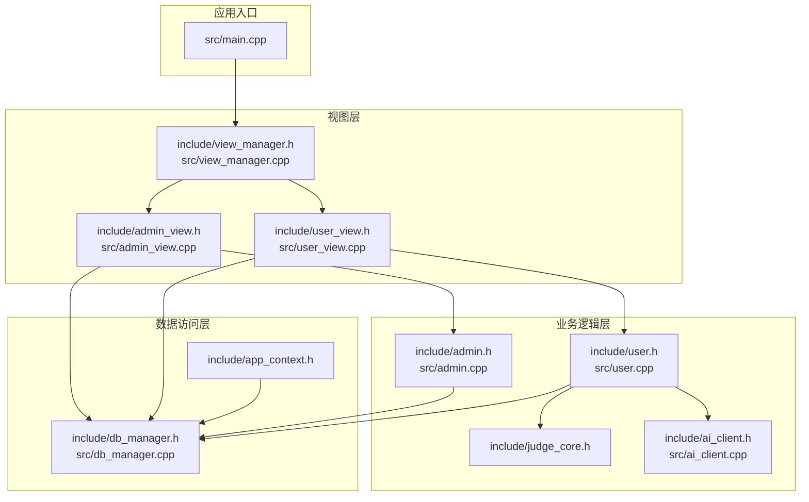
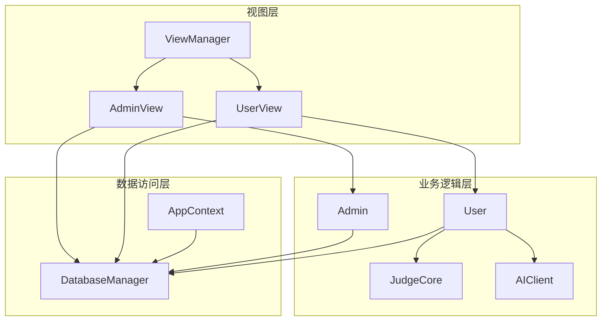
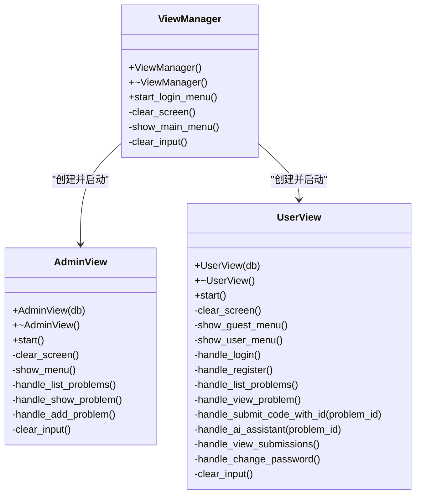
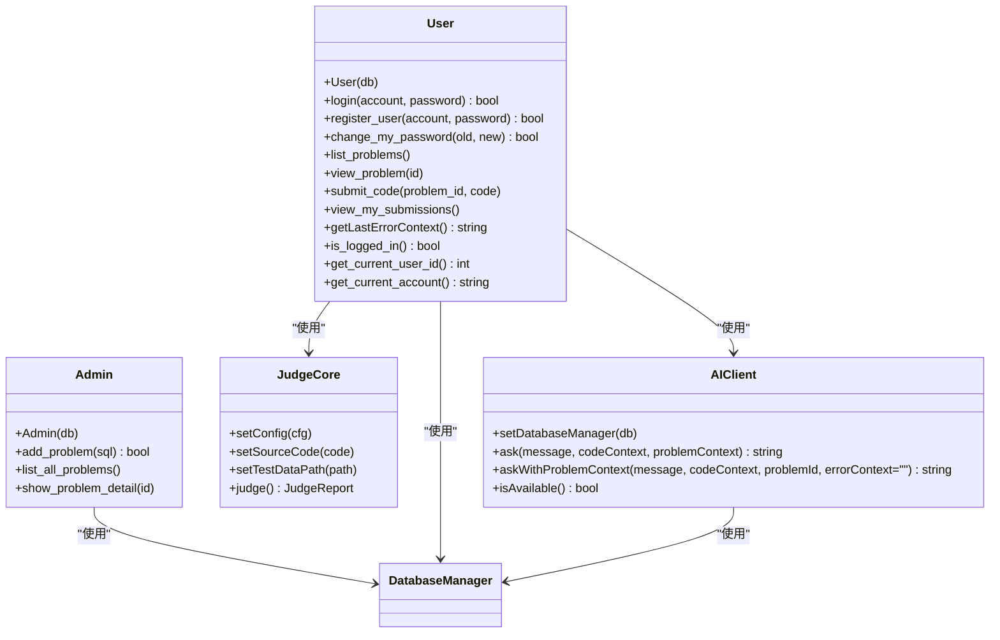
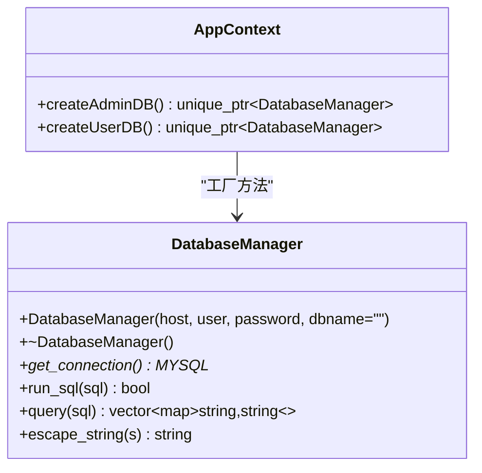
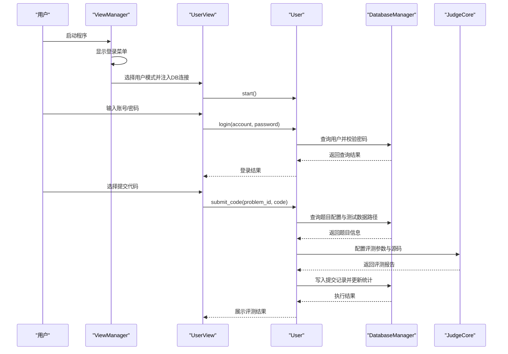
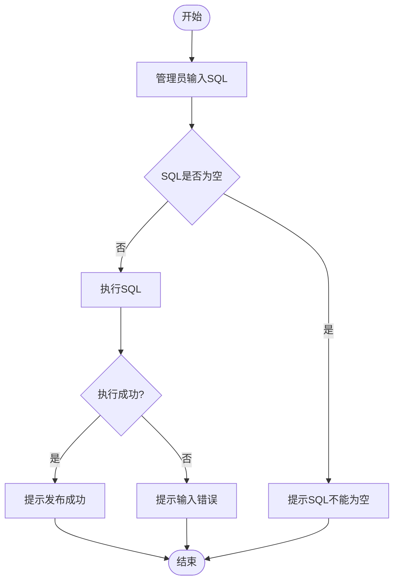
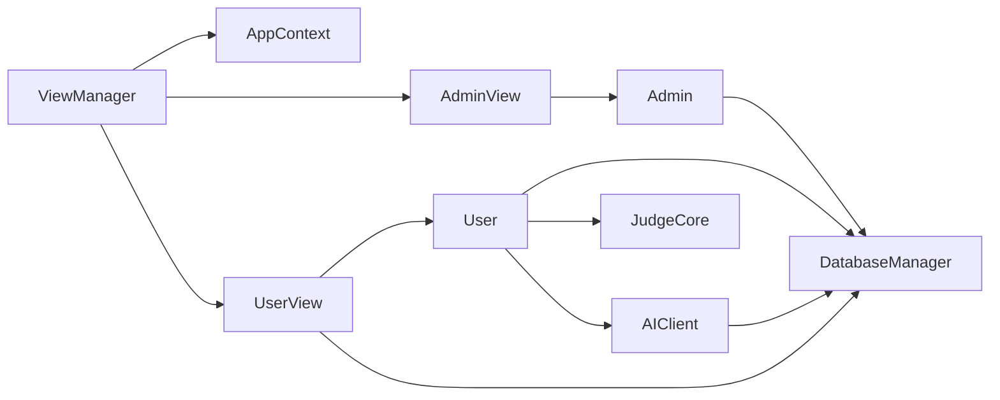

# 分层架构设计

<cite>
**本文档引用的文件**
- [main.cpp](file://src/main.cpp)
- [view_manager.h](file://include/view_manager.h)
- [view_manager.cpp](file://src/view_manager.cpp)
- [app_context.h](file://include/app_context.h)
- [db_manager.h](file://include/db_manager.h)
- [db_manager.cpp](file://src/db_manager.cpp)
- [admin_view.h](file://include/admin_view.h)
- [admin_view.cpp](file://src/admin_view.cpp)
- [user_view.h](file://include/user_view.h)
- [user_view.cpp](file://src/user_view.cpp)
- [admin.h](file://include/admin.h)
- [admin.cpp](file://src/admin.cpp)
- [user.h](file://include/user.h)
- [user.cpp](file://src/user.cpp)
- [judge_core.h](file://include/judge_core.h)
- [ai_client.h](file://include/ai_client.h)
- [ai_client.cpp](file://src/ai_client.cpp)
- [CMakeLists.txt](file://CMakeLists.txt)
</cite>

## 目录
1. [引言](#引言)
2. [项目结构](#项目结构)
3. [核心组件](#核心组件)
4. [架构总览](#架构总览)
5. [详细组件分析](#详细组件分析)
6. [依赖分析](#依赖分析)
7. [性能考虑](#性能考虑)
8. [故障排查指南](#故障排查指南)
9. [结论](#结论)
10. [附录](#附录)

## 引言
本文件面向OJ系统，基于仓库现有代码，构建并阐述其三层架构设计：视图层（View Layer）、业务逻辑层（Business Logic Layer）、数据访问层（Data Access Layer）。文档聚焦以下目标：
- 明确每层职责边界与接口契约
- 解释层间交互机制与数据流向
- 给出分层设计的优势、局限性与扩展策略
- 提供架构图、类图、时序图与流程图，帮助不同背景读者理解系统

## 项目结构
系统采用“头文件位于include、实现位于src”的清晰分层组织方式，配合CMake构建脚本统一管理依赖与编译。

图表来源
- [main.cpp:1-14](file://src/main.cpp#L1-L14)
- [view_manager.h:1-34](file://include/view_manager.h#L1-L34)
- [view_manager.cpp:1-78](file://src/view_manager.cpp#L1-L78)
- [admin_view.h:1-43](file://include/admin_view.h#L1-L43)
- [admin_view.cpp:1-138](file://src/admin_view.cpp#L1-L138)
- [user_view.h:1-68](file://include/user_view.h#L1-L68)
- [user_view.cpp:1-78](file://src/user_view.cpp#L1-L78)
- [admin.h:1-32](file://include/admin.h#L1-L32)
- [admin.cpp:1-133](file://src/admin.cpp#L1-L133)
- [user.h:1-80](file://include/user.h#L1-L80)
- [user.cpp:1-514](file://src/user.cpp#L1-L514)
- [judge_core.h:1-104](file://include/judge_core.h#L1-L104)
- [ai_client.h:1-49](file://include/ai_client.h#L1-L49)
- [ai_client.cpp:1-196](file://src/ai_client.cpp#L1-L196)
- [db_manager.h:1-51](file://include/db_manager.h#L1-L51)
- [db_manager.cpp:1-108](file://src/db_manager.cpp#L1-L108)
- [app_context.h:1-35](file://include/app_context.h#L1-L35)

章节来源
- [CMakeLists.txt:1-40](file://CMakeLists.txt#L1-L40)

## 核心组件
- 视图层：负责用户界面与输入输出，包括登录菜单、管理员菜单、用户菜单、游客菜单、提交与评测展示等。
- 业务逻辑层：封装核心业务规则，如用户登录/注册/改密、题目浏览、提交评测、AI辅助等。
- 数据访问层：封装数据库连接、SQL执行、查询结果解析与转义，提供统一的数据访问能力。

章节来源
- [view_manager.h:1-34](file://include/view_manager.h#L1-L34)
- [view_manager.cpp:1-78](file://src/view_manager.cpp#L1-L78)
- [user_view.h:1-68](file://include/user_view.h#L1-L68)
- [user_view.cpp:1-78](file://src/user_view.cpp#L1-L78)
- [admin_view.h:1-43](file://include/admin_view.h#L1-L43)
- [admin_view.cpp:1-138](file://src/admin_view.cpp#L1-L138)
- [user.h:1-80](file://include/user.h#L1-L80)
- [user.cpp:1-514](file://src/user.cpp#L1-L514)
- [admin.h:1-32](file://include/admin.h#L1-L32)
- [admin.cpp:1-133](file://src/admin.cpp#L1-L133)
- [db_manager.h:1-51](file://include/db_manager.h#L1-L51)
- [db_manager.cpp:1-108](file://src/db_manager.cpp#L1-L108)

## 架构总览
三层架构在本系统中的体现如下：
- 视图层（View Layer）
  - 通过ViewManager统一启动登录菜单，根据用户选择进入管理员或用户模式。
  - 管理员与用户界面分别封装各自菜单与操作流程。
- 业务逻辑层（Business Logic Layer）
  - Admin与User分别承载管理员与用户的核心业务逻辑，均依赖DatabaseManager进行数据访问。
  - User集成JudgeCore进行评测，集成AIClient提供AI辅助。
- 数据访问层（Data Access Layer）
  - DatabaseManager封装MySQL连接、SQL执行、查询与转义。
  - AppContext提供数据库连接工厂方法，支持管理员与普通用户两种权限级别。

图表来源
- [view_manager.h:1-34](file://include/view_manager.h#L1-L34)
- [admin_view.h:1-43](file://include/admin_view.h#L1-L43)
- [user_view.h:1-68](file://include/user_view.h#L1-L68)
- [admin.h:1-32](file://include/admin.h#L1-L32)
- [user.h:1-80](file://include/user.h#L1-L80)
- [judge_core.h:1-104](file://include/judge_core.h#L1-L104)
- [ai_client.h:1-49](file://include/ai_client.h#L1-L49)
- [db_manager.h:1-51](file://include/db_manager.h#L1-L51)
- [app_context.h:1-35](file://include/app_context.h#L1-L35)

## 详细组件分析

### 视图层组件分析
- ViewManager
  - 职责：启动登录菜单、分发角色选择、协调管理员/用户视图生命周期。
  - 接口：构造/析构、start_login_menu、内部工具函数（清屏、清空输入缓冲）。
  - 交互：通过AppContext创建数据库连接，注入AdminView/UserView。
- AdminView
  - 职责：管理员模式菜单、题目列表/详情查看、发布题目（执行SQL）。
  - 接口：构造、start、菜单与处理函数。
  - 交互：依赖DatabaseManager执行SQL；委托Admin完成业务处理。
- UserView
  - 职责：游客/用户菜单、登录/注册、题目浏览、提交代码、查看提交记录、AI助手。
  - 接口：构造、start、菜单与处理函数。
  - 交互：依赖DatabaseManager执行SQL；委托User完成业务处理；可选集成AIClient。

图表来源
- [view_manager.h:1-34](file://include/view_manager.h#L1-L34)
- [admin_view.h:1-43](file://include/admin_view.h#L1-L43)
- [user_view.h:1-68](file://include/user_view.h#L1-L68)

章节来源
- [view_manager.cpp:1-78](file://src/view_manager.cpp#L1-L78)
- [admin_view.cpp:1-138](file://src/admin_view.cpp#L1-L138)
- [user_view.cpp:1-78](file://src/user_view.cpp#L1-L78)

### 业务逻辑层组件分析
- Admin
  - 职责：管理员特有业务，如发布题目（执行SQL）、列出题目、查看题目详情。
  - 依赖：DatabaseManager。
- User
  - 职责：用户登录/注册/改密、题目浏览、提交代码评测、查看提交记录、错误上下文维护。
  - 依赖：DatabaseManager、JudgeCore、AIClient。
- JudgeCore
  - 职责：评测配置设置、源码设置、测试数据路径设置、执行评测并产出评测报告。
  - 设计：PIMPL隐藏实现细节，禁止拷贝与赋值。
- AIClient
  - 职责：封装Python AI服务调用，支持带问题上下文的问答、自动补全题库列表、可用性检测。
  - 依赖：DatabaseManager（查询题目信息）。

图表来源
- [admin.h:1-32](file://include/admin.h#L1-L32)
- [admin.cpp:1-133](file://src/admin.cpp#L1-L133)
- [user.h:1-80](file://include/user.h#L1-L80)
- [user.cpp:1-514](file://src/user.cpp#L1-L514)
- [judge_core.h:1-104](file://include/judge_core.h#L1-L104)
- [ai_client.h:1-49](file://include/ai_client.h#L1-L49)
- [ai_client.cpp:1-196](file://src/ai_client.cpp#L1-L196)
- [db_manager.h:1-51](file://include/db_manager.h#L1-L51)

章节来源
- [admin.cpp:1-133](file://src/admin.cpp#L1-L133)
- [user.cpp:1-514](file://src/user.cpp#L1-L514)
- [judge_core.h:1-104](file://include/judge_core.h#L1-L104)
- [ai_client.cpp:1-196](file://src/ai_client.cpp#L1-L196)

### 数据访问层组件分析
- DatabaseManager
  - 职责：构造/析构数据库连接、执行SQL、查询并返回结构化结果、字符串转义。
  - 关键接口：构造函数、析构、run_sql、query、escape_string、get_connection。
- AppContext
  - 职责：提供管理员/用户数据库连接工厂方法，集中管理数据库连接与全局配置。

图表来源
- [db_manager.h:1-51](file://include/db_manager.h#L1-L51)
- [db_manager.cpp:1-108](file://src/db_manager.cpp#L1-L108)
- [app_context.h:1-35](file://include/app_context.h#L1-L35)

章节来源
- [db_manager.cpp:1-108](file://src/db_manager.cpp#L1-L108)
- [app_context.h:1-35](file://include/app_context.h#L1-L35)

### 用户登录与提交评测时序

图表来源
- [view_manager.cpp:33-71](file://src/view_manager.cpp#L33-L71)
- [user_view.cpp:1-78](file://src/user_view.cpp#L1-L78)
- [user.cpp:269-452](file://src/user.cpp#L269-L452)
- [db_manager.cpp:22-85](file://src/db_manager.cpp#L22-L85)
- [judge_core.h:60-101](file://include/judge_core.h#L60-L101)

### 管理员发布题目流程

图表来源
- [admin_view.cpp:112-131](file://src/admin_view.cpp#L112-L131)
- [admin.cpp:10-15](file://src/admin.cpp#L10-L15)
- [db_manager.cpp:22-43](file://src/db_manager.cpp#L22-L43)

## 依赖分析
- 组件耦合与内聚
  - 视图层与业务逻辑层通过接口解耦：视图层仅调用业务对象的方法，不关心底层实现。
  - 业务逻辑层与数据访问层通过DatabaseManager解耦：Admin/User仅依赖抽象接口，便于替换实现。
- 直接与间接依赖
  - ViewManager依赖AppContext与DatabaseManager；AdminView/UserView依赖各自的业务类与DatabaseManager。
  - User依赖JudgeCore与AIClient，形成评测与AI辅助的组合。
- 外部依赖与集成点
  - MySQL客户端库与OpenSSL通过CMake链接。
  - AI服务通过Python脚本调用，AIClient负责参数转义与命令执行。

图表来源
- [view_manager.h:1-34](file://include/view_manager.h#L1-L34)
- [app_context.h:1-35](file://include/app_context.h#L1-L35)
- [admin_view.h:1-43](file://include/admin_view.h#L1-L43)
- [user_view.h:1-68](file://include/user_view.h#L1-L68)
- [admin.h:1-32](file://include/admin.h#L1-L32)
- [user.h:1-80](file://include/user.h#L1-L80)
- [db_manager.h:1-51](file://include/db_manager.h#L1-L51)
- [judge_core.h:1-104](file://include/judge_core.h#L1-L104)
- [ai_client.h:1-49](file://include/ai_client.h#L1-L49)

章节来源
- [CMakeLists.txt:11-34](file://CMakeLists.txt#L11-L34)

## 性能考虑
- 数据库访问
  - 使用escape_string避免SQL注入的同时，注意批量写入时的事务与索引优化。
  - 查询结果解析为结构化数据，建议在高频查询场景下缓存常用元数据。
- 评测引擎
  - JudgeCore基于容器化评测，注意资源限制配置与并发控制，避免系统资源争用。
- AI辅助
  - Python进程调用存在启动开销，建议复用会话或引入本地轻量服务以降低延迟。
- I/O与界面
  - 视图层频繁清屏与格式化输出，建议在大量数据渲染时采用分页或延迟加载。

## 故障排查指南
- 数据库连接失败
  - 现象：管理员/用户模式提示连接失败。
  - 排查：确认AppContext提供的连接参数正确；检查MySQL服务状态与权限。
- SQL执行失败
  - 现象：发布题目或查询失败。
  - 排查：检查SQL语法与表结构；确认DatabaseManager::run_sql返回值与错误信息。
- 评测异常
  - 现象：评测报告为空或系统错误。
  - 排查：确认测试数据路径存在且可访问；检查JudgeCore配置与源码合法性。
- AI服务不可用
  - 现象：AI返回空响应或提示不可用。
  - 排查：确认Python路径与脚本存在；检查网络与API Key配置；必要时启用本地虚拟环境。

章节来源
- [view_manager.cpp:53-70](file://src/view_manager.cpp#L53-L70)
- [admin_view.cpp:71-75](file://src/admin_view.cpp#L71-L75)
- [db_manager.cpp:22-43](file://src/db_manager.cpp#L22-L43)
- [ai_client.cpp:186-195](file://src/ai_client.cpp#L186-L195)

## 结论
本系统通过清晰的三层架构实现了关注点分离：视图层专注交互，业务逻辑层封装规则，数据访问层统一持久化。该设计提升了可维护性与可扩展性，同时为后续引入缓存、消息队列、微服务等演进提供了良好基础。建议在生产环境中进一步完善日志与监控、引入连接池与事务管理、以及对评测与AI服务进行异步化改造。

## 附录
- 分层设计优势
  - 可维护性：职责明确，变更影响面可控。
  - 可测试性：各层可通过接口进行单元测试。
  - 可扩展性：新增功能可在对应层内实现，减少跨层改动。
- 局限性
  - 视图层仍直接依赖控制台输出，图形化界面迁移需重构视图层。
  - 数据访问层与MySQL强绑定，替换数据库需调整DatabaseManager。
- 扩展策略
  - 引入依赖注入框架以简化对象创建与生命周期管理。
  - 抽象数据访问层为Repository/DAO接口，支持多数据库后端。
  - 将评测与AI服务异步化，结合任务队列提升吞吐。
  - 增加中间件层（如鉴权、日志、限流），增强横切关注点。