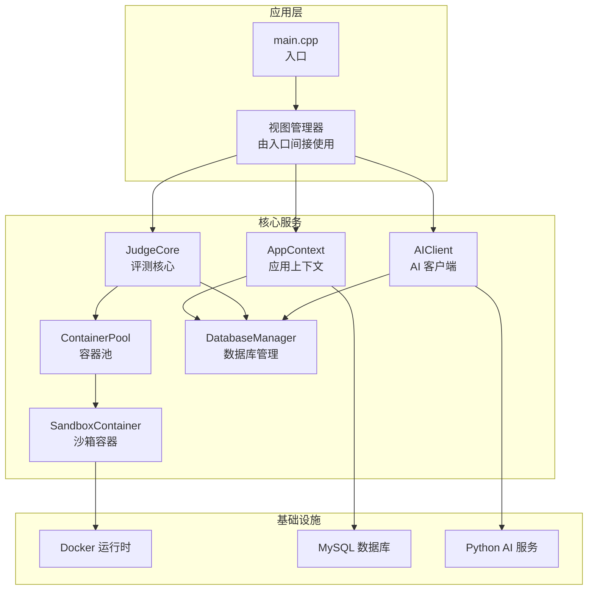
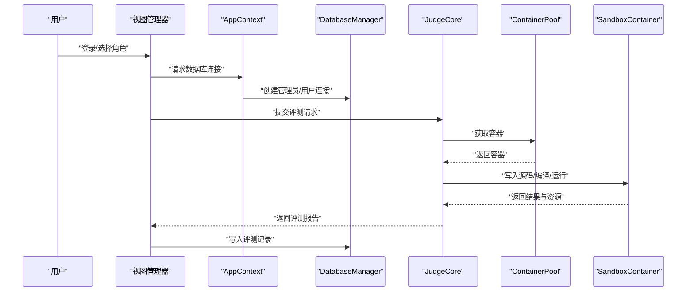
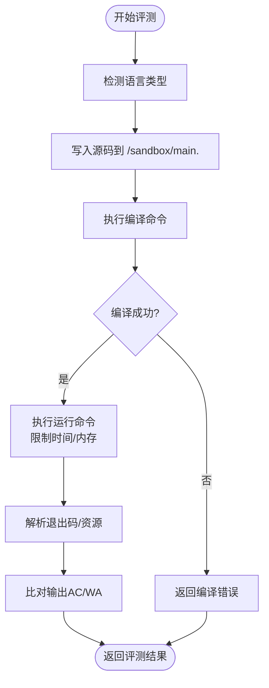
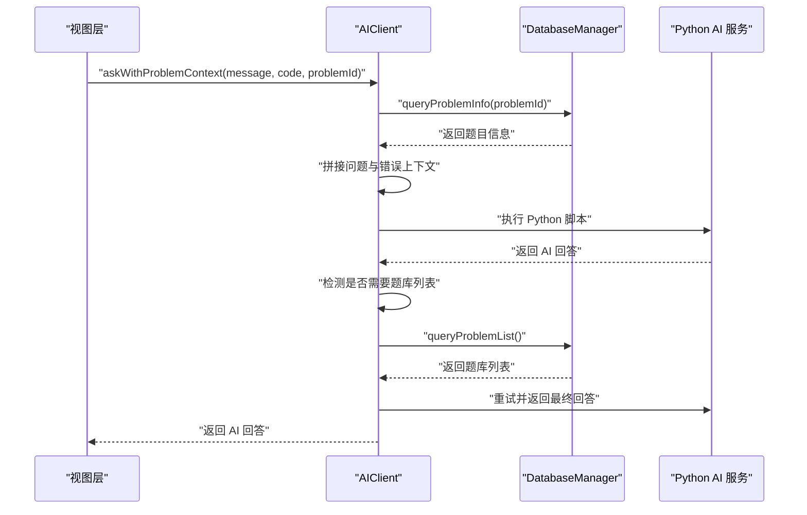
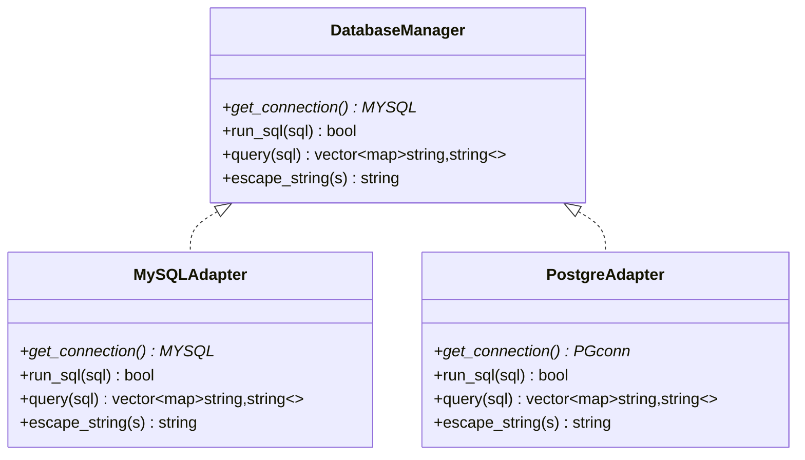
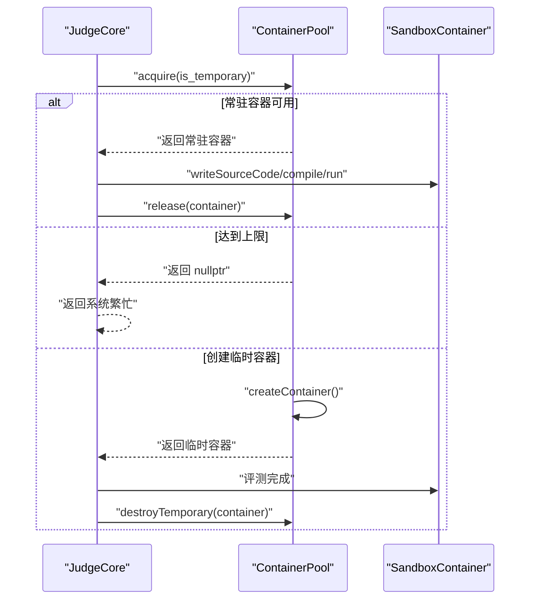
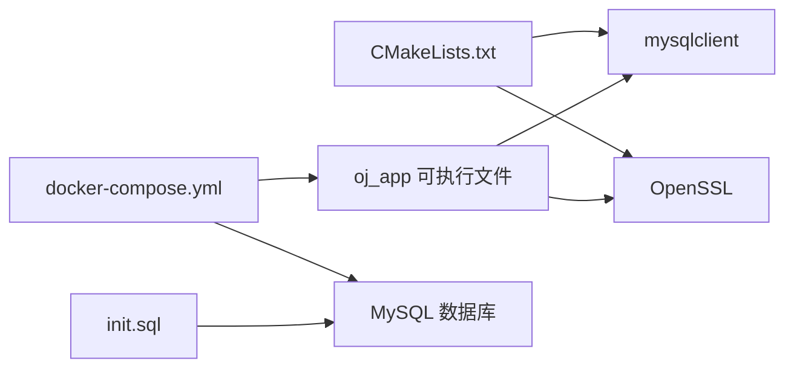

# 扩展点设计

<cite>
**本文引用的文件**
- [src/main.cpp](file://src/main.cpp)
- [include/app_context.h](file://include/app_context.h)
- [include/judge_core.h](file://include/judge_core.h)
- [src/judge_core.cpp](file://src/judge_core.cpp)
- [include/container_pool.h](file://include/container_pool.h)
- [src/container_pool.cpp](file://src/container_pool.cpp)
- [include/sandbox_container.h](file://include/sandbox_container.h)
- [src/sandbox_container.cpp](file://src/sandbox_container.cpp)
- [include/db_manager.h](file://include/db_manager.h)
- [src/db_manager.cpp](file://src/db_manager.cpp)
- [include/ai_client.h](file://include/ai_client.h)
- [src/ai_client.cpp](file://src/ai_client.cpp)
- [CMakeLists.txt](file://CMakeLists.txt)
- [docker-compose.yml](file://docker-compose.yml)
- [init.sql](file://init.sql)
</cite>

## 目录
1. [简介](#简介)
2. [项目结构](#项目结构)
3. [核心组件](#核心组件)
4. [架构总览](#架构总览)
5. [详细组件分析](#详细组件分析)
6. [依赖关系分析](#依赖关系分析)
7. [性能考量](#性能考量)
8. [故障排查指南](#故障排查指南)
9. [结论](#结论)
10. [附录](#附录)

## 简介
本设计文档围绕 OJ 系统的扩展点与插件化架构展开，重点阐述以下四个方向的扩展能力与实现边界：
- 评测引擎的语言扩展机制：如何在现有 C++ 编译/运行流程基础上，接入新的编程语言评测。
- AI 服务的集成接口：如何替换或扩展 AI 推理后端，以及如何在评测上下文中注入题目与错误信息。
- 数据库适配器的替换方案：如何在当前 MySQL 实现之外引入新的数据库适配器。
- 容器化评测的扩展点：如何替换评测沙箱镜像、调整隔离策略与资源限制。

同时，文档提供扩展开发指南、兼容性与版本管理策略、扩展开发示例与最佳实践，帮助读者在不破坏系统稳定性的前提下进行定制化演进。

## 项目结构
OJ 系统采用分层清晰的 C++ 代码组织方式：
- include：对外公开的头文件，定义接口与数据结构。
- src：实现文件，包含业务逻辑与系统集成。
- docs：设计文档与实现计划。
- data：测试数据目录，按题目编号组织。
- ai：AI 服务相关（Python 脚本与依赖）。
- judge-sandbox：评测沙箱镜像构建上下文。
- docker-compose.yml：系统编排与运行环境配置。
- init.sql：数据库初始化脚本。

**图表来源**
- [src/main.cpp:1-14](file://src/main.cpp#L1-L14)
- [include/app_context.h:15-32](file://include/app_context.h#L15-L32)
- [include/judge_core.h:60-101](file://include/judge_core.h#L60-L101)
- [include/container_pool.h:21-73](file://include/container_pool.h#L21-L73)
- [include/sandbox_container.h:26-83](file://include/sandbox_container.h#L26-L83)
- [include/db_manager.h:11-46](file://include/db_manager.h#L11-L46)
- [include/ai_client.h:7-46](file://include/ai_client.h#L7-L46)

**章节来源**
- [src/main.cpp:1-14](file://src/main.cpp#L1-L14)
- [CMakeLists.txt:1-40](file://CMakeLists.txt#L1-L40)
- [docker-compose.yml:1-81](file://docker-compose.yml#L1-L81)
- [init.sql:1-278](file://init.sql#L1-L278)

## 核心组件
- 应用上下文（AppContext）：统一管理数据库连接与全局配置，屏蔽视图层对底层细节的依赖。
- 评测核心（JudgeCore）：封装评测流程，支持配置、源码设置、测试数据路径设置与评测主入口。
- 容器池（ContainerPool）：管理常驻与临时容器，提供获取/归还/销毁能力，内置调度策略与并发上限。
- 沙箱容器（SandboxContainer）：封装单个 Docker 容器生命周期与文件交互，提供编译、运行、资源统计与重置。
- 数据库管理（DatabaseManager）：封装 MySQL 连接、SQL 执行、查询与转义。
- AI 客户端（AIClient）：封装 Python AI 服务调用，支持问题上下文查询与自动补全。

**章节来源**
- [include/app_context.h:15-32](file://include/app_context.h#L15-L32)
- [include/judge_core.h:60-101](file://include/judge_core.h#L60-L101)
- [include/container_pool.h:21-73](file://include/container_pool.h#L21-L73)
- [include/sandbox_container.h:26-83](file://include/sandbox_container.h#L26-L83)
- [include/db_manager.h:11-46](file://include/db_manager.h#L11-L46)
- [include/ai_client.h:7-46](file://include/ai_client.h#L7-L46)

## 架构总览
系统采用“入口 → 上下文 → 服务”的分层架构：
- 入口负责启动 UI 并引导用户进入系统。
- 上下文负责提供数据库连接与配置。
- 评测核心协调容器池与沙箱容器完成编译与运行。
- AI 客户端通过 Python 脚本与数据库协作，提供智能问答能力。
- 数据库管理器负责与 MySQL 交互。

**图表来源**
- [src/main.cpp:5-10](file://src/main.cpp#L5-L10)
- [include/app_context.h:22-28](file://include/app_context.h#L22-L28)
- [include/judge_core.h:92-92](file://include/judge_core.h#L92-L92)
- [src/judge_core.cpp:85-201](file://src/judge_core.cpp#L85-L201)
- [include/container_pool.h:48-62](file://include/container_pool.h#L48-L62)
- [include/sandbox_container.h:47-77](file://include/sandbox_container.h#L47-L77)

## 详细组件分析

### 评测引擎的语言扩展机制
当前评测核心支持 C++ 源码编译与运行，扩展点主要体现在以下方面：
- 源码写入路径：沙箱容器默认写入 /sandbox/main.cpp。
- 编译命令：使用 g++ 编译为 /sandbox/program。
- 运行命令：通过 timeout 与 /usr/bin/time 限制时间与监控内存。
- 输出与统计：标准输出与资源统计分别写入 /sandbox/output.txt 与 /sandbox/time.txt。

扩展建议：
- 新语言扩展：在沙箱容器侧增加对新语言的编译/运行命令映射，并在评测核心中根据语言类型切换编译器与运行参数。
- 多语言并行：在评测配置中新增语言字段，评测核心根据语言选择对应容器镜像或编译脚本。
- 输入/输出处理：统一抽象输入文件与输出文件命名规则，便于多语言适配。

**图表来源**
- [src/judge_core.cpp:107-126](file://src/judge_core.cpp#L107-L126)
- [src/judge_core.cpp:154-178](file://src/judge_core.cpp#L154-L178)
- [src/sandbox_container.cpp:113-125](file://src/sandbox_container.cpp#L113-L125)
- [src/sandbox_container.cpp:127-177](file://src/sandbox_container.cpp#L127-L177)

**章节来源**
- [include/judge_core.h:24-51](file://include/judge_core.h#L24-L51)
- [src/judge_core.cpp:39-60](file://src/judge_core.cpp#L39-L60)
- [src/judge_core.cpp:154-178](file://src/judge_core.cpp#L154-L178)
- [src/sandbox_container.cpp:113-125](file://src/sandbox_container.cpp#L113-L125)
- [src/sandbox_container.cpp:127-177](file://src/sandbox_container.cpp#L127-L177)

### AI 服务的集成接口
AIClient 提供统一的 AI 调用接口，支持：
- 问题上下文查询：从数据库查询题目信息与题库列表。
- 自动补全：当 AI 返回特定标记时，自动附加题库列表并重试。
- 会话管理：通过 sessionId 保持上下文连贯性。

扩展建议：
- 替换推理后端：通过修改 Python 脚本路径与参数传递方式，即可无缝切换不同 AI 服务。
- 上下文增强：支持将用户代码上下文、评测错误上下文与题目信息组合，提升回答质量。
- 可用性检测：提供 isAvailable 接口，便于在 UI 层动态启用/禁用 AI 功能。

**图表来源**
- [include/ai_client.h:28-31](file://include/ai_client.h#L28-L31)
- [src/ai_client.cpp:74-97](file://src/ai_client.cpp#L74-L97)
- [src/ai_client.cpp:157-184](file://src/ai_client.cpp#L157-L184)
- [src/ai_client.cpp:186-195](file://src/ai_client.cpp#L186-L195)

**章节来源**
- [include/ai_client.h:13-33](file://include/ai_client.h#L13-L33)
- [src/ai_client.cpp:35-72](file://src/ai_client.cpp#L35-L72)
- [src/ai_client.cpp:157-184](file://src/ai_client.cpp#L157-L184)

### 数据库适配器的替换方案
当前系统使用 MySQL，DatabaseManager 封装了连接、查询与转义。替换方案如下：
- 抽象接口：在 AppContext 与各业务模块中仅依赖抽象接口，而非直接使用 MySQL 实现。
- 适配器实现：提供新的 DatabaseManager 实现（如 PostgreSQL、SQLite），保持 query/run_sql/escape_string 等签名一致。
- 连接配置：通过环境变量或配置文件切换数据库类型与连接参数。

**图表来源**
- [include/db_manager.h:11-46](file://include/db_manager.h#L11-L46)
- [src/db_manager.cpp:9-20](file://src/db_manager.cpp#L9-L20)

**章节来源**
- [include/db_manager.h:11-46](file://include/db_manager.h#L11-L46)
- [src/db_manager.cpp:22-85](file://src/db_manager.cpp#L22-L85)
- [include/app_context.h:22-28](file://include/app_context.h#L22-L28)

### 容器化评测的扩展点
容器池与沙箱容器共同构成评测隔离与复用的核心：
- 容器池策略：预创建常驻容器，按需创建临时容器，总量受 max_size 限制。
- 沙箱容器特性：只读根文件系统、内存 tmpfs、capabilities 降级、网络隔离。
- 资源限制：通过 timeout 与 /usr/bin/time 实现时间与内存限制与统计。

扩展建议：
- 镜像替换：通过 ContainerPool.initialize(image) 传入自定义镜像，实现不同语言/工具链的沙箱。
- 隔离策略：在 SandboxContainer.start 中调整 Docker 参数（如 cap-drop、tmpfs、pids-limit）以适应安全需求。
- 生命周期管理：在容器异常时自动回收与重建，保证系统稳定性。

**图表来源**
- [src/judge_core.cpp:97-104](file://src/judge_core.cpp#L97-L104)
- [src/container_pool.cpp:52-89](file://src/container_pool.cpp#L52-L89)
- [src/container_pool.cpp:103-120](file://src/container_pool.cpp#L103-L120)
- [src/sandbox_container.cpp:62-91](file://src/sandbox_container.cpp#L62-L91)

**章节来源**
- [include/container_pool.h:21-73](file://include/container_pool.h#L21-L73)
- [src/container_pool.cpp:26-48](file://src/container_pool.cpp#L26-L48)
- [src/container_pool.cpp:52-89](file://src/container_pool.cpp#L52-L89)
- [src/container_pool.cpp:103-120](file://src/container_pool.cpp#L103-L120)
- [include/sandbox_container.h:26-83](file://include/sandbox_container.h#L26-L83)
- [src/sandbox_container.cpp:62-91](file://src/sandbox_container.cpp#L62-L91)
- [src/sandbox_container.cpp:127-177](file://src/sandbox_container.cpp#L127-L177)

## 依赖关系分析
- 编译与链接：CMake 通过 pkg-config 查找 mysqlclient，并链接 OpenSSL。
- 运行时依赖：系统依赖 Docker 运行时与 Python 环境（AI 服务）。
- 数据库初始化：通过 init.sql 创建表结构与示例数据。

**图表来源**
- [CMakeLists.txt:11-34](file://CMakeLists.txt#L11-L34)
- [docker-compose.yml:13-81](file://docker-compose.yml#L13-L81)
- [init.sql:8-95](file://init.sql#L8-L95)

**章节来源**
- [CMakeLists.txt:11-34](file://CMakeLists.txt#L11-L34)
- [docker-compose.yml:13-81](file://docker-compose.yml#L13-L81)
- [init.sql:8-95](file://init.sql#L8-L95)

## 性能考量
- 容器池并发：通过 max_size 控制并发容器上限，避免资源争抢导致的抖动。
- 常驻容器预热：减少首次创建容器的延迟，提升响应速度。
- 资源限制：在容器内使用 timeout 与 /usr/bin/time 精确控制时间与内存，避免资源泄漏。
- I/O 优化：沙箱使用 tmpfs 作为可执行目录，降低磁盘 I/O 开销。

[本节为通用性能讨论，不直接分析具体文件]

## 故障排查指南
- 容器池初始化失败：检查 Docker 可用性与权限，确认镜像名称正确。
- 无可用容器：查看 max_size 与临时容器计数，必要时扩容或清理异常容器。
- 编译错误：确认源码写入路径与编译命令，检查沙箱内文件系统状态。
- 数据库连接失败：核对 AppContext 中的连接参数与 init.sql 中的用户权限。
- AI 不可用：检查 Python 脚本路径与 .env 配置，确认网络与 API Key 正确。

**章节来源**
- [src/judge_core.cpp:90-95](file://src/judge_core.cpp#L90-L95)
- [src/container_pool.cpp:34-47](file://src/container_pool.cpp#L34-L47)
- [src/sandbox_container.cpp:75-90](file://src/sandbox_container.cpp#L75-L90)
- [src/db_manager.cpp:89-107](file://src/db_manager.cpp#L89-L107)
- [src/ai_client.cpp:186-195](file://src/ai_client.cpp#L186-L195)

## 结论
OJ 系统通过清晰的分层与接口抽象，提供了良好的扩展点与插件化基础。评测引擎、AI 服务、数据库与容器化评测均可在不破坏核心稳定性的前提下进行定制化扩展。遵循本文的扩展指南与最佳实践，可在保证兼容性与性能的前提下，持续演进系统能力。

[本节为总结性内容，不直接分析具体文件]

## 附录

### 扩展开发指南
- 评测引擎扩展
  - 在 SandboxContainer 中增加新语言的编译/运行命令映射。
  - 在 JudgeCore 中根据语言类型切换编译器与运行参数。
  - 统一输入/输出文件命名，确保多语言一致性。
- AI 服务扩展
  - 修改 AIClient 的 Python 脚本路径与参数传递方式，适配新后端。
  - 保持 ask/askWithProblemContext 的签名不变，确保 UI 与业务层无侵入。
- 数据库适配器扩展
  - 在 AppContext 中通过工厂或策略模式选择具体适配器实现。
  - 保持 query/run_sql/escape_string 等接口一致，确保业务层透明切换。
- 容器化评测扩展
  - 通过 ContainerPool.initialize(image) 指定新镜像。
  - 在 SandboxContainer.start 中调整 Docker 参数，满足新语言/工具链需求。

### 兼容性保证与版本管理策略
- 接口稳定性：核心接口（JudgeCore/JudgeConfig/JudgeReport、DatabaseManager、AIClient、ContainerPool/SandboxContainer）保持向后兼容。
- 版本化发布：以 CMakeLists 中的 C++ 标准与依赖版本为基准，配合 docker-compose 的镜像标签进行版本管理。
- 迁移路径：数据库 schema 变更通过 init.sql 的增量脚本管理，避免破坏现有数据。

### 扩展开发示例与最佳实践
- 示例：新增 Go 语言评测
  - 在 SandboxContainer 中添加 Go 编译/运行命令。
  - 在 JudgeCore 中识别语言类型并切换。
  - 在 docker-compose 中提供对应的 go 评测镜像。
- 最佳实践
  - 保持扩展最小化，避免影响核心流程。
  - 为扩展提供配置开关与日志输出，便于诊断。
  - 对外暴露稳定的接口契约，内部实现可灵活演进。

[本节为概念性内容，不直接分析具体文件]