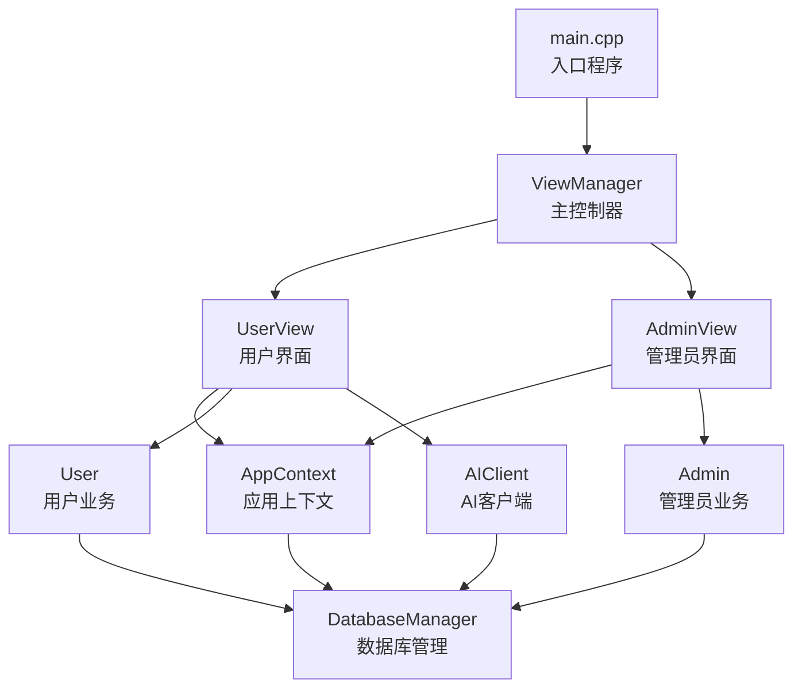
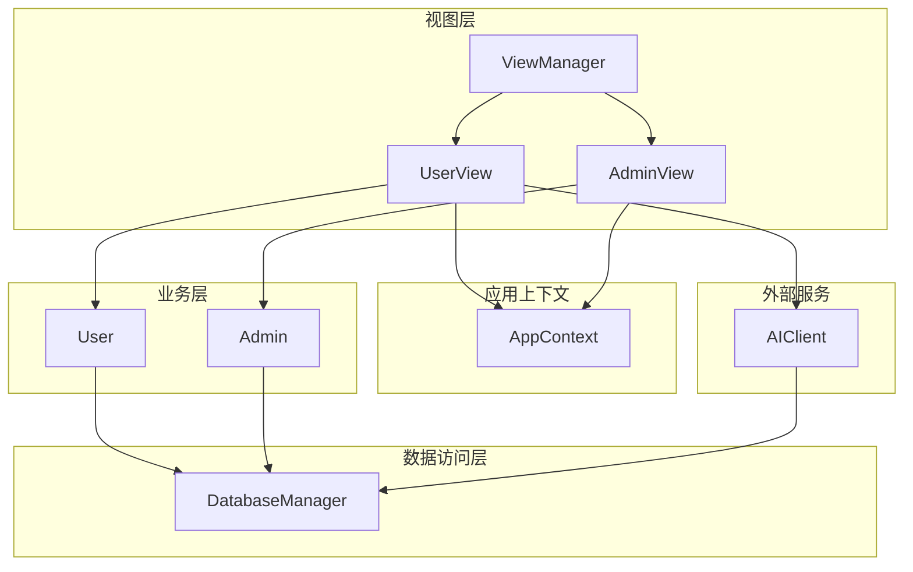
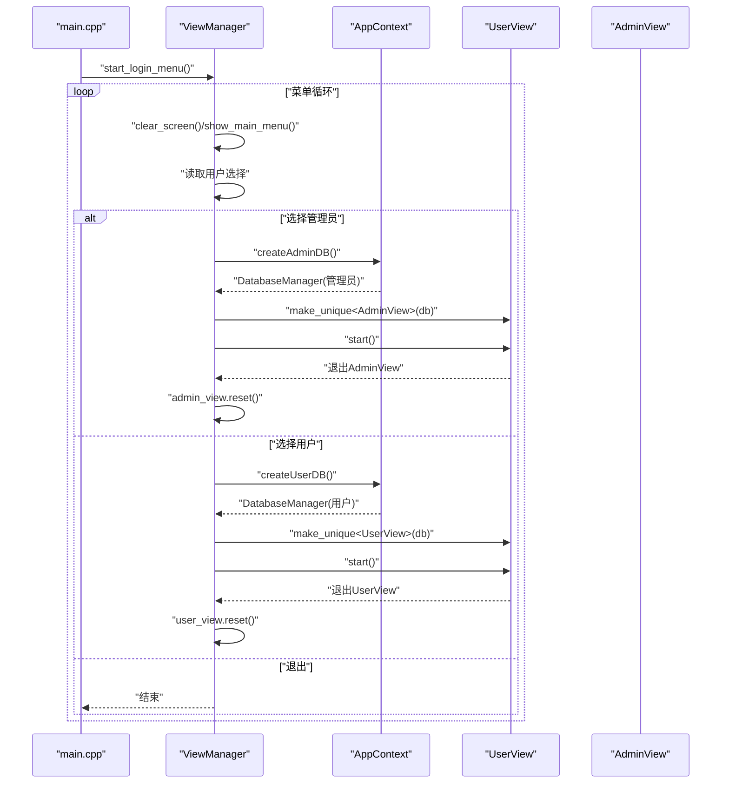
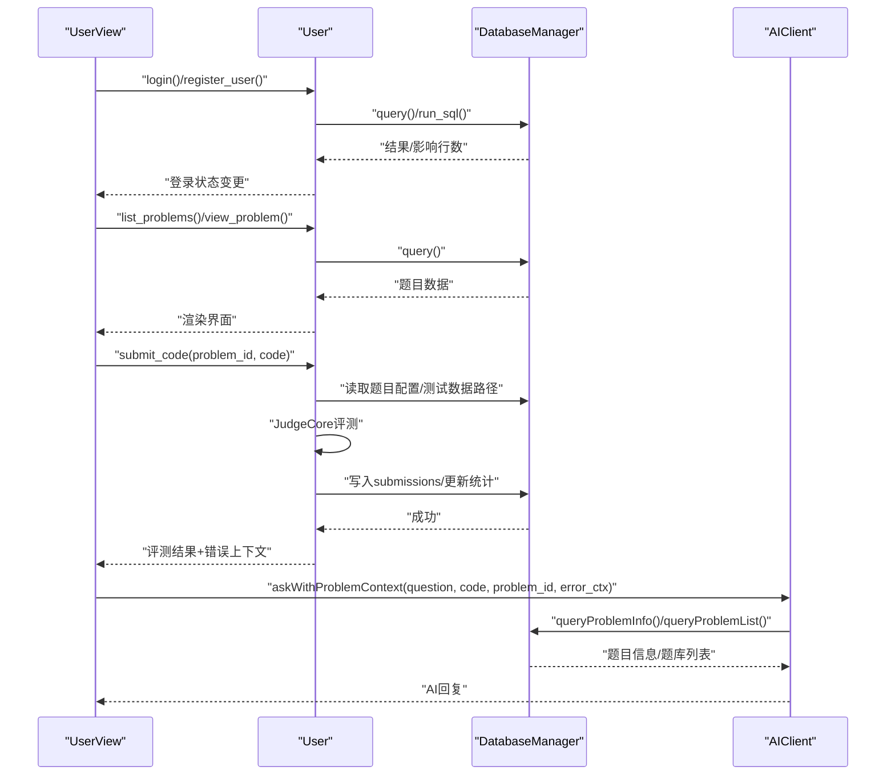
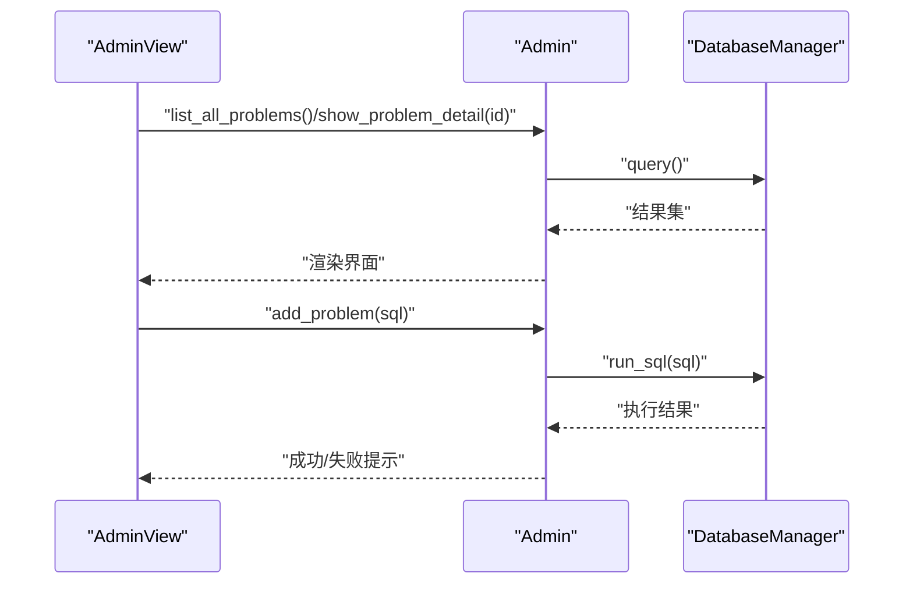
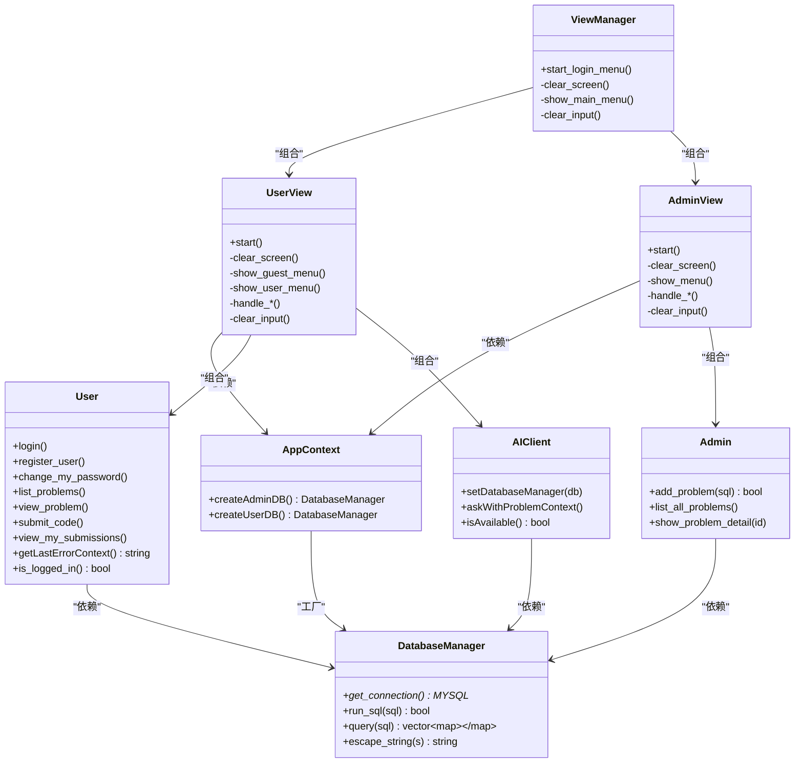
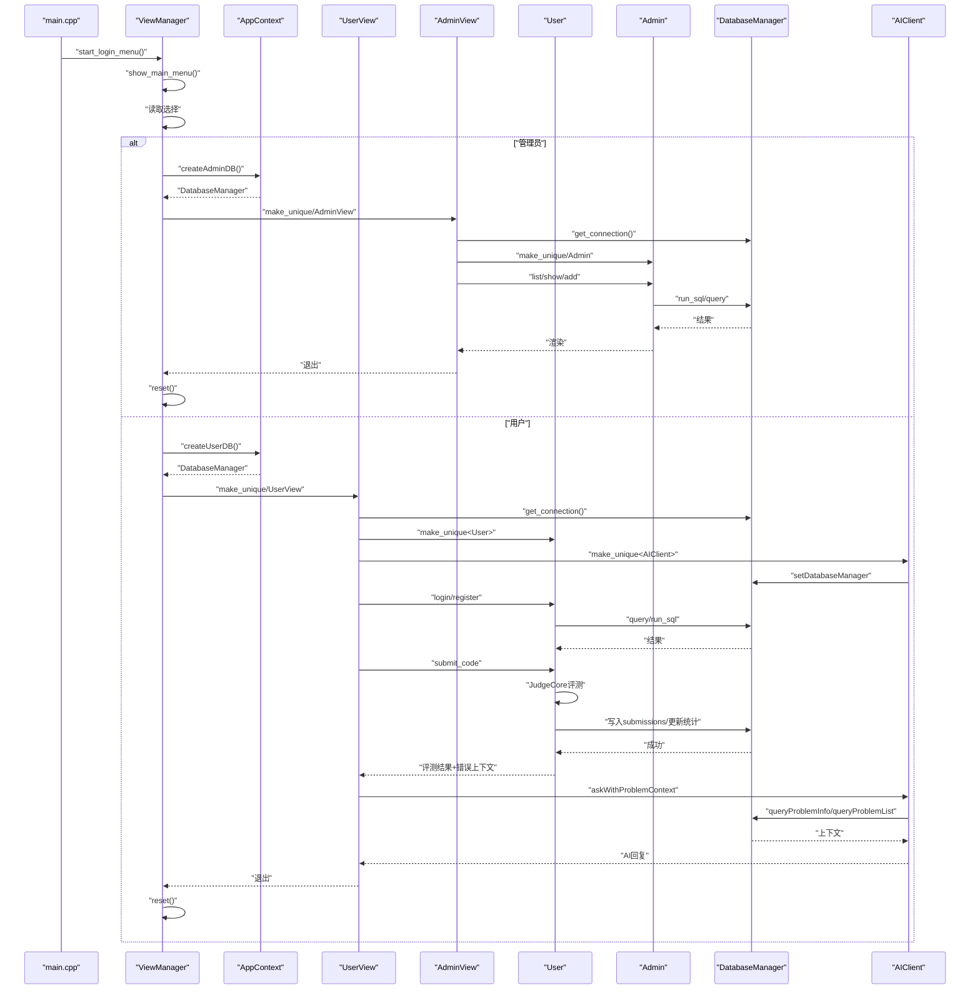

# 组件交互机制

<cite>
**本文引用的文件**
- [src/main.cpp](file://src/main.cpp)
- [include/view_manager.h](file://include/view_manager.h)
- [src/view_manager.cpp](file://src/view_manager.cpp)
- [include/user_view.h](file://include/user_view.h)
- [src/user_view.cpp](file://src/user_view.cpp)
- [include/admin_view.h](file://include/admin_view.h)
- [src/admin_view.cpp](file://src/admin_view.cpp)
- [include/app_context.h](file://include/app_context.h)
- [src/app_context.cpp](file://src/app_context.cpp)
- [include/db_manager.h](file://include/db_manager.h)
- [src/db_manager.cpp](file://src/db_manager.cpp)
- [include/user.h](file://include/user.h)
- [src/user.cpp](file://src/user.cpp)
- [include/admin.h](file://include/admin.h)
- [src/admin.cpp](file://src/admin.cpp)
- [include/ai_client.h](file://include/ai_client.h)
- [src/ai_client.cpp](file://src/ai_client.cpp)
</cite>

## 目录
1. [引言](#引言)
2. [项目结构](#项目结构)
3. [核心组件](#核心组件)
4. [架构总览](#架构总览)
5. [详细组件分析](#详细组件分析)
6. [依赖分析](#依赖分析)
7. [性能考虑](#性能考虑)
8. [故障排查指南](#故障排查指南)
9. [结论](#结论)
10. [附录](#附录)

## 引言
本文件聚焦于OJ系统的组件交互机制，系统采用“视图层-业务层-数据层”的分层设计，其中ViewManager作为主控制器协调UserView与AdminView的工作流程；UserView与AdminView分别通过AppContext提供的数据库连接实例与业务类交互；User与Admin封装各自业务逻辑并通过DatabaseManager访问数据库；AIClient负责与外部AI服务通信并向UserView提供上下文增强能力。本文将从组件协作、依赖注入、事件传递、状态同步、生命周期管理、错误传播与异常处理、时序图、消息协议以及并发访问控制等方面进行深入解析。

## 项目结构
系统采用头文件与源文件分离的组织方式，核心模块包括：
- 视图层：ViewManager、UserView、AdminView
- 应用上下文：AppContext
- 数据访问层：DatabaseManager
- 业务层：User、Admin
- AI客户端：AIClient
- 入口程序：main.cpp

图表来源
- [src/main.cpp:1-14](file://src/main.cpp#L1-L14)
- [include/view_manager.h:1-34](file://include/view_manager.h#L1-L34)
- [src/view_manager.cpp:1-78](file://src/view_manager.cpp#L1-L78)
- [include/user_view.h:1-68](file://include/user_view.h#L1-L68)
- [src/user_view.cpp:1-385](file://src/user_view.cpp#L1-L385)
- [include/admin_view.h:1-43](file://include/admin_view.h#L1-L43)
- [src/admin_view.cpp:1-138](file://src/admin_view.cpp#L1-L138)
- [include/app_context.h:1-35](file://include/app_context.h#L1-L35)
- [src/app_context.cpp:1-16](file://src/app_context.cpp#L1-L16)
- [include/db_manager.h:1-51](file://include/db_manager.h#L1-L51)
- [src/db_manager.cpp:1-108](file://src/db_manager.cpp#L1-L108)
- [include/user.h:1-80](file://include/user.h#L1-L80)
- [src/user.cpp:1-514](file://src/user.cpp#L1-L514)
- [include/admin.h:1-32](file://include/admin.h#L1-L32)
- [src/admin.cpp:1-133](file://src/admin.cpp#L1-L133)
- [include/ai_client.h:1-196](file://include/ai_client.h#L1-L196)
- [src/ai_client.cpp:1-196](file://src/ai_client.cpp#L1-L196)

章节来源
- [src/main.cpp:1-14](file://src/main.cpp#L1-L14)
- [include/view_manager.h:1-34](file://include/view_manager.h#L1-L34)
- [src/view_manager.cpp:1-78](file://src/view_manager.cpp#L1-L78)

## 核心组件
- ViewManager：命令行主控制器，负责清屏、菜单展示、角色选择与视图生命周期管理；通过AppContext创建数据库连接并注入到UserView/AdminView。
- UserView：用户模式界面，负责登录/注册、题目浏览、提交代码、查看提交记录、修改密码、AI助手对话；内部持有DatabaseManager、User、AIClient实例。
- AdminView：管理员模式界面，负责题目列表查看、题目详情查看、新增题目（执行SQL）；内部持有DatabaseManager、Admin实例。
- AppContext：应用上下文，统一提供管理员与普通用户的数据库连接工厂方法。
- DatabaseManager：数据库访问封装，提供连接、查询、执行SQL、字符串转义等能力。
- User/Admin：业务实体，封装用户与管理员的业务逻辑，均依赖DatabaseManager。
- AIClient：AI客户端，负责与Python脚本通信，支持问题上下文查询、代码上下文注入、错误上下文传递与问题列表补充。

章节来源
- [include/view_manager.h:9-34](file://include/view_manager.h#L9-L34)
- [src/view_manager.cpp:11-78](file://src/view_manager.cpp#L11-L78)
- [include/user_view.h:9-68](file://include/user_view.h#L9-L68)
- [src/user_view.cpp:25-385](file://src/user_view.cpp#L25-L385)
- [include/admin_view.h:9-43](file://include/admin_view.h#L9-L43)
- [src/admin_view.cpp:10-138](file://src/admin_view.cpp#L10-L138)
- [include/app_context.h:9-35](file://include/app_context.h#L9-L35)
- [src/app_context.cpp:5-16](file://src/app_context.cpp#L5-L16)
- [include/db_manager.h:10-51](file://include/db_manager.h#L10-L51)
- [src/db_manager.cpp:9-108](file://src/db_manager.cpp#L9-L108)
- [include/user.h:9-80](file://include/user.h#L9-L80)
- [src/user.cpp:12-514](file://src/user.cpp#L12-L514)
- [include/admin.h:8-32](file://include/admin.h#L8-L32)
- [src/admin.cpp:8-133](file://src/admin.cpp#L8-L133)
- [include/ai_client.h:1-196](file://include/ai_client.h#L1-L196)
- [src/ai_client.cpp:11-196](file://src/ai_client.cpp#L11-L196)

## 架构总览
系统采用清晰的分层与职责分离：
- 视图层仅负责UI与用户交互，不直接管理数据库连接。
- 应用上下文集中提供数据库连接实例，实现依赖注入。
- 业务层通过DatabaseManager访问数据库，避免视图层与数据层耦合。
- AI客户端独立于业务层，通过命令行调用Python脚本，支持问题上下文与错误上下文增强。

图表来源
- [include/view_manager.h:9-34](file://include/view_manager.h#L9-L34)
- [include/user_view.h:9-68](file://include/user_view.h#L9-L68)
- [include/admin_view.h:9-43](file://include/admin_view.h#L9-L43)
- [include/app_context.h:9-35](file://include/app_context.h#L9-L35)
- [include/user.h:9-80](file://include/user.h#L9-L80)
- [include/admin.h:8-32](file://include/admin.h#L8-L32)
- [include/db_manager.h:10-51](file://include/db_manager.h#L10-L51)
- [include/ai_client.h:1-196](file://include/ai_client.h#L1-L196)

## 详细组件分析

### ViewManager：主控制器与角色调度
- 职责：清屏、展示主菜单、接收用户选择、创建并启动UserView/AdminView、管理视图生命周期。
- 依赖注入：通过AppContext.createAdminDB()/createUserDB()创建DatabaseManager实例并注入到对应视图。
- 生命周期：每个角色进入后创建对应视图实例，调用start()后等待其内部循环结束，随后reset()释放资源。
- 错误处理：对非法输入进行清理与提示；默认分支提示无效选项。

图表来源
- [src/main.cpp:5-13](file://src/main.cpp#L5-L13)
- [src/view_manager.cpp:33-71](file://src/view_manager.cpp#L33-L71)
- [src/app_context.cpp:5-16](file://src/app_context.cpp#L5-L16)

章节来源
- [src/view_manager.cpp:11-78](file://src/view_manager.cpp#L11-L78)
- [include/view_manager.h:9-34](file://include/view_manager.h#L9-L34)

### UserView：用户模式交互与状态同步
- 职责：未登录态提供登录/注册入口；已登录态提供题目列表、题目详情、提交代码、查看提交记录、修改密码；集成AIClient提供AI辅助。
- 依赖注入：构造时接收DatabaseManager所有权，内部创建User与AIClient，并将DatabaseManager指针传递给AIClient。
- 状态同步：User对象维护登录状态、当前用户ID与账号；UserView根据其状态切换菜单项。
- 错误处理：输入校验、非法输入清理、数据库连接失败提示、AI服务不可用提示。
- 事件传递：用户在不同菜单间切换触发不同的处理函数；提交代码后触发评测流程并更新UI。

图表来源
- [src/user_view.cpp:39-134](file://src/user_view.cpp#L39-L134)
- [src/user.cpp:269-452](file://src/user.cpp#L269-L452)
- [src/ai_client.cpp:74-97](file://src/ai_client.cpp#L74-L97)
- [src/db_manager.cpp:54-85](file://src/db_manager.cpp#L54-L85)

章节来源
- [include/user_view.h:9-68](file://include/user_view.h#L9-L68)
- [src/user_view.cpp:25-385](file://src/user_view.cpp#L25-L385)
- [include/user.h:9-80](file://include/user.h#L9-L80)
- [src/user.cpp:12-514](file://src/user.cpp#L12-L514)
- [include/ai_client.h:1-196](file://include/ai_client.h#L1-L196)
- [src/ai_client.cpp:11-196](file://src/ai_client.cpp#L11-L196)

### AdminView：管理员模式与SQL执行
- 职责：提供题目列表查看、题目详情查看、新增题目（执行SQL）功能。
- 依赖注入：构造时接收DatabaseManager所有权，内部创建Admin对象。
- 错误处理：输入校验、SQL执行失败提示、空SQL提示。
- 生命周期：进入后循环处理菜单，退出时重置资源。

图表来源
- [src/admin_view.cpp:22-76](file://src/admin_view.cpp#L22-L76)
- [src/admin.cpp:17-133](file://src/admin.cpp#L17-L133)
- [src/db_manager.cpp:22-43](file://src/db_manager.cpp#L22-L43)

章节来源
- [include/admin_view.h:9-43](file://include/admin_view.h#L9-L43)
- [src/admin_view.cpp:10-138](file://src/admin_view.cpp#L10-L138)
- [include/admin.h:8-32](file://include/admin.h#L8-L32)
- [src/admin.cpp:8-133](file://src/admin.cpp#L8-L133)

### AppContext：依赖注入与连接工厂
- 职责：集中提供管理员与普通用户的DatabaseManager实例，屏蔽连接细节。
- 设计要点：静态工厂方法，避免直接在视图层创建连接，确保权限隔离与配置一致性。

章节来源
- [include/app_context.h:9-35](file://include/app_context.h#L9-L35)
- [src/app_context.cpp:5-16](file://src/app_context.cpp#L5-L16)

### DatabaseManager：数据访问抽象
- 职责：封装MySQL连接、SQL执行、查询结果解析、字符串转义。
- 安全性：提供escape_string以降低SQL注入风险；run_sql/query对错误进行日志输出。
- 生命周期：构造时建立连接，析构时关闭连接。

章节来源
- [include/db_manager.h:10-51](file://include/db_manager.h#L10-L51)
- [src/db_manager.cpp:9-108](file://src/db_manager.cpp#L9-L108)

### User/Admin：业务实体与状态管理
- User：维护登录状态、当前用户ID与账号；提供登录/注册/改密/题目浏览/提交/查看提交记录等接口；提交代码后生成错误上下文供AI使用。
- Admin：提供新增题目（SQL执行）、题目列表与详情查看。
- 状态同步：UserView通过User对象的状态决定菜单项与行为；UserView与AdminView各自持有独立的DatabaseManager实例，避免越权访问。

章节来源
- [include/user.h:9-80](file://include/user.h#L9-L80)
- [src/user.cpp:12-514](file://src/user.cpp#L12-L514)
- [include/admin.h:8-32](file://include/admin.h#L8-L32)
- [src/admin.cpp:8-133](file://src/admin.cpp#L8-L133)

### AIClient：AI服务集成与上下文增强
- 职责：查询题目信息、查询题库列表、调用Python脚本、处理NEED_PROBLEMS信号、转义参数、检测可用性。
- 协议：通过命令行参数传递消息、代码上下文与问题上下文；Python脚本返回文本响应；若返回包含特定标记则自动追加题库列表再次请求。
- 可用性：提供isAvailable()检测Python环境与脚本是否存在。

章节来源
- [include/ai_client.h:1-196](file://include/ai_client.h#L1-L196)
- [src/ai_client.cpp:11-196](file://src/ai_client.cpp#L11-L196)

## 依赖分析
- 组件耦合度：ViewManager与UserView/AdminView为组合关系；UserView与AdminView均依赖AppContext与DatabaseManager；User/Admin依赖DatabaseManager；UserView依赖AIClient。
- 依赖方向：自上而下（视图层→业务层→数据层），无反向依赖。
- 循环依赖：未发现循环依赖。
- 外部依赖：MySQL C API、OpenSSL（SHA256）、Python（AI服务）。

图表来源
- [include/view_manager.h:9-34](file://include/view_manager.h#L9-L34)
- [include/user_view.h:9-68](file://include/user_view.h#L9-L68)
- [include/admin_view.h:9-43](file://include/admin_view.h#L9-L43)
- [include/app_context.h:9-35](file://include/app_context.h#L9-L35)
- [include/db_manager.h:10-51](file://include/db_manager.h#L10-L51)
- [include/user.h:9-80](file://include/user.h#L9-L80)
- [include/admin.h:8-32](file://include/admin.h#L8-L32)
- [include/ai_client.h:1-196](file://include/ai_client.h#L1-L196)

## 性能考虑
- I/O与网络：AI客户端通过命令行调用Python脚本，存在进程启动与IO开销；建议在高频调用场景下引入连接池或本地缓存。
- 数据库：DatabaseManager对每次查询/执行均进行错误日志输出，生产环境可按需调整日志级别；批量操作建议合并SQL或使用事务。
- 文本处理：User在渲染题目列表时进行UTF-8宽度计算与截断，避免终端乱码；建议在大数据量时采用分页或延迟渲染。
- 并发访问：当前实现为单线程命令行交互，未见并发控制；如扩展为多用户或多会话，需引入锁或无锁队列。

## 故障排查指南
- 数据库连接失败
  - 现象：UserView/AdminView启动后立即提示连接失败。
  - 排查：确认AppContext中主机、用户名、密码、数据库名配置正确；检查MySQL服务状态与网络连通性。
  - 相关实现参考
    - [src/user_view.cpp:46-134](file://src/user_view.cpp#L46-L134)
    - [src/admin_view.cpp:29-76](file://src/admin_view.cpp#L29-L76)
    - [src/db_manager.cpp:89-107](file://src/db_manager.cpp#L89-L107)
- 输入非法或缓冲区残留
  - 现象：输入非数字导致菜单异常。
  - 排查：调用clear_input()清理缓冲区；确保输入验证与类型检查。
  - 相关实现参考
    - [src/view_manager.cpp:43-48](file://src/view_manager.cpp#L43-L48)
    - [src/user_view.cpp:67-73](file://src/user_view.cpp#L67-L73)
    - [src/admin_view.cpp:40-46](file://src/admin_view.cpp#L40-L46)
- AI服务不可用
  - 现象：UserView提示AI服务不可用。
  - 排查：确认pythonPath与脚本路径存在；检查Python虚拟环境与依赖安装；验证isAvailable()返回值。
  - 相关实现参考
    - [src/user_view.cpp:298-304](file://src/user_view.cpp#L298-L304)
    - [src/ai_client.cpp:186-195](file://src/ai_client.cpp#L186-L195)
- 提交代码失败或评测异常
  - 现象：提交后无结果或评测异常。
  - 排查：检查workspace/solution.cpp是否存在且非空；确认测试数据路径存在；查看评测引擎配置与报告。
  - 相关实现参考
    - [src/user_view.cpp:279-291](file://src/user_view.cpp#L279-L291)
    - [src/user.cpp:269-452](file://src/user.cpp#L269-L452)

章节来源
- [src/view_manager.cpp:43-48](file://src/view_manager.cpp#L43-L48)
- [src/user_view.cpp:67-73](file://src/user_view.cpp#L67-L73)
- [src/admin_view.cpp:40-46](file://src/admin_view.cpp#L40-L46)
- [src/user_view.cpp:298-304](file://src/user_view.cpp#L298-L304)
- [src/ai_client.cpp:186-195](file://src/ai_client.cpp#L186-L195)
- [src/user_view.cpp:279-291](file://src/user_view.cpp#L279-L291)
- [src/user.cpp:269-452](file://src/user.cpp#L269-L452)

## 结论
本系统通过ViewManager实现主控制器与角色调度，结合AppContext完成依赖注入，使视图层与数据层解耦；UserView与AdminView分别承载用户与管理员的业务交互；User/Admin封装业务逻辑并通过DatabaseManager访问数据库；AIClient提供AI增强能力并与业务层松耦合。整体设计遵循单一职责与分层原则，具备良好的可维护性与扩展性。后续可在并发访问、AI服务性能与数据库批量操作方面进一步优化。

## 附录

### 组件生命周期管理
- ViewManager：创建UserView/AdminView实例，调用start()后等待退出，随后reset()释放。
- UserView/AdminView：构造时注入DatabaseManager，内部创建业务对象；退出时重置业务对象与数据库连接。
- DatabaseManager：构造时建立连接，析构时关闭连接。

章节来源
- [src/view_manager.cpp:54-62](file://src/view_manager.cpp#L54-L62)
- [src/user_view.cpp:48-134](file://src/user_view.cpp#L48-L134)
- [src/admin_view.cpp:31-76](file://src/admin_view.cpp#L31-L76)
- [src/db_manager.cpp:14-20](file://src/db_manager.cpp#L14-L20)

### 错误传播与异常处理策略
- 输入错误：统一通过clear_input()清理缓冲区并提示无效输入。
- 数据库错误：DatabaseManager在run_sql/query中输出错误信息；调用方根据返回值决定后续流程。
- AI服务错误：AIClient在ask中对空响应返回错误提示；isAvailable()用于预检。
- 业务错误：User/Admin在关键操作失败时返回false并输出提示信息。

章节来源
- [src/view_manager.cpp:73-77](file://src/view_manager.cpp#L73-L77)
- [src/db_manager.cpp:29-42](file://src/db_manager.cpp#L29-L42)
- [src/ai_client.cpp:175-183](file://src/ai_client.cpp#L175-L183)
- [src/user.cpp:40-102](file://src/user.cpp#L40-L102)
- [src/admin.cpp:10-15](file://src/admin.cpp#L10-L15)

### 组件交互时序图（综合）

图表来源
- [src/main.cpp:5-13](file://src/main.cpp#L5-L13)
- [src/view_manager.cpp:33-71](file://src/view_manager.cpp#L33-L71)
- [src/app_context.cpp:5-16](file://src/app_context.cpp#L5-L16)
- [src/user_view.cpp:39-134](file://src/user_view.cpp#L39-L134)
- [src/admin_view.cpp:22-76](file://src/admin_view.cpp#L22-L76)
- [src/user.cpp:269-452](file://src/user.cpp#L269-L452)
- [src/ai_client.cpp:74-97](file://src/ai_client.cpp#L74-L97)
- [src/db_manager.cpp:22-85](file://src/db_manager.cpp#L22-L85)

### 消息传递协议（AI客户端）
- 参数格式：通过命令行参数传递会话ID、消息、代码上下文、问题上下文。
- 上下文增强：当AI返回包含特定标记时，自动附加题库列表再次请求。
- 可用性检测：检查Python可执行文件与脚本文件是否存在。

章节来源
- [src/ai_client.cpp:157-184](file://src/ai_client.cpp#L157-L184)
- [src/ai_client.cpp:89-96](file://src/ai_client.cpp#L89-L96)
- [src/ai_client.cpp:186-195](file://src/ai_client.cpp#L186-L195)

### 并发访问控制方案
- 当前实现：单线程命令行交互，无并发控制。
- 建议方案：引入互斥锁保护共享资源（如DatabaseManager实例复用）；对AI服务调用增加队列与超时控制；对数据库批量写入使用事务保证一致性。