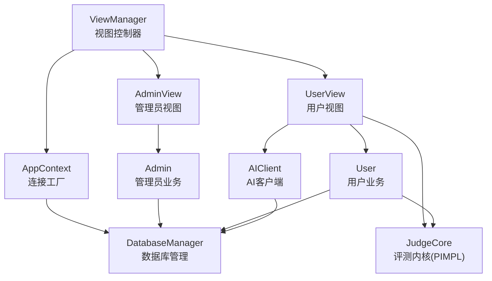
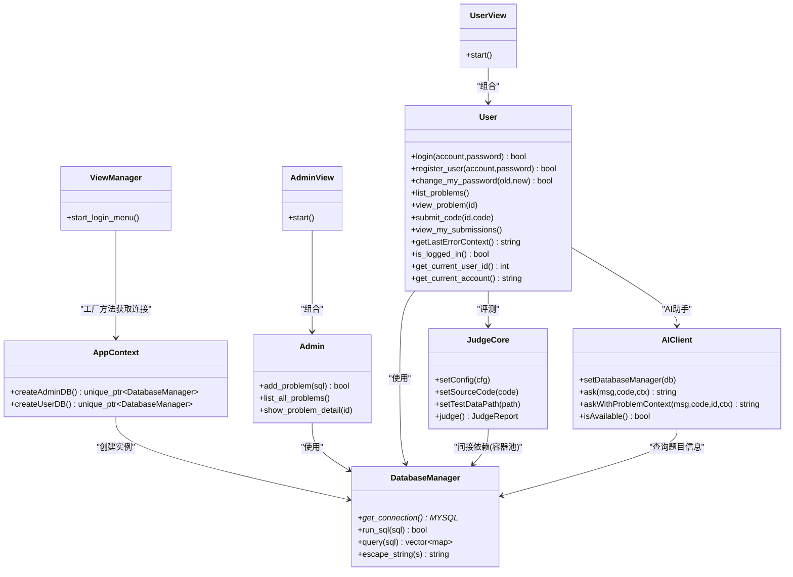
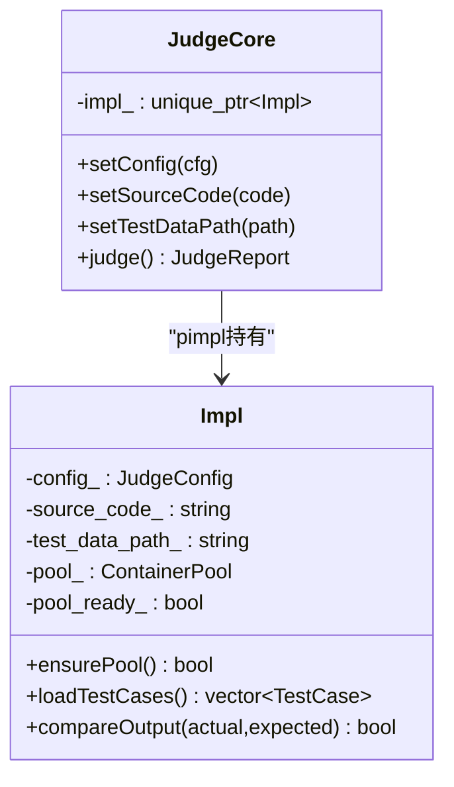
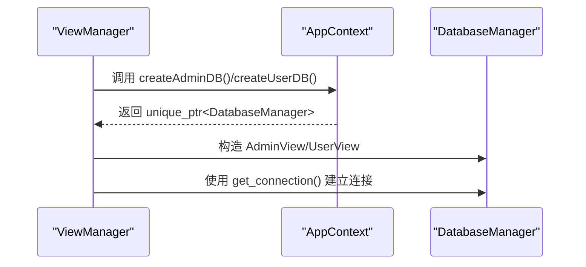
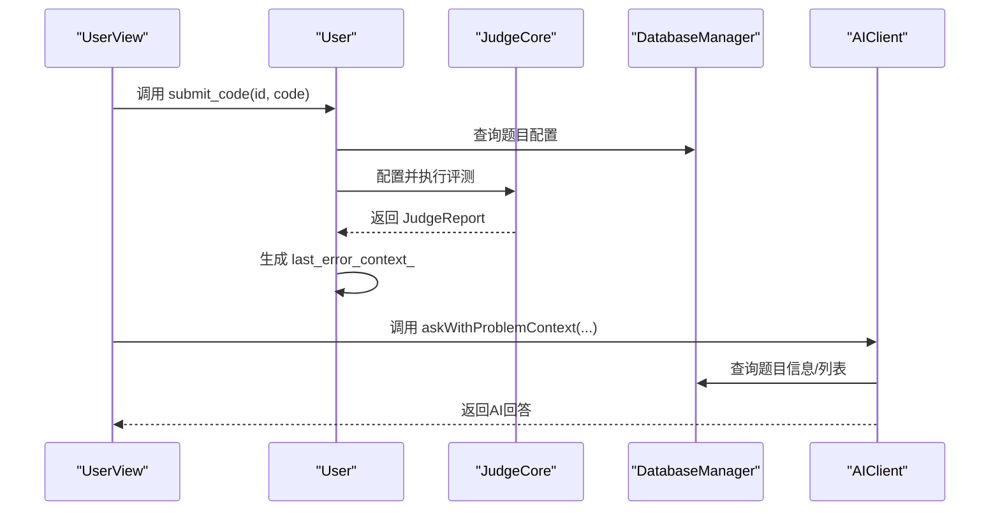
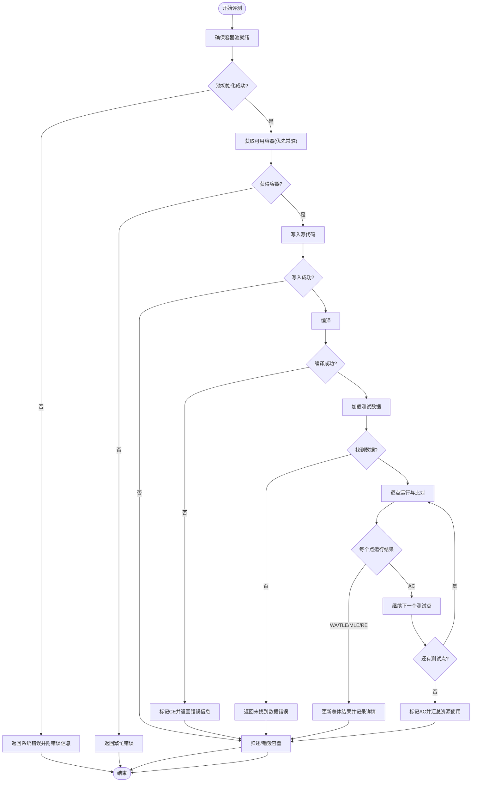
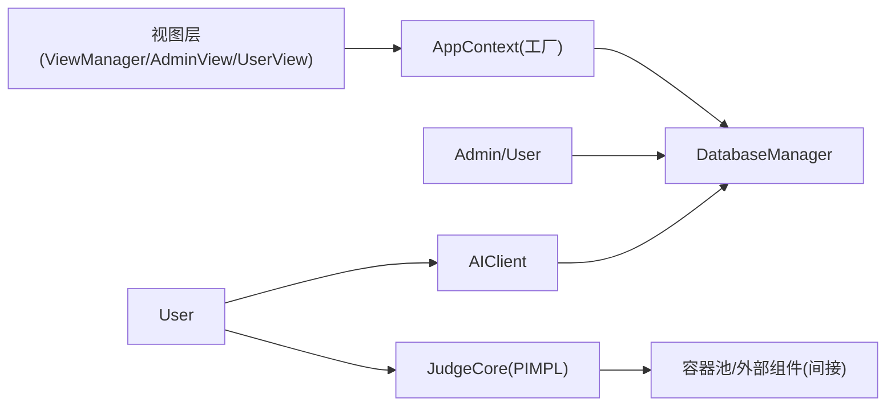

# 设计模式应用

<cite>
**本文引用的文件**
- [app_context.h](file://include/app_context.h)
- [app_context.cpp](file://src/app_context.cpp)
- [judge_core.h](file://include/judge_core.h)
- [judge_core.cpp](file://src/judge_core.cpp)
- [view_manager.h](file://include/view_manager.h)
- [view_manager.cpp](file://src/view_manager.cpp)
- [admin_view.h](file://include/admin_view.h)
- [admin_view.cpp](file://src/admin_view.cpp)
- [user_view.h](file://include/user_view.h)
- [user_view.cpp](file://src/user_view.cpp)
- [db_manager.h](file://include/db_manager.h)
- [db_manager.cpp](file://src/db_manager.cpp)
- [admin.h](file://include/admin.h)
- [admin.cpp](file://src/admin.cpp)
- [user.h](file://include/user.h)
- [user.cpp](file://src/user.cpp)
- [ai_client.h](file://include/ai_client.h)
- [ai_client.cpp](file://src/ai_client.cpp)
</cite>

## 目录
1. [引言](#引言)
2. [项目结构](#项目结构)
3. [核心组件](#核心组件)
4. [架构总览](#架构总览)
5. [详细组件分析](#详细组件分析)
6. [依赖分析](#依赖分析)
7. [性能考虑](#性能考虑)
8. [故障排查指南](#故障排查指南)
9. [结论](#结论)
10. [附录](#附录)

## 引言
本文件聚焦于OJ系统中设计模式的应用与落地，围绕以下主题展开：
- PIMPL模式在JudgeCore中的实现与优势
- 工厂模式在AppContext中的应用
- 观察者模式在视图层的使用
并结合类图、时序图与流程图，解释每种设计模式的选择原因、实现细节与带来的可维护性、可扩展性与可测试性提升。

## 项目结构
系统采用分层+职责分离的组织方式：
- 视图层：ViewManager、AdminView、UserView，负责用户交互与业务入口
- 业务层：Admin、User，封装管理员与用户业务逻辑
- 基础设施层：AppContext、DatabaseManager，提供连接工厂与数据库访问能力
- 评测内核：JudgeCore，封装评测流程与容器池调度
- AI集成：AIClient，封装外部AI服务调用

图表来源
- [view_manager.h:10-31](file://include/view_manager.h#L10-L31)
- [admin_view.h:10-40](file://include/admin_view.h#L10-L40)
- [user_view.h:10-65](file://include/user_view.h#L10-L65)
- [app_context.h:15-32](file://include/app_context.h#L15-L32)
- [db_manager.h:11-46](file://include/db_manager.h#L11-L46)
- [judge_core.h:60-101](file://include/judge_core.h#L60-L101)
- [ai_client.h:7-46](file://include/ai_client.h#L7-L46)

章节来源
- [view_manager.h:10-31](file://include/view_manager.h#L10-L31)
- [view_manager.cpp:33-71](file://src/view_manager.cpp#L33-L71)
- [admin_view.h:10-40](file://include/admin_view.h#L10-L40)
- [admin_view.cpp:22-76](file://src/admin_view.cpp#L22-L76)
- [user_view.h:10-65](file://include/user_view.h#L10-L65)
- [user_view.cpp:39-134](file://src/user_view.cpp#L39-L134)
- [app_context.h:15-32](file://include/app_context.h#L15-L32)
- [app_context.cpp:5-15](file://src/app_context.cpp#L5-L15)
- [db_manager.h:11-46](file://include/db_manager.h#L11-L46)
- [db_manager.cpp:9-107](file://src/db_manager.cpp#L9-L107)
- [judge_core.h:60-101](file://include/judge_core.h#L60-L101)
- [judge_core.cpp:12-201](file://src/judge_core.cpp#L12-L201)
- [ai_client.h:7-46](file://include/ai_client.h#L7-L46)
- [ai_client.cpp:11-195](file://src/ai_client.cpp#L11-L195)

## 核心组件
- AppContext：提供静态工厂方法创建不同权限级别的DatabaseManager实例，统一管理数据库连接配置与生命周期
- JudgeCore：评测核心，采用PIMPL隐藏实现细节，仅暴露简洁接口；内部通过Impl类承载复杂状态与算法
- ViewManager/AdminView/UserView：视图控制器与视图类，负责用户交互、菜单展示与业务入口
- DatabaseManager：封装MySQL连接、查询与转义，提供统一的数据库访问能力
- Admin/User：封装管理员与用户业务逻辑，依赖DatabaseManager完成数据访问
- AIClient：封装AI服务调用，支持问题上下文检索与自动补全

章节来源
- [app_context.h:15-32](file://include/app_context.h#L15-L32)
- [app_context.cpp:5-15](file://src/app_context.cpp#L5-L15)
- [judge_core.h:60-101](file://include/judge_core.h#L60-L101)
- [judge_core.cpp:12-201](file://src/judge_core.cpp#L12-L201)
- [view_manager.h:10-31](file://include/view_manager.h#L10-L31)
- [admin_view.h:10-40](file://include/admin_view.h#L10-L40)
- [user_view.h:10-65](file://include/user_view.h#L10-L65)
- [db_manager.h:11-46](file://include/db_manager.h#L11-L46)
- [admin.h:9-29](file://include/admin.h#L9-L29)
- [user.h:10-77](file://include/user.h#L10-L77)
- [ai_client.h:7-46](file://include/ai_client.h#L7-L46)

## 架构总览
系统遵循“视图-业务-基础设施”的分层架构，通过AppContext集中管理数据库连接，避免视图层直接耦合底层连接细节；评测内核JudgeCore通过PIMPL降低头文件暴露与编译依赖；视图层通过工厂方法获取连接，形成清晰的依赖方向。

图表来源
- [app_context.h:15-32](file://include/app_context.h#L15-L32)
- [db_manager.h:11-46](file://include/db_manager.h#L11-L46)
- [judge_core.h:60-101](file://include/judge_core.h#L60-L101)
- [view_manager.h:10-31](file://include/view_manager.h#L10-L31)
- [admin_view.h:10-40](file://include/admin_view.h#L10-L40)
- [user_view.h:10-65](file://include/user_view.h#L10-L65)
- [admin.h:9-29](file://include/admin.h#L9-L29)
- [user.h:10-77](file://include/user.h#L10-L77)
- [ai_client.h:7-46](file://include/ai_client.h#L7-L46)

## 详细组件分析

### PIMPL模式在JudgeCore中的实现与优势
- 实现要点
  - 头文件仅声明公共接口与前置声明，具体实现置于Impl类中
  - 通过unique_ptr<Impl>持有实现，避免头文件暴露内部细节
  - 构造函数中惰性初始化容器池，确保首次评测时才创建资源
  - 评测流程在Impl中实现：加载测试数据、编译、逐点运行与结果汇总
- 优势
  - 接口稳定：对外仅暴露少量配置与评测接口，内部实现变更不影响上层
  - 编译隔离：Impl细节不暴露在头文件，减少编译依赖与重编译范围
  - 可维护性：将复杂状态与算法封装在Impl，提升可读性与可维护性
  - 可测试性：可通过mock或替换Impl实现进行单元测试（当前未见显式测试桩）

图表来源
- [judge_core.h:60-101](file://include/judge_core.h#L60-L101)
- [judge_core.cpp:12-201](file://src/judge_core.cpp#L12-L201)

章节来源
- [judge_core.h:60-101](file://include/judge_core.h#L60-L101)
- [judge_core.cpp:12-201](file://src/judge_core.cpp#L12-L201)

### 工厂模式在AppContext中的应用
- 实现要点
  - 提供静态工厂方法createAdminDB与createUserDB，分别返回具有不同权限的DatabaseManager实例
  - AppContext本身为工具类，构造被删除，禁止实例化
- 优势
  - 统一连接创建：视图层无需关心连接参数与权限差异
  - 解耦：视图层只依赖AppContext接口，不依赖具体数据库实现
  - 可扩展：新增连接类型只需扩展工厂方法，不影响现有调用方

图表来源
- [view_manager.cpp:54-60](file://src/view_manager.cpp#L54-L60)
- [app_context.h:15-32](file://include/app_context.h#L15-L32)
- [app_context.cpp:5-15](file://src/app_context.cpp#L5-L15)
- [db_manager.h:21-21](file://include/db_manager.h#L21-L21)

章节来源
- [app_context.h:15-32](file://include/app_context.h#L15-L32)
- [app_context.cpp:5-15](file://src/app_context.cpp#L5-L15)
- [view_manager.cpp:54-60](file://src/view_manager.cpp#L54-L60)

### 观察者模式在视图层的使用
- 实现要点
  - 视图层通过UserView与AdminView分别管理各自的业务对象（User/Admin），二者均依赖DatabaseManager
  - UserView在评测完成后，将评测错误上下文保存到last_error_context_，供后续AI对话使用
  - 这体现了“事件”发生后，其他组件（如AIClient）基于上下文进行响应的观察者思想
- 优势
  - 松耦合：UserView不直接依赖AI实现，仅通过上下文字符串传递
  - 可扩展：未来可引入更多“观察者”，如日志收集、通知推送等

图表来源
- [user_view.cpp:279-344](file://src/user_view.cpp#L279-L344)
- [user.cpp:269-452](file://src/user.cpp#L269-L452)
- [judge_core.h:60-101](file://include/judge_core.h#L60-L101)
- [ai_client.cpp:74-97](file://src/ai_client.cpp#L74-L97)
- [db_manager.h:35-35](file://include/db_manager.h#L35-L35)

章节来源
- [user_view.cpp:279-344](file://src/user_view.cpp#L279-L344)
- [user.cpp:269-452](file://src/user.cpp#L269-L452)
- [ai_client.cpp:74-97](file://src/ai_client.cpp#L74-L97)

### 评测流程与错误处理（流程图）

图表来源
- [judge_core.cpp:85-201](file://src/judge_core.cpp#L85-L201)

章节来源
- [judge_core.cpp:85-201](file://src/judge_core.cpp#L85-L201)

## 依赖分析
- 视图层依赖AppContext获取DatabaseManager，避免直接依赖底层连接细节
- 业务层Admin/User依赖DatabaseManager进行数据访问
- 评测内核JudgeCore通过PIMPL隐藏实现，仅暴露接口；其内部通过容器池与外部组件协作
- AI客户端AIClient依赖DatabaseManager查询题目信息，再调用外部Python脚本

图表来源
- [view_manager.h:10-31](file://include/view_manager.h#L10-L31)
- [app_context.h:15-32](file://include/app_context.h#L15-L32)
- [db_manager.h:11-46](file://include/db_manager.h#L11-L46)
- [admin.h:9-29](file://include/admin.h#L9-L29)
- [user.h:10-77](file://include/user.h#L10-L77)
- [judge_core.h:60-101](file://include/judge_core.h#L60-L101)
- [ai_client.h:7-46](file://include/ai_client.h#L7-L46)

章节来源
- [view_manager.h:10-31](file://include/view_manager.h#L10-L31)
- [app_context.h:15-32](file://include/app_context.h#L15-L32)
- [db_manager.h:11-46](file://include/db_manager.h#L11-L46)
- [admin.h:9-29](file://include/admin.h#L9-L29)
- [user.h:10-77](file://include/user.h#L10-L77)
- [judge_core.h:60-101](file://include/judge_core.h#L60-L101)
- [ai_client.h:7-46](file://include/ai_client.h#L7-L46)

## 性能考虑
- PIMPL降低编译期依赖，减少头文件污染，有利于大型工程的并行构建
- 容器池的惰性初始化与复用，有助于减少Docker容器频繁创建销毁的开销
- 评测流程中对输出比对采用去尾随空白策略，避免无关差异导致WA
- 建议
  - 对容器池并发度与预热策略进行动态配置
  - 对评测报告聚合（最大时间/内存）进行缓存或增量更新
  - 对AI调用增加超时与重试机制

## 故障排查指南
- 数据库连接失败
  - 检查AppContext工厂方法传入的主机、用户名、密码与数据库名
  - 确认DatabaseManager::get_connection返回有效句柄
- 评测无可用容器
  - 检查容器池初始化状态与最大并发设置
  - 关注JudgeCore::judge返回的系统繁忙提示
- 编译错误(CE)
  - 查看JudgeReport中的错误信息字段
  - 确认容器内编译环境与语言版本
- 输出比对失败(WA)
  - 检查测试数据路径与文件命名规范
  - 确认输出比对逻辑忽略行尾空白的一致性
- AI服务不可用
  - 检查AIClient::isAvailable返回状态
  - 确认Python路径与脚本文件存在

章节来源
- [app_context.cpp:5-15](file://src/app_context.cpp#L5-L15)
- [db_manager.cpp:22-84](file://src/db_manager.cpp#L22-L84)
- [judge_core.cpp:85-201](file://src/judge_core.cpp#L85-L201)
- [ai_client.cpp:186-195](file://src/ai_client.cpp#L186-L195)

## 结论
本系统通过PIMPL、工厂与观察者等设计模式，在不牺牲功能的前提下显著提升了系统的可维护性、可扩展性与可测试性：
- PIMPL使评测内核接口稳定、实现隔离，便于演进
- 工厂模式统一了数据库连接创建，降低视图层耦合
- 观察者思想体现在UserView对评测结果的“事件”响应与上下文传递
建议在后续迭代中进一步完善测试覆盖与可观测性，以持续提升质量与稳定性。

## 附录
- 最佳实践建议
  - 对所有外部依赖（数据库、容器、AI）增加统一的配置中心与健康检查
  - 对评测流程的关键节点增加日志与指标上报
  - 对工厂方法返回的资源进行RAII封装，确保异常安全
  - 对PIMPL内部状态机进行单元测试，保证评测流程正确性