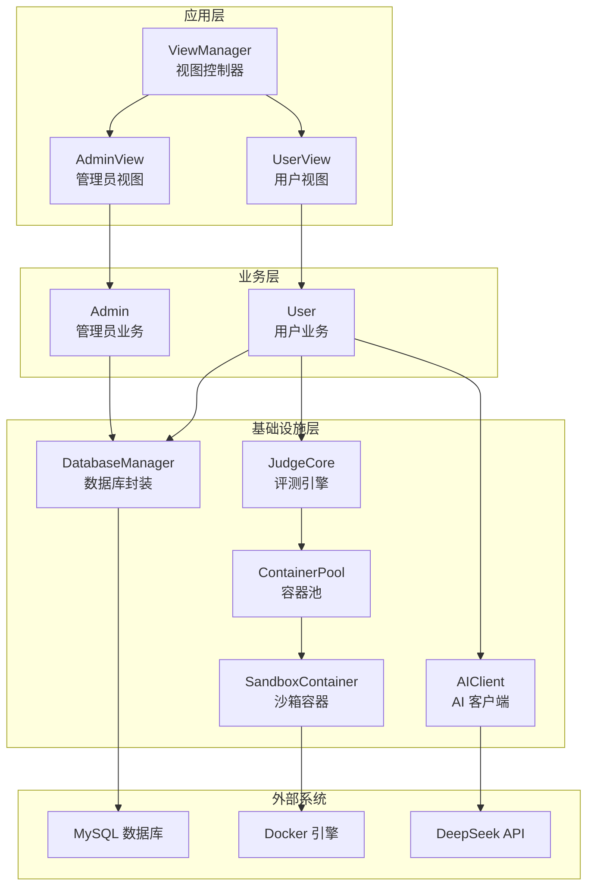
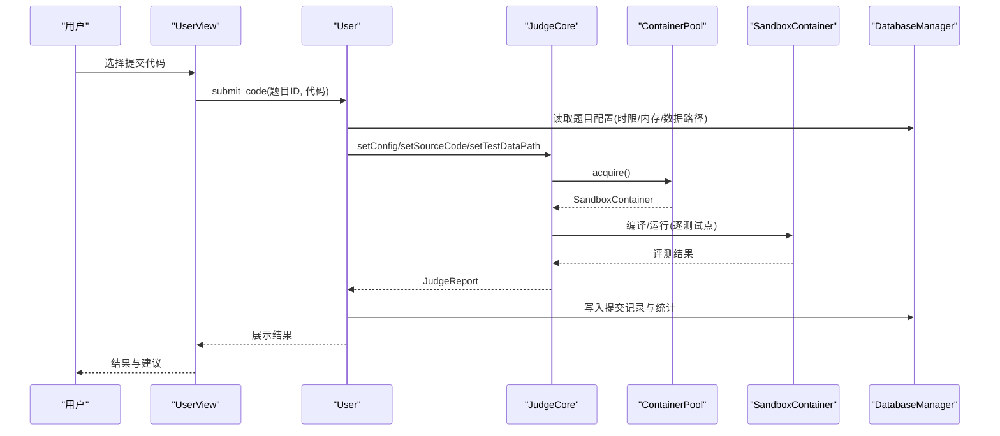
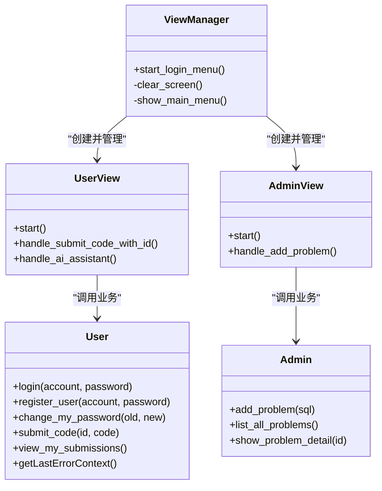
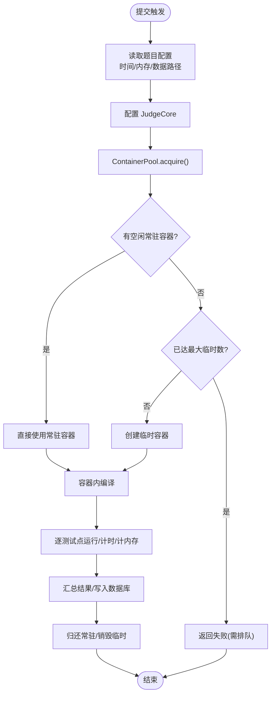
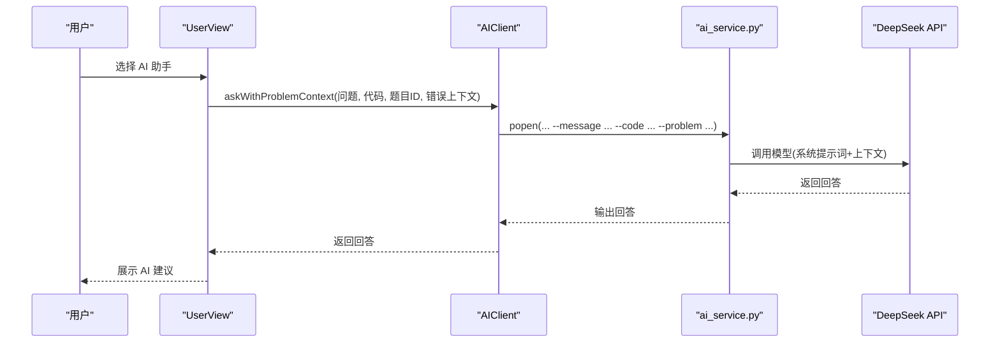
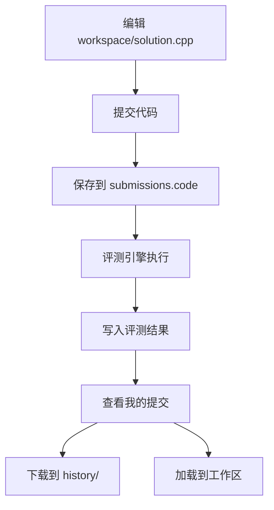
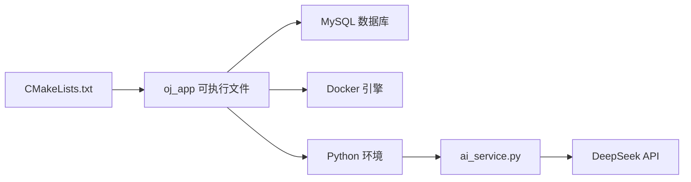

# 项目概述

<cite>
**本文引用的文件**   
- [README.md](file://README.md)
- [CMakeLists.txt](file://CMakeLists.txt)
- [src/main.cpp](file://src/main.cpp)
- [init.sql](file://init.sql)
- [docs/code_submission_design.md](file://docs/code_submission_design.md)
- [docs/judge_implementation_plan.md](file://docs/judge_implementation_plan.md)
- [include/admin.h](file://include/admin.h)
- [include/user.h](file://include/user.h)
- [include/view_manager.h](file://include/view_manager.h)
- [docker-compose.yml](file://docker-compose.yml)
- [judge-sandbox/Dockerfile](file://judge-sandbox/Dockerfile)
- [ai/ai_service.py](file://ai/ai_service.py)
- [ai/requirements.txt](file://ai/requirements.txt)
</cite>

## 目录
1. [简介](#简介)
2. [项目结构](#项目结构)
3. [核心组件](#核心组件)
4. [架构总览](#架构总览)
5. [详细组件分析](#详细组件分析)
6. [依赖分析](#依赖分析)
7. [性能考量](#性能考量)
8. [故障排查指南](#故障排查指南)
9. [结论](#结论)
10. [附录](#附录)

## 简介
本项目是一个基于 C++17 的完整在线评测系统（OJ Online Judge），面向命令行交互式编程练习场景，提供双角色体系（管理员/普通用户）、Docker 容器化沙箱评测、容器池调度、AI 智能辅助调试、端到端评测流程与多层安全隔离等能力。系统通过依赖注入实现关注点分离，采用 PIMPL 封装隐藏实现细节，结合 CMake 构建与 Docker Compose 编排，形成可运行、可扩展、可教学的工程化范例。

- 核心目标
  - 提供稳定可靠的在线编程练习与自动评测平台
  - 以容器沙箱保障评测过程的安全与隔离
  - 通过 AI 助手提供“严师”式智能辅助，引导用户自主调试与提升
  - 以工程化最佳实践（依赖注入、PIMPL、最小权限）降低复杂度与风险

- 主要功能特性
  - 双角色系统：管理员（题目/用户管理）与普通用户（做题/提交）
  - Docker 沙箱评测：隔离编译与运行，禁网、只读文件系统、非特权用户、进程/内存限制
  - 容器池调度：预热常驻容器 + 按需临时容器，降低冷启动延迟
  - AI 辅助调试：自动携带题目与错误上下文，两阶段题库拉取，避免不必要的 token 消耗
  - 完整评测流程：编译 → 逐测试点运行 → 输出比对 → 入库 → 结果展示
  - 安全多层隔离：网络隔离、Seccomp、capabilities drop、只读根文件系统、tmpfs 可写目录

- 系统独特价值
  - 从零实现的 C++17 工程范例，适合学习现代 C++ 工程实践
  - Docker 原生集成，无需 SDK，易理解、易部署
  - 以“工作区文件 + 历史管理”的设计，强化用户体验与代码可追溯性
  - 与 AI 的低耦合集成（C++ 启动 Python 子进程），便于替换与扩展

- 差异化优势
  - 依赖注入 + PIMPL：视图层与业务层彻底解耦，基础设施抽象清晰
  - 容器池 + 预热：显著降低评测延迟，提升并发体验
  - 错误驱动的 AI 联动：评测失败自动记录上下文，AI 仅在需要时拉取题库
  - 最小权限原则：数据库连接按角色分离，应用层行级隔离，降低越权风险

- 应用场景与目标用户
  - 场景：高校计算机基础课程、竞赛训练营、企业内训、个人刷题
  - 用户：学生、教师、教练、自学者、开发者

- 技术发展路线图（v1.x）
  - v1.0：完成核心评测、容器池、AI 集成、工作区与历史管理设计
  - v1.1：完善并发调度、资源监控、容器健康检查、AI 会话记忆与推荐
  - v1.2：引入前端 Web 控制台、多语言评测、批量导入题目与测试数据

**章节来源**
- [README.md:133-147](file://README.md#L133-L147)
- [README.md:193-208](file://README.md#L193-L208)
- [README.md:528-591](file://README.md#L528-L591)
- [docs/code_submission_design.md:25-33](file://docs/code_submission_design.md#L25-L33)
- [docs/judge_implementation_plan.md:1-10](file://docs/judge_implementation_plan.md#L1-L10)

## 项目结构
项目采用“按层+按职责”的组织方式，核心目录与职责如下：
- include/：对外公开的头文件（视图、业务、基础设施接口）
- src/：实现文件（视图、业务、基础设施）
- docs/：设计文档（代码提交与历史管理、评测实现方案）
- data/：测试数据（按题目 ID 分目录）
- ai/：AI 助手 Python 服务与依赖
- judge-sandbox/：评测沙箱镜像定义
- docker-compose.yml：服务编排（数据库、应用、网络、卷）
- init.sql：数据库初始化脚本（表结构、示例数据、用户与权限）
- CMakeLists.txt：C++ 构建配置（C++17、依赖查找、链接）

**图表来源**
- [include/view_manager.h:9-31](file://include/view_manager.h#L9-L31)
- [include/user.h:9-77](file://include/user.h#L9-L77)
- [include/admin.h:8-29](file://include/admin.h#L8-L29)
- [docs/judge_implementation_plan.md:9-52](file://docs/judge_implementation_plan.md#L9-L52)

**章节来源**
- [CMakeLists.txt:1-40](file://CMakeLists.txt#L1-L40)
- [docker-compose.yml:13-81](file://docker-compose.yml#L13-L81)
- [init.sql:8-95](file://init.sql#L8-L95)

## 核心组件
- 视图控制器与视图层
  - ViewManager：程序入口与角色切换，负责创建/销毁视图实例
  - UserView/AdminView：处理用户输入输出与菜单交互
- 业务层
  - User/Admin：封装用户与管理员的业务逻辑（登录、注册、做题、提交、题目管理等）
- 基础设施层
  - DatabaseManager：MySQL C API 封装，提供安全的 SQL 执行与转义
  - JudgeCore：评测引擎（PIMPL），封装编译、运行、结果汇总
  - ContainerPool/SandboxContainer：容器池与沙箱容器管理
  - AIClient：AI 助手客户端，通过子进程调用 Python 服务

**章节来源**
- [src/main.cpp:5-13](file://src/main.cpp#L5-L13)
- [include/view_manager.h:9-31](file://include/view_manager.h#L9-L31)
- [include/user.h:9-77](file://include/user.h#L9-L77)
- [include/admin.h:8-29](file://include/admin.h#L8-L29)
- [README.md:292-340](file://README.md#L292-L340)
- [README.md:393-476](file://README.md#L393-L476)
- [README.md:479-522](file://README.md#L479-L522)
- [README.md:528-591](file://README.md#L528-L591)

## 架构总览
系统采用“视图-业务-基础设施”三层架构，配合依赖注入与 PIMPL 封装，实现关注点分离与高内聚低耦合。评测链路由用户提交触发，经业务层组装评测配置，调用评测引擎，通过容器池调度沙箱容器执行编译与运行，最终将结果写回数据库并反馈给用户。

**图表来源**
- [docs/judge_implementation_plan.md:492-587](file://docs/judge_implementation_plan.md#L492-L587)
- [README.md:635-692](file://README.md#L635-L692)

**章节来源**
- [README.md:233-287](file://README.md#L233-L287)

## 详细组件分析

### 视图与业务层
- ViewManager
  - 职责：启动登录菜单，按角色创建视图实例，负责生命周期管理
  - 依赖注入：通过 AppContext 工厂创建数据库连接并注入视图
- User/Admin
  - User：登录/注册/改密/做题/提交/查看历史
  - Admin：发布题目、查看/管理题目
- 安全与权限
  - 数据库连接按角色分离（oj_admin 全权限，oj_user 受限权限）
  - 应用层通过 WHERE 条件实现行级隔离

**图表来源**
- [include/view_manager.h:9-31](file://include/view_manager.h#L9-L31)
- [include/user.h:9-77](file://include/user.h#L9-L77)
- [include/admin.h:8-29](file://include/admin.h#L8-L29)

**章节来源**
- [src/main.cpp:5-13](file://src/main.cpp#L5-L13)
- [include/view_manager.h:9-31](file://include/view_manager.h#L9-L31)
- [include/user.h:9-77](file://include/user.h#L9-L77)
- [include/admin.h:8-29](file://include/admin.h#L8-L29)
- [init.sql:68-95](file://init.sql#L68-L95)

### 评测引擎与容器池
- JudgeCore（PIMPL）
  - 对外暴露简洁接口，内部通过 Impl 封装编译、运行、结果汇总
  - 数据结构：JudgeConfig、TestCaseResult、JudgeReport、JudgeResult 枚举
- ContainerPool
  - 预热常驻容器，按需创建临时容器，支持并发与复用
  - 调度策略：优先空闲常驻容器，不足时创建临时容器，达到上限返回空
- SandboxContainer
  - 通过宿主机 Docker CLI 执行容器生命周期操作，实现编译与运行
  - 安全配置：禁网、只读 FS、非特权用户、进程数/内存限制、tmpfs 可写

**图表来源**
- [README.md:479-522](file://README.md#L479-L522)
- [README.md:696-750](file://README.md#L696-L750)
- [docs/judge_implementation_plan.md:127-179](file://docs/judge_implementation_plan.md#L127-L179)

**章节来源**
- [README.md:393-476](file://README.md#L393-L476)
- [README.md:479-522](file://README.md#L479-L522)
- [README.md:696-750](file://README.md#L696-L750)
- [docs/judge_implementation_plan.md:492-587](file://docs/judge_implementation_plan.md#L492-L587)

### AI 助手集成
- 设计思路
  - C++ 通过子进程调用 Python 脚本，传递会话 ID、问题、代码、题目上下文
  - Python 使用 LangChain 与 DeepSeek API，采用“严师”模式提示词
- 两阶段题目推荐机制
  - 首次仅携带当前题目信息；若 AI 请求题库列表，则补充题库后二次调用
- 上下文构建
  - 自动拼接“题目信息”“评测错误上下文”“用户代码”，减少用户输入负担

**图表来源**
- [README.md:528-591](file://README.md#L528-L591)
- [ai/ai_service.py:18-33](file://ai/ai_service.py#L18-L33)
- [ai/ai_service.py:109-129](file://ai/ai_service.py#L109-L129)

**章节来源**
- [README.md:528-591](file://README.md#L528-L591)
- [ai/ai_service.py:18-33](file://ai/ai_service.py#L18-L33)
- [ai/ai_service.py:46-99](file://ai/ai_service.py#L46-L99)
- [docs/code_submission_design.md:131-211](file://docs/code_submission_design.md#L131-L211)

### 工作区与历史管理（设计草案）
- 统一工作区文件：用户始终在 workspace/solution.cpp 编写代码
- AI 上下文感知：自动读取工作区代码与题目信息
- 历史下载与加载：支持按提交 ID 下载到 history/ 目录，或加载到工作区继续改进

**图表来源**
- [docs/code_submission_design.md:36-129](file://docs/code_submission_design.md#L36-L129)
- [docs/code_submission_design.md:283-420](file://docs/code_submission_design.md#L283-L420)

**章节来源**
- [docs/code_submission_design.md:25-629](file://docs/code_submission_design.md#L25-L629)

## 依赖分析
- 构建与运行
  - CMake：C++17、MySQL C API、OpenSSL、生成 compile_commands.json
  - Docker Compose：编排数据库与应用，挂载工作区与测试数据，共享 Docker Socket
- 数据库
  - init.sql：创建表、初始化示例数据、创建 oj_admin/oj_user 并授权
- AI 服务
  - requirements.txt：LangChain、DeepSeek 集成
  - ai_service.py：命令行参数解析、系统提示词、会话记忆、错误处理

**图表来源**
- [CMakeLists.txt:11-34](file://CMakeLists.txt#L11-L34)
- [docker-compose.yml:42-71](file://docker-compose.yml#L42-L71)
- [ai/requirements.txt:1-7](file://ai/requirements.txt#L1-L7)

**章节来源**
- [CMakeLists.txt:1-40](file://CMakeLists.txt#L1-L40)
- [docker-compose.yml:13-81](file://docker-compose.yml#L13-L81)
- [init.sql:68-95](file://init.sql#L68-L95)
- [ai/requirements.txt:1-7](file://ai/requirements.txt#L1-L7)

## 性能考量
- 容器预热与复用
  - 容器池在首次评测时启动，常驻容器零延迟复用，临时容器按需创建
- 资源限制与监控
  - 容器内禁网、只读 FS、非特权用户、进程数/内存限制、tmpfs 可写
  - 评测时通过 timeout 与 /usr/bin/time -v 获取精确时间与内存使用
- 并发与调度
  - 容器池支持并发评测，避免冷启动带来的抖动
- 网络与 I/O
  - 测试数据只读挂载，工作区通过 tmpfs 提升 I/O 性能

**章节来源**
- [README.md:479-522](file://README.md#L479-L522)
- [README.md:696-750](file://README.md#L696-L750)
- [docs/judge_implementation_plan.md:641-685](file://docs/judge_implementation_plan.md#L641-L685)

## 故障排查指南
- 数据库连接失败
  - 检查 init.sql 是否成功执行、数据库用户权限是否正确
  - 确认 docker-compose 环境变量与 AppContext 中的连接参数一致
- Docker 权限问题
  - oj-app 需要 privileged 权限以在容器内运行 Docker；确认共享 Docker Socket 挂载
- AI 功能不可用
  - 确认 ai/.env 中 DEEPSEEK_API_KEY 已设置；Python 依赖是否安装
- 评测失败或超时
  - 检查容器安全配置（禁网、只读 FS、tmpfs）是否生效
  - 核对题目时限/内存限制与实际代码复杂度匹配

**章节来源**
- [docker-compose.yml:50-71](file://docker-compose.yml#L50-L71)
- [init.sql:68-95](file://init.sql#L68-L95)
- [ai/ai_service.py:58-61](file://ai/ai_service.py#L58-L61)

## 结论
本 OJ 系统以工程化理念为核心，通过依赖注入与 PIMPL 封装实现清晰的层次结构，借助 Docker 容器化与容器池调度达成高性能与高安全性的评测能力，并以 AI 助手提供智能化辅助。系统既适合作为教学与实践范例，也具备进一步扩展为生产级在线评测平台的基础。

## 附录
- 快速启动与常用命令
  - 启动数据库与应用、查看日志、停止与重建镜像
- 环境依赖
  - Docker、MySQL、OpenSSL、MySQL C API、CMake
- 未来演进
  - v1.1：并发调度、资源监控、健康检查
  - v1.2：Web 控制台、多语言评测、批量导入

**章节来源**
- [README.md:7-61](file://README.md#L7-L61)
- [README.md:150-230](file://README.md#L150-L230)
- [README.md:128-130](file://README.md#L128-L130)