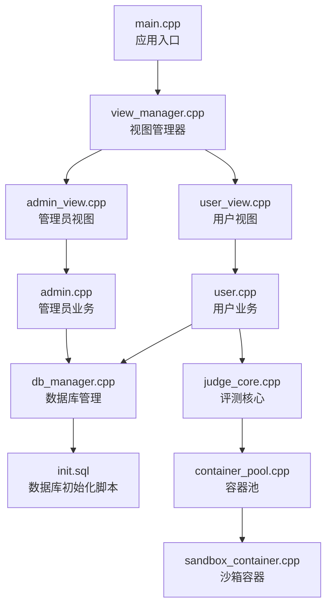
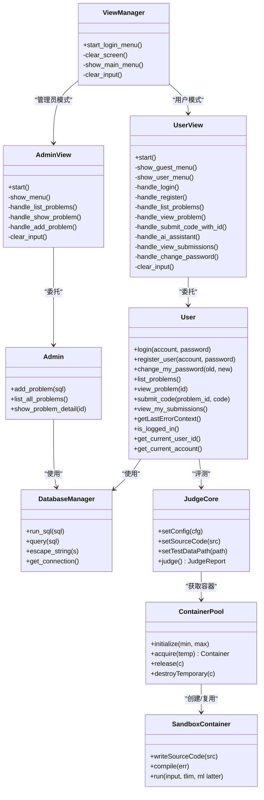
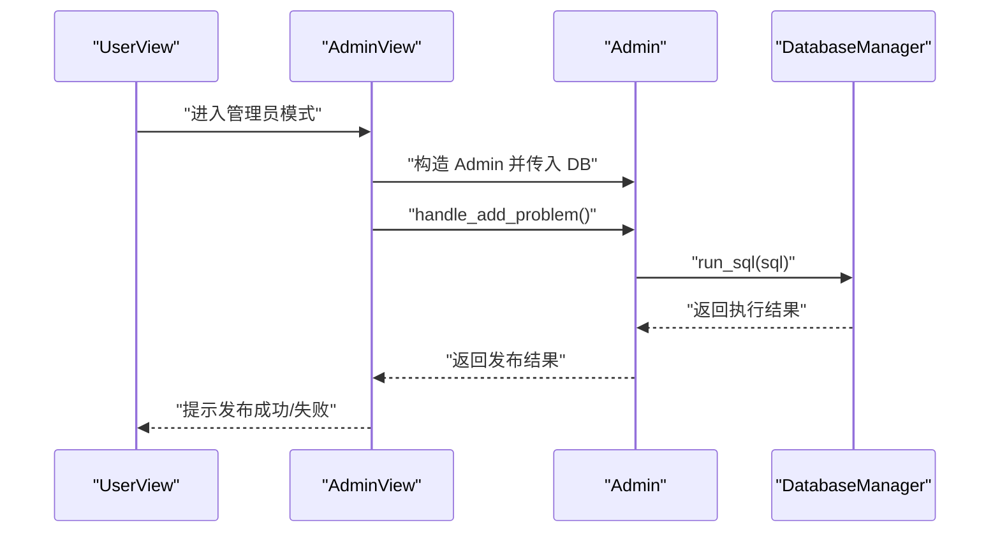
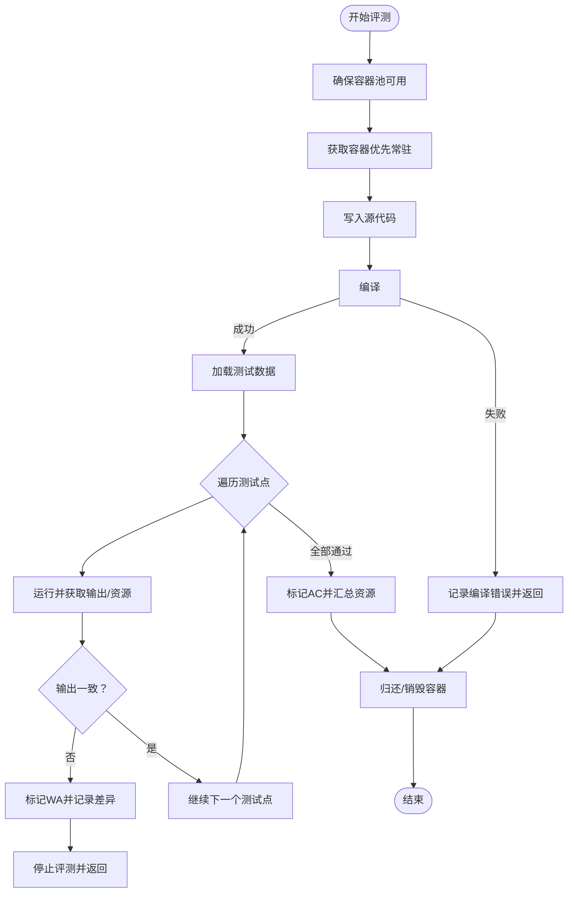
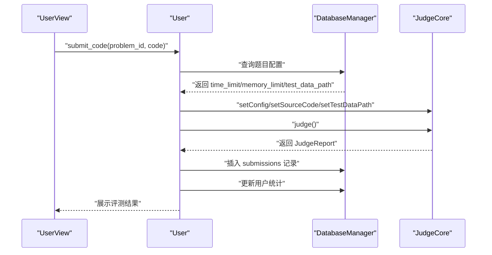
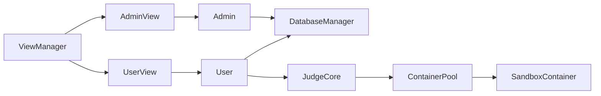

# 题目管理系统

<cite>
**本文引用的文件**
- [src/main.cpp](file://src/main.cpp)
- [src/view_manager.cpp](file://src/view_manager.cpp)
- [include/view_manager.h](file://include/view_manager.h)
- [src/admin_view.cpp](file://src/admin_view.cpp)
- [include/admin_view.h](file://include/admin_view.h)
- [src/admin.cpp](file://src/admin.cpp)
- [include/admin.h](file://include/admin.h)
- [src/user_view.cpp](file://src/user_view.cpp)
- [include/user_view.h](file://include/user_view.h)
- [src/user.cpp](file://src/user.cpp)
- [include/user.h](file://include/user.h)
- [src/db_manager.cpp](file://src/db_manager.cpp)
- [include/db_manager.h](file://include/db_manager.h)
- [init.sql](file://init.sql)
- [src/judge_core.cpp](file://src/judge_core.cpp)
- [include/judge_core.h](file://include/judge_core.h)
- [src/container_pool.cpp](file://src/container_pool.cpp)
- [include/container_pool.h](file://include/container_pool.h)
- [src/sandbox_container.cpp](file://src/sandbox_container.cpp)
- [include/sandbox_container.h](file://include/sandbox_container.h)
- [src/ai_client.cpp](file://src/ai_client.cpp)
- [include/ai_client.h](file://include/ai_client.h)
- [src/app_context.cpp](file://src/app_context.cpp)
- [include/app_context.h](file://include/app_context.h)
- [CMakeLists.txt](file://CMakeLists.txt)
- [docker-compose.yml](file://docker-compose.yml)
- [docker-entrypoint.sh](file://docker-entrypoint.sh)
- [judge-sandbox/Dockerfile](file://judge-sandbox/Dockerfile)
</cite>

## 目录
1. [简介](#简介)
2. [项目结构](#项目结构)
3. [核心组件](#核心组件)
4. [架构总览](#架构总览)
5. [详细组件分析](#详细组件分析)
6. [依赖关系分析](#依赖关系分析)
7. [性能考虑](#性能考虑)
8. [故障排查指南](#故障排查指南)
9. [结论](#结论)
10. [附录](#附录)

## 简介
本系统是一个基于命令行的在线判题平台，支持管理员发布题目、用户浏览题目与提交代码评测、查看个人提交记录等功能。系统采用 C++ 实现，数据库使用 MySQL，评测核心基于 Docker 容器沙箱隔离执行，确保安全性与稳定性。测试数据按固定命名规则组织在宿主机目录中，评测时由 JudgeCore 逐点加载并比对输出。

## 项目结构
项目采用分层与职责分离的设计，主要分为以下层次：
- 应用入口层：main.cpp 启动 ViewManager，引导用户进入管理员或用户模式。
- 视图管理层：ViewManager 统一调度登录菜单与角色切换。
- 视图层：AdminView、UserView 负责各角色的交互菜单与输入处理。
- 业务层：Admin、User 封装管理员与用户的核心业务逻辑。
- 数据访问层：DatabaseManager 封装数据库连接与 SQL 执行。
- 评测层：JudgeCore 负责编译、运行、资源监控与结果判定，依赖 ContainerPool 与 SandboxContainer。
- 辅助模块：AI 客户端、应用上下文、颜色代码等。

图表来源
- [src/main.cpp:1-14](file://src/main.cpp#L1-L14)
- [src/view_manager.cpp:1-78](file://src/view_manager.cpp#L1-L78)
- [src/admin_view.cpp:1-138](file://src/admin_view.cpp#L1-L138)
- [src/admin.cpp:1-133](file://src/admin.cpp#L1-L133)
- [src/user_view.cpp](file://src/user_view.cpp)
- [src/user.cpp:1-514](file://src/user.cpp#L1-L514)
- [src/db_manager.cpp:1-108](file://src/db_manager.cpp#L1-L108)
- [src/judge_core.cpp:1-202](file://src/judge_core.cpp#L1-L202)
- [src/container_pool.cpp](file://src/container_pool.cpp)
- [src/sandbox_container.cpp](file://src/sandbox_container.cpp)
- [init.sql:1-278](file://init.sql#L1-L278)

章节来源
- [src/main.cpp:1-14](file://src/main.cpp#L1-L14)
- [src/view_manager.cpp:1-78](file://src/view_manager.cpp#L1-L78)
- [src/admin_view.cpp:1-138](file://src/admin_view.cpp#L1-L138)
- [src/user_view.cpp](file://src/user_view.cpp)
- [src/admin.cpp:1-133](file://src/admin.cpp#L1-L133)
- [src/user.cpp:1-514](file://src/user.cpp#L1-L514)
- [src/db_manager.cpp:1-108](file://src/db_manager.cpp#L1-L108)
- [src/judge_core.cpp:1-202](file://src/judge_core.cpp#L1-L202)
- [init.sql:1-278](file://init.sql#L1-L278)

## 核心组件
- 数据库管理器 DatabaseManager：封装 MySQL 连接、SQL 执行、查询结果解析与字符串转义，提供统一的数据访问接口。
- 管理员 Admin：提供发布题目（执行 SQL）、列出题目、查看题目详情等能力。
- 用户 User：提供登录、注册、改密、查看题目列表与详情、提交代码评测、查看个人提交记录等能力。
- 评测核心 JudgeCore：基于容器池与沙箱容器实现编译、运行、资源监控与结果判定，支持多测试点逐点评测。
- 视图管理与交互：ViewManager、AdminView、UserView 负责菜单展示、输入处理与流程控制。
- 应用上下文 AppContext：负责根据角色创建合适的数据库连接（含权限隔离）。
- AI 客户端 AIClient：为用户提供错误上下文分析与辅助提示（预留）。

章节来源
- [include/db_manager.h:1-51](file://include/db_manager.h#L1-L51)
- [src/db_manager.cpp:1-108](file://src/db_manager.cpp#L1-L108)
- [include/admin.h:1-32](file://include/admin.h#L1-L32)
- [src/admin.cpp:1-133](file://src/admin.cpp#L1-L133)
- [include/user.h:1-80](file://include/user.h#L1-L80)
- [src/user.cpp:1-514](file://src/user.cpp#L1-L514)
- [include/judge_core.h:1-104](file://include/judge_core.h#L1-L104)
- [src/judge_core.cpp:1-202](file://src/judge_core.cpp#L1-L202)
- [include/view_manager.h:1-34](file://include/view_manager.h#L1-L34)
- [src/view_manager.cpp:1-78](file://src/view_manager.cpp#L1-L78)
- [include/admin_view.h:1-43](file://include/admin_view.h#L1-L43)
- [src/admin_view.cpp:1-138](file://src/admin_view.cpp#L1-L138)
- [include/user_view.h:1-68](file://include/user_view.h#L1-L68)
- [src/app_context.cpp](file://src/app_context.cpp)
- [include/app_context.h](file://include/app_context.h)
- [include/ai_client.h](file://include/ai_client.h)
- [src/ai_client.cpp](file://src/ai_client.cpp)

## 架构总览
系统采用“视图-业务-数据访问-评测”分层架构，职责清晰、耦合度低。管理员与用户通过各自的视图层进入系统，业务层通过 DatabaseManager 访问数据库，用户提交代码后由 JudgeCore 调用容器池与沙箱容器完成评测，并将结果持久化到数据库。

图表来源
- [include/view_manager.h:1-34](file://include/view_manager.h#L1-L34)
- [src/view_manager.cpp:1-78](file://src/view_manager.cpp#L1-L78)
- [include/admin_view.h:1-43](file://include/admin_view.h#L1-L43)
- [src/admin_view.cpp:1-138](file://src/admin_view.cpp#L1-L138)
- [include/user_view.h:1-68](file://include/user_view.h#L1-L68)
- [src/user_view.cpp](file://src/user_view.cpp)
- [include/admin.h:1-32](file://include/admin.h#L1-L32)
- [src/admin.cpp:1-133](file://src/admin.cpp#L1-L133)
- [include/user.h:1-80](file://include/user.h#L1-L80)
- [src/user.cpp:1-514](file://src/user.cpp#L1-L514)
- [include/db_manager.h:1-51](file://include/db_manager.h#L1-L51)
- [src/db_manager.cpp:1-108](file://src/db_manager.cpp#L1-L108)
- [include/judge_core.h:1-104](file://include/judge_core.h#L1-L104)
- [src/judge_core.cpp:1-202](file://src/judge_core.cpp#L1-L202)
- [include/container_pool.h](file://include/container_pool.h)
- [src/container_pool.cpp](file://src/container_pool.cpp)
- [include/sandbox_container.h](file://include/sandbox_container.h)
- [src/sandbox_container.cpp](file://src/sandbox_container.cpp)

## 详细组件分析

### 数据模型与存储结构
- 数据库初始化脚本 init.sql 定义了三大核心表：
  - problems：题目元数据（id、title、description、time_limit、memory_limit、test_data_path、category）。
  - users：平台用户（id、account、password_hash、submission_count、solved_count、created_at、last_login）。
  - submissions：提交记录（id、user_id、problem_id、code、status、submit_time），并建立外键约束与索引。
- 数据库用户权限：
  - oj_admin：全权限，用于管理员操作。
  - oj_user：受限权限，仅授予对 problems（只读）、users（CRUD 自己）、submissions（CRUD 自己）的权限，配合应用层行级隔离实现安全访问。

章节来源
- [init.sql:14-61](file://init.sql#L14-L61)
- [init.sql:68-95](file://init.sql#L68-L95)
- [init.sql:97-278](file://init.sql#L97-L278)

### 查询机制与数据访问
- DatabaseManager 提供：
  - run_sql：执行非查询语句并返回布尔结果。
  - query：执行查询语句并返回行集合（每行以列名为键的映射）。
  - escape_string：对字符串进行 SQL 转义，降低注入风险。
- User 与 Admin 的查询均通过 DatabaseManager 完成，遵循最小暴露原则，避免直接操作底层连接。

章节来源
- [include/db_manager.h:10-51](file://include/db_manager.h#L10-L51)
- [src/db_manager.cpp:22-85](file://src/db_manager.cpp#L22-L85)
- [src/admin.cpp:17-133](file://src/admin.cpp#L17-L133)
- [src/user.cpp:144-267](file://src/user.cpp#L144-L267)

### 题目发布流程
- 管理员通过 AdminView 进入发布菜单，输入完整 SQL 语句，由 Admin 调用 DatabaseManager.run_sql 执行。
- 发布成功后，题目信息写入 problems 表，后续用户可在题目列表中看到新增题目。

图表来源
- [src/admin_view.cpp:112-131](file://src/admin_view.cpp#L112-L131)
- [src/admin.cpp:10-15](file://src/admin.cpp#L10-L15)
- [src/db_manager.cpp:22-43](file://src/db_manager.cpp#L22-L43)

章节来源
- [src/admin_view.cpp:112-131](file://src/admin_view.cpp#L112-L131)
- [src/admin.cpp:10-15](file://src/admin.cpp#L10-L15)
- [src/db_manager.cpp:22-43](file://src/db_manager.cpp#L22-L43)

### 内容管理与浏览机制
- 管理员与用户均可查看题目列表与详情：
  - Admin::list_all_problems 与 User::list_problems 均通过 DatabaseManager.query 获取数据，并进行终端宽度适配与标题截断，确保中文显示正确。
  - Admin::show_problem_detail 与 User::view_problem 展示题目详情，包含时间/内存限制与描述。
- 排序：查询按 id 升序排列，便于稳定浏览。

章节来源
- [src/admin.cpp:17-133](file://src/admin.cpp#L17-L133)
- [src/user.cpp:144-267](file://src/user.cpp#L144-L267)

### 测试数据组织与验证机制
- 测试数据组织：
  - 每个题目对应一个宿主机目录，命名为 data/<pid>，包含若干编号连续的 .in/.out 文件对。
  - JudgeCore::Impl::loadTestCases 会按顺序读取 1.in/1.out 至 100.in/100.out，构建测试用例集合。
- 验证机制：
  - 评测阶段逐点运行，比较用户输出与期望输出（忽略行尾空白）。
  - 若任一测试点失败，立即停止并记录失败类型（WA/TLE/MLE/RE/CE）与资源使用情况。
  - 评测报告包含总体结果、通过数量、时间与内存使用、以及每个测试点的详细信息。

图表来源
- [src/judge_core.cpp:85-201](file://src/judge_core.cpp#L85-L201)
- [src/judge_core.cpp:38-74](file://src/judge_core.cpp#L38-L74)

章节来源
- [src/judge_core.cpp:38-74](file://src/judge_core.cpp#L38-L74)
- [src/judge_core.cpp:85-201](file://src/judge_core.cpp#L85-L201)

### 提交与评测流程
- 用户提交代码后，系统：
  1) 读取题目配置（时间/内存限制与测试数据路径）。
  2) 初始化 JudgeCore，设置配置、源码与测试数据路径。
  3) 执行评测，生成 JudgeReport。
  4) 构建错误上下文（供 AI 使用）。
  5) 写入 submissions 表并更新用户统计（首次 AC 同步更新 solved_count）。
  6) 展示评测结果与统计信息。

图表来源
- [src/user.cpp:269-452](file://src/user.cpp#L269-L452)
- [src/judge_core.cpp:78-92](file://src/judge_core.cpp#L78-L92)
- [src/db_manager.cpp:22-43](file://src/db_manager.cpp#L22-L43)

章节来源
- [src/user.cpp:269-452](file://src/user.cpp#L269-L452)
- [src/judge_core.cpp:78-92](file://src/judge_core.cpp#L78-L92)
- [src/db_manager.cpp:22-43](file://src/db_manager.cpp#L22-L43)

### 用户界面功能（浏览、搜索、排序）
- 浏览与排序：
  - 题目列表按 id 升序展示，标题与知识点对齐显示，中文宽度适配与截断处理。
- 搜索过滤：
  - 当前实现未提供基于关键词的搜索过滤，可通过扩展在查询层增加 LIKE 条件或引入全文索引。
- 排序显示：
  - 通过 ORDER BY id 实现稳定排序；如需按其他字段排序，可在查询层调整。

章节来源
- [src/admin.cpp:17-133](file://src/admin.cpp#L17-L133)
- [src/user.cpp:144-267](file://src/user.cpp#L144-L267)

### API 接口说明（面向角色的业务接口）
- 管理员接口
  - add_problem(sql)：执行 SQL 发布题目。
  - list_all_problems()：列出所有题目（ID、标题、分类、时间/内存限制）。
  - show_problem_detail(id)：查看指定题目详情。
- 用户接口
  - login(account, password)：登录并更新最后登录时间。
  - register_user(account, password)：注册新用户。
  - change_my_password(old, new)：修改密码。
  - list_problems()：查看题目列表。
  - view_problem(id)：查看题目详情。
  - submit_code(problem_id, code)：提交代码评测并写入记录。
  - view_my_submissions()：查看个人最近 20 条提交记录。
- 数据访问接口
  - run_sql(sql)：执行非查询语句。
  - query(sql)：执行查询并返回结果集。
  - escape_string(s)：字符串转义。

章节来源
- [include/admin.h:8-32](file://include/admin.h#L8-L32)
- [src/admin.cpp:10-133](file://src/admin.cpp#L10-L133)
- [include/user.h:9-80](file://include/user.h#L9-L80)
- [src/user.cpp:40-514](file://src/user.cpp#L40-L514)
- [include/db_manager.h:10-51](file://include/db_manager.h#L10-L51)
- [src/db_manager.cpp:22-85](file://src/db_manager.cpp#L22-L85)

### 扩展性设计
- PIMPL 模式：JudgeCore 使用私有 Impl 类隐藏实现细节，便于替换评测引擎或扩展功能。
- 容器池：ContainerPool 支持常驻与临时容器，提升并发与响应性能。
- 角色权限：通过数据库用户与应用层行级隔离实现权限控制，便于扩展审计与细粒度授权。
- 模块解耦：视图层、业务层、数据访问层职责清晰，便于独立演进与测试。

章节来源
- [include/judge_core.h:94-101](file://include/judge_core.h#L94-L101)
- [src/judge_core.cpp:12-28](file://src/judge_core.cpp#L12-L28)
- [include/container_pool.h](file://include/container_pool.h)
- [src/container_pool.cpp](file://src/container_pool.cpp)

## 依赖关系分析
- 组件耦合：
  - Admin 与 User 均依赖 DatabaseManager，形成稳定的向下依赖。
  - User 依赖 JudgeCore 完成评测，JudgeCore 依赖 ContainerPool 与 SandboxContainer。
  - 视图层通过 AppContext 获取数据库连接，实现角色与权限的解耦。
- 外部依赖：
  - MySQL：提供持久化存储与权限控制。
  - Docker：提供评测沙箱隔离。
  - OpenSSL：用于 SHA256 密码哈希。
- 循环依赖：未发现循环依赖，整体呈树形依赖结构。

图表来源
- [src/admin_view.cpp](file://src/admin_view.cpp)
- [src/admin.cpp](file://src/admin.cpp)
- [src/user_view.cpp](file://src/user_view.cpp)
- [src/user.cpp:1-514](file://src/user.cpp#L1-L514)
- [src/judge_core.cpp:1-202](file://src/judge_core.cpp#L1-L202)
- [src/container_pool.cpp](file://src/container_pool.cpp)
- [src/sandbox_container.cpp](file://src/sandbox_container.cpp)
- [src/view_manager.cpp:1-78](file://src/view_manager.cpp#L1-L78)

章节来源
- [src/admin_view.cpp](file://src/admin_view.cpp)
- [src/admin.cpp](file://src/admin.cpp)
- [src/user_view.cpp](file://src/user_view.cpp)
- [src/user.cpp:1-514](file://src/user.cpp#L1-L514)
- [src/judge_core.cpp:1-202](file://src/judge_core.cpp#L1-L202)
- [src/container_pool.cpp](file://src/container_pool.cpp)
- [src/sandbox_container.cpp](file://src/sandbox_container.cpp)
- [src/view_manager.cpp:1-78](file://src/view_manager.cpp#L1-L78)

## 性能考虑
- 容器池预热：ContainerPool 在首次评测时惰性初始化，常驻容器减少启动延迟。
- 并发控制：最大并发容器数量限制，避免资源争用导致的抖动。
- I/O 优化：测试数据按顺序读取，避免随机访问；输出比对忽略行尾空白，减少误判。
- 数据库索引：users、submissions 表对高频查询字段建立索引，提升查询效率。
- 建议：
  - 引入连接池与超时重试，提升数据库稳定性。
  - 对频繁查询的题目列表增加缓存层，降低数据库压力。
  - 评测日志分级与采样上报，便于性能分析。

[本节为通用建议，无需特定文件引用]

## 故障排查指南
- 数据库连接失败
  - 检查 init.sql 中数据库用户权限与 AppContext 的连接参数。
  - 确认 oj_user 权限是否正确授予（problems 只读、users/submissions CRUD 自己）。
- 评测失败
  - 检查 test_data_path 是否存在且包含合法的 .in/.out 文件对。
  - 确认 Docker 可用且 judge-sandbox/Dockerfile 正常构建。
  - 查看 JudgeReport.error_message 获取编译/运行错误详情。
- 登录/注册异常
  - 确认密码哈希是否使用 SHA256，数据库中存储的是哈希值。
  - 检查账号是否重复，查询 users 表确认是否存在。
- 权限不足
  - 管理员操作需使用 oj_admin 账号；普通用户操作需使用 oj_user 并遵循行级隔离。

章节来源
- [init.sql:68-95](file://init.sql#L68-L95)
- [src/user.cpp:40-102](file://src/user.cpp#L40-L102)
- [src/judge_core.cpp:90-139](file://src/judge_core.cpp#L90-L139)
- [src/db_manager.cpp:89-107](file://src/db_manager.cpp#L89-L107)

## 结论
本系统以清晰的分层架构实现了题目管理与评测的核心能力，具备良好的扩展性与安全性。通过容器化沙箱与严格的权限控制，保障了评测的隔离与数据的一致性。未来可在搜索过滤、缓存与日志分析等方面进一步优化，以提升用户体验与系统性能。

[本节为总结性内容，无需特定文件引用]

## 附录

### 数据库初始化与示例数据
- 初始化脚本包含数据库创建、表结构定义、权限授予与示例数据插入，便于快速部署与演示。
- 示例题目覆盖多种算法类型，测试数据位于 data/<pid> 目录。

章节来源
- [init.sql:8-278](file://init.sql#L8-L278)

### Docker 与评测沙箱
- judge-sandbox/Dockerfile 定义评测容器镜像，ContainerPool 与 SandboxContainer 负责生命周期管理与执行隔离。

章节来源
- [judge-sandbox/Dockerfile](file://judge-sandbox/Dockerfile)
- [src/container_pool.cpp](file://src/container_pool.cpp)
- [src/sandbox_container.cpp](file://src/sandbox_container.cpp)

### 构建与运行
- CMakeLists.txt 管理编译配置，docker-compose.yml 提供容器化部署入口，docker-entrypoint.sh 作为容器启动脚本。

章节来源
- [CMakeLists.txt](file://CMakeLists.txt)
- [docker-compose.yml](file://docker-compose.yml)
- [docker-entrypoint.sh](file://docker-entrypoint.sh)