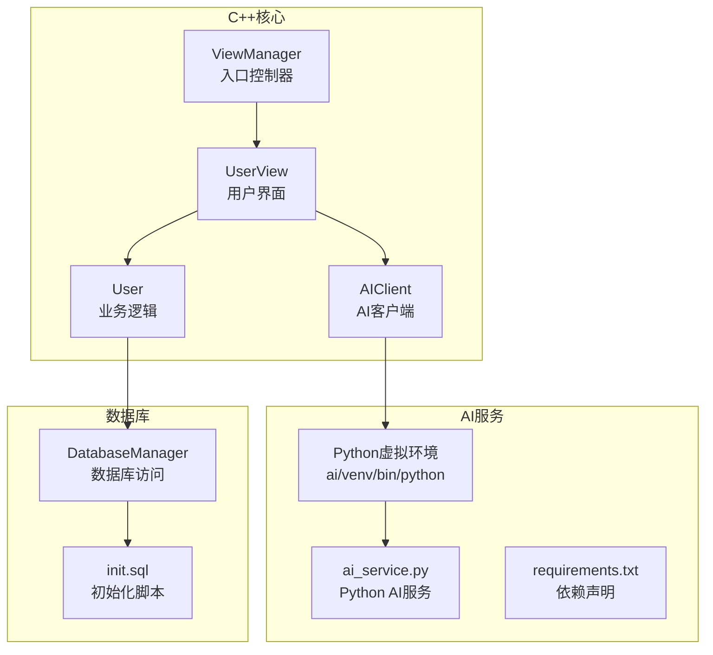
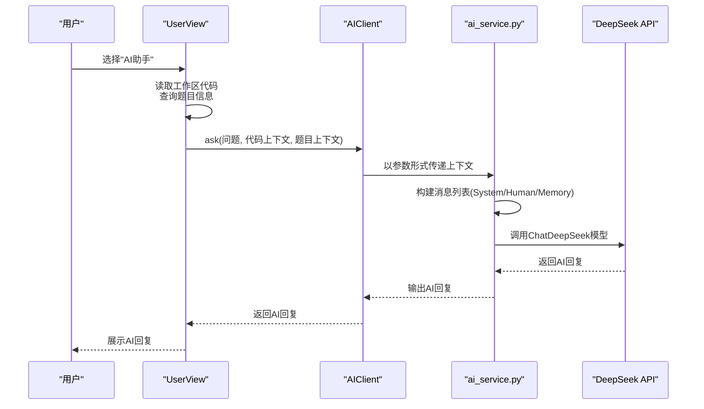
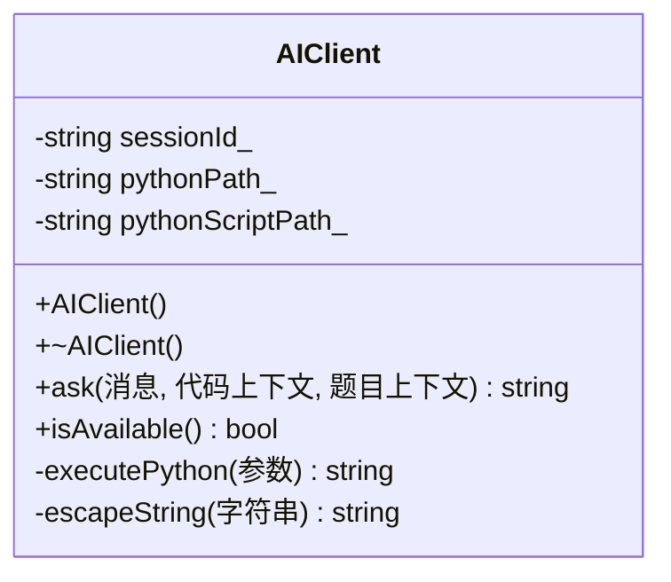
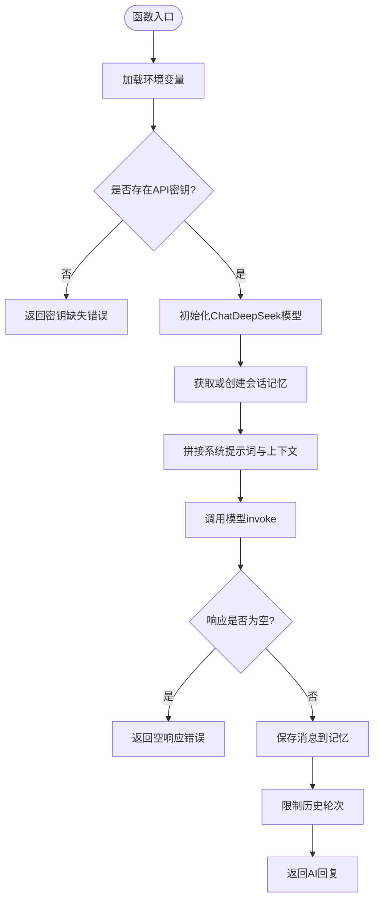
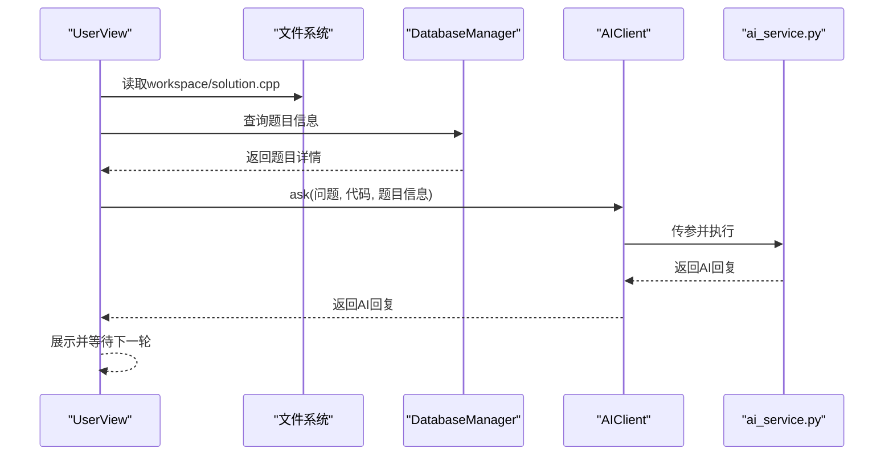
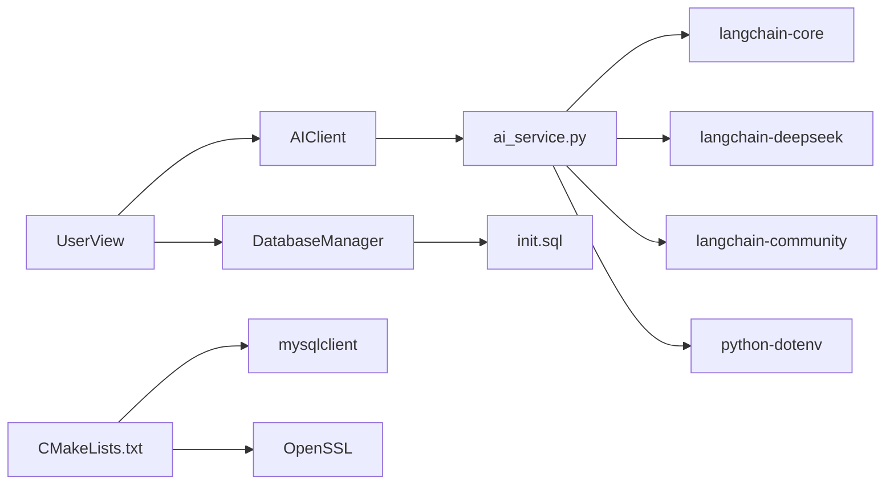

# AI辅助学习系统

<cite>
**本文引用的文件**
- [ai_service.py](file://ai/ai_service.py)
- [requirements.txt](file://ai/requirements.txt)
- [ai_client.h](file://include/ai_client.h)
- [ai_client.cpp](file://src/ai_client.cpp)
- [user_view.h](file://include/user_view.h)
- [user_view.cpp](file://src/user_view.cpp)
- [user.h](file://include/user.h)
- [code_submission_design.md](file://docs/code_submission_design.md)
- [CMakeLists.txt](file://CMakeLists.txt)
- [setup.sh](file://setup.sh)
- [init.sql](file://init.sql)
- [main.cpp](file://src/main.cpp)
- [view_manager.h](file://include/view_manager.h)
</cite>

## 目录
1. [简介](#简介)
2. [项目结构](#项目结构)
3. [核心组件](#核心组件)
4. [架构总览](#架构总览)
5. [组件详解](#组件详解)
6. [依赖关系分析](#依赖关系分析)
7. [性能考量](#性能考量)
8. [故障排查指南](#故障排查指南)
9. [结论](#结论)
10. [附录](#附录)

## 简介
本文件为OJ系统的AI辅助学习功能提供综合技术文档，重点覆盖以下方面：
- Python AI服务的架构设计：LangChain框架集成与DeepSeek API调用机制
- AIClient的C++与Python交互实现：进程通信、数据序列化与错误处理
- AI服务在代码提交流程中的集成：工作区文件管理、历史代码追踪与上下文感知问答
- 配置选项、性能优化与扩展方案
- 部署与维护指南，以及与核心系统的集成测试方法

## 项目结构
OJ系统采用C++为主、Python为AI服务的混合架构。AI服务位于ai/目录，核心交互通过AIClient在C++侧发起，Python侧通过命令行参数接收上下文并调用DeepSeek API。

图表来源
- [main.cpp:1-13](file://src/main.cpp#L1-L13)
- [view_manager.h:1-42](file://include/view_manager.h#L1-L42)
- [user_view.h:1-91](file://include/user_view.h#L1-L91)
- [user.h:1-89](file://include/user.h#L1-L89)
- [ai_client.h:1-28](file://include/ai_client.h#L1-L28)
- [ai_client.cpp:1-124](file://src/ai_client.cpp#L1-L124)
- [ai_service.py:1-113](file://ai/ai_service.py#L1-L113)
- [requirements.txt:1-7](file://ai/requirements.txt#L1-L7)
- [init.sql:1-278](file://init.sql#L1-L278)

章节来源
- [CMakeLists.txt:1-40](file://CMakeLists.txt#L1-L40)
- [setup.sh:1-41](file://setup.sh#L1-L41)

## 核心组件
- AIClient：封装与Python AI服务的进程通信，负责参数构造、转义与执行结果处理
- ai_service.py：基于LangChain与DeepSeek的Python服务，负责系统提示词、消息历史与API调用
- UserView：在用户交互流程中触发AI请求，整合工作区代码与题目上下文
- DatabaseManager：提供数据库访问能力，支持AI上下文所需的题目与提交信息查询
- requirements.txt：声明Python端依赖，确保LangChain生态与DeepSeek适配器可用

章节来源
- [ai_client.h:1-28](file://include/ai_client.h#L1-L28)
- [ai_client.cpp:1-124](file://src/ai_client.cpp#L1-L124)
- [ai_service.py:1-113](file://ai/ai_service.py#L1-L113)
- [requirements.txt:1-7](file://ai/requirements.txt#L1-L7)
- [user_view.h:1-91](file://include/user_view.h#L1-L91)
- [user_view.cpp:290-354](file://src/user_view.cpp#L290-L354)
- [user.h:1-89](file://include/user.h#L1-L89)

## 架构总览
AI辅助学习的端到端流程如下：
- 用户在题目详情页选择“AI助手”
- C++侧读取工作区代码，查询题目信息，构造上下文
- 通过AIClient以命令行参数调用Python AI服务
- Python服务加载系统提示词与消息历史，调用DeepSeek API
- 返回结果经C++侧展示，形成多轮对话

图表来源
- [user_view.cpp:290-354](file://src/user_view.cpp#L290-L354)
- [ai_client.cpp:85-112](file://src/ai_client.cpp#L85-L112)
- [ai_service.py:40-91](file://ai/ai_service.py#L40-L91)

## 组件详解

### AIClient：C++与Python交互
- 进程通信：通过标准库的进程执行接口启动Python解释器，传入参数并捕获输出
- 数据序列化：将字符串参数进行转义，避免特殊字符破坏命令行解析
- 错误处理：对Python解释器启动失败、空响应、异常进行分类处理并返回可读错误信息
- 可用性检测：检查Python解释器与脚本文件是否存在，保障AI服务可用

图表来源
- [ai_client.h:6-25](file://include/ai_client.h#L6-L25)
- [ai_client.cpp:8-25](file://src/ai_client.cpp#L8-L25)

章节来源
- [ai_client.cpp:56-83](file://src/ai_client.cpp#L56-L83)
- [ai_client.cpp:85-112](file://src/ai_client.cpp#L85-L112)
- [ai_client.cpp:114-123](file://src/ai_client.cpp#L114-L123)

### Python AI服务：LangChain与DeepSeek集成
- 系统提示词：采用“严师”模式，强调引导而非直接给答案，限定返回内容长度
- 会话记忆：基于消息历史对象维护上下文，限制历史轮次以控制成本
- API调用：通过DeepSeek适配器调用模型，处理空响应与异常并输出到标准错误便于调试
- 命令行入口：解析参数，构建消息列表并返回AI回复

图表来源
- [ai_service.py:40-91](file://ai/ai_service.py#L40-L91)

章节来源
- [ai_service.py:18-27](file://ai/ai_service.py#L18-L27)
- [ai_service.py:33-37](file://ai/ai_service.py#L33-L37)
- [ai_service.py:46-91](file://ai/ai_service.py#L46-L91)

### 用户交互与上下文整合
- 工作区文件：统一在workspace/solution.cpp中编辑，提交时读取并持久化到数据库
- 题目上下文：从数据库查询题目信息，拼装为结构化字符串传给AI
- AI对话：支持多轮对话，空输入忽略，退出条件为“0”或“/quit”

图表来源
- [user_view.cpp:303-350](file://src/user_view.cpp#L303-L350)
- [user_view.cpp:290-354](file://src/user_view.cpp#L290-L354)

章节来源
- [user_view.cpp:290-354](file://src/user_view.cpp#L290-L354)
- [code_submission_design.md:131-211](file://docs/code_submission_design.md#L131-L211)

### 数据库与权限
- 初始化脚本：创建数据库、表与用户，授予oj_user对problems与submissions的受限权限
- 查询接口：AI上下文所需的数据通过C++侧查询，避免Python直连数据库

章节来源
- [init.sql:14-61](file://init.sql#L14-L61)
- [init.sql:68-95](file://init.sql#L68-L95)
- [code_submission_design.md:258-279](file://docs/code_submission_design.md#L258-L279)

## 依赖关系分析
- C++侧依赖
  - CMakeLists声明MySQL与OpenSSL依赖，确保数据库与安全通信能力
  - AIClient依赖Python解释器与ai_service.py脚本
- Python侧依赖
  - requirements.txt声明dotenv、langchain系列与langchain-deepseek等包
- 运行时路径
  - AIClient优先查找ai/venv/bin/python与ai/ai_service.py，若不存在则回退到上级目录

图表来源
- [CMakeLists.txt:11-34](file://CMakeLists.txt#L11-L34)
- [requirements.txt:1-7](file://ai/requirements.txt#L1-L7)
- [ai_client.cpp:8-23](file://src/ai_client.cpp#L8-L23)
- [ai_service.py:6-16](file://ai/ai_service.py#L6-L16)
- [init.sql:68-95](file://init.sql#L68-L95)

章节来源
- [CMakeLists.txt:11-34](file://CMakeLists.txt#L11-L34)
- [requirements.txt:1-7](file://ai/requirements.txt#L1-L7)
- [ai_client.cpp:8-23](file://src/ai_client.cpp#L8-L23)

## 性能考量
- 会话记忆轮次限制：Python侧限制消息历史长度，降低Token消耗与延迟
- 响应空值处理：避免重复调用与无效渲染
- 命令行参数转义：减少解析错误导致的重试
- 依赖精简：仅引入必要LangChain模块，避免不必要的开销
- 并发与超时：当前实现为同步阻塞，后续可考虑线程池与超时控制

## 故障排查指南
- Python解释器不可用
  - 症状：返回“无法执行AI服务”
  - 排查：确认ai/venv/bin/python与ai/ai_service.py路径存在
- API密钥缺失
  - 症状：返回“未设置DEEPSEEK_API_KEY”
  - 排查：检查环境变量是否正确加载
- 空响应
  - 症状：返回“AI返回空响应，请检查网络连接或API Key配置”
  - 排查：检查网络、API配额与模型可用性
- 数据库权限不足
  - 症状：查询题目信息失败
  - 排查：确认oj_user具备对problems与submissions的查询权限
- 工作区文件异常
  - 症状：AI未携带代码上下文
  - 排查：确认workspace/solution.cpp存在且可读

章节来源
- [ai_client.cpp:67-70](file://src/ai_client.cpp#L67-L70)
- [ai_service.py:42-44](file://ai/ai_service.py#L42-L44)
- [ai_service.py:72-73](file://ai/ai_service.py#L72-L73)
- [init.sql:84-92](file://init.sql#L84-L92)
- [user_view.cpp:303-304](file://src/user_view.cpp#L303-L304)

## 结论
本AI辅助学习系统通过清晰的分层设计实现了C++前端与Python AI服务的稳定协作：AIClient负责进程通信与参数转义，Python侧基于LangChain与DeepSeek提供可控的“严师”式指导；结合工作区文件与数据库上下文，形成上下文感知的问答体验。后续可在并发、缓存与日志方面进一步优化，并完善集成测试覆盖。

## 附录

### 部署与维护
- 一键部署脚本：setup.sh负责创建目录、初始化数据库与提示编译步骤
- CMake配置：声明MySQL与OpenSSL依赖，确保编译链路完整
- Python依赖：requirements.txt明确LangChain生态与DeepSeek适配器版本

章节来源
- [setup.sh:1-41](file://setup.sh#L1-L41)
- [CMakeLists.txt:11-34](file://CMakeLists.txt#L11-L34)
- [requirements.txt:1-7](file://ai/requirements.txt#L1-L7)

### 与核心系统的集成测试方法
- 单元测试（C++）
  - Mock AIClient返回固定文本，验证UserView对话流程
  - 模拟文件系统读写，验证工作区代码读取
- 集成测试（Python）
  - 使用pytest与unittest，构造参数与环境变量，验证ai_service.py的响应与异常分支
- 端到端测试
  - 通过UserView菜单驱动，覆盖“AI助手”、“提交代码”、“查看提交记录”等场景
- 数据一致性测试
  - 验证提交记录写入submissions表，历史下载与工作区加载行为

章节来源
- [user_view.cpp:290-354](file://src/user_view.cpp#L290-L354)
- [code_submission_design.md:583-617](file://docs/code_submission_design.md#L583-L617)