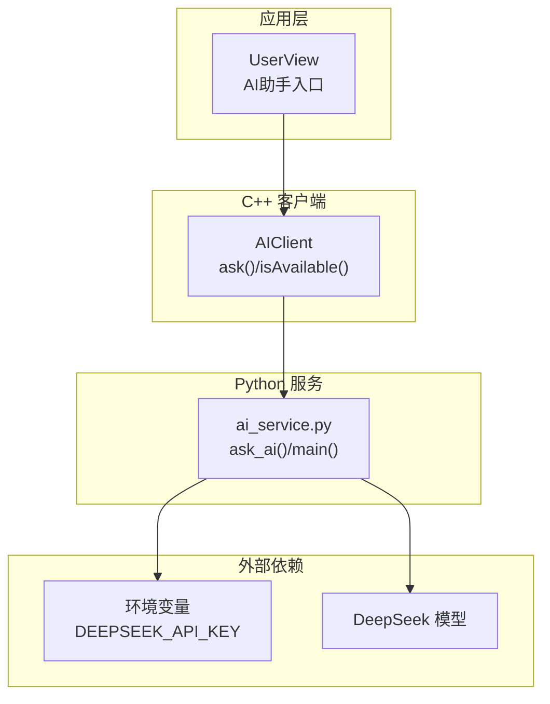
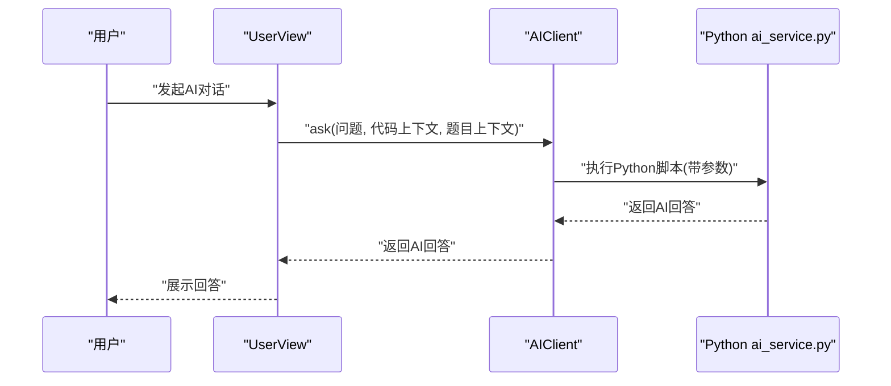
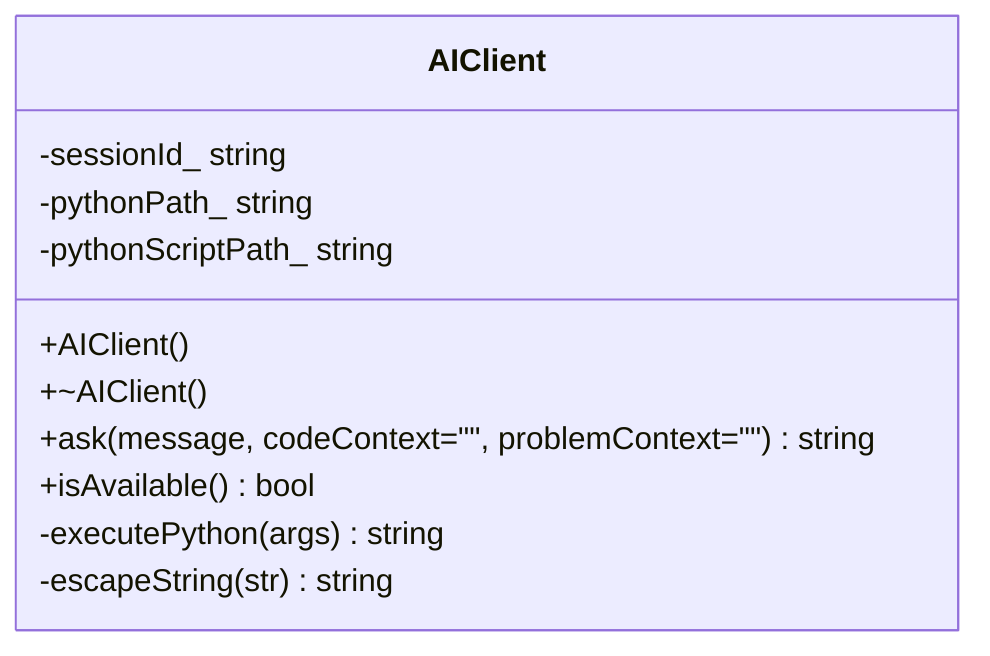
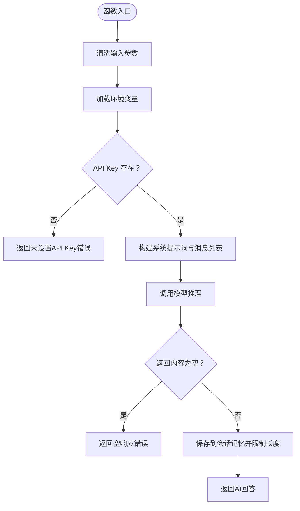
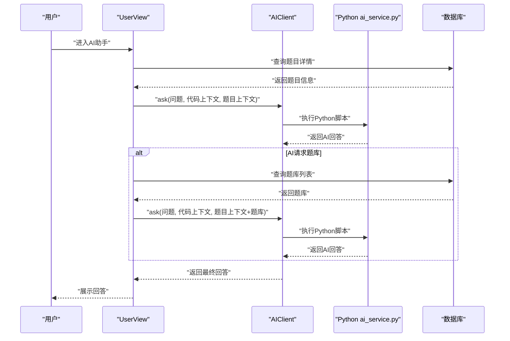
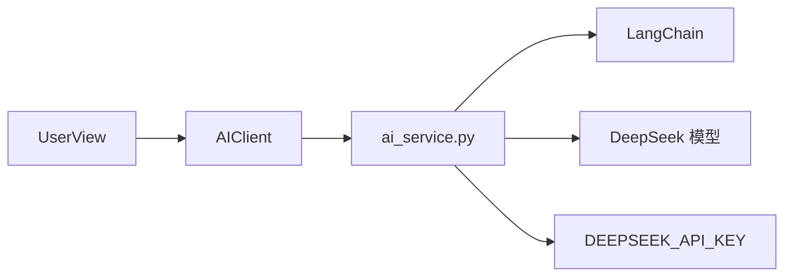

# AI集成技术设计

<cite>
**本文引用的文件**
- [include/ai_client.h](file://include/ai_client.h)
- [src/ai_client.cpp](file://src/ai_client.cpp)
- [ai/ai_service.py](file://ai/ai_service.py)
- [ai/requirements.txt](file://ai/requirements.txt)
- [src/user_view.cpp](file://src/user_view.cpp)
- [CMakeLists.txt](file://CMakeLists.txt)
- [docs/code_submission_design.md](file://docs/code_submission_design.md)
- [setup.sh](file://setup.sh)
</cite>

## 目录
1. [简介](#简介)
2. [项目结构](#项目结构)
3. [核心组件](#核心组件)
4. [架构总览](#架构总览)
5. [详细组件分析](#详细组件分析)
6. [依赖关系分析](#依赖关系分析)
7. [性能考虑](#性能考虑)
8. [故障排查指南](#故障排查指南)
9. [结论](#结论)
10. [附录](#附录)

## 简介
本文件面向OJ在线评测系统的AI集成模块，系统性阐述AI客户端（AIClient）的设计与通信协议，以及与Python AI服务的接口规范与数据交换格式；同时给出服务发现、连接管理与错误处理机制的实现要点，覆盖AI在评测过程中的典型应用场景（代码分析、问题诊断、智能指导）、上下文感知机制（历史记录与会话状态管理）、配置参数与性能调优选项，并提供使用示例、最佳实践与部署维护建议。

## 项目结构
AI集成模块由三层组成：
- C++侧AI客户端封装：负责参数拼装、字符串转义、进程调用与结果解析。
- Python侧AI服务：负责系统提示词、会话记忆、模型调用与上下文构建。
- 应用层集成点：在用户视图中提供AI助手入口，按需加载题库与评测错误上下文。

**图表来源**
- [src/user_view.cpp:290-374](file://src/user_view.cpp#L290-L374)
- [include/ai_client.h:6-25](file://include/ai_client.h#L6-L25)
- [src/ai_client.cpp:85-112](file://src/ai_client.cpp#L85-L112)
- [ai/ai_service.py:46-99](file://ai/ai_service.py#L46-L99)

**章节来源**
- [CMakeLists.txt:1-40](file://CMakeLists.txt#L1-L40)
- [docs/code_submission_design.md:1-618](file://docs/code_submission_design.md#L1-L618)

## 核心组件
- AIClient（C++）
  - 负责构造命令行参数、转义特殊字符、调用Python脚本、解析返回值。
  - 提供会话标识（sessionId_）以支持多轮对话的记忆管理。
  - 提供可用性检测（isAvailable）以判断Python解释器与脚本是否存在。
- Python AI服务（ai_service.py）
  - 使用LangChain与DeepSeek模型，结合系统提示词与会话记忆。
  - 接收命令行参数：message、session、code、problem。
  - 输出AI回答；若需要题库数据则返回特定标记以便前端按需加载。
- 应用层集成（UserView）
  - 读取工作区代码与题目信息，调用AIClient.ask。
  - 对AI返回的“需要题库”标记进行二次请求，拼接题库上下文后再次调用。

**章节来源**
- [include/ai_client.h:6-25](file://include/ai_client.h#L6-L25)
- [src/ai_client.cpp:8-23](file://src/ai_client.cpp#L8-L23)
- [ai/ai_service.py:18-33](file://ai/ai_service.py#L18-L33)
- [src/user_view.cpp:290-374](file://src/user_view.cpp#L290-L374)

## 架构总览
AI集成采用“C++进程内调用Python脚本”的轻量桥接方式，避免直接在C++中引入复杂语言生态，同时保持良好的扩展性与可维护性。

**图表来源**
- [src/user_view.cpp:354-372](file://src/user_view.cpp#L354-L372)
- [src/ai_client.cpp:85-112](file://src/ai_client.cpp#L85-L112)
- [ai/ai_service.py:109-124](file://ai/ai_service.py#L109-L124)

## 详细组件分析

### AIClient类设计与实现
- 设计要点
  - 参数构造：将message、code、problem与sessionId拼装为命令行参数。
  - 字符串转义：对引号、反斜杠、换行、回车、制表符进行转义，保证Shell安全。
  - 进程调用：使用管道捕获标准输出，限制缓冲大小，避免阻塞。
  - 结果处理：去除尾部换行，空结果返回错误提示。
  - 可用性检测：检查Python解释器与脚本文件是否存在。
- 复杂度与性能
  - 时间复杂度近似O(n)，n为输出长度；空间复杂度O(n)。
  - 缓冲区大小固定，适合短文本对话；长文本建议分片或异步化。
- 错误处理
  - 无法打开管道、空结果、异常均返回错误字符串，便于上层统一处理。

**图表来源**
- [include/ai_client.h:6-25](file://include/ai_client.h#L6-L25)
- [src/ai_client.cpp:8-23](file://src/ai_client.cpp#L8-L23)

**章节来源**
- [include/ai_client.h:6-25](file://include/ai_client.h#L6-L25)
- [src/ai_client.cpp:27-83](file://src/ai_client.cpp#L27-L83)

### Python AI服务接口规范与数据交换
- 命令行参数
  - --message：必填，用户问题文本。
  - --session：可选，默认"default"，会话标识。
  - --code：可选，代码上下文。
  - --problem：可选，题目上下文。
- 输入清洗
  - 对message、code、problem进行UTF-8清洗，避免surrogate字符导致的编码异常。
- 系统提示词与角色设定
  - “严师”模式：禁止直接给完整代码，仅允许伪代码或不超过3行核心逻辑片段；通过提问引导思考。
  - 题目推荐能力：当检测到用户表达“推荐题目”意图时，若上下文无题库列表则返回特定标记，触发前端按需加载。
- 会话记忆
  - 使用ChatMessageHistory维护消息历史，限制最多保存约10轮对话（用户+AI各10条）。
- 模型调用与返回
  - 使用DeepSeek模型，temperature与max_tokens预设；返回内容为空时返回错误提示。
- 异常处理
  - 捕获异常并输出到stderr，同时返回统一错误字符串。

**图表来源**
- [ai/ai_service.py:46-99](file://ai/ai_service.py#L46-L99)

**章节来源**
- [ai/ai_service.py:18-33](file://ai/ai_service.py#L18-L33)
- [ai/ai_service.py:46-99](file://ai/ai_service.py#L46-L99)
- [ai/ai_service.py:109-124](file://ai/ai_service.py#L109-L124)

### 应用层集成与上下文感知
- 入口与流程
  - UserView提供AI助手入口，读取工作区代码与题目信息，调用AIClient.ask。
  - 若AI返回“需要题库”标记，则按需查询题库列表并拼接上下文后再次调用。
- 上下文构建
  - 代码上下文：来自工作区文件。
  - 题目上下文：来自数据库查询，包含题号、标题、描述、时间/内存限制。
  - 评测错误上下文：来自用户最近一次评测失败的诊断信息。
- 会话状态管理
  - AIClient默认sessionId为"default"，可在构造时或通过扩展参数调整。
  - Python侧以session_id为键维护ChatMessageHistory，实现跨轮对话的记忆。

**图表来源**
- [src/user_view.cpp:290-374](file://src/user_view.cpp#L290-L374)
- [src/ai_client.cpp:85-112](file://src/ai_client.cpp#L85-L112)
- [ai/ai_service.py:39-43](file://ai/ai_service.py#L39-L43)
- [ai/ai_service.py:109-124](file://ai/ai_service.py#L109-L124)

**章节来源**
- [src/user_view.cpp:290-374](file://src/user_view.cpp#L290-L374)

### 通信协议与数据交换格式
- 协议形式
  - C++侧通过命令行参数传递，Python侧通过argparse解析。
- 参数与格式
  - message：UTF-8字符串，必要字段。
  - session：字符串，会话标识。
  - code/problem：可选字符串，作为上下文注入。
- 返回格式
  - 文本字符串；若发生错误，返回包含“错误：”前缀的提示信息。
  - 特殊标记：当需要题库数据时，返回“[NEED_PROBLEMS]”。

**章节来源**
- [ai/ai_service.py:109-124](file://ai/ai_service.py#L109-L124)
- [src/ai_client.cpp:85-112](file://src/ai_client.cpp#L85-L112)
- [src/user_view.cpp:357-370](file://src/user_view.cpp#L357-L370)

## 依赖关系分析
- 组件耦合
  - AIClient与Python服务通过命令行参数解耦，耦合度低，便于替换或扩展。
  - UserView与AIClient弱耦合，通过ask接口交互。
- 外部依赖
  - Python侧依赖LangChain与DeepSeek模型；需正确配置API密钥。
  - C++侧依赖标准库与系统调用接口。
- 依赖可视化

**图表来源**
- [src/ai_client.cpp:56-82](file://src/ai_client.cpp#L56-L82)
- [ai/ai_service.py:9-16](file://ai/ai_service.py#L9-L16)
- [ai/ai_service.py:62-68](file://ai/ai_service.py#L62-L68)

**章节来源**
- [CMakeLists.txt:11-34](file://CMakeLists.txt#L11-L34)
- [ai/requirements.txt:1-7](file://ai/requirements.txt#L1-L7)

## 性能考虑
- 进程开销
  - 每次对话启动一个Python子进程，存在启动延迟；建议在高频场景下引入进程池或长驻服务。
- 内存与会话
  - Python侧会话记忆限制为约10轮对话，避免无限增长；可根据业务需求调整。
- I/O与缓冲
  - C++侧使用固定大小缓冲区捕获输出，适合短文本；长文本建议分片或异步化。
- 模型参数
  - temperature与max_tokens已预设；如需更稳定或更发散的回答，可在服务端调整。

[本节为通用性能讨论，不直接分析具体文件]

## 故障排查指南
- 常见问题与定位
  - Python解释器或脚本不存在：检查路径与权限；AIClient.isAvailable可用于检测。
  - 空响应：确认API Key配置正确；检查模型调用是否抛出异常。
  - 编码异常：确保输入文本为合法UTF-8；Python侧已内置清洗逻辑。
  - 题库推荐未生效：确认AI返回了“[NEED_PROBLEMS]”标记，前端已按需加载题库并重新调用。
- 建议排查步骤
  - 在终端手动执行Python脚本，验证参数与环境变量。
  - 检查C++侧executePython返回值，确认管道打开与读取成功。
  - 查看stderr输出，定位Python异常堆栈。
- 相关实现参考
  - Python异常捕获与错误输出至stderr。
  - C++侧空结果与错误返回统一处理。

**章节来源**
- [src/ai_client.cpp:67-70](file://src/ai_client.cpp#L67-L70)
- [src/ai_client.cpp:105-109](file://src/ai_client.cpp#L105-L109)
- [ai/ai_service.py:101-106](file://ai/ai_service.py#L101-L106)

## 结论
本AI集成方案以轻量的C++-Python桥接实现，兼顾易用性与扩展性。通过明确的命令行协议、上下文注入与会话记忆机制，满足评测过程中的代码分析、问题诊断与智能指导需求。建议在后续版本中引入进程池、长驻服务与更细粒度的配置项，以进一步提升性能与稳定性。

[本节为总结性内容，不直接分析具体文件]

## 附录

### 配置参数与环境变量
- 环境变量
  - DEEPSEEK_API_KEY：必需，用于访问DeepSeek模型。
- Python依赖
  - 通过requirements.txt声明，包含LangChain相关库与DeepSeek适配器。
- C++编译与链接
  - CMakeLists中声明C++17标准、MySQL与OpenSSL依赖。

**章节来源**
- [ai/ai_service.py:15-16](file://ai/ai_service.py#L15-L16)
- [ai/requirements.txt:1-7](file://ai/requirements.txt#L1-L7)
- [CMakeLists.txt:4-34](file://CMakeLists.txt#L4-L34)

### 使用示例与最佳实践
- 示例流程
  - 用户在AI助手界面输入问题，系统读取工作区代码与题目信息，调用AIClient.ask。
  - 若AI返回“[NEED_PROBLEMS]”，系统查询题库并拼接上下文后再次调用。
- 最佳实践
  - 保持message简洁明确，必要时附带code与problem上下文。
  - 合理利用会话标识区分不同用户的对话，避免上下文污染。
  - 对于长文本或高并发场景，考虑引入异步或长驻服务。
  - 定期清理会话记忆，控制内存占用。

**章节来源**
- [src/user_view.cpp:354-372](file://src/user_view.cpp#L354-L372)
- [ai/ai_service.py:39-43](file://ai/ai_service.py#L39-L43)

### 部署与维护建议
- 一键部署脚本
  - setup.sh用于创建目录、初始化数据库并提示编译步骤。
- Python环境
  - 建议在独立虚拟环境中安装requirements.txt，避免与系统Python冲突。
- 运维建议
  - 监控Python脚本的可用性与响应时间。
  - 定期更新LangChain与DeepSeek适配器版本，关注兼容性变化。
  - 对外暴露的API（如未来扩展）应增加鉴权与速率限制。

**章节来源**
- [setup.sh:1-41](file://setup.sh#L1-L41)
- [ai/requirements.txt:1-7](file://ai/requirements.txt#L1-L7)