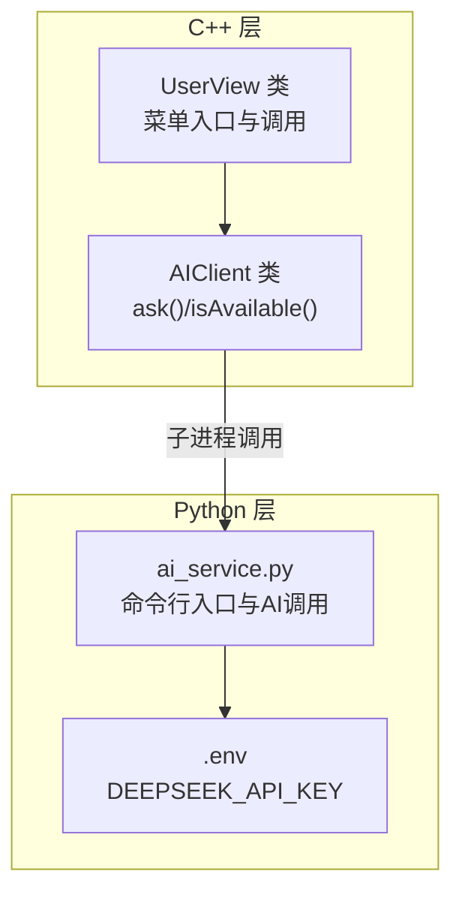
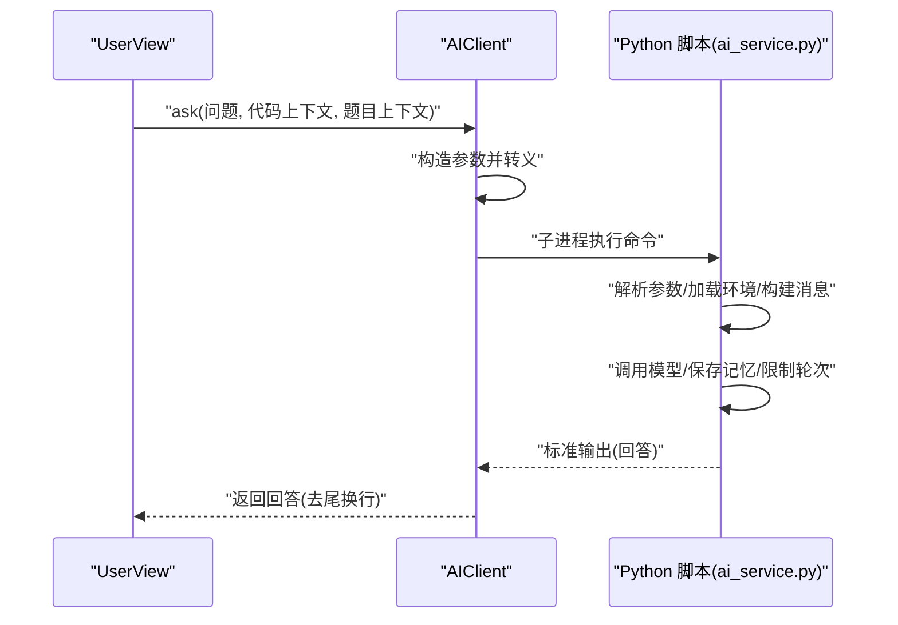
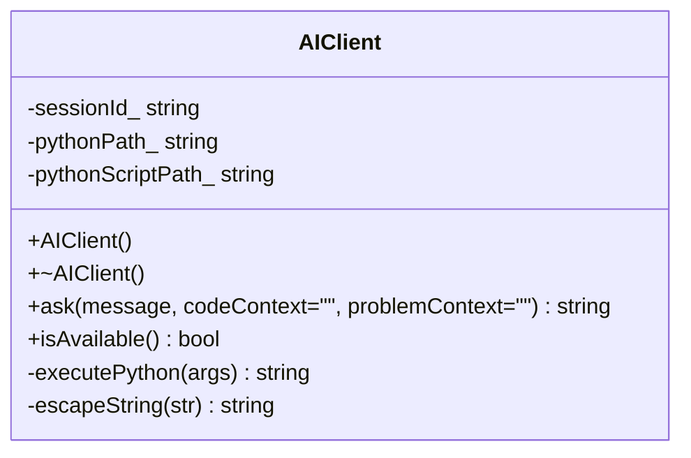
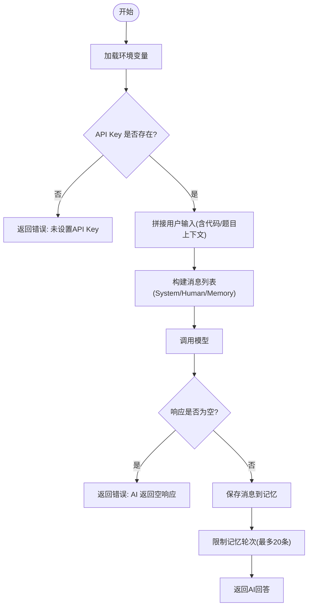
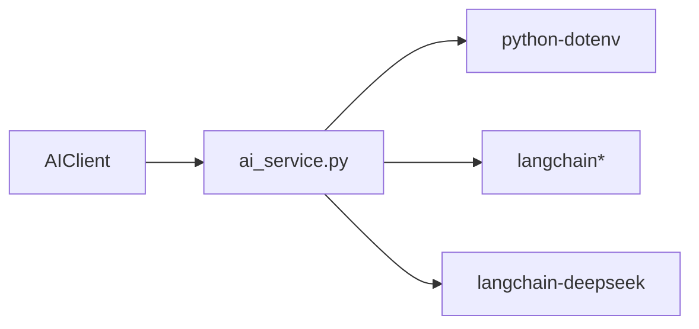

# AI客户端API

<cite>
**本文引用的文件**
- [include/ai_client.h](file://include/ai_client.h)
- [src/ai_client.cpp](file://src/ai_client.cpp)
- [ai/ai_service.py](file://ai/ai_service.py)
- [ai/requirements.txt](file://ai/requirements.txt)
- [src/user_view.cpp](file://src/user_view.cpp)
- [include/user_view.h](file://include/user_view.h)
- [ai.md](file://ai.md)
</cite>

## 目录
1. [简介](#简介)
2. [项目结构](#项目结构)
3. [核心组件](#核心组件)
4. [架构总览](#架构总览)
5. [详细组件分析](#详细组件分析)
6. [依赖分析](#依赖分析)
7. [性能考虑](#性能考虑)
8. [故障排查指南](#故障排查指南)
9. [结论](#结论)
10. [附录](#附录)

## 简介
本文件为AI客户端的API文档，聚焦于C++侧AIClient类的公共接口与交互协议，涵盖：
- 公共接口定义与行为说明
- 进程间通信实现（C++调用Python脚本）
- 参数传递格式与返回值处理
- 会话管理与消息传递机制
- 错误处理、超时与重试机制现状与建议
- 实际使用场景（AI问答、代码指导）与最佳实践

注意：当前仓库中AI服务以“命令行参数+标准输出”的形式提供，而非HTTP服务；因此本文档围绕该实现进行说明，并在适用处给出扩展为HTTP服务的建议。

## 项目结构
该项目采用“C++宿主 + Python AI微服务”的解耦架构：
- C++侧提供CLI界面与业务流程控制，通过子进程方式调用Python AI服务。
- Python侧负责AI模型调用、会话记忆管理、系统提示词与上下文拼接。
- 会话隔离通过Python端的会话ID映射实现，限制记忆轮次以控制Token消耗。

图表来源
- [src/ai_client.cpp:85-112](file://src/ai_client.cpp#L85-L112)
- [ai/ai_service.py:93-108](file://ai/ai_service.py#L93-L108)

章节来源
- [ai.md:7-21](file://ai.md#L7-L21)
- [src/ai_client.cpp:8-23](file://src/ai_client.cpp#L8-L23)
- [ai/ai_service.py:15-16](file://ai/ai_service.py#L15-L16)

## 核心组件
- AIClient类：封装与Python AI服务的交互，提供提问与可用性检测能力。
- ai_service.py：命令行入口，解析参数、构建消息、调用模型、维护会话记忆。
- UserView：用户界面层，提供“AI助手”入口，组织问题输入与展示。

章节来源
- [include/ai_client.h:6-25](file://include/ai_client.h#L6-L25)
- [src/ai_client.cpp:85-112](file://src/ai_client.cpp#L85-L112)
- [ai/ai_service.py:40-91](file://ai/ai_service.py#L40-L91)
- [src/user_view.cpp:244-311](file://src/user_view.cpp#L244-L311)

## 架构总览
C++与Python之间的交互采用“命令行参数 + 标准输出”的轻量协议：
- C++侧构造参数字符串，转义特殊字符，通过子进程调用Python脚本。
- Python侧解析参数，拼接系统提示词与上下文，调用模型并返回文本。
- C++侧接收标准输出，去除尾部换行，返回给调用方。

图表来源
- [src/ai_client.cpp:85-112](file://src/ai_client.cpp#L85-L112)
- [src/ai_client.cpp:56-83](file://src/ai_client.cpp#L56-L83)
- [ai/ai_service.py:93-108](file://ai/ai_service.py#L93-L108)

## 详细组件分析

### AIClient类
AIClient是C++侧AI客户端的核心，负责：
- 会话标识管理（默认会话ID）
- 子进程调用Python脚本
- 参数构造与字符串转义
- 错误处理与空响应兜底

图表来源
- [include/ai_client.h:6-25](file://include/ai_client.h#L6-L25)
- [src/ai_client.cpp:8-23](file://src/ai_client.cpp#L8-L23)

接口说明
- ask(message, codeContext="", problemContext="")
  - 功能：向AI提问，支持传入代码上下文与题目上下文。
  - 参数：
    - message：用户问题文本。
    - codeContext：代码上下文（可选）。
    - problemContext：题目上下文（可选）。
  - 返回：AI回答文本；若空响应则返回错误提示。
- isAvailable()
  - 功能：检测Python解释器与脚本是否存在，用于判断AI服务可用性。
  - 返回：true/false。

内部方法
- executePython(args)
  - 功能：拼接命令并以子进程方式执行Python脚本，收集标准输出。
  - 返回：标准输出字符串；若无法执行则返回错误提示。
- escapeString(str)
  - 功能：对参数中的引号、反斜杠、换行符、回车符、制表符进行转义，保证命令行安全。

章节来源
- [include/ai_client.h:12-16](file://include/ai_client.h#L12-L16)
- [src/ai_client.cpp:85-112](file://src/ai_client.cpp#L85-L112)
- [src/ai_client.cpp:56-83](file://src/ai_client.cpp#L56-L83)
- [src/ai_client.cpp:27-54](file://src/ai_client.cpp#L27-L54)

### Python AI服务（ai_service.py）
Python侧实现如下要点：
- 环境变量加载：从.env文件读取DEEPSEEK_API_KEY。
- 系统提示词：采用“严师”模式，禁止直接提供完整可运行代码。
- 会话记忆：按会话ID维护ChatMessageHistory，限制记忆轮次。
- 上下文拼接：将代码上下文与题目上下文合并到用户输入中。
- 异常处理：捕获异常并输出到stderr，返回统一错误格式。

图表来源
- [ai/ai_service.py:40-91](file://ai/ai_service.py#L40-L91)

章节来源
- [ai/ai_service.py:15-16](file://ai/ai_service.py#L15-L16)
- [ai/ai_service.py:18-27](file://ai/ai_service.py#L18-L27)
- [ai/ai_service.py:33-37](file://ai/ai_service.py#L33-L37)
- [ai/ai_service.py:40-91](file://ai/ai_service.py#L40-L91)
- [ai/ai_service.py:93-108](file://ai/ai_service.py#L93-L108)

### 会话管理与消息传递
- 会话隔离：Python端以session_id为键维护独立的ChatMessageHistory，确保不同用户会话互不影响。
- 记忆轮次限制：当消息数量超过上限时，移除最早的一对消息，保持上下文可控。
- 上下文注入：代码上下文与题目上下文会被拼接到用户输入前，帮助AI理解问题背景。

章节来源
- [ai/ai_service.py:33-37](file://ai/ai_service.py#L33-L37)
- [ai/ai_service.py:56-61](file://ai/ai_service.py#L56-L61)
- [ai/ai_service.py:75-82](file://ai/ai_service.py#L75-L82)

### 参数传递格式与返回值处理
- 参数传递格式（C++ -> Python）：
  - 通过命令行参数传递：--session、--message、--code、--problem。
  - 特殊字符转义：引号、反斜杠、换行、回车、制表符均被转义，避免shell解析错误。
- 返回值处理：
  - Python脚本将回答打印到标准输出；C++侧读取标准输出并去除尾部换行后返回。
  - 若Python侧抛出异常或返回空响应，C++侧会返回统一错误提示。

章节来源
- [src/ai_client.cpp:89-101](file://src/ai_client.cpp#L89-L101)
- [src/ai_client.cpp:27-54](file://src/ai_client.cpp#L27-L54)
- [src/ai_client.cpp:56-83](file://src/ai_client.cpp#L56-L83)
- [ai/ai_service.py:93-108](file://ai/ai_service.py#L93-L108)

### 使用场景与示例
- AI问答（无上下文）
  - 场景：用户直接提问，无需提供代码或题目背景。
  - 示例路径：[src/user_view.cpp:290-311](file://src/user_view.cpp#L290-L311)
- 代码指导（带代码上下文）
  - 场景：用户提交代码后，希望AI指出问题或提供思路。
  - 示例路径：[src/user_view.cpp:244-311](file://src/user_view.cpp#L244-L311)
- 题目辅助（带题目上下文）
  - 场景：用户在做题过程中遇到困难，需要结合题目信息获得指导。
  - 示例路径：[src/user_view.cpp:244-311](file://src/user_view.cpp#L244-L311)

章节来源
- [src/user_view.cpp:244-311](file://src/user_view.cpp#L244-L311)

## 依赖分析
- Python运行时依赖
  - 语言与框架：python-dotenv、langchain、langchain-core、langchain-deepseek、langchain-community、langchain-azure。
  - 用途：加载环境变量、构建消息链、调用DeepSeek模型、管理会话记忆。
- C++与Python的耦合点
  - 文件路径解析：AIClient根据当前工作目录尝试两种路径（开发/构建时相对路径）。
  - 命令行协议：双方约定参数名称与顺序，确保稳定交互。

图表来源
- [src/ai_client.cpp:8-23](file://src/ai_client.cpp#L8-L23)
- [ai/requirements.txt:1-7](file://ai/requirements.txt#L1-L7)

章节来源
- [ai/requirements.txt:1-7](file://ai/requirements.txt#L1-L7)
- [src/ai_client.cpp:8-23](file://src/ai_client.cpp#L8-L23)

## 性能考虑
- 子进程开销：每次调用都会启动Python解释器与脚本，频繁调用会产生额外开销。
- 记忆轮次限制：通过限制消息对数降低Token消耗与推理时间。
- 上下文拼接成本：代码与题目上下文越长，Token消耗越高，建议精简输入。
- I/O缓冲：Python侧使用固定大小缓冲读取标准输出，避免内存暴涨。

章节来源
- [ai/ai_service.py:79-82](file://ai/ai_service.py#L79-L82)
- [src/ai_client.cpp:60-82](file://src/ai_client.cpp#L60-L82)

## 故障排查指南
常见问题与定位步骤
- Python解释器或脚本不存在
  - 现象：isAvailable()返回false；或executePython返回“无法执行AI服务”。
  - 排查：确认ai/venv/bin/python与ai/ai_service.py路径正确；若在build目录运行，需使用相对路径。
  - 参考：[src/ai_client.cpp:14-22](file://src/ai_client.cpp#L14-L22)，[src/ai_client.cpp:114-123](file://src/ai_client.cpp#L114-L123)
- 未设置DEEPSEEK_API_KEY
  - 现象：Python侧返回“未设置DEEPSEEK_API_KEY”。
  - 排查：检查.ai/.env文件是否存在且包含DEEPSEEK_API_KEY。
  - 参考：[ai/ai_service.py:42-44](file://ai/ai_service.py#L42-L44)
- AI返回空响应
  - 现象：C++侧返回“AI返回空响应，请检查网络连接或API Key配置”。
  - 排查：检查网络连通性、API Key有效性、模型调用是否异常。
  - 参考：[src/ai_client.cpp:105-109](file://src/ai_client.cpp#L105-L109)，[ai/ai_service.py:71-73](file://ai/ai_service.py#L71-L73)
- 参数转义导致命令行解析异常
  - 现象：Python侧参数缺失或解析错误。
  - 排查：确认escapeString对特殊字符的转义是否正确；必要时在Python侧增加参数校验。
  - 参考：[src/ai_client.cpp:27-54](file://src/ai_client.cpp#L27-L54)，[ai/ai_service.py:93-108](file://ai/ai_service.py#L93-L108)
- 超时与重试
  - 现状：当前实现未内置超时与重试机制。
  - 建议：在C++侧为popen设置超时（例如使用select/poll），并在失败时进行有限重试；同时在Python侧对模型调用增加超时参数。

章节来源
- [src/ai_client.cpp:14-22](file://src/ai_client.cpp#L14-L22)
- [src/ai_client.cpp:114-123](file://src/ai_client.cpp#L114-L123)
- [ai/ai_service.py:42-44](file://ai/ai_service.py#L42-L44)
- [src/ai_client.cpp:105-109](file://src/ai_client.cpp#L105-L109)
- [ai/ai_service.py:71-73](file://ai/ai_service.py#L71-L73)
- [src/ai_client.cpp:27-54](file://src/ai_client.cpp#L27-L54)
- [ai/ai_service.py:93-108](file://ai/ai_service.py#L93-L108)

## 结论
- 当前实现以“命令行参数 + 标准输出”的轻量协议完成C++与Python的交互，满足基本的AI问答与代码指导需求。
- 会话隔离与记忆轮次限制有效控制了上下文规模，避免Token浪费与模型幻觉风险。
- 建议在未来演进中引入HTTP服务与流式传输，以提升性能与用户体验；同时补充超时与重试机制，增强稳定性。

## 附录

### API参考：AIClient
- ask(message, codeContext="", problemContext="")
  - 功能：向AI提问，支持代码与题目上下文。
  - 返回：AI回答文本；若空响应或执行失败，返回错误提示。
- isAvailable()
  - 功能：检测Python解释器与脚本是否存在。
  - 返回：true/false。

章节来源
- [include/ai_client.h:12-16](file://include/ai_client.h#L12-L16)

### 交互协议与数据序列化
- 协议类型：命令行参数 + 标准输出
- 参数字段：
  - --session：会话ID（默认"default"）
  - --message：用户问题
  - --code：代码上下文（可选）
  - --problem：题目上下文（可选）
- 序列化方式：纯文本；Python侧将回答打印到标准输出，C++侧读取并返回。

章节来源
- [src/ai_client.cpp:89-101](file://src/ai_client.cpp#L89-L101)
- [ai/ai_service.py:93-108](file://ai/ai_service.py#L93-L108)

### 与Python AI服务的交互流程（扩展建议）
若未来迁移到HTTP服务，建议采用如下流程：
- C++端使用libcurl或httplib发送POST请求至Python FastAPI服务。
- 请求体包含session_id、message、code_context、problem_context。
- Python端以JSON格式接收请求，调用LangChain链路，返回流式响应或一次性响应。
- C++端解析响应并渲染到CLI界面。

章节来源
- [ai.md:48-60](file://ai.md#L48-L60)