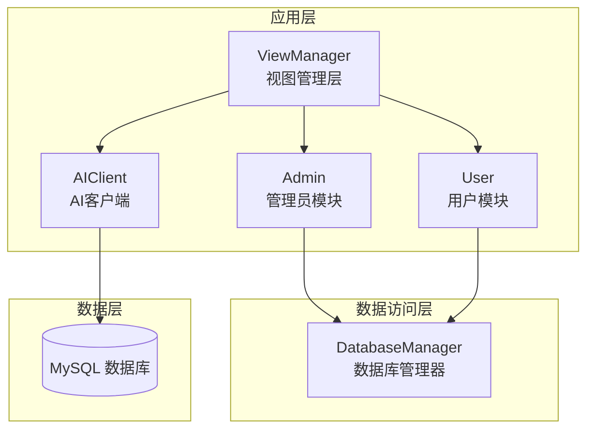
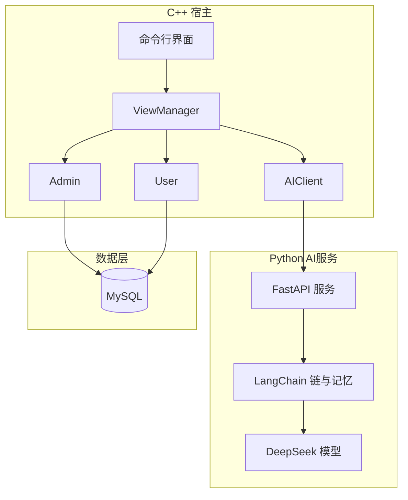
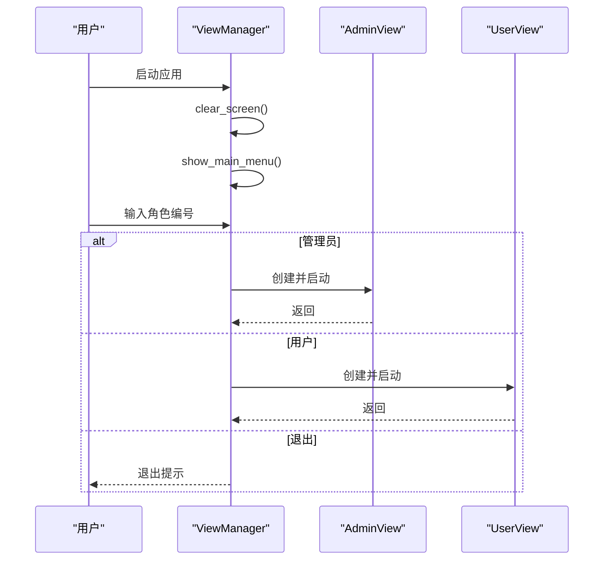
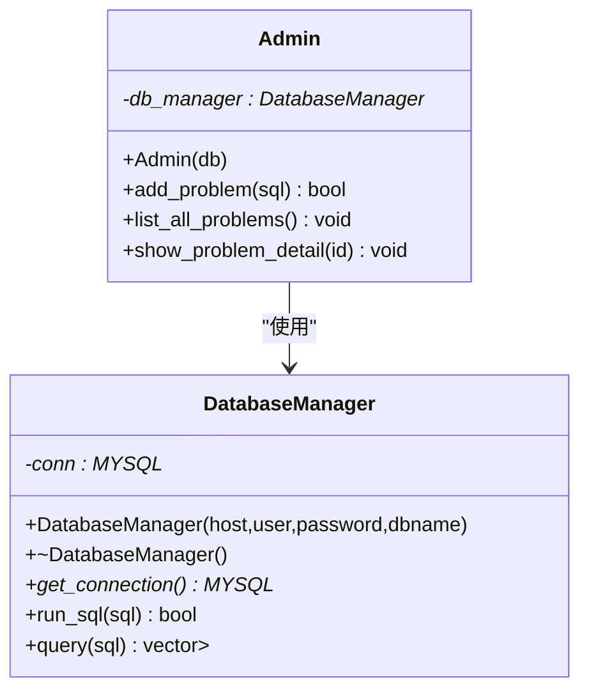
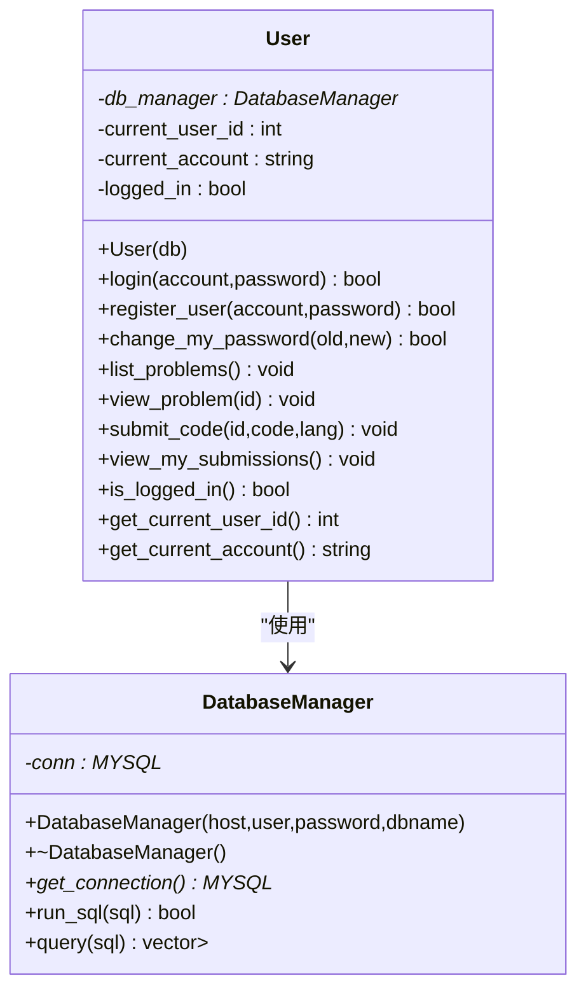
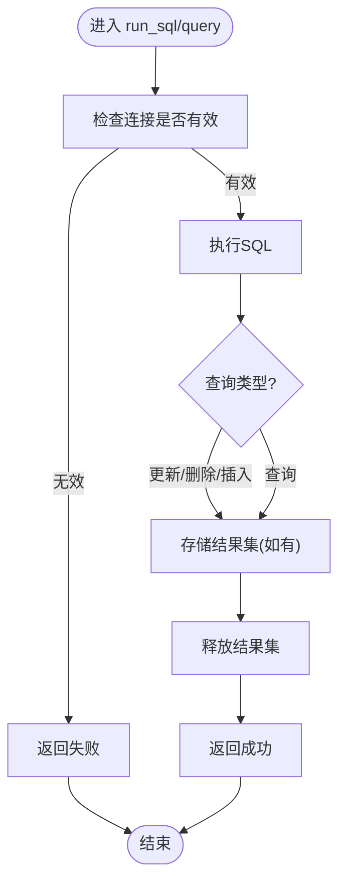
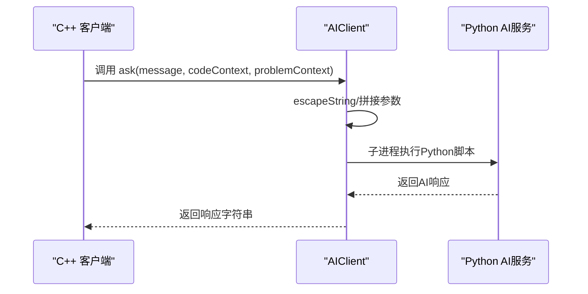
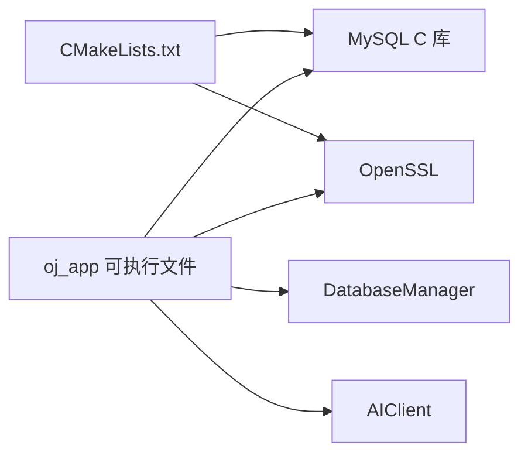

# API参考文档

<cite>
**本文档引用的文件**
- [README.md](file://README.md)
- [CMakeLists.txt](file://CMakeLists.txt)
- [init.sql](file://init.sql)
- [ai.md](file://ai.md)
- [src/main.cpp](file://src/main.cpp)
- [src/view_manager.cpp](file://src/view_manager.cpp)
- [src/db_manager.cpp](file://src/db_manager.cpp)
- [src/admin.cpp](file://src/admin.cpp)
- [src/user.cpp](file://src/user.cpp)
- [src/ai_client.cpp](file://src/ai_client.cpp)
- [include/view_manager.h](file://include/view_manager.h)
- [include/db_manager.h](file://include/db_manager.h)
- [include/admin.h](file://include/admin.h)
- [include/user.h](file://include/user.h)
- [include/ai_client.h](file://include/ai_client.h)
</cite>

## 目录
1. [简介](#简介)
2. [项目结构](#项目结构)
3. [核心组件](#核心组件)
4. [架构总览](#架构总览)
5. [详细组件分析](#详细组件分析)
6. [依赖关系分析](#依赖关系分析)
7. [性能考虑](#性能考虑)
8. [故障排除指南](#故障排除指南)
9. [结论](#结论)
10. [附录](#附录)

## 简介
本文件为OJ评测系统的API参考文档，面向开发者与运维人员，系统性梳理CLI应用的内部API与对外接口契约。重点覆盖以下方面：
- 管理员模块：题目发布、题目列表与详情查看
- 用户模块：登录、注册、密码修改、题目浏览、代码提交、提交记录查看
- 数据库管理器：SQL执行与查询封装
- AI客户端：与Python AI服务的调用接口与可用性检测
- 视图管理层：登录菜单与角色入口
- 数据库Schema：表结构与字段语义
- 安全与性能：认证流程、SQL注入防护现状、性能建议
- 错误处理与故障排除：常见问题定位与修复建议

本系统当前以命令行界面为主，核心业务逻辑集中在C++模块；AI能力通过子进程方式调用Python服务实现。

## 项目结构
项目采用分层组织：
- include：对外公开的头文件，定义各模块的API接口
- src：实现文件，包含业务逻辑与视图控制
- ai：AI微服务相关（Python端），通过CLI调用
- init.sql：数据库初始化脚本
- CMakeLists.txt：构建配置，声明MySQL与OpenSSL依赖

**图表来源**
- [src/view_manager.cpp:32-70](file://src/view_manager.cpp#L32-L70)
- [src/admin.cpp:10-58](file://src/admin.cpp#L10-L58)
- [src/user.cpp:11-222](file://src/user.cpp#L11-L222)
- [src/ai_client.cpp:8-123](file://src/ai_client.cpp#L8-L123)
- [src/db_manager.cpp:8-99](file://src/db_manager.cpp#L8-L99)

**章节来源**
- [CMakeLists.txt:1-40](file://CMakeLists.txt#L1-L40)
- [README.md:1-2](file://README.md#L1-L2)

## 核心组件
本节概述各模块的职责与对外暴露的API。

- 视图管理层(ViewManager)
  - 职责：启动登录菜单，根据用户选择进入管理员或用户视图
  - 关键方法：启动登录菜单、清屏、显示主菜单
  - 依赖：AdminView、UserView（视图层）

- 管理员模块(Admin)
  - 职责：发布题目、列出题目、查看题目详情
  - 关键方法：发布题目、列出题目、查看题目详情
  - 依赖：DatabaseManager

- 用户模块(User)
  - 职责：登录、注册、修改密码、浏览题目、提交代码、查看提交记录
  - 关键方法：登录、注册、修改密码、浏览题目、查看题目、提交代码、查看提交记录
  - 依赖：DatabaseManager

- 数据库管理器(DatabaseManager)
  - 职责：数据库连接、SQL执行、查询结果封装
  - 关键方法：构造/析构、获取连接、执行SQL、查询
  - 依赖：MySQL C API

- AI客户端(AIClient)
  - 职责：调用Python AI服务，传递会话、消息与上下文
  - 关键方法：构造/析构、提问、可用性检测
  - 依赖：子进程执行Python脚本

**章节来源**
- [include/view_manager.h:11-40](file://include/view_manager.h#L11-L40)
- [include/admin.h:10-37](file://include/admin.h#L10-L37)
- [include/user.h:10-86](file://include/user.h#L10-L86)
- [include/db_manager.h:12-46](file://include/db_manager.h#L12-L46)
- [include/ai_client.h:6-25](file://include/ai_client.h#L6-L25)

## 架构总览
系统采用“C++宿主 + Python AI微服务”的解耦架构：
- C++侧负责CLI交互与业务编排
- Python侧提供AI聊天与辅助能力
- 两者通过子进程调用与参数传递进行通信

**图表来源**
- [ai.md:9-21](file://ai.md#L9-L21)
- [src/ai_client.cpp:85-112](file://src/ai_client.cpp#L85-L112)

## 详细组件分析

### 视图管理层 API
- 职责：启动登录菜单，根据用户选择进入管理员或用户视图
- 方法
  - start_login_menu()：启动登录菜单循环，处理角色选择
  - show_main_menu()：显示主菜单
  - clear_screen()：清屏
  - clear_input()：清空输入缓冲区

**图表来源**
- [src/view_manager.cpp:32-70](file://src/view_manager.cpp#L32-L70)

**章节来源**
- [src/view_manager.cpp:14-76](file://src/view_manager.cpp#L14-L76)
- [src/main.cpp:5-12](file://src/main.cpp#L5-L12)

### 管理员模块 API
- 职责：发布题目、列出题目、查看题目详情
- 方法
  - Admin(DatabaseManager* db)：构造函数
  - bool add_problem(const std::string& sql)：执行SQL发布题目
  - void list_all_problems()：列出题目概要
  - void show_problem_detail(int id)：按ID查看题目详情（JSON格式输出）

**图表来源**
- [include/admin.h:10-37](file://include/admin.h#L10-L37)
- [src/admin.cpp:10-58](file://src/admin.cpp#L10-L58)
- [include/db_manager.h:12-46](file://include/db_manager.h#L12-L46)
- [src/db_manager.cpp:8-57](file://src/db_manager.cpp#L8-L57)

**章节来源**
- [include/admin.h:10-37](file://include/admin.h#L10-L37)
- [src/admin.cpp:12-58](file://src/admin.cpp#L12-L58)

### 用户模块 API
- 职责：登录、注册、修改密码、浏览题目、查看题目详情、提交代码、查看提交记录
- 方法
  - User(DatabaseManager* db)：构造函数
  - bool login(const std::string& account, const std::string& password)：登录
  - bool register_user(const std::string& account, const std::string& password)：注册
  - bool change_my_password(const std::string& old_password, const std::string& new_password)：修改密码
  - void list_problems()：列出题目
  - void view_problem(int id)：查看题目详情
  - void submit_code(int problem_id, const std::string& code, const std::string& language)：提交代码（待实现）
  - void view_my_submissions()：查看提交记录（待实现）
  - is_logged_in() const bool：获取登录状态
  - get_current_user_id() const int：获取当前用户ID
  - get_current_account() const std::string：获取当前账号

**图表来源**
- [include/user.h:10-86](file://include/user.h#L10-L86)
- [src/user.cpp:11-222](file://src/user.cpp#L11-L222)
- [include/db_manager.h:12-46](file://include/db_manager.h#L12-L46)
- [src/db_manager.cpp:8-57](file://src/db_manager.cpp#L8-L57)

**章节来源**
- [include/user.h:10-86](file://include/user.h#L10-L86)
- [src/user.cpp:39-222](file://src/user.cpp#L39-L222)

### 数据库管理器 API
- 职责：封装数据库连接、SQL执行与查询结果解析
- 方法
  - DatabaseManager(const std::string& host, const std::string& user, const std::string& password, const std::string& dbname)：构造函数
  - ~DatabaseManager()：析构函数
  - MYSQL* get_connection() const：获取连接句柄
  - bool run_sql(const std::string& sql)：执行SQL并返回布尔结果
  - std::vector<std::map<std::string,std::string>> query(const std::string& sql)：执行查询并返回结果集

**图表来源**
- [src/db_manager.cpp:21-99](file://src/db_manager.cpp#L21-L99)

**章节来源**
- [include/db_manager.h:12-46](file://include/db_manager.h#L12-L46)
- [src/db_manager.cpp:8-99](file://src/db_manager.cpp#L8-L99)

### AI客户端 API
- 职责：通过子进程调用Python AI服务，传递会话ID、消息与上下文
- 方法
  - AIClient()：构造函数（自动探测Python虚拟环境与脚本路径）
  - ~AIClient()：析构函数
  - std::string ask(const std::string& message, const std::string& codeContext="", const std::string& problemContext="")：提问
  - bool isAvailable()：检测AI服务可用性
  - private：executePython(args)、escapeString(str)

**图表来源**
- [src/ai_client.cpp:85-112](file://src/ai_client.cpp#L85-L112)
- [ai.md:48-60](file://ai.md#L48-L60)

**章节来源**
- [include/ai_client.h:6-25](file://include/ai_client.h#L6-L25)
- [src/ai_client.cpp:8-123](file://src/ai_client.cpp#L8-L123)
- [ai.md:1-76](file://ai.md#L1-L76)

## 依赖关系分析
- 构建依赖：CMakeLists声明MySQL与OpenSSL依赖，并导出编译命令以便工具链使用
- 运行时依赖：应用通过DatabaseManager连接MySQL；AI功能依赖Python虚拟环境与脚本

**图表来源**
- [CMakeLists.txt:11-34](file://CMakeLists.txt#L11-L34)

**章节来源**
- [CMakeLists.txt:1-40](file://CMakeLists.txt#L1-L40)

## 性能考虑
- 查询缓存：当前实现未引入应用层缓存，建议对高频查询（如题目列表）增加轻量缓存
- 连接池：当前为单连接直连，建议引入连接池以提升并发能力
- SQL执行：避免在用户输入中直接拼接SQL，当前存在字符串拼接风险，建议统一改为预处理语句
- AI调用：子进程开销较大，建议在高频场景下引入异步队列与重试机制
- 日志与错误：统一错误码与日志级别，便于性能监控与问题定位

[本节为通用指导，不直接分析具体文件]

## 故障排除指南
- 数据库连接失败
  - 现象：连接失败或查询失败
  - 排查：确认MySQL服务状态、凭据与网络；检查DatabaseManager构造参数
  - 参考实现位置：[src/db_manager.cpp:61-79](file://src/db_manager.cpp#L61-L79)
- 登录失败
  - 现象：账号不存在或密码错误
  - 排查：确认账号是否存在、密码哈希是否正确
  - 参考实现位置：[src/user.cpp:39-71](file://src/user.cpp#L39-L71)
- AI服务不可用
  - 现象：isAvailable返回false或空响应
  - 排查：确认Python虚拟环境路径与脚本存在；检查网络与API Key配置
  - 参考实现位置：[src/ai_client.cpp:114-123](file://src/ai_client.cpp#L114-L123), [ai.md:64-76](file://ai.md#L64-L76)
- 提交与记录功能未实现
  - 现象：提交代码与查看提交记录输出“待实现”
  - 排查：按现有API扩展数据库操作与UI展示
  - 参考实现位置：[src/user.cpp:201-222](file://src/user.cpp#L201-L222)

**章节来源**
- [src/db_manager.cpp:61-99](file://src/db_manager.cpp#L61-L99)
- [src/user.cpp:39-222](file://src/user.cpp#L39-L222)
- [src/ai_client.cpp:114-123](file://src/ai_client.cpp#L114-L123)
- [ai.md:64-76](file://ai.md#L64-L76)

## 结论
本API参考文档梳理了OJ系统的CLI核心模块及其对外契约，明确了管理员与用户两大业务域的接口边界、数据访问层的封装方式以及AI客户端的调用协议。当前系统以C++为主、Python为辅的架构清晰，具备良好的扩展性。建议后续完善SQL注入防护、引入连接池与缓存、补齐提交与记录功能，并统一错误处理与日志体系。

[本节为总结性内容，不直接分析具体文件]

## 附录

### 数据库Schema与字段说明
- 题目表(problems)
  - 字段：id、title、description、time_limit、memory_limit、test_data_path、created_at
  - 说明：time_limit单位毫秒，memory_limit单位MB
- 用户表(users)
  - 字段：id、account、password_hash、submission_count、solved_count、created_at、last_login
  - 说明：account唯一；password_hash为SHA256哈希
- 提交记录表(submissions)
  - 字段：id、user_id、problem_id、code、status、submit_time
  - 说明：status枚举包括Pending、AC、WA、TLE、MLE、RE、CE

**章节来源**
- [init.sql:14-60](file://init.sql#L14-L60)

### 安全与认证要点
- 密码存储：使用SHA256哈希存储，避免明文保存
- 登录流程：登录成功后更新last_login字段
- SQL注入：当前存在字符串拼接风险，建议统一改用预处理语句
- AI安全：通过System Prompt与后置校验防止AI被滥用

**章节来源**
- [src/user.cpp:13-37](file://src/user.cpp#L13-L37)
- [src/user.cpp:44-70](file://src/user.cpp#L44-L70)
- [ai.md:31-42](file://ai.md#L31-L42)

### 已弃用与待实现功能
- 提交代码与查看提交记录：当前输出“待实现”，需补充数据库操作与UI展示
- 题目生成器：AI自动出题与测试数据生成（规划阶段）

**章节来源**
- [src/user.cpp:201-222](file://src/user.cpp#L201-L222)
- [ai.md:40-43](file://ai.md#L40-L43)