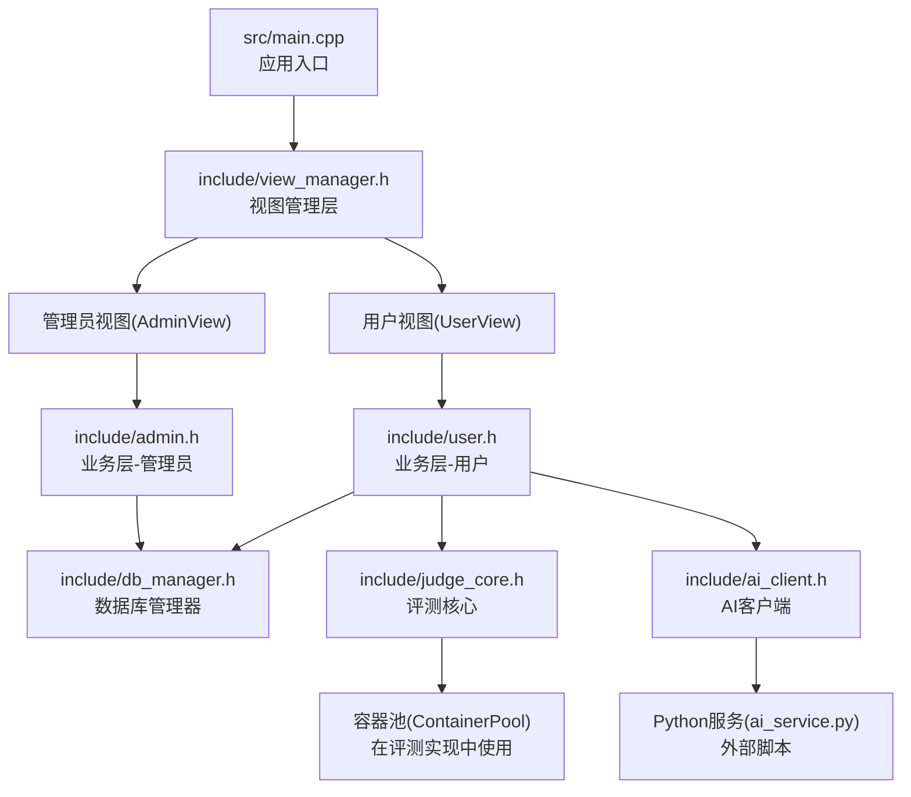
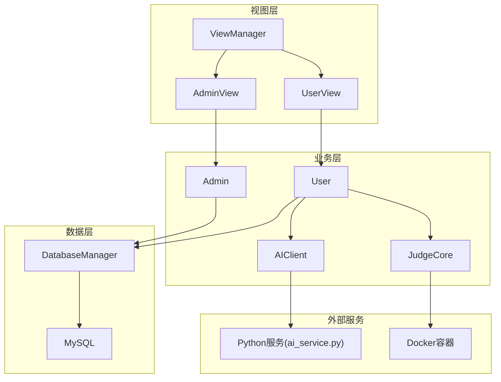
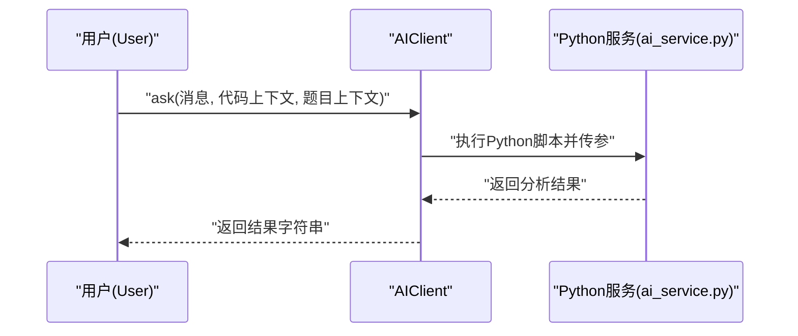
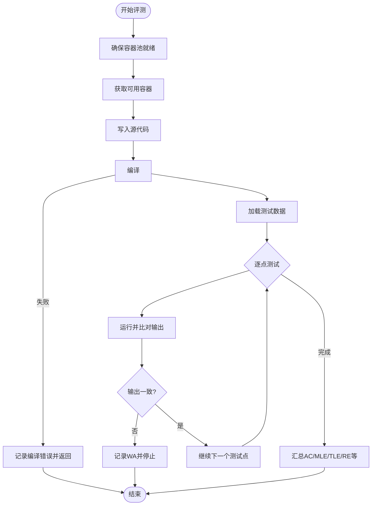
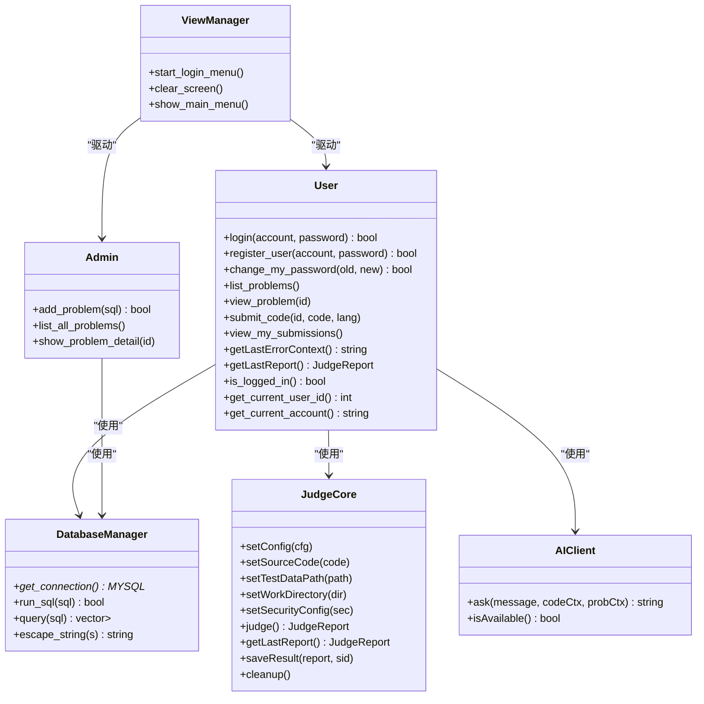
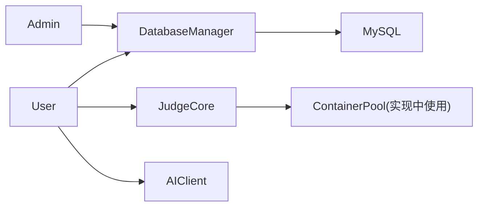

# API参考文档

<cite>
**本文引用的文件**
- [README.md](file://README.md)
- [init.sql](file://init.sql)
- [CMakeLists.txt](file://CMakeLists.txt)
- [src/main.cpp](file://src/main.cpp)
- [include/db_manager.h](file://include/db_manager.h)
- [src/db_manager.cpp](file://src/db_manager.cpp)
- [include/user.h](file://include/user.h)
- [src/user.cpp](file://src/user.cpp)
- [include/admin.h](file://include/admin.h)
- [src/admin.cpp](file://src/admin.cpp)
- [include/ai_client.h](file://include/ai_client.h)
- [src/ai_client.cpp](file://src/ai_client.cpp)
- [include/judge_core.h](file://include/judge_core.h)
- [src/judge_core.cpp](file://src/judge_core.cpp)
- [include/view_manager.h](file://include/view_manager.h)
- [src/view_manager.cpp](file://src/view_manager.cpp)
</cite>

## 目录
1. [简介](#简介)
2. [项目结构](#项目结构)
3. [核心组件](#核心组件)
4. [架构总览](#架构总览)
5. [详细组件分析](#详细组件分析)
6. [依赖关系分析](#依赖关系分析)
7. [性能考虑](#性能考虑)
8. [故障排查指南](#故障排查指南)
9. [结论](#结论)
10. [附录](#附录)

## 简介
本文件为OJ在线评测系统的API参考文档，覆盖以下方面：
- 数据库API接口：用户管理、题目操作、提交记录等核心数据操作的接口规范
- AI服务API接口：代码分析、问题解答等功能的调用方法与参数说明
- 评测核心API接口：代码编译、执行与结果获取的接口规范
- 内部模块间通信API：视图层、业务层与数据层的接口契约
- 接口参数、返回值、错误码说明
- 实际调用示例与集成要点
- 版本管理与向后兼容策略
- 性能优化与限流配置建议

## 项目结构
项目采用分层架构：命令行入口启动视图管理层，视图层调度业务层（用户/管理员），业务层通过数据库管理器访问MySQL，评测核心通过容器沙箱执行代码，AI客户端通过子进程调用Python服务。

图表来源
- [src/main.cpp:1-14](file://src/main.cpp#L1-L14)
- [include/view_manager.h:1-43](file://include/view_manager.h#L1-L43)
- [include/user.h:1-102](file://include/user.h#L1-L102)
- [include/admin.h:1-40](file://include/admin.h#L1-L40)
- [include/db_manager.h:1-60](file://include/db_manager.h#L1-L60)
- [include/judge_core.h:1-189](file://include/judge_core.h#L1-L189)
- [include/ai_client.h:1-28](file://include/ai_client.h#L1-L28)

章节来源
- [CMakeLists.txt:1-40](file://CMakeLists.txt#L1-L40)
- [README.md:1-2](file://README.md#L1-L2)

## 核心组件
- 视图管理层：负责登录菜单与角色选择，驱动用户/管理员视图
- 业务层：
  - 用户：登录、注册、改密、查看题目、提交代码、查看提交记录
  - 管理员：发布题目、列出题目、查看题目详情
- 数据层：数据库管理器封装MySQL连接、查询、转义与SQL执行
- 评测核心：基于容器沙箱的编译、运行、资源监控与结果判定
- AI客户端：封装Python服务调用，提供问答与代码分析能力

章节来源
- [include/view_manager.h:1-43](file://include/view_manager.h#L1-L43)
- [include/user.h:1-102](file://include/user.h#L1-L102)
- [include/admin.h:1-40](file://include/admin.h#L1-L40)
- [include/db_manager.h:1-60](file://include/db_manager.h#L1-L60)
- [include/judge_core.h:1-189](file://include/judge_core.h#L1-L189)
- [include/ai_client.h:1-28](file://include/ai_client.h#L1-L28)

## 架构总览
系统采用“视图-业务-数据”三层与“评测沙箱-AI服务”的外部协作：

图表来源
- [include/view_manager.h:1-43](file://include/view_manager.h#L1-L43)
- [include/user.h:1-102](file://include/user.h#L1-L102)
- [include/admin.h:1-40](file://include/admin.h#L1-L40)
- [include/db_manager.h:1-60](file://include/db_manager.h#L1-L60)
- [include/judge_core.h:1-189](file://include/judge_core.h#L1-L189)
- [include/ai_client.h:1-28](file://include/ai_client.h#L1-L28)

## 详细组件分析

### 数据库API接口
- 目标：封装MySQL连接、查询、执行与转义，供业务层统一使用
- 关键接口
  - 连接与资源管理
    - 构造/析构：初始化与关闭连接
    - get_connection：获取底层连接指针
  - SQL执行
    - run_sql：执行非查询语句（如INSERT/UPDATE/DELETE/DDL）
    - query：执行查询并返回行集合（每行以列名->值映射）
  - 安全
    - escape_string：对字符串进行SQL转义，降低注入风险
- 参数与返回
  - run_sql/sql：布尔成功标志
  - query：行向量，每行键值映射
  - escape_string：转义后的字符串
- 错误处理
  - 执行失败会输出错误信息并返回失败状态
  - 查询失败返回空结果集
- 使用场景
  - 用户登录/注册/改密
  - 题目列表/详情查询
  - 提交记录查询与写入
  - 管理员发布题目（直接传入SQL）

章节来源
- [include/db_manager.h:1-60](file://include/db_manager.h#L1-L60)
- [src/db_manager.cpp:1-110](file://src/db_manager.cpp#L1-L110)
- [include/user.h:1-102](file://include/user.h#L1-L102)
- [src/user.cpp:1-560](file://src/user.cpp#L1-L560)
- [include/admin.h:1-40](file://include/admin.h#L1-L40)
- [src/admin.cpp:1-59](file://src/admin.cpp#L1-L59)

### 用户管理API
- 登录
  - 输入：账号、密码
  - 行为：查询用户表，校验SHA256哈希，更新最后登录时间
  - 返回：布尔成功标志
- 注册
  - 输入：账号、密码
  - 行为：检查账号唯一性，生成SHA256哈希并插入用户表
  - 返回：布尔成功标志
- 修改密码
  - 输入：旧密码、新密码
  - 行为：验证旧密码哈希，生成新哈希并更新
  - 返回：布尔成功标志
- 参数与返回
  - 均为布尔成功标志；失败时输出错误提示
- 错误码
  - 账号不存在、密码错误、账号已存在、用户数据异常等

章节来源
- [include/user.h:1-102](file://include/user.h#L1-L102)
- [src/user.cpp:1-560](file://src/user.cpp#L1-L560)

### 题目操作API
- 列出题目
  - 输入：无
  - 行为：查询problems表，按ID排序
  - 返回：题目列表（含ID、标题、分类、时间/内存限制）
- 查看题目详情
  - 输入：题目ID
  - 行为：查询problems表对应记录
  - 返回：题目完整信息（JSON格式输出）
- 管理员发布题目
  - 输入：SQL语句（建议INSERT）
  - 行为：通过数据库管理器执行
  - 返回：布尔成功标志

章节来源
- [include/admin.h:1-40](file://include/admin.h#L1-L40)
- [src/admin.cpp:1-59](file://src/admin.cpp#L1-L59)
- [include/user.h:1-102](file://include/user.h#L1-L102)
- [src/user.cpp:1-560](file://src/user.cpp#L1-L560)

### 提交记录API
- 查看我的提交记录
  - 输入：无（自动绑定当前用户）
  - 行为：联结submissions与problems，按提交时间倒序取最近20条
  - 返回：提交记录列表（含ID、题目、状态、提交时间）
- 提交代码
  - 输入：题目ID、代码文本、编程语言
  - 行为：读取题目配置（时间/内存限制、测试数据路径），执行评测，写入submissions表，更新用户统计
  - 返回：评测结果（AC/WA/TLE/MLE/RE/CE/Pending）
  - 错误上下文：当评测失败时，构造上下文供AI分析

章节来源
- [include/user.h:1-102](file://include/user.h#L1-L102)
- [src/user.cpp:1-560](file://src/user.cpp#L1-L560)

### AI服务API接口
- 能力概述
  - 问答与代码分析：通过Python脚本提供辅助
  - 可用性检测：检查Python解释器与脚本是否存在
- 关键接口
  - ask：发送消息，可选附带代码上下文与题目上下文
  - isAvailable：检查AI服务可用性
- 参数与返回
  - ask：返回服务端响应字符串；若为空则返回错误提示
  - isAvailable：布尔可用性
- 调用方式
  - 通过子进程执行Python脚本，传递会话ID、消息与上下文
- 错误处理
  - 若无法执行或返回空，返回错误提示

图表来源
- [include/ai_client.h:1-28](file://include/ai_client.h#L1-L28)
- [src/ai_client.cpp:1-124](file://src/ai_client.cpp#L1-L124)

章节来源
- [include/ai_client.h:1-28](file://include/ai_client.h#L1-L28)
- [src/ai_client.cpp:1-124](file://src/ai_client.cpp#L1-L124)

### 评测核心API接口
- 能力概述
  - 基于容器沙箱的安全评测：编译、运行、资源监控、结果判定
  - 支持多测试点，遇到首个失败点即停止
- 关键接口
  - 配置设置
    - setConfig：设置时间/内存限制、语言
    - setSourceCode：设置源代码
    - setTestDataPath：设置测试数据目录
    - setWorkDirectory：设置工作目录
    - setSecurityConfig：设置安全配置（网络、文件系统、capabilities等）
  - 评测执行
    - judge：执行评测并返回评测报告
    - getLastReport：获取最后一次评测报告
  - 结果持久化
    - saveResult：保存评测结果（当前为占位，后续接入数据库）
  - 资源管理
    - cleanup：健康检查（容器池）
- 数据结构
  - JudgeConfig：评测配置（时间/内存/输出限制、语言）
  - SecurityConfig：安全配置（网络禁用、只读根fs、capabilities、seccomp、PID/文件句柄限制）
  - ResourceLimits：资源限制（CPU配额、周期、内存、时间、输出、进程数）
  - ResourceUsage：资源使用（内存、峰值、CPU百分比、CPU时间、OOM）
  - TestCaseResult：单点结果（编号、结果、时间、内存、差异信息）
  - JudgeReport：评测报告（总体结果、时间/内存使用、错误信息、通过/总数、各点详情）
- 评测流程

图表来源
- [include/judge_core.h:1-189](file://include/judge_core.h#L1-L189)
- [src/judge_core.cpp:1-264](file://src/judge_core.cpp#L1-L264)

章节来源
- [include/judge_core.h:1-189](file://include/judge_core.h#L1-L189)
- [src/judge_core.cpp:1-264](file://src/judge_core.cpp#L1-L264)

### 内部模块间通信API
- 视图层(ViewManager)
  - 职责：清屏、显示菜单、接收用户选择、驱动用户/管理员视图
  - 接口：start_login_menu、clear_screen、show_main_menu
- 用户(User)
  - 职责：登录/注册/改密、题目浏览/详情、提交代码、查看提交记录
  - 依赖：DatabaseManager、JudgeCore、AIClient
- 管理员(Admin)
  - 职责：发布题目、列出题目、查看题目详情
  - 依赖：DatabaseManager
- 数据库管理器(DatabaseManager)
  - 职责：连接、查询、执行、转义
- 评测核心(JudgeCore)
  - 职责：评测配置、执行、报告、持久化占位、清理
- AI客户端(AIClient)
  - 职责：封装Python服务调用、可用性检测

图表来源
- [include/view_manager.h:1-43](file://include/view_manager.h#L1-L43)
- [include/user.h:1-102](file://include/user.h#L1-L102)
- [include/admin.h:1-40](file://include/admin.h#L1-L40)
- [include/db_manager.h:1-60](file://include/db_manager.h#L1-L60)
- [include/judge_core.h:1-189](file://include/judge_core.h#L1-L189)
- [include/ai_client.h:1-28](file://include/ai_client.h#L1-L28)

章节来源
- [include/view_manager.h:1-43](file://include/view_manager.h#L1-L43)
- [src/view_manager.cpp:1-77](file://src/view_manager.cpp#L1-L77)
- [include/user.h:1-102](file://include/user.h#L1-L102)
- [src/user.cpp:1-560](file://src/user.cpp#L1-L560)
- [include/admin.h:1-40](file://include/admin.h#L1-L40)
- [src/admin.cpp:1-59](file://src/admin.cpp#L1-L59)
- [include/db_manager.h:1-60](file://include/db_manager.h#L1-L60)
- [src/db_manager.cpp:1-110](file://src/db_manager.cpp#L1-L110)
- [include/judge_core.h:1-189](file://include/judge_core.h#L1-L189)
- [src/judge_core.cpp:1-264](file://src/judge_core.cpp#L1-L264)
- [include/ai_client.h:1-28](file://include/ai_client.h#L1-L28)
- [src/ai_client.cpp:1-124](file://src/ai_client.cpp#L1-L124)

## 依赖关系分析
- 外部依赖
  - MySQL客户端：用于数据库访问
  - OpenSSL：用于密码哈希
- 内部耦合
  - User/Admin依赖DatabaseManager
  - User依赖JudgeCore与AIClient
  - JudgeCore依赖容器池（在实现中使用）
- 可能的循环依赖
  - 未发现直接循环；视图层通过智能指针避免循环引用

图表来源
- [include/user.h:1-102](file://include/user.h#L1-L102)
- [include/admin.h:1-40](file://include/admin.h#L1-L40)
- [include/db_manager.h:1-60](file://include/db_manager.h#L1-L60)
- [include/judge_core.h:1-189](file://include/judge_core.h#L1-L189)
- [src/judge_core.cpp:1-264](file://src/judge_core.cpp#L1-L264)

章节来源
- [CMakeLists.txt:1-40](file://CMakeLists.txt#L1-L40)

## 性能考虑
- 数据库层
  - 使用索引：users(account)、submissions(user_id/problem_id)
  - 读写分离：用户/提交表使用受限账号，减少权限开销
  - SQL转义：避免重复转义与注入风险
- 评测层
  - 容器池：惰性初始化与常驻+扩容策略，减少容器创建开销
  - 早停：首个失败点即停止，缩短平均评测时间
  - 资源限制：严格的时间/内存/输出限制，避免资源滥用
- AI层
  - 可用性检测：减少无效调用
  - 上下文精简：仅传递必要字段，避免超长参数
- 建议
  - 数据库连接池：当前为单连接，可引入连接池
  - 评测并发：容器池并发控制，结合限流策略
  - 日志与指标：采集评测耗时、容器使用率、AI调用成功率

## 故障排查指南
- 数据库连接失败
  - 现象：连接失败/查询失败错误输出
  - 排查：确认MySQL服务、凭据、网络与权限
- 提交失败
  - 现象：系统错误或无可用容器
  - 排查：Docker可用性、容器池初始化、测试数据路径
- AI服务不可用
  - 现象：返回空响应或错误提示
  - 排查：Python解释器与脚本路径、虚拟环境、网络与API Key
- 密码相关
  - 现象：登录失败、改密失败
  - 排查：SHA256一致性、数据库记录完整性

章节来源
- [src/db_manager.cpp:1-110](file://src/db_manager.cpp#L1-L110)
- [src/judge_core.cpp:1-264](file://src/judge_core.cpp#L1-L264)
- [src/ai_client.cpp:1-124](file://src/ai_client.cpp#L1-L124)
- [src/user.cpp:1-560](file://src/user.cpp#L1-L560)

## 结论
本API参考文档梳理了OJ系统的数据库、AI服务与评测核心三大模块的接口契约与交互流程。通过清晰的分层设计与安全的沙箱评测机制，系统实现了从命令行入口到业务逻辑再到数据持久化的完整链路。建议在生产环境中进一步完善数据库连接池、评测并发与限流策略，并持续优化AI服务的可用性与响应质量。

## 附录

### 数据模型与初始化
- 数据库初始化脚本包含以下表与权限：
  - problems：题目表（含标题、描述、时间/内存限制、测试数据路径、分类）
  - users：用户表（含账号、密码哈希、提交/解决计数、注册/登录时间）
  - submissions：提交记录表（含用户ID、题目ID、代码、状态、提交时间）
  - 权限：oj_admin全权限；oj_user对三张表的受限权限

章节来源
- [init.sql:1-278](file://init.sql#L1-L278)

### API调用示例与集成要点
- 用户登录/注册/改密
  - 通过User类对应方法完成；失败时输出明确提示
- 查看题目与提交代码
  - 先list_problems，再view_problem，最后submit_code
  - 提交后自动写入submissions并更新用户统计
- 管理员发布题目
  - 直接传入SQL（建议INSERT）给Admin.add_problem
- AI分析
  - 先调用isAvailable确认可用，再调用ask传入消息与上下文

章节来源
- [include/user.h:1-102](file://include/user.h#L1-L102)
- [src/user.cpp:1-560](file://src/user.cpp#L1-L560)
- [include/admin.h:1-40](file://include/admin.h#L1-L40)
- [src/admin.cpp:1-59](file://src/admin.cpp#L1-L59)
- [include/ai_client.h:1-28](file://include/ai_client.h#L1-L28)
- [src/ai_client.cpp:1-124](file://src/ai_client.cpp#L1-L124)

### 版本管理与向后兼容策略
- 版本命名
  - 历史版本文件：History/OJ_v0.1.md、History/OJ_v0.2.md
- 建议
  - 采用语义化版本（MAJOR.MINOR.PATCH）
  - 数据库Schema变更需提供迁移脚本
  - 接口变更时保持默认参数与兼容行为，逐步淘汰旧接口

章节来源
- [README.md:1-2](file://README.md#L1-L2)