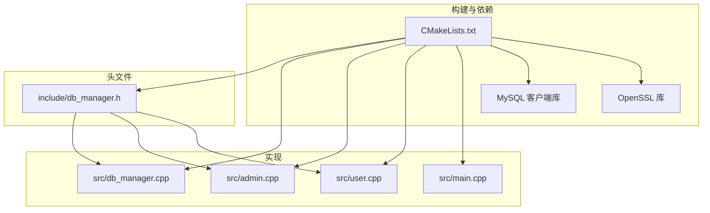
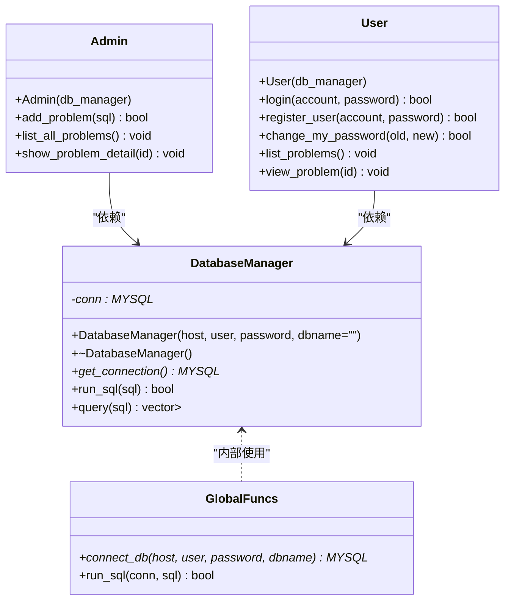
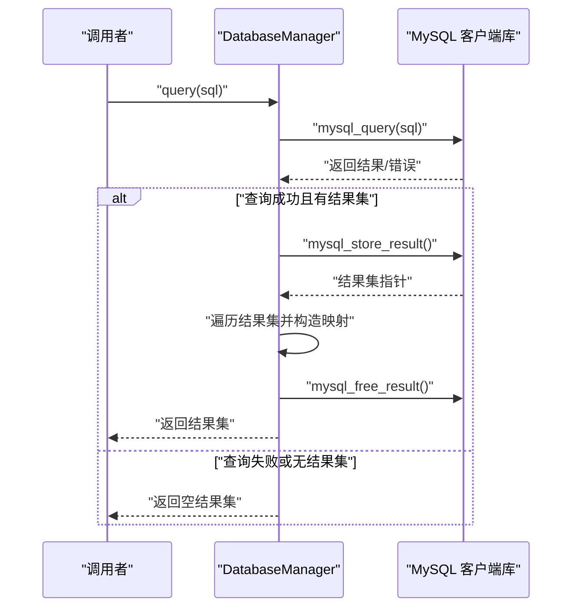
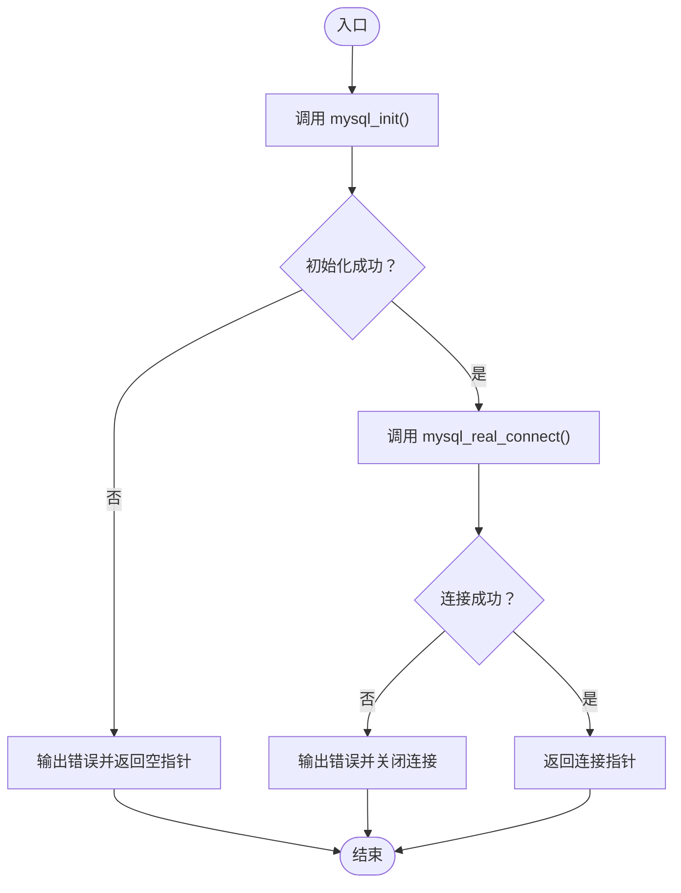
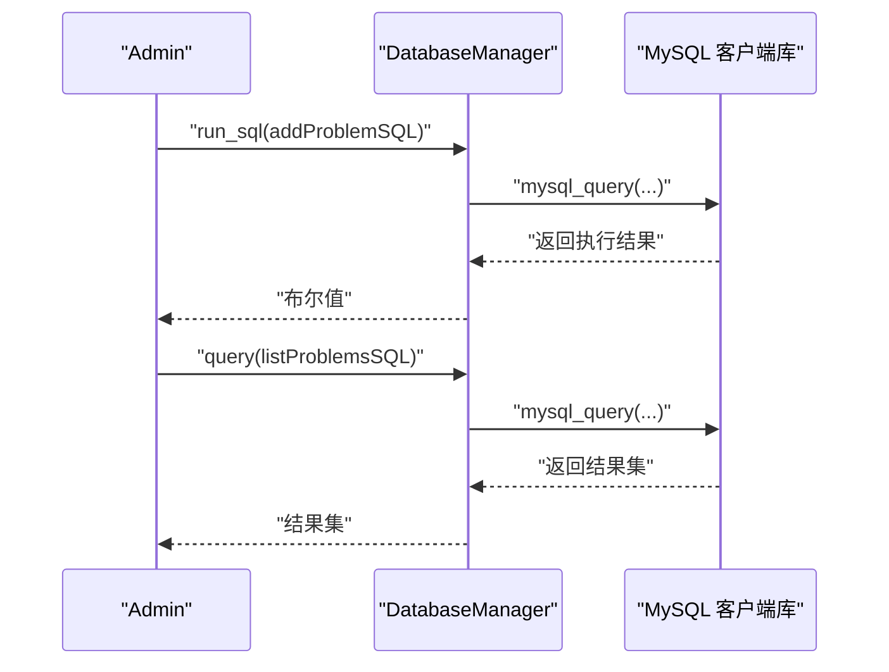
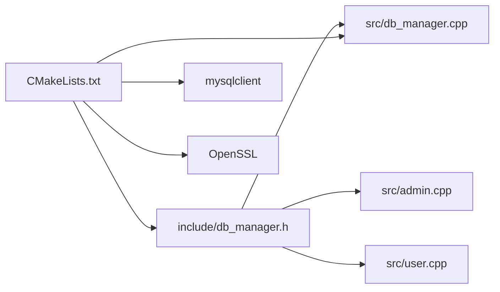

# 数据库API

<cite>
**本文引用的文件**
- [db_manager.h](file://include/db_manager.h)
- [db_manager.cpp](file://src/db_manager.cpp)
- [init.sql](file://init.sql)
- [CMakeLists.txt](file://CMakeLists.txt)
- [admin.cpp](file://src/admin.cpp)
- [user.cpp](file://src/user.cpp)
- [main.cpp](file://src/main.cpp)
</cite>

## 目录
1. [简介](#简介)
2. [项目结构](#项目结构)
3. [核心组件](#核心组件)
4. [架构总览](#架构总览)
5. [详细组件分析](#详细组件分析)
6. [依赖关系分析](#依赖关系分析)
7. [性能考量](#性能考量)
8. [故障排除指南](#故障排除指南)
9. [结论](#结论)
10. [附录](#附录)

## 简介
本文件为数据库管理器的API文档，聚焦于DatabaseManager类及其配套的全局函数，覆盖数据库连接、查询执行、结果集处理等能力。文档同时结合项目中的实际使用场景，给出SQL操作最佳实践、与MySQL客户端库的交互方式、线程安全性注意事项、性能优化建议以及故障排除指南。

## 项目结构
该项目采用C++17标准，使用CMake构建系统，链接MySQL客户端库（mysqlclient）。数据库管理器位于include与src目录中，配合若干业务模块（如管理员与用户功能）进行演示使用。

图表来源
- [CMakeLists.txt:11-34](file://CMakeLists.txt#L11-L34)
- [db_manager.h:1-53](file://include/db_manager.h#L1-L53)
- [db_manager.cpp:1-100](file://src/db_manager.cpp#L1-L100)

章节来源
- [CMakeLists.txt:1-40](file://CMakeLists.txt#L1-L40)
- [db_manager.h:1-53](file://include/db_manager.h#L1-L53)
- [db_manager.cpp:1-100](file://src/db_manager.cpp#L1-L100)

## 核心组件
- DatabaseManager类：封装数据库连接与SQL执行，提供连接句柄访问、SQL执行与查询结果集返回。
- 全局函数：
  - connect_db：初始化并建立MySQL连接。
  - run_sql：执行任意SQL并处理返回的结果集（若存在）。

关键职责与行为
- 连接建立：通过mysql_init与mysql_real_connect完成初始化与连接，支持指定主机、用户名、密码、数据库名。
- 连接释放：析构时调用mysql_close关闭连接。
- SQL执行：run_sql负责执行SQL并释放结果集；query负责执行查询并将结果映射为列名到字符串值的映射集合。
- 结果集处理：query遍历结果集，将每一行映射为键值对，列名为键，值为字符串（空值以“NULL”表示）。

章节来源
- [db_manager.h:12-46](file://include/db_manager.h#L12-L46)
- [db_manager.cpp:8-19](file://src/db_manager.cpp#L8-L19)
- [db_manager.cpp:21-57](file://src/db_manager.cpp#L21-L57)
- [db_manager.cpp:61-79](file://src/db_manager.cpp#L61-L79)
- [db_manager.cpp:81-99](file://src/db_manager.cpp#L81-L99)

## 架构总览
DatabaseManager作为业务层与MySQL客户端库之间的适配层，向上提供简洁的接口，向下封装MySQL的连接与查询细节。业务模块（如管理员与用户功能）通过DatabaseManager实例执行SQL。

图表来源
- [db_manager.h:12-46](file://include/db_manager.h#L12-L46)
- [db_manager.cpp:8-19](file://src/db_manager.cpp#L8-L19)
- [db_manager.cpp:61-79](file://src/db_manager.cpp#L61-L79)
- [db_manager.cpp:81-99](file://src/db_manager.cpp#L81-L99)
- [admin.cpp:10-59](file://src/admin.cpp#L10-L59)
- [user.cpp:11-200](file://src/user.cpp#L11-L200)

## 详细组件分析

### DatabaseManager类
- 构造与析构
  - 构造函数：通过connect_db建立连接并保存至conn。
  - 析构函数：若连接有效则调用mysql_close关闭连接。
- 接口方法
  - get_connection：返回底层MYSQL连接指针，便于上层直接使用MySQL客户端API。
  - run_sql：执行SQL并释放结果集（若有），返回布尔值表示是否执行成功。
  - query：执行查询，将结果集转换为向量，其中每个元素为列名到字符串值的映射；若连接无效或查询失败则返回空结果集。
- 错误处理
  - 连接失败与查询失败均会输出错误信息到标准错误流。
  - query在失败时返回空结果集，调用方需检查结果集是否为空以判断是否成功。

图表来源
- [db_manager.cpp:26-57](file://src/db_manager.cpp#L26-L57)

章节来源
- [db_manager.h:12-46](file://include/db_manager.h#L12-L46)
- [db_manager.cpp:8-19](file://src/db_manager.cpp#L8-L19)
- [db_manager.cpp:21-57](file://src/db_manager.cpp#L21-L57)

### 全局函数
- connect_db
  - 使用mysql_init初始化连接上下文。
  - 使用mysql_real_connect建立TCP连接，支持指定数据库名。
  - 若初始化或连接失败，输出错误并返回空指针。
- run_sql
  - 检查连接有效性。
  - 执行SQL并尝试获取结果集，若有则释放。
  - 返回布尔值表示执行是否成功。

图表来源
- [db_manager.cpp:61-79](file://src/db_manager.cpp#L61-L79)

章节来源
- [db_manager.cpp:61-79](file://src/db_manager.cpp#L61-L79)
- [db_manager.cpp:81-99](file://src/db_manager.cpp#L81-L99)

### 业务模块中的使用示例
- 管理员模块
  - 通过DatabaseManager执行添加题目等写操作。
  - 通过query查询题目列表与详情。
- 用户模块
  - 通过query执行登录校验与注册前的账号检查。
  - 通过run_sql更新登录时间与修改密码。

图表来源
- [admin.cpp:12-41](file://src/admin.cpp#L12-L41)
- [db_manager.cpp:21-57](file://src/db_manager.cpp#L21-L57)

章节来源
- [admin.cpp:10-59](file://src/admin.cpp#L10-L59)
- [user.cpp:39-98](file://src/user.cpp#L39-L98)
- [user.cpp:100-137](file://src/user.cpp#L100-L137)
- [user.cpp:139-200](file://src/user.cpp#L139-L200)

## 依赖关系分析
- 编译期依赖
  - include/db_manager.h依赖MySQL客户端头文件与标准容器类型。
  - src/db_manager.cpp依赖头文件与标准I/O。
- 运行期依赖
  - CMake通过pkg-config查找mysqlclient并链接。
  - 项目还链接OpenSSL库（用于密码哈希等）。
- 组件耦合
  - DatabaseManager与全局函数之间为内部耦合，对外暴露简洁接口。
  - 业务模块（admin.cpp、user.cpp）通过DatabaseManager间接依赖MySQL客户端库。

图表来源
- [CMakeLists.txt:11-34](file://CMakeLists.txt#L11-L34)
- [db_manager.h:4-7](file://include/db_manager.h#L4-L7)
- [db_manager.cpp:1](file://src/db_manager.cpp#L1)

章节来源
- [CMakeLists.txt:11-34](file://CMakeLists.txt#L11-L34)
- [db_manager.h:4-7](file://include/db_manager.h#L4-L7)

## 性能考量
- 连接生命周期
  - 当前实现为每个DatabaseManager实例维护一个连接；在业务模块中通常按需创建实例，避免长连接复用带来的复杂性。
- 结果集处理
  - query使用mysql_store_result一次性获取全部结果，适合小到中等规模结果集；对于大结果集应考虑分页或流式处理以降低内存占用。
- 字符串映射
  - 结果集中所有值统一转为字符串，便于通用展示；若需要强类型解析，可在上层进行二次转换。
- 线程安全
  - MySQL客户端库并非完全线程安全，不建议跨线程共享同一MYSQL连接。当前实现未提供连接池，建议在多线程场景下为每个线程创建独立连接或引入连接池方案。
- SQL执行
  - run_sql在执行后释放结果集，避免内存泄漏；但频繁执行大量写操作时仍需关注数据库负载与网络延迟。

[本节为通用性能建议，不直接分析具体文件，故无章节来源]

## 故障排除指南
- 连接失败
  - 症状：构造DatabaseManager后无法执行查询。
  - 排查：确认主机、用户名、密码、数据库名正确；检查MySQL服务状态与网络连通性；查看connect_db输出的错误信息。
  - 参考实现位置：[db_manager.cpp:61-79](file://src/db_manager.cpp#L61-L79)
- 查询失败
  - 症状：query返回空结果集。
  - 排查：检查SQL语法与表权限；确认连接有效；查看错误输出；确认目标表存在且有数据。
  - 参考实现位置：[db_manager.cpp:26-57](file://src/db_manager.cpp#L26-L57)
- 权限问题
  - 症状：登录或注册失败，或查询无数据。
  - 排查：确认数据库用户权限配置（管理员与普通用户分别具备不同权限）；确保使用正确的数据库用户与密码。
  - 参考初始化脚本：[init.sql:67-94](file://init.sql#L67-L94)
- 数据库初始化
  - 症状：首次运行缺少表结构或示例数据。
  - 排查：执行init.sql初始化数据库与示例数据。
  - 参考初始化脚本：[init.sql:1-143](file://init.sql#L1-L143)

章节来源
- [db_manager.cpp:61-79](file://src/db_manager.cpp#L61-L79)
- [db_manager.cpp:26-57](file://src/db_manager.cpp#L26-L57)
- [init.sql:67-94](file://init.sql#L67-L94)
- [init.sql:1-143](file://init.sql#L1-L143)

## 结论
DatabaseManager提供了简洁而实用的数据库访问接口，封装了MySQL客户端库的连接与查询细节，使业务模块能够专注于功能实现。当前实现未包含事务与连接池机制，建议在生产环境中引入事务支持与连接池以提升可靠性与性能，并注意线程安全与SQL注入防护。

[本节为总结性内容，不直接分析具体文件，故无章节来源]

## 附录

### API参考

- 类：DatabaseManager
  - 构造函数：DatabaseManager(host, user, password, dbname="")
  - 析构函数：~DatabaseManager()
  - 方法：
    - get_connection()：返回MYSQL连接指针
    - run_sql(sql)：执行SQL并返回布尔值
    - query(sql)：执行查询并返回结果集（向量，元素为列名到字符串的映射）

- 全局函数：
  - connect_db(host, user, password, dbname)：初始化并建立MySQL连接
  - run_sql(conn, sql)：执行SQL并释放结果集（若有）

章节来源
- [db_manager.h:12-46](file://include/db_manager.h#L12-L46)
- [db_manager.cpp:61-79](file://src/db_manager.cpp#L61-L79)
- [db_manager.cpp:81-99](file://src/db_manager.cpp#L81-L99)

### SQL操作最佳实践
- 使用参数化查询或严格转义防止SQL注入（当前示例中存在拼接SQL的情况，建议改为预处理语句或严格的输入校验与转义）。
- 对于写操作，建议在业务层捕获返回值并根据布尔值决定后续逻辑。
- 对于读操作，建议在上层对结果集进行必要的类型转换与空值处理。
- 在多线程环境下，避免共享同一连接；必要时引入连接池或为每个线程创建独立连接。

[本节为通用实践建议，不直接分析具体文件，故无章节来源]

### 与MySQL客户端库的交互方式
- 初始化：使用mysql_init创建连接上下文。
- 连接：使用mysql_real_connect建立TCP连接，支持主机、用户名、密码、数据库名等参数。
- 查询：使用mysql_query发送SQL；若需要结果集，使用mysql_store_result获取；遍历结果集后使用mysql_free_result释放。
- 关闭：使用mysql_close关闭连接。

章节来源
- [db_manager.cpp:61-79](file://src/db_manager.cpp#L61-L79)
- [db_manager.cpp:26-57](file://src/db_manager.cpp#L26-L57)

### 线程安全性考虑
- 不建议跨线程共享同一MYSQL连接。
- 当前实现未提供连接池；在多线程场景下，建议为每个线程创建独立的DatabaseManager实例或引入连接池方案。
- 事务处理未在当前实现中体现，如需事务，请在业务层显式管理BEGIN/COMMIT/ROLLBACK，并确保在同一连接上执行。

[本节为通用安全建议，不直接分析具体文件，故无章节来源]