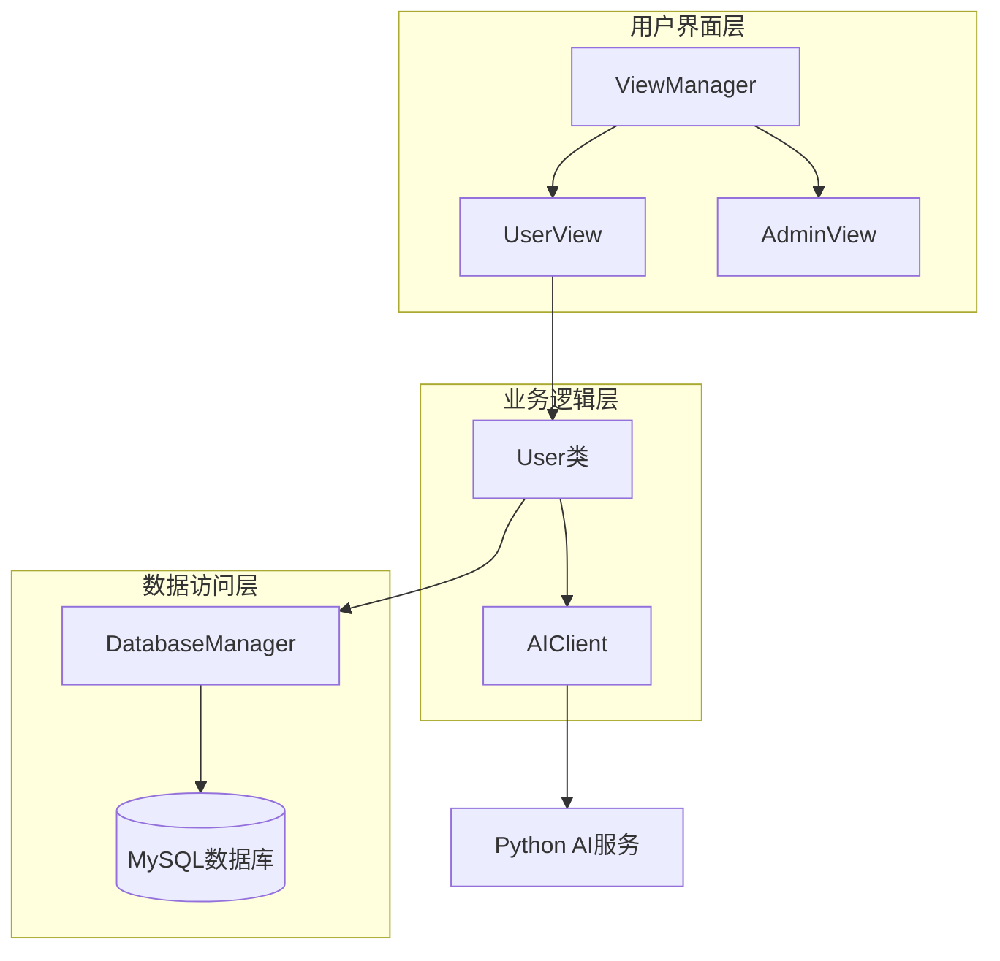
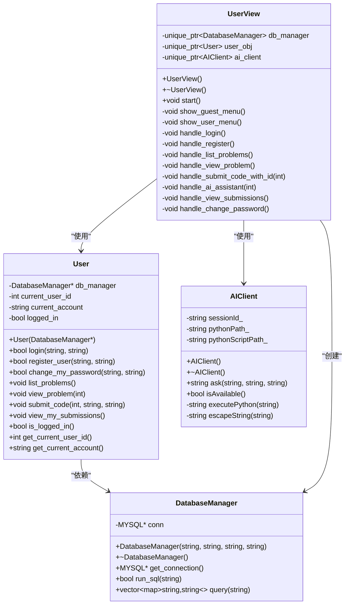
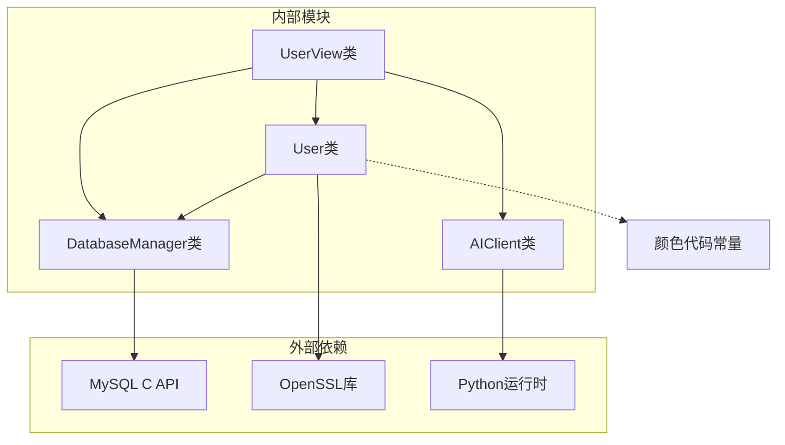

# 用户API

<cite>
**本文档引用的文件**
- [user.h](file://include/user.h)
- [user.cpp](file://src/user.cpp)
- [user_view.h](file://include/user_view.h)
- [user_view.cpp](file://src/user_view.cpp)
- [db_manager.h](file://include/db_manager.h)
- [db_manager.cpp](file://src/db_manager.cpp)
- [view_manager.h](file://include/view_manager.h)
- [view_manager.cpp](file://src/view_manager.cpp)
- [ai_client.h](file://include/ai_client.h)
- [ai_client.cpp](file://src/ai_client.cpp)
- [init.sql](file://init.sql)
- [main.cpp](file://src/main.cpp)
</cite>

## 目录
1. [简介](#简介)
2. [项目结构](#项目结构)
3. [核心组件](#核心组件)
4. [架构概览](#架构概览)
5. [详细组件分析](#详细组件分析)
6. [依赖关系分析](#依赖关系分析)
7. [性能考虑](#性能考虑)
8. [故障排除指南](#故障排除指南)
9. [结论](#结论)

## 简介

用户API是OJ在线判题系统的核心功能模块，负责处理普通用户的业务逻辑。该模块提供了完整的用户认证、密码管理、题目浏览和代码提交等功能。系统采用C++开发，使用MySQL作为数据存储，通过SHA256算法进行密码哈希加密，实现了安全的用户身份验证和权限管理。

## 项目结构

OJ系统采用分层架构设计，用户模块位于系统的中间层，负责业务逻辑处理和数据访问。

**图表来源**
- [view_manager.cpp:1-77](file://src/view_manager.cpp#L1-L77)
- [user_view.cpp:1-352](file://src/user_view.cpp#L1-L352)
- [user.cpp:1-223](file://src/user.cpp#L1-L223)
- [db_manager.cpp:1-100](file://src/db_manager.cpp#L1-L100)

**章节来源**
- [main.cpp:1-14](file://src/main.cpp#L1-L14)
- [view_manager.h:1-43](file://include/view_manager.h#L1-L43)
- [user_view.h:1-92](file://include/user_view.h#L1-L92)

## 核心组件

用户模块由多个核心组件构成，每个组件都有明确的职责分工：

### User类 - 核心业务逻辑
- **职责**: 处理用户认证、密码管理、题目浏览、代码提交等核心业务
- **状态管理**: 维护用户登录状态、当前用户信息
- **数据访问**: 通过DatabaseManager访问数据库

### UserView类 - 用户界面交互
- **职责**: 处理用户输入输出、菜单显示、业务逻辑调用
- **界面管理**: 提供友好的命令行界面体验
- **流程控制**: 管理用户操作流程和状态转换

### DatabaseManager类 - 数据访问抽象
- **职责**: 封装数据库连接和SQL执行
- **连接管理**: 管理MySQL连接生命周期
- **查询执行**: 提供统一的查询和执行接口

**章节来源**
- [user.h:10-86](file://include/user.h#L10-L86)
- [user_view.h:12-89](file://include/user_view.h#L12-L89)
- [db_manager.h:12-46](file://include/db_manager.h#L12-L46)

## 架构概览

用户模块采用经典的三层架构模式，实现了关注点分离和良好的可维护性。

**图表来源**
- [user.h:10-86](file://include/user.h#L10-L86)
- [user_view.h:12-89](file://include/user_view.h#L12-L89)
- [db_manager.h:12-46](file://include/db_manager.h#L12-L46)
- [ai_client.h:6-25](file://include/ai_client.h#L6-L25)

## 详细组件分析

### User类详细分析

User类是用户模块的核心，实现了所有用户相关的业务逻辑。

#### 认证相关方法

**login方法**
- **功能**: 用户登录验证
- **参数**: 
  - `account`: 用户账号（字符串）
  - `password`: 用户密码（字符串）
- **返回值**: 登录成功返回true，失败返回false
- **验证规则**:
  - 检查数据库连接有效性
  - 查询用户是否存在
  - 验证密码哈希匹配
  - 更新最后登录时间
- **异常处理**: 
  - 账号不存在时返回false并输出错误信息
  - 密码错误时返回false并输出错误信息
  - 数据库查询失败时返回false

**register_user方法**
- **功能**: 用户注册
- **参数**: 
  - `account`: 用户账号（字符串）
  - `password`: 用户密码（字符串）
- **返回值**: 注册成功返回true，失败返回false
- **验证规则**:
  - 检查数据库连接有效性
  - 验证账号唯一性
  - 使用SHA256加密密码
  - 插入用户记录
- **异常处理**:
  - 账号已存在时返回false并输出错误信息
  - 数据库插入失败时返回false

**change_my_password方法**
- **功能**: 修改用户密码
- **参数**: 
  - `old_password`: 旧密码（字符串）
  - `new_password`: 新密码（字符串）
- **返回值**: 修改成功返回true，失败返回false
- **验证规则**:
  - 检查用户是否已登录
  - 验证旧密码正确性
  - 使用SHA256加密新密码
  - 更新用户密码
- **异常处理**:
  - 未登录时返回false并输出错误信息
  - 旧密码错误时返回false并输出错误信息

#### 题目相关方法

**list_problems方法**
- **功能**: 查看所有题目列表
- **参数**: 无
- **返回值**: 无
- **功能**: 查询并格式化显示所有题目信息，包括ID、标题、时间限制、内存限制

**view_problem方法**
- **功能**: 查看单个题目详情
- **参数**: `id`: 题目ID（整数）
- **返回值**: 无
- **功能**: 查询并显示指定题目的详细信息，包括描述、限制条件等

#### 代码提交相关方法

**submit_code方法**
- **功能**: 提交代码进行评测
- **参数**: 
  - `problem_id`: 题目ID（整数）
  - `code`: 用户提交的代码（字符串）
  - `language`: 编程语言（字符串）
- **返回值**: 无
- **注意**: 当前为占位实现，实际功能待开发

**view_my_submissions方法**
- **功能**: 查看个人提交记录
- **参数**: 无
- **返回值**: 无
- **注意**: 当前为占位实现，实际功能待开发

#### 辅助方法

**状态查询方法**
- `is_logged_in()`: 获取当前登录状态
- `get_current_user_id()`: 获取当前用户ID
- `get_current_account()`: 获取当前账号

**章节来源**
- [user.cpp:39-223](file://src/user.cpp#L39-L223)
- [user.h:18-79](file://include/user.h#L18-L79)

### UserView类详细分析

UserView类负责用户界面交互和业务逻辑协调。

#### 菜单系统

**guest菜单**（未登录状态）
- 登录选项
- 注册选项
- 返回主菜单选项

**user菜单**（已登录状态）
- 查看题目列表
- 查看题目详情
- 查看我的提交
- 修改密码
- 退出登录

#### 输入处理机制

**输入验证**:
- 数字输入验证和错误处理
- 字符串输入处理
- 特殊返回值处理（输入"0"）

**界面管理**:
- ANSI转义序列清屏
- 彩色输出支持
- 格式化菜单显示

**章节来源**
- [user_view.cpp:14-352](file://src/user_view.cpp#L14-L352)
- [user_view.h:12-89](file://include/user_view.h#L12-L89)

### DatabaseManager类详细分析

DatabaseManager类提供数据库访问的统一接口。

#### 连接管理

**构造函数**:
- 接受主机、用户名、密码、数据库名参数
- 建立MySQL连接
- 错误处理和日志输出

**析构函数**:
- 自动关闭数据库连接
- 资源清理

#### 查询执行

**run_sql方法**:
- 执行非查询SQL语句
- 返回执行结果状态
- 错误处理和日志输出

**query方法**:
- 执行查询SQL语句
- 返回结果集（向量+映射结构）
- 字段名到值的映射转换

**章节来源**
- [db_manager.cpp:8-100](file://src/db_manager.cpp#L8-L100)
- [db_manager.h:12-46](file://include/db_manager.h#L12-L46)

## 依赖关系分析

用户模块的依赖关系清晰，遵循单一职责原则和依赖倒置原则。

**图表来源**
- [user.cpp:1-10](file://src/user.cpp#L1-L10)
- [user_view.cpp:1-9](file://src/user_view.cpp#L1-L9)
- [db_manager.cpp:1-5](file://src/db_manager.cpp#L1-L5)
- [ai_client.cpp:1-7](file://src/ai_client.cpp#L1-L7)

### 关键依赖特性

**数据库依赖**:
- MySQL C API用于数据库操作
- 支持连接池和事务处理
- 错误处理和日志记录

**加密依赖**:
- OpenSSL库用于SHA256哈希计算
- 确保密码安全存储
- 符合现代安全标准

**AI集成依赖**:
- Python运行时支持
- 虚拟环境检测
- 进程间通信

**章节来源**
- [user.cpp](file://src/user.cpp#L6)
- [db_manager.cpp:1-5](file://src/db_manager.cpp#L1-L5)
- [ai_client.cpp:1-23](file://src/ai_client.cpp#L1-L23)

## 性能考虑

用户模块在设计时充分考虑了性能优化和资源管理。

### 数据库性能优化

**连接管理**:
- 单例模式避免重复连接
- 连接池机制减少连接开销
- 自动资源清理防止内存泄漏

**查询优化**:
- 索引字段设计（账号、创建时间）
- 最小化查询结果集大小
- 批量操作支持

### 内存管理

**智能指针使用**:
- unique_ptr确保自动内存释放
- RAII原则保证资源安全
- 避免内存泄漏风险

**字符串处理**:
- 移动语义优化大字符串传输
- 避免不必要的字符串复制
- 内存池技术减少分配次数

### 安全性能平衡

**密码哈希**:
- SHA256算法提供足够安全性
- 避免明文存储密码
- 支持未来升级到更安全算法

**SQL注入防护**:
- 参数化查询防止注入攻击
- 输入验证和过滤
- 权限最小化原则

## 故障排除指南

### 常见问题及解决方案

**数据库连接失败**
- 检查MySQL服务状态
- 验证连接参数（主机、端口、用户名、密码）
- 确认数据库存在且可访问
- 检查防火墙设置

**用户认证失败**
- 验证账号是否存在
- 检查密码是否正确
- 确认数据库连接正常
- 查看系统日志获取详细错误信息

**密码修改失败**
- 确认用户已登录
- 验证旧密码正确性
- 检查新密码复杂度要求
- 确认数据库更新权限

**AI服务不可用**
- 检查Python环境配置
- 验证虚拟环境路径
- 确认AI服务脚本存在
- 检查网络连接和API密钥

### 调试技巧

**日志分析**:
- 查看系统标准错误输出
- 分析数据库查询日志
- 监控AI服务响应时间

**性能监控**:
- 监控数据库连接数
- 分析查询执行时间
- 跟踪内存使用情况

**错误追踪**:
- 使用调试器设置断点
- 分析堆栈跟踪信息
- 检查异常传播路径

**章节来源**
- [db_manager.cpp:32-36](file://src/db_manager.cpp#L32-L36)
- [user_view.cpp:48-54](file://src/user_view.cpp#L48-L54)
- [ai_client.cpp:114-123](file://src/ai_client.cpp#L114-L123)

## 结论

用户模块设计合理，功能完整，具有良好的扩展性和维护性。通过采用分层架构、依赖注入和现代C++特性，实现了高性能、安全可靠的用户管理系统。

### 主要优势

**安全性**: 
- SHA256密码哈希保护
- SQL注入防护机制
- 权限最小化原则

**可维护性**:
- 清晰的职责分离
- 标准化的接口设计
- 完善的错误处理

**可扩展性**:
- 模块化设计支持功能扩展
- 插件化AI服务集成
- 数据库抽象层便于迁移

### 改进建议

**短期改进**:
- 实现代码提交和提交记录功能
- 添加输入参数验证和过滤
- 优化数据库查询性能

**长期规划**:
- 支持多因子认证
- 实现会话管理和令牌机制
- 集成更强大的AI辅助功能

用户模块为整个OJ系统提供了坚实的基础，通过持续的优化和完善，将成为一个功能完备、性能优异的在线判题平台核心组件。