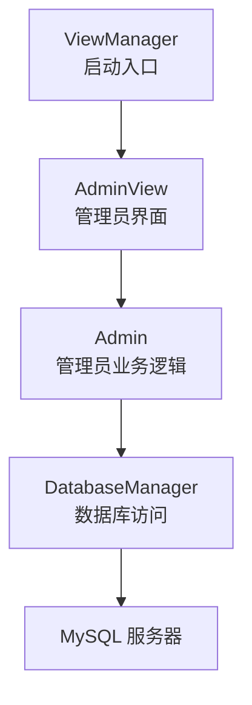
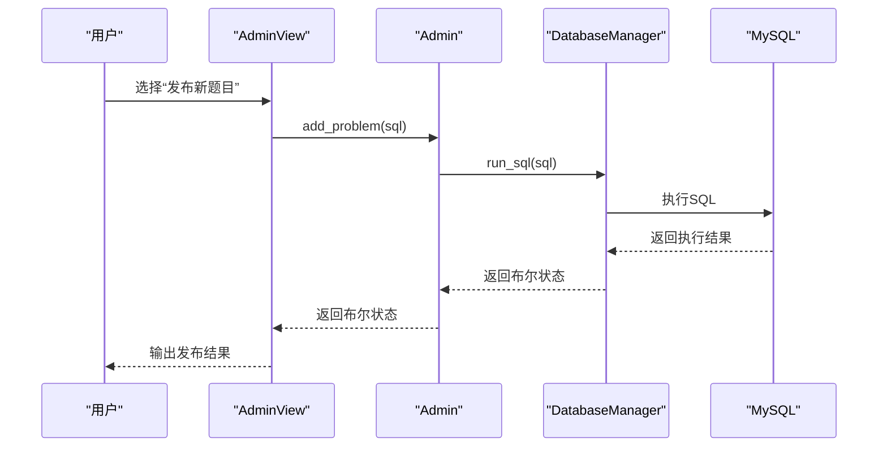
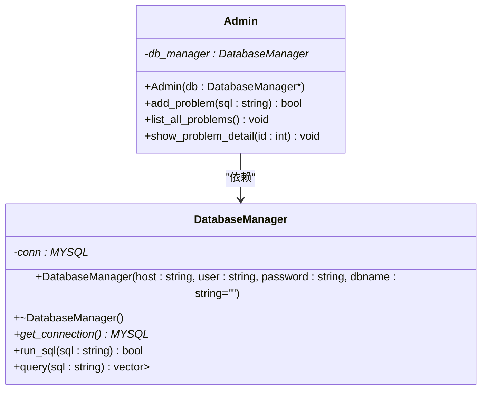
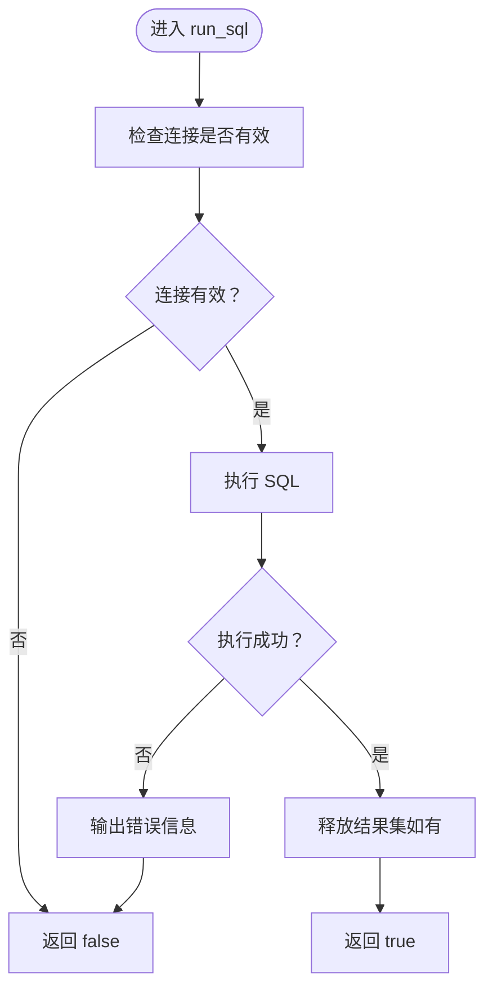
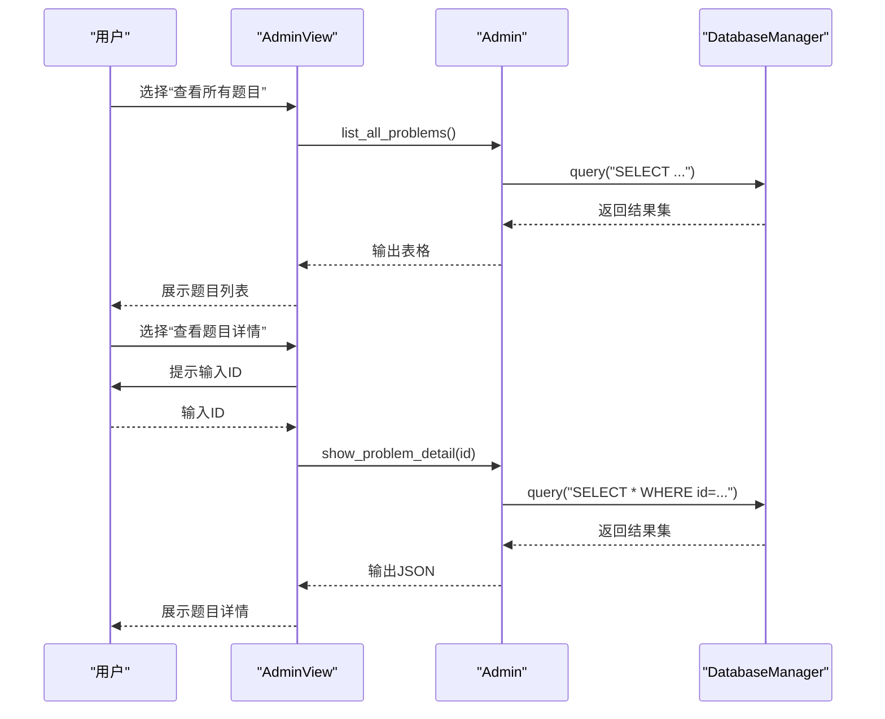
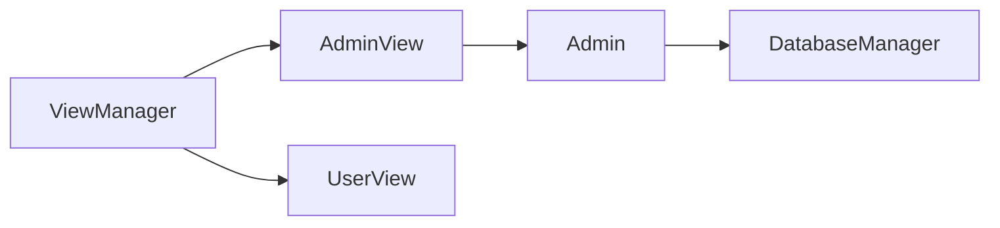

# 管理员API

<cite>
**本文引用的文件**
- [include/admin.h](file://include/admin.h)
- [src/admin.cpp](file://src/admin.cpp)
- [include/db_manager.h](file://include/db_manager.h)
- [src/db_manager.cpp](file://src/db_manager.cpp)
- [include/admin_view.h](file://include/admin_view.h)
- [src/admin_view.cpp](file://src/admin_view.cpp)
- [include/view_manager.h](file://include/view_manager.h)
- [src/main.cpp](file://src/main.cpp)
- [init.sql](file://init.sql)
</cite>

## 目录
1. [简介](#简介)
2. [项目结构](#项目结构)
3. [核心组件](#核心组件)
4. [架构总览](#架构总览)
5. [详细组件分析](#详细组件分析)
6. [依赖关系分析](#依赖关系分析)
7. [性能考量](#性能考量)
8. [故障排查指南](#故障排查指南)
9. [结论](#结论)
10. [附录](#附录)

## 简介
本文件面向管理员模块的API文档，聚焦于Admin类的公共接口设计与实现细节，包括：
- 构造函数：接收DatabaseManager指针，建立与数据库层的耦合关系
- add_problem()：执行管理员输入的SQL，用于发布题目
- list_all_problems()：列出所有题目的简要信息
- show_problem_detail()：按题目ID查询并以JSON格式输出题目详情

文档同时解释与DatabaseManager的交互关系、SQL执行流程、错误处理策略以及最佳实践建议，并提供基于源码的使用示例路径，帮助开发者快速理解与正确使用该模块。

## 项目结构
管理员模块位于命令行OJ系统中，采用分层架构：
- 表现层：AdminView负责菜单交互与输入输出
- 业务层：Admin封装管理员业务逻辑
- 数据访问层：DatabaseManager封装MySQL连接与SQL执行

图表来源
- [src/main.cpp:5-12](file://src/main.cpp#L5-L12)
- [include/view_manager.h:11-24](file://include/view_manager.h#L11-L24)
- [include/admin_view.h:11-24](file://include/admin_view.h#L11-L24)
- [include/admin.h:10-36](file://include/admin.h#L10-L36)
- [include/db_manager.h:12-46](file://include/db_manager.h#L12-L46)

章节来源
- [src/main.cpp:5-12](file://src/main.cpp#L5-L12)
- [include/view_manager.h:11-40](file://include/view_manager.h#L11-L40)
- [include/admin_view.h:11-55](file://include/admin_view.h#L11-L55)
- [include/admin.h:10-37](file://include/admin.h#L10-L37)
- [include/db_manager.h:12-46](file://include/db_manager.h#L12-L46)

## 核心组件
- Admin类：封装管理员业务逻辑，依赖DatabaseManager完成SQL执行与查询
- DatabaseManager类：封装MySQL连接、查询与执行，提供run_sql()与query()两个关键接口
- AdminView类：负责管理员菜单交互，调用Admin的方法并处理用户输入

章节来源
- [include/admin.h:10-37](file://include/admin.h#L10-L37)
- [src/admin.cpp:10-58](file://src/admin.cpp#L10-L58)
- [include/db_manager.h:12-46](file://include/db_manager.h#L12-L46)
- [src/db_manager.cpp:8-99](file://src/db_manager.cpp#L8-L99)
- [include/admin_view.h:11-55](file://include/admin_view.h#L11-L55)
- [src/admin_view.cpp:21-76](file://src/admin_view.cpp#L21-L76)

## 架构总览
管理员模块的调用链路如下：
- AdminView在启动时创建DatabaseManager并注入到Admin
- AdminView根据用户选择调用Admin的对应方法
- Admin通过DatabaseManager执行SQL或查询
- DatabaseManager封装MySQL底层调用，返回结果或布尔执行状态

图表来源
- [src/admin_view.cpp:112-131](file://src/admin_view.cpp#L112-L131)
- [src/admin.cpp:12-15](file://src/admin.cpp#L12-L15)
- [src/db_manager.cpp:21-24](file://src/db_manager.cpp#L21-L24)
- [src/db_manager.cpp:81-99](file://src/db_manager.cpp#L81-L99)

## 详细组件分析

### Admin类API规范
- 构造函数
  - 参数：DatabaseManager* db
  - 返回值：无（构造函数）
  - 作用：保存传入的数据库管理器指针，后续所有数据库操作均委托给它
  - 异常处理：无显式异常抛出；若db为nullptr，后续调用会直接返回默认值（见各方法实现）
  - 使用场景：在AdminView中创建Admin实例时传入已建立的DatabaseManager

- add_problem(const std::string& sql)
  - 参数：sql（std::string），管理员输入的SQL语句
  - 返回值：bool，true表示执行成功，false表示执行失败或db为空
  - 作用：将SQL语句交给DatabaseManager执行
  - 异常处理：内部不捕获异常；若db为空，直接返回false
  - 使用场景：管理员通过AdminView输入SQL并发布题目
  - 代码示例路径：[src/admin_view.cpp:112-131](file://src/admin_view.cpp#L112-L131)，[src/admin.cpp:12-15](file://src/admin.cpp#L12-L15)

- list_all_problems()
  - 参数：无
  - 返回值：void
  - 作用：查询problems表的简要字段并格式化输出
  - 异常处理：若查询结果为空，输出提示信息；若db为空，直接返回
  - 使用场景：管理员查看题目列表
  - 代码示例路径：[src/admin.cpp:17-41](file://src/admin.cpp#L17-L41)，[src/admin_view.cpp:91-95](file://src/admin_view.cpp#L91-L95)

- show_problem_detail(int id)
  - 参数：id（int），题目ID
  - 返回值：void
  - 作用：按ID查询题目详情并以JSON格式输出
  - 异常处理：若查询结果为空，输出未找到提示；若db为空，直接返回
  - 使用场景：管理员查看指定题目的完整信息
  - 代码示例路径：[src/admin.cpp:43-58](file://src/admin.cpp#L43-L58)，[src/admin_view.cpp:97-110](file://src/admin_view.cpp#L97-L110)

图表来源
- [include/admin.h:10-37](file://include/admin.h#L10-L37)
- [include/db_manager.h:12-46](file://include/db_manager.h#L12-L46)

章节来源
- [include/admin.h:10-37](file://include/admin.h#L10-L37)
- [src/admin.cpp:10-58](file://src/admin.cpp#L10-L58)

### DatabaseManager类API规范
- 构造函数
  - 参数：host, user, password, dbname（均为std::string）
  - 返回值：无
  - 作用：初始化并连接MySQL
  - 异常处理：连接失败时输出错误信息并返回空指针
  - 使用场景：AdminView中创建DatabaseManager实例

- run_sql(const std::string& sql)
  - 参数：sql（std::string）
  - 返回值：bool，true表示执行成功，false表示失败或连接为空
  - 作用：执行非查询SQL（如INSERT/UPDATE/DELETE/CREATE等）
  - 异常处理：执行失败时输出错误信息并返回false
  - 使用场景：Admin.add_problem()委托执行

- query(const std::string& sql)
  - 参数：sql（std::string）
  - 返回值：vector<map<string,string>>，每行以列名->值的形式存储
  - 作用：执行查询SQL并返回结果集
  - 异常处理：查询失败时输出错误信息并返回空结果集
  - 使用场景：Admin.list_all_problems()与Admin.show_problem_detail()

图表来源
- [src/db_manager.cpp:81-99](file://src/db_manager.cpp#L81-L99)

章节来源
- [include/db_manager.h:12-46](file://include/db_manager.h#L12-L46)
- [src/db_manager.cpp:8-99](file://src/db_manager.cpp#L8-L99)

### AdminView与交互流程
- AdminView在启动时创建DatabaseManager并注入Admin
- 根据用户选择调用Admin的方法
- 对用户输入进行基本校验（如ID必须为数字、SQL不能为空）

图表来源
- [src/admin_view.cpp:21-76](file://src/admin_view.cpp#L21-L76)
- [src/admin_view.cpp:91-110](file://src/admin_view.cpp#L91-L110)
- [src/admin.cpp:17-58](file://src/admin.cpp#L17-L58)
- [src/db_manager.cpp:26-57](file://src/db_manager.cpp#L26-L57)

章节来源
- [include/admin_view.h:11-55](file://include/admin_view.h#L11-L55)
- [src/admin_view.cpp:21-137](file://src/admin_view.cpp#L21-L137)

## 依赖关系分析
- Admin依赖DatabaseManager：Admin通过DatabaseManager执行SQL与查询
- AdminView依赖Admin与DatabaseManager：AdminView负责交互，AdminView创建DatabaseManager并注入Admin
- ViewManager作为入口：负责启动登录菜单并调度AdminView/UserView

图表来源
- [include/view_manager.h:11-24](file://include/view_manager.h#L11-L24)
- [include/admin_view.h:11-24](file://include/admin_view.h#L11-L24)
- [include/admin.h:10-36](file://include/admin.h#L10-L36)
- [include/db_manager.h:12-46](file://include/db_manager.h#L12-L46)

章节来源
- [include/view_manager.h:11-40](file://include/view_manager.h#L11-L40)
- [include/admin_view.h:11-55](file://include/admin_view.h#L11-L55)
- [include/admin.h:10-37](file://include/admin.h#L10-L37)
- [include/db_manager.h:12-46](file://include/db_manager.h#L12-L46)

## 性能考量
- 查询性能：list_all_problems()一次性查询所有题目，适合小规模数据；若题目量大，建议增加分页或索引优化
- JSON序列化：show_problem_detail()将结果转为JSON输出，注意大数据量时的序列化开销
- 连接复用：DatabaseManager在构造时建立连接并在析构时关闭，避免频繁连接/断开带来的开销
- SQL执行：run_sql()对非查询语句直接返回布尔状态，避免不必要的结果集处理

[本节为通用性能建议，不涉及具体文件分析]

## 故障排查指南
- 数据库连接失败
  - 现象：AdminView启动时报错，无法连接数据库
  - 排查：确认MySQL服务运行、账号密码正确、网络可达
  - 参考：[src/admin_view.cpp:27](file://src/admin_view.cpp#L27)，[src/db_manager.cpp:61-79](file://src/db_manager.cpp#L61-L79)

- SQL执行失败
  - 现象：add_problem()返回false或输出错误信息
  - 排查：检查SQL语法、权限、目标表是否存在
  - 参考：[src/admin.cpp:12-15](file://src/admin.cpp#L12-L15)，[src/db_manager.cpp:81-99](file://src/db_manager.cpp#L81-L99)

- 查询无结果
  - 现象：list_all_problems()显示空列表；show_problem_detail()提示未找到
  - 排查：确认ID是否正确、数据是否已插入
  - 参考：[src/admin.cpp:17-41](file://src/admin.cpp#L17-L41)，[src/admin.cpp:43-58](file://src/admin.cpp#L43-L58)

- 输入校验问题
  - 现象：输入非数字ID或空SQL导致异常
  - 排查：AdminView已做基础校验，确保输入符合要求
  - 参考：[src/admin_view.cpp:100-107](file://src/admin_view.cpp#L100-L107)，[src/admin_view.cpp:119-122](file://src/admin_view.cpp#L119-L122)

章节来源
- [src/admin_view.cpp:27-76](file://src/admin_view.cpp#L27-L76)
- [src/admin.cpp:12-58](file://src/admin.cpp#L12-L58)
- [src/db_manager.cpp:61-99](file://src/db_manager.cpp#L61-L99)

## 结论
Admin类提供了简洁明确的管理员功能接口，通过DatabaseManager实现与MySQL的交互。其设计遵循单一职责原则：Admin专注于业务逻辑，DatabaseManager专注于数据访问。配合AdminView的交互层，形成了完整的管理员工作流。建议在生产环境中进一步增强SQL安全（如参数化查询）、日志记录与异常恢复能力。

[本节为总结性内容，不涉及具体文件分析]

## 附录

### 使用示例（基于源码路径）
- 创建Admin实例
  - 在AdminView中创建DatabaseManager并注入Admin
  - 参考：[src/admin_view.cpp:27](file://src/admin_view.cpp#L27)，[src/admin_view.cpp:31](file://src/admin_view.cpp#L31)

- 发布题目（执行SQL）
  - 通过AdminView输入SQL并调用Admin.add_problem()
  - 参考：[src/admin_view.cpp:112-131](file://src/admin_view.cpp#L112-L131)，[src/admin.cpp:12-15](file://src/admin.cpp#L12-L15)

- 查看题目列表
  - 调用Admin.list_all_problems()并由AdminView触发
  - 参考：[src/admin_view.cpp:91-95](file://src/admin_view.cpp#L91-L95)，[src/admin.cpp:17-41](file://src/admin.cpp#L17-L41)

- 获取题目详情
  - 通过AdminView输入ID并调用Admin.show_problem_detail()
  - 参考：[src/admin_view.cpp:97-110](file://src/admin_view.cpp#L97-L110)，[src/admin.cpp:43-58](file://src/admin.cpp#L43-L58)

### 数据库初始化与权限
- 初始化脚本包含数据库、表结构、示例数据与用户权限配置
- 参考：[init.sql:8-94](file://init.sql#L8-L94)

章节来源
- [src/admin_view.cpp:27-31](file://src/admin_view.cpp#L27-L31)
- [src/admin_view.cpp:91-131](file://src/admin_view.cpp#L91-L131)
- [src/admin.cpp:12-58](file://src/admin.cpp#L12-L58)
- [init.sql:8-94](file://init.sql#L8-L94)