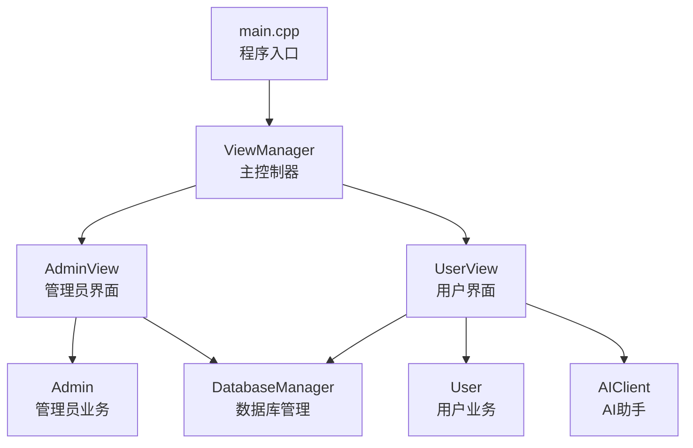
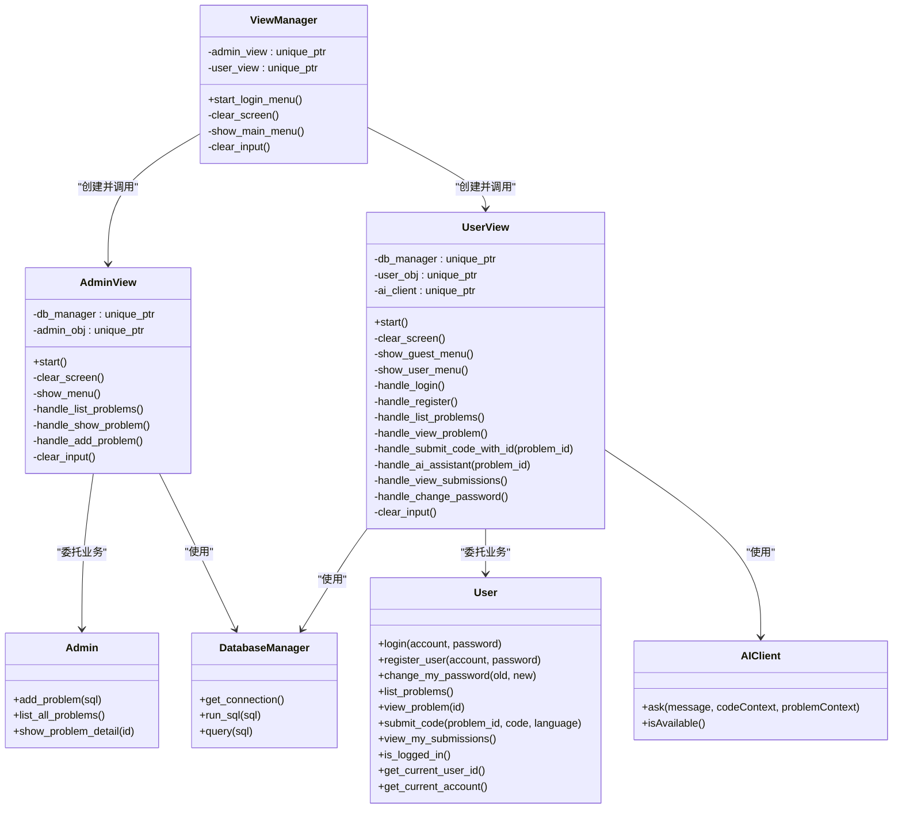
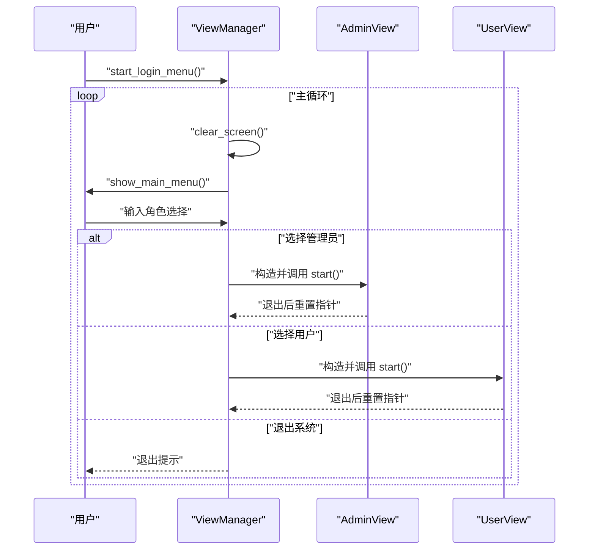
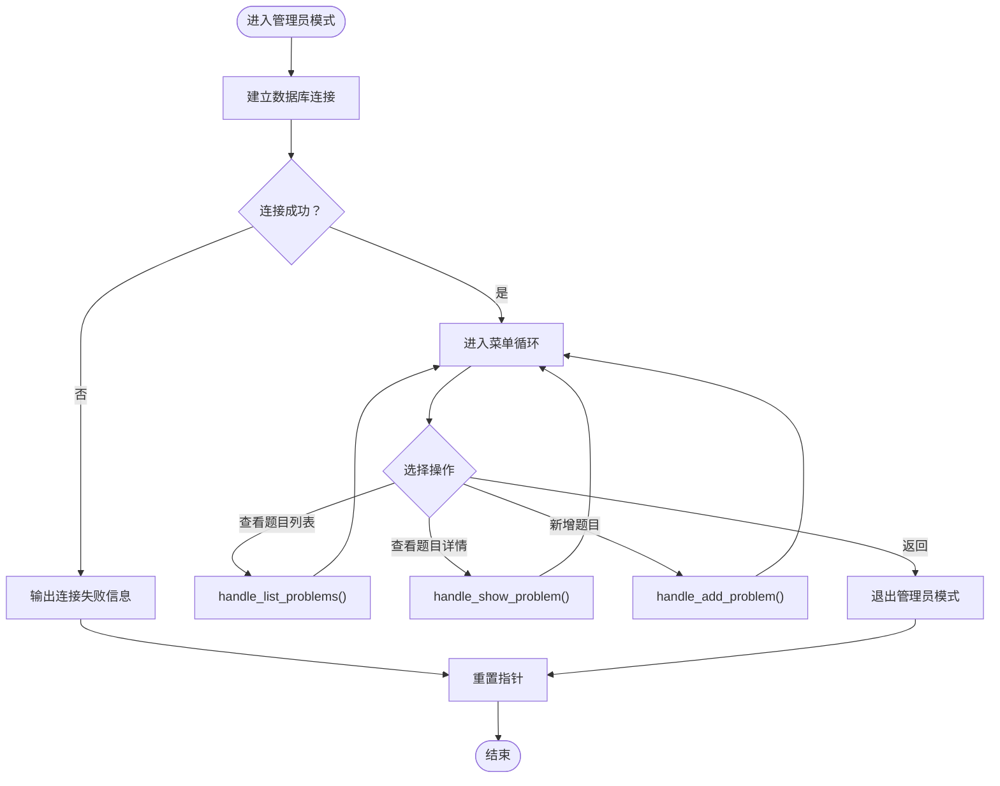
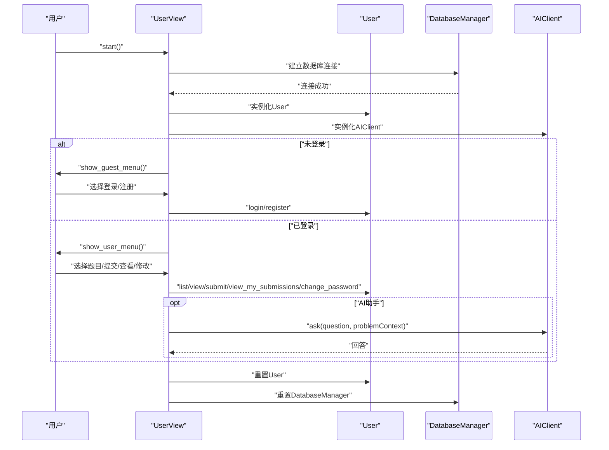
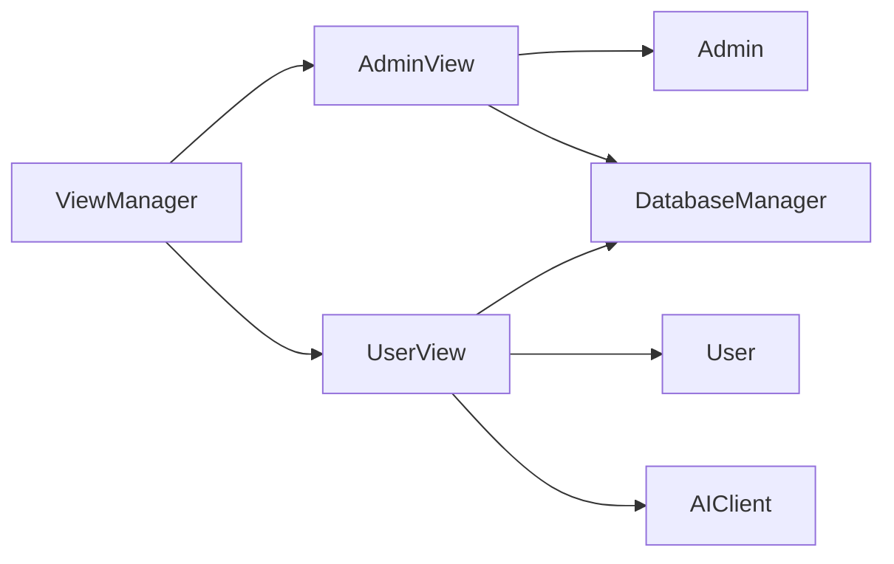

# 视图管理器API

<cite>
**本文档引用的文件**
- [view_manager.h](file://include/view_manager.h)
- [view_manager.cpp](file://src/view_manager.cpp)
- [admin_view.h](file://include/admin_view.h)
- [admin_view.cpp](file://src/admin_view.cpp)
- [user_view.h](file://include/user_view.h)
- [user_view.cpp](file://src/user_view.cpp)
- [admin.h](file://include/admin.h)
- [user.h](file://include/user.h)
- [db_manager.h](file://include/db_manager.h)
- [color_codes.h](file://include/color_codes.h)
- [ai_client.h](file://include/ai_client.h)
- [main.cpp](file://src/main.cpp)
</cite>

## 目录
1. [简介](#简介)
2. [项目结构](#项目结构)
3. [核心组件](#核心组件)
4. [架构总览](#架构总览)
5. [详细组件分析](#详细组件分析)
6. [依赖关系分析](#依赖关系分析)
7. [性能考虑](#性能考虑)
8. [故障排除指南](#故障排除指南)
9. [结论](#结论)

## 简介
本文件为视图管理器的API文档，聚焦于ViewManager类及其与AdminView、UserView的协作机制。文档详细说明：
- 角色切换流程（管理员/用户）
- 菜单导航与用户界面管理
- 控制器模式实现（ViewManager作为主控制器）
- 视图生命周期管理（创建、启动、销毁）
- 与AdminView、UserView的协调工作机制
- 界面切换逻辑与用户体验优化
- 典型使用示例与最佳实践

## 项目结构
该项目采用分层设计，核心入口位于main.cpp，通过ViewManager统一调度AdminView与UserView；AdminView与UserView分别封装各自的业务菜单与交互逻辑；底层通过DatabaseManager与MySQL交互，并可选集成AI客户端。

图表来源
- [main.cpp:5-13](file://src/main.cpp#L5-L13)
- [view_manager.h:11-40](file://include/view_manager.h#L11-L40)
- [admin_view.h:11-55](file://include/admin_view.h#L11-L55)
- [user_view.h:12-89](file://include/user_view.h#L12-L89)
- [admin.h:10-37](file://include/admin.h#L10-L37)
- [user.h:10-86](file://include/user.h#L10-L86)
- [db_manager.h:12-46](file://include/db_manager.h#L12-L46)
- [ai_client.h:6-25](file://include/ai_client.h#L6-L25)

章节来源
- [main.cpp:1-14](file://src/main.cpp#L1-L14)
- [view_manager.h:1-43](file://include/view_manager.h#L1-L43)
- [admin_view.h:1-58](file://include/admin_view.h#L1-L58)
- [user_view.h:1-92](file://include/user_view.h#L1-L92)

## 核心组件
- ViewManager：命令行界面主控制器，负责登录菜单展示、角色选择、视图实例化与生命周期管理。
- AdminView：管理员模式界面，提供题目列表、详情查看、新增题目的管理功能。
- UserView：用户模式界面，支持登录/注册、题目浏览、提交代码、查看提交记录、修改密码等。
- Admin/User：封装具体业务逻辑，与DatabaseManager交互。
- DatabaseManager：数据库连接与SQL执行封装。
- AIClient：可选AI助手客户端，用于提供编程问题解答。
- Color Codes：ANSI颜色常量，用于美化输出。

章节来源
- [view_manager.h:11-40](file://include/view_manager.h#L11-L40)
- [admin_view.h:11-55](file://include/admin_view.h#L11-L55)
- [user_view.h:12-89](file://include/user_view.h#L12-L89)
- [admin.h:10-37](file://include/admin.h#L10-L37)
- [user.h:10-86](file://include/user.h#L10-L86)
- [db_manager.h:12-46](file://include/db_manager.h#L12-L46)
- [ai_client.h:6-25](file://include/ai_client.h#L6-L25)
- [color_codes.h:5-15](file://include/color_codes.h#L5-L15)

## 架构总览
ViewManager采用控制器模式，作为顶层协调者：
- 负责清屏、菜单渲染、输入校验与异常处理
- 根据用户选择创建AdminView或UserView实例
- 调用对应视图的start()进入主循环
- 视图内部完成业务菜单与交互，完成后重置指针回到ViewManager

图表来源
- [view_manager.h:11-40](file://include/view_manager.h#L11-L40)
- [admin_view.h:11-55](file://include/admin_view.h#L11-L55)
- [user_view.h:12-89](file://include/user_view.h#L12-L89)
- [admin.h:10-37](file://include/admin.h#L10-L37)
- [user.h:10-86](file://include/user.h#L10-L86)
- [db_manager.h:12-46](file://include/db_manager.h#L12-L46)
- [ai_client.h:6-25](file://include/ai_client.h#L6-L25)

## 详细组件分析

### ViewManager 类
- 角色切换与菜单导航
  - start_login_menu()：循环显示主菜单，接收用户输入，根据选项创建AdminView或UserView并调用其start()，随后重置指针回到主菜单。
  - show_main_menu()：渲染登录菜单标题与选项。
- 用户界面管理
  - clear_screen()：使用ANSI转义序列清屏并移动光标至左上角。
  - clear_input()：清理输入缓冲区，避免格式错误导致的死循环。
- 生命周期管理
  - 构造与析构：持有AdminView与UserView的智能指针，确保在视图退出后自动释放。
- 控制器模式实现
  - ViewManager作为顶层控制器，不直接处理业务，仅负责视图实例化与控制流调度。

图表来源
- [view_manager.cpp:32-70](file://src/view_manager.cpp#L32-L70)
- [admin_view.cpp:21-76](file://src/admin_view.cpp#L21-L76)
- [user_view.cpp:21-116](file://src/user_view.cpp#L21-L116)

章节来源
- [view_manager.h:11-40](file://include/view_manager.h#L11-L40)
- [view_manager.cpp:14-76](file://src/view_manager.cpp#L14-L76)

### AdminView 类
- 主要职责
  - start()：建立数据库连接，实例化Admin对象，进入管理员菜单循环；支持查看题目列表、查看题目详情、新增题目；退出时释放资源。
  - show_menu()：渲染管理员操作面板。
- 业务处理
  - handle_list_problems()：列出所有题目。
  - handle_show_problem()：根据ID查看题目详情。
  - handle_add_problem()：执行管理员输入的SQL发布新题目。
- 输入与异常处理
  - clear_input()：清理输入缓冲区，防止非数字输入导致异常。
- 视图生命周期
  - 在start()中创建Admin与DatabaseManager，在退出时重置。

图表来源
- [admin_view.cpp:21-76](file://src/admin_view.cpp#L21-L76)
- [admin_view.cpp:91-131](file://src/admin_view.cpp#L91-L131)

章节来源
- [admin_view.h:11-55](file://include/admin_view.h#L11-L55)
- [admin_view.cpp:14-137](file://src/admin_view.cpp#L14-L137)
- [admin.h:10-37](file://include/admin.h#L10-L37)

### UserView 类
- 主要职责
  - start()：建立数据库连接，实例化User与AIClient，进入用户菜单循环；根据登录状态动态显示游客菜单或用户菜单；支持登录/注册、题目浏览、提交代码、查看提交记录、修改密码；退出时释放资源。
  - show_guest_menu()/show_user_menu()：根据登录状态渲染不同菜单。
- 业务处理
  - handle_login()/handle_register()：用户认证与注册。
  - handle_list_problems()/handle_view_problem()：题目浏览与详情查看。
  - handle_submit_code_with_id()：提交代码（C++）。
  - handle_ai_assistant()：调用AIClient进行问题解答。
  - handle_view_submissions()/handle_change_password()：查看提交记录与修改密码。
- 输入与异常处理
  - clear_input()：清理输入缓冲区。
- 视图生命周期
  - 在start()中创建User与DatabaseManager，在退出时重置。

图表来源
- [user_view.cpp:21-116](file://src/user_view.cpp#L21-L116)
- [user_view.cpp:144-196](file://src/user_view.cpp#L144-L196)
- [user_view.cpp:198-259](file://src/user_view.cpp#L198-L259)
- [user_view.cpp:261-273](file://src/user_view.cpp#L261-L273)
- [user_view.cpp:275-311](file://src/user_view.cpp#L275-L311)
- [user_view.cpp:313-345](file://src/user_view.cpp#L313-L345)

章节来源
- [user_view.h:12-89](file://include/user_view.h#L12-L89)
- [user_view.cpp:14-351](file://src/user_view.cpp#L14-L351)
- [user.h:10-86](file://include/user.h#L10-L86)
- [ai_client.h:6-25](file://include/ai_client.h#L6-L25)

### 角色工厂方法与视图生命周期
- 角色工厂方法
  - ViewManager在start_login_menu()中根据用户选择“创建”AdminView或UserView实例，形成简单的工厂方法模式。
- 视图生命周期
  - AdminView/UserView在start()中创建内部对象（如Admin/User、DatabaseManager、AIClient），在退出时重置，确保资源释放与状态复位。

章节来源
- [view_manager.cpp:52-61](file://src/view_manager.cpp#L52-L61)
- [admin_view.cpp:27-31](file://src/admin_view.cpp#L27-L31)
- [user_view.cpp:31-32](file://src/user_view.cpp#L31-L32)

### 菜单系统与用户交互
- 登录菜单（ViewManager）
  - 展示“管理员进入”、“用户进入”、“退出系统”，支持数字输入校验与异常处理。
- 管理员菜单（AdminView）
  - 支持“查看题目列表”、“查看题目详情（按ID）”、“新增题目（SQL）”、“返回登录菜单”。
- 用户菜单（UserView）
  - 未登录：支持“登录”、“注册”、“返回主菜单”。
  - 已登录：支持“查看题目列表”、“查看题目详情”、“查看我的提交”、“修改密码”、“退出登录”。

章节来源
- [view_manager.cpp:21-30](file://src/view_manager.cpp#L21-L30)
- [admin_view.cpp:78-89](file://src/admin_view.cpp#L78-L89)
- [user_view.cpp:118-142](file://src/user_view.cpp#L118-L142)

### 状态转换与用户体验优化
- 状态转换
  - 用户从登录菜单进入管理员或用户模式，再在各自模式下根据业务状态（登录/未登录）切换菜单。
- 用户体验优化
  - 清屏与颜色输出提升视觉体验。
  - 输入校验与异常处理减少误操作。
  - 子菜单（题目详情）提供“提交代码”和“AI助手”等便捷功能。

章节来源
- [view_manager.cpp:14-19](file://src/view_manager.cpp#L14-L19)
- [color_codes.h:5-15](file://include/color_codes.h#L5-L15)
- [user_view.cpp:222-258](file://src/user_view.cpp#L222-L258)

## 依赖关系分析
- 组件耦合
  - ViewManager与AdminView/UserView为组合关系，通过智能指针管理生命周期。
  - AdminView/UserView均依赖DatabaseManager与业务类（Admin/User）。
  - UserView可选依赖AIClient。
- 外部依赖
  - MySQL C API封装于DatabaseManager。
  - ANSI颜色常量用于输出美化。

图表来源
- [view_manager.h:23-24](file://include/view_manager.h#L23-L24)
- [admin_view.h:23-24](file://include/admin_view.h#L23-L24)
- [user_view.h:24-26](file://include/user_view.h#L24-L26)
- [admin.h:36](file://include/admin.h#L36)
- [user.h:82](file://include/user.h#L82)
- [db_manager.h:45](file://include/db_manager.h#L45)
- [ai_client.h:19-21](file://include/ai_client.h#L19-L21)

章节来源
- [view_manager.h:4-6](file://include/view_manager.h#L4-L6)
- [admin_view.h:4-6](file://include/admin_view.h#L4-L6)
- [user_view.h:4-7](file://include/user_view.h#L4-L7)

## 性能考虑
- I/O与清屏
  - 使用ANSI转义序列清屏，减少跨平台差异带来的性能损耗。
- 输入处理
  - 对输入进行格式校验与缓冲区清理，避免重复读取导致的阻塞。
- 资源管理
  - 智能指针确保视图退出后及时释放内存，降低内存泄漏风险。
- 数据库连接
  - 在进入各模式时建立连接，退出时释放，避免长连接占用资源。

## 故障排除指南
- 输入异常
  - 现象：输入非数字导致死循环。
  - 处理：调用clear_input()清理缓冲区，提示无效输入。
- 数据库连接失败
  - 现象：管理员/用户模式无法建立连接。
  - 处理：输出错误信息并重置指针，返回主菜单。
- AI助手不可用
  - 现象：调用AI助手时报错。
  - 处理：检查AI客户端可用性与配置，提示用户返回。

章节来源
- [view_manager.cpp:42-47](file://src/view_manager.cpp#L42-L47)
- [admin_view.cpp:71-75](file://src/admin_view.cpp#L71-L75)
- [user_view.cpp:111-115](file://src/user_view.cpp#L111-L115)
- [user_view.cpp:280-286](file://src/user_view.cpp#L280-L286)

## 结论
ViewManager作为控制器模式的典型实现，通过清晰的角色切换与菜单导航，将AdminView与UserView解耦并统一管理。配合Admin/User的业务封装与DatabaseManager/AIClient的基础设施，形成了简洁、可维护且具有良好用户体验的命令行界面体系。建议后续可引入更完善的日志与错误上报机制，进一步增强系统的可观测性与稳定性。