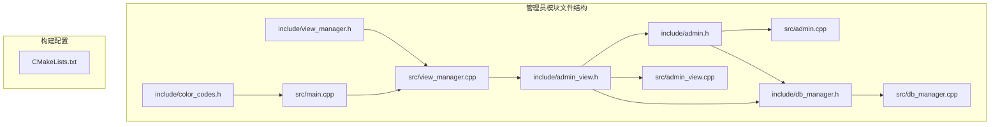
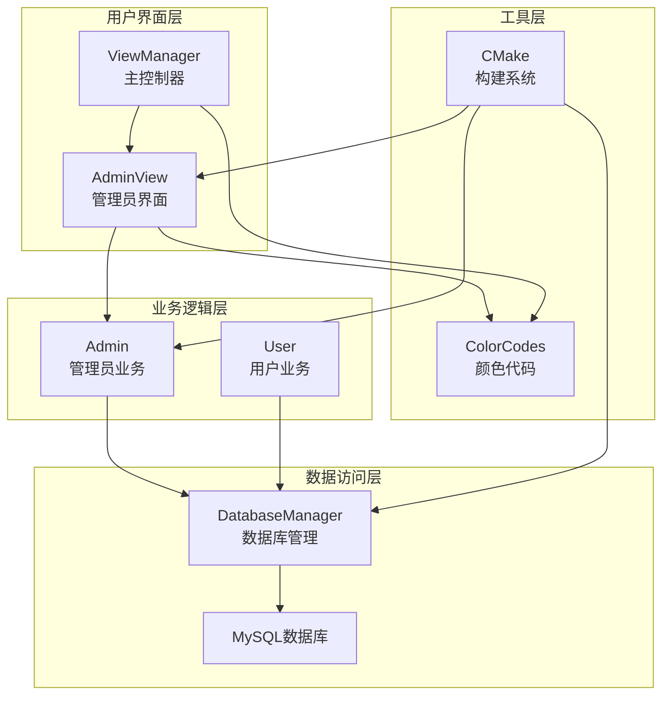
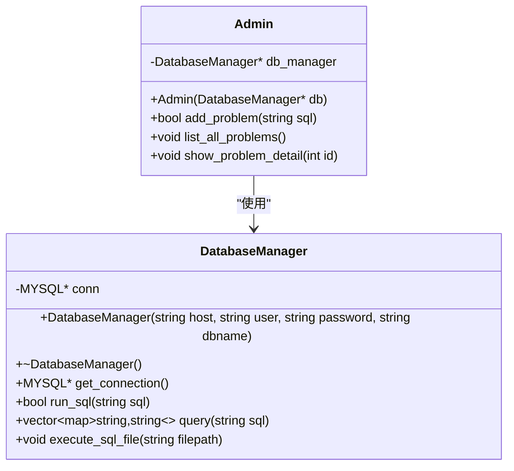
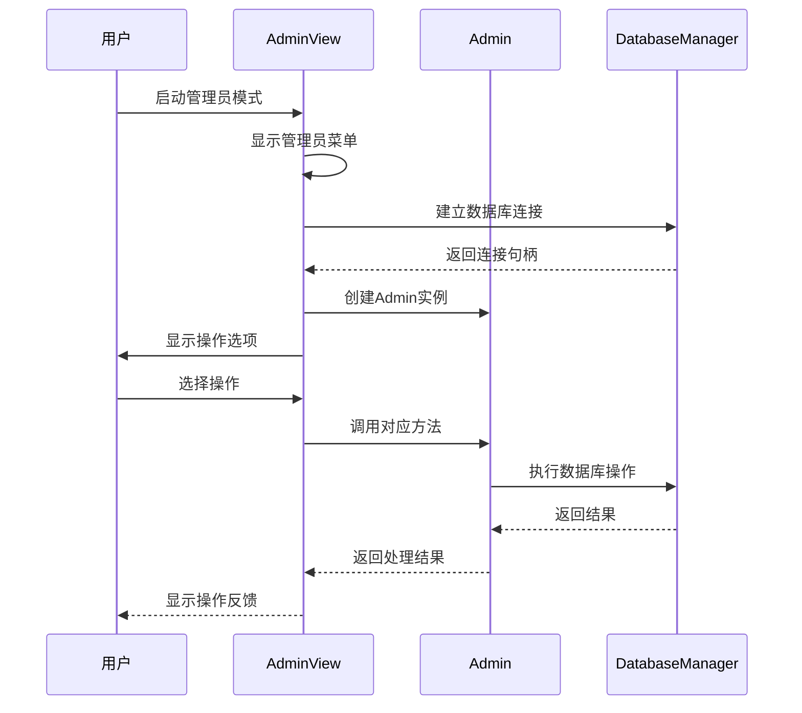
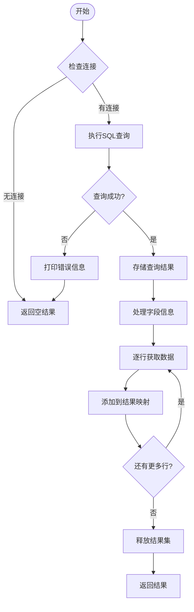
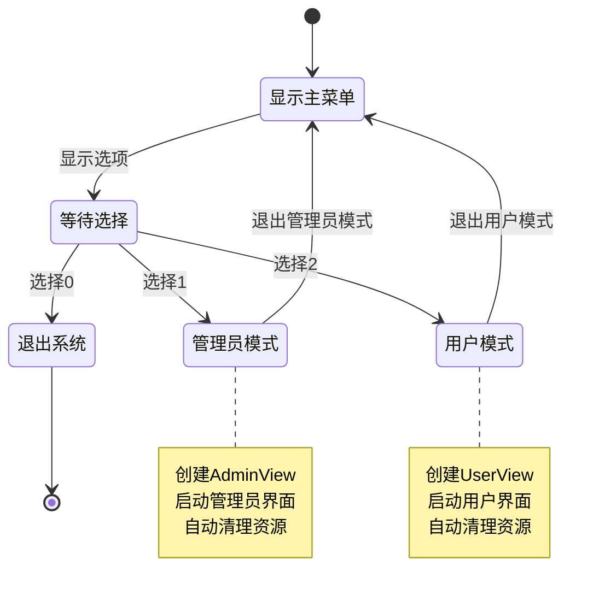
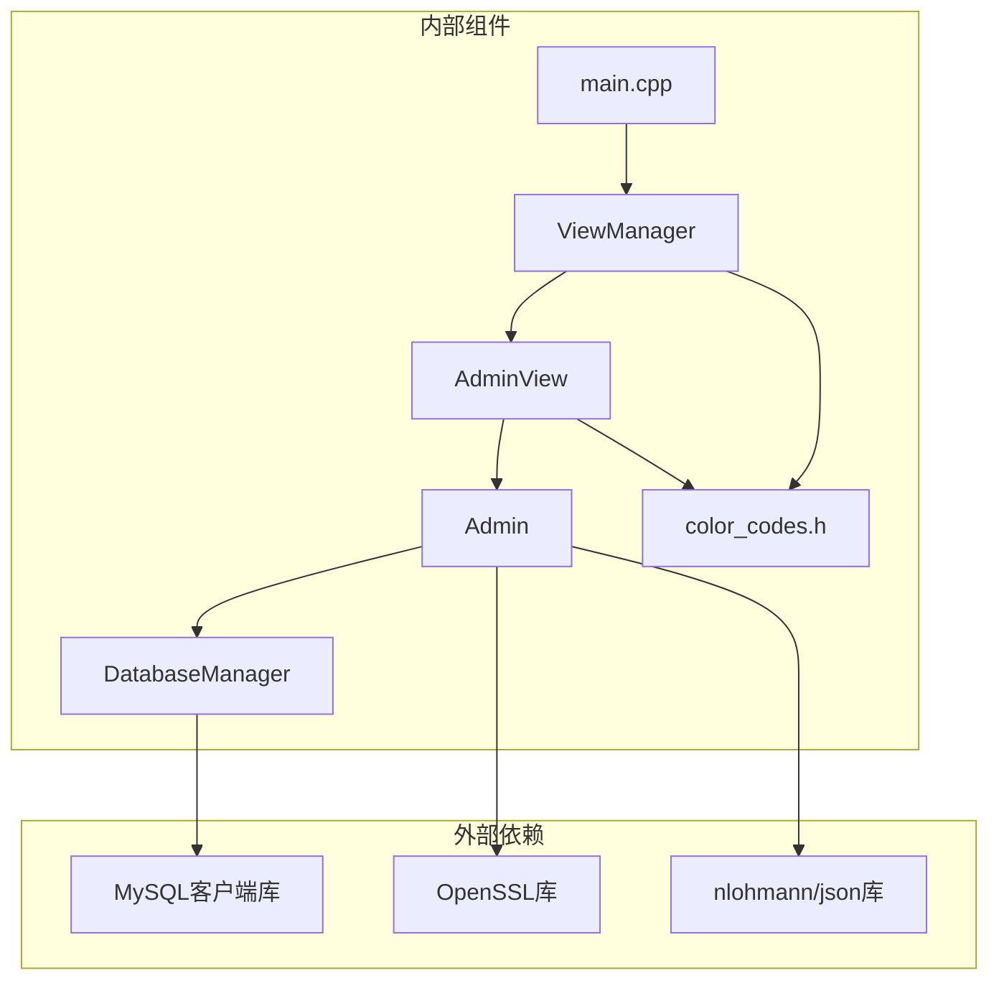

# 管理员模块

<cite>
**本文档引用的文件**
- [admin.h](file://include/admin.h)
- [admin.cpp](file://src/admin.cpp)
- [admin_view.h](file://include/admin_view.h)
- [admin_view.cpp](file://src/admin_view.cpp)
- [db_manager.h](file://include/db_manager.h)
- [db_manager.cpp](file://src/db_manager.cpp)
- [view_manager.h](file://include/view_manager.h)
- [view_manager.cpp](file://src/view_manager.cpp)
- [color_codes.h](file://include/color_codes.h)
- [main.cpp](file://src/main.cpp)
- [CMakeLists.txt](file://CMakeLists.txt)
</cite>

## 目录
1. [简介](#简介)
2. [项目结构](#项目结构)
3. [核心组件](#核心组件)
4. [架构概览](#架构概览)
5. [详细组件分析](#详细组件分析)
6. [依赖关系分析](#依赖关系分析)
7. [性能考虑](#性能考虑)
8. [故障排除指南](#故障排除指南)
9. [结论](#结论)

## 简介

管理员模块是在线判题系统(OJ)中的核心管理功能模块，主要负责题目的发布、管理和维护工作。该模块提供了管理员专用的操作界面，允许管理员执行SQL语句来发布新题目、查看所有题目列表以及查看特定题目的详细信息。

该模块采用面向对象的设计模式，通过清晰的职责分离实现了数据库操作与用户界面的解耦。管理员模块使用MySQL数据库作为数据存储，并通过DatabaseManager类提供统一的数据库访问接口。

## 项目结构

基于提供的项目结构，管理员模块位于以下关键文件中：

**图表来源**
- [admin.h:1-40](file://include/admin.h#L1-L40)
- [admin_view.h:1-53](file://include/admin_view.h#L1-L53)
- [db_manager.h:1-58](file://include/db_manager.h#L1-L58)
- [view_manager.h:1-43](file://include/view_manager.h#L1-L43)

**章节来源**
- [admin.h:1-40](file://include/admin.h#L1-L40)
- [admin_view.h:1-53](file://include/admin_view.h#L1-L53)
- [db_manager.h:1-58](file://include/db_manager.h#L1-L58)
- [view_manager.h:1-43](file://include/view_manager.h#L1-L43)
- [CMakeLists.txt:1-36](file://CMakeLists.txt#L1-L36)

## 核心组件

管理员模块由四个主要组件构成，每个组件都有明确的职责分工：

### 1. Admin类 (业务逻辑层)
- **职责**: 处理管理员特有的业务逻辑
- **核心功能**: 
  - 发布新题目 (执行SQL语句)
  - 查看所有题目列表
  - 查看题目详细信息

### 2. AdminView类 (界面控制层)
- **职责**: 管理管理员界面和用户交互
- **核心功能**:
  - 启动管理员模式
  - 显示管理员菜单
  - 处理用户输入和业务调用

### 3. DatabaseManager类 (数据访问层)
- **职责**: 封装数据库连接和SQL执行
- **核心功能**:
  - 数据库连接管理
  - SQL语句执行
  - 查询结果处理

### 4. ViewManager类 (应用协调层)
- **职责**: 管理整个应用程序的界面流程
- **核心功能**:
  - 主菜单显示
  - 角色选择处理
  - 界面切换控制

**章节来源**
- [admin.h:10-37](file://include/admin.h#L10-L37)
- [admin_view.h:11-50](file://include/admin_view.h#L11-L50)
- [db_manager.h:12-51](file://include/db_manager.h#L12-L51)
- [view_manager.h:11-40](file://include/view_manager.h#L11-L40)

## 架构概览

管理员模块采用了经典的三层架构设计，实现了业务逻辑、界面控制和数据访问的有效分离：

**图表来源**
- [admin_view.cpp:12-66](file://src/admin_view.cpp#L12-L66)
- [view_manager.cpp:28-66](file://src/view_manager.cpp#L28-L66)
- [admin.cpp:8-13](file://src/admin.cpp#L8-L13)
- [db_manager.cpp:8-20](file://src/db_manager.cpp#L8-L20)

该架构具有以下特点：
- **职责分离**: 每个组件都有明确的职责边界
- **接口清晰**: 组件间通过明确定义的接口进行通信
- **可扩展性**: 新增功能时只需扩展相应层次的组件
- **可测试性**: 每个组件都可以独立进行单元测试

## 详细组件分析

### Admin类详细分析

Admin类是管理员模块的核心业务逻辑类，负责处理所有与管理员相关的操作。

**图表来源**
- [admin.h:10-37](file://include/admin.h#L10-L37)
- [db_manager.h:12-51](file://include/db_manager.h#L12-L51)

#### 核心方法分析

1. **构造函数**: 接受DatabaseManager指针，建立与数据库管理器的关联
2. **add_problem方法**: 接收SQL语句并委托给DatabaseManager执行
3. **list_all_problems方法**: 查询所有题目并格式化输出
4. **show_problem_detail方法**: 根据ID查询特定题目并以JSON格式输出

**章节来源**
- [admin.cpp:8-56](file://src/admin.cpp#L8-L56)

### AdminView类详细分析

AdminView类负责管理员界面的所有交互逻辑，包括菜单显示、用户输入处理和业务调用。

**图表来源**
- [admin_view.cpp:12-66](file://src/admin_view.cpp#L12-L66)
- [admin.cpp:15-56](file://src/admin.cpp#L15-L56)

#### 界面流程分析

1. **启动流程**: 建立数据库连接 → 创建Admin对象 → 进入主循环
2. **菜单处理**: 显示菜单 → 读取用户选择 → 调用相应处理函数
3. **输入验证**: 数字输入验证 → SQL语句验证 → 错误处理
4. **资源管理**: 自动清理连接和对象

**章节来源**
- [admin_view.cpp:12-125](file://src/admin_view.cpp#L12-L125)

### DatabaseManager类详细分析

DatabaseManager类封装了所有数据库相关的操作，提供了统一的接口供上层组件使用。

**图表来源**
- [db_manager.cpp:27-58](file://src/db_manager.cpp#L27-L58)

#### 数据处理流程

1. **连接检查**: 确保数据库连接有效
2. **查询执行**: 使用mysql_query执行SQL语句
3. **结果处理**: 遍历结果集，构建键值对映射
4. **资源管理**: 正确释放数据库资源

**章节来源**
- [db_manager.cpp:27-101](file://src/db_manager.cpp#L27-L101)

### ViewManager类详细分析

ViewManager类作为应用程序的总控制器，管理整个系统的界面流程。

**图表来源**
- [view_manager.cpp:28-66](file://src/view_manager.cpp#L28-L66)

**章节来源**
- [view_manager.cpp:12-73](file://src/view_manager.cpp#L12-L73)

## 依赖关系分析

管理员模块的依赖关系体现了清晰的分层架构设计：

**图表来源**
- [main.cpp:1-12](file://src/main.cpp#L1-L12)
- [CMakeLists.txt:12-31](file://CMakeLists.txt#L12-L31)

### 依赖特性分析

1. **编译时依赖**: 通过CMakeLists.txt明确声明所有依赖项
2. **运行时依赖**: MySQL客户端库在运行时加载
3. **第三方库**: 使用nlohmann/json进行数据序列化
4. **系统库**: 使用OpenSSL进行密码哈希计算

**章节来源**
- [CMakeLists.txt:12-31](file://CMakeLists.txt#L12-L31)

## 性能考虑

管理员模块在设计时考虑了多个性能方面的因素：

### 1. 数据库连接优化
- 使用持久连接减少连接开销
- 合理的连接池管理策略
- 及时释放数据库资源避免内存泄漏

### 2. 查询性能优化
- 选择性查询避免全表扫描
- 合理使用LIMIT限制结果集大小
- 避免N+1查询问题

### 3. 内存管理
- 使用智能指针自动管理内存
- 及时清理临时数据结构
- 避免内存泄漏和重复分配

### 4. I/O操作优化
- 批量处理减少系统调用次数
- 合理的缓冲区大小设置
- 异步I/O操作的潜在支持

## 故障排除指南

### 常见问题及解决方案

#### 1. 数据库连接失败
**症状**: 管理员模式启动时报错"数据库连接失败"
**原因分析**:
- MySQL服务器未启动
- 管理员账号配置错误
- 网络连接问题
- 权限不足

**解决步骤**:
1. 检查MySQL服务状态
2. 验证管理员账号密码
3. 确认网络连通性
4. 检查用户权限设置

#### 2. SQL执行错误
**症状**: 添加题目时提示"输入错误"
**原因分析**:
- SQL语法错误
- 权限不足执行DDL语句
- 数据约束冲突
- 表结构不存在

**解决步骤**:
1. 检查SQL语句语法
2. 验证管理员权限
3. 确认表结构完整性
4. 查看具体错误信息

#### 3. 界面显示问题
**症状**: 菜单显示异常或颜色不正确
**原因分析**:
- 终端不支持ANSI颜色码
- 颜色代码定义错误
- 终端编码问题

**解决步骤**:
1. 检查终端颜色支持
2. 验证颜色代码常量
3. 更换兼容的终端

#### 4. 内存泄漏问题
**症状**: 程序运行时间越长内存占用越大
**原因分析**:
- 数据库结果集未正确释放
- 智能指针使用不当
- 异常情况下资源未释放

**解决步骤**:
1. 确保所有数据库操作都有异常处理
2. 检查RAII模式的正确使用
3. 使用内存检测工具进行排查

**章节来源**
- [admin_view.cpp:62-65](file://src/admin_view.cpp#L62-L65)
- [db_manager.cpp:13-20](file://src/db_manager.cpp#L13-L20)
- [db_manager.cpp:33-37](file://src/db_manager.cpp#L33-L37)

## 结论

管理员模块作为OJ系统的重要组成部分，展现了良好的软件工程实践：

### 设计优势
1. **清晰的分层架构**: 业务逻辑、界面控制、数据访问各司其职
2. **良好的封装性**: 组件间通过接口通信，降低耦合度
3. **可扩展性**: 新功能可以相对容易地添加到现有架构中
4. **可维护性**: 清晰的代码结构便于后续维护和升级

### 技术亮点
1. **现代化C++特性**: 使用智能指针、RAII等现代编程技术
2. **第三方库集成**: 合理使用nlohmann/json和OpenSSL等成熟库
3. **跨平台构建**: 通过CMake实现跨平台编译支持
4. **错误处理**: 完善的错误处理机制和用户友好的错误提示

### 改进建议
1. **安全性增强**: 考虑使用参数化查询防止SQL注入
2. **日志系统**: 添加详细的日志记录便于问题追踪
3. **单元测试**: 为关键组件添加单元测试提高代码质量
4. **配置管理**: 将数据库连接参数移到配置文件中

管理员模块为整个OJ系统提供了坚实的管理基础，其设计原则和实现方式为类似系统的开发提供了良好的参考价值。