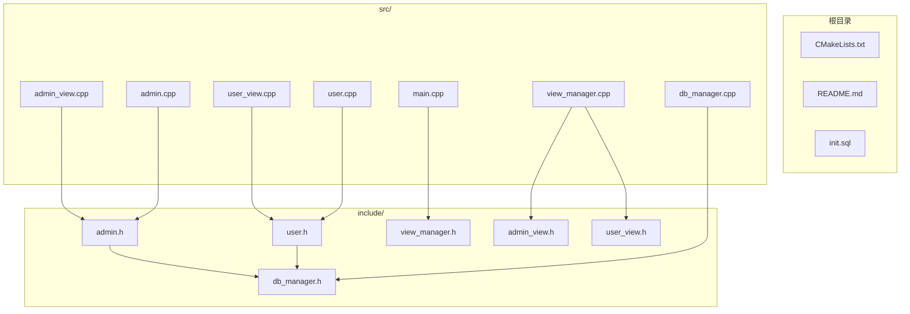
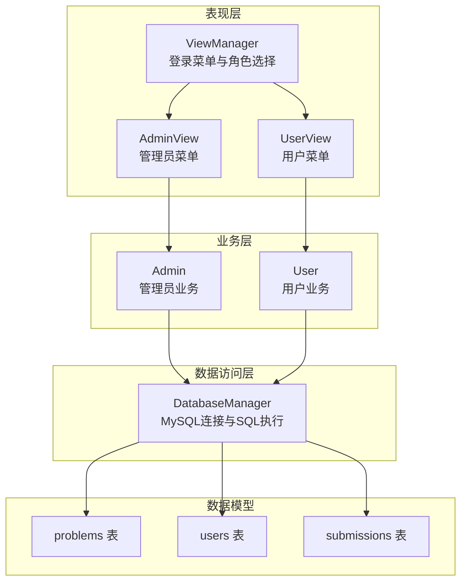
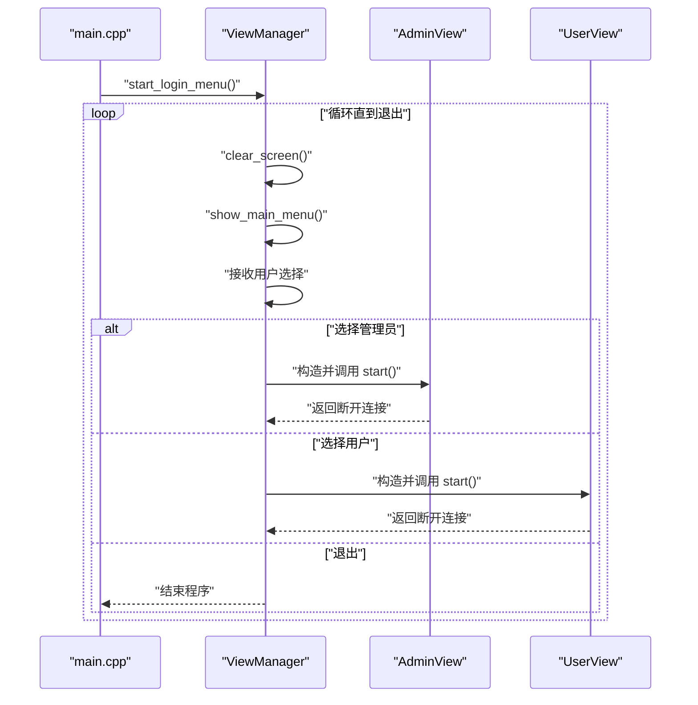
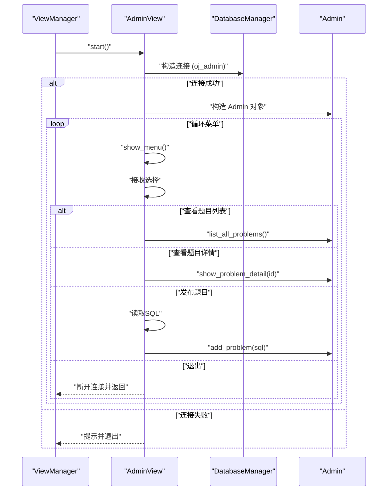
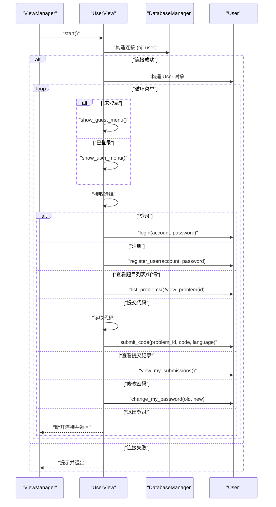
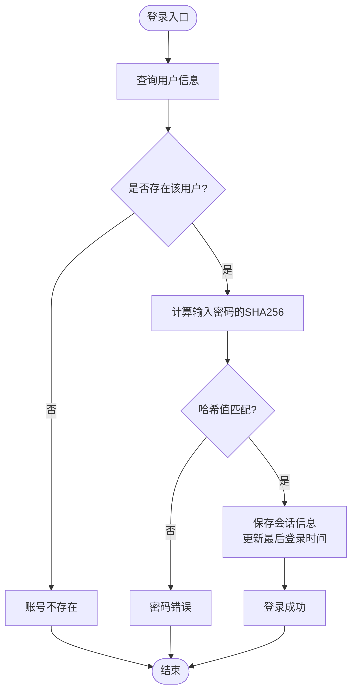
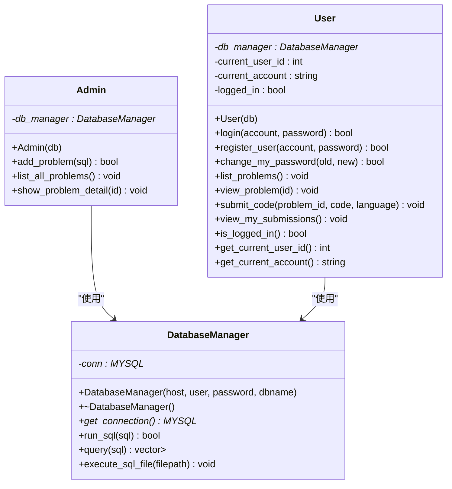
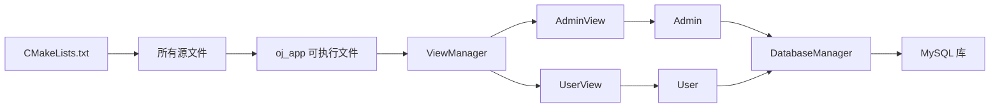

# 整体架构

<cite>
**本文档引用的文件**
- [README.md](file://README.md)
- [CMakeLists.txt](file://CMakeLists.txt)
- [init.sql](file://init.sql)
- [src/main.cpp](file://src/main.cpp)
- [include/db_manager.h](file://include/db_manager.h)
- [src/db_manager.cpp](file://src/db_manager.cpp)
- [include/admin.h](file://include/admin.h)
- [src/admin.cpp](file://src/admin.cpp)
- [include/user.h](file://include/user.h)
- [src/user.cpp](file://src/user.cpp)
- [include/view_manager.h](file://include/view_manager.h)
- [src/view_manager.cpp](file://src/view_manager.cpp)
- [include/admin_view.h](file://include/admin_view.h)
- [src/admin_view.cpp](file://src/admin_view.cpp)
- [include/user_view.h](file://include/user_view.h)
- [src/user_view.cpp](file://src/user_view.cpp)
</cite>

## 目录
1. [简介](#简介)
2. [项目结构](#项目结构)
3. [核心组件](#核心组件)
4. [架构总览](#架构总览)
5. [详细组件分析](#详细组件分析)
6. [依赖关系分析](#依赖关系分析)
7. [性能考虑](#性能考虑)
8. [故障排除指南](#故障排除指南)
9. [结论](#结论)

## 简介
本项目是一个基于命令行的在线评测系统（Online Judge，简称OJ），采用C++17编写，使用MySQL作为数据存储，并通过CMake进行构建管理。系统提供管理员与普通用户两种角色，分别具备不同的数据库访问权限与功能范围。管理员可以发布题目、查看题目列表与详情；普通用户可以登录/注册、浏览题目、提交代码以及查看个人提交记录等。

该系统遵循分层架构设计：
- 表现层：命令行界面（CLI）与菜单驱动的交互流程
- 业务层：管理员与用户两类业务对象，封装各自的功能逻辑
- 数据访问层：统一的数据库管理器，封装MySQL连接与SQL执行
- 数据模型：通过初始化脚本定义数据库结构（题目、用户、提交记录）

**章节来源**
- [README.md:1-2](file://README.md#L1-L2)
- [CMakeLists.txt:1-36](file://CMakeLists.txt#L1-L36)

## 项目结构
项目采用“头文件+源文件”的分离组织方式，按职责划分为以下模块：
- include/：公共头文件，定义接口与类声明
- src/：实现文件，包含各模块的具体实现
- 根目录：构建配置、初始化脚本与说明文档

**图表来源**
- [CMakeLists.txt:1-36](file://CMakeLists.txt#L1-L36)
- [src/main.cpp:1-12](file://src/main.cpp#L1-L12)
- [include/view_manager.h:1-43](file://include/view_manager.h#L1-L43)
- [include/admin_view.h:1-53](file://include/admin_view.h#L1-L53)
- [include/user_view.h:1-83](file://include/user_view.h#L1-L83)
- [include/admin.h:1-40](file://include/admin.h#L1-L40)
- [include/user.h:1-89](file://include/user.h#L1-L89)
- [include/db_manager.h:1-58](file://include/db_manager.h#L1-L58)

**章节来源**
- [CMakeLists.txt:1-36](file://CMakeLists.txt#L1-L36)
- [src/main.cpp:1-12](file://src/main.cpp#L1-L12)

## 核心组件
- 视图管理层（ViewManager）：负责启动登录菜单与角色选择，协调管理员与用户视图的生命周期
- 管理员视图（AdminView）：提供管理员菜单，支持查看题目列表、查看题目详情、发布题目
- 用户视图（UserView）：提供游客菜单与登录后的用户菜单，支持登录/注册、查看题目、提交代码、查看提交记录、修改密码
- 用户业务（User）：封装登录、注册、密码修改、题目浏览、代码提交、查看提交记录等业务逻辑
- 管理员业务（Admin）：封装发布题目、查看题目列表与详情等业务逻辑
- 数据库管理器（DatabaseManager）：封装MySQL连接、SQL执行、查询结果解析、批量执行SQL文件等功能

**章节来源**
- [include/view_manager.h:11-40](file://include/view_manager.h#L11-L40)
- [include/admin_view.h:11-50](file://include/admin_view.h#L11-L50)
- [include/user_view.h:11-80](file://include/user_view.h#L11-L80)
- [include/user.h:10-86](file://include/user.h#L10-L86)
- [include/admin.h:10-37](file://include/admin.h#L10-L37)
- [include/db_manager.h:12-51](file://include/db_manager.h#L12-L51)

## 架构总览
系统采用分层架构与职责分离的设计原则：
- 表现层：通过命令行菜单驱动用户交互，根据角色切换不同视图
- 业务层：管理员与用户两类业务对象封装各自领域逻辑
- 数据访问层：统一的数据库管理器屏蔽底层MySQL细节
- 数据模型：通过初始化脚本创建数据库与表结构，定义字段与约束

**图表来源**
- [src/view_manager.cpp:28-66](file://src/view_manager.cpp#L28-L66)
- [src/admin_view.cpp:12-66](file://src/admin_view.cpp#L12-L66)
- [src/user_view.cpp:17-109](file://src/user_view.cpp#L17-L109)
- [include/admin.h:10-37](file://include/admin.h#L10-L37)
- [include/user.h:10-86](file://include/user.h#L10-L86)
- [include/db_manager.h:12-51](file://include/db_manager.h#L12-L51)
- [init.sql:14-60](file://init.sql#L14-L60)

## 详细组件分析

### 视图管理层（ViewManager）
- 职责：启动登录菜单，接收用户角色选择，实例化并启动对应视图，负责清屏与输入缓冲区清理
- 关键流程：显示主菜单 → 接收选择 → 分发到管理员或用户视图 → 退出时重置指针
- 错误处理：对非法输入进行提示与缓冲区清理，避免阻塞后续输入

**图表来源**
- [src/main.cpp:3-11](file://src/main.cpp#L3-L11)
- [src/view_manager.cpp:28-66](file://src/view_manager.cpp#L28-L66)
- [src/admin_view.cpp:12-66](file://src/admin_view.cpp#L12-L66)
- [src/user_view.cpp:17-109](file://src/user_view.cpp#L17-L109)

**章节来源**
- [src/view_manager.cpp:12-73](file://src/view_manager.cpp#L12-L73)
- [include/view_manager.h:11-40](file://include/view_manager.h#L11-L40)

### 管理员视图（AdminView）
- 职责：以管理员身份连接数据库，提供菜单并处理题目相关操作
- 数据库连接：使用管理员账号（oj_admin）连接OJ数据库
- 功能：查看题目列表、查看题目详情、发布新题目（直接执行SQL）
- 错误处理：输入校验、SQL执行结果反馈、连接失败提示

**图表来源**
- [src/admin_view.cpp:12-66](file://src/admin_view.cpp#L12-L66)
- [src/admin.cpp:10-56](file://src/admin.cpp#L10-L56)
- [include/admin_view.h:11-50](file://include/admin_view.h#L11-L50)
- [include/admin.h:10-37](file://include/admin.h#L10-L37)

**章节来源**
- [src/admin_view.cpp:12-125](file://src/admin_view.cpp#L12-L125)
- [src/admin.cpp:10-56](file://src/admin.cpp#L10-L56)
- [include/admin_view.h:11-50](file://include/admin_view.h#L11-L50)
- [include/admin.h:10-37](file://include/admin.h#L10-L37)

### 用户视图（UserView）
- 职责：以受限权限连接数据库，提供游客菜单与登录后用户菜单
- 数据库连接：使用用户账号（oj_user）连接OJ数据库
- 功能：登录/注册、查看题目列表/详情、提交代码、查看提交记录、修改密码
- 错误处理：输入类型校验、登录状态判断、空输入处理

**图表来源**
- [src/user_view.cpp:17-109](file://src/user_view.cpp#L17-L109)
- [src/user.cpp:38-190](file://src/user.cpp#L38-L190)
- [include/user_view.h:11-80](file://include/user_view.h#L11-L80)
- [include/user.h:10-86](file://include/user.h#L10-L86)

**章节来源**
- [src/user_view.cpp:17-221](file://src/user_view.cpp#L17-L221)
- [src/user.cpp:38-190](file://src/user.cpp#L38-L190)
- [include/user_view.h:11-80](file://include/user_view.h#L11-L80)
- [include/user.h:10-86](file://include/user.h#L10-L86)

### 用户业务（User）
- 职责：封装用户登录、注册、密码修改、题目浏览、代码提交、查看提交记录等业务逻辑
- 安全性：使用SHA256对密码进行哈希存储与验证
- 会话管理：维护当前用户ID、账号与登录状态，并在登录成功后更新最后登录时间
- 待实现：题目列表、题目详情、代码提交、提交记录查看等功能标记为待实现

**图表来源**
- [src/user.cpp:38-74](file://src/user.cpp#L38-L74)

**章节来源**
- [src/user.cpp:9-36](file://src/user.cpp#L9-L36)
- [src/user.cpp:38-105](file://src/user.cpp#L38-L105)
- [src/user.cpp:107-146](file://src/user.cpp#L107-L146)
- [src/user.cpp:148-190](file://src/user.cpp#L148-L190)

### 管理员业务（Admin）
- 职责：封装管理员发布的题目、查看题目列表与详情等业务逻辑
- 数据查询：通过DatabaseManager执行SQL查询并格式化输出
- 数据展示：题目列表使用表格形式输出，题目详情使用JSON美化输出

**章节来源**
- [src/admin.cpp:10-56](file://src/admin.cpp#L10-L56)
- [include/admin.h:10-37](file://include/admin.h#L10-L37)

### 数据库管理器（DatabaseManager）
- 职责：封装MySQL连接、SQL执行、查询结果解析、批量执行SQL文件
- 连接管理：构造函数建立连接，析构函数关闭连接并释放资源
- 查询处理：支持查询结果转为键值映射的向量，便于上层业务层遍历与展示
- 文件执行：从SQL文件读取内容并按分号分割逐条执行，支持错误提示与成功反馈

**图表来源**
- [include/db_manager.h:12-51](file://include/db_manager.h#L12-L51)
- [src/db_manager.cpp:8-176](file://src/db_manager.cpp#L8-L176)
- [include/admin.h:10-37](file://include/admin.h#L10-L37)
- [include/user.h:10-86](file://include/user.h#L10-L86)

**章节来源**
- [src/db_manager.cpp:8-176](file://src/db_manager.cpp#L8-L176)
- [include/db_manager.h:12-51](file://include/db_manager.h#L12-L51)

## 依赖关系分析
- 构建依赖：CMake查找MySQL客户端库并链接，包含头文件目录，收集所有源文件生成可执行文件
- 运行时依赖：程序启动后根据角色选择加载对应的视图模块，视图模块再创建业务对象与数据库管理器
- 数据库依赖：通过初始化脚本创建数据库与表结构，定义管理员与普通用户账号及其权限

**图表来源**
- [CMakeLists.txt:11-31](file://CMakeLists.txt#L11-L31)
- [src/main.cpp:1-12](file://src/main.cpp#L1-12)

**章节来源**
- [CMakeLists.txt:11-31](file://CMakeLists.txt#L11-L31)
- [init.sql:67-96](file://init.sql#L67-L96)

## 性能考虑
- 查询性能：查询结果使用一次性获取并缓存到内存，适合中小规模数据；对于大量数据建议分页或限制返回行数
- 密码哈希：使用SHA256进行哈希存储，满足基本安全需求；如需更强安全性可考虑引入盐值与更安全的哈希算法
- 数据库连接：每个视图独立建立连接，避免共享连接带来的并发问题；在高并发场景下可考虑连接池
- I/O优化：批量SQL文件执行按分号分割，不支持引号内分号；建议在生产环境中使用事务包裹以保证一致性

[本节为通用指导，无需具体文件分析]

## 故障排除指南
- 数据库连接失败
  - 检查MySQL服务是否运行，确认主机、用户名、密码与数据库名正确
  - 确认管理员账号（oj_admin）与普通账号（oj_user）已按初始化脚本创建并授权
- 登录失败
  - 确认账号存在且密码正确；检查密码哈希是否一致
  - 若用户表无数据，可通过初始化脚本导入示例数据
- 提交代码报错
  - 确认已登录后再进行提交
  - 代码输入需以特定结束符结束，确保读取完整
- 权限不足
  - 普通用户账号仅授予只读或有限写权限，无法执行管理员操作
  - 管理员账号具备全权限，可执行题目发布与修改操作

**章节来源**
- [src/admin_view.cpp:62-65](file://src/admin_view.cpp#L62-L65)
- [src/user_view.cpp:104-108](file://src/user_view.cpp#L104-L108)
- [src/user.cpp:168-172](file://src/user.cpp#L168-L172)
- [init.sql:67-96](file://init.sql#L67-L96)

## 结论
本OJ系统通过清晰的分层架构实现了管理员与用户两大角色的功能划分，数据库管理器提供了统一的数据访问抽象，初始化脚本明确了数据库结构与权限配置。系统目前实现了基础的登录、注册、题目浏览与代码提交框架，部分功能仍处于待实现阶段。整体设计简洁、职责明确，便于后续扩展更多功能与提升性能。