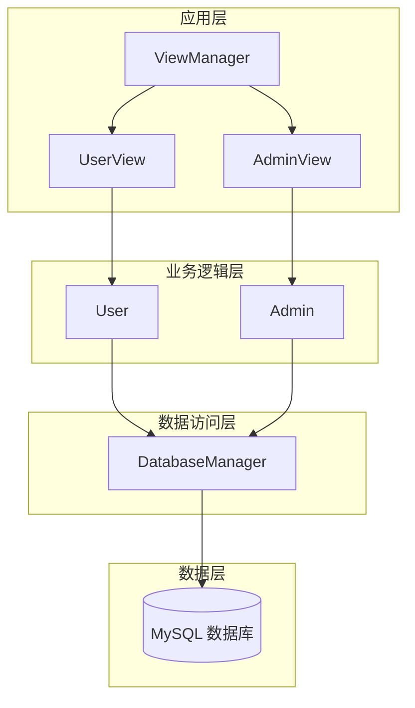
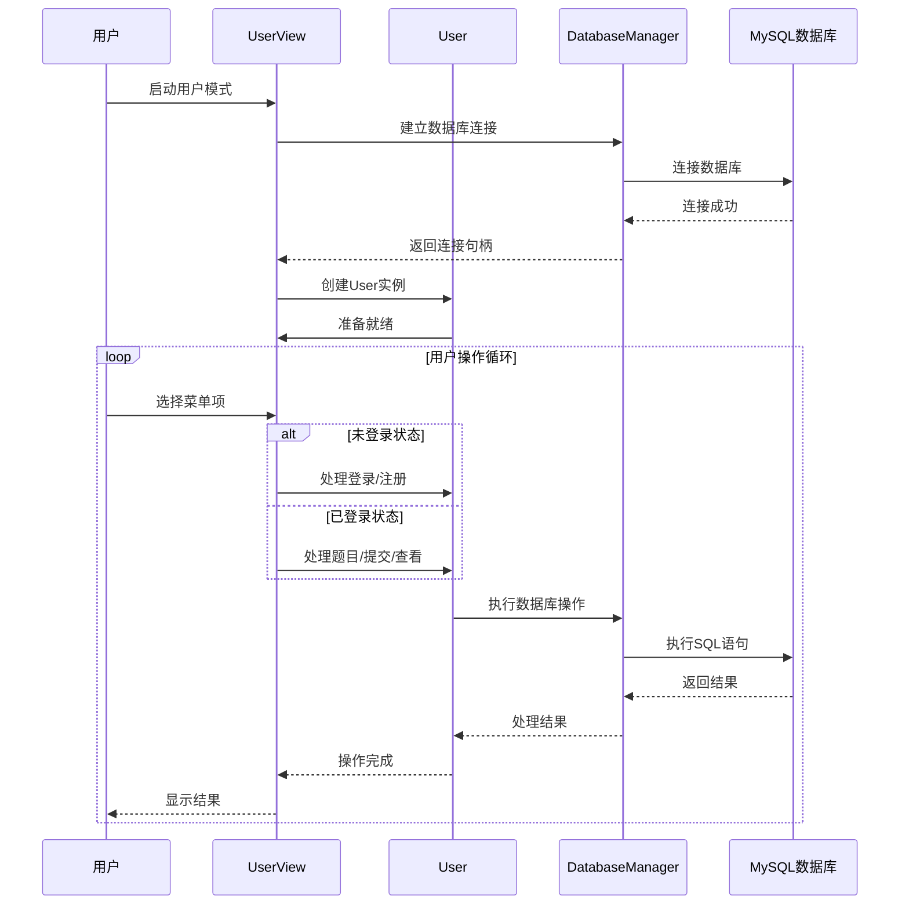
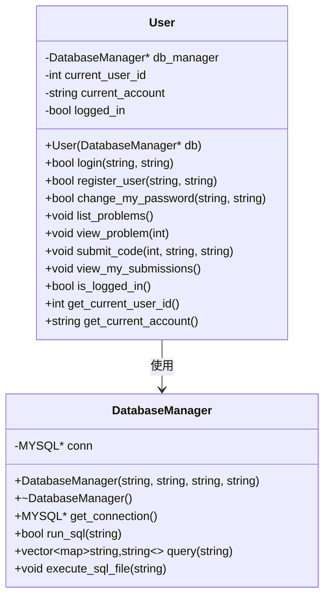
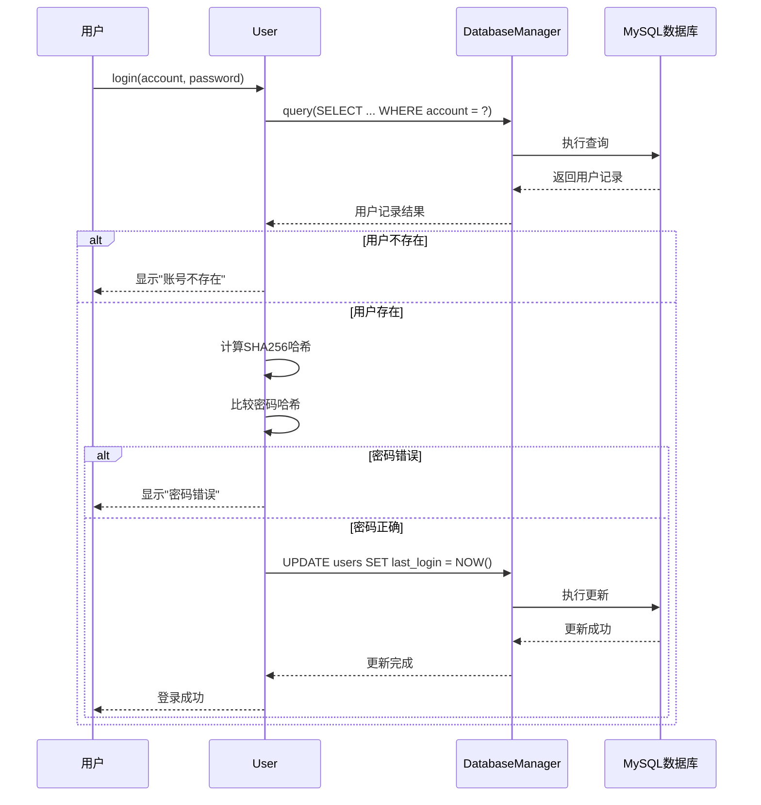
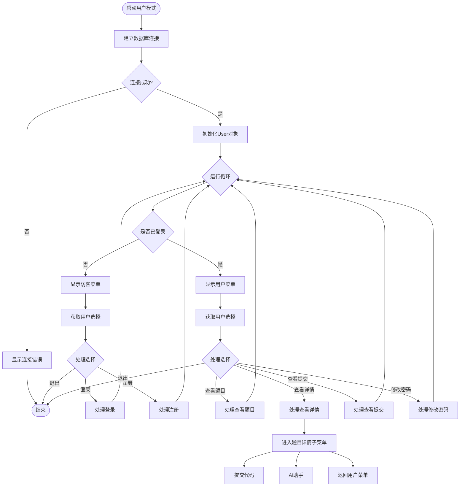
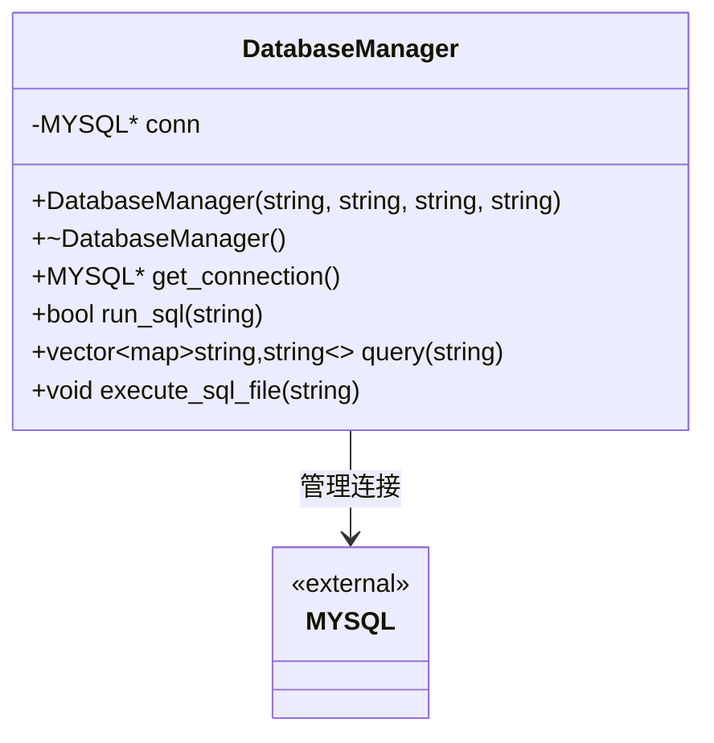
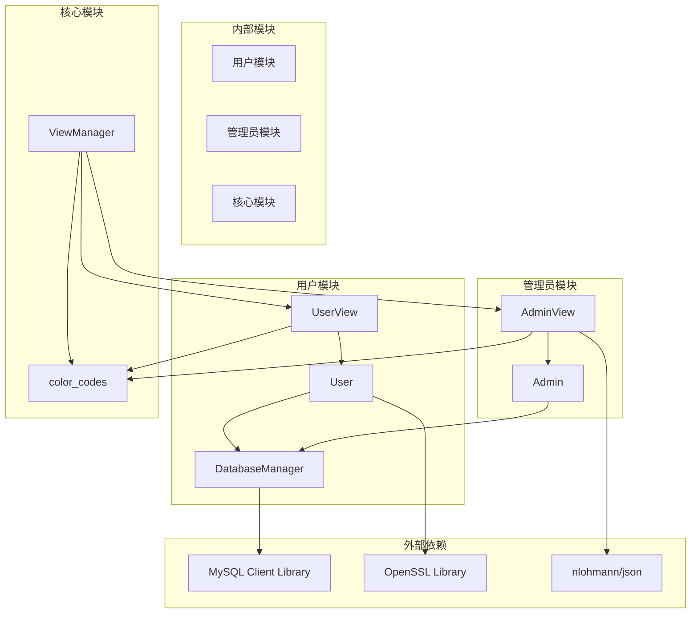
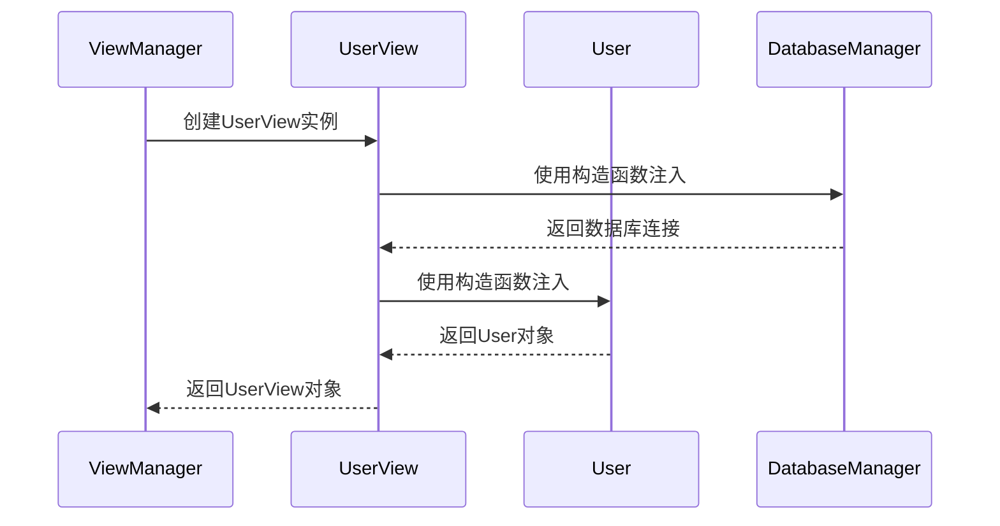

# 用户模块

<cite>
**本文档引用的文件**
- [user.h](file://include/user.h)
- [user.cpp](file://src/user.cpp)
- [user_view.h](file://include/user_view.h)
- [user_view.cpp](file://src/user_view.cpp)
- [db_manager.h](file://include/db_manager.h)
- [db_manager.cpp](file://src/db_manager.cpp)
- [view_manager.h](file://include/view_manager.h)
- [view_manager.cpp](file://src/view_manager.cpp)
- [admin.h](file://include/admin.h)
- [admin.cpp](file://src/admin.cpp)
- [admin_view.h](file://include/admin_view.h)
- [admin_view.cpp](file://src/admin_view.cpp)
- [color_codes.h](file://include/color_codes.h)
- [init.sql](file://init.sql)
- [CMakeLists.txt](file://CMakeLists.txt)
</cite>

## 更新摘要
**所做更改**
- 更新了用户认证系统功能描述，包含完整的注册、登录、密码修改流程
- 新增了SHA256密码哈希实现的详细分析
- 新增了子菜单功能的架构设计和实现细节
- 新增了代码提交和AI助手基础功能的技术规范
- 更新了数据库表结构和权限设计说明
- 完善了依赖关系和性能考虑章节

## 目录
1. [简介](#简介)
2. [项目结构](#项目结构)
3. [核心组件](#核心组件)
4. [架构概览](#架构概览)
5. [详细组件分析](#详细组件分析)
6. [依赖关系分析](#依赖关系分析)
7. [性能考虑](#性能考虑)
8. [故障排除指南](#故障排除指南)
9. [结论](#结论)

## 简介

用户模块是OJ在线判题系统的核心功能模块之一，主要负责处理普通用户的业务逻辑。该模块实现了用户认证、题目浏览、代码提交、提交记录查看等核心功能，为用户提供完整的在线编程练习体验。

**更新** v0.2版本引入了完整的用户认证系统，包括注册、登录、密码修改功能，并新增了子菜单架构、代码提交和AI助手基础功能。

系统采用分层架构设计，通过清晰的职责分离实现了良好的可维护性和扩展性。用户模块与数据库管理层紧密协作，通过统一的数据库管理接口访问底层数据存储。

## 项目结构

项目采用标准的分层架构组织，主要分为以下层次：

**图表来源**
- [view_manager.cpp:28-66](file://src/view_manager.cpp#L28-L66)
- [user_view.cpp:17-109](file://src/user_view.cpp#L17-L109)
- [admin_view.cpp:12-66](file://src/admin_view.cpp#L12-L66)

**章节来源**
- [CMakeLists.txt:1-36](file://CMakeLists.txt#L1-L36)
- [init.sql:1-143](file://init.sql#L1-L143)

## 核心组件

用户模块包含四个核心组件，每个组件都有明确的职责分工：

### 用户类 (User)
用户类是用户模块的核心业务逻辑类，负责处理所有用户相关的操作。它提供了完整的用户生命周期管理功能，包括身份验证、账户管理和日常操作。

**更新** 新增了完整的用户认证方法：`login()`、`register_user()`、`change_my_password()`，以及题目浏览、代码提交、提交记录查看等核心功能。

### 用户界面类 (UserView)
用户界面类负责处理用户交互逻辑，提供友好的命令行界面。它管理用户菜单显示、输入验证和操作流程控制。

**更新** 新增了子菜单架构，支持题目详情页面的二级菜单：提交代码、AI助手等功能。

### 数据库管理类 (DatabaseManager)
数据库管理类封装了所有数据库操作，提供统一的数据库访问接口。它处理连接管理、SQL执行和结果处理等底层细节。

### 视图管理器 (ViewManager)
视图管理器作为系统的入口点，协调不同角色的用户界面启动和切换。

**章节来源**
- [user.h:10-89](file://include/user.h#L10-L89)
- [user_view.h:11-90](file://include/user_view.h#L11-L90)
- [db_manager.h:12-53](file://include/db_manager.h#L12-L53)
- [view_manager.h:11-43](file://include/view_manager.h#L11-L43)

## 架构概览

用户模块采用经典的三层架构模式，实现了关注点分离和职责明确的系统设计：

**图表来源**
- [user_view.cpp:21-115](file://src/user_view.cpp#L21-L115)
- [user.cpp:39-137](file://src/user.cpp#L39-L137)
- [db_manager.cpp:21-57](file://src/db_manager.cpp#L21-L57)

系统架构的关键特点：

1. **分层设计**: 清晰的三层架构确保了各层之间的松耦合
2. **职责分离**: 每个类都有明确的职责边界
3. **接口抽象**: 通过统一接口简化了组件间的交互
4. **错误处理**: 完善的错误处理机制保证了系统的稳定性

## 详细组件分析

### 用户类详细分析

用户类是用户模块的核心，实现了完整的用户业务逻辑：

**图表来源**
- [user.h:10-89](file://include/user.h#L10-L89)
- [db_manager.h:12-53](file://include/db_manager.h#L12-L53)

#### 登录流程分析

用户登录是系统最核心的功能之一，涉及安全验证和会话管理：

**图表来源**
- [user.cpp:39-71](file://src/user.cpp#L39-L71)
- [db_manager.cpp:26-57](file://src/db_manager.cpp#L26-L57)

#### 密码哈希实现

系统使用SHA256算法对用户密码进行安全哈希存储：

**更新** 新增了完整的SHA256哈希实现，使用OpenSSL库进行加密处理：

| 特性 | 描述 |
|------|------|
| 算法 | SHA256 |
| 输出长度 | 64字符十六进制字符串 |
| 存储格式 | 直接存储哈希值 |
| 验证方式 | 输入密码哈希后比较 |
| 库依赖 | OpenSSL::Crypto |

**章节来源**
- [user.cpp:13-37](file://src/user.cpp#L13-L37)
- [user.cpp:39-71](file://src/user.cpp#L39-L71)

### 用户界面类详细分析

用户界面类负责处理所有用户交互逻辑，提供了完整的命令行界面：

**更新** 新增了子菜单架构，支持更复杂的用户操作流程：

**图表来源**
- [user_view.cpp:21-115](file://src/user_view.cpp#L21-L115)
- [user_view.cpp:220-258](file://src/user_view.cpp#L220-L258)

#### 菜单系统设计

用户界面提供了两套菜单系统，根据用户的登录状态动态切换：

**更新** 新增了题目详情子菜单，支持提交代码和AI助手功能：

| 菜单类型 | 功能选项 | 适用场景 |
|----------|----------|----------|
| 访客菜单 | 登录、注册、返回 | 未登录用户 |
| 用户菜单 | 查看题目、查看详情、查看提交、修改密码、退出 | 已登录用户 |
| 题目详情子菜单 | 提交代码、AI助手、返回 | 查看题目详情时 |

**章节来源**
- [user_view.cpp:117-141](file://src/user_view.cpp#L117-L141)
- [user_view.cpp:220-258](file://src/user_view.cpp#L220-L258)

### 数据库管理类详细分析

数据库管理类是系统的数据访问层核心，提供了统一的数据库操作接口：

**图表来源**
- [db_manager.h:12-53](file://include/db_manager.h#L12-L53)

#### SQL执行流程

数据库管理类提供了两种主要的SQL操作模式：

1. **查询操作 (query)**: 返回结果集，适用于SELECT语句
2. **执行操作 (run_sql)**: 执行DDL/DML语句，返回执行状态

**章节来源**
- [db_manager.cpp:21-57](file://src/db_manager.cpp#L21-L57)
- [db_manager.cpp:81-99](file://src/db_manager.cpp#L81-L99)

## 依赖关系分析

用户模块的依赖关系体现了清晰的分层架构设计：

**图表来源**
- [CMakeLists.txt:11-34](file://CMakeLists.txt#L11-L34)
- [user.cpp:1-6](file://src/user.cpp#L1-L6)
- [admin_view.cpp:1-6](file://src/admin_view.cpp#L1-L6)

### 依赖注入模式

用户模块广泛使用了依赖注入模式，通过构造函数参数传递依赖关系：

**图表来源**
- [user_view.cpp:31-31](file://src/user_view.cpp#L31)
- [user.cpp:11](file://src/user.cpp#L11)

**章节来源**
- [CMakeLists.txt:11-34](file://CMakeLists.txt#L11-L34)
- [user_view.cpp:31-31](file://src/user_view.cpp#L31)

## 性能考虑

用户模块在设计时充分考虑了性能优化和资源管理：

### 内存管理
- 使用智能指针 (`std::unique_ptr`) 自动管理内存分配和释放
- 避免内存泄漏和悬空指针问题
- 合理的RAII原则应用

### 数据库连接管理
- 单例式数据库连接设计，避免重复连接开销
- 连接池概念的应用，减少连接建立成本
- 及时释放数据库资源

### 错误处理优化
- 早期失败检测，避免不必要的计算
- 缓存查询结果，减少重复查询
- 异常安全的代码设计

**更新** 新增了SHA256哈希计算的性能考虑：
- OpenSSL库的高效加密实现
- 哈希计算的CPU开销评估
- 批量操作的优化策略

## 故障排除指南

### 常见问题及解决方案

#### 数据库连接问题
**症状**: 启动时显示数据库连接失败
**原因**: 
- MySQL服务未启动
- 用户凭据错误
- 网络连接问题

**解决方案**:
1. 检查MySQL服务状态
2. 验证数据库用户凭据
3. 确认网络连通性

#### 用户认证失败
**症状**: 登录时显示"账号不存在"或"密码错误"
**原因**:
- 账号未注册
- 密码输入错误
- 数据库同步问题

**解决方案**:
1. 确认账号是否已注册
2. 检查密码大小写和特殊字符
3. 重新启动数据库服务

#### 权限不足问题
**症状**: 执行某些操作时报权限错误
**原因**:
- 数据库用户权限配置不当
- 行级安全策略冲突

**解决方案**:
1. 检查数据库用户权限设置
2. 验证行级安全策略
3. 重新配置权限

**更新** 新增了SHA256哈希相关问题的排查：
- OpenSSL库加载失败
- 哈希计算异常
- 密码存储格式不匹配

**章节来源**
- [user_view.cpp:111-115](file://src/user_view.cpp#L111-L115)
- [user.cpp:47-50](file://src/user.cpp#L47-L50)
- [db_manager.cpp:32-36](file://src/db_manager.cpp#L32-L36)

## 结论

用户模块作为OJ系统的核心功能模块，展现了优秀的软件工程实践。通过清晰的分层架构、明确的职责分离和完善的错误处理机制，实现了稳定可靠的功能特性。

**更新** v0.2版本的重大改进包括：

### 主要优势
1. **架构清晰**: 三层架构设计确保了良好的可维护性
2. **安全性强**: 采用SHA256密码哈希和行级权限控制
3. **用户体验好**: 友好的命令行界面和完整的功能覆盖
4. **扩展性强**: 模块化设计便于功能扩展和维护
5. **功能完整**: 新增子菜单架构、代码提交和AI助手基础功能

### 技术亮点
- **完整的用户认证系统**: 注册、登录、密码修改一体化
- **安全的密码存储**: SHA256哈希算法确保数据安全
- **灵活的菜单架构**: 支持多级子菜单的用户界面设计
- **可扩展的基础功能**: 为后续功能开发预留接口

### 未来发展方向
- 实现完整的代码提交评测机制
- 开发AI助手的智能化功能
- 优化数据库查询性能
- 增强错误处理和日志记录
- 扩展用户权限管理功能

用户模块的设计充分体现了现代软件工程的最佳实践，为OJ系统的持续发展奠定了坚实的技术基础。