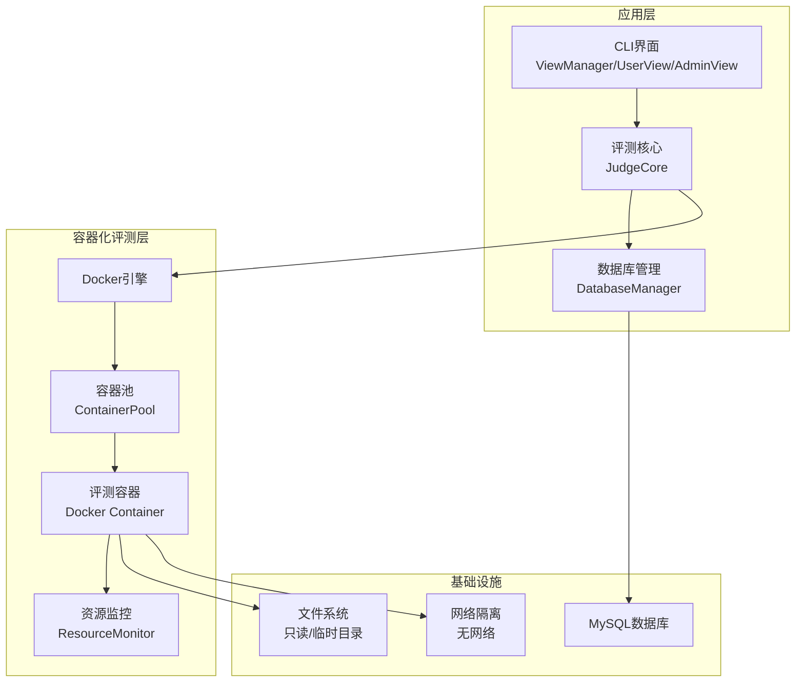
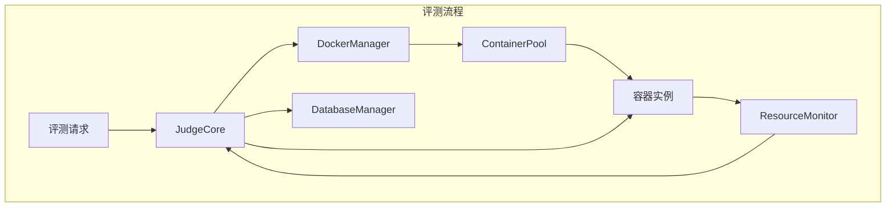
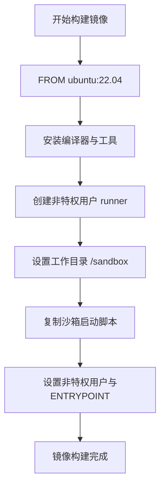
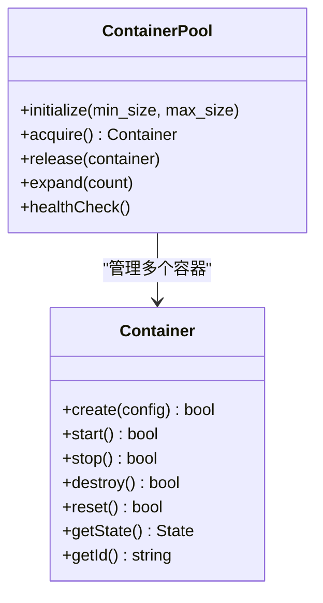
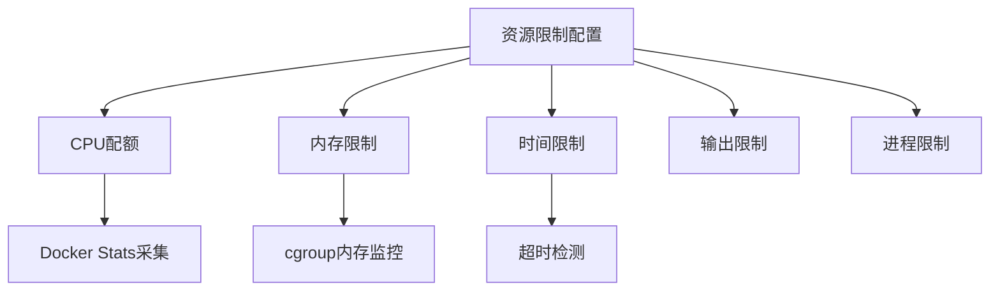
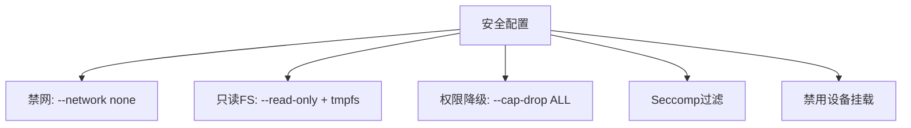
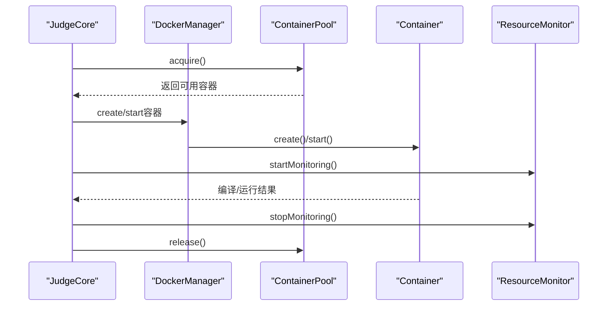
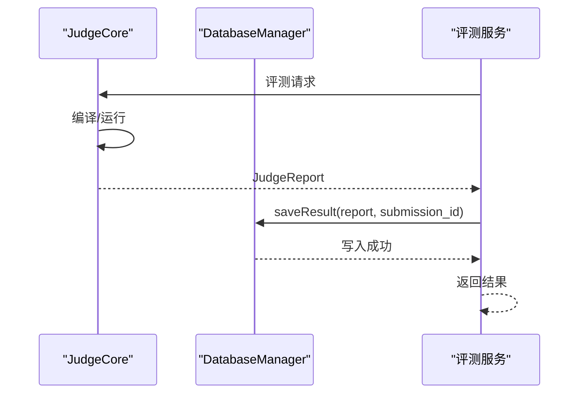
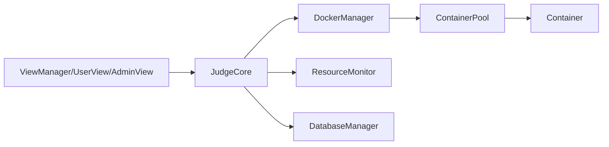

# Docker容器化评测实现

<cite>
**本文档引用的文件**
- [README.md](file://README.md)
- [docs/judge_implementation_plan.md](file://docs/judge_implementation_plan.md)
- [docs/code_submission_design.md](file://docs/code_submission_design.md)
- [include/judge_core.h](file://include/judge_core.h)
- [include/db_manager.h](file://include/db_manager.h)
- [src/main.cpp](file://src/main.cpp)
- [src/db_manager.cpp](file://src/db_manager.cpp)
- [ai/ai_service.py](file://ai/ai_service.py)
- [ai/requirements.txt](file://ai/requirements.txt)
- [setup.sh](file://setup.sh)
- [CMakeLists.txt](file://CMakeLists.txt)
- [init.sql](file://init.sql)
- [History/OJ_v0.1.md](file://History/OJ_v0.1.md)
- [History/OJ_v0.2.md](file://History/OJ_v0.2.md)
</cite>

## 目录
1. [简介](#简介)
2. [项目结构](#项目结构)
3. [核心组件](#核心组件)
4. [架构概览](#架构概览)
5. [详细组件分析](#详细组件分析)
6. [依赖关系分析](#依赖关系分析)
7. [性能考量](#性能考量)
8. [故障排查指南](#故障排查指南)
9. [结论](#结论)
10. [附录](#附录)

## 简介
本文件面向OJ评测系统的Docker容器化评测实现，系统性阐述容器化评测的设计原理、架构优势与实现要点，涵盖资源隔离、安全保护、环境一致性保障、镜像构建、资源限制、沙箱隔离、生命周期管理、性能优化与调试工具使用等主题。文档基于仓库现有设计文档与代码结构，结合Docker容器化最佳实践，形成可落地的实现方案。

## 项目结构
OJ系统采用C++17 + MySQL + CMake的混合架构，前端通过CLI界面与用户交互，后端通过DatabaseManager访问数据库，评测核心通过JudgeCore对外提供评测接口。Docker容器化评测方案将评测过程封装在受控的容器环境中，确保安全性与一致性。

**图表来源**
- [src/main.cpp:1-14](file://src/main.cpp#L1-L14)
- [include/judge_core.h:53-117](file://include/judge_core.h#L53-L117)
- [include/db_manager.h:12-46](file://include/db_manager.h#L12-L46)
- [docs/judge_implementation_plan.md:9-41](file://docs/judge_implementation_plan.md#L9-L41)

**章节来源**
- [README.md:1-2](file://README.md#L1-L2)
- [CMakeLists.txt:1-40](file://CMakeLists.txt#L1-L40)
- [History/OJ_v0.1.md:13-65](file://History/OJ_v0.1.md#L13-L65)
- [History/OJ_v0.2.md:39-92](file://History/OJ_v0.2.md#L39-L92)

## 核心组件
- JudgeCore：评测核心接口，负责编译、运行、监控与资源限制，对外暴露统一评测能力。
- DockerManager：容器生命周期管理（设计文档中定义），负责镜像拉取、容器创建、启动、停止、销毁与复用。
- ContainerPool：容器池管理，支持容器预热、动态扩容、健康检查与并发调度。
- ResourceMonitor：资源监控，基于Docker Stats API与cgroup读取，实时采集内存、CPU、进程数等指标。
- Sandbox：容器内安全限制，通过Seccomp、Cap Drop、只读文件系统、禁网等策略实现强隔离。
- DatabaseManager：数据库访问层，提供SQL执行与查询结果封装，支撑评测结果写回。

**章节来源**
- [include/judge_core.h:53-117](file://include/judge_core.h#L53-L117)
- [docs/judge_implementation_plan.md:43-52](file://docs/judge_implementation_plan.md#L43-L52)
- [include/db_manager.h:12-46](file://include/db_manager.h#L12-L46)

## 架构概览
Docker容器化评测的整体架构围绕“安全隔离 + 精确监控 + 并行调度”展开。评测请求经JudgeCore封装后，由DockerManager协调容器池分配可用容器，容器内执行编译与运行，ResourceMonitor持续采集资源使用，最终将评测结果写回数据库。

**图表来源**
- [docs/judge_implementation_plan.md:9-41](file://docs/judge_implementation_plan.md#L9-L41)
- [docs/judge_implementation_plan.md:127-179](file://docs/judge_implementation_plan.md#L127-L179)
- [docs/judge_implementation_plan.md:312-390](file://docs/judge_implementation_plan.md#L312-L390)

**章节来源**
- [docs/judge_implementation_plan.md:9-41](file://docs/judge_implementation_plan.md#L9-L41)
- [docs/judge_implementation_plan.md:127-179](file://docs/judge_implementation_plan.md#L127-L179)
- [docs/judge_implementation_plan.md:312-390](file://docs/judge_implementation_plan.md#L312-L390)

## 详细组件分析

### Docker镜像构建与基础环境
- 基础镜像选择Ubuntu 22.04，安装g++、gcc、make、time等编译与运行时工具，确保评测环境一致性。
- 创建非特权runner用户，避免容器内root权限带来的安全风险。
- 设置工作目录/sandbox，复制沙箱启动脚本，ENTRYPOINT指向沙箱脚本，实现标准化容器入口。
- 沙箱启动脚本负责编译源代码、执行时限控制、运行时错误捕获与输出结果判定。

**图表来源**
- [docs/judge_implementation_plan.md:59-87](file://docs/judge_implementation_plan.md#L59-L87)

**章节来源**
- [docs/judge_implementation_plan.md:59-87](file://docs/judge_implementation_plan.md#L59-L87)

### 容器池管理与并行评测
- ContainerPool通过队列维护可用容器，支持初始化最小/最大容量、动态扩容、健康检查与容器复用。
- 调度器轮询可用容器，结合负载均衡策略实现多任务并发评测。
- 容器复用通过reset()清理临时文件与状态，避免频繁销毁重建带来的延迟。

**图表来源**
- [docs/judge_implementation_plan.md:129-158](file://docs/judge_implementation_plan.md#L129-L158)
- [docs/judge_implementation_plan.md:184-216](file://docs/judge_implementation_plan.md#L184-L216)

**章节来源**
- [docs/judge_implementation_plan.md:129-158](file://docs/judge_implementation_plan.md#L129-L158)
- [docs/judge_implementation_plan.md:184-216](file://docs/judge_implementation_plan.md#L184-L216)

### 资源限制实现机制
- CPU配额：通过cpu_quota与cpu_period配置，限制容器CPU使用比例。
- 内存限制：memory_limit_mb与禁止swap（memory_swap_mb=0），防止内存逃逸。
- 时间限制：wall_time_limit_ms考虑多核场景，结合timeout与/usr/bin/time -v实现精确计时。
- 输出限制：output_limit_mb限制评测输出大小，防止磁盘滥用。
- 进程限制：max_processes限制容器内最大进程数，降低资源竞争风险。

**图表来源**
- [docs/judge_implementation_plan.md:317-337](file://docs/judge_implementation_plan.md#L317-L337)
- [docs/judge_implementation_plan.md:342-375](file://docs/judge_implementation_plan.md#L342-L375)

**章节来源**
- [docs/judge_implementation_plan.md:317-337](file://docs/judge_implementation_plan.md#L317-L337)
- [docs/judge_implementation_plan.md:342-375](file://docs/judge_implementation_plan.md#L342-L375)

### 沙箱安全隔离方案
- 网络访问控制：--network none完全禁用网络，避免容器与外界通信。
- 文件系统隔离：--read-only根文件系统，-v挂载只读测试数据，tmpfs作为临时可写目录。
- 权限降级：--user runner，--cap-drop ALL，仅保留最小必要capabilities。
- 系统调用过滤：seccomp默认配置，允许必要系统调用，阻断socket等高危调用。
- 设备挂载限制：--device=null或禁用设备挂载，防止宿主机设备泄露。

**图表来源**
- [docs/judge_implementation_plan.md:225-252](file://docs/judge_implementation_plan.md#L225-L252)
- [docs/judge_implementation_plan.md:256-280](file://docs/judge_implementation_plan.md#L256-L280)
- [docs/judge_implementation_plan.md:285-308](file://docs/judge_implementation_plan.md#L285-L308)

**章节来源**
- [docs/judge_implementation_plan.md:225-252](file://docs/judge_implementation_plan.md#L225-L252)
- [docs/judge_implementation_plan.md:256-280](file://docs/judge_implementation_plan.md#L256-L280)
- [docs/judge_implementation_plan.md:285-308](file://docs/judge_implementation_plan.md#L285-L308)

### 容器生命周期管理最佳实践
- 启动：DockerManager根据ContainerConfig创建容器，设置安全选项与资源限制。
- 运行：Container.start()启动容器，ResourceMonitor.startMonitoring()开始采集指标。
- 清理：Container.reset()清理/sandbox目录与状态，准备下一次评测。
- 销毁：容器故障或达到上限时，Container.destroy()销毁并从池中移除。
- 故障恢复：ErrorRecovery.recoverContainer()尝试停止与销毁，创建新容器替换。

**图表来源**
- [docs/judge_implementation_plan.md:184-216](file://docs/judge_implementation_plan.md#L184-L216)
- [docs/judge_implementation_plan.md:342-375](file://docs/judge_implementation_plan.md#L342-L375)

**章节来源**
- [docs/judge_implementation_plan.md:184-216](file://docs/judge_implementation_plan.md#L184-L216)
- [docs/judge_implementation_plan.md:342-375](file://docs/judge_implementation_plan.md#L342-L375)

### 评测结果处理与数据库写回
- JudgeCore.compile()与runTests()分别处理编译与测试执行，返回JudgeReport。
- saveResult()将评测结果写入submissions表，包含状态、时间/内存使用、错误信息与测试点统计。
- 结果返回格式包含总体结果、得分、各测试点详情，便于前端展示与历史追踪。

**图表来源**
- [docs/judge_implementation_plan.md:445-468](file://docs/judge_implementation_plan.md#L445-L468)
- [include/judge_core.h:38-46](file://include/judge_core.h#L38-L46)

**章节来源**
- [docs/judge_implementation_plan.md:445-468](file://docs/judge_implementation_plan.md#L445-L468)
- [include/judge_core.h:38-46](file://include/judge_core.h#L38-L46)

### AI助手与工作区文件机制（辅助评测上下文）
- 工作区文件workspace/solution.cpp作为统一代码存储，提交时读取并保存至submissions.code字段。
- AI助手通过读取工作区代码与题目信息，提供精准的代码建议与问题引导。
- 历史下载与加载功能支持用户查看与复用历史提交，提升学习效率。

**章节来源**
- [docs/code_submission_design.md:36-128](file://docs/code_submission_design.md#L36-L128)
- [docs/code_submission_design.md:283-420](file://docs/code_submission_design.md#L283-L420)
- [ai/ai_service.py:18-27](file://ai/ai_service.py#L18-L27)

## 依赖关系分析
- JudgeCore依赖DockerManager与ContainerPool进行容器调度，依赖ResourceMonitor进行资源监控。
- DatabaseManager为评测结果写回提供数据访问能力。
- CLI界面通过ViewManager与UserView/AdminView与用户交互，间接触发评测流程。

**图表来源**
- [src/main.cpp:1-14](file://src/main.cpp#L1-L14)
- [docs/judge_implementation_plan.md:497-554](file://docs/judge_implementation_plan.md#L497-L554)
- [include/db_manager.h:12-46](file://include/db_manager.h#L12-L46)

**章节来源**
- [src/main.cpp:1-14](file://src/main.cpp#L1-L14)
- [docs/judge_implementation_plan.md:497-554](file://docs/judge_implementation_plan.md#L497-L554)
- [include/db_manager.h:12-46](file://include/db_manager.h#L12-L46)

## 性能考量
- 容器预热：系统启动时预创建最小容器池，减少首次评测延迟。
- 容器复用：评测完成后reset()而非销毁，降低容器创建开销。
- 镜像优化：基础镜像选择轻量化Linux发行版，减少镜像体积与启动时间。
- 监控精度：cgroup直接读取与Docker Stats结合，提高资源监控准确性。
- 并发调度：容器池动态扩容与健康检查，平衡吞吐与稳定性。

**章节来源**
- [docs/judge_implementation_plan.md:645-674](file://docs/judge_implementation_plan.md#L645-L674)
- [docs/judge_implementation_plan.md:676-685](file://docs/judge_implementation_plan.md#L676-L685)

## 故障排查指南
- 编译错误（CE）：检查沙箱启动脚本编译命令与错误输出文件路径。
- 运行时错误（RE）：查看error.txt内容，定位段错误或异常退出原因。
- 资源超限（TLE/MLE）：确认ResourceLimits配置与cgroup监控数据，调整时间/内存限制。
- 系统错误（SE）：DockerManager重试与容器重建，检查Docker守护进程状态。
- 网络错误：验证--network none配置，确保评测数据通过挂载传递。

**章节来源**
- [docs/judge_implementation_plan.md:595-602](file://docs/judge_implementation_plan.md#L595-L602)
- [docs/judge_implementation_plan.md:606-637](file://docs/judge_implementation_plan.md#L606-L637)

## 结论
通过Docker容器化评测，OJ系统实现了安全隔离、资源可控与环境一致性的评测能力。结合容器池管理与资源监控，系统能够在保证安全性的同时，提供高并发、低延迟的评测服务。建议在生产环境中进一步完善镜像缓存策略、监控告警与自动化运维流程，持续优化评测性能与稳定性。

## 附录

### 部署与环境准备
- 安装Docker并配置守护进程，启用cgroup内存控制。
- 创建评测镜像并推送至私有仓库，确保CI/CD流水线可复用。
- 初始化数据库，配置oj_user权限，准备测试数据目录。

**章节来源**
- [docs/judge_implementation_plan.md:692-723](file://docs/judge_implementation_plan.md#L692-L723)
- [setup.sh:14-29](file://setup.sh#L14-L29)
- [init.sql:8-95](file://init.sql#L8-L95)

### 数据库表结构与权限
- problems：题目元数据与测试数据路径。
- users：平台用户信息，SHA256密码哈希。
- submissions：提交记录，包含代码与评测状态。

**章节来源**
- [init.sql:14-61](file://init.sql#L14-L61)
- [History/OJ_v0.1.md:215-262](file://History/OJ_v0.1.md#L215-L262)