# 代码评测系统

<cite>
**本文档引用的文件**
- [judge_core.h](file://include/judge_core.h)
- [judge_implementation_plan.md](file://docs/judge_implementation_plan.md)
- [code_submission_design.md](file://docs/code_submission_design.md)
- [main.cpp](file://src/main.cpp)
- [db_manager.h](file://include/db_manager.h)
- [db_manager.cpp](file://src/db_manager.cpp)
- [user.h](file://include/user.h)
- [user.cpp](file://src/user.cpp)
- [CMakeLists.txt](file://CMakeLists.txt)
- [setup.sh](file://setup.sh)
- [init.sql](file://init.sql)
- [README.md](file://README.md)
</cite>

## 目录
1. [简介](#简介)
2. [项目结构](#项目结构)
3. [核心组件](#核心组件)
4. [架构概览](#架构概览)
5. [详细组件分析](#详细组件分析)
6. [依赖关系分析](#依赖关系分析)
7. [性能考虑](#性能考虑)
8. [故障排除指南](#故障排除指南)
9. [结论](#结论)
10. [附录](#附录)

## 简介

本项目是一个基于 Docker 容器化的在线判题系统（OJ），专注于提供安全、可靠的代码评测服务。系统采用现代化的 C++17 技术栈，结合 Docker 容器技术实现代码的安全隔离和资源限制，为用户提供高质量的编程练习和竞赛体验。

系统的核心设计理念包括：
- **安全性**：通过 Docker 容器、Seccomp 过滤和能力降级实现多层安全防护
- **可靠性**：容器池管理、资源监控和异常恢复机制确保系统稳定运行
- **可扩展性**：模块化设计支持插件化评测策略和语言扩展
- **性能优化**：容器预热、资源限制和并行评测提升系统吞吐量

## 项目结构

OJ 系统采用清晰的分层架构，主要包含以下核心目录和文件：

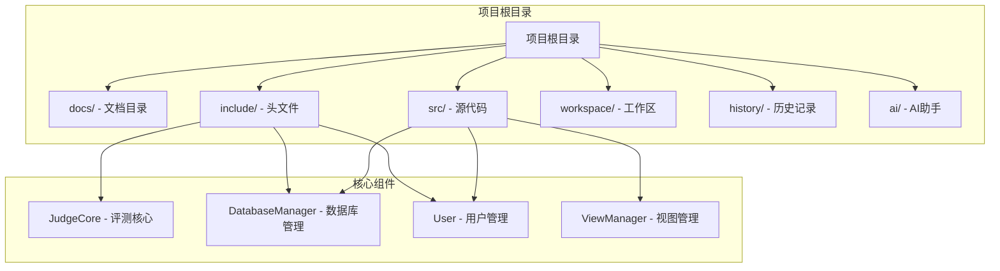

**图表来源**
- [CMakeLists.txt:1-40](file://CMakeLists.txt#L1-L40)
- [main.cpp:1-14](file://src/main.cpp#L1-L14)

**章节来源**
- [CMakeLists.txt:1-40](file://CMakeLists.txt#L1-L40)
- [README.md:1-2](file://README.md#L1-L2)

## 核心组件

### JudgeCore 评测核心

JudgeCore 是系统的核心接口类，负责封装完整的评测流程，包括代码编译、沙箱执行、结果判定和性能监控。

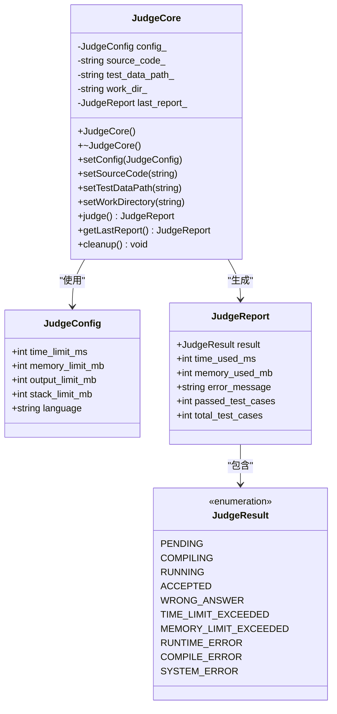

**图表来源**
- [judge_core.h:53-117](file://include/judge_core.h#L53-L117)

### 数据库管理系统

DatabaseManager 提供统一的数据库访问接口，封装 MySQL 连接管理和 SQL 执行逻辑。

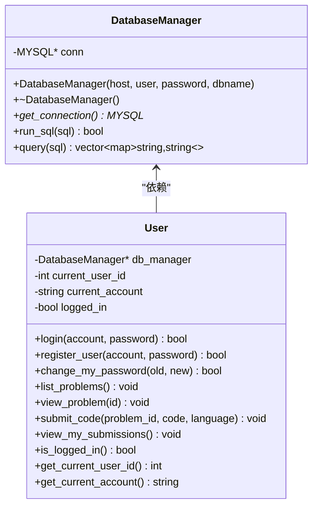

**图表来源**
- [db_manager.h:12-46](file://include/db_manager.h#L12-L46)
- [user.h:10-86](file://include/user.h#L10-L86)

**章节来源**
- [judge_core.h:1-120](file://include/judge_core.h#L1-L120)
- [db_manager.h:1-53](file://include/db_manager.h#L1-L53)
- [user.h:1-89](file://include/user.h#L1-L89)

## 架构概览

系统采用分层架构设计，通过 Docker 容器实现代码评测的完全隔离和安全执行。

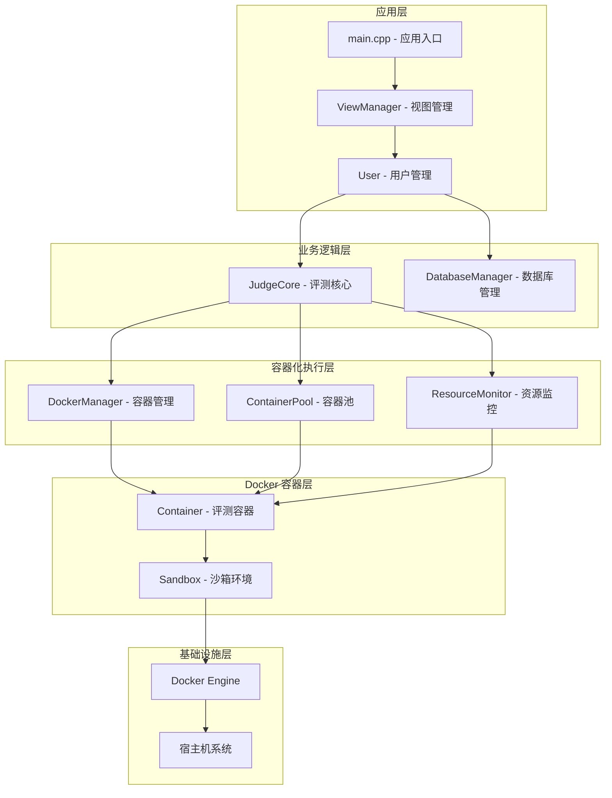

**图表来源**
- [judge_implementation_plan.md:13-41](file://docs/judge_implementation_plan.md#L13-L41)
- [main.cpp:5-10](file://src/main.cpp#L5-L10)

### Docker 容器化架构

系统采用 Docker 容器技术实现代码评测的完全隔离，每个评测任务都在独立的容器环境中执行。

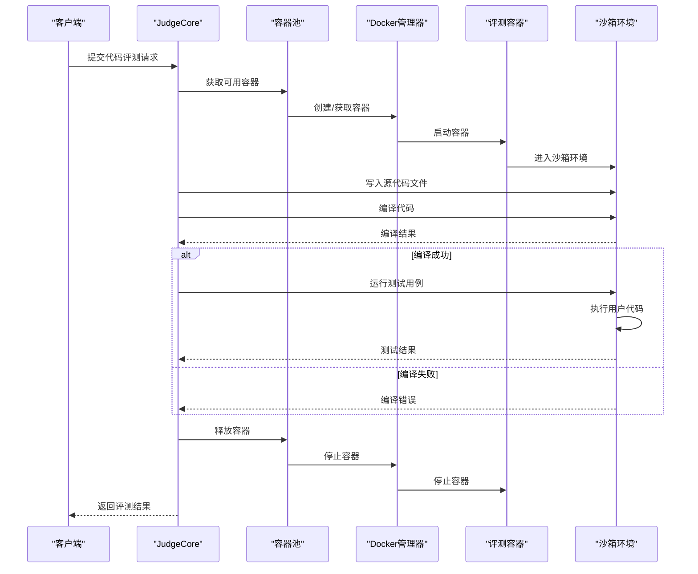

**图表来源**
- [judge_implementation_plan.md:397-440](file://docs/judge_implementation_plan.md#L397-L440)

## 详细组件分析

### JudgeCore 接口设计

JudgeCore 采用现代 C++ 设计模式，提供简洁而强大的接口来管理整个评测流程。

#### 核心接口分析

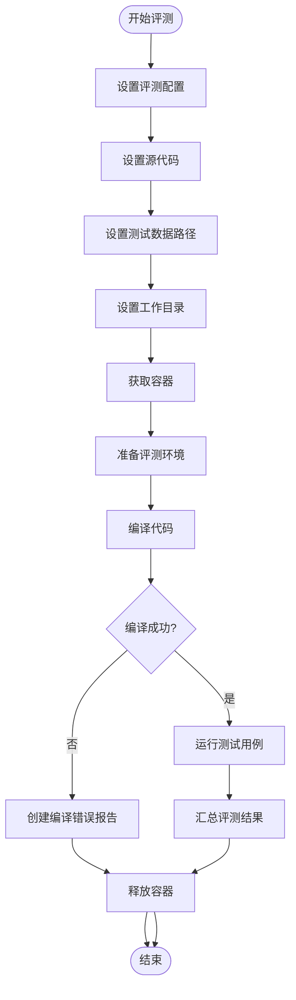

**图表来源**
- [judge_implementation_plan.md:532-553](file://docs/judge_implementation_plan.md#L532-L553)

#### 评测配置管理

评测配置通过 `JudgeConfig` 结构体统一管理，支持多种编程语言和资源限制参数。

| 配置项 | 类型 | 默认值 | 说明 |
|--------|------|--------|------|
| time_limit_ms | int | 1000 | 时间限制（毫秒） |
| memory_limit_mb | int | 128 | 内存限制（MB） |
| output_limit_mb | int | 64 | 输出限制（MB） |
| stack_limit_mb | int | 32 | 栈空间限制（MB） |
| language | string | "cpp" | 编程语言 |

#### 评测结果处理

评测结果通过 `JudgeReport` 结构体标准化，包含详细的评测信息和统计数据。

| 结果字段 | 类型 | 说明 |
|----------|------|------|
| result | JudgeResult | 评测最终结果 |
| time_used_ms | int | 实际使用时间（毫秒） |
| memory_used_mb | int | 实际使用内存（MB） |
| error_message | string | 错误信息 |
| passed_test_cases | int | 通过的测试点数量 |
| total_test_cases | int | 总测试点数量 |

**章节来源**
- [judge_core.h:26-46](file://include/judge_core.h#L26-L46)
- [judge_core.h:9-21](file://include/judge_core.h#L9-L21)

### Docker 容器化评测环境

系统采用 Docker 容器技术实现代码评测的完全隔离和安全执行。

#### 容器镜像设计

Docker 镜像采用最小化设计原则，仅包含必要的编译和运行时环境。

```mermaid
graph LR
subgraph "基础镜像"
Ubuntu[ubuntu:22.04]
end
subgraph "编译环境"
GCC[gcc/g++]
Make[make]
Time[time命令]
end
subgraph "安全配置"
RunnerUser[runner用户]
Seccomp[Seccomp配置]
CapDrop[能力降级]
end
subgraph "工作目录"
Sandbox[/sandbox]
Script[sandbox_runner.sh]
end
Ubuntu --> GCC
Ubuntu --> Make
Ubuntu --> Time
Ubuntu --> RunnerUser
RunnerUser --> Seccomp
RunnerUser --> CapDrop
Sandbox --> Script
```

**图表来源**
- [judge_implementation_plan.md:61-87](file://docs/judge_implementation_plan.md#L61-L87)

#### 沙箱启动脚本

沙箱启动脚本负责在容器内执行完整的编译和运行流程，确保评测过程的标准化。

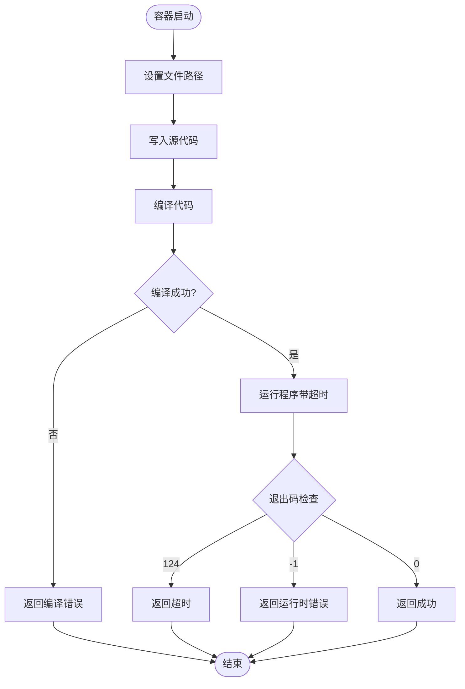

**图表来源**
- [judge_implementation_plan.md:91-125](file://docs/judge_implementation_plan.md#L91-L125)

### 容器池管理系统

容器池管理器负责容器的生命周期管理、资源分配和负载均衡。

#### 容器池设计

```mermaid
classDiagram
class ContainerPool {
-queue~shared_ptr~Container~~ available_
-vector~shared_ptr~Container~~ all_containers_
-mutex mutex_
-condition_variable cv_
-int min_size_
-int max_size_
+initialize(min_size, max_size) void
+acquire() shared_ptr~Container~
+release(container) void
+expand(count) void
+healthCheck() void
}
class Container {
<<enumeration>> State {
IDLE
RUNNING
BUSY
ERROR
}
-string container_id_
-State state_
-steady_clock : : time_point last_used_
+create(config) bool
+start() bool
+stop() bool
+destroy() bool
+reset() bool
+getState() State
+getId() string
}
ContainerPool --> Container : "管理多个"
```

**图表来源**
- [judge_implementation_plan.md:132-158](file://docs/judge_implementation_plan.md#L132-L158)

#### 并行评测流程

系统支持多容器并行评测，通过容器池实现动态负载均衡。

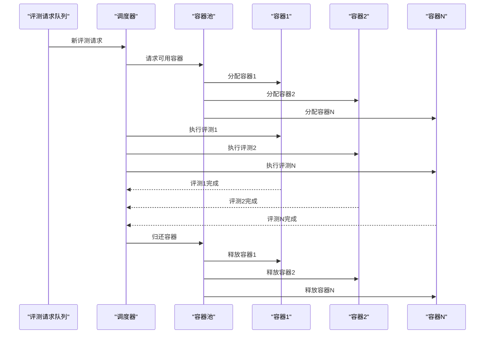

**图表来源**
- [judge_implementation_plan.md:162-179](file://docs/judge_implementation_plan.md#L162-L179)

### 安全权限控制系统

系统采用多层安全防护机制，确保评测过程的安全性和隔离性。

#### Docker 安全配置

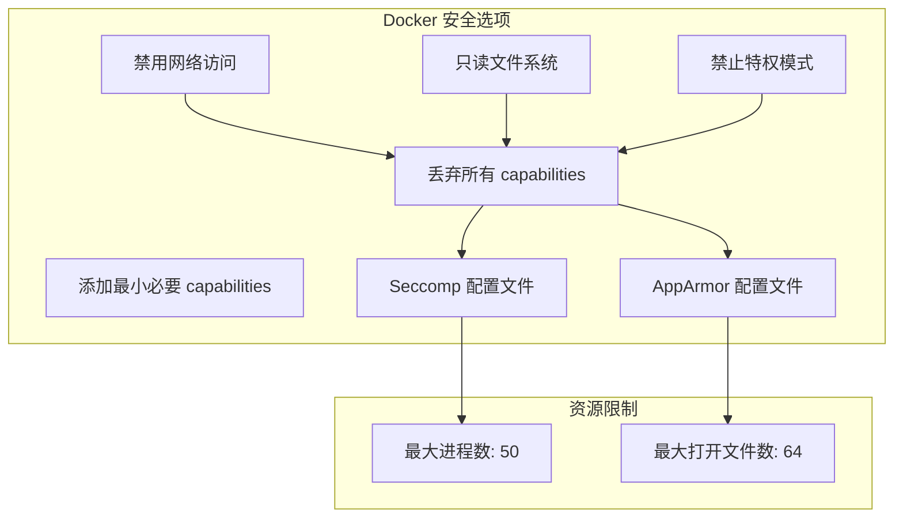

**图表来源**
- [judge_implementation_plan.md:225-252](file://docs/judge_implementation_plan.md#L225-L252)

#### Seccomp 系统调用过滤

系统使用 Seccomp（Secure Computing Mode）技术限制容器内的系统调用，只允许必要的系统调用。

| 允许的系统调用 | 作用 |
|----------------|------|
| read, write | 文件读写操作 |
| open, close | 文件句柄管理 |
| mmap, mprotect, munmap | 内存映射管理 |
| brk | 内存分配控制 |
| exit, exit_group | 进程退出 |
| execve | 程序执行 |
| arch_prctl | 架构控制 |

**章节来源**
- [judge_implementation_plan.md:256-280](file://docs/judge_implementation_plan.md#L256-L280)

### 资源监控与限制

系统实现精确的资源监控和限制机制，确保评测过程的公平性和稳定性。

#### 资源限制配置

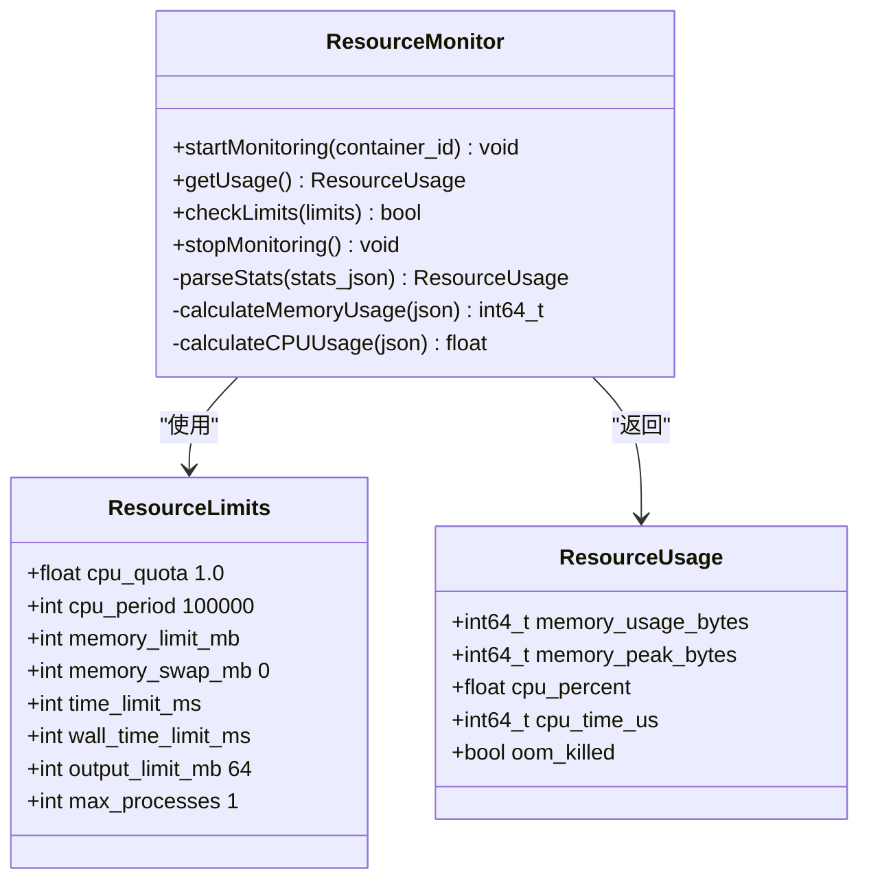

**图表来源**
- [judge_implementation_plan.md:318-375](file://docs/judge_implementation_plan.md#L318-L375)

#### 实时监控实现

系统通过 Docker Stats API 和 cgroup 接口实现精确的资源使用监控。

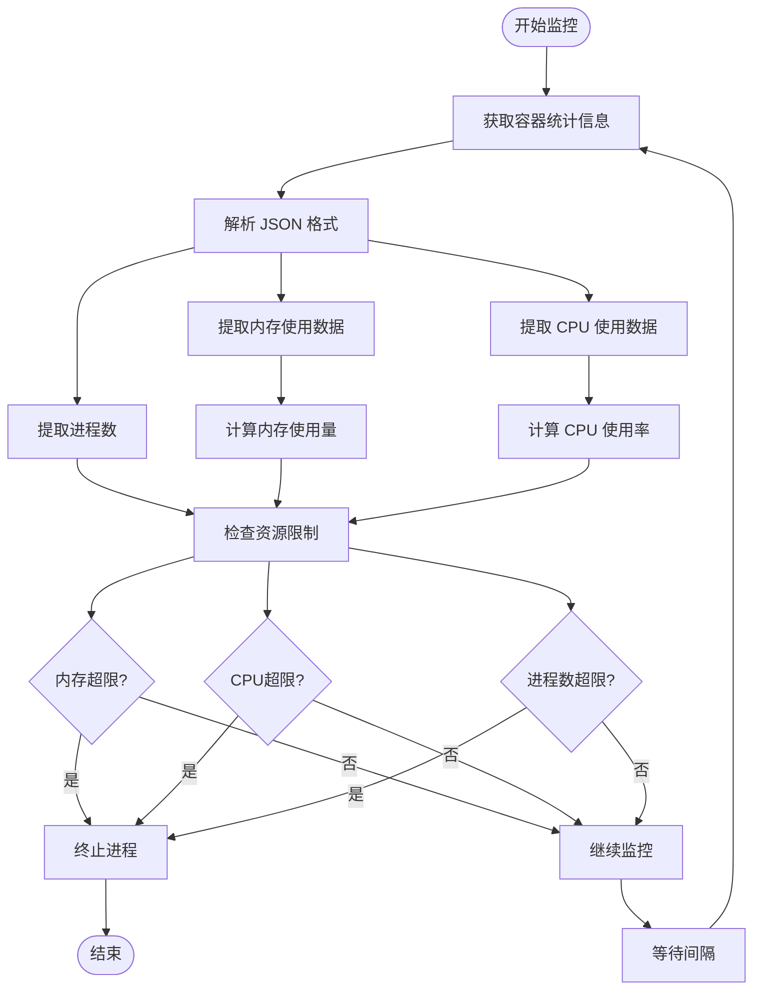

**图表来源**
- [judge_implementation_plan.md:342-375](file://docs/judge_implementation_plan.md#L342-L375)

**章节来源**
- [judge_implementation_plan.md:312-390](file://docs/judge_implementation_plan.md#L312-L390)

## 依赖关系分析

系统采用模块化设计，各组件之间的依赖关系清晰明确。

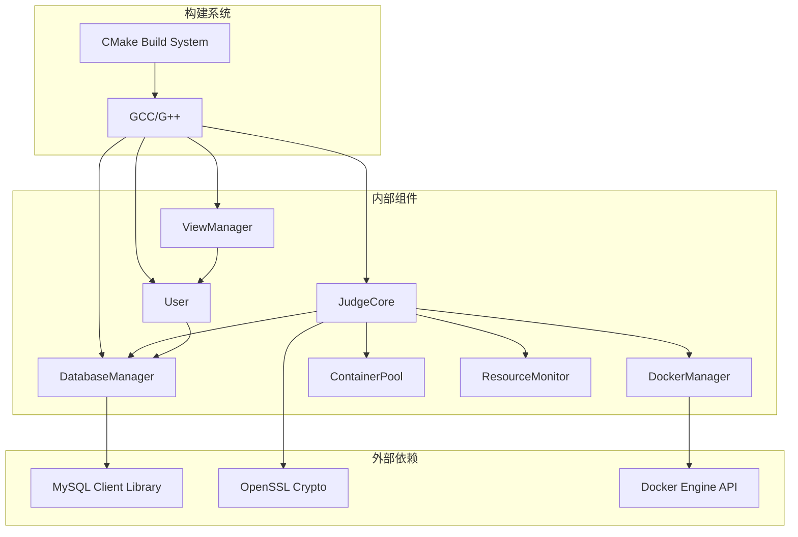

**图表来源**
- [CMakeLists.txt:11-34](file://CMakeLists.txt#L11-L34)

### 数据库设计

系统使用 MySQL 作为数据存储，采用规范化设计确保数据一致性和完整性。

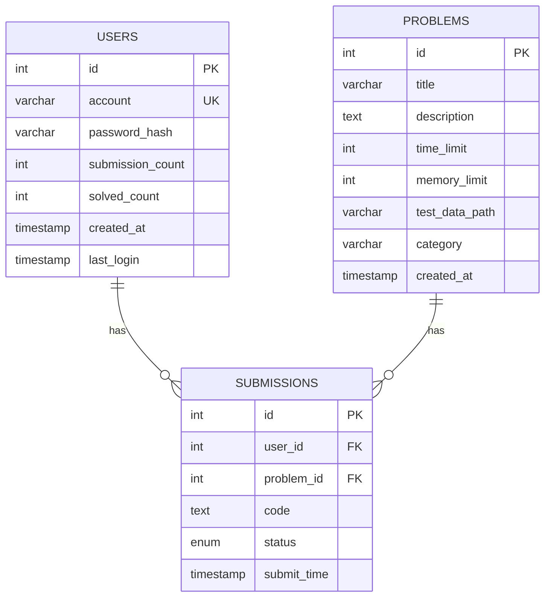

**图表来源**
- [init.sql:14-61](file://init.sql#L14-L61)

**章节来源**
- [CMakeLists.txt:11-34](file://CMakeLists.txt#L11-L34)
- [init.sql:14-95](file://init.sql#L14-L95)

## 性能考虑

系统在设计时充分考虑了性能优化，通过多种技术手段提升评测效率和用户体验。

### 容器预热机制

系统采用容器预热策略，在系统启动时预先创建一定数量的容器，减少评测时的等待时间。

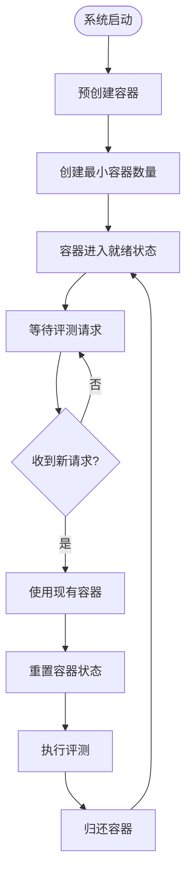

**图表来源**
- [judge_implementation_plan.md:647-657](file://docs/judge_implementation_plan.md#L647-L657)

### 性能指标优化

系统设定了明确的性能目标，确保评测系统的高效运行。

| 性能指标 | 目标值 | 优化措施 |
|----------|--------|----------|
| 容器启动时间 | < 500ms | 镜像精简、预创建 |
| 编译时间 | 正常 | 缓存编译结果 |
| 单点测试 | < 时间限制 + 50ms | 精确计时 |
| 并发评测数 | 10+ | 容器池管理 |
| 内存占用 | < 200MB/容器 | Alpine Linux |

### 资源利用优化

系统通过合理的资源分配和监控，最大化利用硬件资源。

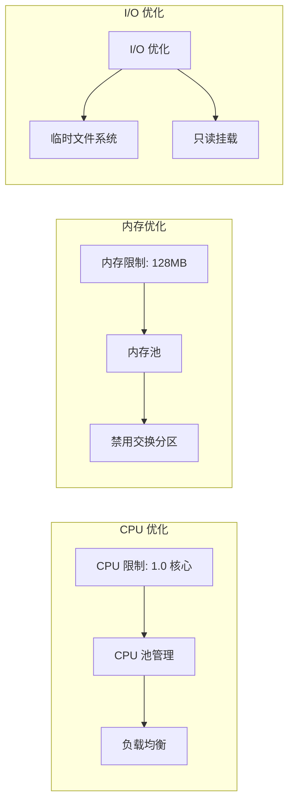

**章节来源**
- [judge_implementation_plan.md:641-685](file://docs/judge_implementation_plan.md#L641-L685)

## 故障排除指南

系统提供了完善的异常处理和错误恢复机制，确保在各种异常情况下都能保持系统的稳定运行。

### 异常分类与处理

系统将异常分为多个类别，每类异常都有相应的处理策略。

| 异常类型 | 说明 | 处理策略 |
|----------|------|----------|
| 编译错误 | 代码语法错误 | 返回 CE，记录错误信息 |
| 运行时错误 | 段错误、异常退出 | 返回 RE，记录退出码 |
| 资源超限 | TLE/MLE | 强制终止，返回对应结果 |
| 系统错误 | Docker 故障 | 销毁容器，重新创建 |
| 网络错误 | 与容器通信失败 | 重试3次，失败则标记 SE |

### 错误恢复机制

系统实现了多层次的错误恢复机制，确保系统在出现故障时能够快速恢复。

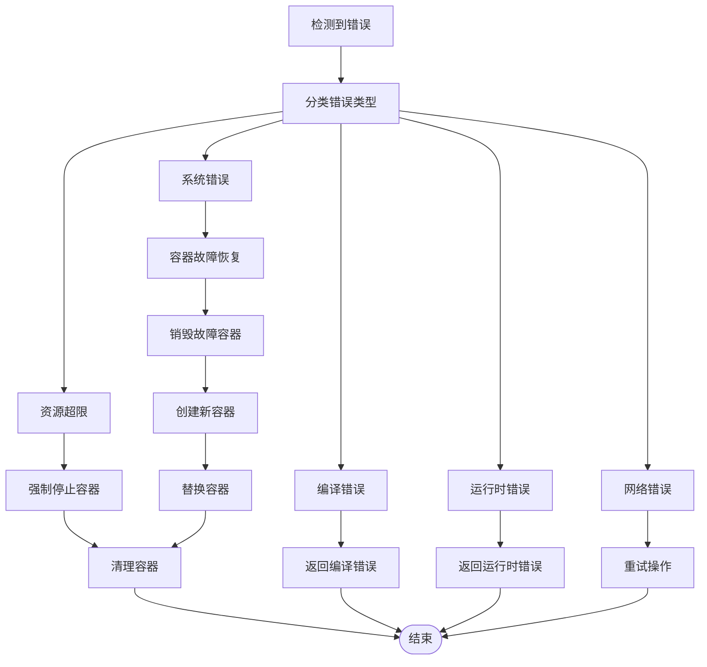

**图表来源**
- [judge_implementation_plan.md:594-637](file://docs/judge_implementation_plan.md#L594-L637)

### 调试工具和诊断

系统提供了多种调试工具和诊断方法，帮助开发者快速定位和解决问题。

#### 日志记录

系统采用分级日志记录机制，不同级别的错误和警告都有相应的日志级别。

#### 性能监控

系统内置性能监控功能，可以实时监控容器的资源使用情况。

#### 容器状态检查

系统提供容器状态检查功能，可以诊断容器的健康状况。

**章节来源**
- [judge_implementation_plan.md:591-637](file://docs/judge_implementation_plan.md#L591-L637)

## 结论

OJ 代码评测系统通过现代化的架构设计和技术实现，为用户提供了一个安全、可靠、高效的代码评测平台。系统的主要优势包括：

### 技术优势

1. **安全性**：采用 Docker 容器化技术，实现代码执行的完全隔离
2. **可靠性**：多层异常处理和错误恢复机制确保系统稳定运行
3. **可扩展性**：模块化设计支持插件化评测策略和语言扩展
4. **性能优化**：容器预热、资源限制和并行评测提升系统吞吐量

### 架构特点

1. **分层架构**：清晰的层次划分便于维护和扩展
2. **接口设计**：简洁的接口设计降低使用复杂度
3. **容器化部署**：Docker 容器实现标准化的评测环境
4. **资源监控**：精确的资源使用监控确保公平性

### 发展前景

系统为未来的功能扩展奠定了良好的基础，包括：
- 支持更多编程语言
- 实现更复杂的评测策略
- 增强 AI 辅助功能
- 优化用户体验

通过持续的改进和优化，OJ 系统将成为一个功能完善、性能优异的在线编程练习平台。

## 附录

### 配置选项

系统支持多种配置选项，可以根据实际需求进行调整。

#### 编译配置

- C++ 标准：C++17
- 编译器：GCC/G++
- 优化级别：-O2

#### Docker 配置

- 基础镜像：ubuntu:22.04
- 编译环境：g++, gcc, make, time
- 用户：runner（非特权用户）

#### 资源限制

- 时间限制：可配置（默认 1000ms）
- 内存限制：可配置（默认 128MB）
- 输出限制：可配置（默认 64MB）

### 部署指南

系统提供了一键部署脚本，简化部署流程。

```bash
# 1. 创建项目目录
mkdir -p build
mkdir -p test_data/1

# 2. 初始化数据库
mysql -u root -p < init.sql

# 3. 编译和运行
cd build
cmake ..
make
./oj_app
```

### 开发指南

#### 代码规范

- 使用 C++17 标准
- 遵循 RAII 原则
- 使用智能指针管理资源
- 实现异常安全代码

#### 测试策略

- 单元测试：覆盖核心功能
- 集成测试：验证组件协作
- 性能测试：评估系统性能
- 安全测试：验证安全机制

#### 扩展开发

系统设计支持插件化扩展，开发者可以：
- 添加新的编程语言支持
- 实现自定义评测策略
- 扩展用户界面功能
- 集成第三方服务