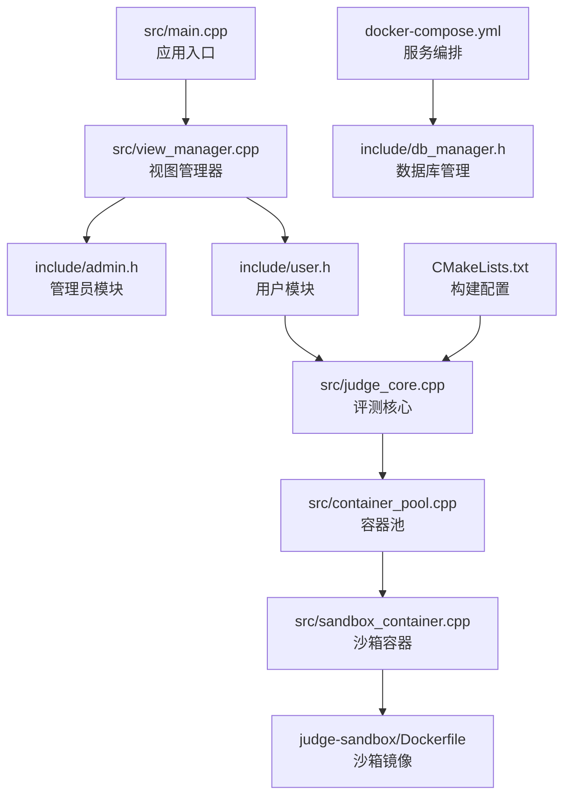
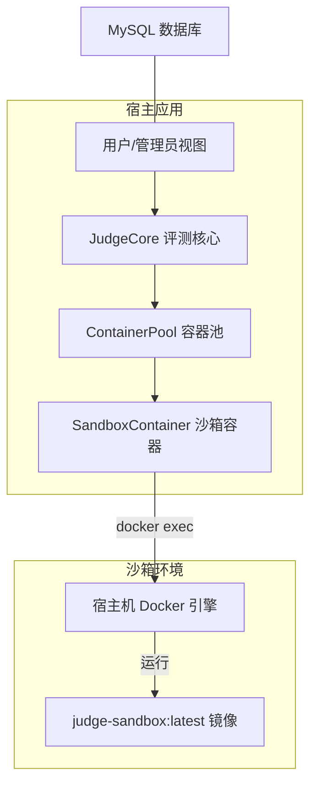
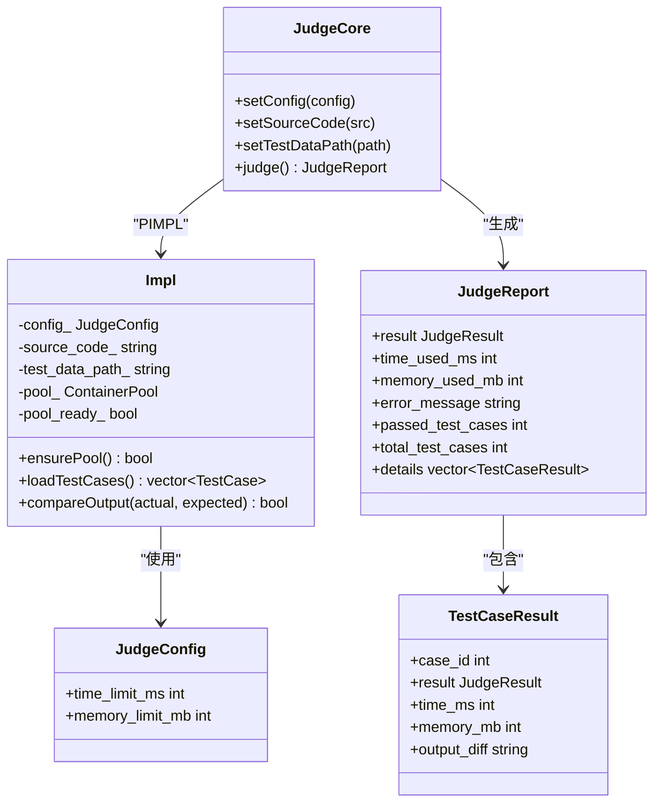
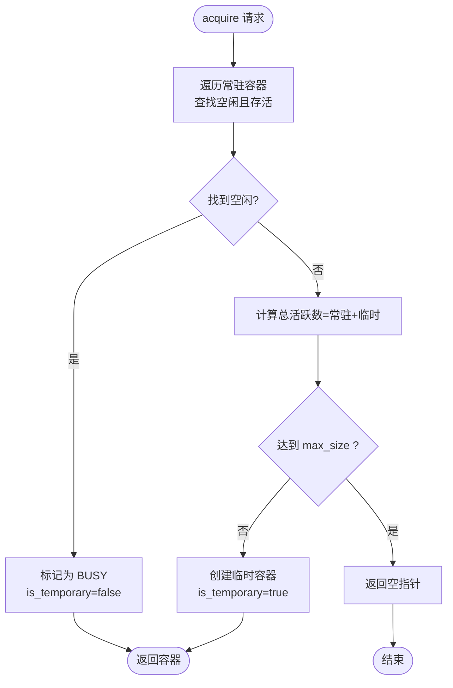
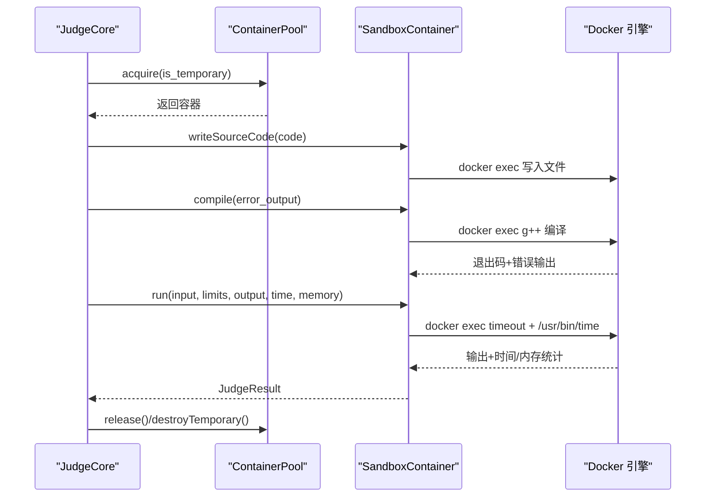
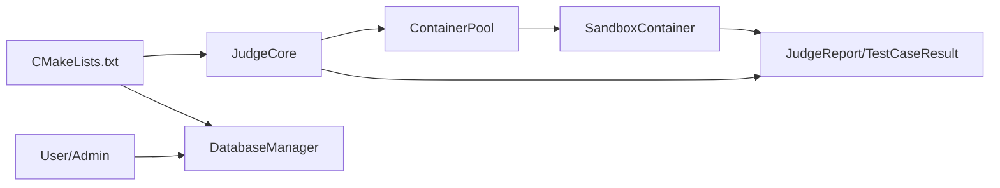

# 代码评测系统

<cite>
**本文引用的文件**
- [src/main.cpp](file://src/main.cpp)
- [src/judge_core.cpp](file://src/judge_core.cpp)
- [src/container_pool.cpp](file://src/container_pool.cpp)
- [src/sandbox_container.cpp](file://src/sandbox_container.cpp)
- [include/judge_core.h](file://include/judge_core.h)
- [include/container_pool.h](file://include/container_pool.h)
- [include/sandbox_container.h](file://include/sandbox_container.h)
- [include/db_manager.h](file://include/db_manager.h)
- [include/admin.h](file://include/admin.h)
- [include/user.h](file://include/user.h)
- [src/view_manager.cpp](file://src/view_manager.cpp)
- [src/app_context.cpp](file://src/app_context.cpp)
- [judge-sandbox/Dockerfile](file://judge-sandbox/Dockerfile)
- [docker-compose.yml](file://docker-compose.yml)
- [CMakeLists.txt](file://CMakeLists.txt)
</cite>

## 目录
1. [引言](#引言)
2. [项目结构](#项目结构)
3. [核心组件](#核心组件)
4. [架构总览](#架构总览)
5. [详细组件分析](#详细组件分析)
6. [依赖关系分析](#依赖关系分析)
7. [性能考量](#性能考量)
8. [故障排除指南](#故障排除指南)
9. [结论](#结论)
10. [附录](#附录)

## 引言
本文件面向代码评测系统的开发者与运维人员，提供从架构设计到实现细节的深度技术文档。重点涵盖评测引擎的容器化隔离与资源限制、编译与执行流程、超时与内存控制、容器池调度策略、并发控制与性能优化、评测报告生成与错误处理、扩展性与多语言支持、以及配置示例与故障排除。

## 项目结构
系统采用分层与模块化组织方式：
- 应用入口位于 src/main.cpp，负责启动视图管理器，引导用户进入管理员或普通用户功能。
- 评测核心位于 src/judge_core.cpp，封装评测流程与报告生成。
- 容器池与沙箱容器分别位于 src/container_pool.cpp 与 src/sandbox_container.cpp，负责容器生命周期与隔离执行。
- 接口头文件位于 include/，定义评测配置、结果枚举、报告结构与各组件对外接口。
- 视图层与业务层位于 src/ 与 include/ 下的 view、admin、user 等模块，负责用户交互与数据库访问。
- judge-sandbox/Dockerfile 定义评测沙箱镜像，docker-compose.yml 描述数据库与应用服务编排。
- CMakeLists.txt 管理构建与依赖链接。

图表来源
- [src/main.cpp:1-14](file://src/main.cpp#L1-L14)
- [src/view_manager.cpp:1-78](file://src/view_manager.cpp#L1-L78)
- [src/judge_core.cpp:1-202](file://src/judge_core.cpp#L1-L202)
- [src/container_pool.cpp:1-121](file://src/container_pool.cpp#L1-L121)
- [src/sandbox_container.cpp:1-187](file://src/sandbox_container.cpp#L1-L187)
- [judge-sandbox/Dockerfile:1-29](file://judge-sandbox/Dockerfile#L1-L29)
- [docker-compose.yml:1-81](file://docker-compose.yml#L1-L81)
- [CMakeLists.txt:1-40](file://CMakeLists.txt#L1-L40)

章节来源
- [src/main.cpp:1-14](file://src/main.cpp#L1-L14)
- [CMakeLists.txt:1-40](file://CMakeLists.txt#L1-L40)

## 核心组件
- 评测核心 JudgeCore：封装评测全流程，包括惰性初始化容器池、获取容器、写入源码、编译、加载测试数据、逐点运行与结果判定、统计资源使用、生成评测报告。
- 容器池 ContainerPool：管理常驻与临时容器，提供 acquire/release/destroyTemporary 等接口，保证并发安全与总量上限控制。
- 沙箱容器 SandboxContainer：封装单个 Docker 容器的生命周期与执行，负责启动/销毁、写入源码、编译、运行、资源统计与清理。
- 数据库管理 DatabaseManager：封装 MySQL 连接、SQL 执行与转义，支撑用户与题目数据。
- 视图与业务模块：Admin/User 类结合视图层完成登录、注册、题目查看、提交评测等业务流程。
- 配置与编排：CMakeLists.txt 管理构建；docker-compose.yml 管理数据库与应用服务；Dockerfile 定义沙箱镜像。

章节来源
- [include/judge_core.h:1-104](file://include/judge_core.h#L1-L104)
- [include/container_pool.h:1-76](file://include/container_pool.h#L1-L76)
- [include/sandbox_container.h:1-111](file://include/sandbox_container.h#L1-L111)
- [include/db_manager.h:1-51](file://include/db_manager.h#L1-L51)
- [include/admin.h:1-32](file://include/admin.h#L1-L32)
- [include/user.h:1-80](file://include/user.h#L1-L80)

## 架构总览
评测系统采用“宿主应用 + Docker 容器沙箱”的隔离架构。宿主应用通过容器池调度容器，沙箱容器内执行编译与运行，利用宿主机 Docker 与 Linux 能力实现超时、内存与进程数限制，同时通过只读根文件系统、能力降级与网络隔离提升安全性。

图表来源
- [src/judge_core.cpp:85-201](file://src/judge_core.cpp#L85-L201)
- [src/container_pool.cpp:52-89](file://src/container_pool.cpp#L52-L89)
- [src/sandbox_container.cpp:62-91](file://src/sandbox_container.cpp#L62-L91)
- [docker-compose.yml:13-71](file://docker-compose.yml#L13-L71)

## 详细组件分析

### 评测核心 JudgeCore
职责与流程
- 惰性初始化容器池：首次评测时创建少量常驻容器，提升响应速度。
- 获取容器：优先分配空闲常驻容器；若已达上限则按需创建临时容器。
- 写入源码与编译：将用户代码写入沙箱路径并编译，捕获编译错误。
- 加载测试数据：扫描 test_data_path 下的 .in/.out 文件对。
- 逐点评测：对每个测试点执行运行，解析退出码与资源统计，比对输出，记录详情。
- 报告生成：汇总通过数、最大时间与内存、错误信息与每个测试点详情。

关键接口与数据结构
- JudgeConfig：包含时间与内存限制。
- JudgeReport/TestCaseResult：评测报告与单点详情。
- JudgeResult：评测结果枚举（PENDING、COMPILING、RUNNING、ACCEPTED、WRONG_ANSWER、TIME_LIMIT_EXCEEDED、MEMORY_LIMIT_EXCEEDED、RUNTIME_ERROR、COMPILE_ERROR、SYSTEM_ERROR）。

图表来源
- [include/judge_core.h:60-101](file://include/judge_core.h#L60-L101)
- [src/judge_core.cpp:12-74](file://src/judge_core.cpp#L12-L74)
- [src/judge_core.cpp:85-201](file://src/judge_core.cpp#L85-L201)

章节来源
- [src/judge_core.cpp:21-28](file://src/judge_core.cpp#L21-L28)
- [src/judge_core.cpp:38-60](file://src/judge_core.cpp#L38-L60)
- [src/judge_core.cpp:62-73](file://src/judge_core.cpp#L62-L73)
- [src/judge_core.cpp:85-201](file://src/judge_core.cpp#L85-L201)
- [include/judge_core.h:9-51](file://include/judge_core.h#L9-L51)

### 容器池 ContainerPool
职责与策略
- 预创建常驻容器（默认 1 个）以降低首次评测延迟。
- acquire 时优先返回空闲常驻容器；若常驻满载且未达 max_size，则创建临时容器。
- release 重置常驻容器状态与工作目录；destroyTemporary 销毁临时容器并维护计数。
- 使用互斥锁保证线程安全与总量上限。

图表来源
- [src/container_pool.cpp:52-89](file://src/container_pool.cpp#L52-L89)

章节来源
- [src/container_pool.cpp:26-48](file://src/container_pool.cpp#L26-L48)
- [src/container_pool.cpp:52-89](file://src/container_pool.cpp#L52-L89)
- [src/container_pool.cpp:93-99](file://src/container_pool.cpp#L93-L99)
- [src/container_pool.cpp:103-120](file://src/container_pool.cpp#L103-L120)
- [include/container_pool.h:11-73](file://include/container_pool.h#L11-L73)

### 沙箱容器 SandboxContainer
职责与隔离机制
- 启动：使用 docker run 启动常驻容器，设置网络禁用、内存上限、PID 数限制、能力降级、只读根文件系统、内存 tmpfs 沙箱目录等。
- 写入源码与编译：通过临时文件与 docker exec 管道写入容器，再在容器内执行 g++ 编译。
- 运行：使用 timeout 与 /usr/bin/time 限制时间与监控峰值内存，解析退出码与资源统计，判断结果。
- 清理：reset 删除 /sandbox/*，恢复空闲状态。

图表来源
- [src/judge_core.cpp:98-200](file://src/judge_core.cpp#L98-L200)
- [src/container_pool.cpp:52-89](file://src/container_pool.cpp#L52-L89)
- [src/sandbox_container.cpp:113-178](file://src/sandbox_container.cpp#L113-L178)

章节来源
- [src/sandbox_container.cpp:62-91](file://src/sandbox_container.cpp#L62-L91)
- [src/sandbox_container.cpp:113-125](file://src/sandbox_container.cpp#L113-L125)
- [src/sandbox_container.cpp:127-178](file://src/sandbox_container.cpp#L127-L178)
- [src/sandbox_container.cpp:180-186](file://src/sandbox_container.cpp#L180-L186)
- [include/sandbox_container.h:26-108](file://include/sandbox_container.h#L26-L108)

### 数据库管理 DatabaseManager
职责
- 提供构造/析构、SQL 执行、查询与字符串转义等基础能力，供 Admin/User 等模块使用。

章节来源
- [include/db_manager.h:11-46](file://include/db_manager.h#L11-L46)

### 视图与业务模块
- ViewManager：提供主菜单与角色选择，按需创建 AdminView/UserView 并启动。
- Admin/User：封装登录、注册、题目查看、提交评测、历史记录等业务逻辑，内部持有 DatabaseManager 指针。

章节来源
- [src/view_manager.cpp:33-77](file://src/view_manager.cpp#L33-L77)
- [include/admin.h:9-29](file://include/admin.h#L9-L29)
- [include/user.h:10-77](file://include/user.h#L10-L77)
- [src/app_context.cpp:5-15](file://src/app_context.cpp#L5-L15)

## 依赖关系分析
- JudgeCore 依赖 ContainerPool 与 JudgeConfig/JudgeReport/TestCaseResult。
- ContainerPool 依赖 SandboxContainer 与互斥锁。
- SandboxContainer 依赖 JudgeResult 与系统命令（docker/exec/shell）。
- 用户与管理员模块依赖 DatabaseManager。
- 构建系统通过 CMakeLists.txt 链接 MySQL 与 OpenSSL。

图表来源
- [include/judge_core.h:60-101](file://include/judge_core.h#L60-L101)
- [include/container_pool.h:21-73](file://include/container_pool.h#L21-L73)
- [include/sandbox_container.h:26-108](file://include/sandbox_container.h#L26-L108)
- [include/db_manager.h:11-46](file://include/db_manager.h#L11-L46)
- [CMakeLists.txt:24-34](file://CMakeLists.txt#L24-L34)

章节来源
- [CMakeLists.txt:11-34](file://CMakeLists.txt#L11-L34)

## 性能考量
- 容器池预热：启动时创建少量常驻容器，减少首次评测冷启动开销。
- 并发控制：通过 max_size 控制总并发容器数，避免资源争用。
- 资源限制：容器启动时设置内存与 PID 上限，运行时使用 timeout 与 /usr/bin/time 精确控制时间与监控内存峰值。
- I/O 优化：临时文件写入通过 docker exec 管道传输，避免 docker cp 在只读容器上的限制。
- 线程安全：容器池使用互斥锁保护共享状态，避免竞态条件。
- 镜像与运行时：沙箱镜像仅安装必要工具，减少体积与启动时间。

章节来源
- [src/container_pool.cpp:26-48](file://src/container_pool.cpp#L26-L48)
- [src/container_pool.cpp:68-76](file://src/container_pool.cpp#L68-L76)
- [src/sandbox_container.cpp:62-91](file://src/sandbox_container.cpp#L62-L91)
- [src/sandbox_container.cpp:137-178](file://src/sandbox_container.cpp#L137-L178)

## 故障排除指南
常见问题与排查步骤
- Docker 不可用或权限不足
  - 现象：容器池初始化失败、无法启动沙箱容器。
  - 排查：确认宿主机 Docker 服务运行；应用容器需具备 privileged 权限并挂载 /var/run/docker.sock。
  - 参考：[docker-compose.yml:50-69](file://docker-compose.yml#L50-L69)
- 容器池已达上限
  - 现象：acquire 返回空指针，评测请求被拒绝。
  - 排查：调整 max_size 或等待临时容器释放；检查是否存在异常未销毁的临时容器。
  - 参考：[src/container_pool.cpp:70-76](file://src/container_pool.cpp#L70-L76)
- 编译失败
  - 现象：返回 COMPILE_ERROR，error_message 包含编译错误。
  - 排查：检查源码语法、语言版本与编译参数；确认沙箱镜像已正确构建。
  - 参考：[src/sandbox_container.cpp:118-125](file://src/sandbox_container.cpp#L118-L125)，[judge-sandbox/Dockerfile:10-15](file://judge-sandbox/Dockerfile#L10-L15)
- 运行时超时/超内存
  - 现象：TIME_LIMIT_EXCEEDED 或 MEMORY_LIMIT_EXCEEDED。
  - 排查：提高时间/内存限制或优化算法；检查是否存在死循环或内存泄漏。
  - 参考：[src/sandbox_container.cpp:170-177](file://src/sandbox_container.cpp#L170-L177)
- 网络隔离导致访问失败
  - 现象：容器无网络访问能力。
  - 排查：沙箱启动时使用 --network none，符合隔离要求；如需网络请评估风险。
  - 参考：[src/sandbox_container.cpp:67-73](file://src/sandbox_container.cpp#L67-L73)
- 数据库连接问题
  - 现象：登录/注册/查询失败。
  - 排查：核对数据库服务健康状态、凭据与网络；检查环境变量与初始化脚本。
  - 参考：[docker-compose.yml:16-40](file://docker-compose.yml#L16-L40)，[src/app_context.cpp:5-15](file://src/app_context.cpp#L5-L15)

## 结论
本评测系统通过容器化与资源限制实现了高隔离、可控的评测环境；容器池与调度策略兼顾了性能与稳定性；评测流程清晰、报告详尽，便于问题定位与持续改进。未来可在多语言支持、自定义评测规则、AI 辅助诊断等方面进一步扩展。

## 附录

### 配置示例与部署要点
- 构建与运行
  - 使用 CMake 生成可执行文件并链接 MySQL 与 OpenSSL。
  - 参考：[CMakeLists.txt:11-34](file://CMakeLists.txt#L11-L34)
- 沙箱镜像
  - 基于 Ubuntu 22.04，安装 g++、gcc、make、time，创建非特权 runner 用户，工作目录为 /sandbox。
  - 参考：[judge-sandbox/Dockerfile:4-29](file://judge-sandbox/Dockerfile#L4-L29)
- 服务编排
  - oj-db：MySQL 8.0，持久化数据与初始化脚本，健康检查。
  - oj-app：privileged 模式，挂载 Docker socket，暴露数据库连接环境变量，挂载测试数据与工作区。
  - 参考：[docker-compose.yml:15-71](file://docker-compose.yml#L15-L71)

### 多语言与扩展性建议
- 多语言支持
  - 在沙箱镜像中添加对应语言编译器/运行时（如 python3、java、go 等），并在 JudgeCore 中根据题目配置选择编译/运行命令。
- 自定义评测规则
  - 在 JudgeCore 中扩展 compareOutput 逻辑（如浮点误差比较、不区分大小写的字符串比较）。
- AI 辅助
  - 用户模块提供获取最后一次错误上下文的接口，可用于 AI 分析与提示。