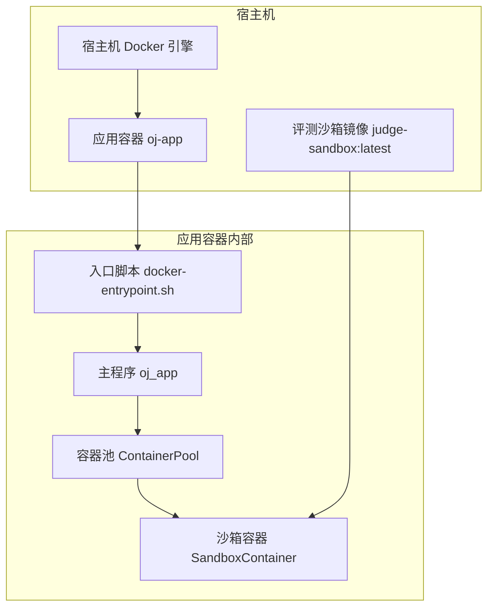
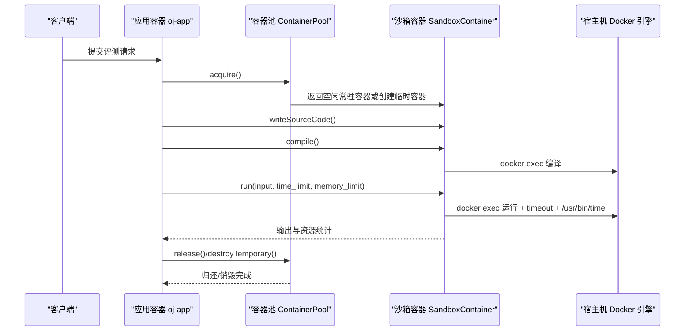
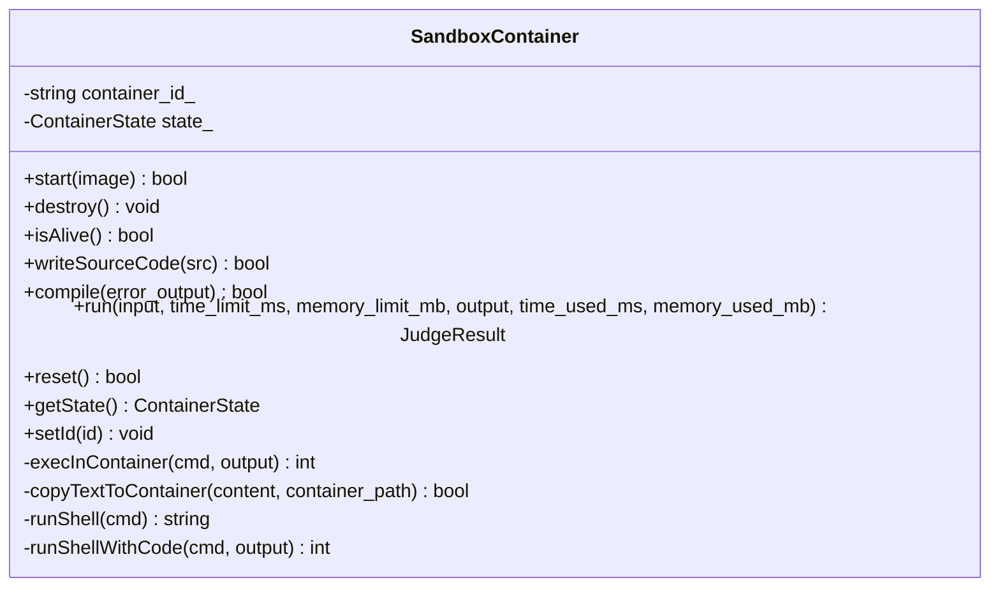
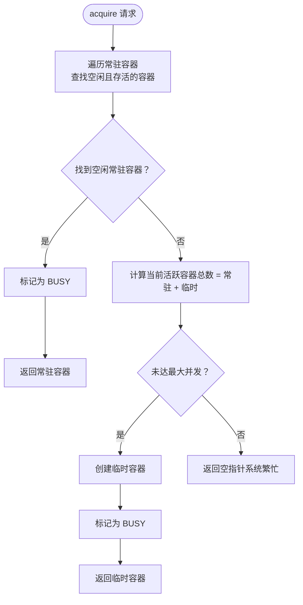
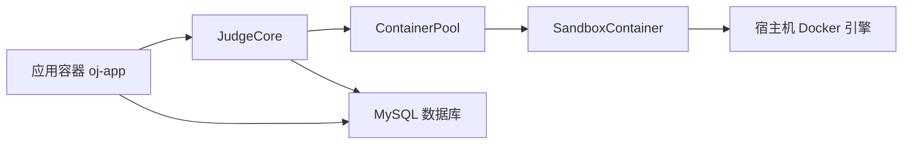
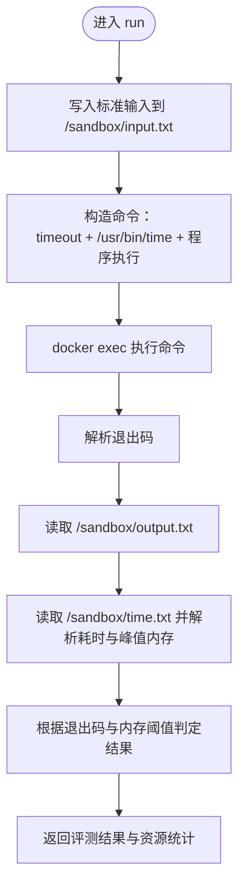

# 容器化沙箱架构

<cite>
**本文引用的文件**
- [sandbox_container.h](file://include/sandbox_container.h)
- [sandbox_container.cpp](file://src/sandbox_container.cpp)
- [Dockerfile（评测沙箱）](file://judge-sandbox/Dockerfile)
- [docker-compose.yml](file://docker-compose.yml)
- [docker-entrypoint.sh](file://docker-entrypoint.sh)
- [judge_core.h](file://include/judge_core.h)
- [judge_core.cpp](file://src/judge_core.cpp)
- [container_pool.h](file://include/container_pool.h)
- [container_pool.cpp](file://src/container_pool.cpp)
- [CMakeLists.txt](file://CMakeLists.txt)
- [init.sql](file://init.sql)
</cite>

## 目录
1. [简介](#简介)
2. [项目结构](#项目结构)
3. [核心组件](#核心组件)
4. [架构总览](#架构总览)
5. [详细组件分析](#详细组件分析)
6. [依赖关系分析](#依赖关系分析)
7. [性能考量](#性能考量)
8. [故障排除指南](#故障排除指南)
9. [结论](#结论)
10. [附录](#附录)

## 简介
本文件面向容器化沙箱架构，围绕 SandboxContainer 类的设计理念与实现原理展开，系统阐述 Docker 容器的生命周期管理（创建、启动、停止、销毁）、安全隔离机制（命名空间隔离、控制组资源限制、只读文件系统等）、Dockerfile 配置细节（基础镜像、编译环境、用户权限与安全策略）、容器与宿主机的文件系统映射（源代码挂载、测试数据共享、结果输出收集）、容器运行时的监控与日志收集（进程监控、资源统计、错误日志）、以及启动失败的故障排除与性能优化建议。

## 项目结构
该项目采用“应用容器 + 评测沙箱容器”的双层容器化架构：
- 应用容器（oj-app）：运行主程序，具备在容器内运行 Docker 的能力（通过共享 Docker Socket 与特权模式），负责数据库连接、用户交互、评测调度与结果展示。
- 评测沙箱容器（judge-sandbox）：基于 Ubuntu 22.04，提供 C++ 编译与运行环境，常驻模式保持存活，通过 docker exec 在容器内执行编译与运行命令，结合宿主机资源限制工具进行时间与内存监控。



图表来源
- [docker-compose.yml:13-81](file://docker-compose.yml#L13-L81)
- [docker-entrypoint.sh:1-92](file://docker-entrypoint.sh#L1-L92)
- [container_pool.cpp:16-22](file://src/container_pool.cpp#L16-L22)
- [sandbox_container.cpp:62-91](file://src/sandbox_container.cpp#L62-L91)

章节来源
- [docker-compose.yml:1-81](file://docker-compose.yml#L1-L81)
- [docker-entrypoint.sh:1-92](file://docker-entrypoint.sh#L1-L92)

## 核心组件
- SandboxContainer：封装单个 Docker 容器的生命周期与文件交互，支持常驻模式、源代码写入、编译、运行、重置与销毁。
- ContainerPool：容器池管理器，负责预创建常驻容器、按需创建临时容器、统一调度与回收。
- JudgeCore：评测核心，负责加载测试数据、编排容器执行流程、汇总评测结果。
- judge-sandbox Dockerfile：定义评测沙箱镜像的基础环境、非特权用户、工作目录与常驻入口。

章节来源
- [sandbox_container.h:26-111](file://include/sandbox_container.h#L26-L111)
- [sandbox_container.cpp:62-187](file://src/sandbox_container.cpp#L62-L187)
- [container_pool.h:21-76](file://include/container_pool.h#L21-L76)
- [container_pool.cpp:26-121](file://src/container_pool.cpp#L26-L121)
- [judge_core.h:60-104](file://include/judge_core.h#L60-L104)
- [judge_core.cpp:85-202](file://src/judge_core.cpp#L85-L202)
- [Dockerfile（评测沙箱）:1-29](file://judge-sandbox/Dockerfile#L1-L29)

## 架构总览
整体架构采用“应用容器 + 评测沙箱容器”的分层设计。应用容器通过特权模式与 Docker Socket 共享，在容器内直接调用 docker 命令创建与管理评测沙箱容器。评测沙箱容器以“sleep infinity”常驻，评测时通过 docker exec 在容器内编译与运行用户代码，利用宿主机的 timeout 与 /usr/bin/time 实现时间与内存的精确监控，并将输出与统计写入沙箱目录，随后由应用容器读取并汇总结果。



图表来源
- [judge_core.cpp:85-202](file://src/judge_core.cpp#L85-L202)
- [container_pool.cpp:52-89](file://src/container_pool.cpp#L52-L89)
- [sandbox_container.cpp:113-178](file://src/sandbox_container.cpp#L113-L178)

## 详细组件分析

### SandboxContainer 设计与实现
- 生命周期管理
  - start：以常驻模式启动容器，禁用网络、限制内存与进程数、丢弃所有 Linux capabilities、根文件系统只读，并将 /sandbox 挂载为内存文件系统，确保评测隔离与高性能。
  - isAlive：通过 docker inspect 检查容器运行状态。
  - destroy：强制停止并销毁容器。
  - reset：清理 /sandbox 目录，将容器置回空闲状态，便于复用。
- 文件与命令交互
  - writeSourceCode：将源代码写入容器 /sandbox/main.cpp。
  - compile：在容器内执行编译命令，捕获错误输出。
  - run：写入标准输入，使用 timeout 与 /usr/bin/time 限制时间与监控内存，解析退出码与资源统计，判定评测结果。
  - copyTextToContainer：通过宿主机临时文件与 docker exec stdin 管道写入容器，规避只读文件系统下的 docker cp 失败。
  - execInContainer：封装 docker exec 执行命令与输出捕获。
  - runShell/runShellWithCode：封装宿主机 shell 命令执行与退出码提取。



图表来源
- [sandbox_container.h:26-111](file://include/sandbox_container.h#L26-L111)
- [sandbox_container.cpp:11-31](file://src/sandbox_container.cpp#L11-L31)
- [sandbox_container.cpp:33-59](file://src/sandbox_container.cpp#L33-L59)
- [sandbox_container.cpp:62-109](file://src/sandbox_container.cpp#L62-L109)
- [sandbox_container.cpp:113-187](file://src/sandbox_container.cpp#L113-L187)

章节来源
- [sandbox_container.h:26-111](file://include/sandbox_container.h#L26-L111)
- [sandbox_container.cpp:62-187](file://src/sandbox_container.cpp#L62-L187)

### 容器池 ContainerPool
- 初始化：预创建 min_size 个常驻容器，确保系统启动后具备即时评测能力。
- 调度策略：
  - 优先分配空闲且存活的常驻容器；
  - 常驻容器全部繁忙时，若总量未达上限，则按需创建临时容器；
  - 评测结束后，临时容器立即销毁，常驻容器 reset 并回到空闲队列。
- 线程安全：使用互斥锁保护容器池状态与计数，避免竞态条件。



图表来源
- [container_pool.cpp:52-89](file://src/container_pool.cpp#L52-L89)

章节来源
- [container_pool.h:21-76](file://include/container_pool.h#L21-L76)
- [container_pool.cpp:26-121](file://src/container_pool.cpp#L26-L121)

### 评测核心 JudgeCore
- 配置与数据加载：支持设置时间/内存限制、源代码与测试数据路径；惰性初始化容器池。
- 评测流程：
  - 获取可用容器；
  - 写入源代码并编译；
  - 加载测试数据（.in/.out 成对）；
  - 逐点运行，比对输出，记录最大资源使用；
  - 归还常驻容器或销毁临时容器。
- 结果汇总：生成评测报告，包含总体结果、通过点数、最大时间与内存、各测试点详情与差异信息。

```mermaid
sequenceDiagram
    participant Core as "JudgeCore"
    participant Pool as "ContainerPool"
    participant Box as "SandboxContainer"
    participant FS as "文件系统"
    
    Core->>Pool: "ensurePool()"
    Pool-->>Core: "容器池就绪"
    Core->>Pool: "acquire()"
    Pool-->>Core: "返回容器"
    Core->>Box: "writeSourceCode()"
    Core->>Box: "compile()"
    Core->>FS: "加载测试数据(.in/.out)"
    
    loop "遍历每个测试点"
        Core->>Box: "run(input, limits)"
        Box-->>Core: "输出与资源统计"
        Core->>Core: "比对输出/更新最大资源"
    end
    
    alt "临时容器"
        Core->>Pool: "destroyTemporary()"
    else "常驻容器"
        Core->>Pool: "release()"
    end
```

图表来源
- [judge_core.cpp:85-202](file://src/judge_core.cpp#L85-L202)
- [container_pool.cpp:93-121](file://src/container_pool.cpp#L93-L121)
- [sandbox_container.cpp:113-178](file://src/sandbox_container.cpp#L113-L178)

章节来源
- [judge_core.h:60-104](file://include/judge_core.h#L60-L104)
- [judge_core.cpp:85-202](file://src/judge_core.cpp#L85-L202)

### Dockerfile（评测沙箱）配置详解
- 基础镜像：ubuntu:22.04，稳定可靠。
- 环境变量：禁用交互式前端，减少安装过程中的阻塞与非必要输出。
- 编译环境：安装 g++、gcc、make、time，满足 C++17 编译与运行时统计需求。
- 用户权限：创建非特权用户 runner，切换至该用户降低攻击面。
- 工作目录与入口：WORKDIR /sandbox，CMD ["sleep", "infinity"]，配合 --tmpfs 在运行时挂载内存文件系统。

章节来源
- [Dockerfile（评测沙箱）:1-29](file://judge-sandbox/Dockerfile#L1-L29)

### 容器与宿主机的文件系统映射
- 测试数据映射：宿主机 ./data 以只读方式挂载到应用容器 /app/data，保障评测数据安全与一致性。
- 用户工作区映射：宿主机 ./workspace 以读写方式挂载到应用容器 /app/workspace，便于用户代码保存与查看。
- Docker Socket 共享：将 /var/run/docker.sock 挂载到应用容器，使主程序可在容器内调用 docker 命令创建与管理沙箱容器。
- 沙箱目录挂载：评测沙箱镜像通过 --tmpfs 将 /sandbox 挂载为内存文件系统，提升 I/O 性能并确保评测结束后数据不落盘。

章节来源
- [docker-compose.yml:64-67](file://docker-compose.yml#L64-L67)
- [sandbox_container.cpp:66-73](file://src/sandbox_container.cpp#L66-L73)
- [Dockerfile（评测沙箱）:20-27](file://judge-sandbox/Dockerfile#L20-L27)

### 安全隔离机制
- 命名空间隔离：容器间通过独立 PID、IPC、NET、Mount、UTS、User 命名空间实现进程与资源隔离。
- 控制组（Cgroups）资源限制：通过 --memory、--pids-limit、--tmpfs 等参数限制内存与进程数，避免资源滥用。
- 只读文件系统：根文件系统设置为只读，降低恶意代码持久化的可能性。
- 能力降级：--cap-drop=ALL 移除所有 Linux capabilities，最小化容器内可执行的高危操作。
- 网络隔离：--network none 禁止容器访问网络，防止逃逸与外联。
- 非特权用户：评测代码在 runner 用户下运行，进一步降低权限风险。

章节来源
- [sandbox_container.cpp:66-73](file://src/sandbox_container.cpp#L66-L73)
- [Dockerfile（评测沙箱）:17-24](file://judge-sandbox/Dockerfile#L17-L24)

### 监控与日志收集
- 进程监控：使用 timeout 对程序运行时间进行强制限制，超时返回特定退出码。
- 资源统计：使用 /usr/bin/time 的 -f 选项输出实际耗时（秒）与峰值内存（KB），转换为毫秒与 MB 供上层使用。
- 错误日志：编译错误与运行错误均通过容器内输出返回，应用侧记录并汇总到评测报告。
- 容器健康：ContainerPool 与 SandboxContainer 提供 isAlive 与 destroy 机制，保证异常容器及时回收。

章节来源
- [sandbox_container.cpp:138-178](file://src/sandbox_container.cpp#L138-L178)
- [sandbox_container.cpp:102-109](file://src/sandbox_container.cpp#L102-L109)
- [sandbox_container.cpp:93-100](file://src/sandbox_container.cpp#L93-L100)

## 依赖关系分析
- 组件耦合
  - JudgeCore 依赖 ContainerPool 与 SandboxContainer，负责业务编排与结果汇总。
  - ContainerPool 依赖 SandboxContainer，负责容器生命周期与调度。
  - SandboxContainer 依赖宿主机 Docker 与 shell 工具，负责容器内命令执行与文件交互。
- 外部依赖
  - Docker 引擎：通过宿主机 Docker Socket 与特权模式提供容器管理能力。
  - MySQL：通过 docker-compose 编排数据库服务，应用容器通过环境变量连接。
  - CMake 与第三方库：MySQL 客户端与 OpenSSL，用于数据库连接与加密。



图表来源
- [judge_core.cpp:18-28](file://src/judge_core.cpp#L18-L28)
- [container_pool.cpp:16-22](file://src/container_pool.cpp#L16-L22)
- [sandbox_container.cpp:33-39](file://src/sandbox_container.cpp#L33-L39)
- [docker-compose.yml:16-37](file://docker-compose.yml#L16-L37)

章节来源
- [CMakeLists.txt:11-34](file://CMakeLists.txt#L11-L34)
- [docker-compose.yml:13-81](file://docker-compose.yml#L13-L81)

## 性能考量
- 常驻容器预热：启动时预创建少量常驻容器，显著降低首次评测延迟。
- 内存文件系统：沙箱目录挂载为 tmpfs，I/O 性能高，适合频繁读写的评测场景。
- 资源上限：容器级内存与进程数限制，避免单容器占用过多资源影响并发。
- 并发控制：通过最大并发容器数限制，平衡吞吐与稳定性。
- 优化建议
  - 合理设置时间与内存限制，避免频繁超时或超内存导致的失败。
  - 在高并发场景下适当增加常驻容器数量，减少临时容器创建开销。
  - 使用 SSD 存储测试数据与工作区，提升 I/O 性能。
  - 定期清理不再使用的镜像与容器，释放磁盘空间。

[本节为通用性能指导，不直接分析具体文件]

## 故障排除指南
- 容器启动失败
  - 症状：start 返回 false，控制台打印启动失败信息。
  - 排查要点：确认 Docker Socket 已正确挂载、特权模式已开启、镜像 judge-sandbox:latest 已存在或可构建。
  - 参考路径：[sandbox_container.cpp:62-91](file://src/sandbox_container.cpp#L62-L91)，[docker-entrypoint.sh:46-67](file://docker-entrypoint.sh#L46-L67)
- 容器不可用或异常
  - 症状：isAlive 返回 false 或运行时报错。
  - 排查要点：检查容器是否被外部销毁、是否因资源限制被系统终止、是否处于 ERROR 状态。
  - 参考路径：[sandbox_container.cpp:102-109](file://src/sandbox_container.cpp#L102-L109)，[sandbox_container.cpp:93-100](file://src/sandbox_container.cpp#L93-L100)
- 编译失败
  - 症状：compile 返回 false，错误信息来自容器内编译器输出。
  - 排查要点：检查源代码语法、C++ 标准与编译选项、头文件是否存在。
  - 参考路径：[sandbox_container.cpp:118-125](file://src/sandbox_container.cpp#L118-L125)
- 运行超时或超内存
  - 症状：run 返回 TIME_LIMIT_EXCEEDED 或 MEMORY_LIMIT_EXCEEDED。
  - 排查要点：调整时间/内存限制、优化算法与数据结构、检查是否存在死循环或内存泄漏。
  - 参考路径：[sandbox_container.cpp:127-178](file://src/sandbox_container.cpp#L127-L178)
- 数据库连接失败
  - 症状：应用启动阶段数据库连接超时。
  - 排查要点：确认 oj-db 服务健康、网络连通、凭据正确、初始化脚本已执行。
  - 参考路径：[docker-entrypoint.sh:26-44](file://docker-entrypoint.sh#L26-L44)，[docker-compose.yml:32-37](file://docker-compose.yml#L32-L37)，[init.sql:1-278](file://init.sql#L1-L278)

章节来源
- [sandbox_container.cpp:62-109](file://src/sandbox_container.cpp#L62-L109)
- [sandbox_container.cpp:118-178](file://src/sandbox_container.cpp#L118-L178)
- [docker-entrypoint.sh:26-67](file://docker-entrypoint.sh#L26-L67)
- [docker-compose.yml:32-37](file://docker-compose.yml#L32-L37)
- [init.sql:1-278](file://init.sql#L1-L278)

## 结论
本容器化沙箱架构通过“应用容器 + 评测沙箱容器”的双层设计，实现了安全、可控、高性能的在线评测能力。SandboxContainer 以常驻模式与严格的资源与权限控制，确保评测过程的隔离与稳定；ContainerPool 通过预热与调度策略提升并发性能；JudgeCore 将编译、运行、比对与统计整合为统一流程。配合 docker-compose 的编排与 docker-entrypoint.sh 的自动化初始化，系统具备良好的可运维性与扩展性。

[本节为总结性内容，不直接分析具体文件]

## 附录
- 关键流程图（算法实现）
  - run 方法的资源限制与结果判定流程如下：



图表来源
- [sandbox_container.cpp:127-178](file://src/sandbox_container.cpp#L127-L178)