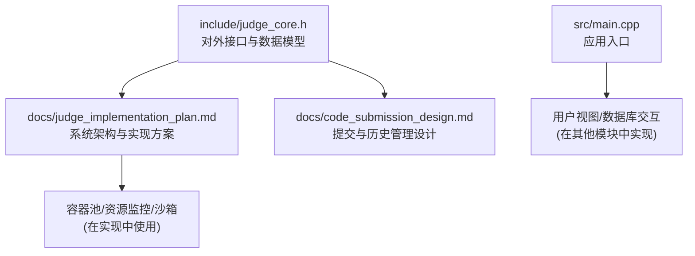
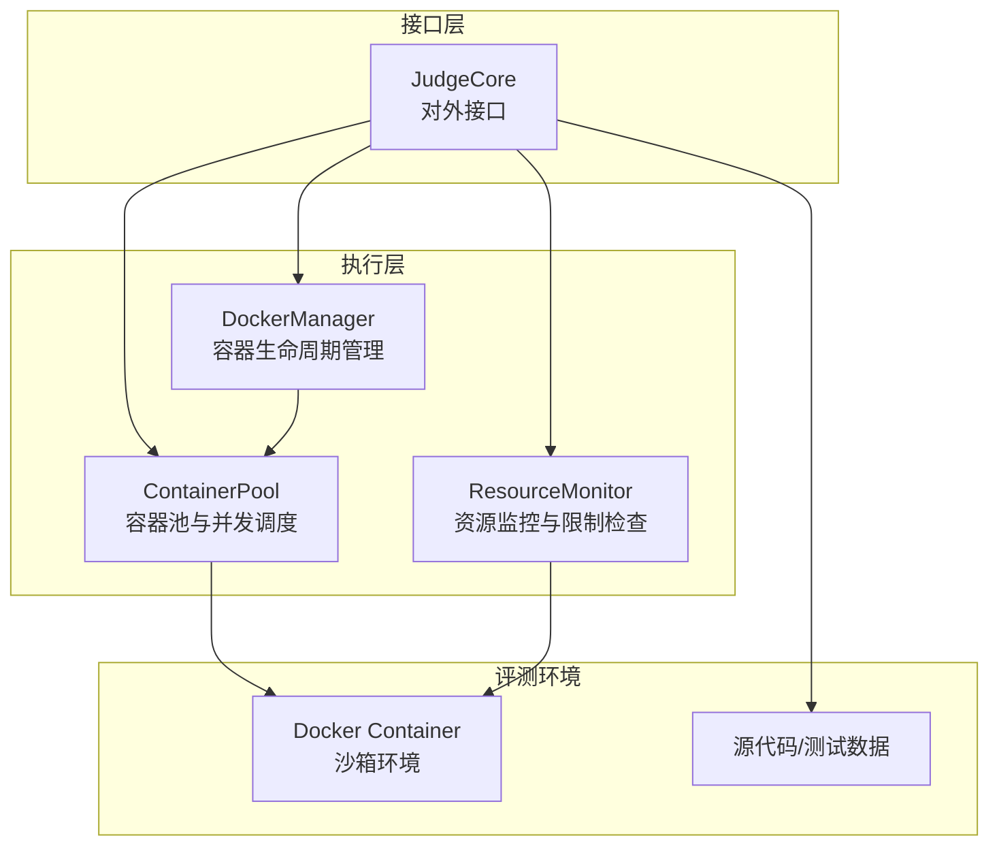
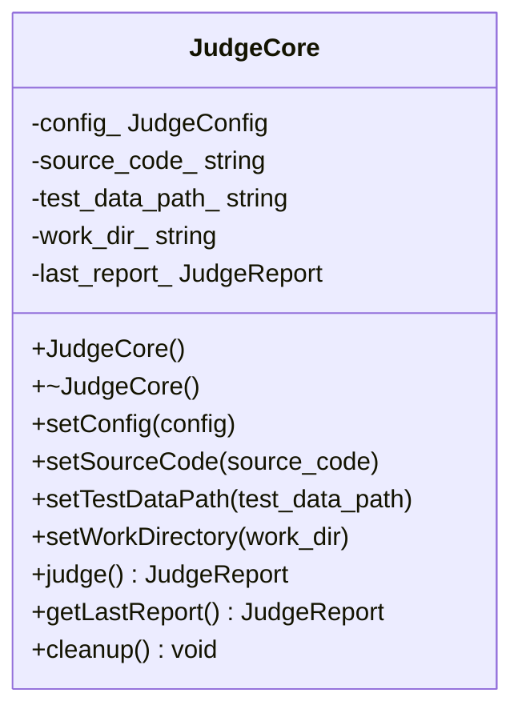
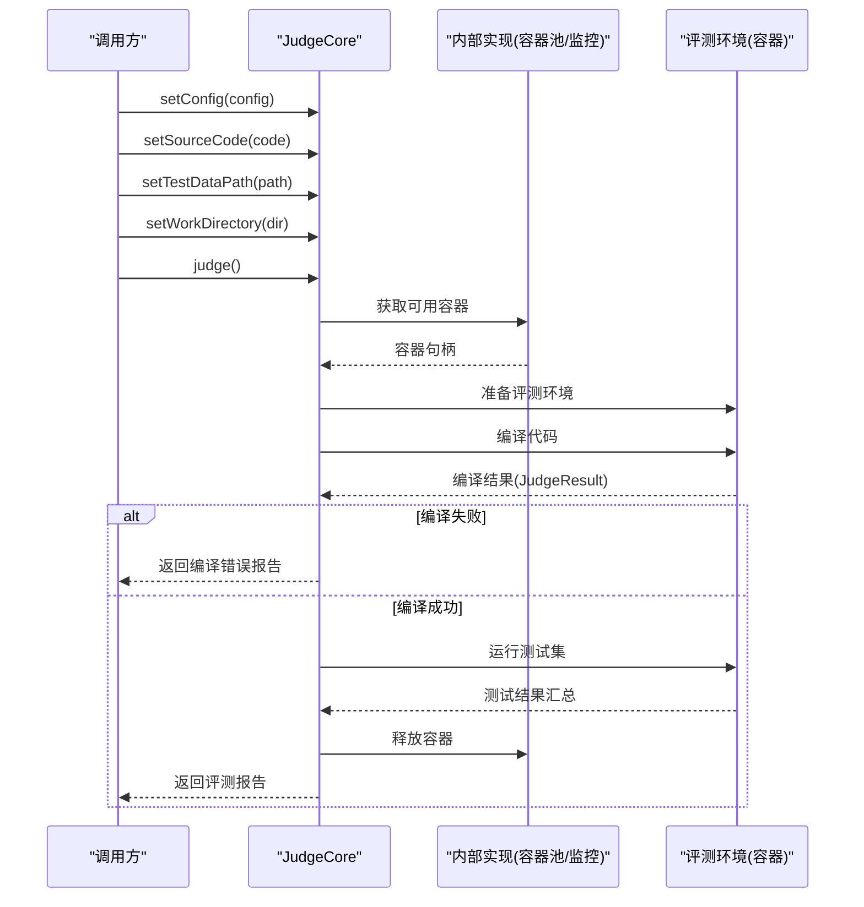
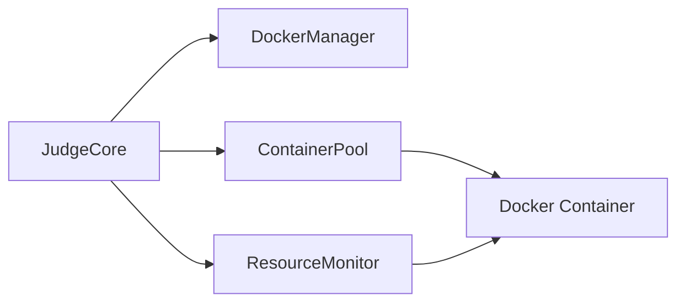

# 评测核心接口设计

<cite>
**本文引用的文件**
- [include/judge_core.h](file://include/judge_core.h)
- [docs/judge_implementation_plan.md](file://docs/judge_implementation_plan.md)
- [docs/code_submission_design.md](file://docs/code_submission_design.md)
- [src/main.cpp](file://src/main.cpp)
</cite>

## 目录
1. [简介](#简介)
2. [项目结构](#项目结构)
3. [核心组件](#核心组件)
4. [架构总览](#架构总览)
5. [详细组件分析](#详细组件分析)
6. [依赖关系分析](#依赖关系分析)
7. [性能考量](#性能考量)
8. [故障排查指南](#故障排查指南)
9. [结论](#结论)
10. [附录](#附录)

## 简介
本文件面向“评测核心接口设计”的目标，围绕 JudgeCore 的对外接口与数据模型进行系统化技术文档整理。重点包括：
- 评测结果枚举 JudgeResult 的设计理念与状态转换规则
- 评测配置结构体 JudgeConfig 的各项资源控制参数
- 评测结果结构体 JudgeReport 的字段设计与语义
- JudgeCore 类的核心接口方法（构造/析构、配置设置、源代码处理、测试数据管理、评测执行、清理）
- 接口使用最佳实践与扩展指南

同时，结合实现方案文档对 JudgeCore 的内部执行流程、容器化评测、资源监控与并发调度进行补充说明，帮助开发者构建稳定、可扩展的评测能力。

## 项目结构
本仓库采用头文件与实现分离的组织方式，评测核心接口定义于头文件，系统架构与实现细节在文档中进行阐述。关键文件如下：
- include/judge_core.h：对外公开的评测接口与数据模型定义
- docs/judge_implementation_plan.md：评测系统架构、容器化与资源监控的实现方案
- docs/code_submission_design.md：与评测相关的代码提交与历史管理设计
- src/main.cpp：应用入口，体现系统整体运行流程

图表来源
- [include/judge_core.h:1-120](file://include/judge_core.h#L1-L120)
- [docs/judge_implementation_plan.md:1-200](file://docs/judge_implementation_plan.md#L1-L200)
- [src/main.cpp:1-14](file://src/main.cpp#L1-L14)

章节来源
- [include/judge_core.h:1-120](file://include/judge_core.h#L1-L120)
- [docs/judge_implementation_plan.md:1-200](file://docs/judge_implementation_plan.md#L1-L200)
- [src/main.cpp:1-14](file://src/main.cpp#L1-L14)

## 核心组件
本节聚焦评测接口与数据模型的定义与职责划分。

- 评测结果枚举 JudgeResult：用于统一表达评测过程中的各类状态，便于上层逻辑进行分支处理与结果展示。
- 评测配置结构体 JudgeConfig：承载评测所需的资源限制与语言信息，作为 JudgeCore 的输入参数。
- 评测结果结构体 JudgeReport：承载评测完成后的一次性结果与性能指标，便于持久化与展示。
- 评测核心类 JudgeCore：对外暴露简洁的接口，负责配置注入、源代码与测试数据准备、评测执行与结果返回，并提供清理能力。

章节来源
- [include/judge_core.h:9-46](file://include/judge_core.h#L9-L46)
- [include/judge_core.h:53-117](file://include/judge_core.h#L53-L117)

## 架构总览
评测系统采用“接口层 + 容器化评测 + 资源监控 + 并发调度”的分层架构。JudgeCore 作为对外接口层，内部通过容器池、资源监控与沙箱等组件完成实际评测任务。

图表来源
- [docs/judge_implementation_plan.md:9-554](file://docs/judge_implementation_plan.md#L9-L554)

## 详细组件分析

### 评测结果枚举 JudgeResult
- 设计理念
  - 以统一枚举表达评测生命周期中的关键状态，覆盖等待、编译、运行、通过、答案错误、超时、超内存、运行时错误、编译错误、系统错误等。
  - 便于上层根据状态进行分支处理与结果展示；避免使用魔法字符串或整数常量带来的歧义。
- 状态转换规则
  - 评测流程通常遵循：等待 -> 编译中 -> 运行中 -> 最终结果（通过/错误之一）。超时、超内存、运行时错误、编译错误、系统错误等作为异常路径返回。
  - 该转换规则在实现方案中通过容器执行与资源监控共同保障，最终以 JudgeResult 形式反馈。

章节来源
- [include/judge_core.h:9-21](file://include/judge_core.h#L9-L21)
- [docs/judge_implementation_plan.md:494-554](file://docs/judge_implementation_plan.md#L494-L554)

### 评测配置结构体 JudgeConfig
- 字段与含义
  - time_limit_ms：时间限制（毫秒），用于限制单次评测运行时间。
  - memory_limit_mb：内存限制（MB），用于限制容器内进程内存使用。
  - output_limit_mb：输出限制（MB），用于限制标准输出大小。
  - stack_limit_mb：栈空间限制（MB），用于限制栈使用。
  - language：编程语言标识（当前支持 C++）。
- 资源控制机制
  - 以上参数在容器化评测中通过沙箱与 cgroup 限制实现，确保评测隔离与公平性。
  - 实现方案中强调容器内的编译与运行均受上述限制约束。

章节来源
- [include/judge_core.h:26-33](file://include/judge_core.h#L26-L33)
- [docs/judge_implementation_plan.md:339-390](file://docs/judge_implementation_plan.md#L339-L390)

### 评测结果结构体 JudgeReport
- 字段与含义
  - result：评测结果（JudgeResult）。
  - time_used_ms：实际使用时间（毫秒）。
  - memory_used_mb：实际使用内存（MB）。
  - error_message：错误信息（编译错误、运行时错误等）。
  - passed_test_cases：通过的测试点数量。
  - total_test_cases：总测试点数量。
- 设计要点
  - 字段覆盖评测结果、性能指标与错误信息，便于前端展示与数据库持久化。
  - 通过 passed_test_cases 与 total_test_cases 可计算得分或通过率。

章节来源
- [include/judge_core.h:38-46](file://include/judge_core.h#L38-L46)

### JudgeCore 类核心接口方法
- 构造与析构
  - 构造函数：初始化内部状态与资源池。
  - 析构函数：释放资源。
- 配置与输入设置
  - setConfig：注入评测配置（JudgeConfig）。
  - setSourceCode：注入用户源代码。
  - setTestDataPath：设置测试数据路径。
  - setWorkDirectory：设置工作目录（用于存放临时文件）。
- 评测执行与结果
  - judge：执行评测，返回 JudgeReport。
  - getLastReport：获取最后一次评测结果。
  - cleanup：清理工作目录中的临时文件。
- 设计约束
  - 禁止拷贝与赋值，确保线程安全与资源唯一性。

图表来源
- [include/judge_core.h:53-117](file://include/judge_core.h#L53-L117)

章节来源
- [include/judge_core.h:53-117](file://include/judge_core.h#L53-L117)

### 评测执行流程（接口层面）
以下序列图展示了 JudgeCore 的典型调用链与返回结果：

图表来源
- [docs/judge_implementation_plan.md:494-554](file://docs/judge_implementation_plan.md#L494-L554)

## 依赖关系分析
- 外部依赖
  - 容器化运行：依赖 Docker 环境与容器管理能力。
  - 资源监控：依赖 Docker Stats 或 cgroup 接口获取实时资源使用。
  - 并发调度：依赖容器池实现多容器并发评测。
- 内部耦合
  - JudgeCore 与实现层通过内部 Impl 模式解耦，降低头文件依赖复杂度。
  - 评测结果与配置通过结构体传递，保持接口简洁稳定。

图表来源
- [docs/judge_implementation_plan.md:9-554](file://docs/judge_implementation_plan.md#L9-L554)

章节来源
- [docs/judge_implementation_plan.md:9-554](file://docs/judge_implementation_plan.md#L9-L554)

## 性能考量
- 容器池容量与并发
  - 通过最小/最大容器数量控制评测并发度，平衡吞吐与资源占用。
- 资源限制精度
  - 时间、内存、输出、栈等限制应与题目要求匹配，避免过严或过松导致误判。
- 监控开销
  - 资源监控频率与粒度需折中，避免过度采样影响评测性能。
- I/O 与磁盘
  - 测试数据与临时文件的读写应尽量减少随机访问，提高评测稳定性。

## 故障排查指南
- 常见错误类型与处理策略
  - 编译错误：返回编译错误状态并记录错误信息，便于定位语法问题。
  - 运行时错误：捕获异常或信号，返回运行时错误状态并记录退出码或错误输出。
  - 资源超限：检测到超时或超内存时强制终止，返回对应结果。
  - 系统错误：容器异常或 Docker 通信失败时销毁并重建容器。
  - 网络错误：与容器通信失败时重试多次，失败则标记系统错误。
- 建议排查步骤
  - 检查容器池健康状态与可用性。
  - 校验资源限制参数是否合理。
  - 查看错误信息与日志，确认是否为沙箱限制导致的误判。
  - 复核测试数据与输入输出格式。

章节来源
- [docs/judge_implementation_plan.md:591-601](file://docs/judge_implementation_plan.md#L591-L601)

## 结论
JudgeCore 以简洁稳定的接口抽象了评测全流程，结合容器化与资源监控实现了高可靠、可扩展的评测能力。通过统一的结果枚举与结构化报告，开发者可以快速集成评测服务，并在实现层灵活扩展容器池、监控策略与沙箱能力。

## 附录

### 接口使用最佳实践
- 配置阶段
  - 明确时间、内存、输出、栈等限制，与题目要求一致。
  - 语言参数固定为 C++，确保编译与运行环境正确。
- 源代码与测试数据
  - 源代码与测试数据路径需在评测前校验有效性。
  - 工作目录用于存放临时文件，评测结束后务必清理。
- 结果处理
  - 根据 JudgeResult 进行分支处理，结合 JudgeReport 的性能指标与错误信息进行展示与记录。
  - 通过 passed_test_cases 与 total_test_cases 计算得分或通过率。

### 扩展指南
- 新增评测语言
  - 在 JudgeConfig 中扩展语言标识，并在容器镜像与沙箱脚本中增加对应编译器支持。
- 自定义资源限制
  - 在 JudgeConfig 中新增限制项，并在容器运行时应用相应 cgroup 限制。
- 增强监控维度
  - 在 ResourceMonitor 中扩展指标采集（如 I/O、网络），并在 JudgeReport 中补充字段。
- 并发与调度优化
  - 调整容器池的最小/最大容量与健康检查策略，提升并发评测吞吐。

章节来源
- [include/judge_core.h:26-33](file://include/judge_core.h#L26-L33)
- [docs/judge_implementation_plan.md:339-390](file://docs/judge_implementation_plan.md#L339-L390)