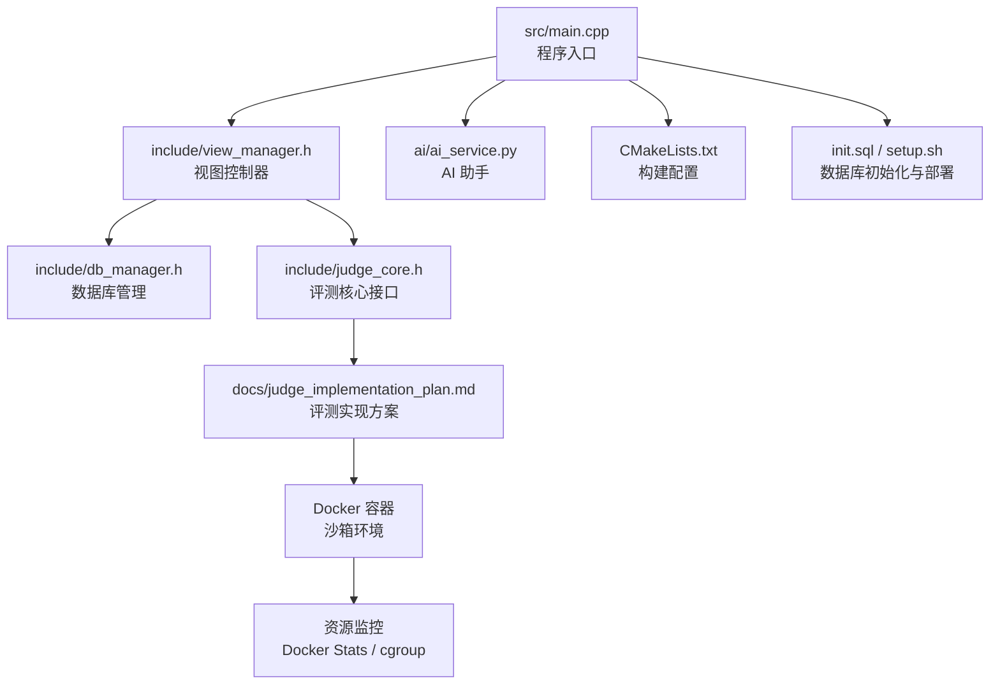
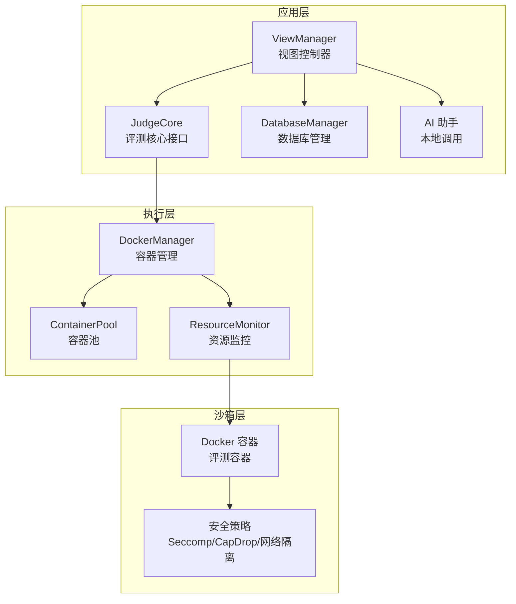
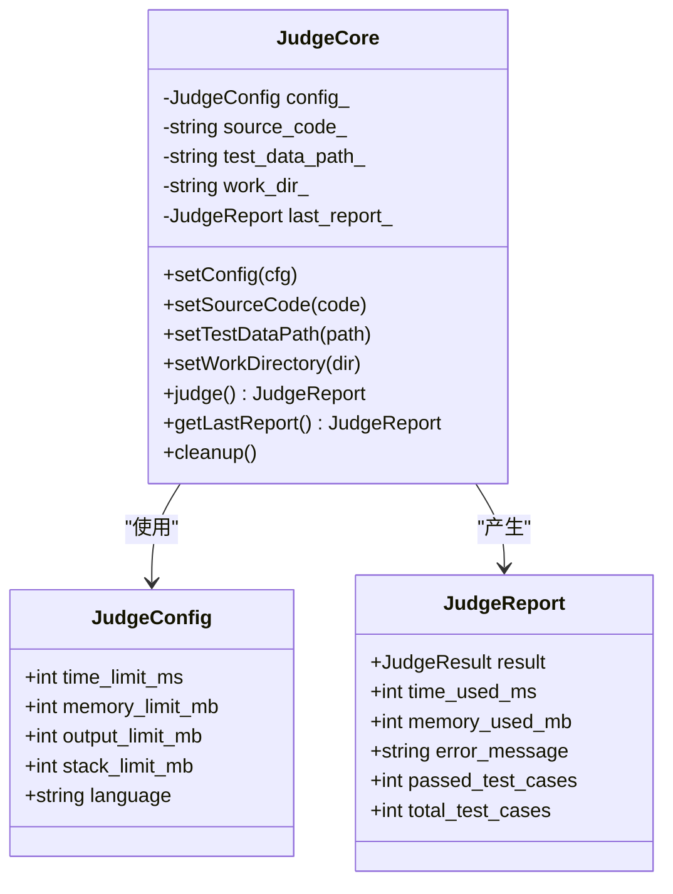
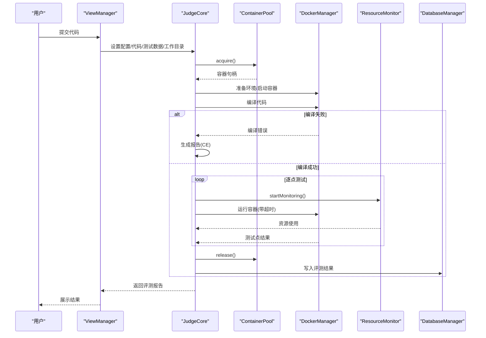
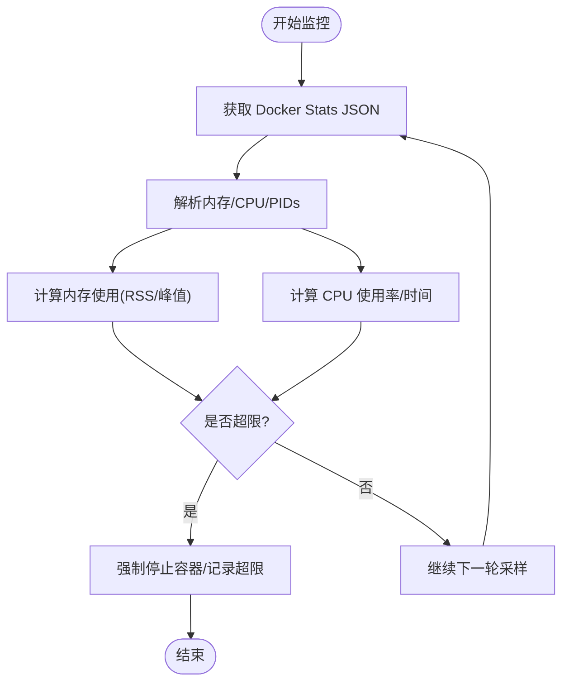
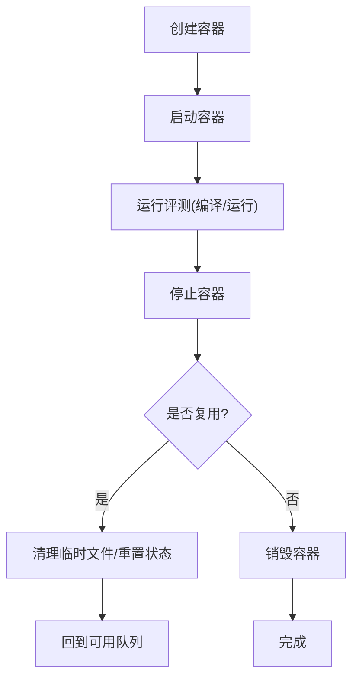
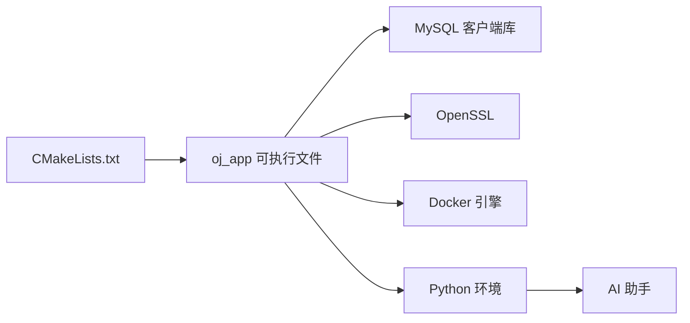

# 评测流程优化与监控

<cite>
**本文引用的文件**
- [README.md](file://README.md)
- [CMakeLists.txt](file://CMakeLists.txt)
- [src/main.cpp](file://src/main.cpp)
- [include/judge_core.h](file://include/judge_core.h)
- [docs/judge_implementation_plan.md](file://docs/judge_implementation_plan.md)
- [include/db_manager.h](file://include/db_manager.h)
- [include/view_manager.h](file://include/view_manager.h)
- [init.sql](file://init.sql)
- [setup.sh](file://setup.sh)
- [ai/ai_service.py](file://ai/ai_service.py)
- [ai/requirements.txt](file://ai/requirements.txt)
- [History/OJ_v0.1.md](file://History/OJ_v0.1.md)
- [History/OJ_v0.2.md](file://History/OJ_v0.2.md)
</cite>

## 目录
1. [简介](#简介)
2. [项目结构](#项目结构)
3. [核心组件](#核心组件)
4. [架构总览](#架构总览)
5. [详细组件分析](#详细组件分析)
6. [依赖关系分析](#依赖关系分析)
7. [性能考量](#性能考量)
8. [故障诊断与排错指南](#故障诊断与排错指南)
9. [结论](#结论)
10. [附录](#附录)

## 简介
本技术文档围绕“评测流程优化与性能监控”主题，系统梳理并深化了 OJ 评测系统在代码编译优化、执行环境准备、测试用例执行与结果收集分析方面的设计与实现要点；同时，结合容器化沙箱与资源监控方案，阐述了 CPU 使用率、内存消耗、I/O 操作与网络延迟的测量方法；并总结并发评测的实现策略（多线程处理、任务调度与资源分配优化）、评测质量保证机制（结果验证、异常处理与错误恢复），以及性能基准测试与故障诊断实践，帮助开发者高效定位与解决评测系统中的技术问题。

## 项目结构
OJ 评测系统采用 C++17 与 CMake 构建，核心入口位于命令行界面，数据库访问通过 MySQL 客户端库封装，评测核心接口定义在头文件中，评测实现方案文档提供了容器化评测的完整蓝图。AI 助手作为辅助教学工具，提供本地调用接口。

图表来源
- [src/main.cpp:1-14](file://src/main.cpp#L1-L14)
- [include/view_manager.h:1-43](file://include/view_manager.h#L1-L43)
- [include/db_manager.h:1-53](file://include/db_manager.h#L1-L53)
- [include/judge_core.h:1-120](file://include/judge_core.h#L1-L120)
- [docs/judge_implementation_plan.md:1-748](file://docs/judge_implementation_plan.md#L1-L748)
- [CMakeLists.txt:1-40](file://CMakeLists.txt#L1-L40)
- [init.sql:1-278](file://init.sql#L1-L278)
- [setup.sh:1-41](file://setup.sh#L1-L41)
- [ai/ai_service.py:1-113](file://ai/ai_service.py#L1-L113)

章节来源
- [README.md:1-2](file://README.md#L1-L2)
- [CMakeLists.txt:1-40](file://CMakeLists.txt#L1-L40)
- [src/main.cpp:1-14](file://src/main.cpp#L1-L14)
- [include/view_manager.h:1-43](file://include/view_manager.h#L1-L43)
- [include/db_manager.h:1-53](file://include/db_manager.h#L1-L53)
- [include/judge_core.h:1-120](file://include/judge_core.h#L1-L120)
- [docs/judge_implementation_plan.md:1-748](file://docs/judge_implementation_plan.md#L1-L748)
- [init.sql:1-278](file://init.sql#L1-L278)
- [setup.sh:1-41](file://setup.sh#L1-L41)
- [ai/ai_service.py:1-113](file://ai/ai_service.py#L1-L113)

## 核心组件
- 评测核心接口（JudgeCore）：定义评测配置、评测报告、编译/运行/清理等能力，提供对外统一接口。
- 视图控制器（ViewManager）：负责登录菜单与角色切换，承载用户交互入口。
- 数据库管理（DatabaseManager）：封装 MySQL 连接与 SQL 执行，支撑用户、题目与提交记录的数据持久化。
- 评测实现方案（docs/judge_implementation_plan.md）：提供容器化评测、资源监控、并行调度与安全隔离的完整设计蓝图。
- 构建与部署（CMakeLists.txt、setup.sh、init.sql）：定义编译标准、链接库、导出编译命令、一键初始化数据库与部署流程。
- AI 助手（ai/ai_service.py）：提供本地调用的 AI 辅导接口，支持会话记忆与上下文注入。

章节来源
- [include/judge_core.h:1-120](file://include/judge_core.h#L1-L120)
- [include/view_manager.h:1-43](file://include/view_manager.h#L1-L43)
- [include/db_manager.h:1-53](file://include/db_manager.h#L1-L53)
- [docs/judge_implementation_plan.md:1-748](file://docs/judge_implementation_plan.md#L1-L748)
- [CMakeLists.txt:1-40](file://CMakeLists.txt#L1-L40)
- [setup.sh:1-41](file://setup.sh#L1-L41)
- [init.sql:1-278](file://init.sql#L1-L278)
- [ai/ai_service.py:1-113](file://ai/ai_service.py#L1-L113)

## 架构总览
评测系统采用“命令行界面 + 评测核心 + 容器化沙箱 + 资源监控”的分层架构。命令行入口启动视图控制器，用户完成登录后进入相应角色界面；提交的代码通过评测核心接口进入容器化沙箱，利用 Docker 的资源限制与安全策略保障评测的公平性与安全性；资源监控模块持续采集 CPU、内存、进程数等指标，结合墙钟时间与 CPU 时间综合判定 TLE/MLE；最终将评测结果写入数据库并反馈给用户。

图表来源
- [docs/judge_implementation_plan.md:9-41](file://docs/judge_implementation_plan.md#L9-L41)
- [docs/judge_implementation_plan.md:131-158](file://docs/judge_implementation_plan.md#L131-L158)
- [docs/judge_implementation_plan.md:342-375](file://docs/judge_implementation_plan.md#L342-L375)
- [docs/judge_implementation_plan.md:497-554](file://docs/judge_implementation_plan.md#L497-L554)

## 详细组件分析

### 评测核心接口（JudgeCore）
- 职责：封装评测配置、源代码、测试数据路径、工作目录设置；提供评测执行与报告获取、清理临时文件的能力。
- 关键点：
  - 配置项包含时间/内存/输出/栈限制与编程语言。
  - 报告包含结果、耗时、内存、错误信息、通过/总数等。
  - 禁止拷贝构造，避免资源竞争。
- 设计优势：接口清晰、职责单一，便于与容器池与监控模块解耦。

图表来源
- [include/judge_core.h:26-46](file://include/judge_core.h#L26-L46)
- [include/judge_core.h:53-117](file://include/judge_core.h#L53-L117)

章节来源
- [include/judge_core.h:1-120](file://include/judge_core.h#L1-L120)

### 评测流程与并发策略
- 流程概览：接收代码 → 准备环境 → 编译 → 逐点测试 → 汇总结果 → 写入数据库 → 返回用户。
- 并发策略：容器池管理多个评测容器，调度器轮询可用容器，实现多任务并行；容器复用与预热降低启动开销；健康检查与故障恢复提升稳定性。
- 资源限制：CPU、内存、时间、输出、进程数等限制，结合墙钟时间与 CPU 时间综合判定 TLE/MLE。

图表来源
- [docs/judge_implementation_plan.md:395-440](file://docs/judge_implementation_plan.md#L395-L440)
- [docs/judge_implementation_plan.md:131-158](file://docs/judge_implementation_plan.md#L131-L158)
- [docs/judge_implementation_plan.md:342-375](file://docs/judge_implementation_plan.md#L342-L375)
- [docs/judge_implementation_plan.md:444-468](file://docs/judge_implementation_plan.md#L444-L468)

章节来源
- [docs/judge_implementation_plan.md:395-440](file://docs/judge_implementation_plan.md#L395-L440)
- [docs/judge_implementation_plan.md:131-158](file://docs/judge_implementation_plan.md#L131-L158)
- [docs/judge_implementation_plan.md:342-375](file://docs/judge_implementation_plan.md#L342-L375)
- [docs/judge_implementation_plan.md:444-468](file://docs/judge_implementation_plan.md#L444-L468)

### 性能监控指标与测量方法
- 指标体系：CPU 使用率、内存使用（RSS/峰值）、CPU 时间、进程数、OOM 终止标志。
- 测量手段：
  - Docker Stats API：实时采集内存、CPU、PIDs。
  - cgroup 直接读取：更精确的内存使用与 CPU 时间统计。
  - 墙钟时间与 CPU 时间：区分真实耗时与 CPU 资源占用，避免多核影响。
- 应用场景：结合时间限制与内存限制，判定 TLE/MLE；识别异常资源占用与潜在泄漏。

图表来源
- [docs/judge_implementation_plan.md:342-375](file://docs/judge_implementation_plan.md#L342-L375)
- [docs/judge_implementation_plan.md:379-390](file://docs/judge_implementation_plan.md#L379-L390)

章节来源
- [docs/judge_implementation_plan.md:342-375](file://docs/judge_implementation_plan.md#L342-L375)
- [docs/judge_implementation_plan.md:379-390](file://docs/judge_implementation_plan.md#L379-L390)

### 安全与隔离
- Docker 安全选项：禁网、只读根文件系统、禁止特权、丢弃所有 capabilities、Seccomp 默认策略、AppArmor 配置。
- 文件系统隔离：只读挂载测试数据、临时目录使用 tmpfs、禁止设备挂载。
- 容器生命周期：创建、启动、停止、销毁、重置，支持健康检查与故障恢复。

图表来源
- [docs/judge_implementation_plan.md:184-216](file://docs/judge_implementation_plan.md#L184-L216)
- [docs/judge_implementation_plan.md:225-252](file://docs/judge_implementation_plan.md#L225-L252)
- [docs/judge_implementation_plan.md:285-308](file://docs/judge_implementation_plan.md#L285-L308)

章节来源
- [docs/judge_implementation_plan.md:184-216](file://docs/judge_implementation_plan.md#L184-L216)
- [docs/judge_implementation_plan.md:225-252](file://docs/judge_implementation_plan.md#L225-L252)
- [docs/judge_implementation_plan.md:285-308](file://docs/judge_implementation_plan.md#L285-L308)

### 评测质量保证机制
- 结果验证：逐点对比输出，WA 时记录差异信息；TLE/MLE 通过资源监控与时间限制判定；RE 通过退出码与错误输出识别。
- 异常处理：编译错误（CE）、运行时错误（RE）、资源超限（TLE/MLE）、系统错误（SE）、网络错误（重试与标记）。
- 错误恢复：容器故障自动停止/强制终止/销毁/重建；超时强制停止并记录结果；健康检查与动态扩容。

章节来源
- [docs/judge_implementation_plan.md:595-602](file://docs/judge_implementation_plan.md#L595-L602)
- [docs/judge_implementation_plan.md:606-637](file://docs/judge_implementation_plan.md#L606-L637)

### 数据库写入与结果返回
- 写入字段：状态、耗时、内存、错误信息、通过/总数、评测时间戳。
- 返回格式：总体结果、得分、最大时间/内存、每个测试点详情（含差异信息）。

章节来源
- [docs/judge_implementation_plan.md:444-468](file://docs/judge_implementation_plan.md#L444-L468)
- [docs/judge_implementation_plan.md:473-488](file://docs/judge_implementation_plan.md#L473-L488)

## 依赖关系分析
- 构建依赖：CMake 设置 C++17、导出 compile_commands.json、查找 pkg-config、链接 MySQL 与 OpenSSL。
- 运行时依赖：Docker（容器化）、MySQL（数据库）、OpenSSL（密码哈希/加密相关）、Python 生态（AI 助手）。
- 模块耦合：视图控制器与评测核心通过接口解耦；评测核心与容器池/监控模块通过实现方案文档约定；数据库管理独立封装，面向上层提供统一接口。

图表来源
- [CMakeLists.txt:11-34](file://CMakeLists.txt#L11-L34)
- [ai/requirements.txt:1-7](file://ai/requirements.txt#L1-7)

章节来源
- [CMakeLists.txt:1-40](file://CMakeLists.txt#L1-L40)
- [ai/requirements.txt:1-7](file://ai/requirements.txt#L1-L7)

## 性能考量
- 容器预热：系统启动时预创建最小容器池，降低首次评测延迟。
- 容器复用：评测完成后重置而非销毁，减少创建/销毁开销。
- 资源限制：CPU quota、内存限制、时间限制、输出限制、进程数限制，结合墙钟与 CPU 时间综合判定。
- 监控精度：优先使用 cgroup 直接读取，辅以 Docker Stats API，提高资源统计准确性。
- 并发吞吐：容器池动态扩容、健康检查与故障恢复，保障高并发下的稳定性。

章节来源
- [docs/judge_implementation_plan.md:646-658](file://docs/judge_implementation_plan.md#L646-L658)
- [docs/judge_implementation_plan.md:663-674](file://docs/judge_implementation_plan.md#L663-L674)
- [docs/judge_implementation_plan.md:318-337](file://docs/judge_implementation_plan.md#L318-L337)
- [docs/judge_implementation_plan.md:379-390](file://docs/judge_implementation_plan.md#L379-L390)

## 故障诊断与排错指南
- 编译错误（CE）：检查源代码语法与编译器版本；确认工作目录权限与临时文件清理。
- 运行时错误（RE）：查看错误输出与退出码；确认输入输出文件路径与权限。
- 资源超限（TLE/MLE）：核查时间/内存限制配置；检查是否存在死循环或内存泄漏；启用更严格的资源监控。
- 系统错误（SE）：容器通信失败时重试；若多次失败，销毁容器并重建；检查 Docker 服务状态与权限。
- 网络错误：禁用网络访问或使用自定义网络策略；确认防火墙与 SELinux/AppArmor 配置。
- 数据库写入失败：检查连接参数与权限；确认表结构与索引；查看错误日志。

章节来源
- [docs/judge_implementation_plan.md:595-602](file://docs/judge_implementation_plan.md#L595-L602)
- [docs/judge_implementation_plan.md:606-637](file://docs/judge_implementation_plan.md#L606-L637)
- [init.sql:1-278](file://init.sql#L1-L278)

## 结论
本方案通过“容器化沙箱 + 资源监控 + 并行调度 + 安全隔离”的组合拳，实现了稳定、可扩展且高性能的评测流水线。评测核心接口清晰、实现方案完备，结合数据库写入与结果返回格式，能够满足从编译、运行到结果分析的全流程需求。建议在生产环境中进一步完善容器池动态扩缩容、监控指标可视化与告警、以及 AI 助手的完整集成，以持续提升评测系统的可靠性与用户体验。

## 附录
- 部署与初始化：使用一键脚本创建目录、初始化数据库、编译运行。
- 数据库表结构：problems、users、submissions，涵盖题目、用户与提交记录。
- AI 助手：本地调用接口，支持会话记忆与上下文注入。

章节来源
- [setup.sh:1-41](file://setup.sh#L1-L41)
- [init.sql:14-61](file://init.sql#L14-L61)
- [ai/ai_service.py:93-113](file://ai/ai_service.py#L93-L113)
- [History/OJ_v0.1.md:215-262](file://History/OJ_v0.1.md#L215-L262)
- [History/OJ_v0.2.md:209-221](file://History/OJ_v0.2.md#L209-L221)