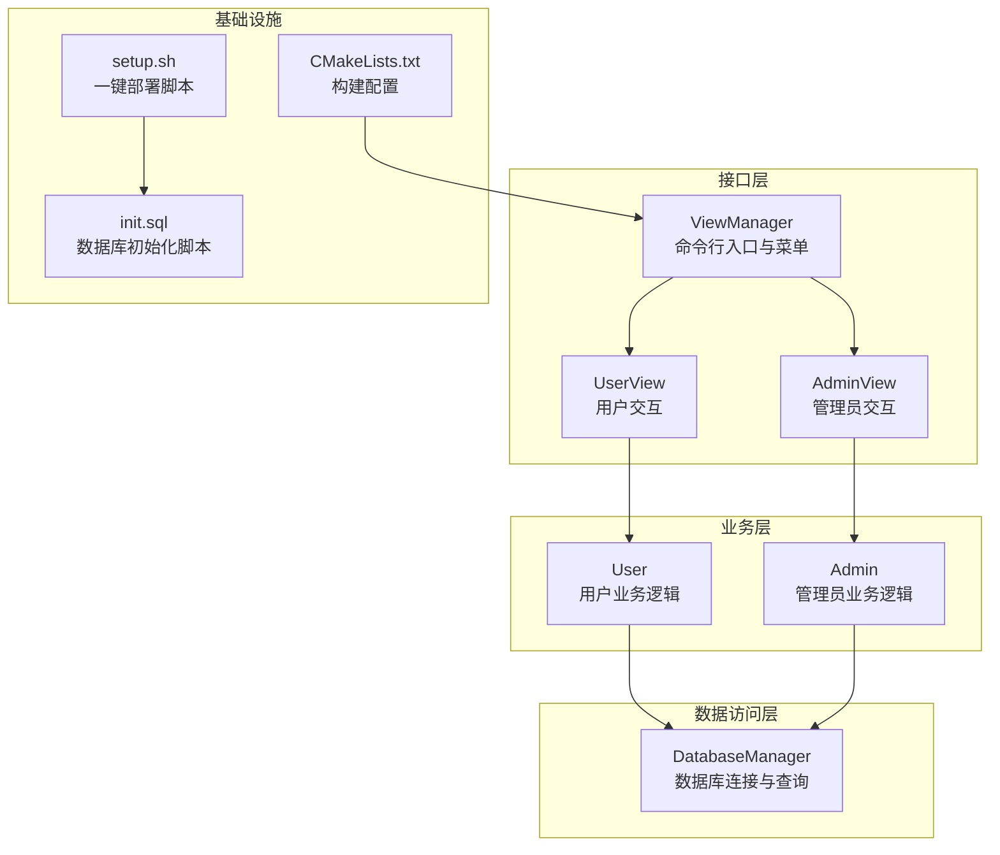
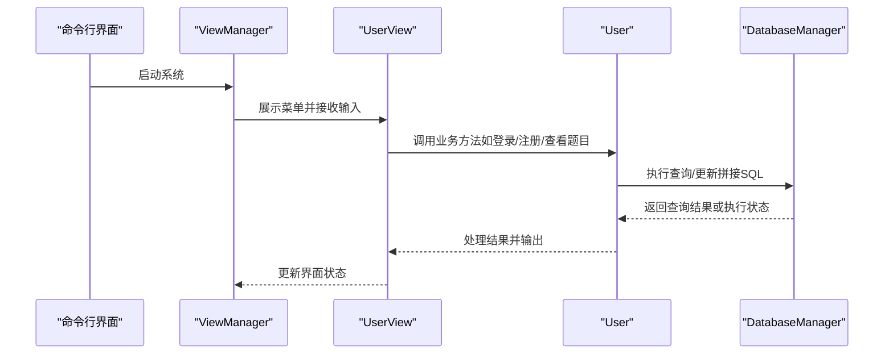
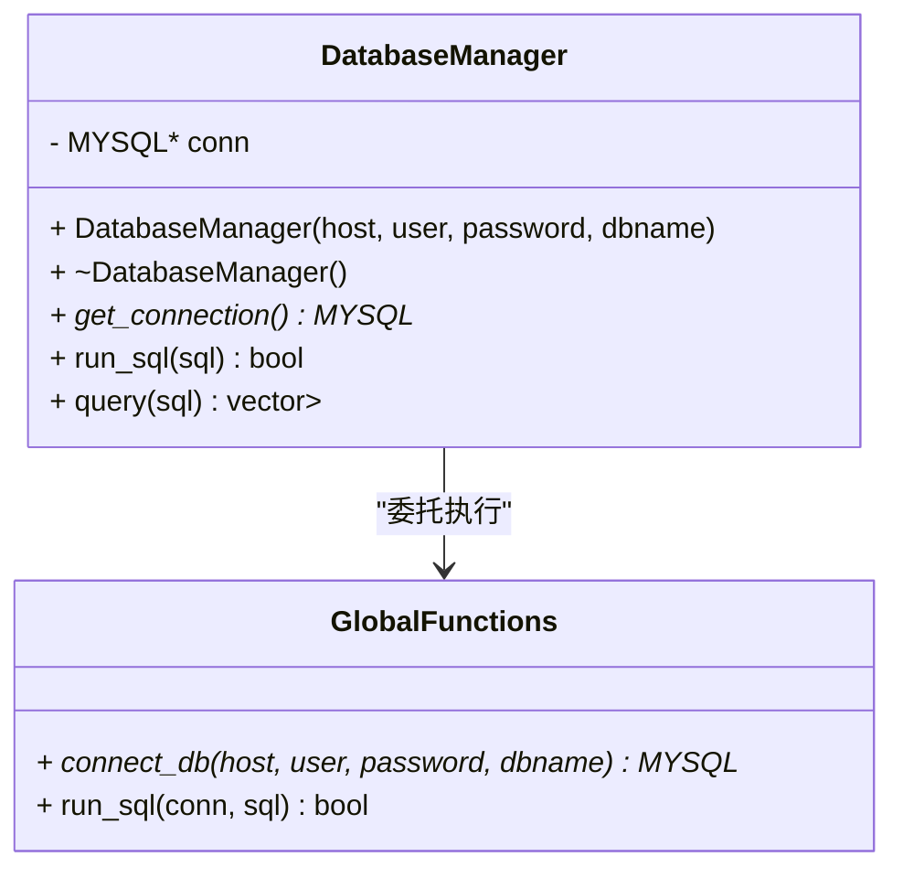
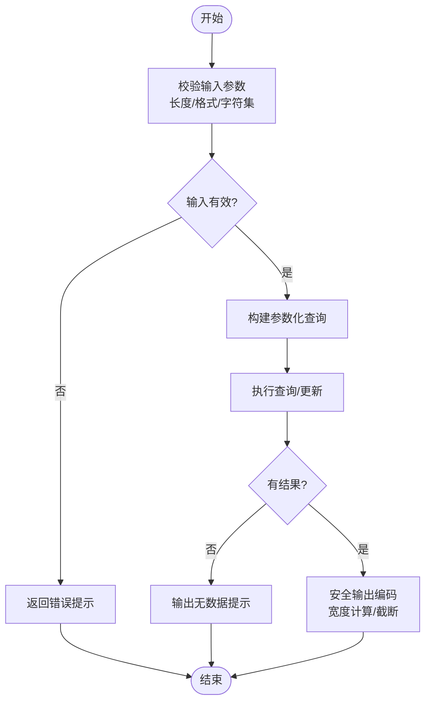
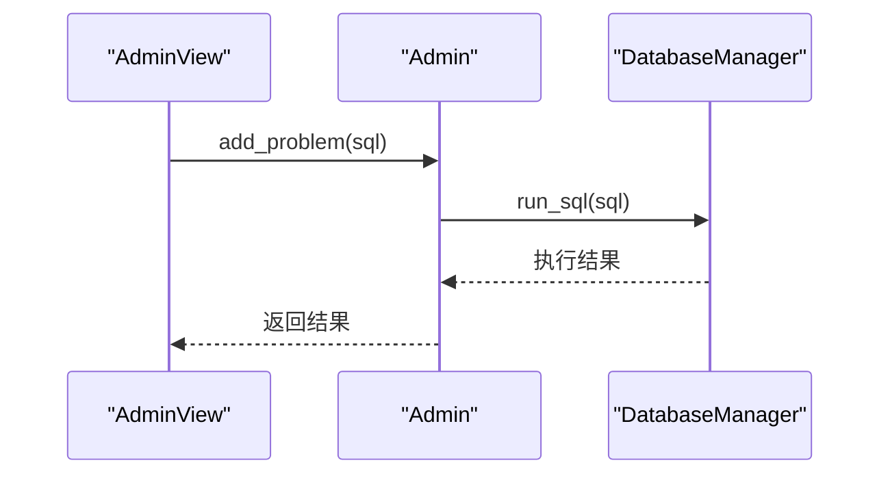
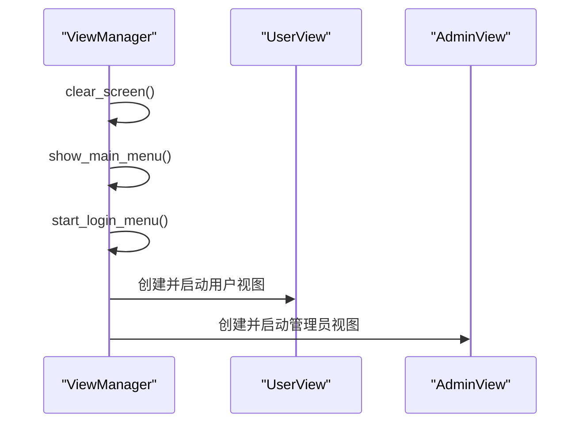
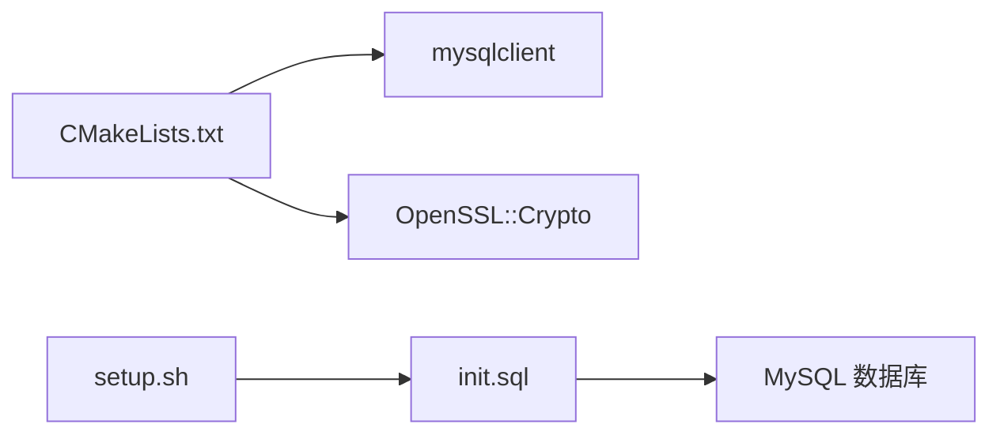

# 安全编码实践

<cite>
**本文引用的文件**
- [README.md](file://README.md)
- [CMakeLists.txt](file://CMakeLists.txt)
- [setup.sh](file://setup.sh)
- [init.sql](file://init.sql)
- [include/db_manager.h](file://include/db_manager.h)
- [src/db_manager.cpp](file://src/db_manager.cpp)
- [include/admin.h](file://include/admin.h)
- [src/admin.cpp](file://src/admin.cpp)
- [include/user.h](file://include/user.h)
- [src/user.cpp](file://src/user.cpp)
- [include/view_manager.h](file://include/view_manager.h)
- [src/view_manager.cpp](file://src/view_manager.cpp)
- [include/admin_view.h](file://include/admin_view.h)
- [include/user_view.h](file://include/user_view.h)
- [src/main.cpp](file://src/main.cpp)
</cite>

## 目录
1. [简介](#简介)
2. [项目结构](#项目结构)
3. [核心组件](#核心组件)
4. [架构总览](#架构总览)
5. [详细组件分析](#详细组件分析)
6. [依赖关系分析](#依赖关系分析)
7. [性能考量](#性能考量)
8. [故障排查指南](#故障排查指南)
9. [结论](#结论)
10. [附录](#附录)

## 简介
本指南围绕OJ评测系统中的安全编码实践展开，聚焦以下方面：
- 输入验证与输出编码：用户输入过滤、转义与验证机制
- 错误处理安全策略：敏感信息隐藏、错误日志安全记录与异常处理最佳实践
- 缓冲区溢出防护：字符串处理安全方法与内存管理安全实践
- OWASP Top 10在C++环境的应用与落地
- 安全测试方法与代码审查清单

本指南基于仓库现有实现进行分析与改进建议，帮助开发者在C++环境下构建更安全的命令行应用。

## 项目结构
项目采用分层与职责分离的组织方式：
- 接口层：视图类负责用户交互与输入收集（如用户视图、管理员视图）
- 业务层：业务类封装具体功能（如用户类、管理员类）
- 数据访问层：数据库管理器封装连接与SQL执行
- 配置与工具：CMake构建、初始化脚本、数据库初始化SQL

**图表来源**
- [src/view_manager.cpp:1-77](file://src/view_manager.cpp#L1-L77)
- [include/user_view.h:1-92](file://include/user_view.h#L1-L92)
- [include/admin_view.h:1-58](file://include/admin_view.h#L1-L58)
- [include/user.h:1-89](file://include/user.h#L1-L89)
- [include/admin.h:1-40](file://include/admin.h#L1-L40)
- [include/db_manager.h:1-53](file://include/db_manager.h#L1-L53)
- [CMakeLists.txt:1-40](file://CMakeLists.txt#L1-L40)
- [init.sql:1-278](file://init.sql#L1-L278)
- [setup.sh:1-41](file://setup.sh#L1-L41)

**章节来源**
- [src/main.cpp:1-14](file://src/main.cpp#L1-L14)
- [src/view_manager.cpp:1-77](file://src/view_manager.cpp#L1-L77)
- [include/view_manager.h:1-43](file://include/view_manager.h#L1-L43)
- [include/user_view.h:1-92](file://include/user_view.h#L1-L92)
- [include/admin_view.h:1-58](file://include/admin_view.h#L1-L58)
- [include/user.h:1-89](file://include/user.h#L1-L89)
- [include/admin.h:1-40](file://include/admin.h#L1-L40)
- [include/db_manager.h:1-53](file://include/db_manager.h#L1-L53)
- [CMakeLists.txt:1-40](file://CMakeLists.txt#L1-L40)
- [init.sql:1-278](file://init.sql#L1-L278)
- [setup.sh:1-41](file://setup.sh#L1-L41)

## 核心组件
- 视图管理层：负责清屏、菜单展示与输入缓冲区清理，避免格式化输入引发的缓冲区问题
- 用户与管理员视图：承载用户与管理员的交互流程，调用业务类完成操作
- 用户与管理员业务类：封装登录、注册、密码修改、题目查看、提交代码等业务逻辑
- 数据库管理器：封装MySQL连接、查询与执行，提供安全的查询结果处理

安全关注点：
- 输入验证与转义：当前多处直接拼接SQL字符串，存在注入风险
- 输出编码：面向终端的输出涉及颜色控制与JSON输出，需注意潜在的注入与格式化问题
- 错误处理：错误日志打印包含底层数据库错误信息，可能泄露敏感细节
- 内存管理：数据库结果集的分配与释放遵循RAII与显式释放，但SQL字符串拼接存在缓冲区风险

**章节来源**
- [src/view_manager.cpp:1-77](file://src/view_manager.cpp#L1-L77)
- [include/user_view.h:1-92](file://include/user_view.h#L1-L92)
- [include/admin_view.h:1-58](file://include/admin_view.h#L1-L58)
- [include/user.h:1-89](file://include/user.h#L1-L89)
- [include/admin.h:1-40](file://include/admin.h#L1-L40)
- [include/db_manager.h:1-53](file://include/db_manager.h#L1-L53)
- [src/db_manager.cpp:1-100](file://src/db_manager.cpp#L1-L100)

## 架构总览
系统采用“视图-业务-数据访问”的分层架构，输入从视图层进入，经业务层校验与处理，最终通过数据访问层与数据库交互。

**图表来源**
- [src/view_manager.cpp:1-77](file://src/view_manager.cpp#L1-L77)
- [include/user_view.h:1-92](file://include/user_view.h#L1-L92)
- [include/user.h:1-89](file://include/user.h#L1-L89)
- [include/db_manager.h:1-53](file://include/db_manager.h#L1-L53)
- [src/db_manager.cpp:1-100](file://src/db_manager.cpp#L1-L100)

## 详细组件分析

### 数据库管理器（DatabaseManager）
职责与安全要点：
- 连接管理：构造时建立连接，析构时关闭连接，避免资源泄漏
- 查询执行：提供查询与执行接口，内部处理错误并打印错误信息
- 结果处理：存储结果集并转换为键值映射，注意字段名与空值处理

安全建议：
- SQL注入防护：当前查询接口直接拼接SQL字符串，应改为参数化查询
- 敏感信息隐藏：错误日志不应暴露数据库凭据与内部结构
- 内存管理：确保结果集释放与上下文生命周期一致

**图表来源**
- [include/db_manager.h:1-53](file://include/db_manager.h#L1-L53)
- [src/db_manager.cpp:1-100](file://src/db_manager.cpp#L1-L100)

**章节来源**
- [include/db_manager.h:1-53](file://include/db_manager.h#L1-L53)
- [src/db_manager.cpp:1-100](file://src/db_manager.cpp#L1-L100)

### 用户类（User）
职责与安全要点：
- 登录与注册：对密码进行哈希处理，存储哈希而非明文
- 密码修改：校验旧密码哈希后再更新
- 题目查看与详情：直接拼接SQL查询，存在注入风险
- 提交代码与查看记录：预留接口，当前未实现

安全建议：
- 输入验证：对用户输入进行白名单校验与长度限制
- SQL注入防护：将用户输入作为参数绑定，避免字符串拼接
- 输出编码：对终端输出进行宽度计算与安全截断，防止乱码与越界
- 错误处理：隐藏底层错误细节，仅输出友好提示

**图表来源**
- [include/user.h:1-89](file://include/user.h#L1-L89)
- [src/user.cpp:1-286](file://src/user.cpp#L1-L286)

**章节来源**
- [include/user.h:1-89](file://include/user.h#L1-L89)
- [src/user.cpp:1-286](file://src/user.cpp#L1-L286)

### 管理员类（Admin）
职责与安全要点：
- 发布题目：直接执行管理员输入的SQL，存在严重注入风险
- 题目列表与详情：查询接口存在注入风险

安全建议：
- 禁止直接执行用户输入的SQL，改为受控的增删改接口
- 对所有输入进行严格白名单与长度限制
- 对输出进行安全编码与宽度控制

**图表来源**
- [include/admin.h:1-40](file://include/admin.h#L1-L40)
- [src/admin.cpp:1-59](file://src/admin.cpp#L1-L59)
- [include/db_manager.h:1-53](file://include/db_manager.h#L1-L53)
- [src/db_manager.cpp:1-100](file://src/db_manager.cpp#L1-L100)

**章节来源**
- [include/admin.h:1-40](file://include/admin.h#L1-L40)
- [src/admin.cpp:1-59](file://src/admin.cpp#L1-L59)

### 视图管理层（ViewManager、UserView、AdminView）
职责与安全要点：
- 清屏与菜单展示：使用ANSI转义序列，注意跨平台兼容性
- 输入缓冲区清理：避免格式化输入导致的缓冲区问题
- 角色切换：根据用户选择加载对应视图

安全建议：
- 输入验证：对菜单选择与文本输入进行范围与类型校验
- 输出编码：对终端输出进行宽度计算与截断，防止乱码与越界
- 异常处理：捕获并处理输入异常，避免程序崩溃

**图表来源**
- [src/view_manager.cpp:1-77](file://src/view_manager.cpp#L1-L77)
- [include/view_manager.h:1-43](file://include/view_manager.h#L1-L43)
- [include/user_view.h:1-92](file://include/user_view.h#L1-L92)
- [include/admin_view.h:1-58](file://include/admin_view.h#L1-L58)

**章节来源**
- [src/view_manager.cpp:1-77](file://src/view_manager.cpp#L1-L77)
- [include/view_manager.h:1-43](file://include/view_manager.h#L1-L43)
- [include/user_view.h:1-92](file://include/user_view.h#L1-L92)
- [include/admin_view.h:1-58](file://include/admin_view.h#L1-L58)

## 依赖关系分析
- 构建与链接：CMake查找MySQL与OpenSSL，设置C++17标准，导出编译命令
- 数据库初始化：init.sql创建数据库、表与用户授权
- 一键部署：setup.sh执行目录创建、数据库初始化与编译提示

**图表来源**
- [CMakeLists.txt:1-40](file://CMakeLists.txt#L1-L40)
- [setup.sh:1-41](file://setup.sh#L1-L41)
- [init.sql:1-278](file://init.sql#L1-L278)

**章节来源**
- [CMakeLists.txt:1-40](file://CMakeLists.txt#L1-L40)
- [setup.sh:1-41](file://setup.sh#L1-L41)
- [init.sql:1-278](file://init.sql#L1-L278)

## 性能考量
- 查询性能：合理使用索引（如用户表的账号索引），避免全表扫描
- 内存管理：及时释放查询结果集，避免长时间持有大对象
- I/O优化：批量输出与格式化控制，减少不必要的终端刷新

[本节为通用指导，无需特定文件来源]

## 故障排查指南
常见问题与处理：
- 数据库连接失败：检查主机、端口、用户名与密码，确认MySQL服务状态
- 权限不足：核对数据库用户授权，确保最小权限原则
- 输入异常：使用输入缓冲区清理函数，避免格式化输入引发的缓冲区问题
- 错误日志：避免在生产环境打印底层数据库错误，仅输出通用提示

**章节来源**
- [src/db_manager.cpp:1-100](file://src/db_manager.cpp#L1-L100)
- [src/view_manager.cpp:1-77](file://src/view_manager.cpp#L1-L77)

## 结论
本项目在命令行交互与基础业务逻辑上具备清晰的分层结构，但在安全方面存在显著风险，尤其是SQL注入与错误信息泄露。建议优先实施参数化查询、严格的输入验证与输出编码、以及完善的错误处理策略。结合OWASP Top 10的实践，可在C++环境中构建更稳健与安全的评测系统。

[本节为总结，无需特定文件来源]

## 附录

### OWASP Top 10在C++环境的应用
- 注入（Injection）：使用参数化查询替代字符串拼接，严格白名单与长度限制
- 失效的身份认证（Broken Authentication）：密码哈希与会话管理，避免明文存储
- 危险的业务逻辑（Pseudo Privilege）：最小权限与行级隔离，避免直接执行用户SQL
- 不安全的错误处理（Insecure Error Handling）：隐藏敏感信息，仅输出通用提示
- 缓冲区溢出（Buffer Overflow）：固定大小缓冲区与安全字符串处理，避免越界

[本节为概念性内容，无需特定文件来源]

### 安全测试方法
- 单元测试：覆盖输入边界、异常路径与错误日志
- 集成测试：模拟数据库连接与权限场景
- 渗透测试：尝试注入、越权与异常输入
- 代码审计：重点检查SQL拼接、输出编码与错误处理

[本节为通用指导，无需特定文件来源]

### 代码审查清单
- 输入验证：是否进行白名单、长度与字符集校验
- SQL安全：是否使用参数化查询，是否存在字符串拼接
- 输出编码：是否进行宽度计算与安全截断，避免终端注入
- 错误处理：是否隐藏敏感信息，日志级别是否合适
- 内存管理：是否及时释放资源，避免泄漏
- 权限控制：是否遵循最小权限原则，行级隔离是否到位

[本节为通用指导，无需特定文件来源]