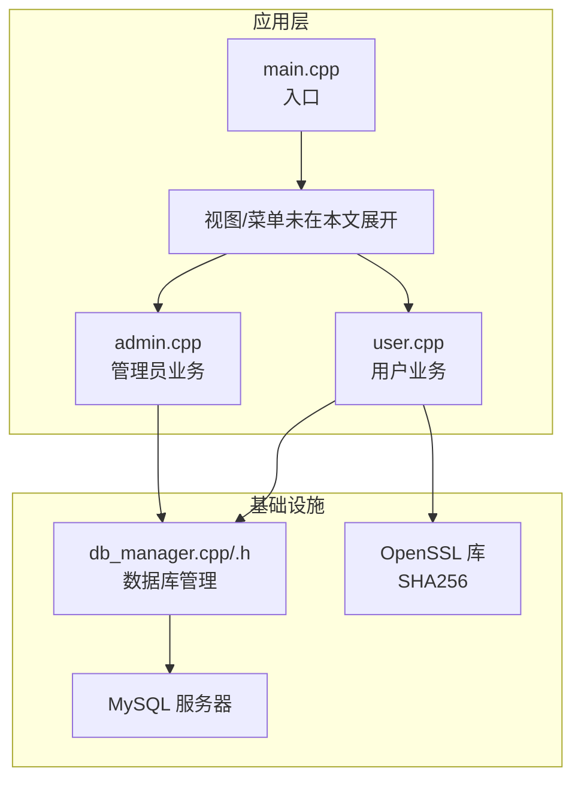
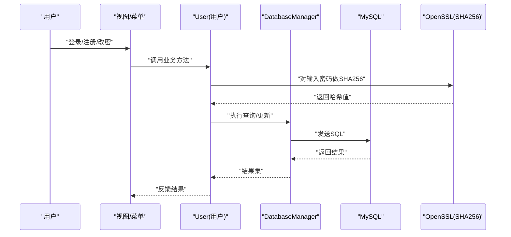
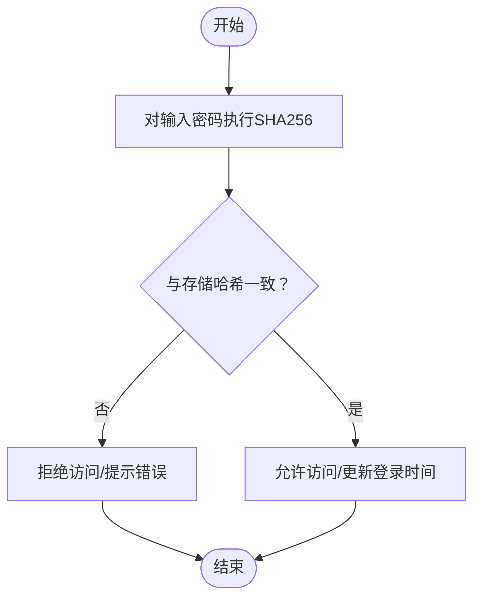
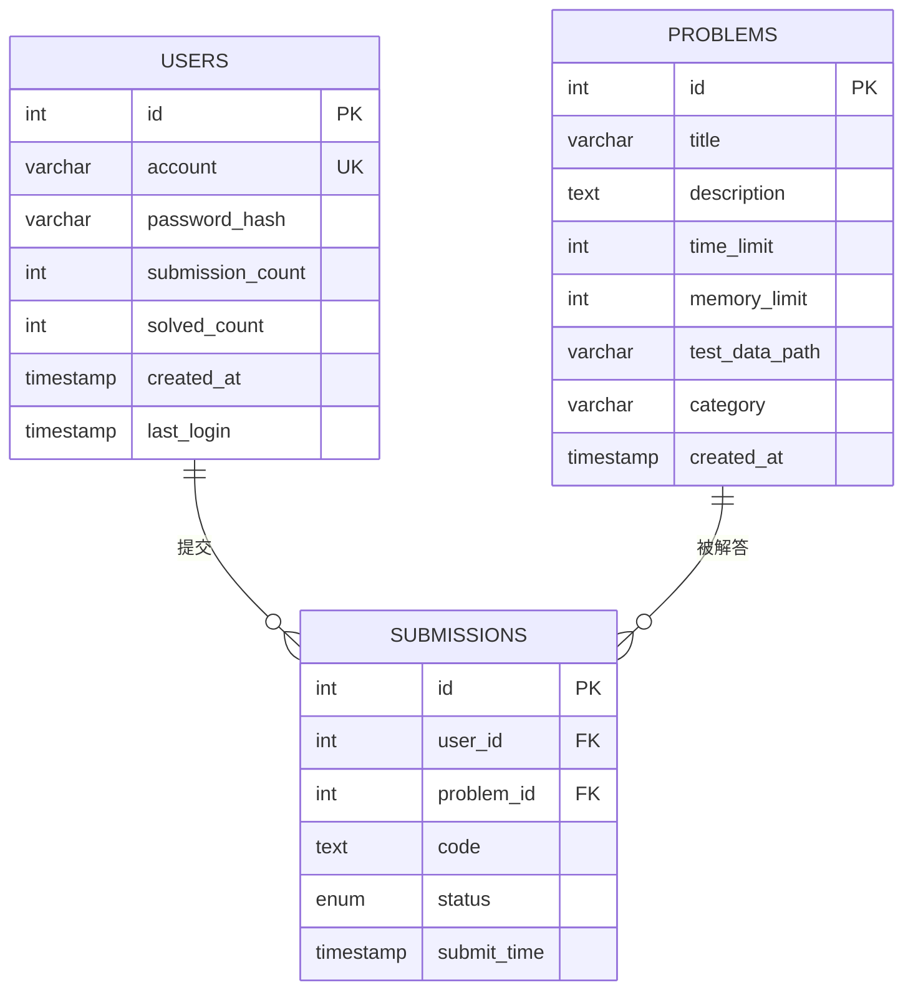
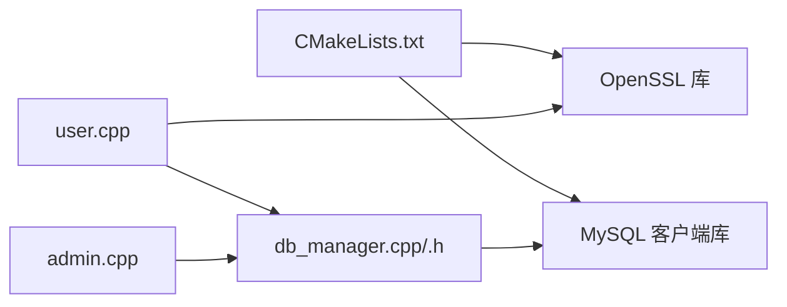

# 安全设计

<cite>
**本文引用的文件**
- [README.md](file://README.md)
- [init.sql](file://init.sql)
- [setup.sh](file://setup.sh)
- [CMakeLists.txt](file://CMakeLists.txt)
- [include/db_manager.h](file://include/db_manager.h)
- [src/db_manager.cpp](file://src/db_manager.cpp)
- [include/user.h](file://include/user.h)
- [src/user.cpp](file://src/user.cpp)
- [include/admin.h](file://include/admin.h)
- [src/admin.cpp](file://src/admin.cpp)
- [src/main.cpp](file://src/main.cpp)
- [docs/code_submission_design.md](file://docs/code_submission_design.md)
- [docs/judge_implementation_plan.md](file://docs/judge_implementation_plan.md)
- [include/color_codes.h](file://include/color_codes.h)
</cite>

## 目录
1. [简介](#简介)
2. [项目结构](#项目结构)
3. [核心组件](#核心组件)
4. [架构总览](#架构总览)
5. [详细组件分析](#详细组件分析)
6. [依赖分析](#依赖分析)
7. [性能考虑](#性能考虑)
8. [故障排查指南](#故障排查指南)
9. [结论](#结论)
10. [附录](#附录)

## 简介
本文件面向OJ系统安全设计，围绕密码安全机制（SHA256哈希与存储）、数据库安全设计（权限分离、SQL注入防护、连接管理）、安全编码实践（输入验证、输出编码、错误处理）、安全审计与漏洞检测、安全事件响应与应急处置等方面，提供系统性、可落地的设计参考与实施指南。文档同时结合现有代码与脚本，指出当前实现中的安全风险与改进建议。

## 项目结构
项目采用C++控制台应用，配合MySQL数据库与OpenSSL库，通过CMake构建。核心模块包括：
- 用户与管理员业务逻辑：用户登录/注册/改密、题目浏览、提交代码（待实现）、查看提交记录（待实现）
- 数据库管理：连接、查询、执行
- 初始化与部署：数据库初始化脚本、一键部署脚本
- 文档：代码提交与历史管理设计、评测容器安全方案

**图表来源**
- [src/main.cpp:5-13](file://src/main.cpp#L5-L13)
- [src/user.cpp:11-137](file://src/user.cpp#L11-L137)
- [src/admin.cpp:10-58](file://src/admin.cpp#L10-L58)
- [src/db_manager.cpp:8-79](file://src/db_manager.cpp#L8-L79)
- [include/db_manager.h:12-46](file://include/db_manager.h#L12-L46)
- [CMakeLists.txt:11-34](file://CMakeLists.txt#L11-L34)

**章节来源**
- [README.md:1-2](file://README.md#L1-L2)
- [CMakeLists.txt:1-40](file://CMakeLists.txt#L1-L40)
- [src/main.cpp:1-14](file://src/main.cpp#L1-L14)

## 核心组件
- 用户认证与密码安全：使用OpenSSL的EVP接口实现SHA256哈希，将明文密码转换为十六进制字符串后存储于users.password_hash字段
- 数据库连接与执行：封装DatabaseManager类，提供连接、查询、执行能力；错误通过标准错误输出
- 权限与隔离：init.sql定义数据库用户与权限，oj_user对特定表具备受限权限；应用层通过WHERE条件实现行级隔离
- 管理员能力：Admin类可执行SQL发布题目，需谨慎控制输入与权限
- 评测与容器安全：评测容器安全配置与Seccomp策略在设计文档中给出

**章节来源**
- [src/user.cpp:14-37](file://src/user.cpp#L14-L37)
- [src/user.cpp:39-98](file://src/user.cpp#L39-L98)
- [src/db_manager.cpp:21-57](file://src/db_manager.cpp#L21-L57)
- [init.sql:28-95](file://init.sql#L28-L95)
- [docs/judge_implementation_plan.md:220-280](file://docs/judge_implementation_plan.md#L220-L280)

## 架构总览
系统安全架构围绕“密码哈希存储、数据库权限与连接、应用层输入校验与输出、容器评测安全”展开。下图展示从用户到数据库与容器的交互路径。

**图表来源**
- [src/user.cpp:39-98](file://src/user.cpp#L39-L98)
- [src/db_manager.cpp:26-57](file://src/db_manager.cpp#L26-L57)
- [include/db_manager.h:28-42](file://include/db_manager.h#L28-L42)

## 详细组件分析

### 密码安全机制：SHA256哈希与安全存储
- 哈希实现：使用OpenSSL EVP接口计算SHA256，输出为十六进制字符串
- 存储策略：将哈希值存入users.password_hash字段，避免明文存储
- 登录流程：客户端计算输入密码的哈希并与数据库存储值比较
- 改密流程：先校验旧密码哈希，再更新为新密码哈希

**图表来源**
- [src/user.cpp:14-37](file://src/user.cpp#L14-L37)
- [src/user.cpp:39-71](file://src/user.cpp#L39-L71)
- [init.sql:28-39](file://init.sql#L28-L39)

**章节来源**
- [src/user.cpp:14-37](file://src/user.cpp#L14-L37)
- [src/user.cpp:39-98](file://src/user.cpp#L39-L98)
- [init.sql:28-39](file://init.sql#L28-L39)

### 数据库安全设计
- 用户权限分离
  - oj_admin：全权限，仅用于运维
  - oj_user：对problems/users/submissions表分别授予只读/受限读写权限
- 行级隔离：应用层通过WHERE id = current_user_id等条件实现，避免越权访问
- 连接管理：DatabaseManager封装连接与查询，统一错误输出；建议增加连接池与超时设置
- SQL注入防护现状与建议
  - 当前多处SQL拼接（如登录、注册、改密、题目查询），存在注入风险
  - 建议全面采用参数化查询或严格的白名单/枚举校验

**图表来源**
- [init.sql:14-61](file://init.sql#L14-L61)

**章节来源**
- [init.sql:68-95](file://init.sql#L68-L95)
- [src/user.cpp:44-45](file://src/user.cpp#L44-L45)
- [src/user.cpp:78-89](file://src/user.cpp#L78-L89)
- [src/user.cpp:108-128](file://src/user.cpp#L108-L128)
- [src/user.cpp:240-241](file://src/user.cpp#L240-L241)
- [src/db_manager.cpp:26-57](file://src/db_manager.cpp#L26-L57)

### 安全编码实践
- 输入验证
  - 登录/注册/改密：当前未对账号长度、字符集、密码强度进行显式校验
  - 建议：引入白名单/长度/字符集/强度规则，拒绝异常输入
- 输出编码
  - 题目列表输出包含UTF-8中文处理，避免终端乱码
  - 建议：对所有用户可控输出进行HTML/XML转义或终端安全输出
- 错误处理
  - 数据库错误通过标准错误输出，便于日志采集
  - 建议：区分业务错误与系统错误，统一错误码与日志级别

**章节来源**
- [src/user.cpp:167-229](file://src/user.cpp#L167-L229)
- [src/db_manager.cpp:32-36](file://src/db_manager.cpp#L32-L36)
- [src/db_manager.cpp:86-89](file://src/db_manager.cpp#L86-L89)

### 安全审计与漏洞检测方法论
- 代码审计
  - 关注SQL拼接点（登录、注册、改密、题目查询等）
  - 检查权限提升路径（管理员SQL执行）
  - 校验输入/输出处理（UTF-8、转义、长度）
- 渗透测试
  - 对登录/注册接口进行注入测试
  - 模拟越权访问（修改他人密码、查看他人提交）
- 日志与监控
  - 记录敏感操作（登录、改密、发布题目）
  - 异常告警（连接失败、查询失败、错误堆栈）

**章节来源**
- [src/user.cpp:39-98](file://src/user.cpp#L39-L98)
- [src/admin.cpp:12-14](file://src/admin.cpp#L12-L14)
- [src/db_manager.cpp:32-36](file://src/db_manager.cpp#L32-L36)

### 安全事件响应流程与应急处置预案
- 响应流程
  - 事件发现 → 快速评估 → 隔离影响 → 修复与验证 → 复盘与改进
- 应急处置
  - 密码泄露：强制重置受影响用户密码，撤销可疑会话
  - 注入攻击：封禁相关IP、回滚可疑变更、修复SQL拼接
  - 权限滥用：回收oj_user权限、审计管理员操作、强化行级隔离
- 预防措施
  - 参数化查询、最小权限原则、定期安全扫描、备份与演练

[本节为通用方法论，不直接分析具体文件，故无“章节来源”]

## 依赖分析
- 外部依赖
  - MySQL客户端库：用于连接与执行SQL
  - OpenSSL：用于SHA256哈希
- 内部耦合
  - User/Admin依赖DatabaseManager
  - DatabaseManager依赖MySQL客户端
  - User依赖OpenSSL

**图表来源**
- [CMakeLists.txt:11-34](file://CMakeLists.txt#L11-L34)
- [src/user.cpp:6](file://src/user.cpp#L6)
- [src/db_manager.cpp:1-5](file://src/db_manager.cpp#L1-L5)
- [include/db_manager.h:4-8](file://include/db_manager.h#L4-L8)

**章节来源**
- [CMakeLists.txt:11-34](file://CMakeLists.txt#L11-L34)

## 性能考虑
- 数据库连接
  - 建议引入连接池，减少连接开销与并发竞争
  - 设置合理的超时与重试策略
- 查询优化
  - 为高频查询字段建立索引（如users.account、submissions.user_id、submissions.problem_id）
  - 控制一次性返回的数据量，分页查询
- 密码哈希
  - SHA256计算成本低，适合当前场景；若未来引入强口令策略，可考虑bcrypt/scrypt

[本节提供一般性指导，不直接分析具体文件，故无“章节来源”]

## 故障排查指南
- 数据库连接失败
  - 检查init.sql中oj_user密码与CMake链接参数
  - 使用setup.sh确认数据库初始化是否成功
- 登录/注册失败
  - 核对账号是否存在、密码哈希是否匹配
  - 检查users表字段与索引
- 查询异常
  - 关注标准错误输出中的SQL错误信息
  - 确认SQL拼接是否正确、权限是否足够

**章节来源**
- [setup.sh:14-29](file://setup.sh#L14-L29)
- [src/db_manager.cpp:32-36](file://src/db_manager.cpp#L32-L36)
- [src/db_manager.cpp:86-89](file://src/db_manager.cpp#L86-L89)
- [init.sql:68-95](file://init.sql#L68-L95)

## 结论
当前OJ系统在密码安全方面采用SHA256哈希与安全存储，数据库层面通过用户权限与行级隔离实现基本的访问控制。但在SQL注入防护、输入验证、输出编码与连接管理等方面仍有改进空间。建议尽快引入参数化查询、完善输入校验与输出转义、加强连接与会话管理，并配套安全审计与应急响应机制，以形成闭环的安全体系。

## 附录
- 部署与初始化
  - 使用setup.sh一键部署并初始化数据库
  - init.sql定义数据库、用户、权限与示例数据
- 评测容器安全
  - 设计文档提供了容器安全选项与Seccomp策略，建议在评测链路中落地

**章节来源**
- [setup.sh:14-29](file://setup.sh#L14-L29)
- [init.sql:63-95](file://init.sql#L63-L95)
- [docs/judge_implementation_plan.md:220-280](file://docs/judge_implementation_plan.md#L220-L280)