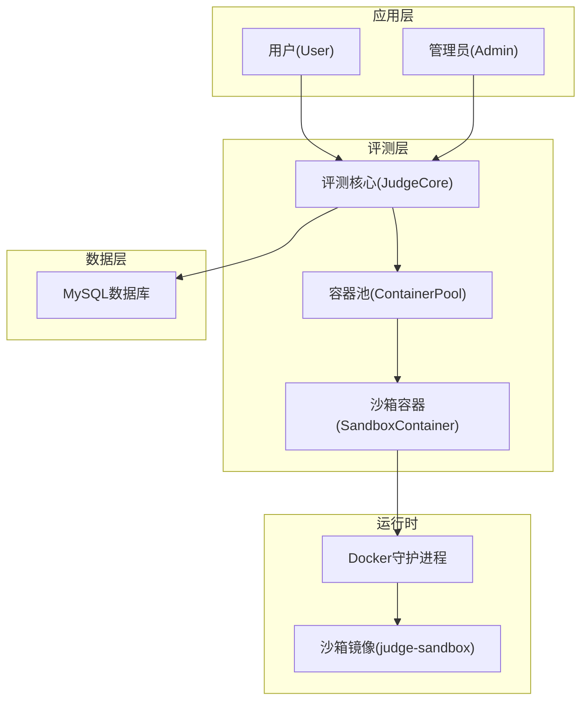
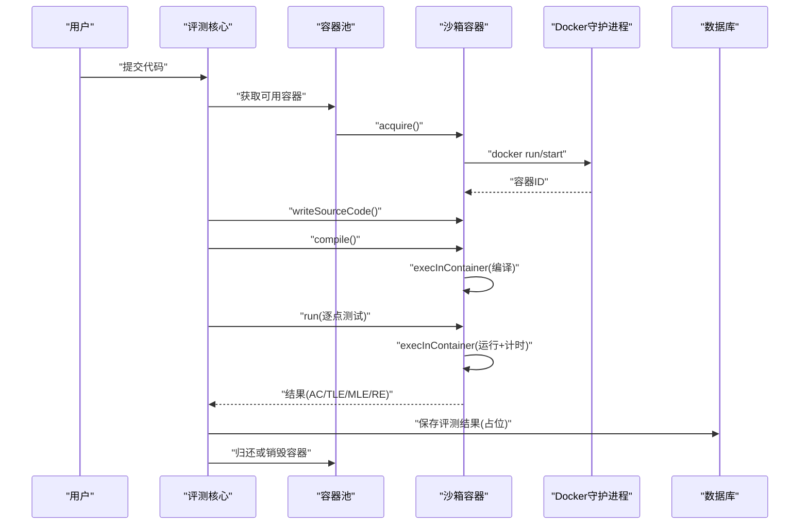
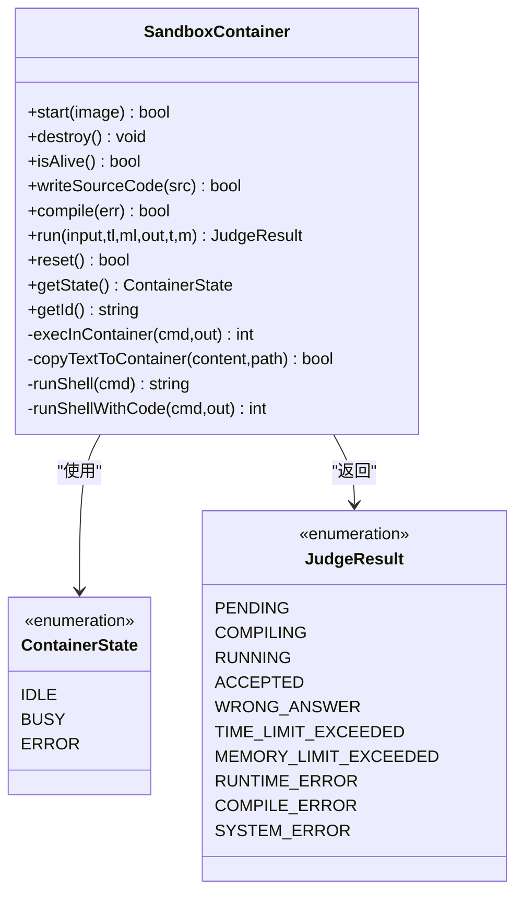
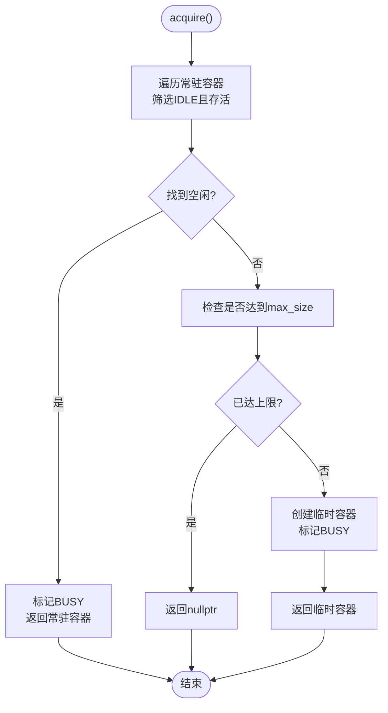
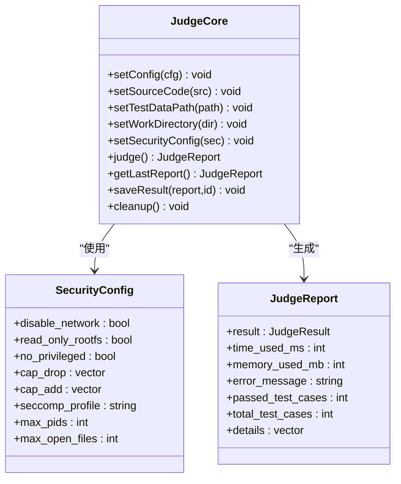
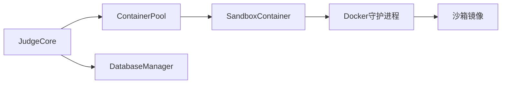

# 安全设计

<cite>
**本文引用的文件**
- [include/docker_manager.h](file://include/docker_manager.h)
- [include/sandbox_container.h](file://include/sandbox_container.h)
- [src/sandbox_container.cpp](file://src/sandbox_container.cpp)
- [include/container_pool.h](file://include/container_pool.h)
- [src/container_pool.cpp](file://src/container_pool.cpp)
- [include/judge_core.h](file://include/judge_core.h)
- [src/judge_core.cpp](file://src/judge_core.cpp)
- [judge-sandbox/Dockerfile](file://judge-sandbox/Dockerfile)
- [include/db_manager.h](file://include/db_manager.h)
- [src/db_manager.cpp](file://src/db_manager.cpp)
- [include/admin.h](file://include/admin.h)
- [src/admin.cpp](file://src/admin.cpp)
- [include/user.h](file://include/user.h)
</cite>

## 目录
1. [引言](#引言)
2. [项目结构](#项目结构)
3. [核心组件](#核心组件)
4. [架构总览](#架构总览)
5. [详细组件分析](#详细组件分析)
6. [依赖关系分析](#依赖关系分析)
7. [性能考虑](#性能考虑)
8. [故障排查指南](#故障排查指南)
9. [结论](#结论)
10. [附录](#附录)

## 引言
本文件面向OJ在线评测系统的安全设计，围绕容器安全隔离、Docker沙箱配置、认证与授权、数据与传输安全、代码执行边界与防护、安全审计与监控、漏洞防护与应急响应以及最佳实践与合规性要求展开。文档基于仓库中现有的容器管理、评测调度与数据库访问等模块进行技术剖析，并结合Docker沙箱镜像配置给出可落地的安全加固建议。

## 项目结构
本项目采用“模块化+分层”的组织方式：
- 接口聚合头文件：集中声明容器相关类型，便于上层统一使用
- 容器生命周期与评测操作：封装在沙箱容器类中，负责与Docker CLI交互
- 容器池：负责常驻容器预热、临时容器按需创建与回收、健康检查
- 评测核心：负责加载测试数据、逐点评测、结果汇总与持久化占位
- 数据库管理：封装MySQL连接、SQL执行与转义
- 用户与管理员：提供登录、注册、提交评测等业务入口
- Docker沙箱镜像：构建受限运行环境，降低攻击面

图表来源
- [include/judge_core.h](file://include/judge_core.h)
- [src/judge_core.cpp](file://src/judge_core.cpp)
- [include/container_pool.h](file://include/container_pool.h)
- [src/container_pool.cpp](file://src/container_pool.cpp)
- [include/sandbox_container.h](file://include/sandbox_container.h)
- [src/sandbox_container.cpp](file://src/sandbox_container.cpp)
- [judge-sandbox/Dockerfile](file://judge-sandbox/Dockerfile)
- [include/db_manager.h](file://include/db_manager.h)
- [src/db_manager.cpp](file://src/db_manager.cpp)

章节来源
- [include/docker_manager.h](file://include/docker_manager.h)
- [include/judge_core.h](file://include/judge_core.h)
- [include/container_pool.h](file://include/container_pool.h)
- [include/sandbox_container.h](file://include/sandbox_container.h)
- [judge-sandbox/Dockerfile](file://judge-sandbox/Dockerfile)
- [include/db_manager.h](file://include/db_manager.h)

## 核心组件
- 沙箱容器（SandboxContainer）：封装容器生命周期、文件写入、编译与运行、状态管理
- 容器池（ContainerPool）：常驻容器预热、临时容器按需扩容、回收与健康检查
- 评测核心（JudgeCore）：评测配置、测试数据加载、逐点评测、结果汇总与持久化占位
- 数据库管理（DatabaseManager）：连接、查询、转义与错误处理
- 用户与管理员：登录、注册、提交评测、题目管理

章节来源
- [include/sandbox_container.h](file://include/sandbox_container.h)
- [src/sandbox_container.cpp](file://src/sandbox_container.cpp)
- [include/container_pool.h](file://include/container_pool.h)
- [src/container_pool.cpp](file://src/container_pool.cpp)
- [include/judge_core.h](file://include/judge_core.h)
- [src/judge_core.cpp](file://src/judge_core.cpp)
- [include/db_manager.h](file://include/db_manager.h)
- [src/db_manager.cpp](file://src/db_manager.cpp)
- [include/admin.h](file://include/admin.h)
- [src/admin.cpp](file://src/admin.cpp)
- [include/user.h](file://include/user.h)

## 架构总览
评测流程从用户提交代码开始，经由评测核心选择容器，容器内编译与运行，最终汇总结果并持久化。容器通过Docker沙箱镜像实现强隔离，配合只读文件系统、网络隔离、能力降级与进程限制等安全策略。

图表来源
- [src/judge_core.cpp](file://src/judge_core.cpp)
- [src/container_pool.cpp](file://src/container_pool.cpp)
- [src/sandbox_container.cpp](file://src/sandbox_container.cpp)
- [include/db_manager.h](file://include/db_manager.h)

## 详细组件分析

### 沙箱容器（SandboxContainer）
- 安全特性
  - 启动参数包含网络隔离、只读根文件系统、进程数限制、能力降级等
  - 评测结束后清理沙箱目录，避免状态泄漏
- 关键行为
  - 启动常驻容器、健康检查、销毁
  - 写入源代码、编译、运行、读取输出与资源统计
  - 通过docker exec在容器内执行命令，避免直接暴露宿主机

图表来源
- [include/sandbox_container.h](file://include/sandbox_container.h)
- [src/sandbox_container.cpp](file://src/sandbox_container.cpp)
- [include/judge_core.h](file://include/judge_core.h)

章节来源
- [src/sandbox_container.cpp](file://src/sandbox_container.cpp)
- [include/sandbox_container.h](file://include/sandbox_container.h)

### 容器池（ContainerPool）
- 设计要点
  - 预创建少量常驻容器以降低评测延迟
  - 达到并发上限时按需创建临时容器，评测后立即销毁
  - 健康检查自动重建失联容器
- 线程安全
  - 使用互斥锁保护容器列表与状态变更

图表来源
- [src/container_pool.cpp](file://src/container_pool.cpp)
- [include/container_pool.h](file://include/container_pool.h)

章节来源
- [src/container_pool.cpp](file://src/container_pool.cpp)
- [include/container_pool.h](file://include/container_pool.h)

### 评测核心（JudgeCore）
- 功能职责
  - 设置评测配置、源代码、测试数据路径与工作目录
  - 惰性初始化容器池，逐点评测并汇总结果
  - 提供结果持久化接口（当前为占位）
- 安全配置
  - 通过SecurityConfig对外暴露安全策略字段（网络、文件系统、capabilities、seccomp、进程数、文件描述符等）

图表来源
- [include/judge_core.h](file://include/judge_core.h)
- [src/judge_core.cpp](file://src/judge_core.cpp)

章节来源
- [include/judge_core.h](file://include/judge_core.h)
- [src/judge_core.cpp](file://src/judge_core.cpp)

### Docker沙箱镜像（judge-sandbox）
- 安全策略
  - 基于Ubuntu基础镜像，安装必要编译工具与计时工具
  - 创建非特权runner用户，切换到非root运行
  - 通过Dockerfile参数实现只读根文件系统、网络隔离、能力降级、进程数限制等（在容器启动时生效）

章节来源
- [judge-sandbox/Dockerfile](file://judge-sandbox/Dockerfile)
- [src/sandbox_container.cpp](file://src/sandbox_container.cpp)

### 数据库管理（DatabaseManager）
- 安全要点
  - 使用转义接口防止SQL注入
  - 统一错误处理与资源释放
- 与安全的关系
  - 评测结果持久化应结合鉴权与审计日志

章节来源
- [include/db_manager.h](file://include/db_manager.h)
- [src/db_manager.cpp](file://src/db_manager.cpp)

### 用户与管理员
- 用户：登录、注册、提交评测、查看历史
- 管理员：发布题目、查看题目列表与详情
- 安全关注
  - 登录态与会话管理（当前未见具体实现，建议引入令牌与会话存储）
  - 输入校验与权限控制（管理员操作需鉴权）

章节来源
- [include/admin.h](file://include/admin.h)
- [src/admin.cpp](file://src/admin.cpp)
- [include/user.h](file://include/user.h)

## 依赖关系分析
- 模块耦合
  - JudgeCore依赖ContainerPool与SandboxContainer，形成评测调度链
  - SandboxContainer依赖Docker守护进程与沙箱镜像
  - JudgeCore与DatabaseManager解耦，结果持久化通过接口扩展
- 外部依赖
  - Docker CLI与守护进程
  - MySQL客户端库
  - Ubuntu基础镜像与runner用户

图表来源
- [src/judge_core.cpp](file://src/judge_core.cpp)
- [src/container_pool.cpp](file://src/container_pool.cpp)
- [src/sandbox_container.cpp](file://src/sandbox_container.cpp)
- [include/db_manager.h](file://include/db_manager.h)

章节来源
- [src/judge_core.cpp](file://src/judge_core.cpp)
- [src/container_pool.cpp](file://src/container_pool.cpp)
- [src/sandbox_container.cpp](file://src/sandbox_container.cpp)
- [include/db_manager.h](file://include/db_manager.h)

## 性能考虑
- 容器池预热：减少首次编译冷启动开销
- 常驻容器复用：避免频繁拉起/销毁容器
- 临时容器按需创建：在高并发时快速扩容，评测后立即回收
- 资源限制：CPU配额、内存上限、进程数与文件描述符限制，防止资源滥用
- I/O优化：沙箱目录使用内存tmpfs，提升读写性能

## 故障排查指南
- 容器无法启动
  - 检查Docker守护进程状态与镜像是否存在
  - 查看容器启动命令参数（网络、只读、能力、进程数）
- 容器失联
  - 触发健康检查，重建常驻容器
  - 检查宿主机资源与Docker事件
- 评测超时/超内存
  - 调整时间与内存限制；确认宿主机cgroup策略
- 编译失败
  - 检查源代码写入与编译命令；确认沙箱内工具链可用
- 数据持久化
  - 确认数据库连接与转义逻辑；补充保存接口

章节来源
- [src/container_pool.cpp](file://src/container_pool.cpp)
- [src/sandbox_container.cpp](file://src/sandbox_container.cpp)
- [src/db_manager.cpp](file://src/db_manager.cpp)

## 结论
本系统通过Docker沙箱实现强隔离，结合只读文件系统、网络隔离、能力降级与进程/内存限制等策略，有效降低用户代码对宿主机的潜在威胁。评测核心与容器池的设计兼顾性能与弹性，满足高并发评测需求。建议进一步完善认证授权、会话管理、传输与存储加密、审计与监控以及应急响应流程，以满足更严格的安全与合规要求。

## 附录

### 容器安全隔离机制（Linux命名空间、cgroups、安全策略）
- 命名空间
  - PID/UTS/IPC/Network/User/Mount命名空间用于进程、主机名、IPC、网络、用户与挂载隔离
- cgroups
  - 控制CPU、内存、IO与进程数，防止资源滥用
- 安全策略
  - 能力降级（drop ALL）、Seccomp、AppArmor/SELinux（如启用）

章节来源
- [src/sandbox_container.cpp](file://src/sandbox_container.cpp)
- [judge-sandbox/Dockerfile](file://judge-sandbox/Dockerfile)

### Docker沙箱安全配置要点
- 禁用网络访问（网络隔离）
- 只读根文件系统
- 丢弃所有能力（cap-drop=ALL）
- 限制进程数与内存
- 使用非root用户运行
- 临时目录使用内存文件系统

章节来源
- [src/sandbox_container.cpp](file://src/sandbox_container.cpp)
- [judge-sandbox/Dockerfile](file://judge-sandbox/Dockerfile)

### 认证与授权、会话管理
- 当前模块提供登录/注册接口，但未见具体会话存储与令牌机制
- 建议
  - 引入JWT或服务端会话存储
  - 登录态校验与权限分级（普通用户/管理员）
  - 密码加密与传输加密（TLS）

章节来源
- [include/user.h](file://include/user.h)
- [include/admin.h](file://include/admin.h)

### 数据传输与存储安全
- 传输
  - 建议启用TLS/HTTPS
  - 对敏感字段（如密码）进行加密传输
- 存储
  - 数据库存储敏感信息需加密
  - 使用参数化查询与转义，防范SQL注入

章节来源
- [src/db_manager.cpp](file://src/db_manager.cpp)
- [include/db_manager.h](file://include/db_manager.h)

### 代码执行安全边界与防护
- 边界
  - 评测在容器内进行，限制网络、文件系统与能力
- 防护
  - 严格的时间与内存限制
  - 输出大小限制
  - 评测后清理沙箱目录

章节来源
- [src/sandbox_container.cpp](file://src/sandbox_container.cpp)
- [include/judge_core.h](file://include/judge_core.h)

### 安全审计与监控
- 建议
  - 审计日志：登录、评测、管理员操作
  - 监控指标：容器资源使用、失败率、异常退出
  - 报警阈值：容器异常、资源告警、失败风暴

章节来源
- [src/container_pool.cpp](file://src/container_pool.cpp)
- [src/judge_core.cpp](file://src/judge_core.cpp)

### 漏洞防护与应急响应
- 防护
  - 及时更新基础镜像与工具链
  - 限制容器能力与权限
  - 严格的输入校验与输出截断
- 应急
  - 快速隔离受影响容器/节点
  - 回滚镜像版本与配置
  - 审计与溯源、修复与验证

章节来源
- [src/sandbox_container.cpp](file://src/sandbox_container.cpp)
- [src/container_pool.cpp](file://src/container_pool.cpp)

### 安全配置最佳实践与合规性
- 最佳实践
  - 最小权限原则与能力降级
  - 只读文件系统与最小化镜像
  - 资源配额与超时控制
  - 审计与日志留存
- 合规性
  - 数据保护（如PII加密）
  - 安全基线与定期评估
  - 供应链安全（镜像签名与扫描）

章节来源
- [judge-sandbox/Dockerfile](file://judge-sandbox/Dockerfile)
- [src/db_manager.cpp](file://src/db_manager.cpp)