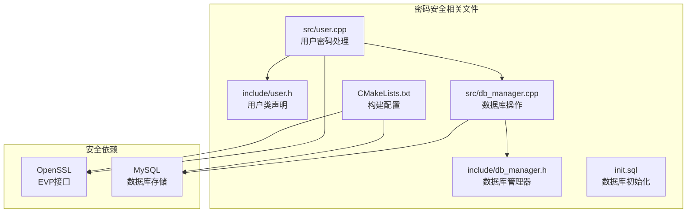
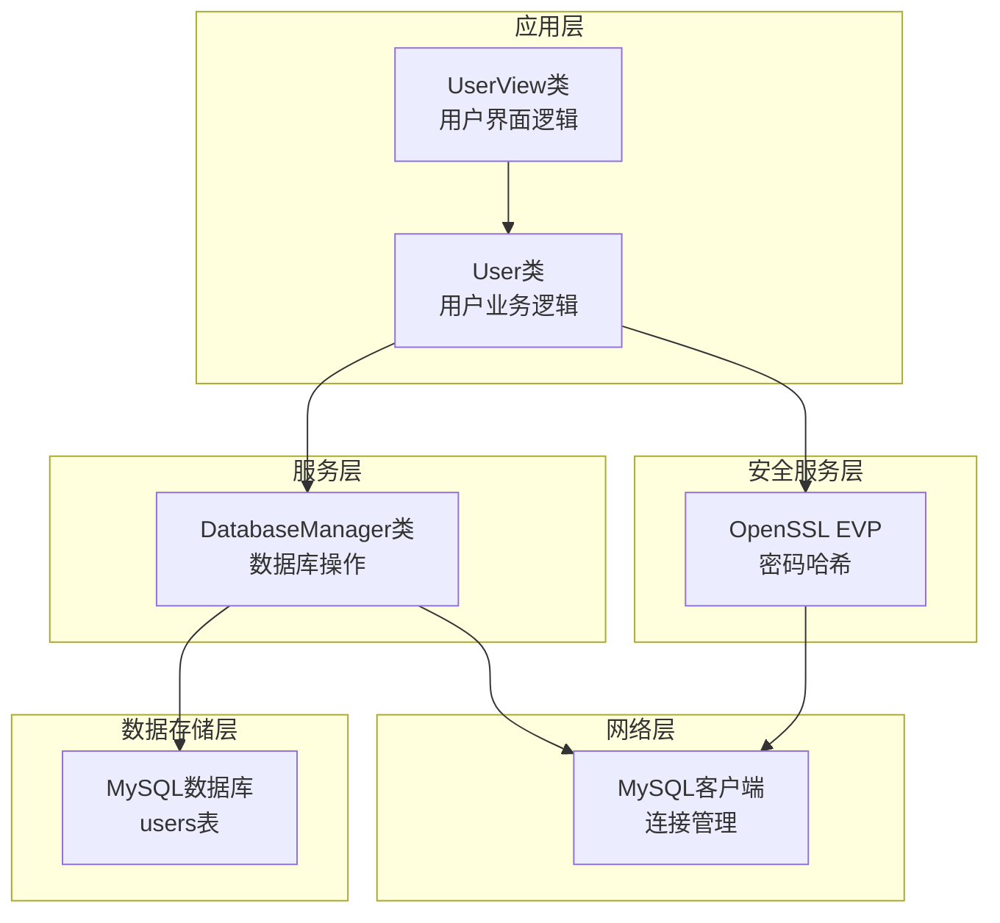
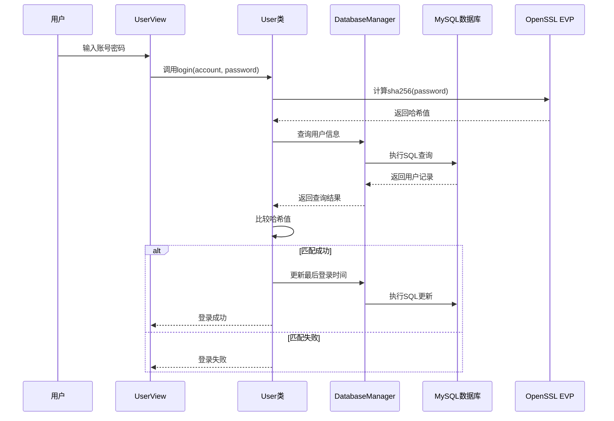
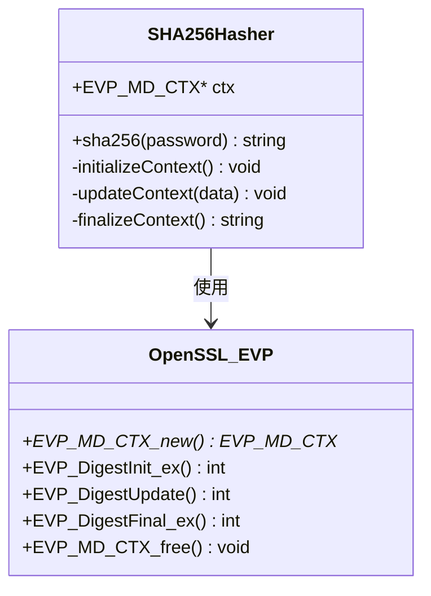
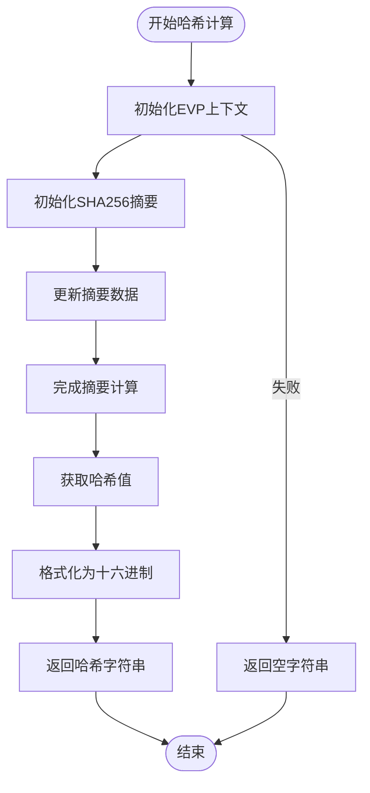
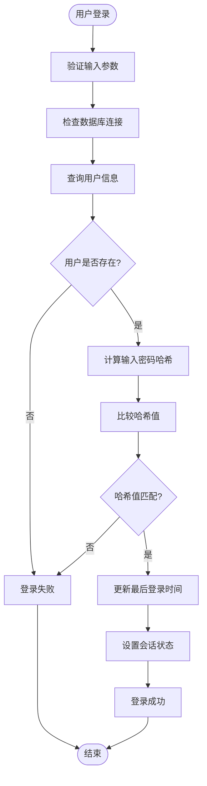
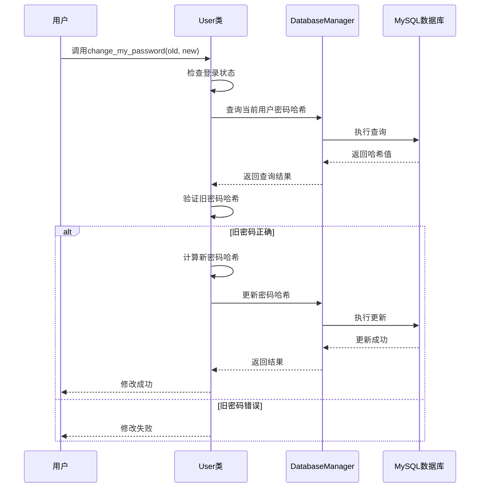
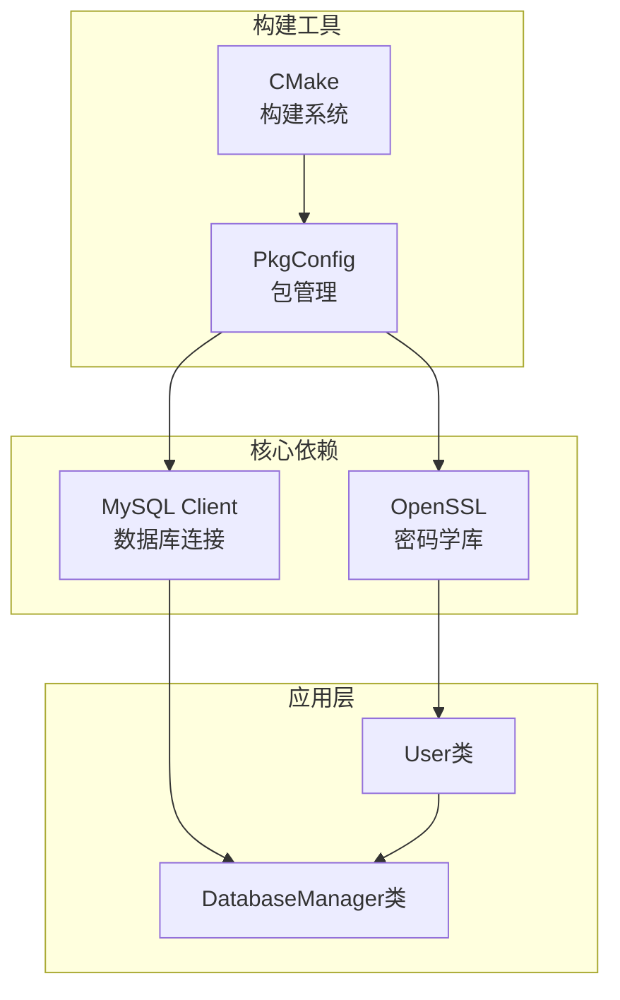

# 密码安全机制

<cite>
**本文档引用的文件**
- [user.cpp](file://src/user.cpp)
- [user.h](file://include/user.h)
- [db_manager.cpp](file://src/db_manager.cpp)
- [db_manager.h](file://include/db_manager.h)
- [init.sql](file://init.sql)
- [CMakeLists.txt](file://CMakeLists.txt)
- [OJ_v0.2.md](file://History/OJ_v0.2.md)
</cite>

## 目录
1. [简介](#简介)
2. [项目结构](#项目结构)
3. [核心组件](#核心组件)
4. [架构概览](#架构概览)
5. [详细组件分析](#详细组件分析)
6. [依赖关系分析](#依赖关系分析)
7. [性能考虑](#性能考虑)
8. [故障排除指南](#故障排除指南)
9. [结论](#结论)
10. [附录](#附录)

## 简介

本文件详细解析OJ在线判题系统中的密码安全机制，重点分析SHA256哈希算法在用户密码保护中的应用。系统采用OpenSSL EVP接口实现密码哈希，通过数据库存储密码哈希值而非明文密码，确保用户凭据的安全性。

密码安全机制是整个系统的基石，直接影响用户数据安全和系统整体安全性。本文档将从架构设计、实现细节、安全考量等多个维度进行全面分析。

## 项目结构

OJ项目采用分层架构设计，密码安全相关的核心文件分布如下：

**图表来源**
- [user.cpp:1-286](file://src/user.cpp#L1-L286)
- [db_manager.cpp:1-100](file://src/db_manager.cpp#L1-L100)
- [CMakeLists.txt:1-40](file://CMakeLists.txt#L1-L40)

**章节来源**
- [user.cpp:1-286](file://src/user.cpp#L1-L286)
- [db_manager.cpp:1-100](file://src/db_manager.cpp#L1-L100)
- [CMakeLists.txt:1-40](file://CMakeLists.txt#L1-L40)

## 核心组件

### 用户认证模块

用户认证模块是密码安全机制的核心实现，包含以下关键组件：

#### User类设计
User类封装了完整的用户认证功能，包括登录、注册、密码修改等操作。该类通过DatabaseManager访问数据库，通过OpenSSL EVP接口进行密码哈希计算。

#### 密码哈希函数
系统实现了简化的SHA256哈希函数，使用OpenSSL EVP接口进行密码加密处理。该函数负责将用户输入的明文密码转换为固定长度的十六进制哈希值。

#### 数据库集成
密码安全机制与MySQL数据库深度集成，通过users表存储用户凭据信息。数据库层面采用了适当的索引和约束来优化查询性能和保证数据完整性。

**章节来源**
- [user.h:1-89](file://include/user.h#L1-L89)
- [user.cpp:13-37](file://src/user.cpp#L13-L37)
- [db_manager.h:1-53](file://include/db_manager.h#L1-L53)

## 架构概览

密码安全机制采用分层架构设计，确保各组件职责明确、耦合度低：

**图表来源**
- [user.cpp:11-137](file://src/user.cpp#L11-L137)
- [db_manager.cpp:8-79](file://src/db_manager.cpp#L8-L79)

### 数据流分析

密码处理的数据流遵循严格的安全部署模式：

**图表来源**
- [user.cpp:39-71](file://src/user.cpp#L39-L71)
- [user.cpp:14-37](file://src/user.cpp#L14-L37)

## 详细组件分析

### SHA256密码哈希实现

#### 哈希算法选择
系统选择了SHA256作为密码哈希算法，主要基于以下考量：

1. **安全性保障**：SHA256提供256位哈希值，具有良好的抗碰撞特性
2. **标准化程度**：广泛采用的标准算法，社区支持良好
3. **性能平衡**：在安全性与性能之间取得平衡
4. **兼容性**：跨平台兼容性好，易于部署

#### OpenSSL EVP接口使用

**图表来源**
- [user.cpp:14-37](file://src/user.cpp#L14-L37)

#### 哈希生成流程

**图表来源**
- [user.cpp:14-37](file://src/user.cpp#L14-L37)

**章节来源**
- [user.cpp:14-37](file://src/user.cpp#L14-L37)

### 密码存储机制

#### 数据库表设计

系统采用users表存储用户凭据信息，表结构设计充分考虑了安全性：

| 字段名 | 数据类型 | 约束条件 | 用途说明 |
|--------|----------|----------|----------|
| id | INT | PRIMARY KEY, AUTO_INCREMENT | 用户唯一标识符 |
| account | VARCHAR(50) | UNIQUE NOT NULL | 用户登录账号 |
| password_hash | VARCHAR(255) | NOT NULL | SHA256密码哈希值 |
| submission_count | INT | DEFAULT 0 | 提交题目数量统计 |
| solved_count | INT | DEFAULT 0 | 解决题目数量统计 |
| created_at | TIMESTAMP | DEFAULT CURRENT_TIMESTAMP | 注册时间 |
| last_login | TIMESTAMP | NULL DEFAULT NULL | 最后登录时间 |

#### 存储格式规范

密码哈希值采用十六进制字符串格式存储，每个字符对应4位二进制数据，确保存储效率和检索性能。

**章节来源**
- [init.sql:28-39](file://init.sql#L28-L39)

### 用户认证流程

#### 登录验证流程

**图表来源**
- [user.cpp:39-71](file://src/user.cpp#L39-L71)

#### 注册流程

注册流程确保新用户密码的安全存储：

1. **账号唯一性检查**：防止重复账号注册
2. **密码哈希计算**：使用SHA256算法处理明文密码
3. **安全存储**：将哈希值存储到数据库
4. **成功反馈**：向用户确认注册成功

**章节来源**
- [user.cpp:73-98](file://src/user.cpp#L73-L98)

### 密码修改机制

#### 安全更新流程

密码修改功能实现了严格的安全验证机制：

**图表来源**
- [user.cpp:100-137](file://src/user.cpp#L100-L137)

**章节来源**
- [user.cpp:100-137](file://src/user.cpp#L100-L137)

## 依赖关系分析

### 外部依赖

系统依赖于多个外部库来实现密码安全功能：

**图表来源**
- [CMakeLists.txt:11-34](file://CMakeLists.txt#L11-L34)

### 依赖配置

构建系统通过CMake配置确保所有依赖正确链接：

| 依赖库 | 配置方式 | 版本要求 | 用途 |
|--------|----------|----------|------|
| OpenSSL | find_package | >= 1.1.0 | EVP接口、密码哈希 |
| MySQL Client | pkg_check_modules | >= 5.7 | 数据库连接、查询 |
| C++标准 | C++17 | - | 现代C++特性支持 |

**章节来源**
- [CMakeLists.txt:11-34](file://CMakeLists.txt#L11-L34)

## 性能考虑

### 哈希计算性能

SHA256哈希计算具有以下性能特征：

- **计算复杂度**：O(n)，n为密码长度
- **内存使用**：固定大小的上下文结构
- **CPU开销**：相对较低，适合高并发场景
- **缓存友好**：小规模数据处理，缓存命中率高

### 数据库查询优化

系统通过以下方式优化数据库查询性能：

1. **索引设计**：在account字段建立唯一索引，加速用户查找
2. **查询优化**：只选择必要的字段，减少网络传输
3. **连接池**：复用数据库连接，减少连接开销
4. **批量操作**：合理组织SQL语句，避免频繁往返

## 故障排除指南

### 常见问题及解决方案

#### OpenSSL相关错误

**问题**：OpenSSL EVP接口调用失败
**原因**：库未正确初始化或内存分配失败
**解决方案**：检查OpenSSL库版本，确保正确初始化上下文

#### 数据库连接问题

**问题**：无法连接到MySQL数据库
**原因**：连接参数错误或网络问题
**解决方案**：验证数据库配置，检查网络连通性

#### 密码验证失败

**问题**：用户登录时密码验证失败
**原因**：可能的输入错误或数据库数据不一致
**解决方案**：检查用户输入，验证数据库中存储的哈希值

**章节来源**
- [user.cpp:41-50](file://src/user.cpp#L41-L50)
- [db_manager.cpp:63-78](file://src/db_manager.cpp#L63-L78)

## 结论

OJ系统的密码安全机制通过合理的架构设计和实现细节，为用户提供了可靠的安全保障。系统采用的SHA256哈希算法配合OpenSSL EVP接口，确保了密码处理的安全性和效率。

### 主要优势

1. **安全性**：密码以哈希形式存储，即使数据库泄露也不会暴露明文密码
2. **标准化**：采用广泛认可的SHA256算法和OpenSSL标准库
3. **可维护性**：清晰的代码结构和模块化设计
4. **性能**：合理的算法选择和数据库优化

### 改进建议

虽然当前实现已经相当完善，但仍有一些可以改进的地方：

1. **引入盐值**：考虑添加随机盐值提高抗彩虹表攻击能力
2. **密码策略**：增加密码强度验证规则
3. **多因子认证**：考虑添加额外的安全验证层
4. **审计日志**：增加详细的认证事件记录

## 附录

### 安全最佳实践

#### 密码存储最佳实践

1. **永远不要存储明文密码**
2. **使用强哈希算法**：如SHA256或更高级别的算法
3. **实施盐值机制**：防止彩虹表攻击
4. **定期更新密码策略**：根据安全威胁调整策略

#### 开发安全规范

1. **输入验证**：对所有用户输入进行严格验证
2. **错误处理**：避免泄露敏感信息的错误消息
3. **日志记录**：记录安全相关事件但不存储敏感数据
4. **代码审查**：定期进行安全代码审查

### 相关文件参考

- [用户认证实现:39-137](file://src/user.cpp#L39-L137)
- [数据库操作接口:21-57](file://src/db_manager.cpp#L21-L57)
- [构建配置:11-34](file://CMakeLists.txt#L11-L34)
- [数据库初始化脚本:28-39](file://init.sql#L28-L39)