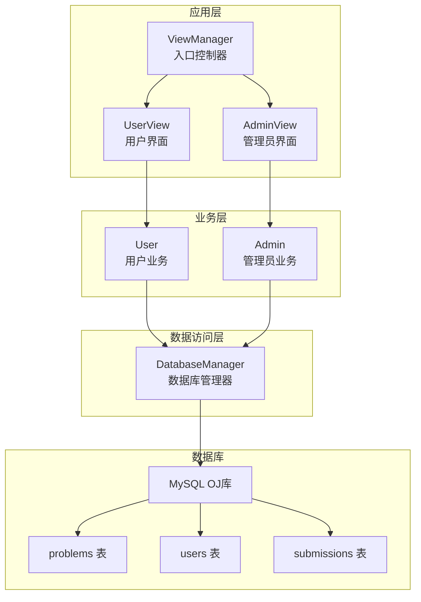
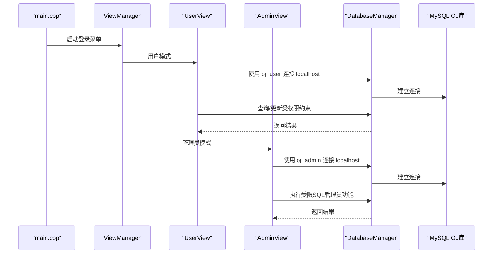
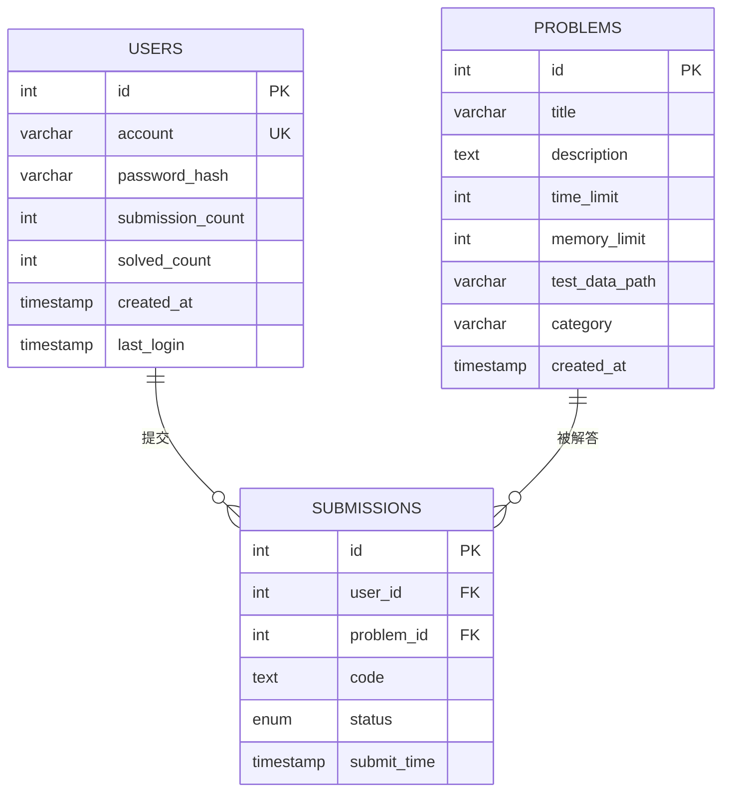
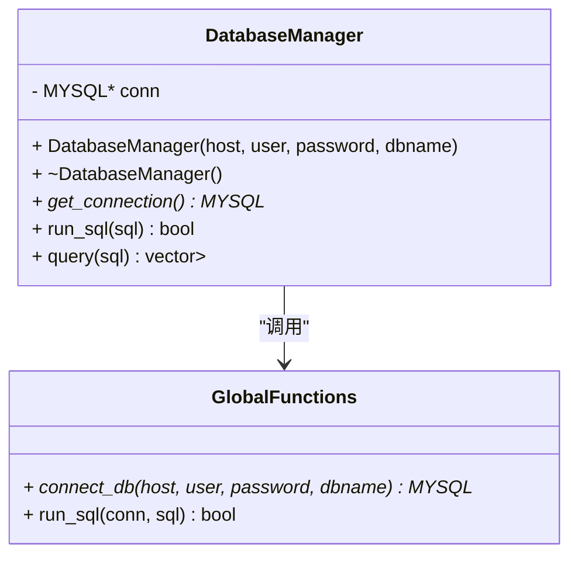
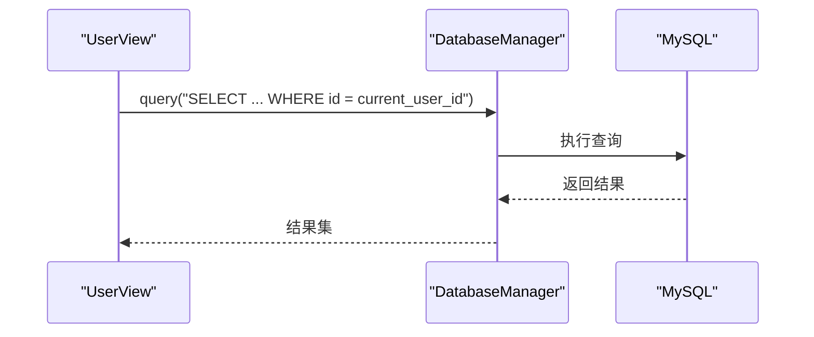
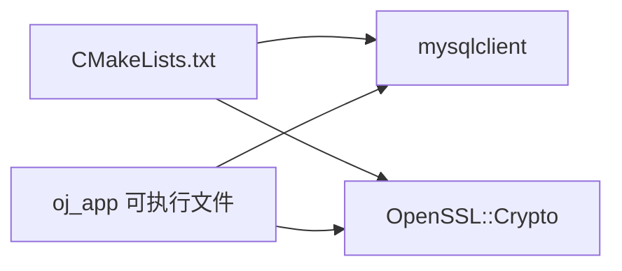

# 数据库安全设计

<cite>
**本文引用的文件**
- [init.sql](file://init.sql)
- [db_manager.h](file://include/db_manager.h)
- [db_manager.cpp](file://src/db_manager.cpp)
- [admin_view.cpp](file://src/admin_view.cpp)
- [user_view.cpp](file://src/user_view.cpp)
- [setup.sh](file://setup.sh)
- [CMakeLists.txt](file://CMakeLists.txt)
- [main.cpp](file://src/main.cpp)
</cite>

## 目录
1. [简介](#简介)
2. [项目结构](#项目结构)
3. [核心组件](#核心组件)
4. [架构总览](#架构总览)
5. [详细组件分析](#详细组件分析)
6. [依赖关系分析](#依赖关系分析)
7. [性能考虑](#性能考虑)
8. [故障排查指南](#故障排查指南)
9. [结论](#结论)
10. [附录](#附录)

## 简介
本文件面向数据库管理员与安全开发者，系统性梳理本OJ项目中的数据库安全设计与实施方案，重点覆盖：
- MySQL数据库安全配置与用户权限分离（oj_admin与oj_user）
- SQL注入防护现状与改进建议（参数化查询与输入验证）
- 数据库连接安全与连接池/超时/复用策略建议
- 权限控制最佳实践（最小权限原则、行级隔离、权限审计）
- 安全配置示例与检查清单

## 项目结构
项目采用“界面层-业务层-数据访问层”的分层组织，数据库访问通过统一的DatabaseManager封装，界面层根据角色选择不同数据库用户进行连接。

图表来源
- [main.cpp:5-12](file://src/main.cpp#L5-L12)
- [user_view.cpp:36-131](file://src/user_view.cpp#L36-L131)
- [admin_view.cpp:21-76](file://src/admin_view.cpp#L21-L76)
- [db_manager.h:12-46](file://include/db_manager.h#L12-L46)
- [init.sql:14-24](file://init.sql#L14-L24)

章节来源
- [main.cpp:5-12](file://src/main.cpp#L5-L12)
- [CMakeLists.txt:23-34](file://CMakeLists.txt#L23-L34)

## 核心组件
- 数据库管理器（DatabaseManager）：负责连接建立、SQL执行与结果处理，提供查询与执行接口。
- 角色化连接策略：用户模式使用受限用户（oj_user），管理员模式使用全权限用户（oj_admin）。
- 初始化脚本（init.sql）：创建数据库、表、用户并授予相应权限，同时设置密码策略。

章节来源
- [db_manager.h:12-46](file://include/db_manager.h#L12-L46)
- [db_manager.cpp:8-79](file://src/db_manager.cpp#L8-L79)
- [init.sql:63-95](file://init.sql#L63-L95)

## 架构总览
应用启动后，界面层根据用户选择的角色决定连接数据库使用的用户与权限级别。DatabaseManager封装底层连接与SQL执行，避免直接拼接SQL带来的注入风险。

图表来源
- [main.cpp:5-12](file://src/main.cpp#L5-L12)
- [user_view.cpp:41-48](file://src/user_view.cpp#L41-L48)
- [admin_view.cpp:26-32](file://src/admin_view.cpp#L26-L32)
- [db_manager.cpp:61-79](file://src/db_manager.cpp#L61-L79)

## 详细组件分析

### 数据库用户与权限分离
- 管理员用户（oj_admin）：仅允许本地访问，具备对OJ库的完全权限，用于执行管理操作。
- 普通用户（oj_user）：允许远程访问，对problems表只读；对users/submissions表具备选择与插入权限，更新权限限定在自身记录，配合应用层行级隔离实现最小权限原则。

图表来源
- [init.sql:14-61](file://init.sql#L14-L61)

章节来源
- [init.sql:68-95](file://init.sql#L68-L95)

### DatabaseManager 组件
- 职责：封装连接生命周期、SQL执行与结果集处理。
- 关键点：
  - 连接建立：使用mysql_real_connect，支持主机、用户、密码、数据库名。
  - 查询执行：mysql_query后使用mysql_store_result获取结果，遍历字段与行构建映射。
  - 错误处理：对连接失败与SQL执行失败进行错误输出与资源释放。

图表来源
- [db_manager.h:12-46](file://include/db_manager.h#L12-L46)
- [db_manager.cpp:8-99](file://src/db_manager.cpp#L8-L99)

章节来源
- [db_manager.h:12-46](file://include/db_manager.h#L12-L46)
- [db_manager.cpp:8-99](file://src/db_manager.cpp#L8-L99)

### 角色化连接与界面层
- 用户模式：使用oj_user连接，执行查询与自身数据的增改，体现最小权限与行级隔离。
- 管理员模式：使用oj_admin连接，执行管理功能（如发布题目）。
- 输入处理：界面层对用户输入进行基础校验（如非0返回、数字输入校验），但未见参数化查询或严格白名单过滤。

图表来源
- [user_view.cpp:41-48](file://src/user_view.cpp#L41-L48)
- [db_manager.cpp:26-57](file://src/db_manager.cpp#L26-L57)

章节来源
- [user_view.cpp:41-48](file://src/user_view.cpp#L41-L48)
- [admin_view.cpp:26-32](file://src/admin_view.cpp#L26-L32)

### SQL注入防护现状与改进建议
- 现状：
  - 存在直接拼接SQL的风险点（例如查询题目详情时将ID直接拼接到SQL中）。
  - 未发现参数化查询或ORM使用。
- 建议：
  - 全面采用参数化查询（预编译语句）替代字符串拼接。
  - 对所有外部输入进行白名单/长度/格式验证。
  - 对敏感操作（如管理员发布题目）增加二次确认与审计日志。

章节来源
- [user_view.cpp:307-318](file://src/user_view.cpp#L307-L318)
- [admin_view.cpp:115-127](file://src/admin_view.cpp#L115-L127)

### 数据库连接安全与连接池/超时/复用策略
- 当前实现：
  - 每次角色切换新建连接，使用完成后析构关闭。
  - 未使用连接池，存在频繁连接/断开成本。
- 建议：
  - 引入连接池（最大/最小连接数、空闲超时、连接生命周期）。
  - 设置连接超时与查询超时，防止长事务与阻塞。
  - 在多线程场景下确保连接安全复用与上下文绑定。

章节来源
- [db_manager.cpp:13-19](file://src/db_manager.cpp#L13-L19)
- [db_manager.cpp:61-79](file://src/db_manager.cpp#L61-L79)

### 权限控制最佳实践
- 最小权限原则：
  - oj_user仅授予查询/插入/更新自身记录所需权限。
  - oj_admin仅在管理场景临时使用，且限制来源地址。
- 行级隔离：
  - 应用层通过WHERE条件限定用户可见范围（如current_user_id）。
- 权限审计：
  - 建议启用MySQL审计插件或二进制日志，记录DDL/DML变更与登录行为。

章节来源
- [init.sql:80-92](file://init.sql#L80-L92)
- [user_view.cpp:307-318](file://src/user_view.cpp#L307-L318)

## 依赖关系分析
- 编译期依赖：CMake查找mysqlclient与OpenSSL，链接到可执行文件。
- 运行期依赖：应用通过DatabaseManager调用MySQL C API进行连接与查询。

图表来源
- [CMakeLists.txt:11-34](file://CMakeLists.txt#L11-L34)

章节来源
- [CMakeLists.txt:11-34](file://CMakeLists.txt#L11-L34)

## 性能考虑
- 连接成本：频繁创建/销毁连接会带来延迟与资源消耗，建议引入连接池。
- 查询优化：对高频查询添加索引（如users.account、submissions.user_id等），避免全表扫描。
- 超时设置：为连接与查询设置合理超时，防止慢查询拖垮服务。
- 并发控制：在多线程环境下确保每个线程拥有独立连接或正确复用。

## 故障排查指南
- 连接失败
  - 检查MySQL服务状态与凭据（oj_admin与oj_user的用户名/密码）。
  - 确认init.sql执行成功并刷新权限。
- 权限不足
  - 确认oj_user仅具备SELECT/INSERT/UPDATE自身记录的权限。
  - 管理员功能需使用oj_admin且来源为localhost。
- 查询异常
  - 检查SQL拼接逻辑，避免直接拼接用户输入。
  - 查看错误输出与返回空结果的原因。

章节来源
- [setup.sh:14-29](file://setup.sh#L14-L29)
- [db_manager.cpp:32-36](file://src/db_manager.cpp#L32-L36)

## 结论
本项目在权限分离方面已具备良好基础（oj_admin与oj_user），并通过初始化脚本完成数据库与用户创建。但在SQL注入防护、连接池与超时策略、以及权限审计等方面仍有改进空间。建议尽快引入参数化查询、连接池与完善的输入验证机制，以提升整体安全性与稳定性。

## 附录

### 安全配置示例（基于现有init.sql）
- 数据库与字符集
  - 数据库：OJ，字符集utf8mb4，排序规则utf8mb4_unicode_ci
- 密码策略（低强度，便于演示）
  - policy=LOW，length=6
- 用户与权限
  - oj_admin（localhost）：对OJ.*具有SELECT/INSERT/UPDATE/DELETE
  - oj_user（%）：problems只读；users/submissions具备SELECT/INSERT/UPDATE（自身记录）

章节来源
- [init.sql:9-12](file://init.sql#L9-L12)
- [init.sql:63-66](file://init.sql#L63-L66)
- [init.sql:70-92](file://init.sql#L70-L92)

### 安全检查清单
- 数据库
  - 是否使用独立数据库与专用用户？
  - 是否启用强密码策略与定期轮换？
  - 是否开启审计日志与二进制日志？
- 连接与会话
  - 是否使用连接池与超时设置？
  - 是否限制来源IP与TLS加密？
- 应用层
  - 是否全部使用参数化查询？
  - 是否对所有输入进行白名单/长度/格式验证？
  - 是否实现行级隔离与最小权限原则？
- 运维
  - 是否定期审查权限与审计日志？
  - 是否有应急响应与回滚预案？