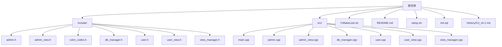
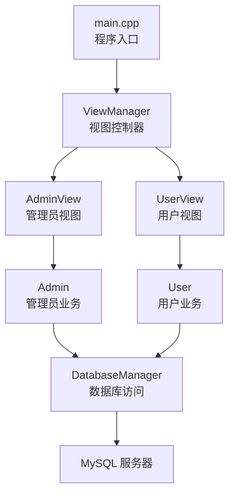
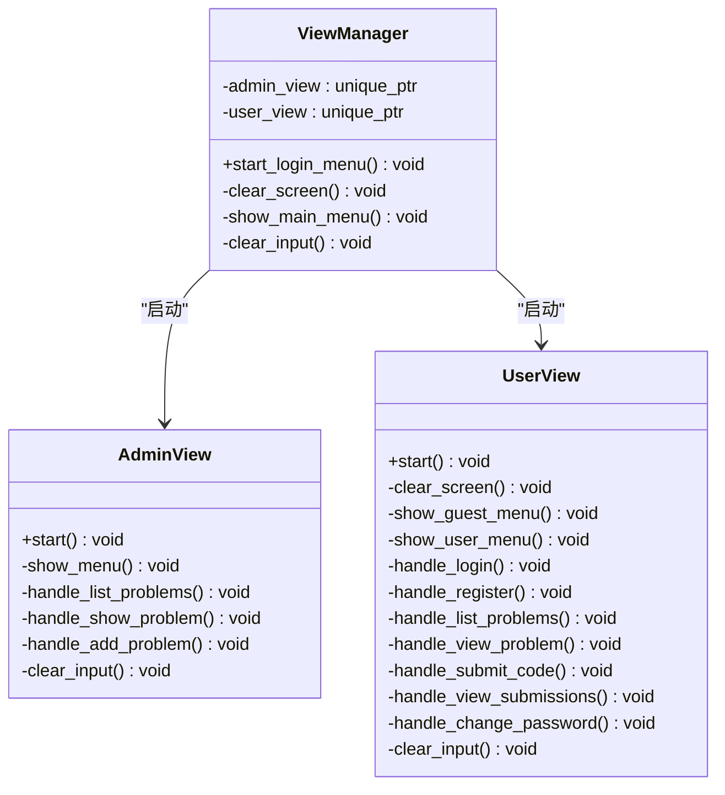
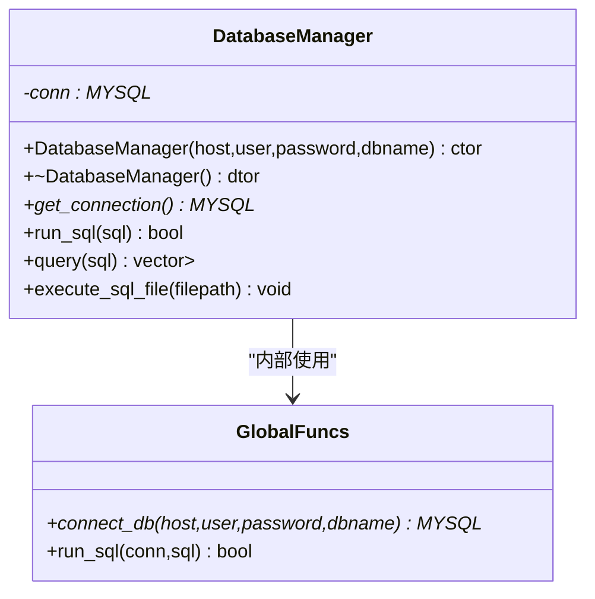
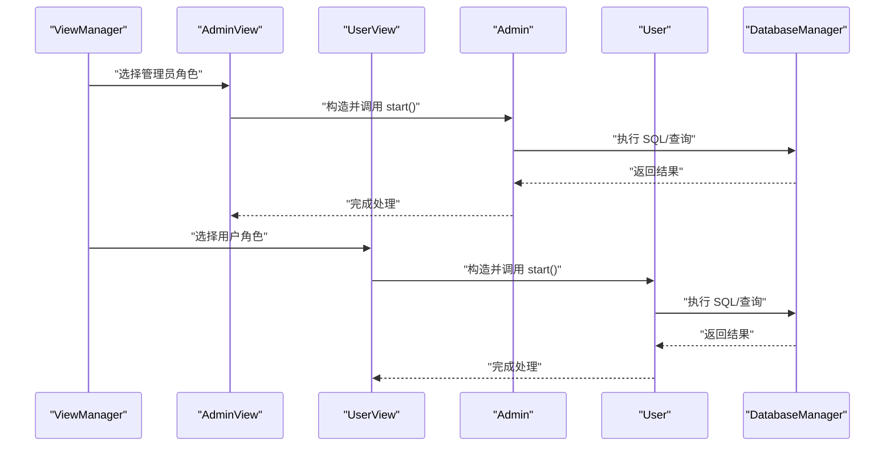
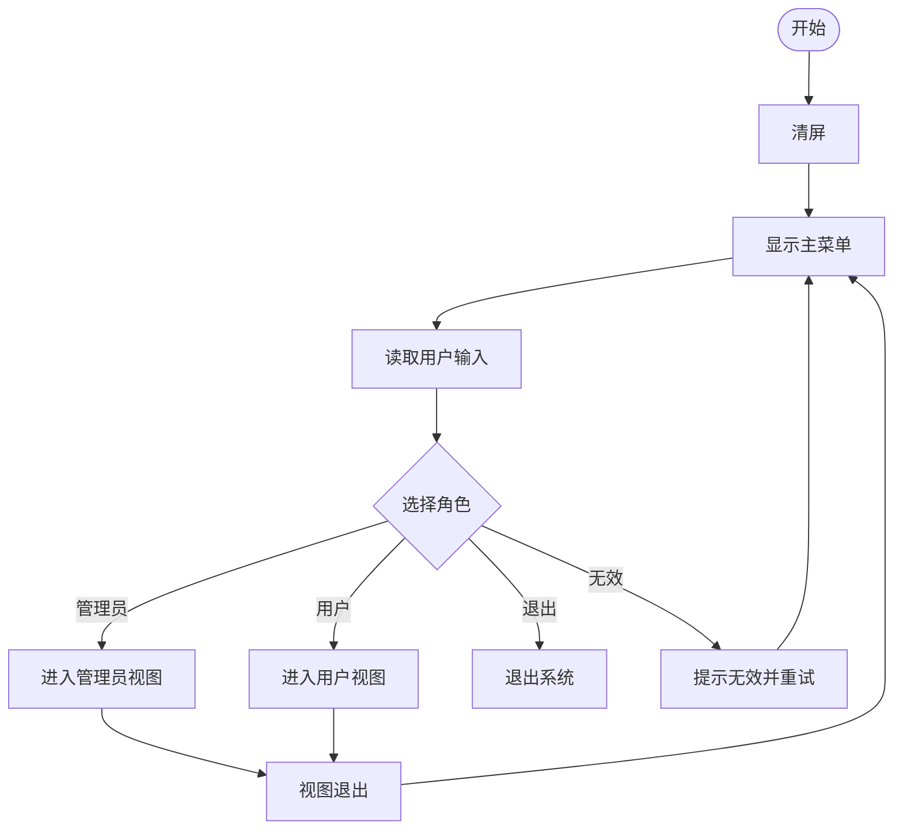
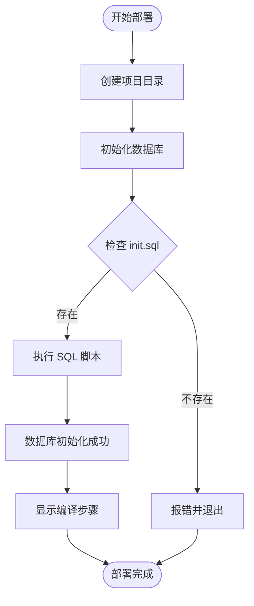
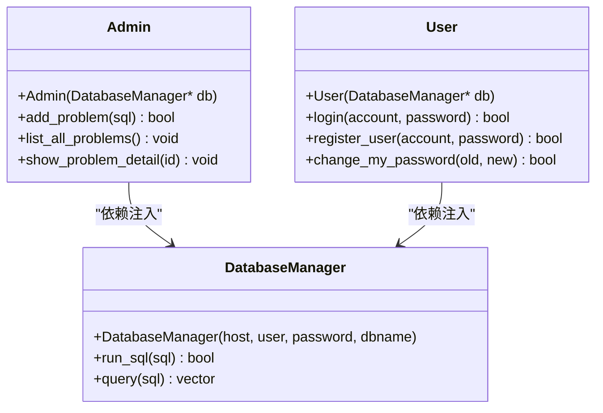
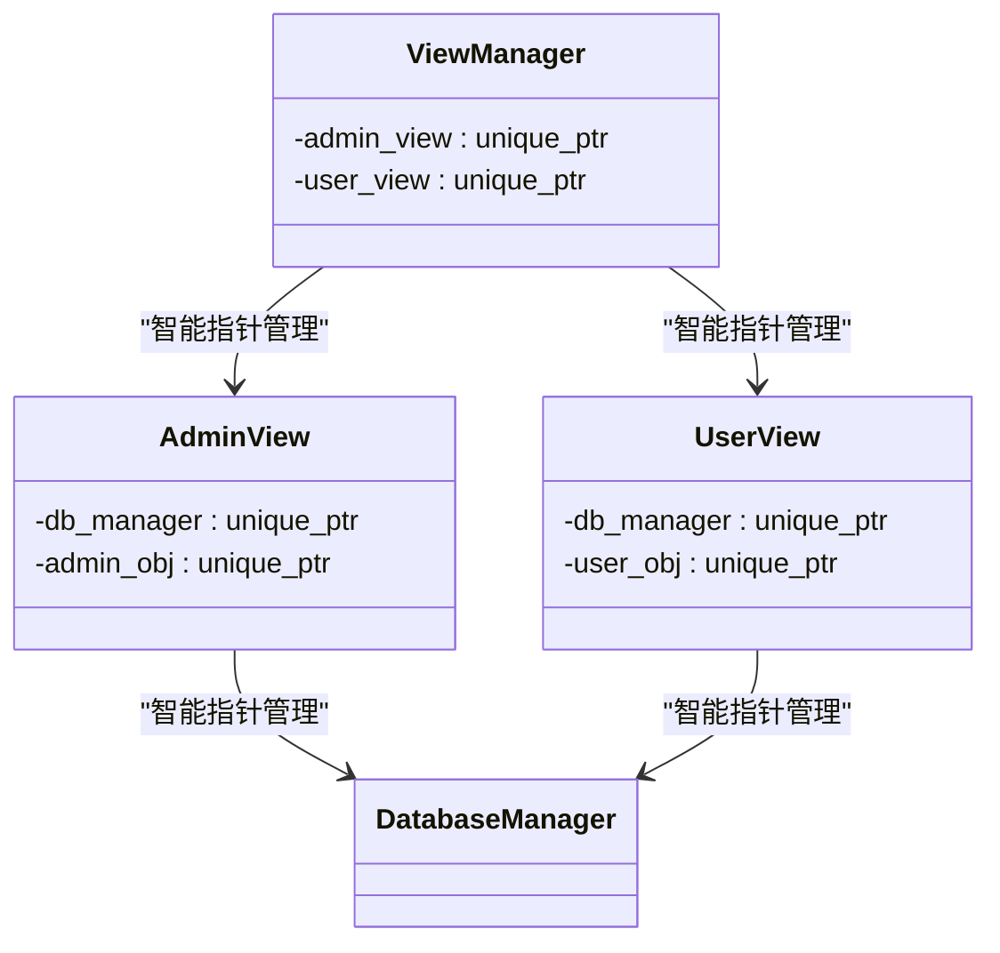
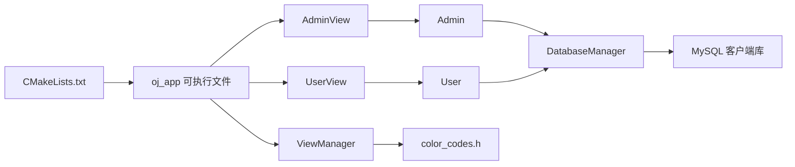

# 开发指南

<cite>
**本文引用的文件**
- [CMakeLists.txt](file://CMakeLists.txt)
- [README.md](file://README.md)
- [setup.sh](file://setup.sh)
- [init.sql](file://init.sql)
- [src/main.cpp](file://src/main.cpp)
- [include/view_manager.h](file://include/view_manager.h)
- [src/view_manager.cpp](file://src/view_manager.cpp)
- [include/db_manager.h](file://include/db_manager.h)
- [src/db_manager.cpp](file://src/db_manager.cpp)
- [include/admin.h](file://include/admin.h)
- [src/admin.cpp](file://src/admin.cpp)
- [include/user.h](file://include/user.h)
- [src/user.cpp](file://src/user.cpp)
- [include/admin_view.h](file://include/admin_view.h)
- [include/user_view.h](file://include/user_view.h)
- [include/color_codes.h](file://include/color_codes.h)
- [History/OJ_v0.1.md](file://History/OJ_v0.1.md)
</cite>

## 更新摘要
**所做更改**
- 新增一键部署脚本(setup.sh)的详细使用说明
- 更新数据库初始化流程和环境配置指导
- 完善开发环境设置和部署流程
- 增强构建系统配置和依赖管理说明
- 补充测试数据目录和文件结构说明
- 新增架构模式、类设计原则和最佳实践章节
- 更新类图和架构图以反映新的设计模式

## 目录
1. [简介](#简介)
2. [项目结构](#项目结构)
3. [核心组件](#核心组件)
4. [架构总览](#架构总览)
5. [详细组件分析](#详细组件分析)
6. [架构模式与设计原则](#架构模式与设计原则)
7. [依赖关系分析](#依赖关系分析)
8. [性能考虑](#性能考虑)
9. [故障排查指南](#故障排查指南)
10. [结论](#结论)
11. [附录](#附录)

## 简介
本开发指南面向贡献者与维护者，提供OJ系统的代码规范、构建流程、调试技巧、CMake配置说明、代码组织与命名约定、注释规范、开发环境与IDE设置、单元测试与质量检查、版本控制与发布流程、性能分析与内存检测方法，以及完整的开发工作流程与技术支持。

**更新** 新增一键部署脚本使用指南和数据库初始化流程说明，新增架构模式与设计原则章节。

## 项目结构
项目采用"头文件集中于 include，源文件集中于 src"的分层组织方式；根目录包含构建配置、初始化脚本与数据库脚本；History 文档记录了版本演进与接口说明。



**图表来源**
- [CMakeLists.txt:1-36](file://CMakeLists.txt#L1-L36)
- [src/main.cpp:1-12](file://src/main.cpp#L1-L12)
- [include/view_manager.h:1-43](file://include/view_manager.h#L1-L43)
- [include/db_manager.h:1-58](file://include/db_manager.h#L1-L58)
- [include/admin.h:1-40](file://include/admin.h#L1-L40)
- [include/user.h:1-89](file://include/user.h#L1-L89)
- [include/admin_view.h:1-53](file://include/admin_view.h#L1-L53)
- [include/user_view.h:1-83](file://include/user_view.h#L1-L83)
- [include/color_codes.h:1-18](file://include/color_codes.h#L1-L18)
- [init.sql:1-143](file://init.sql#L1-L143)
- [setup.sh:1-41](file://setup.sh#L1-L41)

**章节来源**
- [CMakeLists.txt:1-36](file://CMakeLists.txt#L1-L36)
- [README.md:1-2](file://README.md#L1-L2)
- [setup.sh:1-41](file://setup.sh#L1-L41)
- [init.sql:1-143](file://init.sql#L1-L143)
- [History/OJ_v0.1.md:296-320](file://History/OJ_v0.1.md#L296-L320)

## 核心组件
- 程序入口与视图控制器
  - 入口：main.cpp 调用视图管理器启动登录菜单。
  - 视图管理器：负责清屏、主菜单展示与角色选择，驱动管理员/用户视图。
- 数据访问层
  - DatabaseManager：封装MySQL连接、SQL执行、查询结果解析、批量执行SQL文件。
- 业务逻辑层
  - Admin/AdminView：管理员模式，提供题目发布、列表与详情查看。
  - User/UserView：用户模式，提供注册、登录、题目浏览、提交代码、查看提交记录、修改密码。
- 视觉辅助
  - color_codes.h：ANSI颜色常量，用于CLI输出美化。

**更新** 新增一键部署脚本和数据库初始化流程。

**章节来源**
- [src/main.cpp:1-12](file://src/main.cpp#L1-L12)
- [include/view_manager.h:1-43](file://include/view_manager.h#L1-L43)
- [src/view_manager.cpp:1-73](file://src/view_manager.cpp#L1-L73)
- [include/db_manager.h:1-58](file://include/db_manager.h#L1-L58)
- [src/db_manager.cpp:1-176](file://src/db_manager.cpp#L1-L176)
- [include/admin.h:1-40](file://include/admin.h#L1-L40)
- [src/admin.cpp:1-57](file://src/admin.cpp#L1-L57)
- [include/user.h:1-89](file://include/user.h#L1-L89)
- [src/user.cpp:1-190](file://src/user.cpp#L1-L190)
- [include/admin_view.h:1-53](file://include/admin_view.h#L1-L53)
- [include/user_view.h:1-83](file://include/user_view.h#L1-L83)
- [include/color_codes.h:1-18](file://include/color_codes.h#L1-L18)

## 架构总览
系统采用"视图-业务-数据访问"三层结构，入口通过视图管理器调度管理员/用户视图，视图再调用对应的业务对象，业务对象通过DatabaseManager访问数据库。



**图表来源**
- [src/main.cpp:1-12](file://src/main.cpp#L1-L12)
- [include/view_manager.h:1-43](file://include/view_manager.h#L1-L43)
- [include/admin_view.h:1-53](file://include/admin_view.h#L1-L53)
- [include/user_view.h:1-83](file://include/user_view.h#L1-L83)
- [include/admin.h:1-40](file://include/admin.h#L1-L40)
- [src/admin.cpp:1-57](file://src/admin.cpp#L1-L57)
- [include/user.h:1-89](file://include/user.h#L1-L89)
- [src/user.cpp:1-190](file://src/user.cpp#L1-L190)
- [include/db_manager.h:1-58](file://include/db_manager.h#L1-L58)
- [src/db_manager.cpp:1-176](file://src/db_manager.cpp#L1-L176)

## 详细组件分析

### 视图管理器（ViewManager）
职责：提供登录菜单、清屏、主菜单展示与输入校验；根据用户选择启动管理员或用户视图，并在视图退出后回收资源。



**图表来源**
- [include/view_manager.h:1-43](file://include/view_manager.h#L1-L43)
- [src/view_manager.cpp:1-73](file://src/view_manager.cpp#L1-L73)
- [include/admin_view.h:1-53](file://include/admin_view.h#L1-L53)
- [include/user_view.h:1-83](file://include/user_view.h#L1-L83)

**章节来源**
- [include/view_manager.h:1-43](file://include/view_manager.h#L1-L43)
- [src/view_manager.cpp:1-73](file://src/view_manager.cpp#L1-L73)

### 数据库管理器（DatabaseManager）
职责：封装MySQL连接生命周期、SQL执行与查询结果集解析、从文件批量执行SQL；提供便捷的全局函数以兼容简单场景。



**图表来源**
- [include/db_manager.h:1-58](file://include/db_manager.h#L1-L58)
- [src/db_manager.cpp:1-176](file://src/db_manager.cpp#L1-L176)

**章节来源**
- [include/db_manager.h:1-58](file://include/db_manager.h#L1-L58)
- [src/db_manager.cpp:1-176](file://src/db_manager.cpp#L1-L176)

### 管理员与用户视图
职责：分别提供管理员与用户模式的菜单、交互与业务处理；内部持有DatabaseManager与对应业务对象的智能指针，保证资源生命周期。



**图表来源**
- [include/admin_view.h:1-53](file://include/admin_view.h#L1-L53)
- [include/user_view.h:1-83](file://include/user_view.h#L1-L83)
- [include/admin.h:1-40](file://include/admin.h#L1-L40)
- [src/admin.cpp:1-57](file://src/admin.cpp#L1-L57)
- [include/user.h:1-89](file://include/user.h#L1-L89)
- [src/user.cpp:1-190](file://src/user.cpp#L1-L190)
- [include/db_manager.h:1-58](file://include/db_manager.h#L1-L58)

**章节来源**
- [include/admin_view.h:1-53](file://include/admin_view.h#L1-L53)
- [include/user_view.h:1-83](file://include/user_view.h#L1-L83)
- [include/admin.h:1-40](file://include/admin.h#L1-L40)
- [src/admin.cpp:1-57](file://src/admin.cpp#L1-L57)
- [include/user.h:1-89](file://include/user.h#L1-L89)
- [src/user.cpp:1-190](file://src/user.cpp#L1-L190)

### 登录菜单流程


**图表来源**
- [src/view_manager.cpp:28-66](file://src/view_manager.cpp#L28-L66)

**章节来源**
- [src/view_manager.cpp:1-73](file://src/view_manager.cpp#L1-L73)

### 一键部署流程
**新增** OJ系统提供一键部署脚本，简化开发环境初始化过程。



**图表来源**
- [setup.sh:8-41](file://setup.sh#L8-L41)

**章节来源**
- [setup.sh:1-41](file://setup.sh#L1-L41)

## 架构模式与设计原则

### 依赖注入模式
系统广泛采用依赖注入模式，通过构造函数参数传递DatabaseManager实例，实现松耦合的设计。



**图表来源**
- [include/admin.h:10-37](file://include/admin.h#L10-L37)
- [include/user.h:10-86](file://include/user.h#L10-L86)
- [include/db_manager.h:12-51](file://include/db_manager.h#L12-L51)

### RAII资源管理模式
所有资源管理严格遵循RAII原则，使用智能指针管理动态分配的对象生命周期。



**图表来源**
- [include/view_manager.h:23-24](file://include/view_manager.h#L23-L24)
- [include/admin_view.h:23-24](file://include/admin_view.h#L23-L24)
- [include/user_view.h:23-24](file://include/user_view.h#L23-L24)

### 单一职责原则
每个类都专注于单一功能领域，职责清晰分离：

- **ViewManager**：负责用户界面控制和角色切换
- **Admin/AdminView**：处理管理员特定业务逻辑
- **User/UserView**：处理用户特定业务逻辑  
- **DatabaseManager**：专门处理数据库连接和操作

### 开闭原则应用
系统设计遵循开闭原则，对扩展开放，对修改关闭：

- 新增业务功能可通过继承或组合现有类实现
- 数据库操作接口保持稳定，新增功能不影响现有代码
- 视图层与业务层解耦，便于功能扩展

**章节来源**
- [include/admin.h:10-37](file://include/admin.h#L10-L37)
- [include/user.h:10-86](file://include/user.h#L10-L86)
- [include/view_manager.h:11-40](file://include/view_manager.h#L11-L40)
- [include/admin_view.h:11-50](file://include/admin_view.h#L11-L50)
- [include/user_view.h:11-80](file://include/user_view.h#L11-L80)

## 依赖关系分析
- 构建系统
  - CMake最小版本要求、C++17标准、导出编译命令、查找并链接MySQL客户端库。
  - 自动收集src目录下的所有.cpp作为源文件，生成可执行文件oj_app。
- 运行时依赖
  - MySQL客户端库；数据库初始化脚本提供表结构与用户权限。
- 组件耦合
  - 视图层依赖业务层；业务层依赖数据访问层；数据访问层依赖MySQL客户端库。
  - 颜色常量被视图层使用，提升CLI可读性。



**图表来源**
- [CMakeLists.txt:1-36](file://CMakeLists.txt#L1-L36)
- [include/db_manager.h:1-58](file://include/db_manager.h#L1-L58)
- [include/admin_view.h:1-53](file://include/admin_view.h#L1-L53)
- [include/user_view.h:1-83](file://include/user_view.h#L1-L83)
- [include/admin.h:1-40](file://include/admin.h#L1-L40)
- [src/admin.cpp:1-57](file://src/admin.cpp#L1-L57)
- [include/user.h:1-89](file://include/user.h#L1-L89)
- [src/user.cpp:1-190](file://src/user.cpp#L1-L190)
- [include/view_manager.h:1-43](file://include/view_manager.h#L1-L43)
- [include/color_codes.h:1-18](file://include/color_codes.h#L1-L18)

**章节来源**
- [CMakeLists.txt:1-36](file://CMakeLists.txt#L1-L36)
- [init.sql:1-143](file://init.sql#L1-L143)

## 性能考虑
- 构建与编译
  - 使用C++17标准以获得现代语言特性；启用编译命令导出以便clang-tidy/VS Code等工具使用。
  - 建议在Debug/Release配置下分别启用调试符号与优化标志，平衡可调试性与运行效率。
- 数据库访问
  - 查询结果集一次性加载并解析，注意大数据量时的内存占用；必要时可改为流式处理或分页。
  - SQL文件批量执行按分号分割，不支持引号内分号；复杂脚本建议预处理或改用事务。
- I/O与UI
  - 清屏与频繁输出可能影响交互体验，建议在批量输出时合并缓冲。
- 评测核心（扩展）
  - 未来评测核心涉及编译、运行与判题，应引入沙箱与资源限制，避免超时/内存泄漏影响系统稳定性。

## 故障排查指南
- 构建问题
  - CMake版本过低：升级至3.10+。
  - MySQL客户端缺失：安装mysqlclient并确保pkg-config可用。
  - 未生成compile_commands.json：确认已开启导出编译命令。
- 运行问题
  - 数据库连接失败：核对init.sql初始化的用户与权限；确认数据库服务状态与凭据。
  - SQL执行失败：检查DatabaseManager的错误输出与日志；确认SQL语法与表结构。
  - 输入异常：ViewManager的输入缓冲清理逻辑会处理非数字输入，若仍异常请检查终端编码与locale。
- 部署问题
  - 权限不足：执行部署脚本时需要root权限来初始化数据库。
  - MySQL服务未启动：确保MySQL服务正常运行后再执行部署脚本。
  - 环境变量问题：确保PATH中包含MySQL客户端工具的路径。

**更新** 新增部署流程相关的故障排查指导。

- 调试建议
  - 使用GDB/LLDB附加进程；结合编译命令导出进行静态分析。
  - 对数据库层增加日志级别，定位慢查询与错误语句。
  - 对视图层增加交互日志，追踪菜单流转。

**章节来源**
- [CMakeLists.txt:1-36](file://CMakeLists.txt#L1-L36)
- [src/db_manager.cpp:126-176](file://src/db_manager.cpp#L126-L176)
- [src/view_manager.cpp:36-66](file://src/view_manager.cpp#L36-L66)
- [setup.sh:14-29](file://setup.sh#L14-L29)

## 结论
本指南提供了从构建、运行到调试与质量保障的完整开发工作流。建议在后续版本中补充单元测试、代码覆盖率统计、持续集成与Docker部署支持，以进一步提升系统稳定性与可维护性。

**更新** 新增一键部署脚本和数据库初始化流程，简化开发环境配置过程，新增架构模式与设计原则章节。

## 附录

### 代码规范与命名约定
- 文件命名
  - 头文件：小写_分隔，如db_manager.h；源文件：同名小写_分隔，如db_manager.cpp。
- 类与接口
  - 类名使用PascalCase；方法与变量使用camelCase；常量使用UPPER_CASE。
- 注释规范
  - 头文件暴露公共接口，使用简明注释说明用途；实现文件补充算法与边界条件说明。
- 命名空间
  - 颜色常量置于Color命名空间，避免全局污染。

**章节来源**
- [include/color_codes.h:1-18](file://include/color_codes.h#L1-L18)
- [include/db_manager.h:1-58](file://include/db_manager.h#L1-L58)
- [include/admin.h:1-40](file://include/admin.h#L1-L40)
- [src/admin.cpp:1-57](file://src/admin.cpp#L1-L57)
- [include/user.h:1-89](file://include/user.h#L1-L89)
- [src/user.cpp:1-190](file://src/user.cpp#L1-L190)

### CMake构建系统配置与编译参数
- 最小版本与标准
  - 要求CMake 3.10+，C++标准设为C++17。
- 依赖查找与包含
  - 通过pkg-config查找mysqlclient，包含其头文件目录。
- 源文件收集与目标
  - 自动收集src目录下所有.cpp；生成oj_app可执行文件。
- 链接库
  - 私有链接mysqlclient提供的库。
- 调试输出
  - 打印源文件列表与库路径，便于诊断。
- 编译命令导出
  - 启用export_compile_commands，生成compile_commands.json供工具使用。

**章节来源**
- [CMakeLists.txt:1-36](file://CMakeLists.txt#L1-L36)

### 开发环境配置与IDE设置
- 必备工具
  - CMake 3.10+、GCC/Clang C++17、MySQL客户端库、pkg-config。
- IDE建议
  - VS Code：启用C/C++扩展、CMake Tools；导入compile_commands.json以获得准确补全与跳转。
  - CLion：直接导入CMake工程，自动识别依赖与编译配置。
- 终端与字符集
  - 确保终端支持UTF-8与ANSI颜色序列，避免输出乱码。

**更新** 新增一键部署脚本的使用指导。

**章节来源**
- [CMakeLists.txt:1-36](file://CMakeLists.txt#L1-L36)
- [include/color_codes.h:1-18](file://include/color_codes.h#L1-L18)
- [setup.sh:31-40](file://setup.sh#L31-L40)

### 一键部署脚本使用指南
**新增** OJ系统提供一键部署脚本，简化开发环境初始化过程。

#### 脚本功能
- 自动创建项目目录结构
- 初始化MySQL数据库环境
- 提供编译运行指导

#### 使用步骤
1. **准备环境**
   - 确保系统已安装MySQL服务器
   - 准备root用户权限

2. **执行部署**
   ```bash
   chmod +x setup.sh
   ./setup.sh
   ```

3. **数据库初始化**
   - 脚本会自动执行init.sql
   - 需要输入MySQL root密码
   - 初始化完成后创建必要的用户和权限

4. **编译运行**
   ```bash
   cd build
   cmake ..
   make
   ./oj_app
   ```

#### 目录结构
部署完成后将创建以下目录：
- `build/` - 编译输出目录
- `test_data/1/` - 测试数据存储目录

#### 数据库配置
脚本会创建以下数据库和用户：
- 数据库：`OJ`
- 管理员用户：`oj_admin` (full access)
- 普通用户：`oj_user` (limited access)
- 示例用户：`test_user` (密码：123456)

**章节来源**
- [setup.sh:1-41](file://setup.sh#L1-L41)
- [init.sql:1-143](file://init.sql#L1-L143)

### 单元测试编写指南与质量检查
- 单元测试
  - 为DatabaseManager的关键方法（如run_sql、query、execute_sql_file）编写测试用例，覆盖成功与失败路径。
  - 为Admin/User的业务方法编写场景化测试，模拟登录、注册、提交等流程。
- 覆盖率
  - 使用gcov/lcov或Clang的覆盖率工具，目标为核心模块达到中等以上覆盖率。
- 静态分析
  - 使用clang-tidy检查C++17合规性与潜在问题；结合编译命令导出文件。
- 代码审查
  - 关注异常处理、资源释放、输入验证与SQL注入防护。

### 版本控制策略、分支管理与发布流程
- 分支策略
  - 主分支：稳定版本；develop分支：集成开发；功能分支：feature/*。
- 提交规范
  - 标准化的提交消息格式，包含类型、范围与简要描述。
- 发布流程
  - v0.1版本已提供初始化脚本与数据库脚本；后续版本可引入变更日志与自动化打包。

**更新** 新增一键部署脚本的版本控制建议。

**章节来源**
- [History/OJ_v0.1.md:1-383](file://History/OJ_v0.1.md#L1-L383)

### 性能分析与内存泄漏检测
- 性能分析
  - 使用perf/valgrind/callgrind分析热点函数；对数据库查询与I/O密集路径重点优化。
- 内存检测
  - 使用AddressSanitizer/Valgrind Memcheck检测内存越界与泄漏；对DatabaseManager析构路径进行重点检查。
- 日志与指标
  - 在关键路径增加耗时日志，形成基线以便回归对比。

### 贡献者开发工作流程
- 环境准备
  - 执行一键部署脚本初始化数据库与目录结构。
- 构建与运行
  - 按脚本提示在build目录执行CMake与make，运行oj_app。
- 功能开发
  - 遵循现有命名与注释规范；优先完善视图与业务层的测试。
- 提交流程
  - 提交前完成静态分析与基本测试；更新文档与变更日志。

**更新** 新增一键部署脚本的使用指导。

**章节来源**
- [setup.sh:1-41](file://setup.sh#L1-L41)
- [init.sql:1-143](file://init.sql#L1-L143)
- [History/OJ_v0.1.md:355-378](file://History/OJ_v0.1.md#L355-L378)