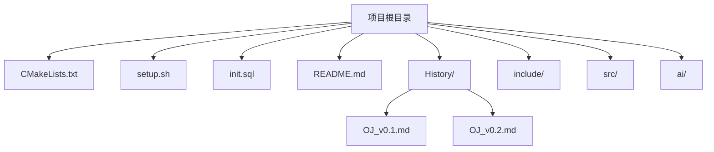
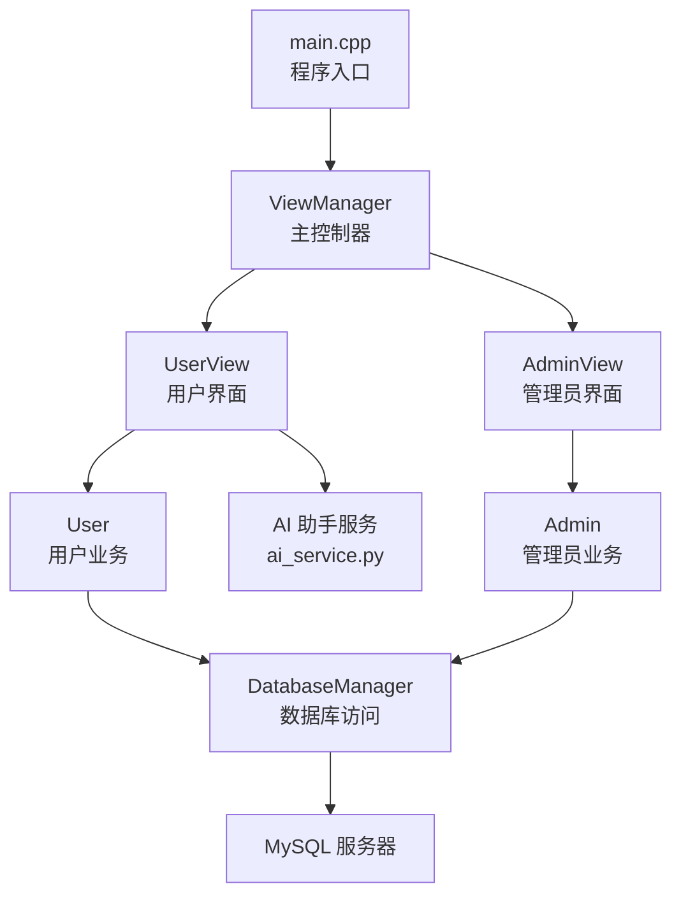
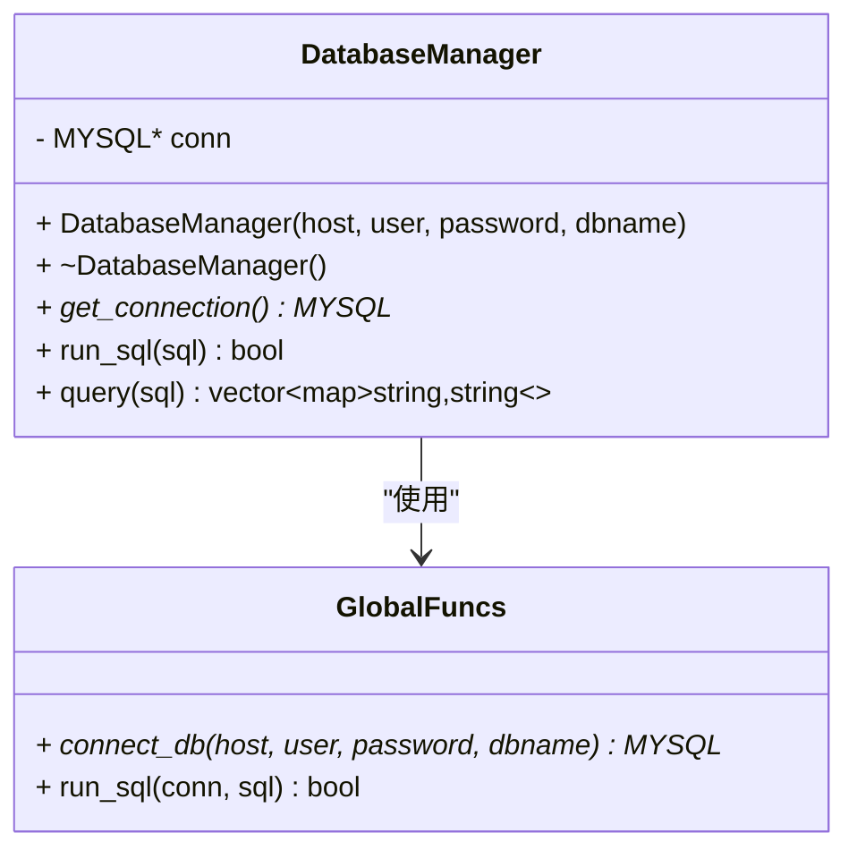
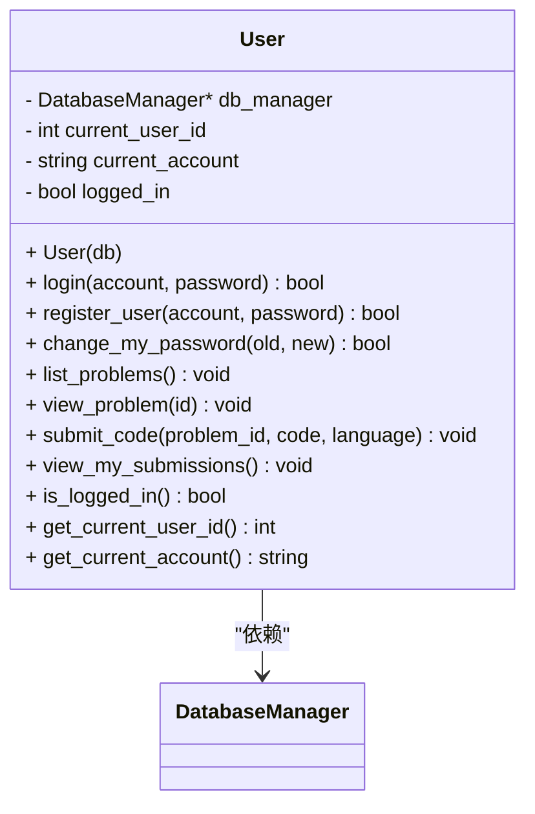
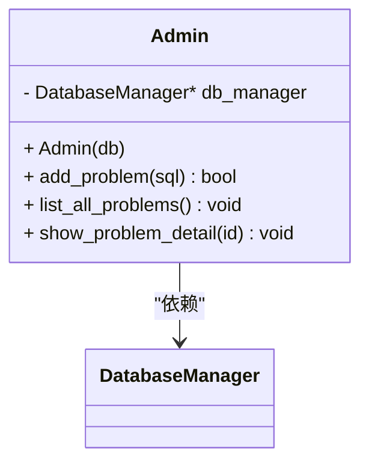
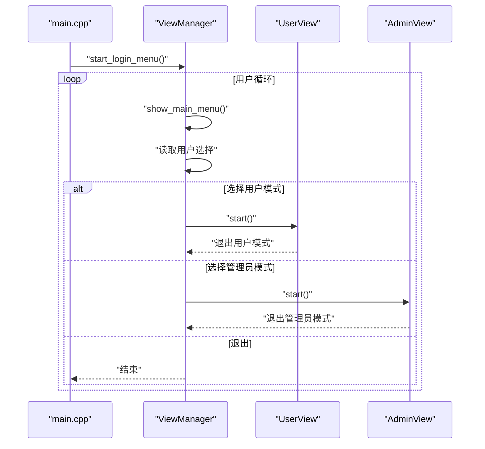
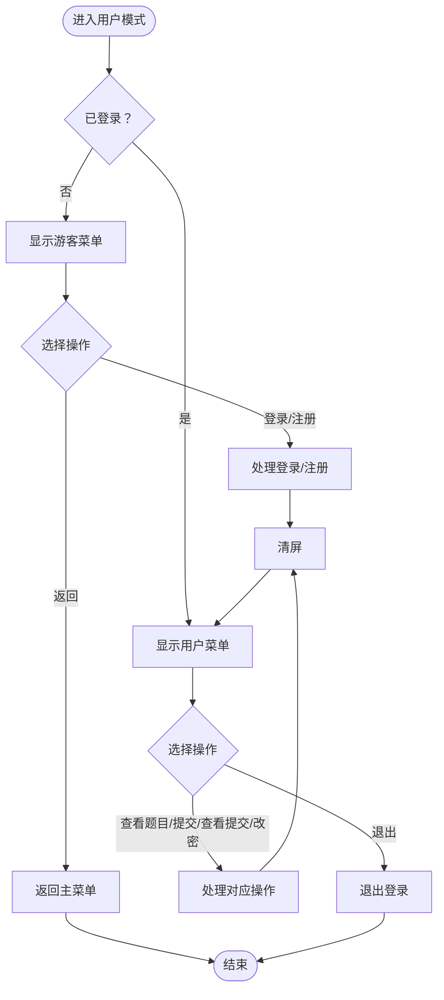
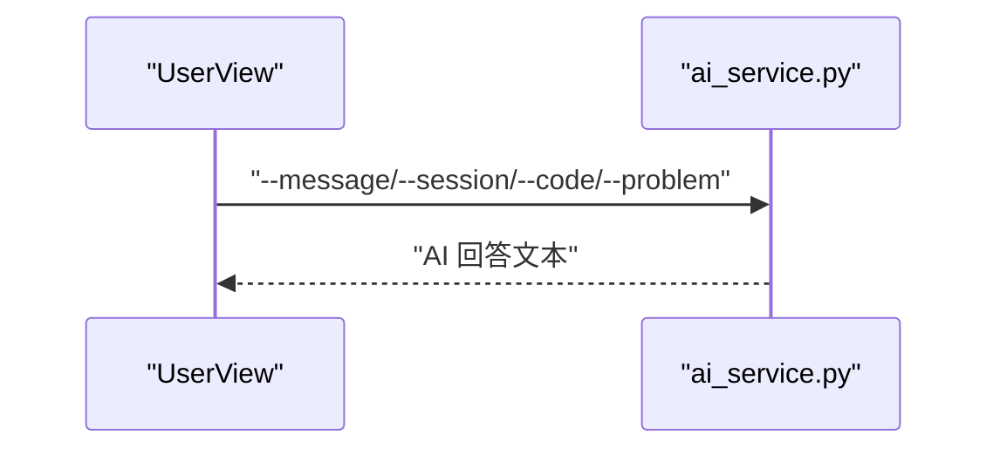
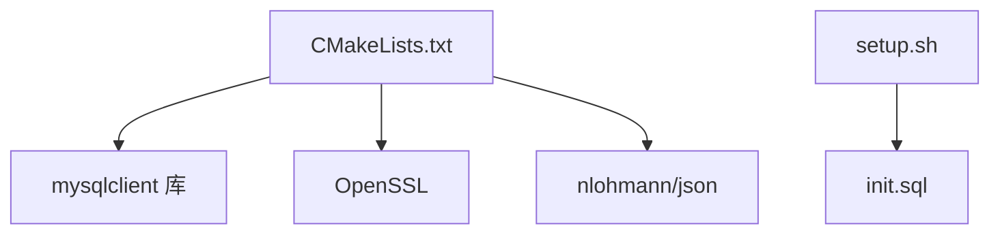

# 开发指南

<cite>
**本文引用的文件**
- [README.md](file://README.md)
- [CMakeLists.txt](file://CMakeLists.txt)
- [setup.sh](file://setup.sh)
- [init.sql](file://init.sql)
- [OJ_v0.1.md](file://History/OJ_v0.1.md)
- [OJ_v0.2.md](file://History/OJ_v0.2.md)
- [ai_service.py](file://ai/ai_service.py)
- [main.cpp](file://src/main.cpp)
- [view_manager.cpp](file://src/view_manager.cpp)
- [db_manager.cpp](file://src/db_manager.cpp)
- [user.cpp](file://src/user.cpp)
- [admin.cpp](file://src/admin.cpp)
- [db_manager.h](file://include/db_manager.h)
- [user.h](file://include/user.h)
- [admin.h](file://include/admin.h)
- [view_manager.h](file://include/view_manager.h)
- [user_view.h](file://include/user_view.h)
- [admin_view.h](file://include/admin_view.h)
</cite>

## 目录
1. [简介](#简介)
2. [项目结构](#项目结构)
3. [核心组件](#核心组件)
4. [架构总览](#架构总览)
5. [详细组件分析](#详细组件分析)
6. [依赖分析](#依赖分析)
7. [性能考虑](#性能考虑)
8. [故障排查指南](#故障排查指南)
9. [结论](#结论)
10. [附录](#附录)

## 简介
本开发指南面向希望参与 OJ 在线判题系统开发的贡献者，覆盖开发环境搭建、IDE 配置、编译器与链接器设置、调试工具配置、代码规范与最佳实践、调试与测试策略、扩展与集成指引、版本历史与兼容性说明，以及社区协作流程。系统采用 C++17、CMake 构建、MySQL 数据库与 OpenSSL，提供管理员与用户双角色 CLI 界面，并预留 AI 助手集成能力。

## 项目结构
- 根目录包含构建配置、一键部署脚本、数据库初始化脚本与历史版本文档。
- include 目录存放各模块头文件，src 目录存放对应实现文件。
- ai 目录提供本地 AI 助手服务脚本，支持通过命令行参数与会话记忆。
- 历史文档记录了 v0.1 与 v0.2 的功能演进与架构变化。

图表来源
- [CMakeLists.txt:1-40](file://CMakeLists.txt#L1-L40)
- [setup.sh:1-41](file://setup.sh#L1-L41)
- [init.sql:1-143](file://init.sql#L1-L143)
- [OJ_v0.1.md:296-320](file://History/OJ_v0.1.md#L296-L320)
- [OJ_v0.2.md:269-294](file://History/OJ_v0.2.md#L269-L294)

章节来源
- [CMakeLists.txt:1-40](file://CMakeLists.txt#L1-L40)
- [setup.sh:1-41](file://setup.sh#L1-L41)
- [init.sql:1-143](file://init.sql#L1-L143)
- [README.md:1-2](file://README.md#L1-L2)
- [OJ_v0.1.md:296-320](file://History/OJ_v0.1.md#L296-L320)
- [OJ_v0.2.md:269-294](file://History/OJ_v0.2.md#L269-L294)

## 核心组件
- 程序入口与界面控制器：main.cpp 与 ViewManager 负责启动登录菜单与角色切换。
- 数据访问层：DatabaseManager 封装 MySQL 连接、查询与执行。
- 业务逻辑层：User 与 Admin 分别处理用户与管理员相关业务。
- 视图层：UserView 与 AdminView 提供 CLI 菜单与交互流程。
- AI 助手：ai_service.py 提供本地调用的 AI 对话服务，供 UserView 集成。

章节来源
- [main.cpp:1-14](file://src/main.cpp#L1-L14)
- [view_manager.cpp:1-77](file://src/view_manager.cpp#L1-L77)
- [db_manager.cpp:1-100](file://src/db_manager.cpp#L1-L100)
- [user.cpp:1-223](file://src/user.cpp#L1-L223)
- [admin.cpp:1-59](file://src/admin.cpp#L1-L59)
- [user_view.h:1-92](file://include/user_view.h#L1-L92)
- [admin_view.h:1-58](file://include/admin_view.h#L1-L58)
- [db_manager.h:1-53](file://include/db_manager.h#L1-L53)
- [user.h:1-89](file://include/user.h#L1-L89)
- [admin.h:1-40](file://include/admin.h#L1-L40)

## 架构总览
系统采用“视图-控制器-业务-数据访问”的分层架构。ViewManager 作为主控制器协调 AdminView 与 UserView；User 与 Admin 通过 DatabaseManager 访问数据库；AI 助手以独立服务形式被 UserView 调用。

图表来源
- [main.cpp:5-13](file://src/main.cpp#L5-L13)
- [view_manager.cpp:32-70](file://src/view_manager.cpp#L32-L70)
- [user_view.h:24-26](file://include/user_view.h#L24-L26)
- [admin_view.h:23-24](file://include/admin_view.h#L23-L24)
- [user.h:82](file://include/user.h#L82)
- [admin.h:36](file://include/admin.h#L36)
- [db_manager.h:45](file://include/db_manager.h#L45)
- [ai_service.py:1-113](file://ai/ai_service.py#L1-L113)

## 详细组件分析

### 组件一：DatabaseManager 数据访问层
- 职责：封装 MySQL 连接、执行 SQL 与查询结果集解析。
- 关键点：构造时建立连接，析构时关闭；提供 run_sql 与 query；内部包含 connect_db 与 run_sql 全局函数。
- 复杂度：查询按行遍历，时间复杂度 O(N)，N 为结果行数；空间复杂度与结果集大小线性相关。

图表来源
- [db_manager.h:12-46](file://include/db_manager.h#L12-L46)
- [db_manager.cpp:8-19](file://src/db_manager.cpp#L8-L19)
- [db_manager.cpp:21-57](file://src/db_manager.cpp#L21-L57)
- [db_manager.cpp:61-79](file://src/db_manager.cpp#L61-L79)
- [db_manager.cpp:81-99](file://src/db_manager.cpp#L81-L99)

章节来源
- [db_manager.h:1-53](file://include/db_manager.h#L1-L53)
- [db_manager.cpp:1-100](file://src/db_manager.cpp#L1-L100)

### 组件二：User 用户业务逻辑
- 职责：用户登录、注册、改密、查看题目、提交代码、查看提交记录。
- 安全：使用 OpenSSL EVP 接口计算 SHA256 密码哈希；登录成功更新 last_login。
- 待实现：submit_code 与 view_my_submissions 仍为占位输出。

图表来源
- [user.h:10-86](file://include/user.h#L10-L86)
- [user.cpp:11-137](file://src/user.cpp#L11-L137)
- [user.cpp:201-222](file://src/user.cpp#L201-L222)

章节来源
- [user.h:1-89](file://include/user.h#L1-L89)
- [user.cpp:1-223](file://src/user.cpp#L1-L223)

### 组件三：Admin 管理员业务逻辑
- 职责：发布题目（执行 SQL）、列出题目、查看题目详情（JSON 格式）。
- 依赖：DatabaseManager。

图表来源
- [admin.h:10-37](file://include/admin.h#L10-L37)
- [admin.cpp:10-58](file://src/admin.cpp#L10-L58)

章节来源
- [admin.h:1-40](file://include/admin.h#L1-L40)
- [admin.cpp:1-59](file://src/admin.cpp#L1-L59)

### 组件四：ViewManager 视图控制器
- 职责：显示主菜单、清屏、角色切换、输入清理。
- 控制流：循环显示菜单，根据用户选择进入 AdminView 或 UserView。

图表来源
- [main.cpp:5-13](file://src/main.cpp#L5-L13)
- [view_manager.cpp:32-70](file://src/view_manager.cpp#L32-L70)

章节来源
- [view_manager.h:11-40](file://include/view_manager.h#L11-L40)
- [view_manager.cpp:1-77](file://src/view_manager.cpp#L1-77)

### 组件五：UserView 与 AdminView 视图层
- UserView：提供游客菜单（登录/注册）与用户菜单（查看题目/提交/查看提交/改密），支持清屏与返回机制。
- AdminView：提供管理员菜单（查看题目/添加题目），支持清屏。
- 交互流程：进入模式即清屏；在各菜单间切换时清屏；支持输入 0 返回上一步。

图表来源
- [user_view.h:12-89](file://include/user_view.h#L12-L89)
- [admin_view.h:11-55](file://include/admin_view.h#L11-L55)
- [view_manager.cpp:14-19](file://src/view_manager.cpp#L14-L19)

章节来源
- [user_view.h:1-92](file://include/user_view.h#L1-L92)
- [admin_view.h:1-58](file://include/admin_view.h#L1-L58)
- [view_manager.cpp:14-19](file://src/view_manager.cpp#L14-L19)

### 组件六：AI 助手服务
- ai_service.py：通过命令行参数接收问题、会话ID、代码上下文与题目上下文，调用 LangChain DeepSeek 模型，返回 AI 回答；支持会话记忆与错误处理。
- 集成建议：UserView 中的 handle_ai_assistant 可调用该服务，传递必要上下文。

图表来源
- [ai_service.py:93-113](file://ai/ai_service.py#L93-L113)

章节来源
- [ai_service.py:1-113](file://ai/ai_service.py#L1-L113)

## 依赖分析
- 构建系统：CMake 3.10+，C++17 标准，导出 compile_commands.json 便于 LSP/Clangd。
- 运行时依赖：MySQL 客户端库、OpenSSL。
- 第三方库：nlohmann/json 用于 Admin 的 JSON 输出。
- 脚本依赖：setup.sh 依赖 init.sql 初始化数据库；ai_service.py 依赖 dotenv、langchain-core、langchain-deepseek、langchain-community。

图表来源
- [CMakeLists.txt:11-34](file://CMakeLists.txt#L11-L34)
- [setup.sh:17-29](file://setup.sh#L17-L29)

章节来源
- [CMakeLists.txt:1-40](file://CMakeLists.txt#L1-L40)
- [setup.sh:1-41](file://setup.sh#L1-L41)
- [init.sql:67-94](file://init.sql#L67-L94)

## 性能考虑
- 数据库查询：避免 N+1 查询，批量查询与缓存热点题目信息；合理使用索引（如 users.idx_account、submissions.idx_user_id 等）。
- I/O 与网络：AI 助手调用应设置超时与重试；本地服务与 C++ 主程序通过进程通信，注意序列化与错误传播。
- CLI 交互：清屏使用 ANSI 转义序列，减少不必要的重绘；输入校验与缓冲区清理降低错误重试成本。
- 编译与链接：启用编译命令导出以便 IDE/工具链定位头文件与宏定义；Release 构建开启优化标志。

## 故障排查指南
- 构建失败
  - 检查 CMake 最低版本与 C++17 支持；确认 pkg-config 能找到 mysqlclient 与 OpenSSL。
  - 参考：[CMakeLists.txt:11-34](file://CMakeLists.txt#L11-L34)
- 运行期连接数据库失败
  - 确认 init.sql 已执行，数据库用户权限正确；核对连接参数与网络可达性。
  - 参考：[init.sql:67-94](file://init.sql#L67-L94)
- 登录/注册异常
  - 核对 SHA256 哈希逻辑与数据库字段长度；检查 last_login 更新是否成功。
  - 参考：[user.cpp:39-71](file://src/user.cpp#L39-L71)、[user.cpp:73-98](file://src/user.cpp#L73-L98)
- 题目提交/查看提交未实现
  - submit_code 与 view_my_submissions 当前为占位输出，需补充评测与存储逻辑。
  - 参考：[user.cpp:201-222](file://src/user.cpp#L201-L222)
- AI 助手不可用
  - 检查 DEEPSEEK_API_KEY 环境变量；确认网络与模型可用性；查看 stderr 错误输出。
  - 参考：[ai_service.py:42-90](file://ai/ai_service.py#L42-L90)

章节来源
- [CMakeLists.txt:11-34](file://CMakeLists.txt#L11-L34)
- [init.sql:67-94](file://init.sql#L67-L94)
- [user.cpp:39-71](file://src/user.cpp#L39-L71)
- [user.cpp:73-98](file://src/user.cpp#L73-L98)
- [user.cpp:201-222](file://src/user.cpp#L201-L222)
- [ai_service.py:42-90](file://ai/ai_service.py#L42-L90)

## 结论
本指南提供了从环境搭建到代码实现、从调试测试到扩展集成的完整开发路径。建议在 v0.2 的基础上逐步完善评测核心、沙箱安全、标签分类、排行榜与 Docker 支持，并持续优化数据库访问与 CLI 交互体验。

## 附录

### A. 开发环境搭建与 IDE 配置
- 系统与工具
  - 操作系统：Linux/macOS/Windows（WSL）
  - 编译器：GCC/Clang（支持 C++17）
  - 构建系统：CMake 3.10+
  - 数据库：MySQL（含 mysqlclient）
  - 加密库：OpenSSL
  - 可选：Python 3.8+（用于 AI 助手）
- 依赖安装与验证
  - 使用包管理器安装 mysqlclient、OpenSSL、CMake、编译器套件。
  - 验证：pkg-config mysqlclient 与 pkg-config openssl 命令可正常输出包含与库路径。
- CMake 配置要点
  - C++17 标准与 export compile_commands.json，便于 LSP/Clangd/VS Code/CLion 等工具识别头文件与宏。
  - 参考：[CMakeLists.txt:4-9](file://CMakeLists.txt#L4-L9)
- 一键部署
  - 执行 setup.sh 自动创建 build/test_data 目录、初始化数据库并提示编译步骤。
  - 参考：[setup.sh:17-39](file://setup.sh#L17-L39)
- 调试工具
  - 使用 gdb/lldb 调试；结合 compile_commands.json 与 Clangd/LSP 提升补全与跳转体验。
  - 参考：[CMakeLists.txt:8](file://CMakeLists.txt#L8)

章节来源
- [CMakeLists.txt:1-40](file://CMakeLists.txt#L1-L40)
- [setup.sh:1-41](file://setup.sh#L1-L41)

### B. 代码规范与最佳实践
- 命名约定
  - 类名：首字母大写驼峰（如 DatabaseManager、User、Admin）
  - 方法与属性：小写驼峰（如 run_sql、current_user_id）
  - 常量：全大写下划线（如 MAX_RETRY）
- 注释标准
  - 头文件：对类与公共接口提供简要说明与参数/返回值说明。
  - 实现文件：对复杂逻辑提供步骤说明与边界条件处理。
- 代码组织
  - 头文件声明接口，实现文件提供具体逻辑；尽量保持单一职责。
  - 使用 using namespace std 于 .cpp 文件内统一简化代码。
- 错误处理
  - 数据库操作失败时打印错误信息并返回布尔值；UI 层对失败进行友好提示。
- 安全
  - 密码使用 SHA256 哈希；后续可引入盐值与更强的密码学方案。
  - SQL 拼接存在注入风险，建议迁移到预处理语句或 ORM。

章节来源
- [user.cpp:8](file://src/user.cpp#L8)
- [db_manager.cpp:32-36](file://src/db_manager.cpp#L32-L36)

### C. 调试技巧与测试策略
- 单元测试
  - 为 User/DatabaseManager/Admin 的关键方法编写测试用例，覆盖正常与异常分支。
  - 使用 SQLite 内存数据库模拟 MySQL 行为，隔离外部依赖。
- 集成测试
  - 使用 init.sql 初始化测试数据库，验证登录/注册/提交/查看流程端到端正确性。
- 性能测试
  - 使用 gprof/Perf/Valgrind 检测热点函数与内存泄漏；对查询与 AI 调用设置超时。
- 日志与可观测性
  - 在 DatabaseManager 的 run_sql/query 中按需输出错误日志；在 AI 助手中记录请求与响应摘要。

章节来源
- [db_manager.cpp:32-36](file://src/db_manager.cpp#L32-L36)
- [ai_service.py:85-90](file://ai/ai_service.py#L85-L90)

### D. 扩展指南
- 添加新功能
  - 新增头文件与实现文件，遵循现有命名与组织方式；在 ViewManager 中注册新菜单项。
  - 参考：[view_manager.h:23-24](file://include/view_manager.h#L23-L24)
- 修改现有模块
  - 优先通过继承或组合扩展行为；保持接口稳定，避免破坏既有功能。
- 集成第三方服务
  - AI 助手：通过命令行参数与会话记忆与主程序解耦；确保错误处理与超时控制。
  - 参考：[ai_service.py:93-113](file://ai/ai_service.py#L93-L113)
- 数据库变更
  - 使用 init.sql 管理结构与权限；迁移脚本按版本递增维护。

章节来源
- [view_manager.h:23-24](file://include/view_manager.h#L23-L24)
- [ai_service.py:93-113](file://ai/ai_service.py#L93-L113)

### E. 版本历史与兼容性
- v0.1：基础框架，管理员题目管理与用户模式；DatabaseManager、Admin、User、ViewManager、AdminView、UserView 初版。
  - 参考：[OJ_v0.1.md:13-65](file://History/OJ_v0.1.md#L13-L65)
- v0.2：用户模块完整数据库交互、CLI 清屏优化、using namespace std、AI 助手预留接口。
  - 参考：[OJ_v0.2.md:39-92](file://History/OJ_v0.2.md#L39-L92)
- 兼容性注意事项
  - v0.2 更新了 users 表权限（INSERT 权限），升级时需重新执行 init.sql。
  - 参考：[OJ_v0.2.md:213-221](file://History/OJ_v0.2.md#L213-L221)

章节来源
- [OJ_v0.1.md:13-65](file://History/OJ_v0.1.md#L13-L65)
- [OJ_v0.2.md:39-92](file://History/OJ_v0.2.md#L39-L92)
- [OJ_v0.2.md:213-221](file://History/OJ_v0.2.md#L213-L221)

### F. 贡献者指南与社区协作
- 提交规范
  - 分支策略：master 作为稳定基线，feature/* 分支开发新功能，hotfix/* 修复紧急缺陷。
  - 提交信息：类型: 概述；正文说明动机与影响；引用相关 Issue。
- 代码审查
  - 至少一名维护者审查；关注安全性、性能与可维护性。
- 社区流程
  - Issue：Bug 报告与需求讨论；PR：功能实现与文档更新。
  - 讨论与决策：通过 GitHub Discussions 或 Issue 评审。

章节来源
- [README.md:1-2](file://README.md#L1-L2)