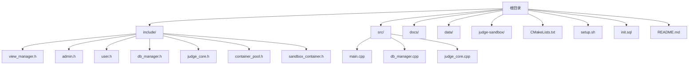
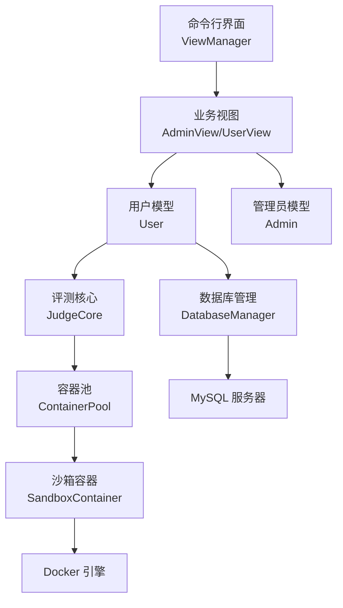
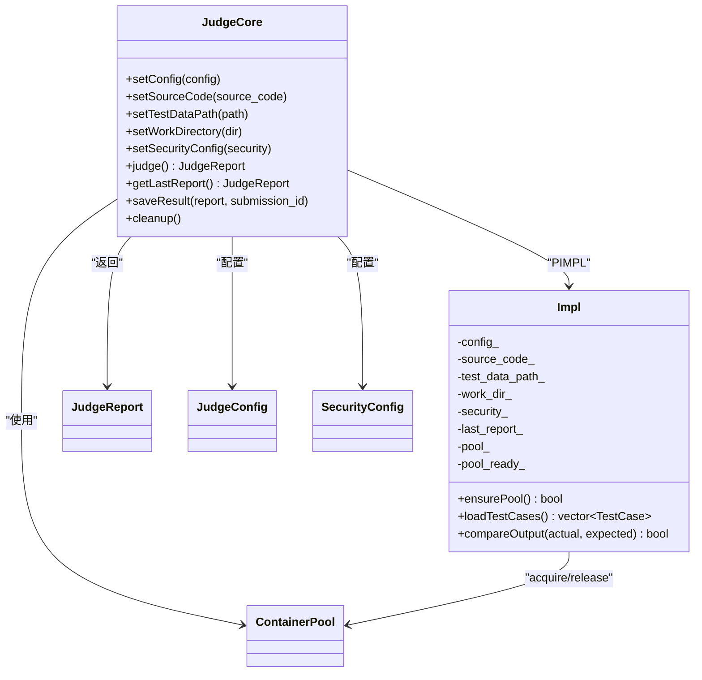
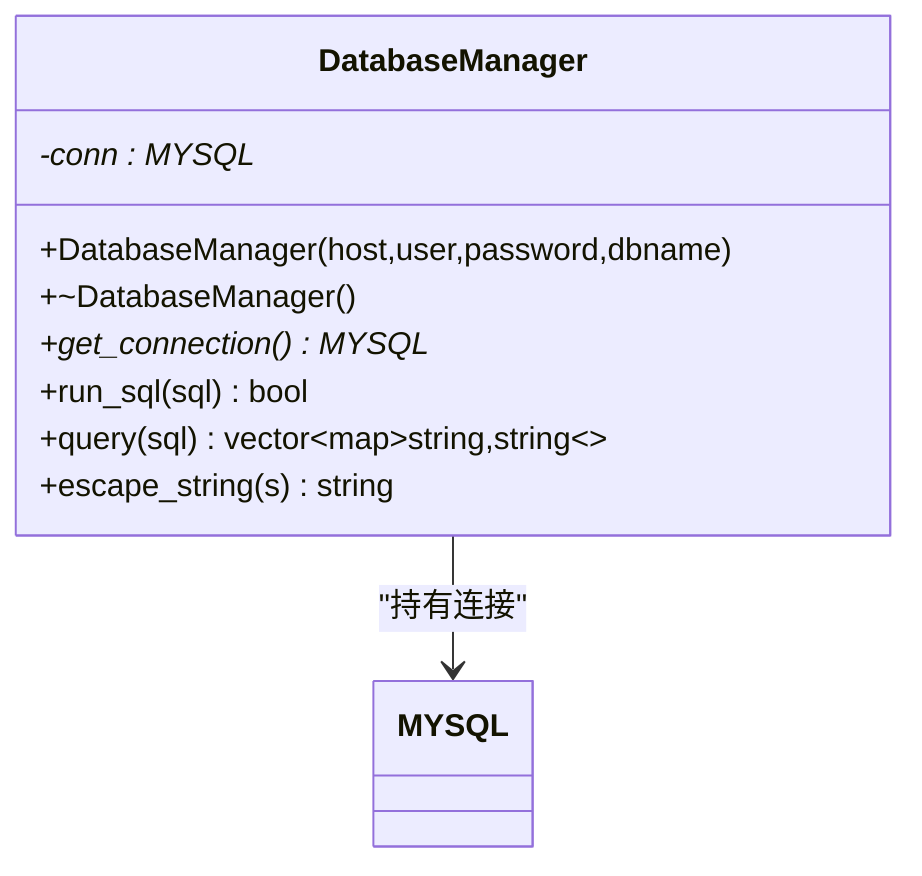
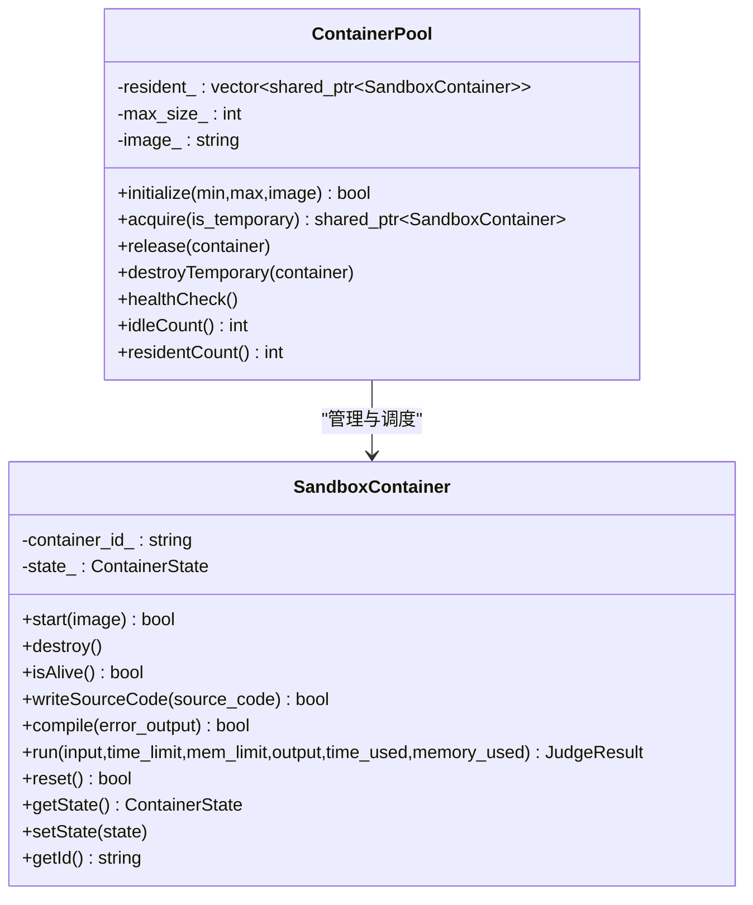
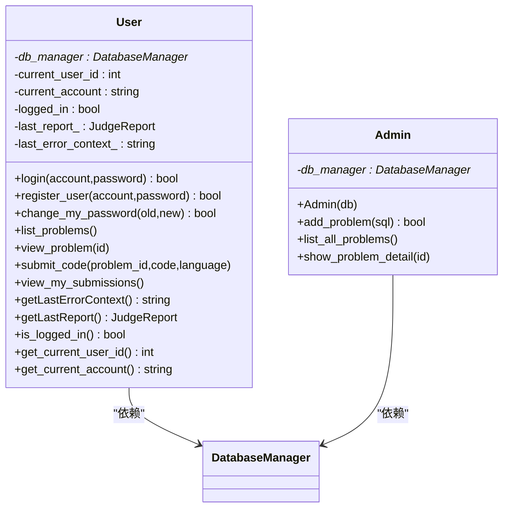
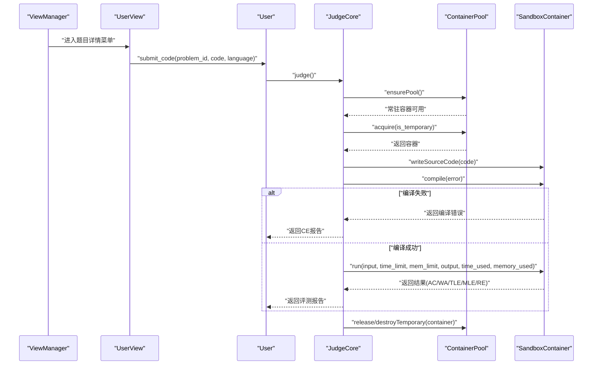
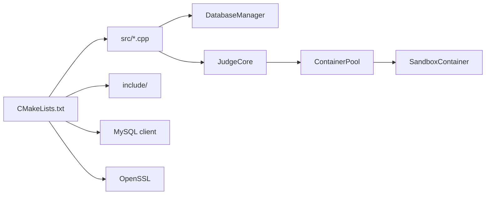

# 开发指南

<cite>
**本文引用的文件**
- [README.md](file://README.md)
- [CMakeLists.txt](file://CMakeLists.txt)
- [setup.sh](file://setup.sh)
- [init.sql](file://init.sql)
- [src/main.cpp](file://src/main.cpp)
- [include/view_manager.h](file://include/view_manager.h)
- [include/admin.h](file://include/admin.h)
- [include/user.h](file://include/user.h)
- [include/db_manager.h](file://include/db_manager.h)
- [include/judge_core.h](file://include/judge_core.h)
- [include/container_pool.h](file://include/container_pool.h)
- [include/sandbox_container.h](file://include/sandbox_container.h)
- [src/db_manager.cpp](file://src/db_manager.cpp)
- [src/judge_core.cpp](file://src/judge_core.cpp)
- [docs/code_submission_design.md](file://docs/code_submission_design.md)
</cite>

## 目录
1. [简介](#简介)
2. [项目结构](#项目结构)
3. [核心组件](#核心组件)
4. [架构总览](#架构总览)
5. [详细组件分析](#详细组件分析)
6. [依赖分析](#依赖分析)
7. [性能考虑](#性能考虑)
8. [故障排查指南](#故障排查指南)
9. [结论](#结论)
10. [附录](#附录)

## 简介
本开发指南面向OJ在线评测系统的开发者，围绕代码规范、开发环境搭建、构建系统（CMake）、模块开发流程、测试与调试策略、代码审查与质量保障、扩展开发最佳实践以及贡献流程等方面提供系统化说明。同时结合现有代码结构与设计文档，给出可落地的实施建议。

## 项目结构
项目采用分层与功能模块化组织方式：
- include：对外公开的头文件，定义接口与数据结构
- src：实现文件，按模块划分
- docs：设计文档与方案说明
- data：测试数据目录（按题目ID组织）
- judge-sandbox：沙箱Docker镜像构建上下文
- 根目录脚本：一键部署与数据库初始化

图表来源
- [CMakeLists.txt:1-40](file://CMakeLists.txt#L1-L40)
- [src/main.cpp:1-14](file://src/main.cpp#L1-L14)
- [include/view_manager.h:1-43](file://include/view_manager.h#L1-L43)
- [include/admin.h:1-40](file://include/admin.h#L1-L40)
- [include/user.h:1-102](file://include/user.h#L1-L102)
- [include/db_manager.h:1-60](file://include/db_manager.h#L1-L60)
- [include/judge_core.h:1-189](file://include/judge_core.h#L1-L189)
- [include/container_pool.h:1-85](file://include/container_pool.h#L1-L85)
- [include/sandbox_container.h:1-122](file://include/sandbox_container.h#L1-L122)
- [src/db_manager.cpp:1-110](file://src/db_manager.cpp#L1-L110)
- [src/judge_core.cpp:1-264](file://src/judge_core.cpp#L1-L264)

章节来源
- [README.md:1-2](file://README.md#L1-L2)
- [CMakeLists.txt:1-40](file://CMakeLists.txt#L1-L40)
- [setup.sh:1-41](file://setup.sh#L1-L41)
- [init.sql:1-278](file://init.sql#L1-L278)

## 核心组件
- 视图管理层：负责命令行菜单与用户交互，协调管理员与普通用户视图
- 用户与管理员：封装业务逻辑（登录、注册、提交、查看等）
- 数据库管理：封装MySQL连接、查询与转义
- 评测核心：定义评测配置、资源限制、安全配置、评测报告与结果持久化接口
- 容器池与沙箱容器：封装Docker容器生命周期、编译与运行、资源监控与清理

章节来源
- [include/view_manager.h:1-43](file://include/view_manager.h#L1-L43)
- [include/user.h:1-102](file://include/user.h#L1-L102)
- [include/admin.h:1-40](file://include/admin.h#L1-L40)
- [include/db_manager.h:1-60](file://include/db_manager.h#L1-L60)
- [include/judge_core.h:1-189](file://include/judge_core.h#L1-L189)
- [include/container_pool.h:1-85](file://include/container_pool.h#L1-L85)
- [include/sandbox_container.h:1-122](file://include/sandbox_container.h#L1-L122)

## 架构总览
系统采用“界面层-业务层-评测层-容器层”的分层架构，通过PIMPL隐藏实现细节，提升可维护性与安全性。

图表来源
- [include/view_manager.h:11-40](file://include/view_manager.h#L11-L40)
- [include/user.h:11-102](file://include/user.h#L11-L102)
- [include/admin.h:10-40](file://include/admin.h#L10-L40)
- [include/db_manager.h:12-60](file://include/db_manager.h#L12-L60)
- [include/judge_core.h:111-186](file://include/judge_core.h#L111-L186)
- [include/container_pool.h:20-82](file://include/container_pool.h#L20-L82)
- [include/sandbox_container.h:28-122](file://include/sandbox_container.h#L28-L122)

## 详细组件分析

### 评测核心（JudgeCore）
职责与特性
- 基于Docker容器化实现安全隔离的代码评测
- 支持编译、运行、资源监控与结果比对
- 使用PIMPL模式隐藏实现细节，接口稳定

关键接口与流程
- 配置接口：设置评测配置、源代码、测试数据路径、工作目录、安全配置
- 评测主流程：惰性初始化容器池、获取容器、写入源码、编译、加载测试数据、逐点评测、汇总结果、清理容器
- 结果持久化：保存评测结果到数据库（占位）

图表来源
- [include/judge_core.h:111-186](file://include/judge_core.h#L111-L186)
- [src/judge_core.cpp:12-110](file://src/judge_core.cpp#L12-L110)
- [src/judge_core.cpp:126-249](file://src/judge_core.cpp#L126-L249)

章节来源
- [include/judge_core.h:1-189](file://include/judge_core.h#L1-L189)
- [src/judge_core.cpp:1-264](file://src/judge_core.cpp#L1-L264)

### 数据库管理（DatabaseManager）
职责与特性
- 封装MySQL连接、SQL执行、查询结果映射与字符串转义
- 提供面向对象的RAII风格封装

图表来源
- [include/db_manager.h:12-60](file://include/db_manager.h#L12-L60)
- [src/db_manager.cpp:9-110](file://src/db_manager.cpp#L9-L110)

章节来源
- [include/db_manager.h:1-60](file://include/db_manager.h#L1-L60)
- [src/db_manager.cpp:1-110](file://src/db_manager.cpp#L1-L110)

### 容器池与沙箱容器
职责与特性
- 容器池：预热常驻容器、按需扩容临时容器、健康检查与回收
- 沙箱容器：封装Docker生命周期、文件写入、编译、运行、重置

图表来源
- [include/container_pool.h:20-82](file://include/container_pool.h#L20-L82)
- [include/sandbox_container.h:28-122](file://include/sandbox_container.h#L28-L122)

章节来源
- [include/container_pool.h:1-85](file://include/container_pool.h#L1-L85)
- [include/sandbox_container.h:1-122](file://include/sandbox_container.h#L1-L122)

### 用户与管理员模块
职责与特性
- 用户：登录、注册、修改密码、查看题目、提交代码、查看提交记录、获取评测上下文
- 管理员：发布题目、列出题目、查看题目详情

图表来源
- [include/user.h:11-102](file://include/user.h#L11-L102)
- [include/admin.h:10-40](file://include/admin.h#L10-L40)
- [include/db_manager.h:12-60](file://include/db_manager.h#L12-L60)

章节来源
- [include/user.h:1-102](file://include/user.h#L1-L102)
- [include/admin.h:1-40](file://include/admin.h#L1-L40)
- [include/db_manager.h:1-60](file://include/db_manager.h#L1-L60)

### 评测主流程时序

图表来源
- [src/judge_core.cpp:126-249](file://src/judge_core.cpp#L126-L249)
- [include/judge_core.h:151-177](file://include/judge_core.h#L151-L177)
- [include/container_pool.h:36-66](file://include/container_pool.h#L36-L66)
- [include/sandbox_container.h:53-83](file://include/sandbox_container.h#L53-L83)

## 依赖分析
- 构建系统：CMake负责设置C++17标准、导出编译命令、查找MySQL与OpenSSL、收集源文件、链接库并打印调试信息
- 运行时依赖：MySQL客户端、OpenSSL、Docker（容器化评测）
- 项目内依赖：视图层依赖业务层；业务层依赖数据库管理；评测核心依赖容器池；容器池依赖沙箱容器

图表来源
- [CMakeLists.txt:1-40](file://CMakeLists.txt#L1-L40)
- [src/db_manager.cpp:1-110](file://src/db_manager.cpp#L1-L110)
- [src/judge_core.cpp:1-264](file://src/judge_core.cpp#L1-L264)

章节来源
- [CMakeLists.txt:1-40](file://CMakeLists.txt#L1-L40)

## 性能考虑
- 容器池策略：预热常驻容器、按需创建临时容器，减少冷启动开销
- 资源限制：CPU配额、内存限制、输出大小限制、最大进程数、最大打开文件数
- 评测策略：遇到首个失败测试点即停止，避免无效计算
- I/O与文件系统：沙箱容器重置时清理临时文件，降低重复I/O成本

章节来源
- [include/container_pool.h:10-19](file://include/container_pool.h#L10-L19)
- [include/judge_core.h:36-64](file://include/judge_core.h#L36-L64)
- [src/judge_core.cpp:187-239](file://src/judge_core.cpp#L187-L239)

## 故障排查指南
- 数据库连接失败
  - 检查MySQL服务状态与凭据
  - 使用初始化脚本创建数据库、用户与权限
- Docker相关问题
  - 确认Docker可用且容器池初始化成功
  - 容器池健康检查失败时，尝试重启或重建容器
- 评测异常
  - 编译错误：检查源码与编译命令
  - 运行时错误：检查时间/内存限制与安全配置
  - 输出比对失败：确认输入输出格式与空白字符处理

章节来源
- [init.sql:1-278](file://init.sql#L1-L278)
- [src/db_manager.cpp:71-109](file://src/db_manager.cpp#L71-L109)
- [src/judge_core.cpp:126-249](file://src/judge_core.cpp#L126-L249)

## 结论
本指南基于现有代码与设计文档，给出了OJ系统的架构视图、核心组件职责、构建与运行依赖、评测流程与性能要点，并提供了故障排查与扩展开发建议。后续可结合设计文档逐步实现工作区文件、AI上下文增强与历史记录管理等功能。

## 附录

### 代码规范与编程约定
- C++标准：使用C++17（已在CMake中设置）
- 命名规范
  - 类与接口：大驼峰（如 JudgeCore、DatabaseManager）
  - 方法与变量：小驼峰（如 setConfig、source_code_）
  - 常量与枚举：全大写加下划线（如 TIME_LIMIT_EXCEEDED）
- 注释要求
  - 公共接口需提供简明注释，说明用途、参数与返回值
  - 复杂流程与关键决策处补充注释
  - 使用Doxygen风格注释块（如对枚举、结构体、类与方法的说明）
- 错误处理
  - 统一使用错误码或异常（根据团队约定），并在日志中记录关键错误信息
- 并发与线程安全
  - 容器池使用互斥锁保护共享状态
- 文件与目录
  - 头文件仅暴露接口，实现放在对应源文件
  - 评测工作目录与测试数据目录需明确约定

章节来源
- [CMakeLists.txt:4-6](file://CMakeLists.txt#L4-L6)
- [include/judge_core.h:111-186](file://include/judge_core.h#L111-L186)
- [include/container_pool.h:74-82](file://include/container_pool.h#L74-L82)

### 开发环境搭建
- 依赖安装
  - MySQL客户端与OpenSSL
  - CMake（>=3.10）
  - Docker（用于沙箱评测）
- 一键部署
  - 使用部署脚本创建目录并初始化数据库
- 编译与运行
  - 在build目录执行CMake配置与编译
  - 运行可执行文件进入系统

章节来源
- [setup.sh:1-41](file://setup.sh#L1-L41)
- [init.sql:1-278](file://init.sql#L1-L278)
- [CMakeLists.txt:1-40](file://CMakeLists.txt#L1-L40)
- [src/main.cpp:1-14](file://src/main.cpp#L1-L14)

### 构建系统（CMake）配置与编译选项
- 设置C++17标准与必需项
- 导出compile_commands.json便于语言服务器与静态分析
- 查找并包含MySQL与OpenSSL
- 收集src目录下所有源文件并生成可执行文件
- 链接MySQL与OpenSSL库，并打印调试信息

章节来源
- [CMakeLists.txt:1-40](file://CMakeLists.txt#L1-L40)

### 模块开发指南
- 新功能模块添加流程
  - 在include目录新增头文件，定义对外接口
  - 在src目录新增实现文件，遵循现有命名与目录组织
  - 在CMakeLists.txt中更新源文件收集或新增目标
  - 在视图层或业务层中集成新模块接口
- 接口设计原则
  - 单一职责、高内聚低耦合
  - 明确输入输出与异常场景
  - 优先使用RAII与智能指针管理资源
  - 对外接口尽量稳定，内部实现可演进

章节来源
- [CMakeLists.txt:23-34](file://CMakeLists.txt#L23-L34)
- [include/view_manager.h:11-40](file://include/view_manager.h#L11-L40)
- [include/user.h:11-102](file://include/user.h#L11-L102)

### 测试策略与调试方法
- 单元测试
  - 针对JudgeCore的评测流程、容器池调度、沙箱容器编译/运行进行单元测试
  - 针对DatabaseManager的SQL执行与查询结果进行单元测试
- 集成测试
  - 端到端验证：用户登录、查看题目、提交代码、评测结果、历史记录
  - Docker环境下的容器编译与运行一致性测试
- 性能测试
  - 不同规模测试数据下的评测耗时与内存占用
  - 容器池并发压力测试
- 调试工具
  - 使用CMake导出的compile_commands.json配合clang-tidy、clang-format、Valgrind等
  - 通过日志定位评测失败原因（编译错误、运行超时/超内存、输出比对失败）

章节来源
- [src/judge_core.cpp:126-249](file://src/judge_core.cpp#L126-L249)
- [src/db_manager.cpp:22-67](file://src/db_manager.cpp#L22-L67)

### 代码审查流程与质量保证
- 代码审查清单
  - 接口设计是否清晰、是否符合单一职责
  - 错误处理与异常路径是否完备
  - 资源管理（数据库连接、容器、内存）是否正确释放
  - 日志与错误信息是否充分
  - 性能与安全性（资源限制、安全配置）是否到位
- 质量工具
  - 静态分析：clang-tidy
  - 格式化：clang-format
  - 单测覆盖率：结合单元测试与集成测试
- 版本控制与分支策略
  - 主干受保护，功能在分支开发并通过PR审查后合并
  - 提交信息清晰，包含问题编号与变更摘要

章节来源
- [include/judge_core.h:111-186](file://include/judge_core.h#L111-L186)
- [include/container_pool.h:20-82](file://include/container_pool.h#L20-L82)

### 扩展开发最佳实践与常见陷阱
- 最佳实践
  - 使用PIMPL隐藏实现细节，提升接口稳定性
  - 严格区分业务逻辑与基础设施（数据库、容器）
  - 明确资源边界与生命周期，避免泄漏
  - 为关键流程提供可观测性（日志、指标）
- 常见陷阱
  - 忽视容器池健康检查导致评测阻塞
  - 未正确处理测试数据缺失或格式不一致
  - 安全配置过于宽松或过严，影响评测准确性
  - 数据库权限不足导致写入失败

章节来源
- [src/judge_core.cpp:28-34](file://src/judge_core.cpp#L28-L34)
- [src/judge_core.cpp:73-94](file://src/judge_core.cpp#L73-L94)
- [include/judge_core.h:52-64](file://include/judge_core.h#L52-L64)

### 贡献代码流程
- 分支与提交
  - 基于主干创建功能分支，提交信息包含问题编号与简要说明
- 代码审查
  - 发起PR，至少一名维护者审查通过后方可合并
- 测试与验证
  - 本地通过单元测试与集成测试，必要时提供性能对比
- 文档更新
  - 如接口或行为变更，同步更新设计文档与注释

章节来源
- [docs/code_submission_design.md:1-629](file://docs/code_submission_design.md#L1-L629)