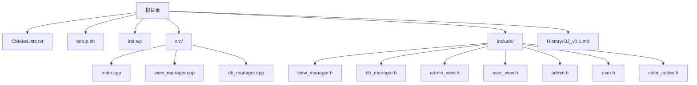
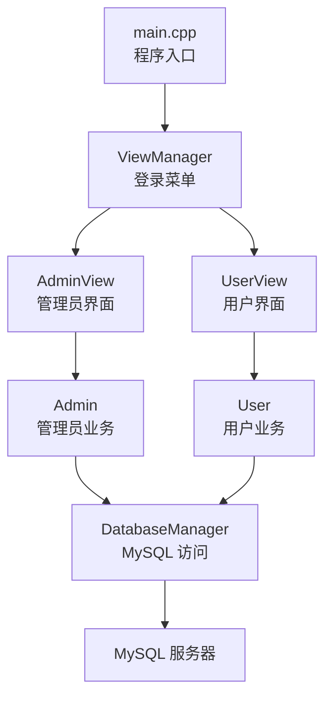
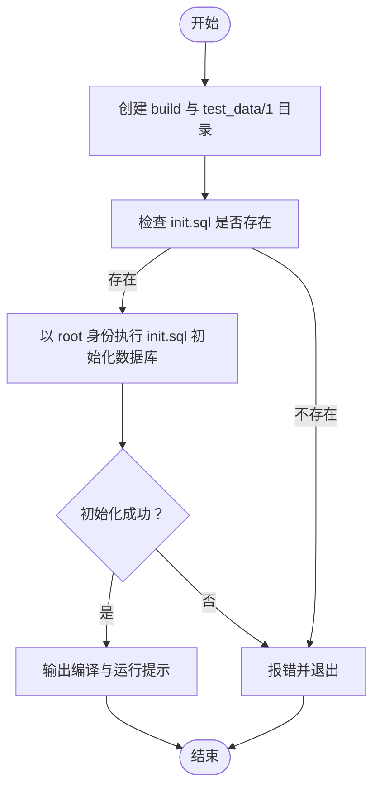
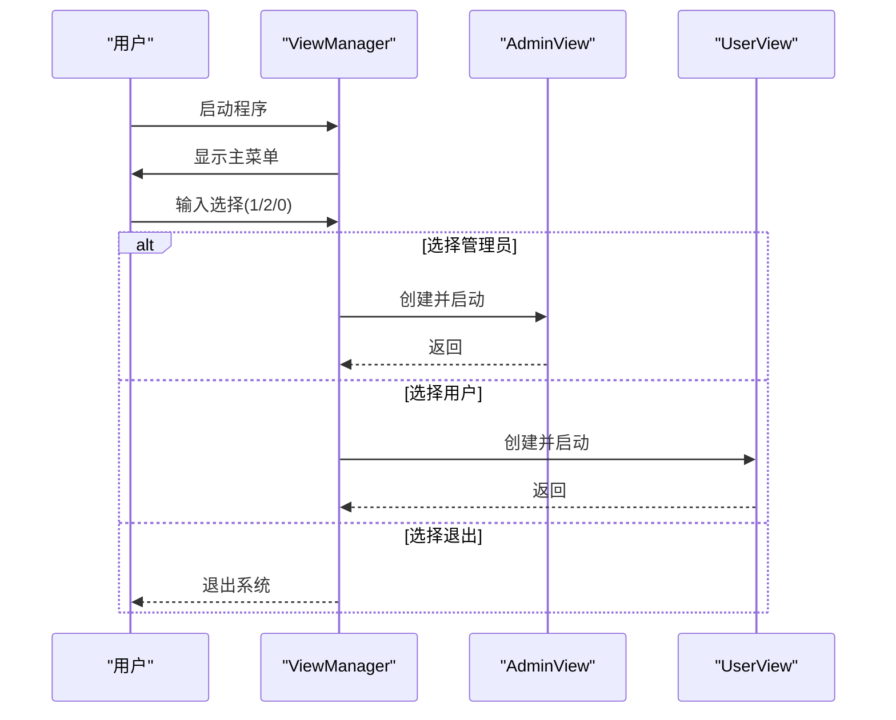
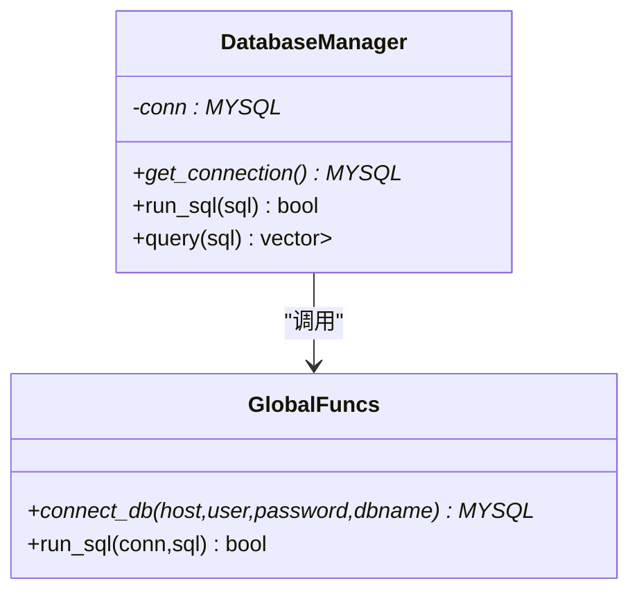
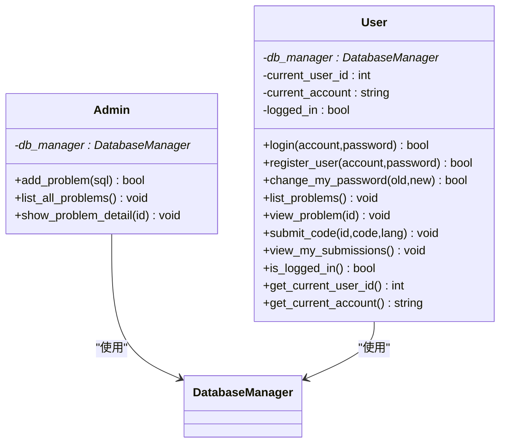
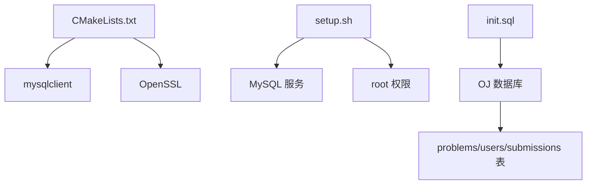

# 快速开始

<cite>
**本文引用的文件**
- [README.md](file://README.md)
- [setup.sh](file://setup.sh)
- [init.sql](file://init.sql)
- [CMakeLists.txt](file://CMakeLists.txt)
- [src/main.cpp](file://src/main.cpp)
- [src/view_manager.cpp](file://src/view_manager.cpp)
- [include/view_manager.h](file://include/view_manager.h)
- [include/db_manager.h](file://include/db_manager.h)
- [src/db_manager.cpp](file://src/db_manager.cpp)
- [include/admin_view.h](file://include/admin_view.h)
- [include/user_view.h](file://include/user_view.h)
- [include/admin.h](file://include/admin.h)
- [include/user.h](file://include/user.h)
- [include/color_codes.h](file://include/color_codes.h)
- [History/OJ_v0.1.md](file://History/OJ_v0.1.md)
</cite>

## 目录
1. [简介](#简介)
2. [项目结构](#项目结构)
3. [核心组件](#核心组件)
4. [架构总览](#架构总览)
5. [详细组件分析](#详细组件分析)
6. [依赖分析](#依赖分析)
7. [性能考虑](#性能考虑)
8. [故障排除指南](#故障排除指南)
9. [结论](#结论)
10. [附录](#附录)

## 简介
本指南面向首次接触 OJ 评测系统的用户，帮助你在最短时间内完成环境准备、一键部署、数据库初始化与首次运行。系统采用 C++17、MySQL 与 CMake 构建，提供命令行界面（CLI），支持管理员与用户两种角色，具备题目管理、用户注册登录、提交代码与查看提交记录等核心功能。

## 项目结构
- 根目录包含构建脚本、一键部署脚本、数据库初始化脚本与文档。
- include/ 与 src/ 分别存放头文件与源文件，遵循“按职责分层”的组织方式。
- CMakeLists.txt 定义了 C++17 标准、依赖查找（mysqlclient、OpenSSL）、编译与链接规则。
- setup.sh 一键创建目录、初始化数据库、提示后续编译步骤。
- init.sql 负责创建数据库、表、示例数据与数据库用户权限。

图表来源
- [CMakeLists.txt:1-40](file://CMakeLists.txt#L1-L40)
- [setup.sh:1-41](file://setup.sh#L1-L41)
- [init.sql:1-278](file://init.sql#L1-L278)
- [src/main.cpp:1-14](file://src/main.cpp#L1-L14)
- [src/view_manager.cpp:1-77](file://src/view_manager.cpp#L1-L77)
- [src/db_manager.cpp:1-100](file://src/db_manager.cpp#L1-L100)
- [include/view_manager.h:1-43](file://include/view_manager.h#L1-L43)
- [include/db_manager.h:1-53](file://include/db_manager.h#L1-L53)
- [include/admin_view.h:1-58](file://include/admin_view.h#L1-L58)
- [include/user_view.h:1-92](file://include/user_view.h#L1-L92)
- [include/admin.h:1-40](file://include/admin.h#L1-L40)
- [include/user.h:1-89](file://include/user.h#L1-L89)
- [include/color_codes.h:1-18](file://include/color_codes.h#L1-L18)

章节来源
- [README.md:1-2](file://README.md#L1-L2)
- [CMakeLists.txt:1-40](file://CMakeLists.txt#L1-L40)
- [setup.sh:1-41](file://setup.sh#L1-L41)
- [init.sql:1-278](file://init.sql#L1-L278)

## 核心组件
- 程序入口与界面控制器：main.cpp 与 ViewManager 负责启动登录菜单并按角色切换。
- 数据访问层：DatabaseManager 封装 MySQL 连接与查询执行。
- 视图层：AdminView、UserView 分别承载管理员与用户功能菜单与交互。
- 业务逻辑层：Admin、User 封装具体业务（如发布题目、注册登录、提交代码等）。
- 构建与依赖：CMakeLists.txt 指定 C++17、mysqlclient、OpenSSL 依赖。
- 一键部署：setup.sh 创建目录、初始化数据库、提示编译步骤。
- 数据库初始化：init.sql 创建数据库、表、示例数据与用户权限。

章节来源
- [src/main.cpp:1-14](file://src/main.cpp#L1-L14)
- [src/view_manager.cpp:1-77](file://src/view_manager.cpp#L1-L77)
- [include/view_manager.h:1-43](file://include/view_manager.h#L1-L43)
- [include/db_manager.h:1-53](file://include/db_manager.h#L1-L53)
- [src/db_manager.cpp:1-100](file://src/db_manager.cpp#L1-L100)
- [include/admin_view.h:1-58](file://include/admin_view.h#L1-L58)
- [include/user_view.h:1-92](file://include/user_view.h#L1-L92)
- [include/admin.h:1-40](file://include/admin.h#L1-L40)
- [include/user.h:1-89](file://include/user.h#L1-L89)
- [CMakeLists.txt:1-40](file://CMakeLists.txt#L1-L40)
- [setup.sh:1-41](file://setup.sh#L1-L41)
- [init.sql:1-278](file://init.sql#L1-L278)

## 架构总览
系统采用“视图-业务-数据访问-数据库”的分层架构。程序入口启动 ViewManager，根据用户选择进入 AdminView 或 UserView；二者分别持有 DatabaseManager 与业务对象（Admin/User），通过 DatabaseManager 访问 MySQL。

图表来源
- [src/main.cpp:1-14](file://src/main.cpp#L1-L14)
- [src/view_manager.cpp:1-77](file://src/view_manager.cpp#L1-L77)
- [include/admin_view.h:1-58](file://include/admin_view.h#L1-L58)
- [include/user_view.h:1-92](file://include/user_view.h#L1-L92)
- [include/admin.h:1-40](file://include/admin.h#L1-L40)
- [include/user.h:1-89](file://include/user.h#L1-L89)
- [include/db_manager.h:1-53](file://include/db_manager.h#L1-L53)
- [src/db_manager.cpp:1-100](file://src/db_manager.cpp#L1-L100)

## 详细组件分析

### 组件一：一键部署与数据库初始化
- 一键部署脚本 setup.sh
  - 创建 build 与 test_data/1 目录。
  - 要求 root 权限执行 init.sql 初始化数据库。
  - 输出后续编译与运行步骤。
- 数据库初始化脚本 init.sql
  - 创建数据库 OJ，设置字符集与排序规则。
  - 创建 problems、users、submissions 表，含索引与外键。
  - 配置 MySQL 密码策略（低强度策略）。
  - 创建 oj_admin（全权限）与 oj_user（受限权限）数据库用户。
  - 插入示例题目与示例平台用户 test_user。
- 构建与运行
  - CMakeLists.txt 指定 C++17、查找 mysqlclient 与 OpenSSL，生成可执行文件 oj_app。

图表来源
- [setup.sh:1-41](file://setup.sh#L1-L41)
- [init.sql:1-278](file://init.sql#L1-L278)

章节来源
- [setup.sh:1-41](file://setup.sh#L1-L41)
- [init.sql:1-278](file://init.sql#L1-L278)
- [CMakeLists.txt:1-40](file://CMakeLists.txt#L1-L40)

### 组件二：登录菜单与角色切换
- ViewManager 负责清屏、显示主菜单与处理用户选择。
- 选择 1 进入管理员模式，选择 2 进入用户模式，选择 0 退出。
- 用户模式支持登录、注册、查看题目、提交代码、查看提交记录与修改密码。

图表来源
- [src/view_manager.cpp:1-77](file://src/view_manager.cpp#L1-L77)
- [include/view_manager.h:1-43](file://include/view_manager.h#L1-L43)
- [include/admin_view.h:1-58](file://include/admin_view.h#L1-L58)
- [include/user_view.h:1-92](file://include/user_view.h#L1-L92)

章节来源
- [src/view_manager.cpp:1-77](file://src/view_manager.cpp#L1-L77)
- [include/view_manager.h:1-43](file://include/view_manager.h#L1-L43)

### 组件三：数据库访问层（DatabaseManager）
- 封装 MySQL 连接、查询与执行。
- 提供 query 与 run_sql 接口，内部使用 mysqlclient。
- 通过构造函数传入主机、用户、密码、数据库名，析构时关闭连接。

图表来源
- [include/db_manager.h:1-53](file://include/db_manager.h#L1-L53)
- [src/db_manager.cpp:1-100](file://src/db_manager.cpp#L1-L100)

章节来源
- [include/db_manager.h:1-53](file://include/db_manager.h#L1-L53)
- [src/db_manager.cpp:1-100](file://src/db_manager.cpp#L1-L100)

### 组件四：管理员与用户业务逻辑
- Admin：发布题目（通过 SQL）、列出题目、查看题目详情。
- User：登录、注册、修改密码、查看题目、提交代码、查看提交记录。
- 两者均依赖 DatabaseManager 进行数据库交互。

图表来源
- [include/admin.h:1-40](file://include/admin.h#L1-L40)
- [include/user.h:1-89](file://include/user.h#L1-L89)
- [include/db_manager.h:1-53](file://include/db_manager.h#L1-L53)

章节来源
- [include/admin.h:1-40](file://include/admin.h#L1-L40)
- [include/user.h:1-89](file://include/user.h#L1-L89)

## 依赖分析
- 构建工具链
  - CMake 3.10+：定义 C++17 标准、导出编译命令、查找 mysqlclient 与 OpenSSL。
- 运行时依赖
  - MySQL 客户端库（mysqlclient）：用于数据库连接与查询。
  - OpenSSL：用于加密相关能力（如密码哈希等）。
- 一键部署流程
  - 依赖 MySQL 服务可用与 root 权限，执行 init.sql 完成数据库初始化。
  - 建议在 Linux 环境中使用包管理器安装上述依赖。

图表来源
- [CMakeLists.txt:1-40](file://CMakeLists.txt#L1-L40)
- [setup.sh:1-41](file://setup.sh#L1-L41)
- [init.sql:1-278](file://init.sql#L1-L278)

章节来源
- [CMakeLists.txt:1-40](file://CMakeLists.txt#L1-L40)
- [setup.sh:1-41](file://setup.sh#L1-L41)
- [init.sql:1-278](file://init.sql#L1-L278)

## 性能考虑
- 数据库查询建议使用带索引的字段（如 users.account、submissions.user_id/problem_id）。
- 避免一次性加载大量数据，优先使用分页或条件过滤。
- 日志与错误输出应避免频繁 I/O，必要时批量输出。
- 构建时启用合适的编译优化级别（Release），以获得更好的运行性能。

## 故障排除指南
- 无法执行 init.sql
  - 现象：提示找不到 init.sql 或初始化失败。
  - 排查：确认脚本在正确目录、init.sql 存在且可读；检查 MySQL 服务状态与 root 密码。
  - 参考
    - [setup.sh:17-29](file://setup.sh#L17-L29)
    - [init.sql:1-10](file://init.sql#L1-L10)
- 数据库连接失败
  - 现象：连接失败或查询失败。
  - 排查：核对数据库用户权限（oj_user 对应的权限）、网络连通性与凭据。
  - 参考
    - [src/db_manager.cpp:61-79](file://src/db_manager.cpp#L61-L79)
    - [init.sql:70-95](file://init.sql#L70-L95)
- CMake 找不到依赖
  - 现象：CMake 报告找不到 mysqlclient 或 OpenSSL。
  - 排查：安装对应开发包（如 libmysqlclient-dev、libssl-dev），确保 pkg-config 可用。
  - 参考
    - [CMakeLists.txt:11-14](file://CMakeLists.txt#L11-L14)
- 编译报错或链接失败
  - 现象：编译阶段或链接阶段报错。
  - 排查：确认 C++17 支持、依赖库路径正确；清理并重新生成构建缓存。
  - 参考
    - [CMakeLists.txt:24-34](file://CMakeLists.txt#L24-L34)
- 运行时报错或界面异常
  - 现象：颜色输出异常或清屏无效。
  - 排查：终端是否支持 ANSI 转义序列；尝试更换终端。
  - 参考
    - [src/view_manager.cpp:14-19](file://src/view_manager.cpp#L14-L19)
    - [include/color_codes.h:1-18](file://include/color_codes.h#L1-L18)

章节来源
- [setup.sh:17-29](file://setup.sh#L17-L29)
- [init.sql:1-10](file://init.sql#L1-L10)
- [src/db_manager.cpp:61-79](file://src/db_manager.cpp#L61-L79)
- [init.sql:70-95](file://init.sql#L70-L95)
- [CMakeLists.txt:11-14](file://CMakeLists.txt#L11-L14)
- [CMakeLists.txt:24-34](file://CMakeLists.txt#L24-L34)
- [src/view_manager.cpp:14-19](file://src/view_manager.cpp#L14-L19)
- [include/color_codes.h:1-18](file://include/color_codes.h#L1-L18)

## 结论
通过一键部署脚本与数据库初始化脚本，你可以快速完成环境准备与系统初始化。随后使用 CMake 构建并运行可执行文件，即可体验管理员与用户的核心功能。遇到问题时，可依据本指南中的排障步骤逐项排查。

## 附录

### 环境准备与安装步骤
- 安装系统依赖
  - MySQL 客户端库与开发包（如 libmysqlclient-dev）
  - OpenSSL 开发包（如 libssl-dev）
  - CMake 3.10+ 与编译器（支持 C++17）
- 执行一键部署
  - 运行脚本创建目录并初始化数据库
  - 参考
    - [setup.sh:1-41](file://setup.sh#L1-L41)
    - [init.sql:1-10](file://init.sql#L1-L10)
- 构建与运行
  - 进入 build 目录，执行 cmake 与 make，运行 oj_app
  - 参考
    - [CMakeLists.txt:24-34](file://CMakeLists.txt#L24-L34)
    - [History/OJ_v0.1.md:362-373](file://History/OJ_v0.1.md#L362-L373)

### 首次运行步骤
- 启动系统
  - 运行可执行文件后进入登录菜单
  - 参考
    - [src/main.cpp:1-14](file://src/main.cpp#L1-L14)
    - [src/view_manager.cpp:32-70](file://src/view_manager.cpp#L32-L70)
- 管理员登录
  - 账号：oj_admin，密码：090800
  - 参考
    - [History/OJ_v0.1.md:375-377](file://History/OJ_v0.1.md#L375-L377)
- 用户登录
  - 使用示例用户 test_user / 123456（需先执行 init.sql）
  - 参考
    - [init.sql:251-267](file://init.sql#L251-L267)
    - [History/OJ_v0.1.md:375-377](file://History/OJ_v0.1.md#L375-L377)

### 基本使用示例
- 管理员发布题目
  - 在管理员界面选择“发布新题目”，输入 SQL 即可新增题目
  - 参考
    - [include/admin.h:18-22](file://include/admin.h#L18-L22)
- 用户注册与登录
  - 在用户界面选择“注册”与“登录”
  - 参考
    - [include/user.h:24-32](file://include/user.h#L24-L32)
- 浏览题目与提交代码
  - 查看题目列表与详情，选择题目后提交代码
  - 参考
    - [include/user.h:44-59](file://include/user.h#L44-L59)
- 查看提交记录
  - 在用户界面查看“我的提交”
  - 参考
    - [include/user.h:63-64](file://include/user.h#L63-L64)