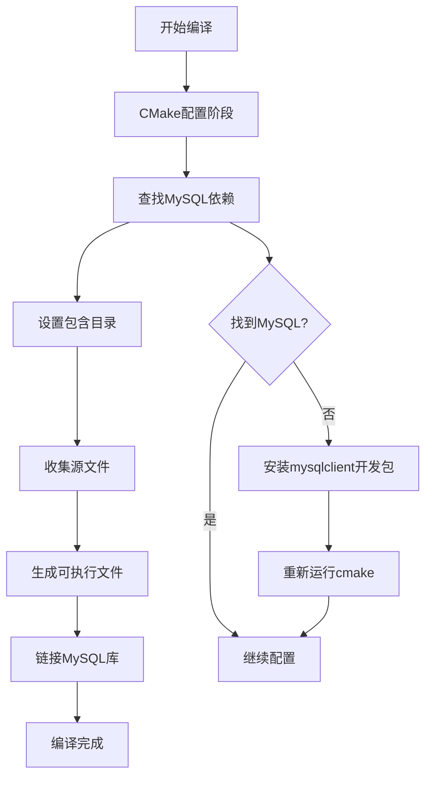
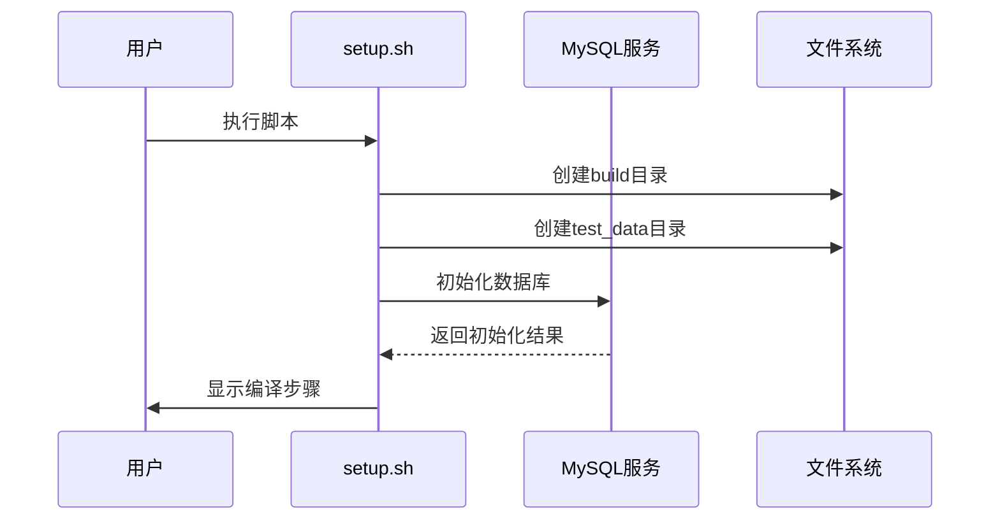
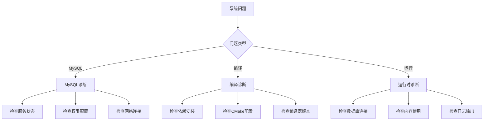

# 快速开始

<cite>
**本文档引用的文件**
- [README.md](file://README.md)
- [setup.sh](file://setup.sh)
- [CMakeLists.txt](file://CMakeLists.txt)
- [init.sql](file://init.sql)
- [src/main.cpp](file://src/main.cpp)
- [src/db_manager.cpp](file://src/db_manager.cpp)
- [include/db_manager.h](file://include/db_manager.h)
- [src/view_manager.cpp](file://src/view_manager.cpp)
- [include/view_manager.h](file://include/view_manager.h)
- [include/admin_view.h](file://include/admin_view.h)
- [include/user_view.h](file://include/user_view.h)
- [History/OJ_v0.1.md](file://History/OJ_v0.1.md)
</cite>

## 目录
1. [简介](#简介)
2. [系统要求](#系统要求)
3. [环境搭建步骤](#环境搭建步骤)
4. [一键部署流程](#一键部署流程)
5. [数据库初始化](#数据库初始化)
6. [编译和运行](#编译和运行)
7. [setup.sh 脚本详解](#setupsh-脚本详解)
8. [CMakeLists.txt 配置解析](#cmakelistsxt-配置解析)
9. [验证安装](#验证安装)
10. [常见问题排查](#常见问题排查)
11. [故障排除指南](#故障排除指南)
12. [总结](#总结)

## 简介

OJ在线判题系统是一个基于C++开发的命令行交互式评测平台。该系统提供了管理员和用户两种角色，支持题目管理、用户认证、代码提交和自动评测等功能。系统采用MySQL作为数据存储，通过CMake进行构建管理。

## 系统要求

### 硬件要求
- CPU: 至少1 GHz处理器
- 内存: 至少512 MB RAM
- 磁盘空间: 至少1 GB可用空间

### 软件依赖

#### 必需组件
- **MySQL 5.7+**: 数据库管理系统
- **CMake 3.10+**: 构建系统
- **pkg-config**: 包配置工具
- **GCC/G++**: C++编译器 (C++17标准)

#### 可选组件
- **MySQL客户端开发包**: mysqlclient
- **Git**: 版本控制系统

### 操作系统支持
- Linux (推荐 Ubuntu 18.04+)
- macOS
- Windows (WSL2)

## 环境搭建步骤

### 第一步：系统依赖安装

#### Ubuntu/Debian系统
```bash
# 更新包管理器
sudo apt update

# 安装MySQL服务器和客户端
sudo apt install mysql-server mysql-client

# 安装开发工具和依赖
sudo apt install build-essential cmake pkg-config libmysqlclient-dev git

# 验证安装
mysql --version
cmake --version
```

#### CentOS/RHEL/Fedora系统
```bash
# 安装MySQL (CentOS 7)
sudo yum install mysql-server mysql-devel
sudo systemctl start mysqld
sudo systemctl enable mysqld

# 安装开发工具
sudo yum groupinstall "Development Tools"
sudo yum install cmake pkgconfig mysql-devel git

# Fedora系统
sudo dnf install mysql-server mysql-devel cmake pkgconfig gcc-c++ git
```

#### macOS系统
```bash
# 使用Homebrew安装
brew install mysql cmake pkg-config

# 启动MySQL服务
brew services start mysql
```

### 第二步：验证MySQL服务

```bash
# 检查MySQL服务状态
sudo systemctl status mysql

# 验证MySQL安装
mysql --version

# 测试连接
mysql -u root -p
```

**章节来源**
- [setup.sh:14-29](file://setup.sh#L14-L29)
- [CMakeLists.txt:11-13](file://CMakeLists.txt#L11-L13)

## 一键部署流程

### 自动化部署优势

OJ系统提供了一键部署脚本 `setup.sh`，它能够自动完成以下任务：
- 创建项目所需的目录结构
- 初始化数据库环境
- 配置数据库用户和权限
- 提供后续编译指导

### 部署执行步骤

```bash
# 1. 给脚本添加执行权限
chmod +x setup.sh

# 2. 执行一键部署脚本
./setup.sh

# 3. 按照提示输入MySQL root密码
# 4. 等待脚本自动完成所有初始化工作
```

### 部署过程监控

一键部署过程中，脚本会提供详细的进度反馈：

```bash
# 📂 正在创建项目目录...
# ✅ 已创建 build/ 和 test_data/ 目录。

# 🗄️  正在初始化 MySQL 数据库 (需要 root 权限)...
# 请输入您的 MySQL root 密码来执行初始化脚本:
# ✅ 数据库及用户初始化成功！

# 🚀 环境准备就绪！
# 您可以按照以下步骤进行编译运行:
# ----------------------------------------
#   cd build
#   cmake ..
#   make
#   ./oj_app
# ----------------------------------------
```

**章节来源**
- [setup.sh:1-41](file://setup.sh#L1-L41)

## 数据库初始化

### 使用一键脚本初始化

```bash
# 执行一键部署脚本
./setup.sh

# 或者直接执行数据库初始化
echo "请输入MySQL root密码:" 
mysql -u root -p < init.sql
```

### 手动初始化步骤

```bash
# 1. 创建必要的目录结构
mkdir -p build
mkdir -p test_data/1

# 2. 初始化数据库
mysql -u root -p < init.sql

# 3. 验证数据库创建
mysql -u root -p -e "SHOW DATABASES LIKE 'OJ';"
```

### 数据库结构说明

系统创建以下数据库对象：

#### 数据库: `OJ`
- 字符集: utf8mb4
- 排序规则: utf8mb4_unicode_ci

#### 表结构

| 表名 | 描述 | 主要字段 |
|------|------|----------|
| `problems` | 题目表 | id, title, description, time_limit, memory_limit |
| `users` | 平台用户表 | id, account, password_hash, submission_count |
| `submissions` | 提交记录表 | id, user_id, problem_id, status, submit_time |

#### 用户权限配置

| 用户名 | 权限范围 | 访问限制 |
|--------|----------|----------|
| `oj_admin` | 全部权限 | localhost |
| `oj_user` | 受限权限 | % (任意主机) |

**章节来源**
- [init.sql:8-96](file://init.sql#L8-L96)
- [setup.sh:17-29](file://setup.sh#L17-L29)

## 编译和运行

### 标准编译流程

```bash
# 1. 进入build目录
cd build

# 2. 配置构建 (CMake)
cmake ..

# 3. 编译项目
make

# 4. 运行应用程序
./oj_app
```

### CMake构建选项

#### 关键配置参数

| 参数 | 默认值 | 说明 |
|------|--------|------|
| `CMAKE_CXX_STANDARD` | 17 | C++标准版本 |
| `CMAKE_EXPORT_COMPILE_COMMANDS` | ON | 生成编译数据库 |
| `MYSQL_INCLUDE_DIRS` | 自动检测 | MySQL头文件路径 |
| `MYSQL_LIBRARIES` | 自动检测 | MySQL库文件路径 |

### 编译过程详解



**图表来源**
- [CMakeLists.txt:11-31](file://CMakeLists.txt#L11-L31)

**章节来源**
- [CMakeLists.txt:1-36](file://CMakeLists.txt#L1-L36)
- [setup.sh:36-39](file://setup.sh#L36-L39)

## setup.sh 脚本详解

### 脚本功能概述

`setup.sh` 是一个一键部署脚本，提供以下功能：

1. **目录创建**: 自动创建项目所需的目录结构
2. **数据库初始化**: 执行SQL脚本创建数据库和用户
3. **编译指导**: 提供后续编译运行的步骤说明

### 脚本执行流程



**图表来源**
- [setup.sh:8-39](file://setup.sh#L8-L39)

### 脚本详细分析

#### 目录创建部分
- 创建 `build/` 目录用于存放编译产物
- 创建 `test_data/1` 目录用于存放测试数据

#### 数据库初始化部分
- 检查 `init.sql` 文件是否存在
- 使用root权限执行SQL脚本
- 验证初始化结果并处理错误

#### 编译指导部分
- 提供标准的CMake编译流程
- 显示预期的输出结果

**章节来源**
- [setup.sh:1-41](file://setup.sh#L1-L41)

## CMakeLists.txt 配置解析

### 项目配置

#### 基础设置
- **C++标准**: C++17 (支持现代C++特性)
- **编译命令导出**: 自动生成 `compile_commands.json` 用于IDE集成

#### 依赖管理


**图表来源**
- [CMakeLists.txt:11-31](file://CMakeLists.txt#L11-L31)

### 关键配置项

| 配置项 | 值 | 说明 |
|--------|----|------|
| `CMAKE_CXX_STANDARD` | 17 | 使用C++17标准 |
| `CMAKE_EXPORT_COMPILE_COMMANDS` | ON | 生成编译数据库 |
| `find_package(PkgConfig)` | REQUIRED | 启用pkg-config |
| `pkg_check_modules(MYSQL)` | mysqlclient REQUIRED | 检测MySQL客户端 |

### 源文件管理

脚本会自动收集 `src/` 目录下的所有 `.cpp` 文件作为源代码，并生成名为 `oj_app` 的可执行文件。

**章节来源**
- [CMakeLists.txt:1-36](file://CMakeLists.txt#L1-L36)

## 验证安装

### 安装成功检查清单

#### 基础验证
- [ ] MySQL服务正常运行
- [ ] 数据库 `OJ` 创建成功
- [ ] 用户 `oj_admin` 和 `oj_user` 创建成功
- [ ] CMake配置无错误
- [ ] 可执行文件 `oj_app` 生成成功

#### 功能验证
- [ ] 数据库连接测试
- [ ] 基本查询功能
- [ ] 用户登录功能
- [ ] 管理员权限验证

### 数据库连接测试

```bash
# 测试数据库连接
mysql -u oj_admin -p -e "SELECT VERSION();"

# 测试用户权限
mysql -u oj_user -p -e "SELECT * FROM OJ.problems LIMIT 1;"
```

### 应用程序启动测试

```bash
# 启动应用程序
./oj_app

# 预期输出
# ========================================
#        🚀 OJ 在线判题系统 - 登录
# ========================================
#  1. 管理员进入
#  2. 用户进入
#  0. 退出系统
# ========================================
```

**章节来源**
- [src/main.cpp:3-11](file://src/main.cpp#L3-L11)
- [src/view_manager.cpp:17-26](file://src/view_manager.cpp#L17-L26)

## 常见问题排查

### MySQL相关问题

#### 问题1: MySQL服务无法启动
**症状**: `sudo systemctl status mysql` 显示服务停止
**解决方案**:
```bash
# 检查MySQL错误日志
sudo tail -f /var/log/mysql/error.log

# 重启MySQL服务
sudo systemctl restart mysql

# 检查端口占用
sudo netstat -tlnp | grep 3306
```

#### 问题2: 权限不足错误
**症状**: `ERROR 1045 (28000): Access denied for user 'root'@'localhost'`
**解决方案**:
```bash
# 重置MySQL root密码
sudo mysql_secure_installation

# 或者使用跳过权限表
sudo mysqld_safe --skip-grant-tables
```

#### 问题3: 数据库初始化失败
**症状**: `ERROR 1396 (HY000): Operation CREATE USER failed`
**解决方案**:
```bash
# 检查MySQL版本兼容性
mysql --version

# 修改init.sql中的语法以适配版本
# 参考: https://dev.mysql.com/doc/refman/8.0/en/create-user.html
```

### CMake相关问题

#### 问题4: 找不到MySQL库
**症状**: `Could not find a package configuration file for mysqlclient`
**解决方案**:
```bash
# Ubuntu/Debian
sudo apt install libmysqlclient-dev

# CentOS/RHEL
sudo yum install mysql-devel

# Fedora
sudo dnf install mysql-devel

# macOS
brew install mysql
```

#### 问题5: CMake版本过低
**症状**: `CMake Error at CMakeLists.txt:1: CMake minimum required version`
**解决方案**:
```bash
# 升级CMake
# Ubuntu
sudo apt remove cmake
sudo apt install cmake

# 或者从官网下载最新版本
wget https://github.com/Kitware/CMake/releases/download/v3.21.0/cmake-3.21.0-linux-x86_64.tar.gz
```

### 编译相关问题

#### 问题6: 编译失败
**症状**: `fatal error: mysql/mysql.h: No such file or directory`
**解决方案**:
```bash
# 确保MySQL开发包已安装
# Ubuntu: sudo apt install libmysqlclient-dev
# CentOS: sudo yum install mysql-devel
# macOS: brew install mysql

# 检查包含路径
find /usr -name "mysql.h" 2>/dev/null
```

#### 问题7: 链接错误
**症状**: `undefined reference to mysql_init`
**解决方案**:
```bash
# 检查链接库
ldd oj_app | grep mysql

# 手动指定库路径
export LD_LIBRARY_PATH=/usr/lib/x86_64-linux-gnu:$LD_LIBRARY_PATH
```

### 运行时问题

#### 问题8: 应用程序崩溃
**症状**: `Segmentation fault (core dumped)`
**解决方案**:
```bash
# 使用GDB调试
gdb ./oj_app
(gdb) run
(gdb) bt

# 检查内存泄漏
valgrind --leak-check=full ./oj_app
```

#### 问题9: 数据库连接超时
**症状**: `Can't connect to local MySQL server`
**解决方案**:
```bash
# 检查MySQL服务状态
sudo systemctl status mysqld

# 检查socket文件
ls -la /var/run/mysqld/mysock

# 重启MySQL服务
sudo systemctl restart mysqld
```

## 故障排除指南

### 系统诊断流程



### 诊断工具

#### MySQL诊断
```bash
# 检查MySQL状态
sudo systemctl status mysql

# 检查数据库连接
mysqladmin -u root ping

# 检查用户权限
mysql -u root -e "SELECT User, Host FROM mysql.user;"
```

#### 系统资源监控
```bash
# 检查磁盘空间
df -h

# 检查内存使用
free -h

# 检查进程状态
ps aux | grep mysql
ps aux | grep oj_app
```

#### 日志分析
```bash
# MySQL错误日志
sudo tail -f /var/log/mysql/error.log

# 系统日志
sudo journalctl -u mysql.service

# 应用程序日志
./oj_app 2>&1 | tee app.log
```

### 性能优化建议

#### MySQL优化
- 调整 `innodb_buffer_pool_size` 参数
- 优化查询索引设计
- 监控慢查询日志

#### 应用程序优化
- 使用连接池管理数据库连接
- 实现缓存机制
- 优化SQL查询性能

**章节来源**
- [src/db_manager.cpp:105-124](file://src/db_manager.cpp#L105-L124)
- [src/view_manager.cpp:28-66](file://src/view_manager.cpp#L28-L66)

## 总结

通过以上步骤，您应该能够成功搭建并运行OJ在线判题系统。整个过程主要包括：

1. **环境准备**: 安装必要的系统依赖和MySQL数据库
2. **一键部署**: 使用 `setup.sh` 脚本自动完成目录创建和数据库初始化
3. **编译构建**: 使用CMake配置和编译项目
4. **功能验证**: 通过多种方式验证系统的正确性

### 后续步骤

- 配置测试数据目录
- 添加更多题目和用户
- 部署到生产环境
- 实现自动化测试

### 技术支持

如果遇到技术问题，可以参考：
- 项目文档和注释
- GitHub Issues页面
- 相关技术论坛和社区

### 一键部署优势

使用 `setup.sh` 脚本的主要优势：
- **简化流程**: 一键完成所有初始化步骤
- **错误处理**: 提供详细的错误反馈和解决方案
- **用户友好**: 清晰的进度指示和操作指导
- **自动化**: 减少手动操作，降低出错概率

祝您使用愉快！