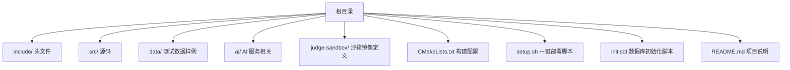
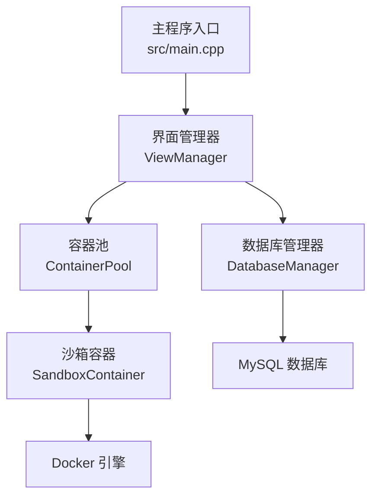
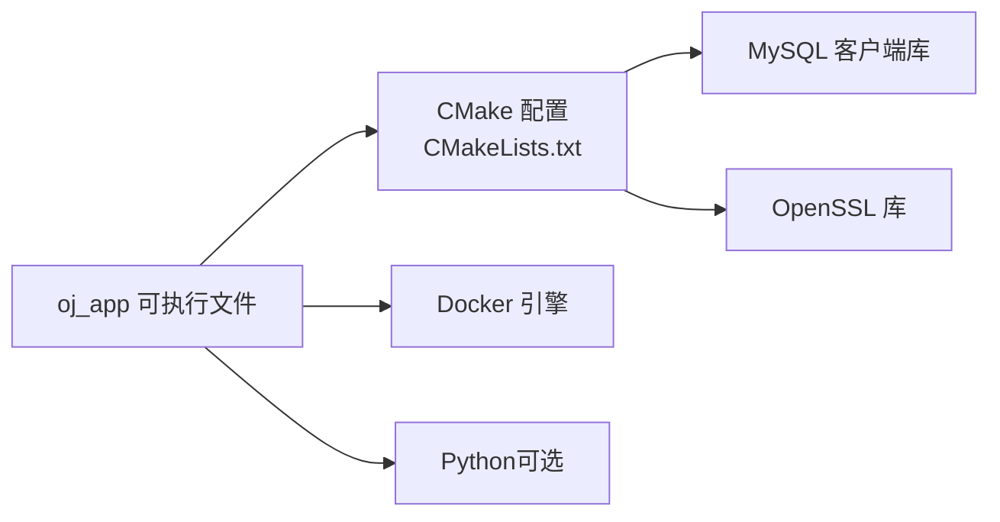
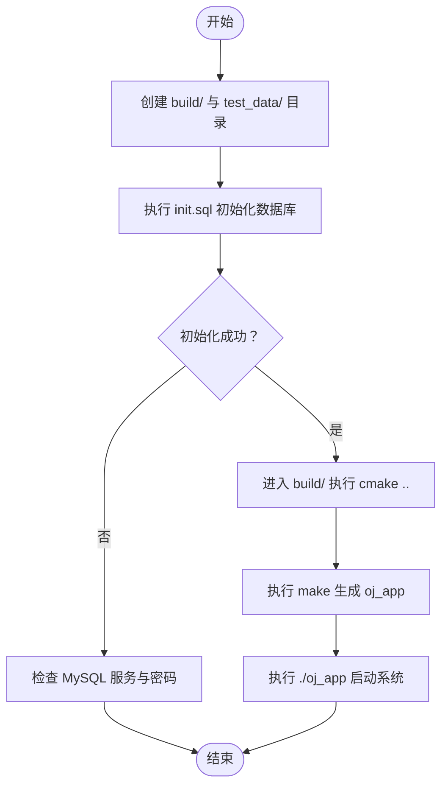
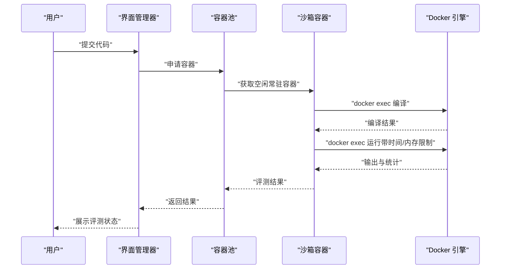

# 快速开始

<cite>
**本文引用的文件**
- [README.md](file://README.md)
- [setup.sh](file://setup.sh)
- [init.sql](file://init.sql)
- [CMakeLists.txt](file://CMakeLists.txt)
- [ai/requirements.txt](file://ai/requirements.txt)
- [include/db_manager.h](file://include/db_manager.h)
- [src/db_manager.cpp](file://src/db_manager.cpp)
- [include/docker_manager.h](file://include/docker_manager.h)
- [include/sandbox_container.h](file://include/sandbox_container.h)
- [src/sandbox_container.cpp](file://src/sandbox_container.cpp)
- [include/container_pool.h](file://include/container_pool.h)
- [src/container_pool.cpp](file://src/container_pool.cpp)
- [include/ai_client.h](file://include/ai_client.h)
- [src/ai_client.cpp](file://src/ai_client.cpp)
- [src/main.cpp](file://src/main.cpp)
- [judge-sandbox/Dockerfile](file://judge-sandbox/Dockerfile)
</cite>

## 目录
1. [简介](#简介)
2. [项目结构](#项目结构)
3. [核心组件](#核心组件)
4. [架构总览](#架构总览)
5. [详细组件分析](#详细组件分析)
6. [依赖分析](#依赖分析)
7. [性能考虑](#性能考虑)
8. [故障排查指南](#故障排查指南)
9. [结论](#结论)
10. [附录](#附录)

## 简介
本指南面向首次接触 OJ 在线评测系统的新用户，帮助你在最短时间内完成环境准备、安装部署、配置与首次运行验证。系统主要包含以下能力：
- 评测沙箱：基于 Docker 的安全容器评测，支持时间、内存限制与多组测试数据比对。
- 数据持久化：使用 MySQL 存储题目、用户与提交记录。
- 可视化交互：基于命令行的菜单式界面，支持管理员与普通用户两种角色。
- AI 辅助：可选的 AI 服务集成，用于代码与题目上下文问答。

## 项目结构
项目采用“头文件在 include、源码在 src、工具脚本在根目录”的组织方式，配合 CMake 构建系统与一键部署脚本，便于快速编译与运行。

图表来源
- [CMakeLists.txt:1-40](file://CMakeLists.txt#L1-L40)
- [setup.sh:1-41](file://setup.sh#L1-L41)
- [init.sql:1-278](file://init.sql#L1-L278)

章节来源
- [CMakeLists.txt:1-40](file://CMakeLists.txt#L1-L40)
- [setup.sh:1-41](file://setup.sh#L1-L41)
- [init.sql:1-278](file://init.sql#L1-L278)

## 核心组件
- 数据库管理：负责数据库连接、SQL 执行与查询结果解析，提供转义接口防止注入。
- Docker 管理：聚合沙箱容器与容器池，提供生命周期管理与调度。
- 沙箱容器：封装单个 Docker 容器的启动、编译、运行与清理，支持时间/内存限制。
- 容器池：维护常驻与临时容器，实现预热、调度与健康检查。
- AI 客户端：封装 Python AI 服务调用，支持消息、代码与题目上下文传递。
- 主程序入口：启动界面与登录菜单，按角色加载对应功能。

章节来源
- [include/db_manager.h:1-60](file://include/db_manager.h#L1-L60)
- [src/db_manager.cpp:1-110](file://src/db_manager.cpp#L1-L110)
- [include/docker_manager.h:1-18](file://include/docker_manager.h#L1-L18)
- [include/sandbox_container.h:1-122](file://include/sandbox_container.h#L1-L122)
- [src/sandbox_container.cpp:1-194](file://src/sandbox_container.cpp#L1-L194)
- [include/container_pool.h:1-85](file://include/container_pool.h#L1-L85)
- [src/container_pool.cpp:1-156](file://src/container_pool.cpp#L1-L156)
- [include/ai_client.h:1-28](file://include/ai_client.h#L1-L28)
- [src/ai_client.cpp:1-124](file://src/ai_client.cpp#L1-L124)
- [src/main.cpp:1-14](file://src/main.cpp#L1-L14)

## 架构总览
系统采用“界面层 → 业务层 → 评测沙箱 → 数据库”的分层结构。界面层通过菜单驱动业务层，业务层协调容器池与沙箱容器进行评测，同时通过数据库管理器持久化数据。

图表来源
- [src/main.cpp:1-14](file://src/main.cpp#L1-L14)
- [include/db_manager.h:1-60](file://include/db_manager.h#L1-L60)
- [src/db_manager.cpp:1-110](file://src/db_manager.cpp#L1-L110)
- [include/container_pool.h:1-85](file://include/container_pool.h#L1-L85)
- [src/container_pool.cpp:1-156](file://src/container_pool.cpp#L1-L156)
- [include/sandbox_container.h:1-122](file://include/sandbox_container.h#L1-L122)
- [src/sandbox_container.cpp:1-194](file://src/sandbox_container.cpp#L1-L194)

## 详细组件分析

### 环境要求与前置依赖
- C++17 编译器与构建工具链：CMake 3.10+、g++（支持 C++17）、make。
- MySQL：用于存储题目、用户与提交记录。
- Docker 引擎：用于创建与管理评测沙箱容器。
- 可选：AI 服务 Python 环境与依赖包（见附录）。

章节来源
- [CMakeLists.txt:1-40](file://CMakeLists.txt#L1-L40)
- [setup.sh:14-29](file://setup.sh#L14-L29)
- [ai/requirements.txt:1-7](file://ai/requirements.txt#L1-L7)

### 安装步骤
1) 准备系统环境
- 安装 CMake 3.10+、g++（C++17 支持）、make。
- 安装 MySQL 并确保服务可用。
- 安装 Docker 引擎并确保可执行 docker 命令。
- 可选：准备 Python 与虚拟环境，安装 AI 依赖（见附录）。

2) 初始化数据库
- 使用一键脚本初始化数据库与用户权限：
  - 执行：bash setup.sh
  - 输入 MySQL root 密码以执行 init.sql
  - 成功后输出“数据库及用户初始化成功！”
- 若 init.sql 不存在或执行失败，请检查文件与权限。

3) 编译构建
- 进入 build 目录，执行：
  - cmake ..
  - make
- 构建成功后生成可执行文件 oj_app。

4) 首次运行
- 在 build 目录执行：./oj_app
- 在登录菜单中选择角色（管理员/普通用户），随后进入相应功能。

章节来源
- [setup.sh:1-41](file://setup.sh#L1-L41)
- [init.sql:1-278](file://init.sql#L1-L278)
- [CMakeLists.txt:1-40](file://CMakeLists.txt#L1-L40)
- [src/main.cpp:1-14](file://src/main.cpp#L1-L14)

### 配置文件与关键参数
- 数据库连接配置
  - 位置：数据库管理器构造参数（主机、用户名、密码、数据库名）
  - 作用：建立与 MySQL 的连接，执行查询与更新
  - 关键点：用户名与权限分离（管理员全权限，平台用户受限）
- Docker 环境配置
  - 位置：沙箱容器启动参数与容器池初始化
  - 作用：创建只读根文件系统、禁网、限制内存与进程数、挂载内存型沙箱目录
  - 关键点：镜像名称默认为 judge-sandbox:latest，可通过容器池初始化传入
- AI 服务配置
  - 位置：AI 客户端构造与脚本路径
  - 作用：调用 Python AI 服务脚本，支持消息、代码与题目上下文
  - 关键点：优先使用 ai/venv/bin/python，若不可用则尝试 ../ai/… 的相对路径

章节来源
- [include/db_manager.h:14-28](file://include/db_manager.h#L14-L28)
- [src/db_manager.cpp:71-89](file://src/db_manager.cpp#L71-L89)
- [include/sandbox_container.h:36-94](file://include/sandbox_container.h#L36-L94)
- [src/sandbox_container.cpp:65-95](file://src/sandbox_container.cpp#L65-L95)
- [include/container_pool.h:33-34](file://include/container_pool.h#L33-L34)
- [include/ai_client.h:8-25](file://include/ai_client.h#L8-L25)
- [src/ai_client.cpp:8-23](file://src/ai_client.cpp#L8-L23)

### 首次运行验证
- 成功启动
  - 执行 ./oj_app 后出现登录菜单，输入账号密码后进入主界面
- 数据库连通性
  - 登录后可查看题目列表与提交历史，确认数据库连接正常
- 评测功能
  - 选择一道样题，提交代码后等待评测结果（AC/WA/TLE/MLE/RE/CE）
  - 观察容器池日志：常驻容器已就绪、临时容器已创建等提示
- AI 功能（可选）
  - 若 AI 服务可用，可在界面中发起提问，收到非空响应

章节来源
- [src/main.cpp:5-13](file://src/main.cpp#L5-L13)
- [src/container_pool.cpp:46-48](file://src/container_pool.cpp#L46-L48)
- [src/container_pool.cpp:87-89](file://src/container_pool.cpp#L87-L89)
- [src/ai_client.cpp:103-112](file://src/ai_client.cpp#L103-L112)

### 常见问题与解决方案
- MySQL 初始化失败
  - 现象：提示“数据库初始化失败，请检查密码或 MySQL 服务状态”
  - 处理：确认 MySQL 服务已启动，使用正确 root 密码执行脚本
- 数据库用户权限不足
  - 现象：应用连接数据库报错
  - 处理：确认平台用户权限（oj_user）具备对 users/submissions 的 SELECT/INSERT 权限
- Docker 权限不足
  - 现象：沙箱容器启动失败
  - 处理：将当前用户加入 docker 组，或使用 sudo 运行
- 编译失败
  - 现象：make 报错
  - 处理：确认 g++ 支持 C++17，检查 MySQL 开发库与 OpenSSL 是否安装
- AI 服务不可用
  - 现象：ask 返回空响应或错误提示
  - 处理：检查 Python 虚拟环境与脚本路径，确保依赖已安装

章节来源
- [setup.sh:22-25](file://setup.sh#L22-L25)
- [init.sql:71-95](file://init.sql#L71-L95)
- [src/sandbox_container.cpp:82-84](file://src/sandbox_container.cpp#L82-L84)
- [CMakeLists.txt:11-34](file://CMakeLists.txt#L11-L34)
- [src/ai_client.cpp:114-123](file://src/ai_client.cpp#L114-L123)

## 依赖分析
系统对外部依赖的使用如下：
- CMake：查找并链接 MySQL 客户端与 OpenSSL
- MySQL：提供数据库连接与权限模型
- Docker：提供沙箱容器运行环境
- Python（可选）：提供 AI 服务

图表来源
- [CMakeLists.txt:11-34](file://CMakeLists.txt#L11-L34)
- [src/sandbox_container.cpp:36-38](file://src/sandbox_container.cpp#L36-L38)
- [src/ai_client.cpp:56-83](file://src/ai_client.cpp#L56-L83)

章节来源
- [CMakeLists.txt:11-34](file://CMakeLists.txt#L11-L34)

## 性能考虑
- 容器池预热：启动时创建常驻容器，减少评测首开延迟
- 评测隔离：容器只读根文件系统、禁网、限制内存与进程数，避免相互影响
- 资源统计：使用 /usr/bin/time 获取实际耗时与峰值内存，确保公平评测
- 并发控制：通过 max_size 控制最大并发容器数，避免资源耗尽

章节来源
- [include/container_pool.h:13-18](file://include/container_pool.h#L13-L18)
- [src/container_pool.cpp:30-50](file://src/container_pool.cpp#L30-L50)
- [include/sandbox_container.h:72-77](file://include/sandbox_container.h#L72-L77)
- [src/sandbox_container.cpp:144-149](file://src/sandbox_container.cpp#L144-L149)

## 故障排查指南
- 数据库
  - 检查 init.sql 是否成功执行，确认数据库与用户存在
  - 核对数据库连接参数（主机、用户名、密码、数据库名）
- Docker
  - 检查 docker 命令是否可用，确认镜像 judge-sandbox:latest 已构建
  - 查看容器启动输出，定位权限与资源限制问题
- 构建
  - 确认 g++ 支持 C++17，MySQL 开发库与 OpenSSL 安装完整
- AI
  - 确认 Python 虚拟环境与脚本路径存在，依赖已安装

章节来源
- [init.sql:8-95](file://init.sql#L8-L95)
- [src/sandbox_container.cpp:65-95](file://src/sandbox_container.cpp#L65-L95)
- [CMakeLists.txt:11-34](file://CMakeLists.txt#L11-L34)
- [src/ai_client.cpp:14-23](file://src/ai_client.cpp#L14-L23)

## 结论
通过本快速开始指南，你已完成环境准备、数据库初始化、系统编译与首次运行验证。建议在掌握基础操作后，进一步学习容器镜像构建、数据库表结构与 AI 服务集成细节，以满足更复杂的评测场景。

## 附录

### A. 一键部署与初始化流程

图表来源
- [setup.sh:8-41](file://setup.sh#L8-L41)
- [init.sql:17-29](file://init.sql#L17-L29)

章节来源
- [setup.sh:1-41](file://setup.sh#L1-L41)
- [init.sql:1-278](file://init.sql#L1-L278)

### B. 评测流程时序

图表来源
- [include/container_pool.h:47-48](file://include/container_pool.h#L47-L48)
- [src/container_pool.cpp:56-91](file://src/container_pool.cpp#L56-L91)
- [include/sandbox_container.h:72-77](file://include/sandbox_container.h#L72-L77)
- [src/sandbox_container.cpp:133-184](file://src/sandbox_container.cpp#L133-L184)

### C. 数据库初始化要点
- 创建数据库 OJ 与字符集设置
- 创建题目、用户、提交记录三张表
- 创建数据库用户 oj_admin（全权限）与 oj_user（受限权限）
- 插入示例题目与示例用户

章节来源
- [init.sql:8-95](file://init.sql#L8-L95)
- [init.sql:97-267](file://init.sql#L97-L267)

### D. AI 服务依赖清单
- 语言与框架：Python 3.x、LangChain 生态
- 依赖包：dotenv、langchain、langchain-core、langchain-deepseek、langchain-community、langchain-azure
- 建议：在 ai/venv 中安装上述依赖，确保脚本路径与可执行权限

章节来源
- [ai/requirements.txt:1-7](file://ai/requirements.txt#L1-L7)