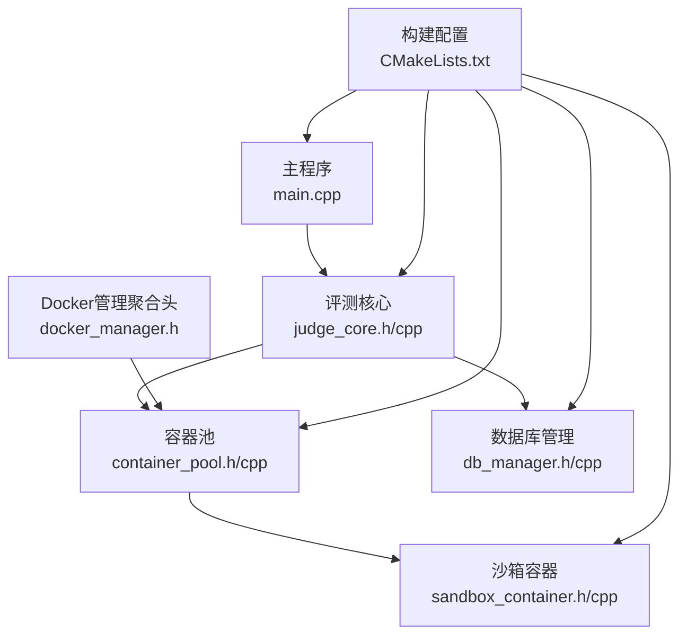
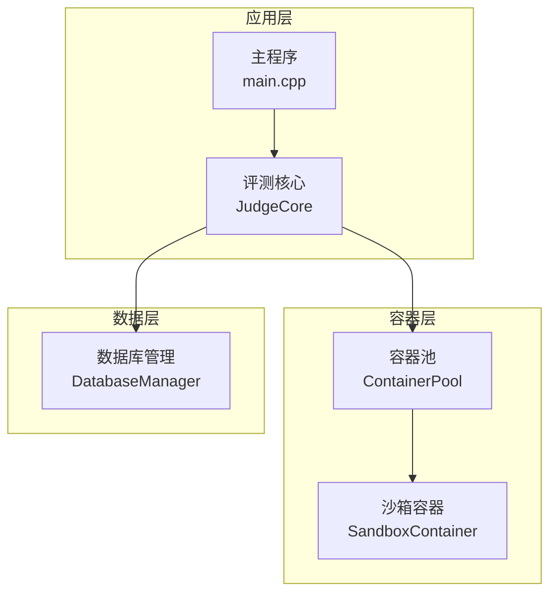
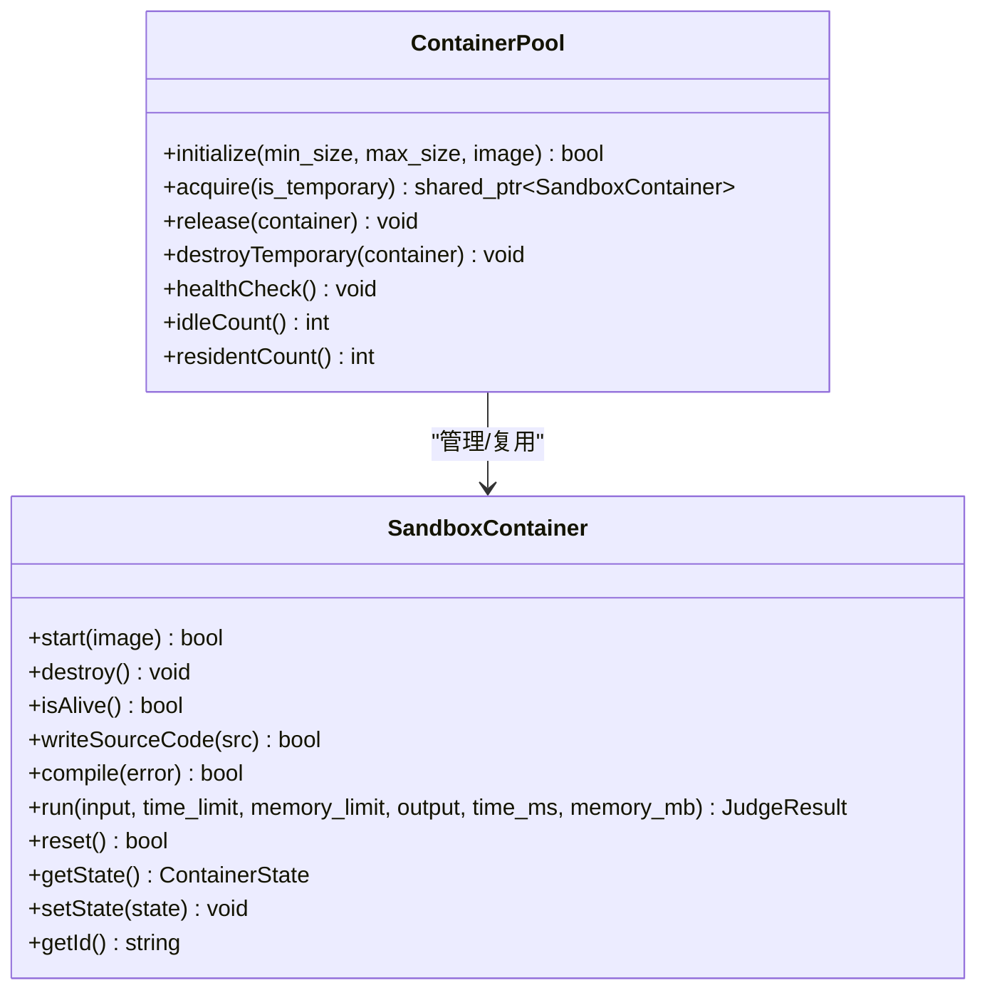
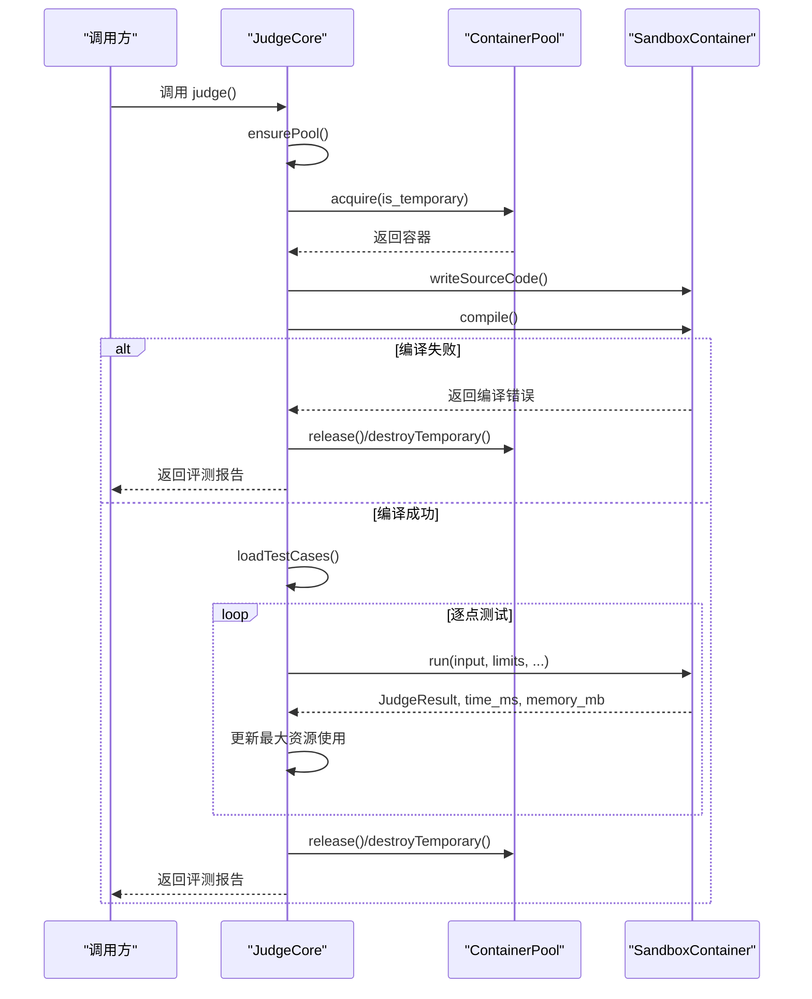
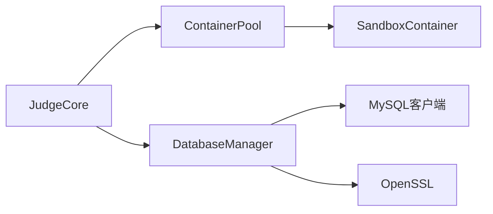

# 性能优化

<cite>
**本文引用的文件**
- [container_pool.cpp](file://src/container_pool.cpp)
- [container_pool.h](file://include/container_pool.h)
- [judge_core.cpp](file://src/judge_core.cpp)
- [judge_core.h](file://include/judge_core.h)
- [sandbox_container.cpp](file://src/sandbox_container.cpp)
- [sandbox_container.h](file://include/sandbox_container.h)
- [db_manager.cpp](file://src/db_manager.cpp)
- [db_manager.h](file://include/db_manager.h)
- [docker_manager.h](file://include/docker_manager.h)
- [CMakeLists.txt](file://CMakeLists.txt)
- [main.cpp](file://src/main.cpp)
- [README.md](file://README.md)
- [docs/judge_implementation_plan.md](file://docs/judge_implementation_plan.md)
- [docs/code_submission_design.md](file://docs/code_submission_design.md)
</cite>

## 目录
1. [简介](#简介)
2. [项目结构](#项目结构)
3. [核心组件](#核心组件)
4. [架构总览](#架构总览)
5. [详细组件分析](#详细组件分析)
6. [依赖分析](#依赖分析)
7. [性能考量与优化策略](#性能考量与优化策略)
8. [性能监控与基准测试](#性能监控与基准测试)
9. [故障排查与调试](#故障排查与调试)
10. [结论](#结论)
11. [附录](#附录)

## 简介
本文件面向OJ在线评测系统的性能优化，围绕容器池并发调度、评测核心瓶颈、数据库查询优化、系统级调优与监控等方面展开。文档结合现有代码实现与设计文档，提出可落地的优化方案与最佳实践，帮助在高并发场景下稳定、高效地完成评测任务。

## 项目结构
项目采用“头文件接口 + 源文件实现”的分层组织，核心模块包括：
- 评测核心：JudgeCore，负责评测流程编排、结果汇总与持久化。
- 容器管理：ContainerPool + SandboxContainer，负责容器生命周期、复用与健康检查。
- 数据库访问：DatabaseManager，封装MySQL连接与查询。
- 构建与依赖：CMakeLists.txt，定义编译标准与链接库。
- 文档与设计：实现方案与代码提交设计文档，提供架构与性能设计指导。

**图表来源**
- [main.cpp:1-14](file://src/main.cpp#L1-L14)
- [judge_core.h:111-189](file://include/judge_core.h#L111-L189)
- [container_pool.h:20-85](file://include/container_pool.h#L20-L85)
- [sandbox_container.h:28-122](file://include/sandbox_container.h#L28-L122)
- [db_manager.h:12-60](file://include/db_manager.h#L12-L60)
- [docker_manager.h:14-17](file://include/docker_manager.h#L14-L17)
- [CMakeLists.txt:1-40](file://CMakeLists.txt#L1-L40)

**章节来源**
- [main.cpp:1-14](file://src/main.cpp#L1-L14)
- [CMakeLists.txt:1-40](file://CMakeLists.txt#L1-L40)
- [README.md:1-2](file://README.md#L1-L2)

## 核心组件
- 容器池 ContainerPool：预创建常驻容器，优先分配空闲容器；达到上限时按需创建临时容器；定期健康检查重建失联容器。
- 沙箱容器 SandboxContainer：封装容器生命周期与评测操作，支持写入源码、编译、运行、清理与状态查询。
- 评测核心 JudgeCore：编排评测流程，惰性初始化容器池，加载测试数据，逐点评测，汇总资源使用并持久化结果。
- 数据库管理 DatabaseManager：封装MySQL连接、查询与转义，提供基本的CRUD能力。

**章节来源**
- [container_pool.h:20-85](file://include/container_pool.h#L20-L85)
- [container_pool.cpp:30-156](file://src/container_pool.cpp#L30-L156)
- [sandbox_container.h:28-122](file://include/sandbox_container.h#L28-L122)
- [sandbox_container.cpp:65-194](file://src/sandbox_container.cpp#L65-L194)
- [judge_core.h:111-189](file://include/judge_core.h#L111-L189)
- [judge_core.cpp:28-264](file://src/judge_core.cpp#L28-L264)
- [db_manager.h:12-60](file://include/db_manager.h#L12-L60)
- [db_manager.cpp:9-110](file://src/db_manager.cpp#L9-L110)

## 架构总览
评测系统采用“C++主程序 + 容器化评测 + 数据库存储”的架构。JudgeCore作为对外接口，内部协调容器池与沙箱容器完成编译与运行；DatabaseManager负责结果持久化；DockerManager聚合容器相关类，便于统一引入。

**图表来源**
- [main.cpp:1-14](file://src/main.cpp#L1-L14)
- [judge_core.h:111-189](file://include/judge_core.h#L111-L189)
- [container_pool.h:20-85](file://include/container_pool.h#L20-L85)
- [sandbox_container.h:28-122](file://include/sandbox_container.h#L28-L122)
- [db_manager.h:12-60](file://include/db_manager.h#L12-L60)

## 详细组件分析

### 容器池管理与并发优化
- 预热策略：启动时预创建min_size个常驻容器，降低首次评测延迟。
- 优先级调度：优先分配空闲常驻容器；常驻满载时按需创建临时容器，避免阻塞。
- 资源上限：max_size限制同时存在的容器总数，防止资源耗尽。
- 健康检查：定期重建失联容器，保障长期稳定性。
- 复用与销毁：常驻容器归还时reset并置空闲；临时容器评测后立即销毁。

**图表来源**
- [container_pool.h:20-85](file://include/container_pool.h#L20-L85)
- [sandbox_container.h:28-122](file://include/sandbox_container.h#L28-L122)

**章节来源**
- [container_pool.cpp:30-156](file://src/container_pool.cpp#L30-L156)
- [container_pool.h:20-85](file://include/container_pool.h#L20-L85)

### 评测核心流程与资源统计
- 惰性初始化：首次评测时初始化容器池。
- 编排步骤：获取容器、写入源码、编译、加载测试数据、逐点运行、汇总结果、归还/销毁容器。
- 资源统计：通过外部命令统计实际耗时与峰值内存，更新评测报告。
- 结果持久化：占位实现，后续对接DatabaseManager。

**图表来源**
- [judge_core.cpp:126-249](file://src/judge_core.cpp#L126-L249)
- [container_pool.cpp:56-91](file://src/container_pool.cpp#L56-L91)
- [sandbox_container.cpp:119-194](file://src/sandbox_container.cpp#L119-L194)

**章节来源**
- [judge_core.cpp:28-264](file://src/judge_core.cpp#L28-L264)
- [judge_core.h:111-189](file://include/judge_core.h#L111-L189)

### 数据库查询与连接管理
- 连接封装：DatabaseManager构造时建立连接，析构时关闭。
- 查询执行：支持查询与执行，返回结果集或布尔状态。
- 转义防护：提供字符串转义，降低SQL注入风险。
- 设计建议：当前实现为轻量封装，后续可引入连接池与查询缓存以提升吞吐。

**章节来源**
- [db_manager.h:12-60](file://include/db_manager.h#L12-L60)
- [db_manager.cpp:9-110](file://src/db_manager.cpp#L9-L110)

### 系统级性能调优要点
- 编译优化：沙箱容器使用编译优化参数，减少评测时编译开销。
- I/O优化：使用只读根文件系统与内存tmpfs，降低磁盘压力。
- 资源限制：容器启动时设置内存、进程数与capabilities，避免资源滥用。
- 并发调度：容器池上限与常驻预热，平衡延迟与资源占用。

**章节来源**
- [sandbox_container.cpp:65-95](file://src/sandbox_container.cpp#L65-L95)
- [container_pool.cpp:30-50](file://src/container_pool.cpp#L30-L50)

## 依赖分析
- JudgeCore依赖ContainerPool与SandboxContainer完成评测编排与执行。
- DatabaseManager为结果持久化提供基础能力。
- DockerManager聚合容器相关类，便于统一引入。
- CMakeLists定义编译标准与链接库，确保MySQL与OpenSSL正确链接。

**图表来源**
- [judge_core.h:111-189](file://include/judge_core.h#L111-L189)
- [container_pool.h:20-85](file://include/container_pool.h#L20-L85)
- [sandbox_container.h:28-122](file://include/sandbox_container.h#L28-L122)
- [db_manager.h:12-60](file://include/db_manager.h#L12-L60)
- [CMakeLists.txt:29-34](file://CMakeLists.txt#L29-L34)

**章节来源**
- [CMakeLists.txt:1-40](file://CMakeLists.txt#L1-L40)
- [docker_manager.h:14-17](file://include/docker_manager.h#L14-L17)

## 性能考量与优化策略

### 容器池并发优化
- 预热与上限：根据并发峰值设定min_size与max_size，避免频繁创建销毁。
- 健康检查：定期重建失联容器，维持池容量稳定。
- 复用优先：优先分配空闲常驻容器，降低容器启动与编译成本。
- 临时容器：在高峰时按需扩容，结束后立即销毁，避免资源泄漏。

**章节来源**
- [container_pool.cpp:30-156](file://src/container_pool.cpp#L30-L156)
- [container_pool.h:20-85](file://include/container_pool.h#L20-L85)

### 评测核心性能瓶颈与优化
- 编译优化：沙箱容器已启用编译优化参数，可进一步考虑缓存编译产物以复用。
- 执行效率：使用外部命令统计资源，建议在容器内集成更精确的cgroup读取以降低宿主机开销。
- 资源使用监控：结合设计文档中的ResourceMonitor，实现更细粒度的资源采样与阈值判断。

**章节来源**
- [sandbox_container.cpp:124-194](file://src/sandbox_container.cpp#L124-L194)
- [docs/judge_implementation_plan.md:312-390](file://docs/judge_implementation_plan.md#L312-L390)

### 数据库查询优化
- 索引优化：为高频查询字段（如submissions.user_id、submissions.problem_id、submissions.submit_time）建立索引。
- 查询缓存：对只读查询（如题目详情、提交统计）引入应用层缓存，降低数据库压力。
- 连接池：引入连接池管理，减少连接建立与断开的开销，提升并发吞吐。

**章节来源**
- [db_manager.cpp:9-110](file://src/db_manager.cpp#L9-L110)
- [docs/judge_implementation_plan.md:442-468](file://docs/judge_implementation_plan.md#L442-L468)

### 系统级调优
- 内存管理：合理设置容器内存上限与tmpfs大小，避免频繁GC与OOM。
- CPU利用率：通过容器CPU配额与周期参数限制，避免单容器过度占用。
- I/O性能：使用只读文件系统与tmpfs，减少磁盘写入；对只读测试数据使用只读挂载。

**章节来源**
- [sandbox_container.cpp:65-95](file://src/sandbox_container.cpp#L65-L95)
- [docs/judge_implementation_plan.md:312-390](file://docs/judge_implementation_plan.md#L312-L390)

## 性能监控与基准测试

### 监控指标
- 容器指标：容器启动时间、活跃容器数、空闲容器数、健康检查频率。
- 评测指标：平均/95分位编译时间、单点测试耗时、内存峰值、超时/超限比例。
- 数据库指标：查询QPS、慢查询、连接池命中率、锁等待。
- 系统指标：CPU使用率、内存使用、磁盘I/O、网络带宽。

**章节来源**
- [judge_core.h:66-102](file://include/judge_core.h#L66-L102)
- [docs/judge_implementation_plan.md:312-390](file://docs/judge_implementation_plan.md#L312-L390)

### 基准测试方法
- 容器启动基准：重复创建/销毁容器若干次，统计平均启动时间与P95。
- 并发评测基准：固定容器数，逐步增加并发请求数，观察吞吐与延迟变化。
- 数据库写入基准：批量写入评测结果，评估QPS与延迟。
- 资源监控基准：对比外部命令与cgroup读取的精度与开销。

**章节来源**
- [docs/judge_implementation_plan.md:641-685](file://docs/judge_implementation_plan.md#L641-L685)

## 故障排查与调试

### 常见问题与定位
- 容器无法启动：检查Docker服务、镜像可用性与安全配置；查看容器池日志。
- 评测卡住：确认容器是否处于BUSY状态且未被归还；检查健康检查是否及时重建。
- 超时/超限：核对容器资源限制与评测配置；检查外部命令统计是否正常。
- 数据库写入失败：检查连接状态、SQL执行与转义；关注慢查询日志。

**章节来源**
- [container_pool.cpp:119-135](file://src/container_pool.cpp#L119-L135)
- [sandbox_container.cpp:97-104](file://src/sandbox_container.cpp#L97-L104)
- [db_manager.cpp:22-109](file://src/db_manager.cpp#L22-L109)

### 调试技巧
- 日志分级：区分info/warn/error，便于快速定位问题。
- 健康检查：定期重建失联容器，避免故障扩散。
- 资源采样：在容器内直接读取cgroup指标，提高精度与性能。
- 压测工具：使用自动化脚本模拟高并发，验证系统稳定性。

**章节来源**
- [container_pool.cpp:119-135](file://src/container_pool.cpp#L119-L135)
- [docs/judge_implementation_plan.md:312-390](file://docs/judge_implementation_plan.md#L312-L390)

## 结论
通过容器池的预热与复用、评测流程的编排优化、数据库的索引与连接池改进以及系统级的资源限制与监控，OJ评测系统能够在高并发场景下保持稳定与高效。建议在现有实现基础上，逐步引入连接池、查询缓存与更精细的资源监控，持续迭代性能指标与基准测试，确保系统在生产环境中持续优化。

## 附录

### 生产环境最佳实践
- 容器池：根据业务峰值设置min/max，开启健康检查与自动重建。
- 评测流程：启用编译缓存、精确资源统计与失败重试。
- 数据库：建立索引、引入连接池与慢查询分析。
- 监控告警：设置关键指标阈值与告警，保障SLA。

**章节来源**
- [docs/judge_implementation_plan.md:641-748](file://docs/judge_implementation_plan.md#L641-L748)