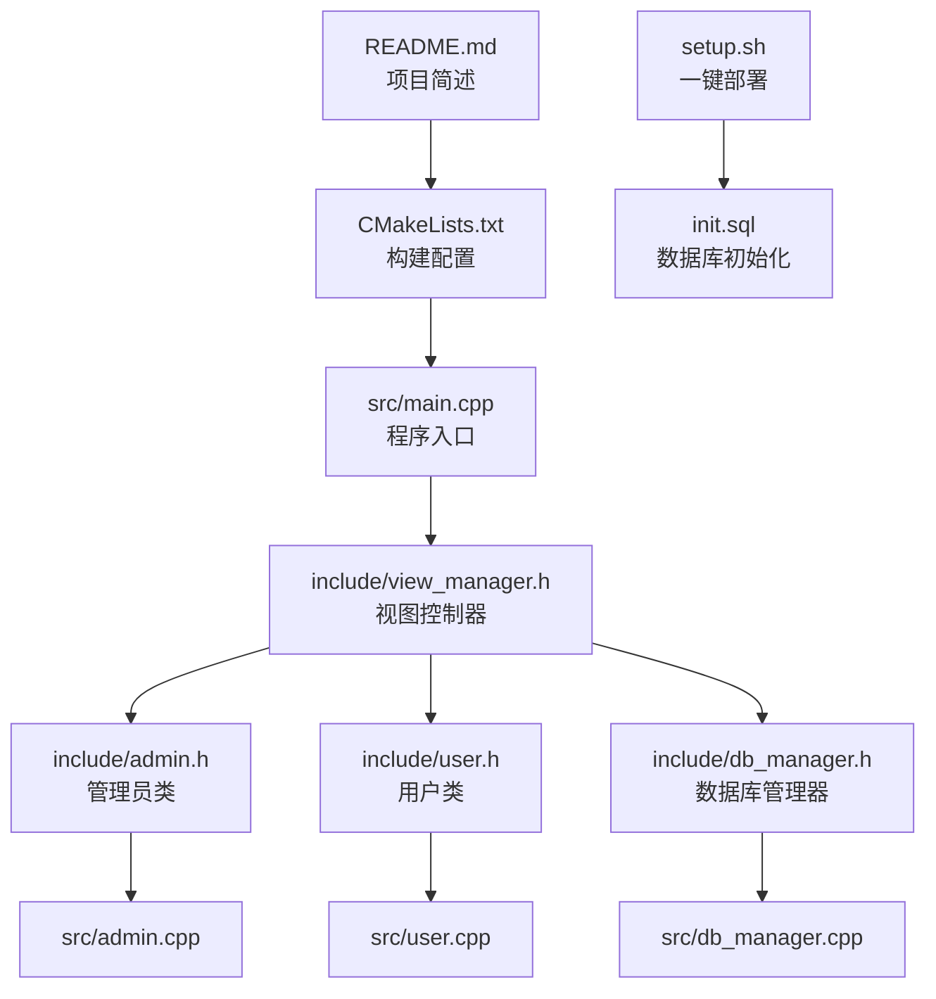
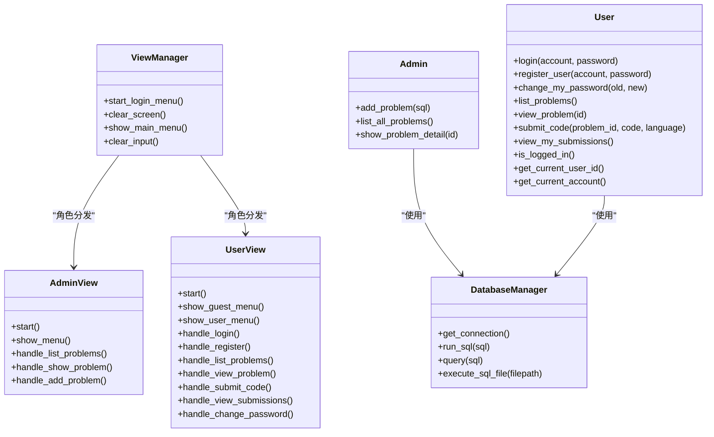
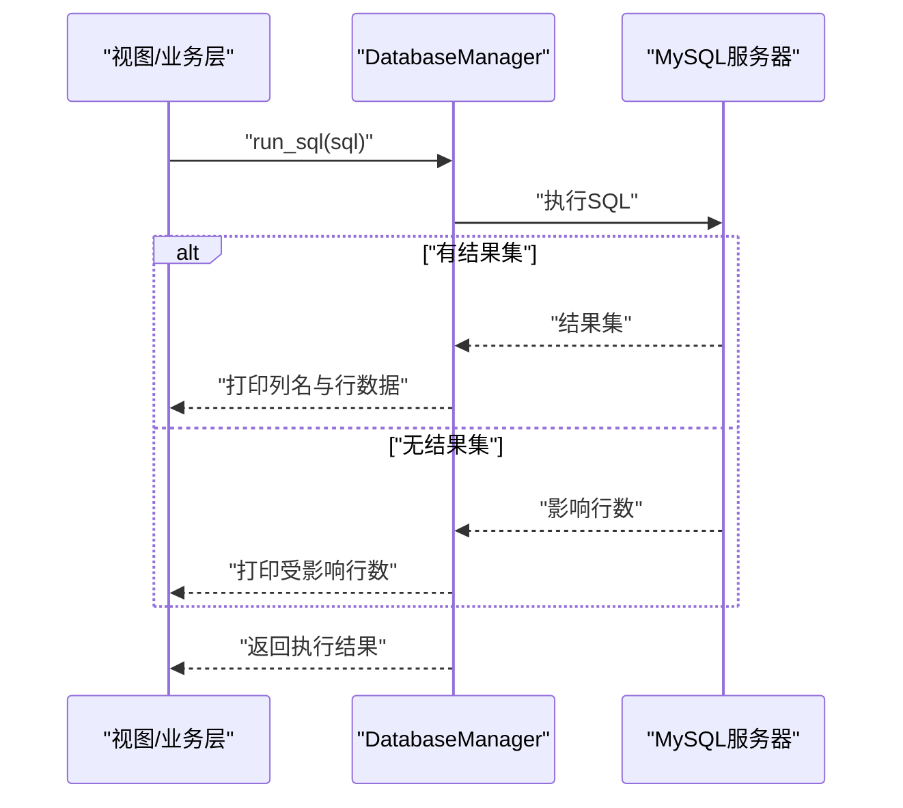
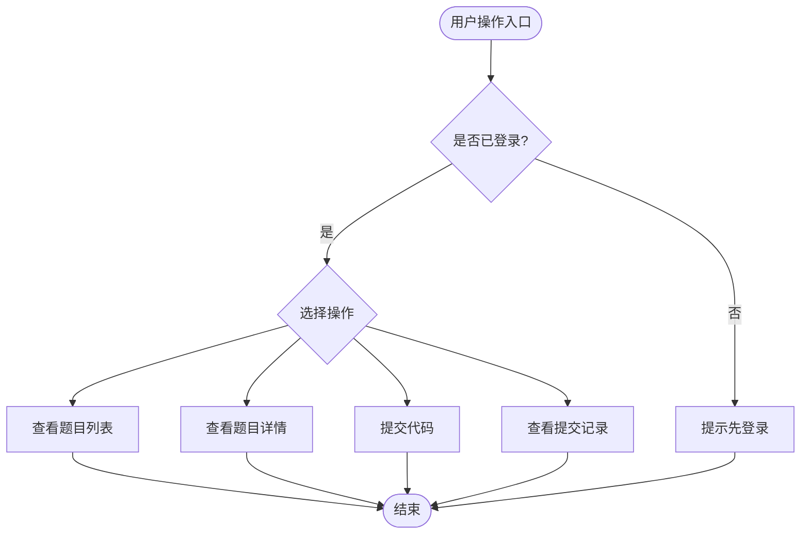
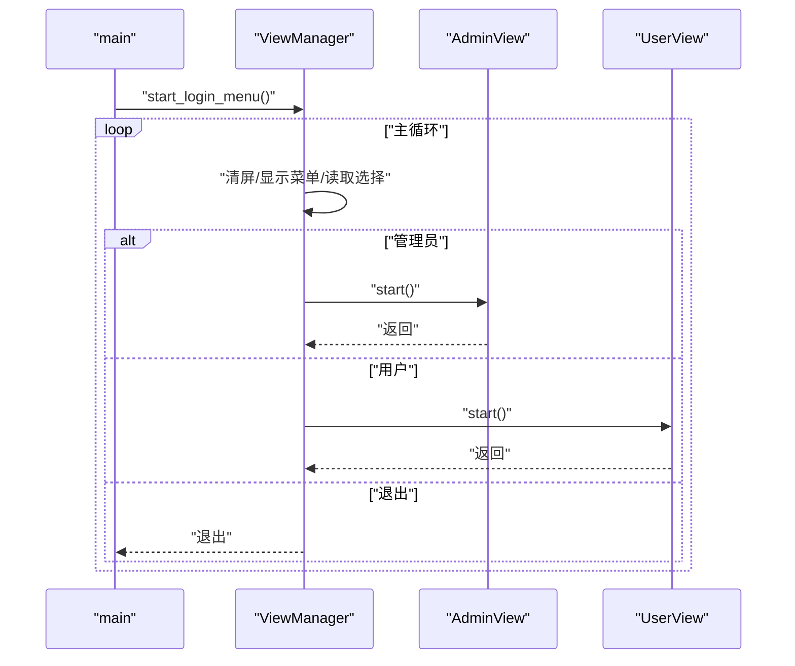
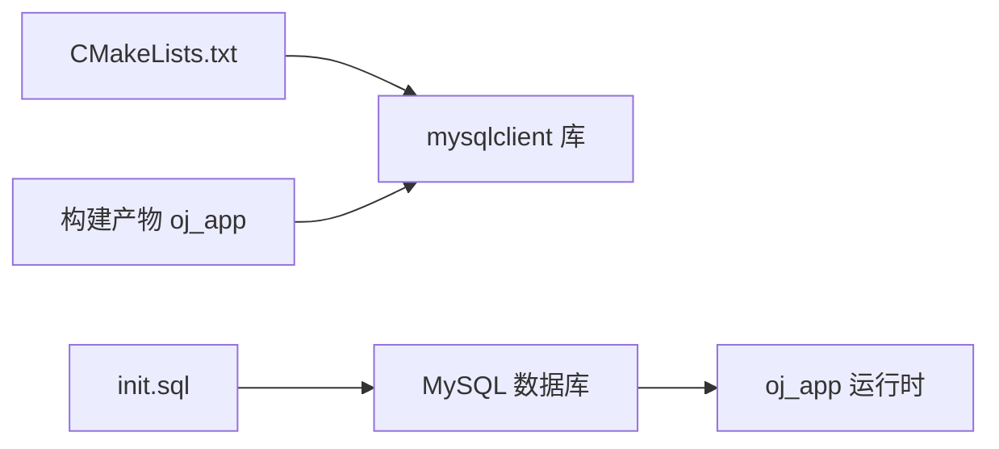

# 故障排除与FAQ

<cite>
**本文引用的文件**
- [README.md](file://README.md)
- [CMakeLists.txt](file://CMakeLists.txt)
- [setup.sh](file://setup.sh)
- [init.sql](file://init.sql)
- [src/main.cpp](file://src/main.cpp)
- [include/db_manager.h](file://include/db_manager.h)
- [src/db_manager.cpp](file://src/db_manager.cpp)
- [include/admin.h](file://include/admin.h)
- [src/admin.cpp](file://src/admin.cpp)
- [include/user.h](file://include/user.h)
- [src/user.cpp](file://src/user.cpp)
- [include/view_manager.h](file://include/view_manager.h)
- [src/view_manager.cpp](file://src/view_manager.cpp)
- [History/OJ_v0.1.md](file://History/OJ_v0.1.md)
</cite>

## 目录
1. [简介](#简介)
2. [项目结构](#项目结构)
3. [核心组件](#核心组件)
4. [架构总览](#架构总览)
5. [详细组件分析](#详细组件分析)
6. [依赖关系分析](#依赖关系分析)
7. [性能考虑](#性能考虑)
8. [故障排除与常见问题](#故障排除与常见问题)
9. [结论](#结论)
10. [附录](#附录)

## 简介
本文件面向技术支持与用户，提供OJ评测系统在安装部署、数据库连接、权限配置、编译构建、运行时问题等方面的故障排除与常见问题解答。内容基于仓库中的构建脚本、初始化SQL、数据库管理器与核心类实现，总结典型错误、诊断方法、修复步骤与预防措施，并给出跨平台与版本兼容性建议。

## 项目结构
- 构建与部署
  - CMake构建配置与依赖查找
  - 一键部署脚本与数据库初始化
- 核心代码
  - 程序入口与视图控制器
  - 数据库管理器封装MySQL客户端
  - 管理员与用户业务类
- 文档与历史
  - 版本与架构说明文档

图表来源
- [CMakeLists.txt:1-36](file://CMakeLists.txt#L1-L36)
- [src/main.cpp:1-12](file://src/main.cpp#L1-L12)
- [include/view_manager.h:1-43](file://include/view_manager.h#L1-L43)
- [include/admin.h:1-40](file://include/admin.h#L1-L40)
- [include/user.h:1-89](file://include/user.h#L1-L89)
- [include/db_manager.h:1-58](file://include/db_manager.h#L1-L58)
- [setup.sh:1-41](file://setup.sh#L1-L41)
- [init.sql:1-143](file://init.sql#L1-L143)

章节来源
- [README.md:1-2](file://README.md#L1-L2)
- [CMakeLists.txt:1-36](file://CMakeLists.txt#L1-L36)
- [setup.sh:1-41](file://setup.sh#L1-L41)
- [init.sql:1-143](file://init.sql#L1-L143)
- [src/main.cpp:1-12](file://src/main.cpp#L1-L12)
- [include/view_manager.h:1-43](file://include/view_manager.h#L1-L43)
- [include/admin.h:1-40](file://include/admin.h#L1-L40)
- [include/user.h:1-89](file://include/user.h#L1-L89)
- [include/db_manager.h:1-58](file://include/db_manager.h#L1-L58)

## 核心组件
- 程序入口与控制流
  - 入口调用视图控制器启动登录菜单，菜单根据角色进入管理员或用户模式后再建立数据库连接。
- 视图控制器
  - 负责清屏、菜单展示与角色分发；输入校验与异常清理。
- 数据库管理器
  - 封装MySQL连接、查询、批量执行SQL文件；提供错误打印与资源释放。
- 业务类
  - 管理员：发布题目、列出题目、查看题目详情。
  - 用户：登录、注册、改密、查看题目、提交代码、查看提交记录（部分待实现）。

章节来源
- [src/main.cpp:1-12](file://src/main.cpp#L1-L12)
- [src/view_manager.cpp:1-73](file://src/view_manager.cpp#L1-L73)
- [include/db_manager.h:1-58](file://include/db_manager.h#L1-L58)
- [src/db_manager.cpp:1-176](file://src/db_manager.cpp#L1-L176)
- [include/admin.h:1-40](file://include/admin.h#L1-L40)
- [src/admin.cpp:1-57](file://src/admin.cpp#L1-L57)
- [include/user.h:1-89](file://include/user.h#L1-L89)
- [src/user.cpp:1-86](file://src/user.cpp#L1-L86)

## 架构总览

图表来源
- [include/view_manager.h:1-43](file://include/view_manager.h#L1-L43)
- [include/admin.h:1-40](file://include/admin.h#L1-L40)
- [include/user.h:1-89](file://include/user.h#L1-L89)
- [include/db_manager.h:1-58](file://include/db_manager.h#L1-L58)

## 详细组件分析

### 组件A：数据库管理器（DatabaseManager）
- 设计要点
  - 封装MySQL连接生命周期与常用操作，提供查询与批量执行能力。
  - 对错误进行打印并返回布尔值，便于上层判断。
- 关键流程
  - 连接建立：初始化句柄并尝试真实连接，失败打印错误并关闭句柄。
  - 查询执行：执行SQL，区分有结果集与无结果集两种路径，打印列名与行数据。
  - 批量执行：从文件读取SQL文本，按分号分割逐条执行，遇到错误打印并继续。
- 性能与健壮性
  - 结果集遍历采用字段元数据动态拼装映射，避免硬编码列名。
  - 批量执行未处理引号内分号，存在潜在风险，建议后续增强解析。

图表来源
- [src/db_manager.cpp:22-175](file://src/db_manager.cpp#L22-L175)

章节来源
- [include/db_manager.h:1-58](file://include/db_manager.h#L1-L58)
- [src/db_manager.cpp:1-176](file://src/db_manager.cpp#L1-L176)

### 组件B：管理员与用户业务类
- 管理员
  - 发布题目：直接委托数据库管理器执行SQL。
  - 列出题目：查询题目列表并格式化输出。
  - 查看详情：查询单题并以JSON格式输出。
- 用户
  - 登录/注册/改密：当前为占位实现，实际数据库交互待完成。
  - 查看题目/提交代码/查看提交记录：占位实现，后续接入数据库。

图表来源
- [src/user.cpp:6-86](file://src/user.cpp#L6-L86)

章节来源
- [include/admin.h:1-40](file://include/admin.h#L1-L40)
- [src/admin.cpp:1-57](file://src/admin.cpp#L1-L57)
- [include/user.h:1-89](file://include/user.h#L1-L89)
- [src/user.cpp:1-86](file://src/user.cpp#L1-L86)

### 组件C：视图控制器与主流程
- 主流程
  - 启动登录菜单，清屏与菜单展示，读取用户选择并分发至对应视图。
  - 输入非数字时清理缓冲并提示，避免死循环。
- 与数据库的关系
  - 登录菜单阶段不建立数据库连接；进入具体角色视图后再按需连接。

图表来源
- [src/main.cpp:1-12](file://src/main.cpp#L1-L12)
- [src/view_manager.cpp:28-66](file://src/view_manager.cpp#L28-L66)

章节来源
- [src/main.cpp:1-12](file://src/main.cpp#L1-L12)
- [include/view_manager.h:1-43](file://include/view_manager.h#L1-L43)
- [src/view_manager.cpp:1-73](file://src/view_manager.cpp#L1-L73)

## 依赖关系分析
- 构建依赖
  - CMake要求C++17，使用PkgConfig查找mysqlclient并链接。
  - 生成compile_commands.json便于工具链集成。
- 运行时依赖
  - MySQL服务器与对应客户端库；数据库用户权限按初始化脚本授予。
- 组件耦合
  - 业务类依赖数据库管理器；视图控制器依赖业务类；入口仅负责启动与分发。

图表来源
- [CMakeLists.txt:11-31](file://CMakeLists.txt#L11-L31)
- [init.sql:67-96](file://init.sql#L67-L96)

章节来源
- [CMakeLists.txt:1-36](file://CMakeLists.txt#L1-L36)
- [init.sql:1-143](file://init.sql#L1-L143)

## 性能考虑
- 查询与结果集
  - 查询结果集按行遍历并构造映射，适合中小规模数据；大规模数据建议分页或限制字段。
- 批量SQL执行
  - 按分号分割存在引号内分号的风险，建议增强解析或使用事务批处理。
- 日志与输出
  - 控制台输出包含执行SQL与结果，便于调试但可能影响性能；生产环境可减少冗余输出。
- 连接管理
  - 数据库连接在对象析构时关闭，避免泄漏；建议在长会话场景中复用连接并设置超时。

[本节为通用指导，无需特定文件来源]

## 故障排除与常见问题

### 一、安装与部署

- 一键部署脚本执行失败
  - 现象：初始化数据库失败或提示未找到初始化脚本。
  - 可能原因
    - 缺少init.sql文件或路径不正确。
    - MySQL root密码错误或服务未启动。
  - 修复步骤
    - 确认当前目录存在init.sql。
    - 使用命令行确认root权限与服务状态后重试。
  - 预防措施
    - 在执行脚本前核对文件完整性与权限。
    - 使用稳定网络与本地MySQL服务。

章节来源
- [setup.sh:14-29](file://setup.sh#L14-L29)
- [init.sql:1-6](file://init.sql#L1-L6)

- 构建失败（CMake找不到mysqlclient）
  - 现象：CMake报错无法找到mysqlclient或链接失败。
  - 可能原因
    - 未安装mysqlclient开发包或PkgConfig未识别。
    - CMake版本过低或工具链不匹配。
  - 修复步骤
    - 安装mysqlclient开发包并确保pkg-config可用。
    - 升级CMake至3.10以上，清理缓存后重新配置。
  - 预防措施
    - 在CI或容器中预装依赖镜像。
    - 使用compile_commands.json辅助IDE与静态分析工具。

章节来源
- [CMakeLists.txt:11-31](file://CMakeLists.txt#L11-L31)

- 编译警告或错误（C编译器被选为C++编译器）
  - 现象：CMake检测到C编译器被误用为C++编译器。
  - 修复步骤
    - 指定正确的C++编译器（如g++），清理构建缓存后重试。
  - 预防措施
    - 在CI中显式设置编译器与工具链。

章节来源
- [CMakeLists.txt:1-10](file://CMakeLists.txt#L1-L10)

### 二、数据库连接与权限

- 连接失败（无法连接到MySQL）
  - 现象：连接失败并打印错误信息。
  - 可能原因
    - 主机、端口、用户名或密码错误。
    - 数据库不存在或未选择默认库。
    - 网络或防火墙阻止访问。
  - 修复步骤
    - 核对init.sql中数据库与用户配置，确保用户权限正确。
    - 使用命令行验证连接参数与服务状态。
  - 预防措施
    - 在应用中增加连接参数校验与重试策略。

章节来源
- [src/db_manager.cpp:105-124](file://src/db_manager.cpp#L105-L124)
- [init.sql:67-96](file://init.sql#L67-L96)

- 权限不足导致查询/写入失败
  - 现象：执行SQL时报权限相关错误。
  - 可能原因
    - 使用受限用户（oj_user）执行需要更高权限的操作。
  - 修复步骤
    - 管理员操作使用oj_admin用户；普通用户仅执行授权范围内的操作。
  - 预防措施
    - 在应用层区分角色与权限，避免越权操作。

章节来源
- [init.sql:67-96](file://init.sql#L67-L96)
- [src/db_manager.cpp:33-37](file://src/db_manager.cpp#L33-L37)

- 初始化脚本执行异常
  - 现象：执行init.sql失败或部分语句未生效。
  - 可能原因
    - 高版本MySQL的密码策略限制。
    - 文件路径或字符集不匹配。
  - 修复步骤
    - 降低密码策略或调整密码长度策略。
    - 确认UTF8MB4字符集与排序规则一致。
  - 预防措施
    - 在部署前检查MySQL版本与策略配置。

章节来源
- [init.sql:62-66](file://init.sql#L62-L66)
- [init.sql:8-12](file://init.sql#L8-L12)

### 三、运行时问题

- 登录/注册/改密功能无效
  - 现象：当前为占位实现，未真正访问数据库。
  - 修复步骤
    - 在User类中实现数据库访问与密码哈希校验。
  - 预防措施
    - 在功能实现前明确接口契约与数据模型。

章节来源
- [src/user.cpp:6-42](file://src/user.cpp#L6-L42)
- [History/OJ_v0.1.md:346-351](file://History/OJ_v0.1.md#L346-L351)

- 提交代码/查看提交记录未生效
  - 现象：占位输出，未真正入库或查询。
  - 修复步骤
    - 实现submissions表的插入与查询逻辑。
  - 预防措施
    - 在实现前设计好数据模型与索引。

章节来源
- [src/user.cpp:62-86](file://src/user.cpp#L62-L86)
- [History/OJ_v0.1.md:247-262](file://History/OJ_v0.1.md#L247-L262)

- 输入异常导致菜单卡死
  - 现象：输入非数字导致缓冲区阻塞。
  - 修复步骤
    - 使用输入清理函数清除无效输入后重试。
  - 预防措施
    - 在所有输入处统一使用清理逻辑。

章节来源
- [src/view_manager.cpp:36-44](file://src/view_manager.cpp#L36-L44)
- [src/view_manager.cpp:68-72](file://src/view_manager.cpp#L68-L72)

### 四、日志分析与错误解读

- 常见错误类型
  - 连接错误：通常来自连接函数返回空指针或真实连接失败。
  - 查询错误：查询失败时打印错误信息，需结合SQL语句定位。
  - 结果集错误：检索结果失败时打印错误，检查SQL与表结构。
- 建议的日志策略
  - 记录SQL执行前后的时间戳与受影响行数。
  - 区分用户可见提示与详细错误日志，便于审计。

章节来源
- [src/db_manager.cpp:115-124](file://src/db_manager.cpp#L115-L124)
- [src/db_manager.cpp:133-171](file://src/db_manager.cpp#L133-L171)

### 五、跨平台与环境注意事项

- Linux发行版差异
  - mysqlclient开发包命名与安装方式因发行版而异，需按实际包名安装。
- macOS注意事项
  - 使用Homebrew安装mysqlclient并确保pkg-config路径正确。
- Windows注意事项
  - 建议使用WSL或容器环境；若原生编译，确保MSVC与CMake版本匹配。

[本节为通用指导，无需特定文件来源]

### 六、版本兼容性与升级迁移

- C++标准与CMake版本
  - 项目使用C++17与CMake 3.10+，升级时需保持版本范围。
- MySQL版本兼容
  - 高版本MySQL可能启用更强的密码策略，需在初始化脚本中适配。
- 升级迁移建议
  - 迁移前备份数据库；变更表结构时使用ALTER而非DROP/CREATE；逐步灰度发布。

章节来源
- [CMakeLists.txt:4-6](file://CMakeLists.txt#L4-L6)
- [init.sql:62-66](file://init.sql#L62-L66)

## 结论
本指南围绕安装部署、数据库连接、权限配置、编译构建与运行时问题提供了系统化的排障思路与修复步骤。建议在生产环境中完善输入校验、错误日志与权限控制，并在功能实现阶段补充数据库访问与安全机制，以提升稳定性与安全性。

## 附录

### A. 快速自查清单
- 构建
  - CMake版本与工具链是否满足要求
  - mysqlclient是否安装且被PkgConfig识别
- 数据库
  - init.sql是否成功执行
  - 用户权限是否符合角色划分
  - 字符集与排序规则是否一致
- 运行
  - 输入是否经过清理
  - 登录状态是否正确传递
  - 占位功能是否已实现

[本节为通用指导，无需特定文件来源]