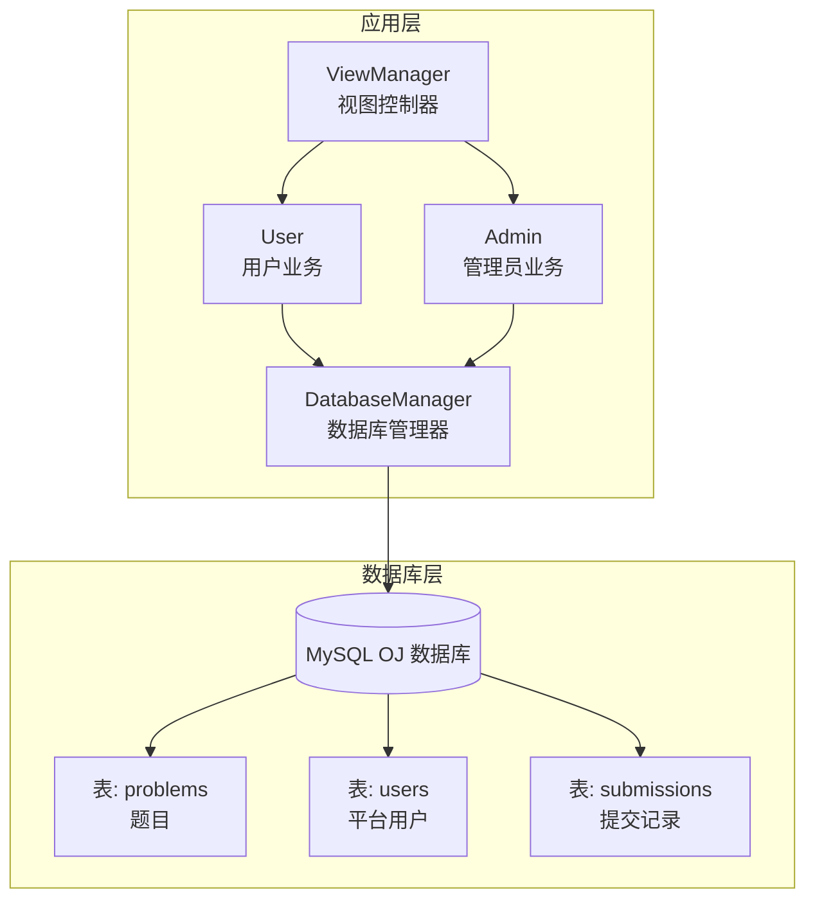
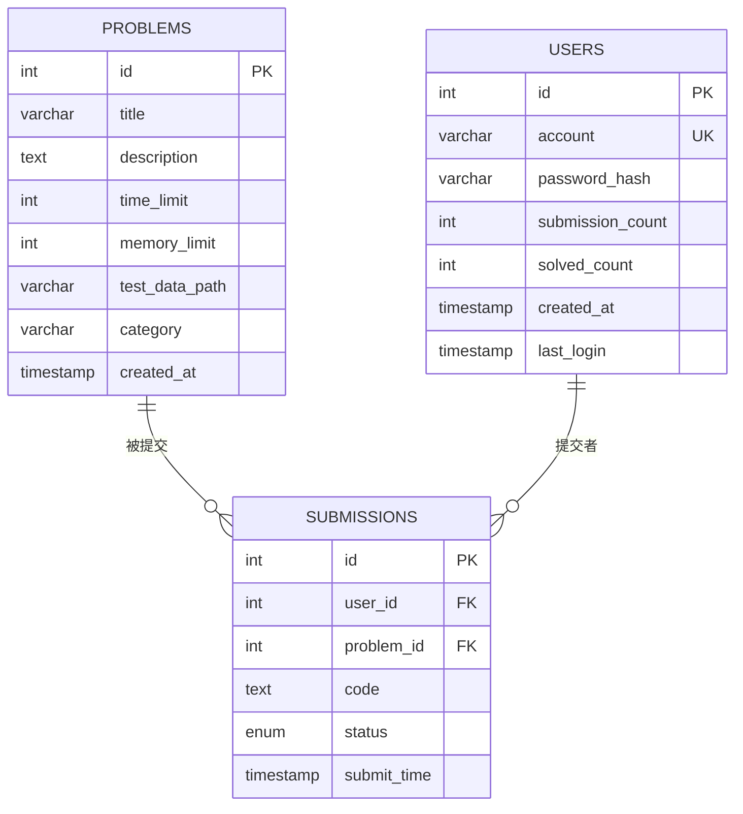
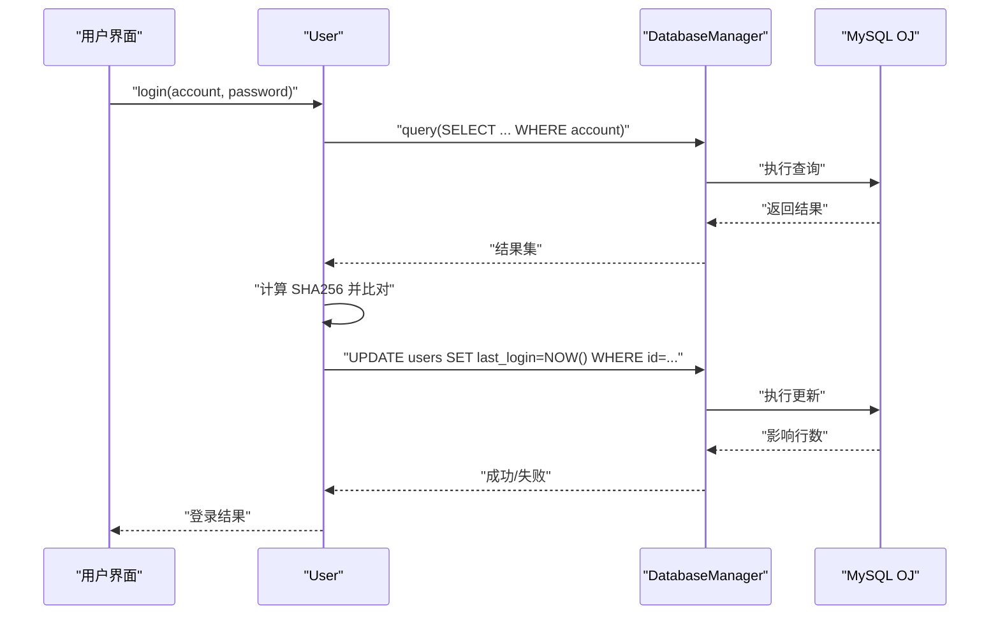
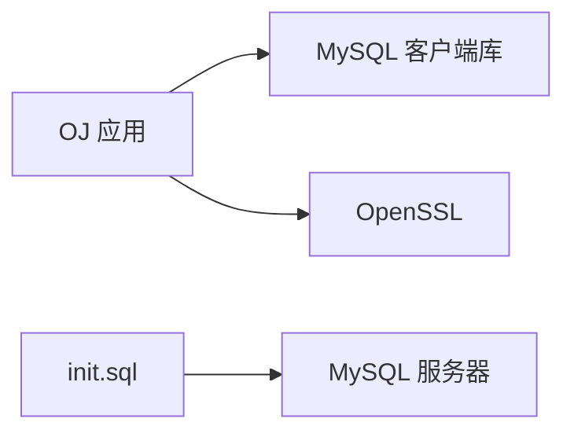

# 数据库设计

<cite>
**本文引用的文件**
- [init.sql](file://init.sql)
- [db_manager.h](file://include/db_manager.h)
- [db_manager.cpp](file://src/db_manager.cpp)
- [user.cpp](file://src/user.cpp)
- [admin.cpp](file://src/admin.cpp)
- [OJ_v0.1.md](file://History/OJ_v0.1.md)
- [OJ_v0.2.md](file://History/OJ_v0.2.md)
- [setup.sh](file://setup.sh)
- [CMakeLists.txt](file://CMakeLists.txt)
</cite>

## 目录
1. [简介](#简介)
2. [项目结构](#项目结构)
3. [核心组件](#核心组件)
4. [架构总览](#架构总览)
5. [详细组件分析](#详细组件分析)
6. [依赖分析](#依赖分析)
7. [性能考虑](#性能考虑)
8. [故障排查指南](#故障排查指南)
9. [结论](#结论)
10. [附录](#附录)

## 简介
本文件面向数据库管理员与后端开发者，系统性梳理 OJ 系统的数据库架构与设计要点，覆盖表结构、索引与外键、数据完整性、权限分离与安全访问控制、SQL 查询优化与访问模式、以及数据库迁移与版本升级管理方案。文档基于仓库中的初始化脚本、数据库管理器实现与相关历史文档整理而成，确保内容与实际代码一致。

## 项目结构
- 数据库初始化与权限配置集中在初始化脚本中，包含数据库创建、表结构定义、示例数据插入与数据库用户授权。
- 应用层通过数据库管理器封装 MySQL 连接与 SQL 执行，用户与管理员模块分别调用数据库管理器完成业务操作。
- 构建脚本与一键部署脚本提供了环境准备与数据库初始化的自动化流程。

图表来源
- [db_manager.h:12-46](file://include/db_manager.h#L12-L46)
- [db_manager.cpp:8-79](file://src/db_manager.cpp#L8-L79)
- [user.cpp:39-98](file://src/user.cpp#L39-L98)
- [admin.cpp:12-58](file://src/admin.cpp#L12-L58)
- [init.sql:15-61](file://init.sql#L15-L61)

章节来源
- [CMakeLists.txt:11-34](file://CMakeLists.txt#L11-L34)
- [setup.sh:14-29](file://setup.sh#L14-L29)

## 核心组件
- 数据库管理器：封装 MySQL 连接、查询与执行，提供统一的 SQL 访问接口。
- 用户模块：负责用户认证、注册、密码修改、题目浏览与提交入口（待实现）。
- 管理员模块：负责题目发布与查询。
- 初始化脚本：创建数据库、表、示例数据与数据库用户及其权限。

章节来源
- [db_manager.h:12-46](file://include/db_manager.h#L12-L46)
- [db_manager.cpp:21-57](file://src/db_manager.cpp#L21-L57)
- [user.cpp:39-137](file://src/user.cpp#L39-L137)
- [admin.cpp:12-58](file://src/admin.cpp#L12-L58)
- [init.sql:15-95](file://init.sql#L15-L95)

## 架构总览
- 数据库层采用 InnoDB 引擎，使用自增主键与外键约束保证参照完整性。
- 应用层通过单一数据库用户连接，行级隔离由应用层在 SQL 中通过条件过滤实现（如按当前用户 ID 过滤）。
- 权限分离：管理员用户拥有全权限，普通用户仅授予最小必要权限，配合应用层行级隔离实现安全访问。

图表来源
- [init.sql:15-61](file://init.sql#L15-L61)

## 详细组件分析

### 数据库表结构与约束
- 题目表（problems）
  - 主键：自增 id
  - 字段：标题、描述、时间/内存限制、测试数据路径、分类、创建时间
  - 索引：无显式索引（建议按查询场景增加索引）
- 用户表（users）
  - 主键：自增 id
  - 唯一约束：account
  - 字段：账号、密码哈希、提交数、解题数、注册时间、最后登录时间
  - 索引：account、created_at
- 提交记录表（submissions）
  - 主键：自增 id
  - 外键：user_id 引用 users.id，problem_id 引用 problems.id
  - 字段：用户 id、题目 id、代码、评测状态、提交时间
  - 索引：user_id、problem_id

章节来源
- [init.sql:15-61](file://init.sql#L15-L61)
- [OJ_v0.1.md:217-262](file://History/OJ_v0.1.md#L217-L262)
- [OJ_v0.2.md:209-221](file://History/OJ_v0.2.md#L209-L221)

### 索引策略与查询优化
- 现状
  - users 表：account、created_at 索引
  - submissions 表：user_id、problem_id 索引
- 建议
  - users 表：account 索引已满足登录/查询需求；可考虑在 last_login 上加索引以优化登录统计与活跃度查询。
  - problems 表：若频繁按 category 查询，建议增加 category 索引；若按标题模糊查询较多，可考虑全文索引或前缀索引。
  - submissions 表：user_id 索引满足“查看我的提交”；若需要按题目维度统计或按时间范围查询，可考虑复合索引（problem_id, submit_time）或（user_id, submit_time）。
  - 统计类查询：对 status 进行分组统计时，可在 status 上建立索引以提升 COUNT(*) 分组效率。

章节来源
- [init.sql:36-38](file://init.sql#L36-L38)
- [init.sql:59-60](file://init.sql#L59-L60)
- [OJ_v0.1.md:217-262](file://History/OJ_v0.1.md#L217-L262)

### 外键关系与数据完整性
- submissions.user_id → users.id
- submissions.problem_id → problems.id
- 通过外键约束保证删除用户或题目时的参照完整性；应用层应避免删除仍有提交记录的数据。

章节来源
- [init.sql:57-58](file://init.sql#L57-L58)
- [OJ_v0.1.md:247-261](file://History/OJ_v0.1.md#L247-L261)

### 权限分离与安全访问控制
- 数据库用户
  - oj_admin：localhost，全权限（SELECT/INSERT/UPDATE/DELETE），用于管理员后台。
  - oj_user：%（任意主机），最小权限集合：
    - problems：SELECT（只读）
    - users：SELECT/INSERT/UPDATE（允许注册、查询与修改自己的账户信息）
    - submissions：SELECT/INSERT（允许提交与查看历史）
- 行级隔离
  - 应用层通过在 SQL 中加入 WHERE id = current_user_id 等条件实现行级隔离，确保用户只能访问自身数据。
- 安全建议
  - 使用参数化查询或 ORM 防止 SQL 注入（当前实现存在拼接 SQL 的风险，建议逐步改造）。
  - 密码存储使用 SHA256 哈希，建议引入盐值与更安全的密码哈希算法（如 bcrypt）。
  - 严格限制 oj_user 的权限范围，避免不必要的写权限。

章节来源
- [init.sql:71-92](file://init.sql#L71-L92)
- [user.cpp:44-67](file://src/user.cpp#L44-L67)
- [user.cpp:88-97](file://src/user.cpp#L88-L97)
- [user.cpp:127-128](file://src/user.cpp#L127-L128)
- [OJ_v0.2.md:215-220](file://History/OJ_v0.2.md#L215-L220)

### 数据访问模式与查询流程
- 用户登录
  - 查询 users.account 获取密码哈希，比对 SHA256 哈希后更新 last_login。
- 用户注册
  - 检查 account 是否存在，不存在则插入新用户。
- 修改密码
  - 通过 current_user_id 查询旧密码哈希，校验通过后更新新密码哈希。
- 题目浏览
  - 列表：查询 problems 并格式化输出。
  - 详情：查询指定 id 的题目。
- 提交入口
  - 当前实现为占位，后续需完善提交记录写入与状态更新。

图表来源
- [user.cpp:39-71](file://src/user.cpp#L39-L71)
- [db_manager.cpp:26-57](file://src/db_manager.cpp#L26-L57)

章节来源
- [user.cpp:39-137](file://src/user.cpp#L39-L137)
- [db_manager.cpp:21-57](file://src/db_manager.cpp#L21-L57)

### 数据库迁移与版本升级管理
- 现状
  - 初始化脚本包含数据库、表、示例数据与权限配置，版本演进通过历史文档记录。
- 建议
  - 引入版本表：创建 schema_version 表记录当前数据库版本，迁移脚本按版本号顺序执行。
  - 分离 DDL 与 DML：DDL（结构变更）与 DML（数据变更）分开管理，便于回滚与审计。
  - 自动化迁移：在应用启动时检测版本并自动执行迁移，或提供独立迁移工具。
  - 权限变更：权限调整也纳入迁移脚本，确保生产环境一致性。
  - 备份策略：每次迁移前备份数据库，迁移后验证数据完整性。

章节来源
- [OJ_v0.1.md:266-272](file://History/OJ_v0.1.md#L266-L272)
- [OJ_v0.2.md:215-220](file://History/OJ_v0.2.md#L215-L220)

## 依赖分析
- 构建依赖
  - MySQL 客户端库（mysqlclient）
  - OpenSSL（用于 SHA256 哈希）
- 运行时依赖
  - MySQL 服务器（本地或远程）
  - 初始化脚本用于创建数据库、表与用户

图表来源
- [CMakeLists.txt:11-34](file://CMakeLists.txt#L11-L34)
- [setup.sh:14-29](file://setup.sh#L14-L29)

章节来源
- [CMakeLists.txt:11-34](file://CMakeLists.txt#L11-L34)
- [setup.sh:14-29](file://setup.sh#L14-L29)

## 性能考虑
- 查询性能
  - 为高频查询字段建立合适索引（如 users.account、submissions.user_id、problems.category）。
  - 避免 SELECT *，仅查询所需列。
- 写入性能
  - 批量插入示例数据时使用批量语法或事务包裹。
  - 控制并发写入，避免热点表（如 submissions）的高并发竞争。
- 缓存策略
  - 对只读表（problems）可考虑应用层缓存热点题目，减少数据库压力。
- 连接管理
  - 数据库管理器为每个会话创建连接，建议在应用层引入连接池以降低连接开销。

## 故障排查指南
- 连接失败
  - 检查 MySQL 服务状态与凭据；确认 init.sql 中的数据库用户密码正确。
- 权限不足
  - 确认 oj_user 的权限是否按要求授予；检查 FLUSH PRIVILEGES 是否生效。
- 查询异常
  - 检查 SQL 拼接是否正确，是否存在注入风险；逐步缩小问题范围。
- 初始化失败
  - 使用一键部署脚本执行初始化，确保 root 密码正确且 init.sql 可读。

章节来源
- [db_manager.cpp:61-79](file://src/db_manager.cpp#L61-L79)
- [init.sql:71-95](file://init.sql#L71-L95)
- [setup.sh:14-29](file://setup.sh#L14-L29)

## 结论
本设计以最小权限原则与行级隔离为核心，结合外键约束与索引策略，构建了清晰的数据库层。通过初始化脚本与历史文档，系统具备可追溯的版本演进能力。建议在后续版本中引入参数化查询、连接池、schema 版本管理与更安全的密码存储方案，持续提升安全性与可维护性。

## 附录
- 初始化与部署
  - 使用一键部署脚本创建目录并执行初始化脚本。
  - 通过 CMake 构建项目，运行可执行文件。
- 常用操作
  - 初始化数据库：执行初始化脚本。
  - 构建项目：进入 build 目录，执行 cmake 与 make。
  - 运行程序：./oj_app。

章节来源
- [setup.sh:14-40](file://setup.sh#L14-L40)
- [CMakeLists.txt:24-34](file://CMakeLists.txt#L24-L34)
- [OJ_v0.1.md:357-377](file://History/OJ_v0.1.md#L357-L377)
- [OJ_v0.2.md:332-356](file://History/OJ_v0.2.md#L332-L356)