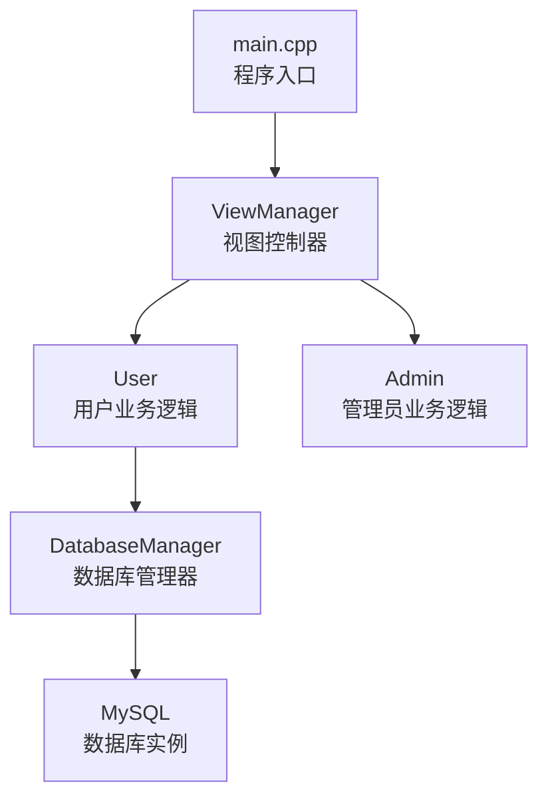
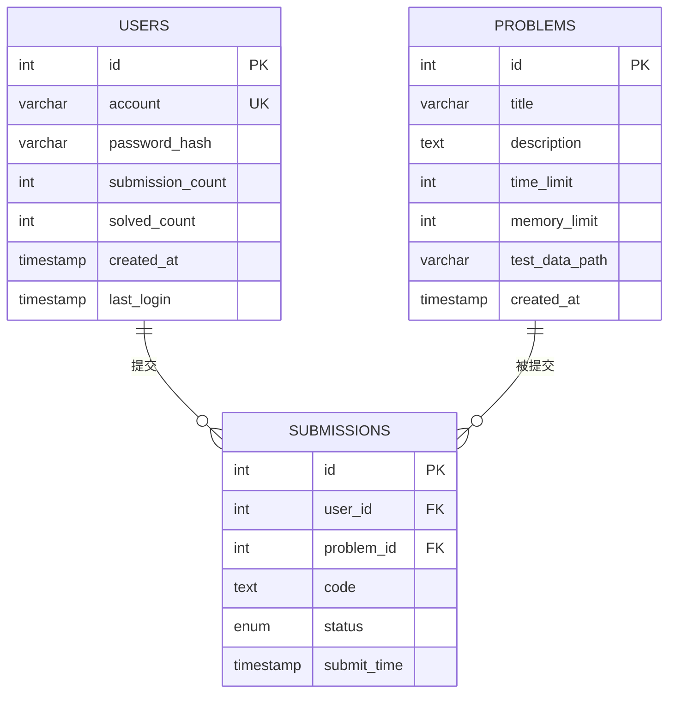
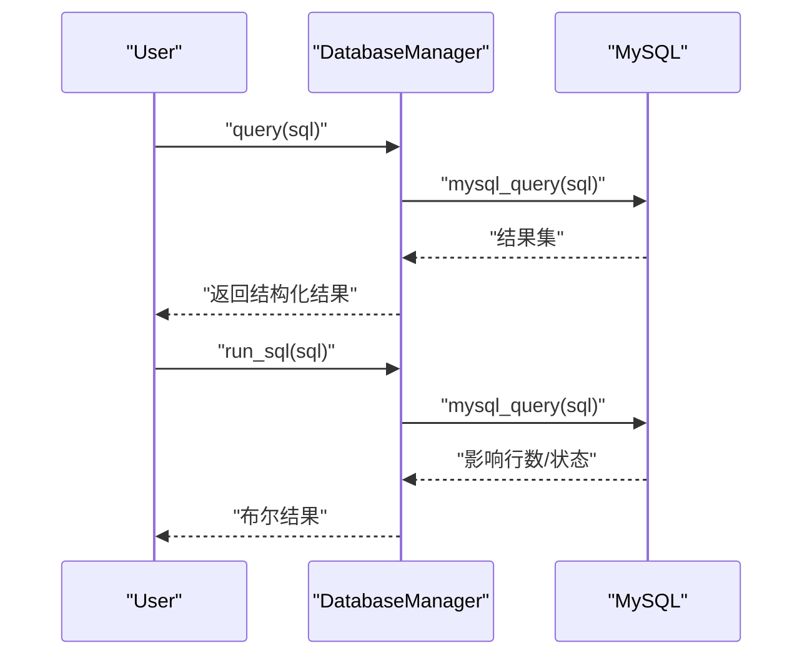
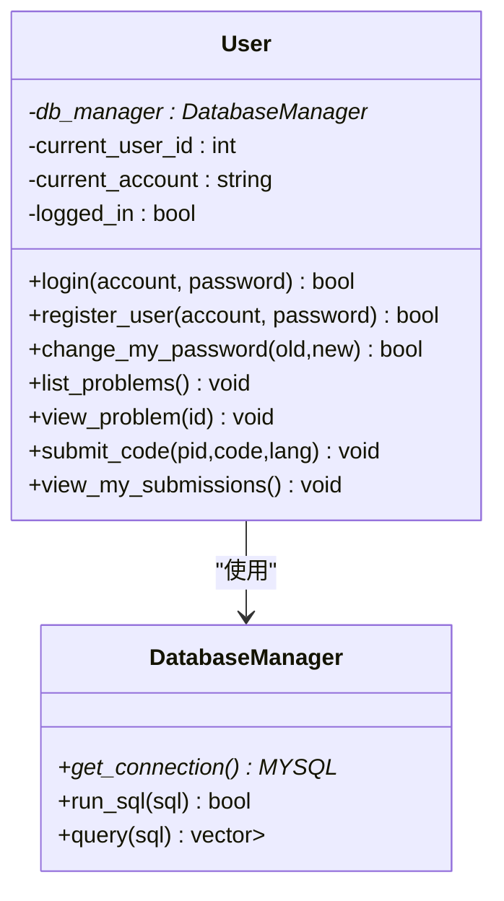

# 数据库设计

<cite>
**本文引用的文件**
- [init.sql](file://init.sql)
- [db_manager.h](file://include/db_manager.h)
- [db_manager.cpp](file://src/db_manager.cpp)
- [user.h](file://include/user.h)
- [user.cpp](file://src/user.cpp)
- [OJ_v0.1.md](file://History/OJ_v0.1.md)
- [OJ_v0.2.md](file://History/OJ_v0.2.md)
- [main.cpp](file://src/main.cpp)
</cite>

## 目录
1. [简介](#简介)
2. [项目结构](#项目结构)
3. [核心组件](#核心组件)
4. [架构总览](#架构总览)
5. [详细组件分析](#详细组件分析)
6. [依赖关系分析](#依赖关系分析)
7. [性能考量](#性能考量)
8. [故障排查指南](#故障排查指南)
9. [结论](#结论)
10. [附录](#附录)

## 简介
本文件为 OJ 在线判题系统的数据库设计文档，基于现有代码与初始化脚本，系统性阐述数据库架构、表结构、字段定义、索引与约束、数据访问模式、安全与权限策略，并给出架构图、示例数据与迁移建议。当前版本聚焦于用户、题目与提交记录三张核心表，后续版本将扩展评测状态、排行榜等功能。

## 项目结构
- 数据库初始化脚本负责创建数据库、表、索引与用户权限。
- C++ 层通过 DatabaseManager 封装 MySQL 连接与 SQL 执行，User 类通过该管理器完成用户认证、题目浏览与提交记录的占位实现。
- 系统启动入口不直接连接数据库，角色切换后才建立数据库连接，降低连接压力。

图表来源
- [main.cpp:5-13](file://src/main.cpp#L5-L13)
- [db_manager.h:12-46](file://include/db_manager.h#L12-L46)
- [user.h:10-86](file://include/user.h#L10-L86)

章节来源
- [main.cpp:5-13](file://src/main.cpp#L5-L13)
- [OJ_v0.1.md:13-65](file://History/OJ_v0.1.md#L13-L65)

## 核心组件
- DatabaseManager：封装 MySQL 连接、查询与执行，提供 run_sql 与 query 接口。
- User：封装用户认证、注册、修改密码、题目浏览、提交代码与查看提交记录等业务方法。
- 表结构：problems（题目）、users（用户）、submissions（提交记录），具备主键、外键、索引与约束。

章节来源
- [db_manager.h:12-46](file://include/db_manager.h#L12-L46)
- [db_manager.cpp:8-99](file://src/db_manager.cpp#L8-L99)
- [user.h:10-86](file://include/user.h#L10-L86)
- [user.cpp:39-222](file://src/user.cpp#L39-L222)

## 架构总览
数据库层采用 MySQL，使用 InnoDB 引擎；应用层通过 DatabaseManager 统一访问数据库。用户表与提交记录表通过外键关联，形成清晰的一对多关系。权限模型采用“单一数据库用户 + 应用层行级隔离”的策略，避免跨用户数据泄露。

图表来源
- [init.sql:14-60](file://init.sql#L14-L60)

## 详细组件分析

### 数据库初始化与权限
- 初始化脚本负责创建数据库、表、索引与用户权限。
- 配置了密码策略以适配不同 MySQL 版本。
- 创建两类数据库用户：
  - oj_admin：全权限，用于管理端。
  - oj_user：受限权限，复用该账号连接数据库，行级隔离由应用层控制（如 WHERE id = current_user_id）。

章节来源
- [init.sql:8-94](file://init.sql#L8-L94)
- [OJ_v0.2.md:215-221](file://History/OJ_v0.2.md#L215-L221)

### 表结构与字段定义

#### problems（题目表）
- 字段
  - id：自增主键
  - title：题目名称，非空
  - description：题目描述，文本
  - time_limit：时间限制（毫秒）
  - memory_limit：内存限制（MB）
  - test_data_path：测试数据路径
  - created_at：创建时间，默认当前时间戳
- 索引与约束
  - 主键：id
  - 默认引擎：InnoDB
- 设计说明
  - 用于存储题目元信息，支持按 id 查询与排序。

章节来源
- [init.sql:14-23](file://init.sql#L14-L23)
- [OJ_v0.1.md:217-229](file://History/OJ_v0.1.md#L217-L229)

#### users（用户表）
- 字段
  - id：自增主键
  - account：登录账号，唯一且非空
  - password_hash：密码哈希（SHA256），非空
  - submission_count：提交题目数量，默认 0
  - solved_count：解决题目数量，默认 0
  - created_at：注册时间，默认当前时间戳
  - last_login：最后登录时间，允许为空
- 索引与约束
  - 主键：id
  - 唯一索引：account
  - 普通索引：idx_account(account)、idx_created_at(created_at)
  - 默认引擎：InnoDB
- 设计说明
  - 存储平台用户信息，应用层通过 account 唯一定位用户，通过行级过滤实现权限隔离。

章节来源
- [init.sql:25-38](file://init.sql#L25-L38)
- [OJ_v0.1.md:231-245](file://History/OJ_v0.1.md#L231-L245)

#### submissions（提交记录表）
- 字段
  - id：自增主键
  - user_id：提交用户ID，非空
  - problem_id：题目ID，非空
  - code：提交的代码，文本
  - status：评测状态，枚举值（默认 Pending）
  - submit_time：提交时间，默认当前时间戳
- 索引与约束
  - 主键：id
  - 外键：user_id 引用 users.id；problem_id 引用 problems.id
  - 普通索引：idx_user_id(user_id)、idx_problem_id(problem_id)
  - 默认引擎：InnoDB
- 设计说明
  - 记录用户对题目的提交历史，status 字段预留评测状态，当前应用层仅占位。

章节来源
- [init.sql:40-60](file://init.sql#L40-L60)
- [OJ_v0.1.md:247-262](file://History/OJ_v0.1.md#L247-L262)

### 数据访问模式
- DatabaseManager
  - run_sql：执行任意 SQL（如 INSERT/UPDATE/DELETE），失败时输出错误信息。
  - query：执行查询并返回结构化结果（列名 -> 值 的映射集合）。
- User
  - login/register/change_my_password/list_problems/view_problem：均通过 DatabaseManager 执行 SQL。
  - submit_code/view_my_submissions：当前为占位实现，尚未写入数据库。

图表来源
- [db_manager.cpp:26-57](file://src/db_manager.cpp#L26-L57)
- [db_manager.cpp:81-99](file://src/db_manager.cpp#L81-L99)

章节来源
- [db_manager.h:12-46](file://include/db_manager.h#L12-L46)
- [db_manager.cpp:8-99](file://src/db_manager.cpp#L8-L99)
- [user.cpp:39-222](file://src/user.cpp#L39-L222)

### 数据验证与业务规则
- 用户认证
  - 登录：根据 account 查询 users，比对 SHA256 哈希，成功则更新 last_login。
  - 注册：检查 account 是否已存在，不存在则插入新用户。
  - 修改密码：先校验旧密码哈希，再更新为新哈希。
- 题目浏览
  - list_problems：按 id 升序列出题目基本信息。
  - view_problem：按 id 查询题目详情。
- 提交记录
  - submit_code/view_my_submissions：当前占位，未来将写入 submissions 表并维护用户统计字段。

章节来源
- [user.cpp:39-137](file://src/user.cpp#L39-L137)
- [user.cpp:139-199](file://src/user.cpp#L139-L199)
- [user.cpp:201-222](file://src/user.cpp#L201-L222)

### 索引策略与约束
- users
  - 主键：id
  - 唯一索引：account（保证账号唯一）
  - 普通索引：idx_account、idx_created_at（加速登录与注册时间筛选）
- submissions
  - 主键：id
  - 外键：user_id -> users.id；problem_id -> problems.id
  - 普通索引：idx_user_id、idx_problem_id（加速按用户与题目的查询）

章节来源
- [init.sql:35-37](file://init.sql#L35-L37)
- [init.sql:58-59](file://init.sql#L58-L59)

### 数据生命周期、保留策略与归档
- 当前未定义明确的数据保留期与归档规则。
- 建议
  - 对 submissions 表按用户或时间维度进行定期清理或归档，避免历史数据无限增长。
  - 对 users 表可设置“长期未登录”清理策略（需结合业务需求）。

[本节为通用建议，不直接分析具体文件]

### 数据迁移路径与版本管理
- 版本演进
  - v0.1：定义基础表结构与权限模型。
  - v0.2：更新 users 表权限（增加 INSERT 权限以支持注册），优化 CLI 清屏与 SQL 输出策略。
- 迁移建议
  - 从 v0.1 升级到 v0.2：执行 init.sql，自动授予 oj_user 的 INSERT 权限；如已有用户数据，确保 account 唯一性。
  - 后续版本：若新增字段（如评测耗时、语言、标签等），应通过 ALTER TABLE 逐步迁移，并在 init.sql 中补充默认值与索引。

章节来源
- [OJ_v0.1.md:215-272](file://History/OJ_v0.1.md#L215-L272)
- [OJ_v0.2.md:213-221](file://History/OJ_v0.2.md#L213-L221)

### 数据安全、隐私与访问控制
- 权限模型
  - oj_admin：全权限，用于管理端。
  - oj_user：受限权限，仅授予对 problems/users/submissions 的必要操作。
  - 应用层通过行级过滤（如 WHERE id = current_user_id）实现用户隔离。
- 加密与哈希
  - 密码采用 SHA256 哈希存储，符合最小暴露原则。
- 建议
  - 生产环境建议启用更强的密码策略与 TLS 连接。
  - 对敏感字段（如密码哈希）进行最小化访问控制与审计。

章节来源
- [init.sql:67-94](file://init.sql#L67-L94)
- [user.cpp:13-37](file://src/user.cpp#L13-L37)

## 依赖关系分析
- DatabaseManager 依赖 MySQL C API，提供连接与查询能力。
- User 依赖 DatabaseManager，封装业务逻辑。
- 表之间通过外键建立关系，应用层通过行级过滤实现权限隔离。

图表来源
- [db_manager.h:12-46](file://include/db_manager.h#L12-L46)
- [user.h:10-86](file://include/user.h#L10-L86)

章节来源
- [db_manager.h:12-46](file://include/db_manager.h#L12-L46)
- [user.h:10-86](file://include/user.h#L10-L86)

## 性能考量
- 索引
  - users.idx_account：加速登录与注册校验。
  - users.idx_created_at：支持按注册时间筛选。
  - submissions.idx_user_id、submissions.idx_problem_id：支持按用户与题目检索提交记录。
- 查询模式
  - 登录与注册：基于 account 的等值查询，受益于唯一索引。
  - 题目列表：ORDER BY id，适合小规模数据；大规模时可考虑分页与覆盖索引。
- 连接策略
  - 应用启动不直接连接数据库，角色切换后再建立连接，减少长连接占用。
- 建议
  - 对高频查询（如按用户统计）可引入物化视图或缓存层（Redis/Memcached）。
  - 对 submissions 表可按月/季度分区，提升大表查询与维护效率。

[本节提供通用指导，不直接分析具体文件]

## 故障排查指南
- 连接失败
  - 检查 init.sql 中的数据库用户与权限是否正确授予。
  - 确认 MySQL 服务运行与网络可达。
- 查询失败
  - DatabaseManager::query 会在失败时输出错误信息，优先检查 SQL 语法与表名大小写。
- 权限不足
  - oj_user 需要 INSERT 权限用于注册；若报错，请确认 v0.2 权限更新已执行。
- 登录/注册异常
  - 确认 account 唯一性；检查 SHA256 哈希生成逻辑与数据库存储格式。

章节来源
- [db_manager.cpp:32-36](file://src/db_manager.cpp#L32-L36)
- [db_manager.cpp:86-89](file://src/db_manager.cpp#L86-L89)
- [init.sql:67-94](file://init.sql#L67-L94)

## 结论
当前数据库设计围绕用户、题目与提交记录三张核心表展开，具备清晰的主外键关系与必要的索引，配合应用层的行级隔离与最小权限策略，满足基础 OJ 功能。后续可在提交记录表中完善评测状态字段，并引入缓存与分区策略以提升性能与可维护性。

## 附录

### 示例数据
- 示例题目
  - id=1，标题“A+B Problem”，时间限制 1000ms，内存限制 128MB，测试数据路径示例。
- 示例平台用户
  - 账号 test_user，密码 123456（SHA256 哈希已预置）。

章节来源
- [init.sql:96-132](file://init.sql#L96-L132)

### 数据访问模式要点
- 登录/注册/修改密码：基于 users 表的等值查询与更新。
- 题目浏览：基于 problems 表的查询与排序。
- 提交记录：基于 submissions 表的插入与查询（当前占位）。

章节来源
- [user.cpp:39-137](file://src/user.cpp#L39-L137)
- [user.cpp:139-199](file://src/user.cpp#L139-L199)
- [user.cpp:201-222](file://src/user.cpp#L201-L222)